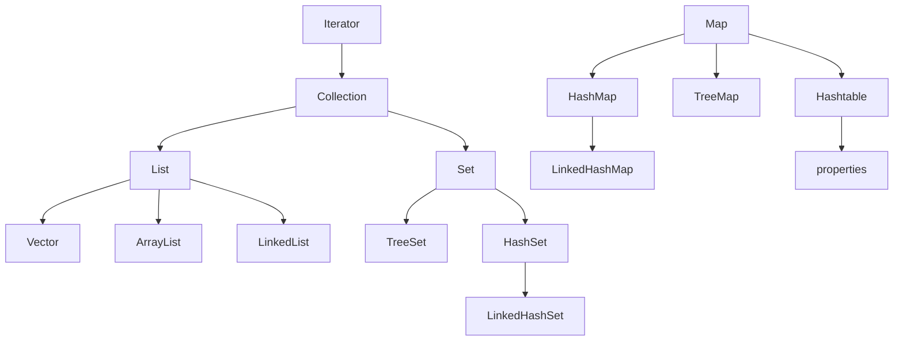
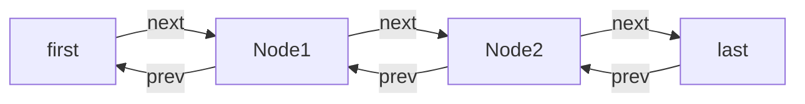
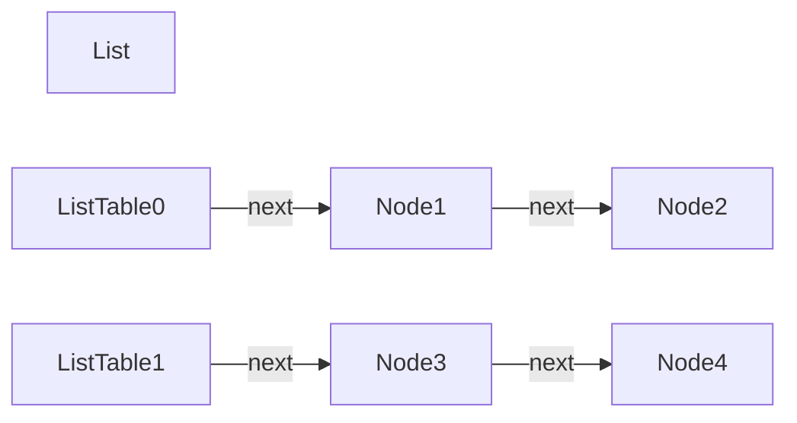
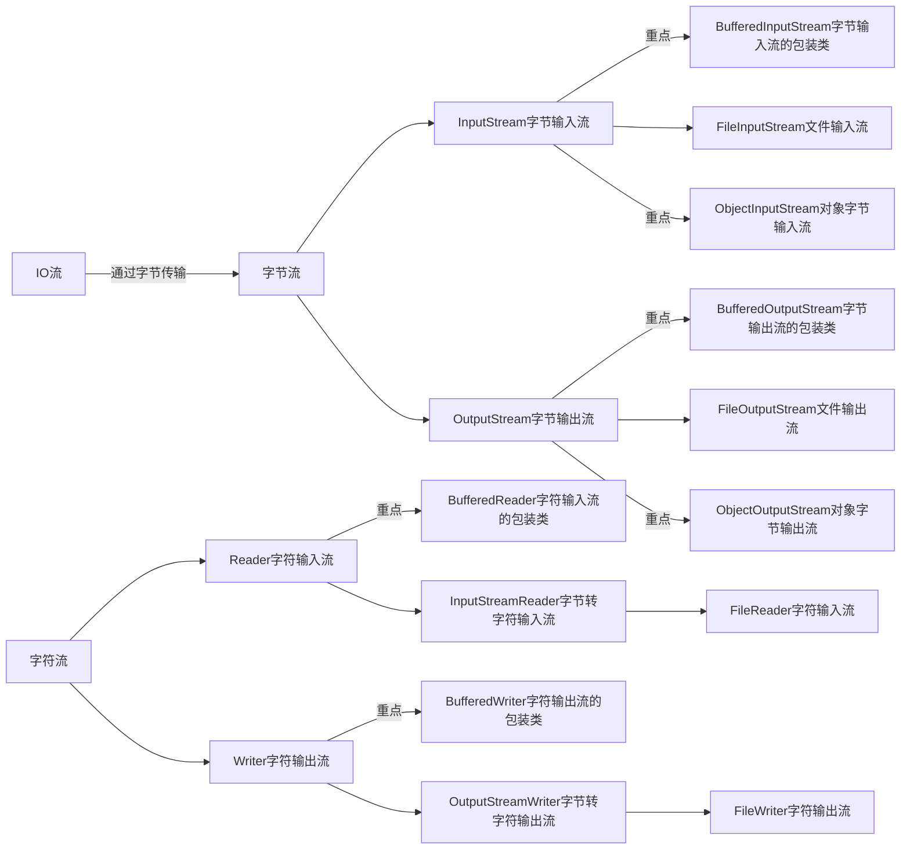
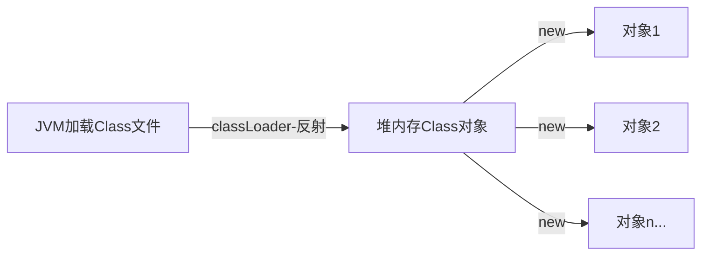

# Java

## let’s go

java se = 桌面软件

java ee  = web

android kotlin  = 手机 

## jdk

java JDK 包含了java开发工具(java、javac等)和jre(java运行环境)

jre = JVM(java虚拟机) + Java核心类库

## 环境变量

直接我的电脑系统变量Path配置 jdk bin目录和 jre bin目录(根本不需要什么JAVA_HOME这种的，如果还要配置jdk下的其他目录，直接加就行了,简单明了)

```java
D:\jdk1.8.0_191\bin
D:\jdk1.8.0_191\jre\bin
```

输入cmd 输入 java -version查看版本

## HelloWorld

```java
public class HelloWorld {
    public static void main(String[] args) {
        System.out.print("hello world!");
    }
}
```

## 编译

javac HelloWorld.java

tips：乱码运行时后面加上 -encoding utf8

## 运行

java HelloWorld

```java
PS D:\sxc\javastudy> java HelloWorld
hello world!
```

## args

这里的String[] args 和python里的*args差不多 不确定个数的参数打包数组

如何查看

```java
public class HelloWorld {
    public static void main(String[] args) {
        for (int i = 0; i < args.length; i++) {
            System.out.println(args[i]);
        }
        System.out.print("hello world!");
    }
}
```

编译运行查看输出

```java
PS D:\sxc\javastudy> javac HelloWorld.java
PS D:\sxc\javastudy> java HelloWorld -s -c
-s
-c
hello world!
```

tips：public修饰类有且仅有一个 文件名按public类名来命名,main方法可以写在非public类中

## VsCode运行配置

```json
{
  "code-runner.runInTerminal": true,
  "code-runner.executorMap": {
      "java": "chcp 936 && cd $dir && javac -encoding utf-8 $fileName && java $fileNameWithoutExt",
  },
}
```

自己去快捷键绑定  alt+insert(源代码操作) 用于快速生成构造方法 set get tostring等

## IDEA

ctrl+alt+t 包围代码

iter 增强for循环

## api文档

[https://www.matools.com/api/java8](https://www.matools.com/api/java8)

[https://docs.oracle.com/javase/8/docs/api/](https://docs.oracle.com/javase/8/docs/api/)

[https://devdocs.io/](https://devdocs.io/)

## 常用数据类型

```java
public class VarType {
    public static void main(String[] args) {
        // 整形
        int a = 123;
        int b = 345;
        System.out.println(a);
        System.out.println(b);
        //长整形
        long la = 123456;
        System.out.println(la);
        // 单精度浮点数
        float c = 3.14f;
        System.out.println(c);
        // 双精度浮点数
        double d = 3.1415926;
        System.out.println(d);
        // 字符串ps:不是基本数据类型
        String str = "hello world";
        System.out.println(str);
        // 单个字符 单引号
        char word = 97;
        System.out.println(word);
        // 布尔值
        boolean boolTrue = true;
        boolean boolFalse = false;
        System.out.println(boolTrue);
        System.out.println(boolFalse);
    }
}
```

## 类型转换

char-int-long-float-double

byte-short-int-long-float-double

从大的类型转到小就要用强转 比如double转到int 需要 (int)double

```java
public class VarType {
    public static void main(String[] args) {
        // 强制类型转换
        byte a = 97;
        byte b = 2;
        byte c = (byte) (a + b);
        char word = (char) (a + b);
        // int转String
        String str = Integer.toString(1000);
        // double转String
        String str2 = Double.toString(1000.0);
        // String转int
        int num = Integer.parseInt(str);
        System.out.println(c);// 输出99
        System.out.println(word);// 输出c
        System.out.println(str);// 输出1000
        System.out.println(str2);// 输出1000.0
        System.out.println(num);// 输出1000
        // +号强转
        System.out.println(num + "");// 输出1000

    }
}
```

## 逻辑运算符

```java
public class AndOr {
    public static void main(String[] args) {
        int a = 1, b = 3;
        // && 短路规则 => 前面的条件如果为false后面的就不执行
        if (a > b && ++b == 4) {
            // ++b没执行
        }
        System.out.println("b=" + b);
        // & 不遵循短路规则 => 前面的如果是false那后面的也执行
        a = 1;
        b = 3;
        if (a > b & ++b == 4) {
            // ++b执行了
        }
        System.out.println("b=" + b);

    }
}
```

## 条件语句

```java
public class IfElse {
    public static void main(String[] args) {
        boolean a = true;
        boolean b = false;
        if (a) {
            System.out.println("a");
        } else if (!b) {
            System.out.println("因为a满足了不会输出,a满足了就跳出这个if else if else代码块了");
        } else {
            System.out.println("因为a满足了不会输出,else不会输出的");
        }
    }
}
```

## 三元运算符

```java
public class Demo {
    public static void main(String[] args) {
        // 继承关系Integer/Double -> Number -> Object
        // 三元运算符 条件真？则取1：否则取2
        Object num = true ? new Integer(1) : new Double(2.0);
        System.out.println(num);// 会输出1.0 是因为三元运算符是一个整体 :两边的类型要一致 这里Integer直接类型提升了为Double了
    }
}
```

## 循环

### for循环计算1到100的和

```java
public class SumNumber {
    public static void main(String[] args) {
        int sum = 0;
        for (int i = 1; i < 101; i++) {
            sum+=i;
        }
        System.out.println(sum);
    }
}
```

### for循环输出列表

```java
public class Demo {
    public static void main(String[] args) {
        int[] arr = { 1, 2, 3, 4 };
        for (int i = 0; i < arr.length; i++) {
            System.out.println(arr[i]);
        }
    }
}
```

### for循环打印99乘法表

```java
public class Demo {
    public static void main(String[] args) {
        for (int i = 1, j = 1; i <= 9; i++) {
            for (j = 1; j <= i; j++) {
                System.out.print(i + "*" + j + " = " + i * j + "  ");
            }
            System.out.println("\n");
        }
    }
}
```

### while循环最好是用在不确定循环次数的时,也可计算0到100的和

```java
public class Demo {
    public static void main(String[] args) {
        int sum = 0;
        int i = 1;
        while (true) {
            if (i <= 100) {
                sum += i;
                i++;
            } else {
                break;
            }
        }
        System.out.println(sum);
    }
}
```

练习：

**打印金字塔**

```
     *
    ***
   *****
  *******
 *********
***********
```

```java
public class Demo {
    public static void main(String[] args) {
        int line = 6;
        for (int i = 1; i <= line; i++) {
            for (int j = 0; j < line - i; j++) {
                System.out.print(" ");
            }
            for (int j = 0; j < i*2-1; j++) {
                System.out.print("*");
            }
            System.out.println();
        }
    }
}
```

**打印镂空金字塔**

```
         *
        * *
       *   *
      *     *
     *       *
    *         *
   *           *
  *             *
 *               *
*******************
```

```java
public class Demo {
    public static void main(String[] args) {
        int line = 10;
        for (int i = 1; i <= line; i++) {
            for (int j = 0; j < line - i; j++) {
                System.out.print(" ");
            }
            for (int j = 0; j < i * 2 - 1; j++) {
                if (i > 1 && i < line) {
                    if (j == 0 || j == i * 2 - 2) {
                        System.out.print("*");
                    } else {
                        System.out.print(" ");
                    }
                } else {
                    System.out.print("*");
                }
            }
            System.out.println();
        }
    }
}
```

### break用法

这里记录一下break可以跳出for循环标签，其他语言类似，continue也可以跳到指定标签运行

```java
public class Demo {
    public static void main(String[] args) {
        outer: for (int i = 0; i < 3; i++) {
            for (int j = 0; j < 3; j++) {
                if (j > 0)
                    break outer;
            }
            System.out.println("我不会输出，因为已经跳出最外层循环outer");
        }
    }
}
```

## 增强for循环foreach

vscode输入foreach或者iter

增强for循环就是简化版的迭代器Iterator

```java
public class Demo {
    public static void main(String[] args) {
        int[] arr = { 1, 2, 3, 4 };
        for (int i : arr) {
            System.out.println(i);
        }
    }
}
```

## 数组

### 基本操作

```java
import java.util.Arrays;

public class Demo {
    public static void main(String[] args) {
        // 定义一个数组
        double[] arr = { 1, 5, 1, 3.4, 2, 50 };
        // 或者 这种初始化是长度位6的空数组
        double[] arr1 = new double[6];
        // 牛逼初始化
        double[] arr2 = new double[] { 1, 5, 1, 3.4, 2, 50 };
        // 定义一个二维数组
        // 静态赋值
        double[][] arr3 = { { 1, 2.0 }, { 3.0 } };
        // 声明一个空数组
        double[][] arr4 = new double[6][1];
        // 动态赋值数组长度
        double[][] arr5 = new double[6][];
        // 打印某个值
        System.out.println(arr[0]);// 输出1.0
        // 赋值
        arr[0] = 3;
        // 打印数组
        System.out.println(Arrays.toString(arr)); // 输出[3.0, 5.0, 1.0, 3.4, 2.0, 50.0]
        // 遍历数组
        for (double item : arr) {
            System.out.print(item); // 输出3.05.01.03.42.050.0
        }
        System.out.println();
        for (int i = 0; i < arr.length; i++) {
            System.out.print(arr[i]); // 输出3.05.01.03.42.050.0
        }
        System.out.println();
        // 数组长度
        System.out.println(arr.length);// 输出6

    }
}
```

### 常用方法

```java
import java.util.Arrays;

public class Demo {
    public static void main(String[] args) {
        // 定义一个数组
        double[] arr = { 1, 5, 1, 3.4, 2, 50 };
        // 复制拷贝一个数组
        double[] arr2 = arr.clone();
        System.out.println(Arrays.toString(arr2));// 输出[1.0, 5.0, 1.0, 3.4, 2.0, 50.0]
        // 数组反转
        double[] arrReverse = new double[arr.length];
        for (int i = 0; i < arr.length; i++) {
            arrReverse[i] = arr[arr.length - 1 - i];
        }
        System.out.println(Arrays.toString(arrReverse));// 输出[50.0, 2.0, 3.4, 1.0, 5.0, 1.0]
    }
}
```

**二维数组案例**

输出10行的杨辉三角

```java
import java.util.Arrays;

public class Demo {
    public static void main(String[] args) {
        // 定义一个数组
        int[][] arr = new int[10][];
        for (int i = 0; i < arr.length; i++) {
            arr[i] = new int[i + 1];
            for (int j = 0; j < i + 1; j++) {
                if (j == 0 || j == i) {
                    arr[i][j] = 1;
                } else {
                    arr[i][j] = arr[i - 1][j - 1] + arr[i - 1][j];
                }
            }
        }
        for (int[] item : arr) {
            System.out.println(Arrays.toString(item));
        }
    }
}
```

```
[1]
[1, 1]
[1, 2, 1]
[1, 3, 3, 1]
[1, 4, 6, 4, 1]
[1, 5, 10, 10, 5, 1]
[1, 6, 15, 20, 15, 6, 1]
[1, 7, 21, 35, 35, 21, 7, 1]
[1, 8, 28, 56, 70, 56, 28, 8, 1]
[1, 9, 36, 84, 126, 126, 84, 36, 9, 1]
```

## 面向对象

### 创建类

```java
public class Demo {

    public static void main(String[] args) {
        Person person1 = new Person("小白", 3);
        Person person2 = new Person("小花", 100);
        System.out.println(person1.getCat());// 输出 小白 3
        System.out.println(person2.getCat());// 输出 小花 100
    }
}

class Person {
    private String name = "";
    private int age = 0;

    // 构造方法
    public Person(String name, int age) {
        this.name = name;
        this.age = age;
    }

    public String getCat() {
        return name + " " + age;
    }
}
```

### 变量

全局变量（成员方法\属性）有默认值

局部变量指在代码块中定义的，使用前必须赋值

### 静态变量

也称之为类变量，被所有对象所共享，在类加载的时候就生成了 (有一个loadClass方法)

```java
public class Demo {
    public static void main(String[] args) {
        A a = new A();
        A b = new A();
        A.count++;
        //下面代码输出的值相同
        System.out.println(A.count);// 推荐 静态变量直接用类名调用
        System.out.println(a.count);// 被a对象共享 但最好不要这么写 会有警告
        System.out.println(b.count);// 被b对象共享 但最好不要这么写 会有警告
    }
}

class A {
    public static int count;
}
```

### 构造方法

构造方法和类名同名，他既然是方法，也具有方法重载

```java
public class Demo {

    public static void main(String[] args) {
        Person person = new Person();
        System.out.println(person.getCat());// 姓名 0
    }
}

class Person {
    private String name = "";
    private int age = 0;

    public Person() {
        // 调用本类里的构造方法
        this("姓名", 0);
    }

    // 构造方法
    public Person(String name, int age) {
        this.name = name;
        this.age = age;
    }

    public String getCat() {
        return name + " " + age;
    }
}
```

### 静态方法

静态方法只能访问静态变量，不允许使用this，super关键字

```java
public class Demo {

    public static void main(String[] args) {
        Person.staticFn("直接调用");
    }
}

class Person {
    public static void staticFn(String content) {
        System.out.println(content);
    }
}
```

### 传参方式

分为引用传递和值传递

基本数据类型：int double等都是值传递（值的拷贝）  值传递不会改变原变量的值

引用数据类型：数组、对象等是引用传递（地址拷贝），在方法里改变值会影响原变量的值

另外字符串虽然是引用数据类型（但是他是不可变的对象final，String赋值的过程相当于new了一个String对象） 

tips:任何方法的调用会创建新的栈空间，如果在这个新的空间里创建同名对象，这个对象和实参是2个不同的对象

```java
import java.util.Arrays;

public class Demo {

    public static void main(String[] args) {
        int num = 1;
        int[] intArr = { 1, 2, 3, 4 };
        String str = "hello world!";
        changeNum(num);
        changeArr(intArr);
        changeStr(str);
        System.out.println(num);//1 基本数据类型是值传递 所以原变量不变
        System.out.println(Arrays.toString(intArr));// [-1, 2, 3, 4] 数组是引用传递，所以值发生了改变
        System.out.println(str);//hello world!String也是值传递 所以原变量不变
    }

    public static void changeNum(int num) {
        num = -1;
    }

    public static void changeArr(int[] intArr) {
        intArr[0] = -1;
    }

    public static void changeStr(String str) {
        str = "hello";//注意这里本质是new 了一个String对象 相当于在栈开辟了新空间，和main里的str是2个String对象了
    }
}
```

### 可变参数

可变参数 不确定参数的个数时使用 ，需要放在形参的最后

```java
import java.util.Arrays;

public class Demo {

    public static void main(String[] args) {
        Person.argsFn(1, 2, 3);// [1, 2, 3]
    }
}

class Person {

    /**
     * 
     * @param nums 可变参数 不确定参数的个数时使用 相当于int[] nums
     */
    public static void argsFn(int... nums) {
        System.out.println(Arrays.toString(nums));
    }
}
```

### 方法重载

方法的重载就是同一个类中方法名相同，形参不同（返回类型不构成重载的条件，只有返回类型不一样，不算重载）

```java
public class Demo {

    public static void main(String[] args) {
        Person.overloadFn();// 我没有形参，是overloadFn方法
        Person.overloadFn("我多了个形参，是overloadFn方法的重载");// 我多了个形参，是overloadFn方法的重载
    }
}

class Person {
    public static void overloadFn() {
        System.out.println("我没有形参，是overloadFn方法");
    }

    public static void overloadFn(String content) {
        System.out.println(content);
    }
}
```

### 返回值

返回包装类

```java
public class Demo {

    public static void main(String[] args) {
        double a = 0;
        double b = 1;
        Calc calc = new Calc();
        Double res = calc.div(a, b);
        System.out.println(res);
    }
}

class Calc {
    /**
     * 除法运算
     * @param a 除数
     * @param b 被除数
     * @return Double 是因为结果里可能包含null，所以要用包装类返回，因为类对象可以是null，不用double是因为是基本数据类型，不能为null
     */
    public Double div(double a, double b) {
        if (a == 0) {
            return null;
        } else {
            return a / b;
        }
    }
}
```

### 包

创建包

规范 com.公司名.项目名.模块名

新建文件夹com → 新建文件PackageDemo.java

```java
package com;

public class PackageDemo {

}
```

使用

```java
import com.PackageDemo;

public class Demo {
    public static void main(String[] args) {
      PackageDemo packageDemo = new PackageDemo();
    }
}
```

### 访问修饰符

| 访问修饰符         | 同类 | 同包 | 子类          | 不同包 |
| ------------------ | ---- | ---- | ------------- | ------ |
| public             | √    | √    | √             | √      |
| protected          | √    | √    | √             | ×      |
| 默认（什么也不加） | √    | √    | 不同包× 同包√ | ×      |
| private            | √    | ×    | ×             | ×      |

### 封装

属性私有化 设置or获取数据通过方法

```java
public class Demo {
    public static void main(String[] args) {
        new Person("小白", 18);
    }
}

class Person {
    private String name;
    private int age;

    public Person() {
    }

    public Person(String name, int age) {
        setName(name);
        setAge(age);
    }

    public String getName() {
        return name;
    }

    public void setName(String name) {
        this.name = name;
    }

    public int getAge() {
        return age;
    }

    public void setAge(int age) {
        this.age = age;
    }
}
```

### 继承和多态

继承 子类和父类有共同属性或方法时使用，java是单继承，本质是查找关系，就近原则；子类可以直接调用父类的中的非静态方法，静态方法用父类名.方法名调用

多态 重写父类的方法，方法的多态 例如父类动物有说的方法，狗有说的方法，猫也有说的方法 这种同一个行为表现多个不同的样式称之为多态（多种形态嘛，除了方法，对象也可以是多态）

```java
public class Demo {
    public static void main(String[] args) {
        Person p = new Person("小白", 18);
        // 继承后可调用父类的方法
        p.setAddress("上海金融大厦");
        System.out.println(p.getAddress());// 输出上海金融大厦
        // 重写父类方法 多态
        System.out.println(p.getCompanyName());// 输出阿里巴巴公司
    }
}

/**
 * 公司类
 */
class Company {
    private String address = "浙江省杭州市";
    private String companyName = "阿里巴巴";

    public String getAddress() {
        return address;
    }

    public void setAddress(String address) {
        this.address = address;
    }

    public String getCompanyName() {
        return companyName;
    }

    public void setCompanyName(String companyName) {
        this.companyName = companyName;
    }

}

/**
 * Person 继承 公司类
 */
class Person extends Company {
    private String name;
    private int age;

    public Person() {
        super();// 虽然会默认调，最好写一下，因为假如父类没有无参构造器（定义了一个构造器）,那这里就会报错
    }

    public Person(String name, int age) {
        super();
        setName(name);
        setAge(age);
    }

    public String getName() {
        return name;
    }

    public void setName(String name) {
        this.name = name;
    }

    public int getAge() {
        return age;
    }

    public void setAge(int age) {
        this.age = age;
    }

    // 重写父类的方法 称之为多态。。。
    @Override
    public String getCompanyName() {
        // super.访问父类属性或方法
        return super.getCompanyName() + "公司";
    }
}
```

**多态细节**

对象的多态

向上转型 - 父类引用指向子类对象（自动转换，且对象会遗失父类中没有的方法，可以调用的方法看父类，实际运行先看子类，再看父类，tips:这里要注意一点是如果是调用属性的话，是看父类的，看编译类型而不是运行类型，属性和方法是不一样的，属性没有重写的说法）

向下转型（强制转换，只能转换父类的引用，不能转换父类对象，可用子类中的方法）

```java
public class Demo {
    public static void main(String[] args) {
        // 父类引用指向子类对象-向上转型 （自动，且对象会遗失父类中没有的方法）
        Person student1 = new Student();//左边是Person是编译类型  右边Student是运行类型
        student1.say1();// 输出 Student say1()
        student1.eat();// 输出 Person eat()
        // 强转-向下转型 （强制，可用子类中的方法）(Student) new Person();这样转是错的,
        Student student2 = (Student) student1;
        student2.say1();// 输出 Student say1()
        student2.say2();// 输出 Student say2()
    }
}

class Person {
    public void say1() {
        System.out.println("Person say1()");
    }

    public void eat() {
        System.out.println("Person eat()");
    }
}

class Student extends Person {
    public void say1() {
        System.out.println("Student say1()");
    }

    public void say2() {
        System.out.println("Student say2()");
    }
}
```

**多态数组**

对象数组编译类型是其所有元素类型的父类，称之为多态数组

```java
public class Demo {
    public static void main(String[] args) {
        // 这个数组就被称为多态数组。。挺无语的
        Person[] persons = new Person[2];
        persons[0] = new Student("小明");
        persons[1] = new Teacher("老王");
    }
}

class Person {
    private String name;

    public Person(String name) {
        this.name = name;
    }

    public String getName() {
        return name;
    }

    public void setName(String name) {
        this.name = name;
    }
}

class Student extends Person {

    public Student(String name) {
        super(name);
    }

}

class Teacher extends Person {

    public Teacher(String name) {
        super(name);
    }
}
```

### this和super关键字

| 区别       | this                                             | super                                           |
| ---------- | ------------------------------------------------ | ----------------------------------------------- |
| 访问属性   | 先访问本类中的属性，如果没有，则继续查找父类属性 | 直接访问父类属性，就近原则                      |
| 调用方法   | 先访问本类中的方法，如果没有，则继续查找父类方法 | 直接访问父类方法，就近原则                      |
| 调用构造器 | 调用本类构造器，放在构造器首行this()             | 调用父类构造器，必须放在子类构造器首行，super() |
| 特殊       | 表示当前对象                                     | 子类中访问父类对象                              |

**关于构造器的坑**

```java
public class Demo {
    public static void main(String[] args) {
        new C();// 输出A B C
    }
}

class A {
    public A() {
        System.out.println("A");
    }
}

class B extends A {

    public B() {
        // 这里隐式调用了父类的构造器 super();所以最好写上
        System.out.println("B");
    }
}

class C extends B {

    public C() {
        // 这里不会调用super() 因为已经调用了本类的有参构造器this(str)
        this("我是调用本类的有参构造器");
    }

    public C(String str) {
        // 这里我显示写出来了
        super();
        System.out.println("C");
    }
}
```

!> 除非方法形参和局部变量重名，否则在方法里省略this，因为java源码也是这么写的

### instanceof关键字

用于判断对象x的运行类型是否xx类型或xx类型的父类型

```java
public class Demo {
    public static void main(String[] args) {
        Integer x = new Integer(0);
        System.out.println(x instanceof Integer);//true
    }
}
```

```java
public class Demo {
    public static void main(String[] args) {
        A b = new B();
        System.out.println(b instanceof A);// b的运行类型是B类型，A是B的父类型所以是true
        System.out.println(b instanceof B);// b的运行类型是B类型所以是true

        A a = new A();
        System.out.println(a instanceof B);// a的运行类型是A类型 不是B类型所以是false
    }
}

class A {
}

class B extends A {
}
```

### 代码块

代码块用于初始化对象的共同属性，静态代码块会随着类的加载被调用，只会调用一次；普通代码块会随着对象创建被调用，创建一次调用一次

```java
public class Demo {
    public static void main(String[] args) {
        System.out.println(A.i);// 我是静态代码块，随着类的加载执行，只会执行一次 1
        new A();// 我是代码块,每创建一个对象，就会执行一次
        new A();// 我是代码块,每创建一个对象，就会执行一次
        new A();// 我是代码块,每创建一个对象，就会执行一次
    }
}

class A {

    public static int i = getI();

    // 静态代码块
    static {
        System.out.println("我是静态代码块，随着类的加载执行，只会执行一次");
    }

    // 普通代码块
    {
        System.out.println("我是代码块,每创建一个对象，就会执行一次");
    }

    public static int getI() {
        System.out.println("staic属性i和静态代码块按顺序加载，所以我先被执行");
        return 1;
    }

    public A() {
        System.out.println("构造器最后被调用");
    }

}
```

代码块的运行顺序

tips：静态代码块可以放到静态属性之前，静态属性赋值会覆盖静态代码块的赋值

```java
public class Demo {
    public static void main(String[] args) {
        // A 静态属性
        // A 静态代码块
        // B 静态属性
        // B 静态代码块
        // A 普通代码块
        // A 构造方法
        // B 普通代码块
        // B 构造方法
        new B();
    }
}

class A {
    public static int i = getI();

    static {
        System.out.println("A 静态代码块");
    }

    {
        System.out.println("A 普通代码块");
    }

    public A() {
        System.out.println("A 构造方法");
    }

    private static int getI() {
        System.out.println("A 静态属性");
        return 1;
    }
}

class B extends A {
    public static int j = getJ();

    static {
        System.out.println("B 静态代码块");
    }

    {
        System.out.println("B 普通代码块");
    }

    public B() {
        // 隐式调用super();
        System.out.println("B 构造方法");
    }

    private static int getJ() {
        System.out.println("B 静态属性");
        return 2;
    }
}
```

### final关键字

可以修饰类 、方法、属性、局部变量

类加上final后不能被继承

方法加上final不能被子类重写

属性加上final后就变成常量了（大写），不能被修改

```java
public class Demo {
    public static void main(String[] args) {
        final int i = 0;
    }
}

final class A {
    private static final String BASE_URL = "";

    public static final String getUrl() {
        return BASE_URL;
    }
}
```

### abstract抽象类

抽象类（不能实例化，但它的本质还是类，也可以有属性和方法，抽象类的构造函数由其子类实例化用super(args)调用）

抽象方法（不能有方法体，子类必须实现，且不能有private,final,static关键字，因为和子类重写相违背）

```java
abstract class Animal {
    public abstract void eat();
}

class Dog extends Animal {
    @Override
    public void eat() {
        System.out.println("狗狗喜欢吃骨头");
    }
}

class Cat extends Animal {
    @Override
    public void eat() {
        System.out.println("猫喜欢吃鱼");
    }
}
```

### 接口interface

接口不能被实例化

接口中的抽象方法可以省略abstract关键字

接口中的抽象方法必须由实现该接口的类去实现

接口可以多继承

接口实现类可以直接调用父类中已实现的方法

```java
public class Demo {
    public static void main(String[] args) {
        AInterface aInterface = new A();
        aInterface.fnA();
        // 调用接口实现类A(子类)的方法，需要向下转型（强制转型）为A
        ((A) aInterface).fnB();
        // 调用接口中已实现的方法可以直接调用
        aInterface.getName();
    }
}

interface AInterface {
    // 接口里的属性必须是这样声明 public static final 且必须赋值;除非是泛型表示
    public static final int i = 0;

    // 抽象方法，这里可以省略abstract关键字
    public void fnA();

    // 可以有普通方法，必须要有default/static关键字
    public default void getName() {
        System.out.println("name");
    }
}

interface BInterface {
    public void fnB();
}

// 接口可以多继承接口
interface CInterface extends AInterface, BInterface {

}

// 接口可以多实现（抽象类的话只能单继承）
class A implements AInterface, BInterface {

    @Override
    public void fnA() {
        System.out.println("fnA");
    }

    @Override
    public void fnB() {
        System.out.println("fnB");
    }
}
```

### 内部类

直接创建匿名内部类对象**new 接口名(){ 方法体内实现接口里的方法 }**，然后直接在后面跟上方法体{},在方法体{}内直接重写接口里的方法

内部类分为成员内部类（类似成员属性） 和 局部内部类（类似局部变量）

匿名内部类可用lambda表达式代替

```java
public class Demo {
    public static void main(String[] args) {
        // 创建外部类
        new Outer();
        // 匿名内部类作形参
        Demo.fn(new AInterface() {
            @Override
            public void fn() {
                System.out.println("匿名内部类实现了fn方法");
            }
        });// 匿名内部类实现了fn方法

        // lambda表达式作形参(这里作为扩展)
        Demo.fn(() -> {
            System.out.println("lambda表达式实现了fn方法");// lambda表达式实现了fn方法
        });
        // 访问成员内部类
        new Outer().new Inner();
        // 或者通过方法去访问
        new Outer().getInner();
        // 访问静态成员内部类
        new Outer.staticInner();
    }

    /**
     * 匿名内部类对象直接作形参用法（好处声明完接口，不需要创建类去实现，直接在用的地方实现）
     * 
     * @param aInterface
     */
    public static void fn(AInterface aInterface) {
        aInterface.fn();
    }
}

interface AInterface {
    public void fn();
}

class Outer {
    private int outerValue = 1;
    private int value = 2;

    // 成员内部类（类似于成员变量，可以添加任意访问修饰符，是一个独立的类）
    public class Inner {
        private int value = 3;

        public Inner() {
            // 访问内部重名变量，就近原则
            System.out.println("dupInnerValue:" + value);// 2
            // 访问外部重名变量
            System.out.println("dupOuterValue:" + Outer.this.value);// 1
            // 访问外部不重名变量
            System.out.println("outerValue:" + outerValue);
        }
    }

    // 静态成员内部类
    public static class staticInner {

        public staticInner() {
            System.out.println("静态成员内部类");
        }
    }

    /**
     * 获取成员内部类对象
     * 
     * @return
     */
    public Inner getInner() {
        return new Inner();
    }

    // 外部类构造方法
    public Outer() {
        // 内部类（类似于局部变量，可以访问外部的所有属性和方法，不能加public\private\protected修饰符）
        class InnerLocal {
            public InnerLocal() {
                System.out.println(outerValue);
            }
        }
        // 匿名内部类（直接在方法体实现了，接口仅这种方法可以new并紧跟实现方法体，
        // 他的运行类型是匿名内部类class Outer$1【可以getClass()获取】,只创建一次，赋值给对象，匿名类就销毁了）
        AInterface aInterface = new AInterface() {
            @Override
            public void fn() {
                System.out.println("匿名内部类实现了fn方法");
            }
        };

        // 实例化内部类
        new InnerLocal();// 1
        // 实例化成员内部类
        new Inner();// dupInnerValue:3 dupOuterValue:2 outerValue:1
        // 调用匿名内部类方法
        aInterface.fn();// 匿名内部类实现了fn方法
    }
}
```

## 枚举

### 定义

不用enum关键字的枚举类 基本不用这个

```java
public class Demo {
    public static void main(String[] args) {
        System.out.println(A.RED);// A@15db9742
        System.out.println(A.GREEN);// A@6d06d69c
    }

}

// 不用enum关键字的枚举类
class A {
    private String color;

    // RED,GREEN 即枚举对象 由类调用的静态属性
    public static final A RED = new A("红色");
    public static final A GREEN = new A("绿色");
    public static final A BLUE = new A("蓝色");

    // 枚举类的构造器私有化 类似于单例模式
    private A(String color) {
        this.color = color;
    }

    // 只有get方法，不设置set方法，也是不让用户改变属性
    public String getColor() {
        return color;
    }
}
```

使用enum关键字的枚举类 枚举变量是由final修饰的常量对象

```java
public class Demo {
    public static void main(String[] args) {
        System.out.println(A.RED);// RED 这里本质都调用了父类Enum的toString()方法 输出了枚举对象的名称 需要jsonp反编译class文件才能看到
        System.out.println(A.GREEN);// GREEN
        System.out.println(B.RED);// RED
    }
}

// 用enum关键字替代class的枚举类 enum底层继承了Enum类 并且父类重写了toString方法 返回枚举对象的名称
enum A {
    // 常量(构造器参数) 若构造器参数为空，则括号可以省略 注意：必须放在最前面
    RED("红色"), // 代替了 public static final A RED = new A("红色");
    GREEN("绿色"),
    BLUE("蓝色");

    private String color;

    private A(String color) {
        this.color = color;
    }

    // 只有get方法，不设置set方法，也是不让用户改变属性
    public String getColor() {
        return color;
    }
}

// 最简单的枚举类 这里面其实默认有无参构造器 B()，RED 也是由 RED() 简化而来的
enum B {
    RED,
    GREEN,
    BLUE;
}
```

### 枚举常用方法

```java
import java.util.Arrays;

public class Demo {
    public static void main(String[] args) {
        // 枚举对象名称
        System.out.println(B.RED.name()); // RED
        // 枚举对象对应的编号
        System.out.println(B.RED.ordinal()); // 0
        System.out.println(B.GREEN.ordinal()); // 1
        System.out.println(B.BLUE.ordinal()); // 2
        // 打印所有枚举
        System.out.println(Arrays.toString(B.values())); // [RED, GREEN, BLUE]
        // 将字符串转成已有枚举常量对象
        System.out.println(B.valueOf("RED"));// RED
        // 比较枚举常量对象值 返回的是编号的差值
        System.out.println(B.RED.compareTo(B.BLUE));// -2
    }
}

enum B {
    RED,
    GREEN,
    BLUE;
}
```

### 枚举判断

```java
public class Demo {
    public static void main(String[] args) {
        Color color = Color.RED;
        switch (color) {
            case RED:
                System.out.println("red");//red
                break;
            case GREEN:
                System.out.println("green");
                break;
            case BLUE:
                System.out.println("blue");
                break;
            default:
                break;
        }
    }
}

enum Color {
    RED,
    GREEN,
    BLUE;
}
```

## 注解

三种注解：@Override @Deprecated @ SuppressWarnings

```java
public class Demo {
    public static void main(String[] args) {
    }
}

interface A {
    public void fn();
}

class B implements A {
    // 抑制所有警告 这里抑制了这个私有属性未使用的警告
    // 警告类型 all unused 等
    @SuppressWarnings({ "unused" })
    private int a = 0;

    /**
     * 重写注解 实现接口方法 或者是 重写父类方法
     */
    @Override
    public void fn() {

    }

    /**
     * 过时注解 表示方法废弃了 不推荐使用
     */
    @Deprecated
    public void deprecatedFn() {

    }
}

// 表示类过时了
@Deprecated
class C extends B {

}
```

## 异常

### 普通用法

catch可以捕获多个异常，且try方法体内出现第一个异常后，异常后面的代码不执行，跳到对应的catch执行

finally不管有没有异常必定执行 tips：有finally关键字的时候catch捕获的第一个异常方法体还是执行的，只不过执行完，finally必执行，所以如果有return得看finally里的return

```java
public class Demo {
    public static void main(String[] args) throws Exception {
        // try catch finally
        try {
            // 除0异常
            int num1 = 10;
            int num2 = 0;
            int res = num1 / num2;
            System.out.println(res);
            // 空指针异常
            String str = "hello try catch";
            str = null;
            System.out.println(str.length());
        } catch (ArithmeticException e) {
            // 算数异常
            System.out.println(e.getMessage());// by zero
        } catch (NullPointerException e) {
            // 空指针异常
            System.out.println(e.getMessage());// null
        } finally {
            // 不管有没有异常都会执行
            System.out.println("一定执行");
        }
    }
}
```

### 异常主动抛出

```java
public class Demo {
    public static void main(String[] args) {
        // f2()->f1()->main() 异常传递
        try {
            new Demo().f1();
        } catch (Exception e) {
            System.out.println(e.getMessage());// 出错啦f1
        }
        new Demo().f3();// java.lang.NullPointerException
    }

    //throws抛出异常类型
    public void f1() throws Exception {
        try {
            f2();
        } catch (Exception e) {
            System.out.println(e.getMessage());// 出错啦f2
            // 抛出一个异常对象
            throw new Exception("出错啦f1");
        }
    }

    //throws抛出异常类型
    public void f2() throws Exception {
        // 抛出一个异常对象
        throw new Exception("出错啦f2");
    }

    // 由这个函数抛出多个异常类型
    @SuppressWarnings({ "all" })
    private void f3() throws NullPointerException, NumberFormatException {
        String str = "hello throws";
        str = null;
        System.out.println(str.length());
        int num = Integer.parseInt(str);
        System.out.println(num);
    }
}
```

## 包装类

### 拆箱和装箱

就是基本类型转换为对象 叫装箱 对象转换为基本类型 为拆箱

tips:Interger 自动装箱有一个范围-128——127 如果是这里的值，则不会创建一个新的对象,会放入一个缓存类IntegerCache中，只会创建一次，相当于常量啦，比较在这个范围内的值时，相等。大于这个范围就会创建新的对象，在一些比较值的面试题中会出现。其他类型也有类似的缓存类。

```java
public class Demo {
    @SuppressWarnings({ "all" })
    public static void main(String[] args) {
        int num1 = 100;
        // 手动装箱
        Integer num2 = Integer.valueOf(num1);
        // 手动拆箱
        Integer integer = new Integer(num1);
        int num3 = integer.intValue();

        // 自动装箱
        Integer integer2 = num1;
        // 自动拆箱
        int num4 = integer;

        // 自动装箱
        Double d = 100d; // 底层执行了 new Double.valueOf(100);
        Float f = 1.5f;
    }
}
```

### 包装类和String转换

其他类型转为String类似

```java
public class Demo {
    @SuppressWarnings({ "all" })
    public static void main(String[] args) {
        Integer num1 = 100;
        // 包装类转为String
        String str1 = String.valueOf(num1);
        String str2 = Integer.toString(num1);
        String str3 = num1 + "";
        String str4 = num1.toString();
        System.out.println(str1);
        System.out.println(str2);
        System.out.println(str3);
        System.out.println(str4);
        // String转为包装类
        Integer num2 = Integer.parseInt(str1);
        Integer num3 = Integer.valueOf(str1);
        Integer num4 = new Integer(str1);
        System.out.println(num2);
        System.out.println(num3);
        System.out.println(num4);
    }
}
```

## 泛型

泛型可以接收任意数据类型(得是引用类型，或者其子类型，不能是基本数据类型)，可以用来表示属性，方法返回值，方法形参的任意类型

tips:泛型在创建对象时就知道类型是什么了，创建对象等号右边的<>内容可以省略，编译器会进行类型推断

### 泛型的好处

可以防止隐藏的类型转换错误，可以减少向下转向（强制类型转换）次数

不用泛型

```java
public class Demo {
    public static void main(String[] args) {
        Person person = new Person();
        // 假如想要输出这个人明年几岁
        person.setAge(18);
        // 不用泛型，这里需要强制转换
        System.out.println((int) person.getAge() + 1);// 可以输出
        person.setAge("18");
        // 不用泛型，像这种编译器发现不了类型转换错误 String无法转换为int
        // java.lang.ClassCastException: java.lang.String cannot be cast to
        // java.lang.Integer
        System.out.println((int) person.getAge() + 1);
    }
}

class Person {
    private Object age;

    public Person() {
    }

    public Object getAge() {
        return age;
    }

    public void setAge(Object age) {
        this.age = age;
    }
}
```

用了泛型

```java
public class Demo {
    public static void main(String[] args) {
        Person<Integer> person = new Person<Integer>();
        // 假如想要输出这个人明年几岁
        person.setAge(18);
        // 这里不需要强制转换
        System.out.println(person.getAge() + 1);// 可以输出
        // 下面这和直接报错
        // person.setAge("20");
        // 需要传泛型里的类型<Integer>
        person.setAge(18);
        System.out.println(person.getAge() + 1);
    }
}

class Person<T> {
    private T age;

    public Person() {
    }

    public T getAge() {
        return age;
    }

    public void setAge(T age) {
        this.age = age;
    }
}
```

### 语法

**T** type类型 **E** element 元素 **K** key索引 **V** value值 **?** 未知类型

泛型类class 类名<T,E...>{    }  在类名后面定义后就可以在类内部使用了

泛型接口 interface 接口名<T,E...>{    }

泛型变量public T 变量名

泛型数组private T[] 数组变量名

泛型方法public <T> T fn(T o) {return o;}  方法里不带局部泛型<T>的不是泛型方法，可能只是参数用到了类后面的定义的泛型而已

tips：实例化泛型对象时，类名<Integer,String>是指定class 类名<T,T2>的

tips2：假如成员属性类型是类似于Map List这种类型初始化不算是泛型变量，所以可以在类里面初始化，如`HashMap<String, T> map = new HashMap<>();`

```java
public class Demo {
    public static void main(String[] args) {
        // <Integer,String> 分别指定Student<T,T2>里的 T 和 T2
        Student<Integer, String> student = new Student<>();
        student.setAge(10, "小明");
        System.out.println(student.getAge());
        System.out.println(student.getAge(18));
    }
}

interface Person<T> {
    public String getPerson();
}

// <T,T2>放在类名后面的 Person<String>里是指定接口里的泛型T的类型
class Student<T, T2> implements Person<String> {
    // 属性泛型
    private T age;
    private T2 name;
    // 泛型数组
    private T[] interests;

    public Student() {
    }

    // 普通方法参数使用了类定义的泛型
    public void setAge(T age, T2 name) {
        this.age = age;
        this.name = name;
    }

    // 返回值泛型
    public T getAge() {
        return age;
    }

    // 泛型方法返回值泛型+形参泛型
    public <E> E getAge(E age) {
        return age;
    }

    public T2 getName() {
        return name;
    }

    public void setName(T2 name) {
        this.name = name;
    }

    @Override
    public String getPerson() {
        return (String) getName() + (String) getAge();
    }
}
```

### 泛型继承

```java
import java.util.ArrayList;
import java.util.List;

public class Demo {
    public static void main(String[] args) {
        List<Object> list1 = new ArrayList<>();
        List<String> list2 = new ArrayList<>();
        List<A> list3 = new ArrayList<>();
        List<B> list4 = new ArrayList<>();

        // fn1(list1); //传入List<Object>错误，不是A或A的子类
        // fn1(list2); //传入List<Sring>错误，不是A或A的子类
        fn1(list3);// 正确
        fn1(list4);// 正确

        fn2(list1); // 正确
        // fn2(list2); //传入List<Sring>错误，不是B或B的父类
        fn2(list3);// 正确
        fn2(list4);// 正确

    }

    // 表示传入的泛型可以是A或A的子类
    public static void fn1(List<? extends A> list) {
    }

    // 表示传入的泛型可以是B或B的父类
    public static void fn2(List<? super B> list) {
    }
}

class A {
}

class B extends A {
}
```

## 集合

集合是可动态改变的数组，集合分为单列集合Collection（类似PHP索引数组）双列集合Map（类似PHP关联数组）

### 体系图



## List

元素可以重复，可以添加任意元素，包括null

### 常用方法

这里以创建一个ArrayList为例，这里创建的list是List类型向上转型，可以调用List里的所有方法，这些方法Vector LinkedList也是可以调用的

```java
import java.util.ArrayList;
import java.util.List;

public class Demo {
    public static void main(String[] args) {
        // <Object> 泛型<T> 表示里面的元素可以是Obejct的所有子类这样就可以保存不一样的类型了
        // 这里的List是ArrayList的父类型，向上转型了
        List<Object> list = new ArrayList<Object>();

        // 下面是常用方法
        // 添加(插入)一个元素到末尾
        list.add("hello");
        list.add(100);
        System.out.println(list);// [hello,100]
        // 添加一个元素到指定位置
        list.add(2, "world");
        System.out.println(list);// [hello, 100, world]
        // 删除指定索引的元素 并返回删除的元素 此处删除100
        System.out.println(list.remove(1)); // 100
        System.out.println(list);// [hello, world]
        // 查找指定索引元素
        System.out.println(list.get(0));// hello
        // 查找指定元素的索引 返回最后一次出现的位置lastIndexOf
        System.out.println(list.indexOf("hello"));// 0
        // 获取指定索引范围内的元素集合 谨慎对获取的集合进行操作，对获取的集合操作会影响到原集合
        System.out.println(list.subList(0, 1));// [hello]
        // 修改指定索引的元素
        list.set(1, "list");
        System.out.println(list);// [hello, list]
        // 获取元素个数
        System.out.println(list.size());// 2
        // 判空
        System.out.println(list.isEmpty());// false
        // 清空
        list.clear();
        System.out.println(list);// []
        // 添加多个元素到末尾
        List<Object> list2 = new ArrayList<>();
        list2.add("hello");
        list2.add(100);
        list.addAll(list2);// 也可以指定索引插入 类似add(index,element)方法
        System.out.println(list);// [hello, 100]
        // 查找元素是否存在
        System.out.println(list.contains("hello"));// true
        // 查找多个元素是否存在
        System.out.println(list.containsAll(list2));// true
        // 删除多个元素
        list.removeAll(list2);
        System.out.println(list);// []
    }
}
```

### ArrayList

ArrayList是线程不安全的，但是执行效率高

底层代码扩容机制 如果用的是无参构造器，那么第一次扩容是10 后面每次扩容是**old+向下取整(old/2)**，使用Arrays.copyOf方法进行扩容，扩容元素的默认值为null（因为如果是基础类型他会有一个装箱[转为包装类]的过程，所以添加的也是一个类的，默认值当然是null了）,如果直接初始化大小，则直接按初始化大小扩容

**tips**：初始化为1时扩容为2，初始化为无参构造器或者为0时扩容为10，就这两个比较特殊

下面这段是扩容的源码

```java
    private void grow(int minCapacity) {
        // overflow-conscious code
        int oldCapacity = elementData.length;
        int newCapacity = oldCapacity + (oldCapacity >> 1);// >>右移相当于/2，且会向下取整 左移的话是*2  以初始化大小1为例，也就是1 + 1/2 = 1
        if (newCapacity - minCapacity < 0) // 1 - 2 < 0
            newCapacity = minCapacity; // 2 所以扩容为2
        if (newCapacity - MAX_ARRAY_SIZE > 0)
            newCapacity = hugeCapacity(minCapacity);
        // minCapacity is usually close to size, so this is a win:
        elementData = Arrays.copyOf(elementData, newCapacity);
    }
```

### Vector

多个线程同时操作一个集合时使用，因为他是线程安全的

**初始化**

可以是无参构造，也可以是指定大小，并指定每次扩容的大小，源码就很简单，每次是**old+指定扩容大小?指定扩容大小:old**

因为是old+old 所以如果是无参构造器，可以看成是**2倍**

```java
import java.util.Vector;

public class Demo {
    public static void main(String[] args) {
        // 指定vector初始化大小为1，每次扩容10个元素
        Vector<Integer> vector = new Vector<Integer>(1, 10);
        for (int i = 0; i < 10; i++) {
            vector.add(i);
        }
    }
}
```

### LinkedList

线程不安全，底层是双向链表（维护了首尾两个节点属性first和last，存放的是节点对象，每个节点通过他的prev和next属性连接起来）

添加和删除通过改变上一个节点的next和下一个节点的prev来完成，效率更高，但是查找元素效率低，需要从头开始查找，因为他不像数组，有索引。

感觉用不了太多，了解即可。



## Set

元素不重复（底层是map，set的元素存放在map的key位置，利用了key值不能重复的原理）

### HashSet

无序（添加的顺序和遍历出来的顺序是不一致的，但是遍历的顺序是不会变的，没有索引不能用for循环遍历）

实现了Set接口，底层是HashMap（他的值存放在HashMapNode的key位置，value位置是一个空的Object(new Object()），特性同Set

数组+单向链表+红黑树的存储方式(当List数组长度大于等于64，且ListTabe链表长度大于等于8时，ListTabel转换为树形结构)

扩容：首次加载table长度为16 ，判断加入元素的个数是否大于临界值 * 0.75 来进行扩容，每次扩容2倍

拓展：LinkedHashSet底层是LinkedHashMap，基本同HashSet，只不过他是双向链表



**基本使用**

```java
import java.util.HashSet;
import java.util.Set;

public class Demo {
    public static void main(String[] args) {
        Set<Object> set = new HashSet<Object>();
        set.add(1);
        set.add(2);
        set.add(2);
        set.add(1);
        set.add(0);
        set.add(4);
        set.add(-1);
        set.add(6);
        set.add(-4);
        set.add(new String("set"));
        set.add(new String("set"));
        // 无序且不重复 set只会有一个，因为String重写了equals方法，比较的是值是否相等，然后set的底层调用了equals方法去重
        // 如果是其他对象没有重写equals方法的话，会是两个不同的对象，就会存放两个
        System.out.println(set);// [0, -1, 1, 2, -4, set, 4, 6]
        // 下面这行是底层计算首个元素存放在数据表Node<K,V>[] table的索引
        System.out.println((16 - 1) & ("java".hashCode() ^ "java".hashCode() >>> 16));// 3
    }
}
```

**重复元素不添加**

底层用到hashCode和equals方法共同判断重复性

tips：hashCode和equals方法可以通过编辑器idea快速生成alt+insert(vscode的话需要配置快捷键源代码操作)，直接选择重写这两个方法，还能选择需要比较的属性

```java
import java.util.HashSet;
import java.util.Set;

public class Demo {
    public static void main(String[] args) {
        Set<Goods> set = new HashSet<Goods>();
        // 商品去重，保证同一个id的商品只能放一个
        set.add(new Goods(1, "红苹果"));
        set.add(new Goods(1, "青苹果"));
        set.add(new Goods(2, "大西瓜"));
        // 可以看到重复的青苹果 id为1并没有被加进去
        System.out.println(set);// [Goods [id=1, name=红苹果], Goods [id=2, name=大西瓜]]
    }
}

class Goods {
    private int id;
    private String name;

    public Goods(int id, String name) {
        this.id = id;
        this.name = name;
    }

    public int getId() {
        return id;
    }

    public void setId(int id) {
        this.id = id;
    }

    public String getName() {
        return name;
    }

    public void setName(String name) {
        this.name = name;
    }

    /**
     * 重写set底层计算索引需要用到的hashCode
     */
    @Override
    public int hashCode() {
        final int prime = 31;
        int result = 1;
        result = prime * result + id;
        return result; // 也可用Objects.hash(id)代替
    }

    /**
     * 重写set底层比较用到equals方法
     */
    @Override
    public boolean equals(Object obj) {
        if (this == obj)
            return true;
        if (obj == null)
            return false;
        if (getClass() != obj.getClass())
            return false;
        Goods other = (Goods) obj;
        if (id != other.id)
            return false;
        return true;
    }

    @Override
    public String toString() {
        return "Goods [id=" + id + ", name=" + name + "]";
    }
}
```

### TreeSet

底层是TreeMap，有序（底层默认调用传入类型的compareTo方法，如果没有必须自己实现），通过设置比较器（覆盖默认的比较器），可以自定义排序规则，也可以使内容重复返比较器返回一个不为0的整数

**添加的类型必须一致**

**基本使用**

```java
import java.util.TreeSet;
import java.util.Comparator;
import java.util.Set;

public class Demo {
    public static void main(String[] args) {
        Set<Object> set = new TreeSet<Object>();
        set.add(1);
        set.add(2);
        set.add(2);
        set.add(1);
        set.add(0);
        set.add(4);
        set.add(-1);
        set.add(6);
        set.add(-4);
        System.out.println(set);// [-4, -1, 0, 1, 2, 4, 6]

        // 指定排序从大到小规则Comparator
        Set<Integer> set2 = new TreeSet<Integer>(new Comparator<Integer>() {
            @Override
            public int compare(Integer o1, Integer o2) {
                return o2 - o1;
            }
        });
        set2.add(1);
        set2.add(2);
        set2.add(0);
        set2.add(4);
        set2.add(-1);
        set2.add(6);
        set2.add(-4);
        System.out.println(set2);// [6, 4, 2, 1, 0, -1, -4]

        // 字符串排序
        Set<String> set3 = new TreeSet<String>(new Comparator<String>() {
            @Override
            public int compare(String o1, String o2) {
                // 底层拆分成char数组。依次比较字符的ASCII码值，如果有一个不相等就返回，不然从头比较到尾，这里第一个就不相等，就直接返回了，我可以用来字符串排序
                // return o1.compareTo(o2) == 0?-1:o1.compareTo(o2); // 0代表相等，重复了，如果想加进去，修改0的返回，不要返回0就行了
                return o1.compareTo(o2);
            }
        });
        set3.add("orange");
        set3.add("pear");
        set3.add("apple");
        set3.add("apple");
        System.out.println(set3);// [apple, orange, pear]
    }
}
```

## Map

### 常用方法

这里以创建一个HashMap为例

```java
import java.util.ArrayList;
import java.util.HashMap;
import java.util.Map;

public class Demo {
    public static void main(String[] args) {
        Map<Object, Object> map = new HashMap<Object, Object>();
        // 添加一个元素到末尾 索引可以是任意Object类型,如果索引重复会直接覆盖旧值
        map.put("name", "hello");
        map.put("number", 100);
        System.out.println(map);// {number=100, name=hello}
        // 删除指定的元素 返回被删除的元素
        System.out.println(map.remove("number"));// 100
        System.out.println(map);// {name=hello}
        // 查找指定索引的元素
        System.out.println(map.get("name"));// hello
        // 判断索引是否存在
        System.out.println(map.containsKey("name"));// true
        // 判断值是否存在
        System.out.println(map.containsValue("hello"));// true
        // 替换 返回boolean
        map.replace("name", "hello", "java");
        // 放置多个
        Map<Object, Object> map2 = new HashMap<Object, Object>();
        map2.put("multiple", "multipleValue");
        map.putAll(map2);
        System.out.println(map);// {name=java, multiple=multipleValue}
        // 获取元素个数
        System.out.println(map.size());// 2
        // 判空
        System.out.println(map.isEmpty());// false
        // 清空全部
        map.clear();
        System.out.println(map);// {}
        // 合并相同索引的值到map，可用于List分组求和
        ArrayList<A> list = new ArrayList<>();
        list.add(new A("张三", 2));
        list.add(new A("张三", 100));
        list.add(new A("李四", 200));
        Map<String, Integer> map3 = new HashMap<>();
        for (A a : list) {
            map3.merge(a.name, a.num, Integer::sum);
        }
        System.out.println(map3);// {李四=200, 张三=102}

    }
}

class A {
    public String name;
    public int num;

    public A(String name, int num) {
        this.name = name;
        this.num = num;
    }
}
```

### 遍历Map

```java
import java.util.HashMap;
import java.util.Iterator;
import java.util.Map;
import java.util.Map.Entry;

public class Demo {
    public static void main(String[] args) {
        Map<Object, Object> map = new HashMap<Object, Object>();
        map.put("name", "hello");
        map.put("number", 100);

        // 遍历方法
        // 1.使用entrySet遍历
        // 遍历对象
        System.out.println("1.--------------------");
        for (Entry<Object, Object> obj : map.entrySet()) {
            System.out.println(obj);
            System.out.println(obj.getKey());
            System.out.println(obj.getValue());
        }
        System.out.println("2.--------------------");
        // 利用迭代器
        Iterator<Entry<Object, Object>> iterator = map.entrySet().iterator();
        while (iterator.hasNext()) {
            Entry<Object, Object> entrySet = iterator.next();
            System.out.println(entrySet.getKey());
            System.out.println(entrySet.getValue());
        }

        System.out.println("3.-------------------");
        // 2.使用values遍历
        // 遍历值
        for (Object obj : map.values()) {
            System.out.println(obj);
        }

        System.out.println("4.--------------------");
        // 3.使用keySet遍历
        // 遍历索引 利用get获取值
        for (Object obj : map.keySet()) {
            System.out.println(obj);
            System.out.println(map.get(obj));
        }
        System.out.println("5.--------------------");
        // 利用迭代器
        Iterator<Object> iterator2 = map.keySet().iterator();
        while (iterator2.hasNext()) {
            Object key = iterator2.next();
            System.out.println(key);
            System.out.println(map.get(key));
        }
    }
}
```

### HashMap

是线程不安全的，key-value，效率高

如果需要线程安全+高并发 用ConcurrentHashMap代替HashMap

数据存放在内部类HashMap$Node节点的key,value中，然后底层还有一个entrySet里的table指向HashMap的table，这为了遍历方便

**关于这个entrySet的测试**

```java
import java.util.HashMap;
import java.util.Map;
import java.util.Map.Entry;

public class Demo {
    public static void main(String[] args) {
        Map<Object, Object> map = new HashMap<Object, Object>();
        map.put(1, 2);
        for (Entry<Object, Object> entry : map.entrySet()) {
            System.out.println(entry.getKey());// 1
            System.out.println(entry.getValue());// 2
        }
    }
}
```

无序，不同索引相同value元素可以重复，和php关联数组很像，但他的索引key和value可以是**任意对象Object**

**无序和索引可以重复代码测试**

```java
import java.util.HashMap;
import java.util.Map;

public class Demo {
    public static void main(String[] args) {
        Map<Object, Object> map = new HashMap<Object, Object>();
        map.put("str", "hello");
        map.put("str", "hello2");// 这句相当于把索引位str的值hello替换成了hello2
        map.put("str2", "hello");
        map.put("name", "marry");
        map.put(1, "number");
        map.put(new String("index"), 11);
        map.put(null, "null index");
        map.put(null, "null index2");//底层有单独对null的判断，不会调用null.equals
        map.put("nullValue", null);
        System.out.println(map);// {str=hello2, null=null index2, 1=number, str2=hello, name=marry, index=11, nullValue=null}
    }
}
```

### Hashtable

线程安全，key-value存放，但是不能存储null索引和null值，效率低

初始大小为11，每次扩容是**old *2 +1**的大小，数据直接存放在Entry类型的数组里面，没有链表和树，使用方法同HashMap

```java
import java.util.Hashtable;
import java.util.Map;

public class Demo {
    public static void main(String[] args) {
        Map<Object, Object> table = new Hashtable<>();
        table.put("str", "hello");

        System.out.println(table);// {str=hello}
    }
}
```

### Properties

继承Hashtable，常用于配置文件，key-value都是字符串类型

**基本使用同map常用方法**

```java
import java.util.Properties;

public class Demo {
    public static void main(String[] args) {
        Properties properties = new Properties();
        // 设置
        properties.put("str", "hello");
        // 设置+修改 底层就是put
        properties.setProperty("str", "hello world");
        System.out.println(properties);// {str=hello world}
        // 读取
        System.out.println(properties.get("str"));// hello world
        // 读取 底层就是get
        System.out.println(properties.getProperty("str"));// hello world
        // 读取，不存在就返回第二个参数
        System.out.println(properties.getProperty("str2", "hello java"));// hello java
        // 删除
        properties.remove("str");
        System.out.println(properties);// {}
        // 大小
        System.out.println(properties.size());// 0
        // 清空
        properties.clear();
    }
}
```

**读取配置和写入配置文件案例** 

假如有一个当前目录有一个db.properties文件

```java
import java.io.*;
import java.util.Map;
import java.util.Properties;

public class Demo {
    public static void main(String[] args) {
        Properties properties = new Properties();
        try {
            //读取资源文件
            //创建输入流 BufferedInputStream 比 FileInputStream 读取资源效率高
            BufferedInputStream bufferedInputStream = new BufferedInputStream(new FileInputStream("db.properties"));
            //加载输入流到properties对象
            properties.load(bufferedInputStream);
            //遍历properties对象 obj=>key->value键值对
            for (Map.Entry<Object, Object> obj : properties.entrySet()
            ) {
                System.out.println(obj);
                System.out.println(obj.getKey());
                System.out.println(obj.getValue());

                //遍历方式二 使用打印流输出到屏幕 System.out继承了PrintStream;这里还可以用别的方式输出到文件
                properties.list(System.out);
            }
            //获取指定key的值
            System.out.println(properties.getProperty("dbname"));
            //关闭输入流
            bufferedInputStream.close();

            //写入资源
            //创建输出流
            BufferedOutputStream bufferedOutputStream = new BufferedOutputStream(new FileOutputStream("db.properties", false));//true表示追加打开
            //设置一个字段 2种方法都可以setProperty底层就是put方法
            properties.put("password", "123456");
            properties.setProperty("dbname", "new_db");
            //写入输出流
            properties.store(bufferedOutputStream, "描述");
            //关闭输出流
            bufferedOutputStream.close();
        } catch (Exception e) {
            //处理各种异常，文件不存在，等等。。这里简化
            System.out.println(e.getMessage());
        }
    }
}
```

### TreeMap

特性同TreeSet，方法同map，线程不安全

**添加的索引key的类型必须一致**

## 迭代器

使用方法 可用于迭代集合

```java
import java.util.ArrayList;
import java.util.Iterator;
import java.util.List;

public class Demo {
    public static void main(String[] args) {
        List<Object> list = new ArrayList<>();
        list.add(1);
        list.add(2);
        list.add(3);
        list.add("hello");
        // 得到一个可迭代的对象
        Iterator<Object> iterator = list.iterator();
        // 遍历
        while (iterator.hasNext()) {
            System.out.println(iterator.next());
        }
        // 重新迭代 需要重置一下
        iterator = list.iterator();
    }
}
```

## 多线程

### 线程创建

和Python很像

使用接口方式更适合线程间共用一个变量

```java
public class Demo {
    public static void main(String[] args) {
        A a = new A();
        // 启动线程a
        a.start();// 每隔1秒输出Thread-0
        A a2 = new A();
        // 启动线程a2
        a2.start();// 每隔1秒输出Thread-1
        B b = new B();
        // 直接运行run方法 没有启动线程，会导致线程阻塞，相当于run只是一个普通方法
        b.run();// 每隔2秒输出main
        System.out.println("我要等到run执行完毕才会执行");
        B b2 = new B();
        // 正确的启动线程的方法
        Thread t = new Thread(b2);
        t.start();
        System.out.println("我会直接执行");// 每隔2秒输出Thread-2
    }
}

// 线程类
class A extends Thread {

    @Override
    public void run() {
        super.run();
        int times = 0;
        try {
            while (times < 10) {
                // Thread.currentThread().getName() 线程名
                System.out.println("每隔1秒输出" + Thread.currentThread().getName());
                Thread.sleep(1000);
                // 线程停止
                times++;
            }
        } catch (InterruptedException e) {
            e.printStackTrace();
        }
    }
}

// 类实现这个接口也是一个线程类
class B implements Runnable {

    @Override
    public void run() {
        int times = 0;
        try {
            while (times < 10) {
                System.out.println("每隔2秒输出" + Thread.currentThread().getName());
                Thread.sleep(2000);
                // 线程停止
                times++;
            }
        } catch (InterruptedException e) {
            e.printStackTrace();
        }
    }
}
```

### 线程方法

```java
public class Demo {
    public static void main(String[] args) throws InterruptedException {
        A a = new A();
        // 设置线程名称
        a.setName("线程名称");
        // 获取线程名称
        System.out.println(a.getName());
        // 设置线程优先级
        a.setPriority(Thread.MIN_PRIORITY);
        // 获取线程优先级
        System.out.println(a.getPriority());
        // 启动线程
        a.start();
        // 5秒后设置线程中断
        Thread.sleep(5000);
        // 中断线程方法，不是停止线程哦
        a.interrupt();

        // 下面的是线程插队
        B b = new B();
        // 主线程每隔一秒输出一次
        for (int i = 0; i < 5; i++) {
            if (i == 2) {
                // 新建一个线程插队
                b.start();
                b.join();
                // 放在这里是主线程让步 如果放在子线程则是子线程让步 不一定让步成功 看cpu资源是否有空余，有就会先执行被让步的线程
                // Thread.yield();
            }
            Thread.sleep(1000);
            System.out.println("主线程" + i);// 输出2次后，等子线程b执行完毕，才会继续输出
        }
        // 以上输出
        // 主线程0
        // 主线程1
        // 我是插队的线程0
        // 我是插队的线程1
        // 我是插队的线程2
        // 主线程2
        // 主线程3
        // 主线程4
    }
}

// 线程类
class A extends Thread {

    @Override
    public void run() {
        super.run();
        // 获取线程名称
        System.out.println(Thread.currentThread().getName());
        // 获取线程优先级
        System.out.println(Thread.currentThread().getPriority());
        // 线程休眠1秒
        try {
            Thread.sleep(1000);
        } catch (InterruptedException e) {
            e.printStackTrace();
        }
        try {
            // 这里休眠了6秒，但是在主线程调用了interrupt()中断了线程，所以这里会抛出异常
            Thread.sleep(6000);
            System.out.println("我还会在输出了");
        } catch (Exception e) {
            System.out.println("线程中断处理");
        }
        System.out.println("我继续输出");
    }
}

// 用于线程插队方法的类
class B extends Thread {

    @Override
    public void run() {
        super.run();
        for (int i = 0; i < 3; i++) {
            try {
                Thread.sleep(1000);
            } catch (InterruptedException e) {
                e.printStackTrace();
            }
            System.out.println("我是插队的线程" + i);
        }
    }
}
```

### 守护线程

```java
public class Demo {
    public static void main(String[] args) throws InterruptedException {
        A a = new A();
        // 如过不设置为守护线程，那么子线程会一直执行，如果设置为守护线程，主线程执行完毕，则关闭子线程
        a.setDaemon(true);
        // 启动线程
        a.start();
        for (int i = 0; i < 5; i++) {
            Thread.sleep(1000);
            System.out.println("主线程" + i);
        }
        System.out.println("主线程执行完毕");
    }
}

class A extends Thread {

    @Override
    public void run() {
        super.run();
        for (int i = 0;; i++) {
            try {
                Thread.sleep(1000);
            } catch (InterruptedException e) {
                e.printStackTrace();
            }
            if (i < 5) {
                System.out.println("子线程" + i);
            } else {
                System.out.println("子线程继续执行" + i);
            }
        }
    }
}
```

### 线程加锁synchronized

synchronized可以修饰方法，让其变成同步的方法(排队执行)

**方法**public synchronized void fnI(){}

**代码块**synchronized(this){ ... };

案例，线程加锁来解决多个窗口同时售票问题

```java
public class Demo {
    public static void main(String[] args) {
        A a = new A();
        Thread t1 = new Thread(a);
        Thread t2 = new Thread(a);
        Thread t3 = new Thread(a);
        t1.start();
        t2.start();
        t3.start();

        // 另一种方法
        // B b1 = new B();
        // B b2 = new B();
        // B b3 = new B();
        // b1.start();
        // b2.start();
        // b3.start();
    }
}

// 线程类
class A implements Runnable {
    // 售票100
    public int num = 100;

    @Override
    public synchronized void run() {
        while (true) {
            if (num <= 0) {
                System.out.println("售票完毕" + num);
                break;
            }
            try {
                Thread.sleep(50);
            } catch (InterruptedException e) {
                e.printStackTrace();
            }
            num--;
            System.out.println(num);
        }
        // 也可用synchronized(this){ ... }来包围 this可以用任意对象替代 只要是对象即可
    }
}

// 继承锁需要将方法定义为static 那么这个锁就是对象锁 方法由类名.调用
class B extends Thread {
    // 售票100
    public static int num = 100;

    @Override
    public void run() {
        super.run();
        B.sale();
    }

    private static synchronized void sale() {
        while (true) {
            if (num <= 0) {
                System.out.println("售票完毕" + num);
                break;
            }
            try {
                Thread.sleep(50);
            } catch (InterruptedException e) {
                e.printStackTrace();
            }
            num--;
            System.out.println(num);
        }
        // 也可用synchronized(B.class){ ... }来包围 这里是静态的所以不能用this 要用当前类
    }
}
```

### 线程池

java自带线程池，容易出现oom(out of memory内存溢出,因为底层如果是无界队列或者线程无上线就会导致oom)，大公司慎用

**基本使用**

```java
import java.util.concurrent.ExecutorService;
import java.util.concurrent.Executors;

public class Demo {
    public static void main(String[] args) {
        Runnable runnable = () -> {
            try {
                Thread.sleep(1000);
            } catch (InterruptedException e) {
                e.printStackTrace();
            }
            System.out.println(Thread.currentThread().getName());
        };
        //等同于下面这个
        //Runnable runnable = new Runnable() {
        //    @Override
        //    public void run() {
        //        try {
        //            Thread.sleep(1000);
        //        } catch (InterruptedException e) {
        //            e.printStackTrace();
        //        }
        //        System.out.println(Thread.currentThread().getName());
        //    }
        //};

        // 创建线程池
        // ExecutorService pools = Executors.newCachedThreadPool();//有线程加入就执行
        // ExecutorService pools = Executors.newSingleThreadExecutor();//单线程，所有线程排队执行
        //ExecutorService pools = Executors.newScheduledThreadPool(10);//指定线程同时执行的最大数量 支持定时执行
        ExecutorService pools = Executors.newFixedThreadPool(10);//指定线程同时执行的最大数量,超过的等待
        for (int i = 0; i < 40; i++) {
            pools.submit(runnable);
        }

        //线程池不会主动销毁，需要自己销毁
        //停止接收 已经执行的继续执行
        //pools.shutdown();
        //停止线程 且正在执行的终止(interrupted中断)
        pools.shutdownNow();
    }
}
```

## IO

**Input输入流**，读取文件数据到程序

**output输出流**，程序写入数据到文件

### 文件管理

**创建文件**

```java
import org.junit.jupiter.api.Test;

import java.io.File;
import java.io.IOException;

public class Demo {
    public static void main(String[] args) {
    }

    /**
     * 通过文件完整路径创建文件
     * @throws IOException
     */
    @Test
    public void createFileByAbsolutePath() throws IOException {
        File file = new File("D:\\sxc\\javastudy\\1.txt");
        if(file.createNewFile()){
            System.out.println("文件创建成功");
        }else{
            System.out.println("创建失败");
        }
    }

    /**
     * 通过File对象+文件名相对路径方式创建
     * @throws IOException
     */
    @Test
    public void createFileByFileAndFilePath() throws IOException {
        File file = new File(new File("D:\\sxc\\javastudy\\"),"2.txt");
        if(file.createNewFile()){
            System.out.println("文件创建成功");
        }else{
            System.out.println("创建失败");
        }
    }

    /**
     * 通过目录+文件名相对路径方式创建
     * @throws IOException
     */
    @Test
    public void createFileByDirectoryAndPath() throws IOException {
        File file = new File("D:\\sxc\\javastudy\\","3.txt");
        if(file.createNewFile()){
            System.out.println("文件创建成功");
        }else{
            System.out.println("创建失败");
        }
    }
}
```

**常用方法**

```java
import java.io.File;

public class Demo {
    public static void main(String[] args) {
        //创建一个文件对象
        File file = new File("./1.txt");
        //获取文件名称
        System.out.println(file.getName());//1.txt
        //获取文件绝对路径
        System.out.println(file.getAbsolutePath());//D:\sxc\javastudy\.\1.txt
        //获取文件所在目录
        System.out.println(file.getParent());//.
        //获取内容长度(字节byte)
        System.out.println(file.length());//3
        //文件是否存在
        System.out.println(file.exists());//true
        //是否是文件
        System.out.println(file.isFile());//true
        //是否是目录
        System.out.println(file.isDirectory());//false
        //删除文件
        if (file.delete()) {
            System.out.println("删除成功");
        }
        //新建一个目录
        File file1 = new File("./new_directory");
        if (!file1.exists() && file1.mkdir()) {
            System.out.println("目录创建成功");
        }
        //创建多级目录
        File file2 = new File("./new_directory/2022/04/28/1");
        if (!file2.exists() && file2.mkdirs()) {
            System.out.println("多级目录创建成功");
        }
    }
}
```

### 体系图

字节流可处理文本(读取乱码需要把读取的数组初始化大一点),音频,视频

字符流可处理文本,效率高



### FileInputStram

**文件字节输入流**

```java
import java.io.FileInputStream;
import java.io.IOException;

public class Demo {
    public static void main(String[] args) throws IOException {
        //创建一个文件输入流对象
        FileInputStream fileInputStream = new FileInputStream("./1.txt");

        //一个字节一个字节的读
        int read;
        while ((read = fileInputStream.read()) != -1) {
            System.out.print((char) read);
        }
        //关闭文件流
        fileInputStream.close();
        System.out.println();

        //一次读取多个字节到数组
        FileInputStream fileInputStream2 = new FileInputStream("./1.txt");
        byte[] bytes = new byte[2];
        int len;
        while ((len = fileInputStream2.read(bytes)) != -1) {
            //byte数组转String 这里必须用长度创建，因为上面的read方法是覆盖读写，最后一次读取的内容小于数组长度
            //会造成读取的内容滞留。
            //假如是hello  那么读取过程是 he  ll  ol 存入bytes 这个Bug要注意
            System.out.print(new String(bytes, 0, len));
        }

        //关闭文件流
        fileInputStream2.close();
    }
}
```

### FileOutputStream

**文件字节输出流**

```java
import java.io.FileOutputStream;
import java.io.IOException;

public class Demo {
    public static void main(String[] args) throws IOException {
        //创建一个文件输出流对象 第二个参数表示追加 不写表示覆盖
        FileOutputStream fileOutputStream = new FileOutputStream("./1.txt", false);
        //通过字符串获取一个字节数组getBytes()
        fileOutputStream.write("hello world 你好,世界".getBytes());
        //写入字符串 从0到字符串长度
        fileOutputStream.write("\nhello java".getBytes(),0,"\nhello java".length());

        fileOutputStream.close();
    }
}
```

**复制文件方法**

```java
import java.io.FileInputStream;
import java.io.FileOutputStream;
import java.io.IOException;
import java.nio.file.Files;
import java.nio.file.Paths;

public class Demo {
    public static void main(String[] args) throws IOException {
        //创建一个文件输入流对象
        FileInputStream fileInputStream = new FileInputStream("./1.txt");
        FileOutputStream fileOutputStream = new FileOutputStream("./2.txt", true);

        //这个2大小可以适当更改，提高效率，底层的copy方法是8192
        byte[] bytes = new byte[2];
        int len;
        while ((len = fileInputStream.read(bytes)) != -1) {
            //byte数组转String 这里必须用长度创建，因为上面的read方法是覆盖读写，最后一次读取的内容小于数组长度
            //会造成读取的内容滞留。
            //假如是hello  那么读取过程是 he  ll  ol 存入bytes 这个Bug要注意
            fileOutputStream.write(bytes, 0, len);
        }
        //关闭文件流
        fileInputStream.close();


        //也可以直接调用底层方法 实现和上面的类似
        FileInputStream fileInputStream2 = new FileInputStream("./1.txt");
        Files.copy(fileInputStream2, Paths.get("./3.txt"));
    }
}
```

### ObjectInputStream

**对象类型输入流**[InputStream的包装类]

### ObjectOutputStream

**对象类型输出流**[OutputStream的包装类]

```java
import java.io.*;

public class Demo {
    public static void main(String[] args) throws IOException, ClassNotFoundException {
        //创建一个对象输出流
        ObjectOutputStream objectOutputStream = new ObjectOutputStream(new FileOutputStream("./1.txt"));
        //保存基本数据类型
        objectOutputStream.writeInt(5);
        //保存对象 对象必须是实现Serializable
        objectOutputStream.writeObject(new A("hello A"));
        objectOutputStream.writeObject(new A("hello b"));
        //关闭
        objectOutputStream.close();

        ObjectInputStream objectInputStream = new ObjectInputStream(new FileInputStream("./1.txt"));

        //1.按写入的顺序读取
        //System.out.println(objectInputStream.readInt());
        //System.out.println(objectInputStream.readObject());
        //System.out.println(objectInputStream.readObject());

        //2.循环读取
        System.out.println(objectInputStream.readInt());
        while (true) {
            try {
                System.out.println(objectInputStream.readObject());
            } catch (EOFException e) {
                //达到末尾会抛出此异常
                System.out.println(e.getMessage());
                break;
            }
        }
        objectInputStream.close();
    }
}

class A implements Serializable {
    public String name;

    public A(String name) {
        this.name = name;
    }

    @Override
    public String toString() {
        return "A{" +
                "name='" + name + '\'' +
                '}';
    }
}
```

### FileReader

**字符输入流**

```java
import java.io.FileReader;
import java.io.IOException;

public class Demo {
    public static void main(String[] args) throws IOException {
        //读取单个字符
        FileReader fileReader = new FileReader("./1.txt");
        int c;
        while ((c = fileReader.read()) != -1) {
            System.out.print((char) c);
        }
        fileReader.close();
        System.out.println();
        //批量读取
        FileReader fileReader2 = new FileReader("./1.txt");
        char[] chars = new char[2];
        int len;
        while ((len = fileReader2.read(chars)) != -1) {
            System.out.print(new String(chars, 0, len));
        }
        fileReader2.close();
    }
}
```

### FileWriter

**字符输出流**

```java
import java.io.FileWriter;
import java.io.IOException;

public class Demo {
    public static void main(String[] args) throws IOException {
        //创建一个文件字符输出流对象 第二个参数表示追加 不写表示覆盖
        FileWriter fileWriter = new FileWriter("./1.txt", false);
        //通过字符串获取一个字符数组toCharArray
        fileWriter.write("hello world 你好,世界".toCharArray());
        //直接写入字符串
        fileWriter.write("\nhello java");
        //写入字符串 从0到字符串长度
        fileWriter.write("\nhello 小明".toCharArray(), 0, "\nhello 小明".length());
        //关闭字符输出流
        fileWriter.close();
    }
}
```

### BufferedReader

**缓冲字符输入流**[字符输入流的包装类,更高效]

```java
import java.io.BufferedReader;
import java.io.FileReader;
import java.io.IOException;

public class Demo {
    public static void main(String[] args) throws IOException {
        //缓冲字符输入流，是Reader的包装类，功能更强大
        BufferedReader bufferedReader = new BufferedReader(new FileReader("./1.txt"));
        //一行一行读取 不会读取回车
        String line = "";
        while ((line = bufferedReader.readLine()) != null) {
            System.out.println(line);
        }
        bufferedReader.close();
    }
}
```

### BufferedWriter

**缓冲字符输出流**[字符输出流的包装类,更高效]

```java
import java.io.BufferedWriter;
import java.io.FileWriter;
import java.io.IOException;

public class Demo {
    public static void main(String[] args) throws IOException {
        //创建一个文件字符输出流对象 第二个参数表示追加 不写表示覆盖
        BufferedWriter bufferedWriter = new BufferedWriter(new FileWriter("./1.txt", false));
        //通过字符串获取一个字符数组toCharArray
        bufferedWriter.write("hello world 你好,世界".toCharArray());
        //根据当前系统插入换行符
        bufferedWriter.newLine();
        //直接写入字符串
        bufferedWriter.write("hello java");
        //写入字符串 从0到字符串长度
        bufferedWriter.write("\nhello 小明".toCharArray(), 0, "\nhello 小明".length());
        //关闭字符输出流
        bufferedWriter.close();
    }
}
```

### InputStreamReader

**字节转字符输入流**

可以将字节流转成字符流，并同时设置编码，可解决乱码问题

### OutputStreamWriter

**字节转字符输出流**

可以将字节流转成字符流，并同时设置编码，可解决乱码问题

```java
import java.io.*;

public class Demo {
    public static void main(String[] args) throws IOException {
        //利用转换流 设置编码读取
        BufferedReader bufferedReader = new BufferedReader(new InputStreamReader(new FileInputStream("./1.txt"), "GBK"));
        String line = "";
        while ((line = bufferedReader.readLine()) != null) {
            System.out.println(line);
        }
        bufferedReader.close();

        //设置编码写入
        BufferedWriter bufferedWriter = new BufferedWriter(new OutputStreamWriter(new FileOutputStream("./1.txt"),"GBK"));
        bufferedWriter.write("hello world 你好，世界");
        bufferedWriter.close();
    }
}
```

### Files

**文件工具类**

```java
import java.io.FileInputStream;
import java.io.IOException;
import java.nio.file.Files;
import java.nio.file.Paths;

public class Demo {
    public static void main(String[] args) throws IOException {
        //创建
        if(!Files.exists(Paths.get("./1.txt"))){
            Files.createFile(Paths.get("./1.txt"));
        }
        //读取，输入流，返回一个List集合
        System.out.println(Files.readAllLines(Paths.get("./1.txt")));
        //输出
        Files.write(Paths.get("./1.txt"), "hello world 你好,世界".getBytes());
        //拷贝
        Files.copy(new FileInputStream("1.txt"), Paths.get("./2.txt"));
        //删除
        Files.delete(Paths.get("./2.txt"));
        //移动 不能移动这个项目里的，会异常，已经在移动
        Files.move(Paths.get("d:\\sxc\\1.txt"), Paths.get("./3.txt"));
    }
}
```

## Socket

基于TCP或UDP通信

[基于socket即时通信案例](https://github.com/shenxingchao/java-socket-demo)

### TCP字节流

Server
```java
import java.io.IOException;
import java.io.InputStream;
import java.io.OutputStream;
import java.net.ServerSocket;
import java.net.Socket;

public class Server {

    public static void main(String[] args) throws IOException {
        // 创建服务器
        ServerSocket serverSocket = new ServerSocket(9999);
        // 等待连接客户端返回
        Socket socket = serverSocket.accept();
        // 输入流 读取数据
        InputStream inputStream = socket.getInputStream();
        byte[] bytes = new byte[8192];
        int len;
        while ((len = inputStream.read(bytes)) != -1) {
            System.out.print(new String(bytes, 0, len));
        }
        // 输出流 回发数据
        OutputStream outputStream = socket.getOutputStream();
        outputStream.write("你好Client".getBytes());
        // 输出后需要用结束标记标记我输出完了
        socket.shutdownOutput();
        // 关闭
        inputStream.close();
        outputStream.close();
        serverSocket.close();
    }

}
```

Client
```java
import java.io.IOException;
import java.io.InputStream;
import java.io.OutputStream;
import java.net.InetAddress;
import java.net.Socket;

public class Client {
    public static void main(String[] args) throws IOException {
        // 初始化socket客户端 InetAddress获取本机Ip
        Socket socket = new Socket(InetAddress.getLocalHost(), 9999);
        // 或者Socket socket = new Socket("192.168.1.11", 9999);
        // 输出流 发送数据
        OutputStream outputStream = socket.getOutputStream();
        outputStream.write("你好Server".getBytes());
        // 输出后需要用结束标记标记我输出完了（保持socket连接，并表示此次流到末尾了）
        socket.shutdownOutput();
        // 输入流 读取数据
        InputStream inputStream = socket.getInputStream();
        byte[] bytes = new byte[8192];
        int len;
        while ((len = inputStream.read(bytes)) != -1) {
            System.out.print(new String(bytes, 0, len));
        }
        // 关闭
        outputStream.close();
        inputStream.close();
        socket.close();
    }
}
```

**基于字节流的文件上传**

tips:边读边写也可以，这里的BufferedOutputStream就是缓冲流，必须要flush()才能写入成功

Client
```java
import java.io.*;
import java.net.InetAddress;
import java.net.Socket;

public class Client {
    public static void main(String[] args) throws IOException {
        // 初始化socket客户端
        Socket socket = new Socket(InetAddress.getLocalHost(), 9999);
        // 输出流 发送数据
        BufferedOutputStream bufferedOutputStream = new BufferedOutputStream(socket.getOutputStream());
        // 创建一个文件输入流对象用于读取文件
        BufferedInputStream bufferedInputStream = new BufferedInputStream(new FileInputStream("C:\\Users\\doudou\\Desktop\\无标题.png"));
        // 字节数组流 存储文件
        ByteArrayOutputStream byteArrayOutputStream = new ByteArrayOutputStream();
        byte[] bytes = new byte[8192];
        int len;
        while ((len = bufferedInputStream.read(bytes)) != -1) {
            byteArrayOutputStream.write(bytes, 0, len);
        }
        // 发送字节数组
        bufferedOutputStream.write(byteArrayOutputStream.toByteArray());
        bufferedOutputStream.flush();
        // 关闭并通知写入完成
        bufferedInputStream.close();
        byteArrayOutputStream.close();
        socket.shutdownOutput();
        // 输入流 读取数据
        InputStream inputStream = socket.getInputStream();
        bytes = new byte[8192];
        while ((len = inputStream.read(bytes)) != -1) {
            System.out.print(new String(bytes, 0, len));
        }
        // 关闭
        inputStream.close();
        bufferedOutputStream.close();
        socket.close();
        System.out.println("客户端退出");
    }
}
```

Server
```java
import java.io.*;
import java.net.ServerSocket;
import java.net.Socket;

public class Server {
    public static void main(String[] args) throws IOException {
        // 创建服务器
        ServerSocket serverSocket = new ServerSocket(9999);
        // 等待连接客户端返回
        Socket socket = serverSocket.accept();
        // 输入流 读取数据
        BufferedInputStream bufferedInputStream = new BufferedInputStream(socket.getInputStream());
        // 文件输出流用于保存文件
        BufferedOutputStream bufferedOutputStream = new BufferedOutputStream(new FileOutputStream("./test.png", true));
        // 字节数组流 存储文件
        ByteArrayOutputStream byteArrayOutputStream = new ByteArrayOutputStream();
        byte[] bytes = new byte[8192];
        int len;
        while ((len = bufferedInputStream.read(bytes)) != -1) {
            byteArrayOutputStream.write(bytes, 0, len);
        }
        // 写入文件流
        bufferedOutputStream.write(byteArrayOutputStream.toByteArray());
        bufferedOutputStream.flush();
        // 输出流 回发数据
        OutputStream outputStream = socket.getOutputStream();
        outputStream.write("保存完毕".getBytes());
        // 输出后需要用结束标记标记我输出完了
        socket.shutdownOutput();
        // 关闭
        bufferedInputStream.close();
        bufferedOutputStream.close();
        byteArrayOutputStream.close();
        outputStream.close();
        serverSocket.close();
        System.out.println("服务端退出");
    }
}
```


### TCP字符流

Server
```java
import java.io.BufferedReader;
import java.io.IOException;
import java.io.InputStream;
import java.io.InputStreamReader;
import java.net.ServerSocket;
import java.net.Socket;

public class Server {

    public static void main(String[] args) throws IOException {
        // 创建服务器
        ServerSocket serverSocket = new ServerSocket(9999);
        // 等待连接客户端返回
        Socket socket = serverSocket.accept();
        // 输入流 读取数据
        InputStream inputStream = socket.getInputStream();
        BufferedReader bufferedReader = new BufferedReader(new InputStreamReader(inputStream));
        String line = "";
        while ((line = bufferedReader.readLine()) != null) {
            System.out.println(line);
        }
        // 关闭
        inputStream.close();
        bufferedReader.close();
        serverSocket.close();
    }

}
```

Client
```java
import java.io.BufferedWriter;
import java.io.IOException;
import java.io.OutputStream;
import java.io.OutputStreamWriter;
import java.net.InetAddress;
import java.net.Socket;

public class Client {
    public static void main(String[] args) throws IOException {
        // 初始化socket客户端 InetAddress获取本机Ip
        Socket socket = new Socket(InetAddress.getLocalHost(), 9999);
        // 或者Socket socket = new Socket("192.168.1.11", 9999);
        /*****************字符流*****************/
        OutputStream outputStream = socket.getOutputStream();
        BufferedWriter bufferedWriter = new BufferedWriter(new OutputStreamWriter(outputStream));
        bufferedWriter.write("你好呀字符流1\n");
        bufferedWriter.write("你好呀字符流2");
        bufferedWriter.flush();
        socket.shutdownOutput();
        // 关闭
        outputStream.close();
        bufferedWriter.close();
        socket.close();
    }
}
```

### UDP

Client

```java
import java.io.IOException;
import java.net.DatagramPacket;
import java.net.DatagramSocket;
import java.net.InetAddress;

public class B {
    public static void main(String[] args) throws IOException {
        //UDP socket对象
        DatagramSocket datagramSocket = new DatagramSocket(9998);
        //UDP 数据包
        byte[] data = "hello udp".getBytes();
        //创建发送数据对象
        DatagramPacket datagramPacket = new DatagramPacket(data, data.length, InetAddress.getByName("192.168.56.1"), 9999);
        //receive方法接收，赋值到datagramPacket
        datagramSocket.send(datagramPacket);
        //关闭
        datagramSocket.close();
        System.out.println("发送完毕");
    }
}
```

Server

```java
import java.io.IOException;
import java.net.DatagramPacket;
import java.net.DatagramSocket;

public class A {
    public static void main(String[] args) throws IOException {
        //UDP socket对象
        DatagramSocket datagramSocket = new DatagramSocket(9999);
        //UDP 数据包64K
        byte[] bytes = new byte[8192];
        //创建接收数据对象
        DatagramPacket datagramPacket = new DatagramPacket(bytes, bytes.length);
        //receive方法接收，赋值到datagramPacket
        datagramSocket.receive(datagramPacket);
        //拆包
        byte[] data = datagramPacket.getData();
        System.out.println(new String(data,0,datagramPacket.getLength()));
        //关闭
        datagramSocket.close();
        System.out.println("接收到数据退出");
    }
}
```

## 反射

反射就类似于你可以通过镜子看到自己本身

java中的反射 比如jvm运行先加载类文件.class，然后利用反射生成类的Class对象(反射对象,包含类的结构信息，这个Class对象只创建一次)存放在堆中，最后生成对象（这个对象可以是创建多次的）；通过这个对象，才可以去调用各种方法。

### 类加载流程图



### 静态和动态加载

```java
public class Demo {
    public static void main(String[] args) throws ClassNotFoundException {
        //静态加载  加入类A不存在 则编译的时候就会报错
        A a = new A();
        // 动态加载
        //运行阶段才会去加载类  编译的时候不会报错
        Class<?> b = Class.forName("B");
    }
}

class A {
    public A() {
    }
}
```

### 常用方法

```java
import java.lang.reflect.Constructor;
import java.lang.reflect.Field;
import java.lang.reflect.InvocationTargetException;
import java.lang.reflect.Method;

public class Demo {
    public static void main(String[] args) throws ClassNotFoundException, IllegalAccessException, InstantiationException, NoSuchMethodException, InvocationTargetException, NoSuchFieldException {
        //使用字符串加载类 返回Class类型对象
        Class<?> cls = Class.forName("A");
        //得到运行对象实例
        Object obj = cls.newInstance();
        //通过字符串得到方法对象实例
        Method say = cls.getMethod("say");
        //通过方法对象实例加载运行对象来调用方法
        say.invoke(obj);//hello methods
        //通过属性对象实例加载运行对象来获取属性(只能获取public属性)
        Field field = cls.getField("name");
        System.out.println(field.get(obj));//hello field
        //设置值
        field.set(obj, "change field value");
        System.out.println(field.get(obj));//change field value
        //返回无参构造器
        Constructor constructor = cls.getConstructor();
        System.out.println(constructor);//public A()
        //返回有参构造器 传入形参的Class对象 基本数据类型通过.class 包装类通过.Type获取Class对象
        Constructor constructor2 = cls.getConstructor(String.class);
        System.out.println(constructor2);//public A(java.lang.String)
        //关闭访问检查之后，可以优化利用反射调用方法的速度(调用速度稍微快一点)，下面这些都可以关闭
        //另外关闭访问检查后 可以操作私有属性 见反射爆破
        say.setAccessible(true);
        field.setAccessible(true);
        constructor.setAccessible(true);
        /***获取类的结构方法***/
        //获取类的全名 包括包名
        System.out.println(cls.getName());//A
        //获取简单类名
        System.out.println(cls.getSimpleName());//A
        //获取所有public属性 包含父类
        for (Field clsField : cls.getFields()) {
            System.out.println(clsField);//public java.lang.String A.name
        }
        //获取所有属性 包含父类及私有
        for (Field declaredField : cls.getDeclaredFields()) {
            System.out.println(declaredField);
            // public java.lang.String A.name
            // private int A.id
            //获取属性名name id
            System.out.println(declaredField.getName());
            //获取属性的修饰符返回int值 1.public 2.private 4.protect 8.static 16.final
            System.out.println(declaredField.getModifiers());
            //回去属性对应类型的Class对象 class java.lang.String int
            System.out.println(declaredField.getType());
        }
        //获取所有public方法 包含父类
        for (Method method : cls.getMethods()) {
            // System.out.println(method);
            //public void A.say()
            //及Object类的一些方法
        }
        //获取所有方法 包含父类及私有
        for (Method declaredMethod : cls.getDeclaredMethods()) {
            // System.out.println(declaredMethod);
            // private void A.privateFn()
            // public void A.say()
            // 及Object类的一些方法
            //他里面的用法和上面的cls.getDeclaredFields() 里面的用法是一样的，同样构造器也是有的
            System.out.println(declaredMethod.getName());
            System.out.println(declaredMethod.getModifiers());
            //返回值类型
            System.out.println(declaredMethod.getReturnType());
            //方法形参类型
            for (Class<?> parameterType : declaredMethod.getParameterTypes()) {
                System.out.println(parameterType);
            }
        }
        //获取public构造方法 不包含父类
        cls.getConstructors();
        //获取所有构造方法 不包含父类
        cls.getDeclaredConstructors();
        //获取包信息
        System.out.println(cls.getPackage());//null
        //返回父类的Class对象
        System.out.println(cls.getSuperclass());//class java.lang.Object
        //返回所有接口数组
        cls.getInterfaces();
        //返回注解数组
        cls.getAnnotations();
    }
}

class A {
    public String name = "hello field";
    private int id = 3;

    //必须要有因为这样使用反射生成一个对象的时候，可以直接使用无参构造器拿到属性
    public A() {
    }

    public A(String name) {
        this.name = name;
    }

    public void say() {
        System.out.println("hello methods");
    }

    private void privateFn(int a) {
        System.out.println("privateFn");
    }
}
```

### 反射爆破

```java
import java.lang.reflect.Constructor;
import java.lang.reflect.Field;
import java.lang.reflect.InvocationTargetException;
import java.lang.reflect.Method;

public class Demo {
    public static void main(String[] args) throws ClassNotFoundException, IllegalAccessException, InstantiationException, NoSuchMethodException, InvocationTargetException, NoSuchFieldException {
        //使用字符串加载类 返回Class类型对象
        Class<?> cls = Class.forName("A");
        //得到运行对象实例
        Object obj = cls.newInstance();
        //有参构造器
        Constructor<?> constructor = cls.getConstructor(String.class);
        A a = (A) constructor.newInstance("HAHA");//A(String name)
        //爆破构造器 可以使用私有的构造方法
        constructor = cls.getDeclaredConstructor(int.class);
        constructor.setAccessible(true);
        a = (A) constructor.newInstance(10);//A(int id)
        // 爆破属性 如果是静态属性 obj可以用null代替
        Field id = cls.getDeclaredField("id");
        id.setAccessible(true);
        id.set(obj, 4);
        System.out.println(id.get(obj));//4
        //爆破方法
        Method privateFn = cls.getDeclaredMethod("privateFn", int.class);
        privateFn.setAccessible(true);
        privateFn.invoke(obj, 4);//privateFn4
    }
}

class A {
    public String name = "hello field";
    private int id = 3;

    public A() {
    }

    public A(String name) {
        this.name = name;
        System.out.println("A(String name)");
    }

    private A(int id) {
        this.id = id;
        System.out.println("A(int id)");
    }

    public void say() {
        System.out.println("hello methods");
    }

    private void privateFn(int a) {
        System.out.println("privateFn" + a);
    }
}
```

### 使用案例

使用反射创建文件

```java
import java.io.File;
import java.io.IOException;
import java.lang.reflect.Constructor;
import java.lang.reflect.InvocationTargetException;

public class Demo {
    public static void main(String[] args) throws ClassNotFoundException, NoSuchMethodException, IllegalAccessException, InvocationTargetException, InstantiationException, IOException {
        //使用字符串加载类 返回Class类型对象
        Class<?> cls = Class.forName("java.io.File");
        for (Constructor<?> constructor : cls.getConstructors()) {
            System.out.println(constructor);
        }
        Constructor<?> constructor = cls.getConstructor(String.class);
        File file = (File) constructor.newInstance("./1.txt");
        if (file.createNewFile()) {
            System.out.println(true);
        }
    }
}
```

## 设计模式

### 单例模式

**饿汉式**

类加载就初始化，效率高，但浪费内存（还没用就占住这部分内存）

```java
public class Demo {
    public static void main(String[] args) {
        SingleInstance.getInstance();// 单例初始化了,只初始化一次
        SingleInstance.getInstance();// 这句不输出了
    }
}

class SingleInstance {
    // 单例对象初始化
    private static SingleInstance instance = new SingleInstance();

    // 构造方法私有化 防止用户直接new初始化类
    private SingleInstance() {
        System.out.println("单例初始化了,只初始化一次");
    }

    // 获取单例
    public static SingleInstance getInstance() {
        return instance;
    }
}
```

**懒汉式**

什么时候创建对象 什么时候调用，不浪费内存，多线程创建对象会造成创建多个对象，需要用同步锁（synchronized）解决，效率没有上面的高

```java
public class Demo {
    public static void main(String[] args) {
        SingleInstance.getInstance();// 单例初始化了,只初始化一次
        SingleInstance.getInstance();// 这句不输出了
    }
}

class SingleInstance {
    // 单例对象
    private static SingleInstance instance;

    // 构造方法私有化 防止用户直接new初始化类
    private SingleInstance() {
        System.out.println("单例初始化了,只初始化一次");
    }

    // 获取单例，单例对象初始化
    public static synchronized SingleInstance getInstance() {
        if (instance == null) {
            instance = new SingleInstance();
        }
        return instance;
    }
}
```

### 抽象模板设计模式

共同代码父类实现，不同的代码子类实现(其实这个和继承没有太大区别，无非抽象方法没有方法体了)

```java
public class Demo {
    public static void main(String[] args) {
        B b = new B();
        b.publicFn();
    }
}

abstract class A {
    // 共同代码提取到抽象类
    public void publicFn() {
        System.out.println("公共方法");
        fn();
    }

    // 不同代码变成抽象方法，由子类去实现
    public abstract void fn();
}

class B extends A {
    @Override
    public void fn() {
        System.out.println("B");
    }
}
```

### 工厂设计模式

```java
public class Demo {
    public static void main(String[] args) {
        // 使用工厂类快速创建不同对象
        // 创建B对象
        Factory.productObj(1).fn();
        // 创建C对象
        Factory.productObj(2).fn();
    }
}

abstract class A {
    public abstract void fn();
}

class B extends A {
    @Override
    public void fn() {
        System.out.println("B fn");
    }
}

class C extends A {
    @Override
    public void fn() {
        System.out.println("A fn");
    }
}

class Factory {
    public static A productObj(int type) {
        switch (type) {
            case 1:
                return new B();
            case 2:
                return new C();
        }
        return null;
    }
}
```

### 代理模式

利用接口多态和接口类型的对象实现让不同的人做同一件事

```java
public class Demo {
    public static void main(String[] args) {
        Studuent studuent = new Studuent();
        Teacher teacher = new Teacher();
        Agent agent = new Agent();
        // 让学生做作业
        agent.setAgent(studuent);
        agent.doHomework();
        // 让老师做作业
        agent.setAgent(teacher);
        agent.doHomework();
    }
}

// 作业类
interface Homework {
    // 做作业
    public void doHomework();
}

// 学生类
class Studuent implements Homework {

    @Override
    public void doHomework() {
        System.out.println("学生做作业");
    }
}

// 老师类
class Teacher implements Homework {

    @Override
    public void doHomework() {
        System.out.println("老师做作业");
    }
}

// 代理类
class Agent implements Homework {
    Homework agent = null;

    @Override
    public void doHomework() {
        if (agent != null) {
            // 确定已经设置好做作业的人，可以让不同的人去做了
            agent.doHomework();
        }
    }

    // 接口多态 向上转型（可以接收实现A接口的任意对象）
    public void setAgent(Homework agent) {
        this.agent = agent;
    }
}
```

## 算法

### 冒泡排序

相邻两个数比较，进行arr.length-1轮比较，每轮比较的次数都会少一次

```java
import java.util.Arrays;

public class Demo {
    public static void main(String[] args) {
        // 定义一个数组
        double[] arr = { 1, 5, 1, 3.4, 2, 50 };
        // 冒泡排序从小到大
        double temp;
        for (int i = 0; i < arr.length - 1; i++) {
            for (int j = 0; j < arr.length - 1 - i; j++) {
                // 如果前面的比后面的大 则交换
                if (arr[j] > arr[j + 1]) {
                    temp = arr[j];
                    arr[j] = arr[j + 1];
                    arr[j + 1] = temp;
                }
                // 每一轮的结果是
                System.out.println(Arrays.toString(arr));
            }
        }
        System.out.println(Arrays.toString(arr));//输出[1.0, 1.0, 2.0, 3.4, 5.0, 50.0]
    }
}
```

第一轮

```
[1.0, 5.0, 1.0, 3.4, 2.0, 50.0]
[1.0, 1.0, 5.0, 3.4, 2.0, 50.0]
[1.0, 1.0, 3.4, 5.0, 2.0, 50.0]
[1.0, 1.0, 3.4, 2.0, 5.0, 50.0]
[1.0, 1.0, 3.4, 2.0, 5.0, 50.0]
```

第二轮

```
[1.0, 1.0, 3.4, 2.0, 5.0, 50.0]
[1.0, 1.0, 3.4, 2.0, 5.0, 50.0]
[1.0, 1.0, 2.0, 3.4, 5.0, 50.0]
[1.0, 1.0, 2.0, 3.4, 5.0, 50.0]
```

第三轮

```
[1.0, 1.0, 3.4, 2.0, 5.0, 50.0]
[1.0, 1.0, 3.4, 2.0, 5.0, 50.0]
[1.0, 1.0, 2.0, 3.4, 5.0, 50.0]
```

第四轮

```
[1.0, 1.0, 2.0, 3.4, 5.0, 50.0]
[1.0, 1.0, 2.0, 3.4, 5.0, 50.0]
```

第五轮

```
[1.0, 1.0, 2.0, 3.4, 5.0, 50.0]
```

### 选择排序

每次和最小值比较，选出最小的值放在第i个位置，共进行arr.length-2轮

```java
import java.util.Arrays;

public class Demo {
    public static void main(String[] args) {
        // 定义一个数组
        double[] arr = { 1, 5, 1, 3.4, 2, 50 };
        // 选择排序从小到大
        double min;
        for (int i = 0; i < arr.length - 1; i++) {
            min = arr[i];
            for (int j = i + 1; j < arr.length - 1; j++) {
                if (arr[j] < min) {
                    min = arr[j];
                    arr[j] = arr[i];
                    arr[i] = min;
                }
                System.out.println(Arrays.toString(arr));
            }
        }
        System.out.println(Arrays.toString(arr));// 输出[1.0, 1.0, 2.0, 3.4, 5.0, 50.0]
    }
}
```

第一轮 注意一共只有四轮

```
[1.0, 5.0, 1.0, 3.4, 2.0, 50.0]
[1.0, 5.0, 1.0, 3.4, 2.0, 50.0]
[1.0, 5.0, 1.0, 3.4, 2.0, 50.0]
[1.0, 5.0, 1.0, 3.4, 2.0, 50.0]
```

第二轮

```
[1.0, 1.0, 5.0, 3.4, 2.0, 50.0]
[1.0, 1.0, 5.0, 3.4, 2.0, 50.0]
[1.0, 1.0, 5.0, 3.4, 2.0, 50.0]
```

第三轮

```
[1.0, 1.0, 3.4, 5.0, 2.0, 50.0]
[1.0, 1.0, 2.0, 5.0, 3.4, 50.0]
```

第四轮

```
[1.0, 1.0, 2.0, 3.4, 5.0, 50.0]
```

### 插入排序

每次取第i个数和他前面的有序列表对比，插入到相应为止，共进行arr.length - 1

```java
import java.util.Arrays;

public class Demo {
    public static void main(String[] args) {
        // 定义一个数组
        double[] arr = { 1, 5, 1, 3.4, 2, 50 };
        // 插入排序从小到大
        double min;
        for (int i = 0; i < arr.length - 1; i++) {
            for (int j = 0; j < i + 1; j++) {
                min = arr[i + 1];
                if (min < arr[j]) {
                    arr[i + 1] = arr[j];
                    arr[j] = min;
                }
                System.out.println(Arrays.toString(arr));
            }
        }
        System.out.println(Arrays.toString(arr));// 输出[1.0, 1.0, 2.0, 3.4, 5.0, 50.0]
    }
}
```

第一轮

```
[1.0, 5.0, 1.0, 3.4, 2.0, 50.0]
```

第二轮

```
[1.0, 5.0, 1.0, 3.4, 2.0, 50.0]
[1.0, 1.0, 5.0, 3.4, 2.0, 50.0]
```

第三轮

```
[1.0, 1.0, 5.0, 3.4, 2.0, 50.0]
[1.0, 1.0, 5.0, 3.4, 2.0, 50.0]
[1.0, 1.0, 3.4, 5.0, 2.0, 50.0]
```

第四轮

```
[1.0, 1.0, 3.4, 5.0, 2.0, 50.0]
[1.0, 1.0, 3.4, 5.0, 2.0, 50.0]
[1.0, 1.0, 2.0, 5.0, 3.4, 50.0]
[1.0, 1.0, 2.0, 3.4, 5.0, 50.0]
```

第五轮

```
[1.0, 1.0, 2.0, 3.4, 5.0, 50.0]
[1.0, 1.0, 2.0, 3.4, 5.0, 50.0]
[1.0, 1.0, 2.0, 3.4, 5.0, 50.0]
[1.0, 1.0, 2.0, 3.4, 5.0, 50.0]
[1.0, 1.0, 2.0, 3.4, 5.0, 50.0]
```

## 正则表达式

创建正则表达式对象 java\\(转义符号)表示\ 这个和其他语言不一样的地方,其他类似于python

### 整体校验是否匹配

```java
import java.util.regex.Pattern;

public class Demo {
    public static void main(String[] args) {
        String content = "https://www.bilibili.com/video/BV1fh411y7R8?p=894&&xxx=12";
        String regExp = "^((?:https|http)://)([\\w-]+\\.)+([\\w-]+)(\\/[\\w?=&./-]*)?";

        //Pattern.matches的底层是Matcher的matches方法
        boolean matches = Pattern.matches(regExp, content);
        if (matches) {
            System.out.println("验证成功");
        }

        //String类的matches
        if(content.matches(regExp)){
            System.out.println("验证成功");
        }
    }
}
```

### 匹配查找内容

```java
import java.util.regex.Matcher;
import java.util.regex.Pattern;

public class Demo {
    public static void main(String[] args) {
        //内容
        String content = "daSkjdD1234LK SADs12345adka打开s2拉klkl3d3萨扩大1221撒4554赖klkl";
        //创建正则表达式对象 java\\表示\ 这个和其他语言不一样的地方
        Pattern pattern = Pattern.compile("(\\d{4})(\\d)");
        //匹配
        Matcher matcher = pattern.matcher(content);
        //循环查找 matcher.find() 根据表达式进行匹配将匹配到结果的开始索引index和结束索引+1（用来记录下一次匹配开始的未知）放入底层的groups
        while (matcher.find()) {
            //匹配结果 一对括号表示一组 group(0) 表示全部的匹配到结果和在一起  从group(1)开始表示每对()的内容
            System.out.println(matcher.group(0));//12345
            System.out.println(matcher.group(1));//1234
            System.out.println(matcher.group(2));//5
        }

        //修饰符 ?i 表示后面的字符都不区分大小写 如果是单个字符则使用a((?i)s)k
        //或者在第二参数使用 Pattern.CASE_INSENSITIVE
        pattern = Pattern.compile("(?i)ask");
        //匹配
        matcher = pattern.matcher(content);
        //循环查找
        while (matcher.find()) {
            //匹配结果
            System.out.println(matcher.group(0));//aSk
        }

    }
}
```

### 反向引用

即可以引用分组 既可以再正则表示内部引用 也可以在外部引用

```java
import java.util.regex.Matcher;
import java.util.regex.Pattern;

public class Demo {
    public static void main(String[] args) {
        //内容
        String content = "daSkjdD1234LK SADs12345adka打开s2拉klkl3d3萨扩大1221撒4554赖klkl";
        //创建正则表达式对象  \\2 \\1 表示反向引用  \\2表示第二对括号 \\1表示第一对括号 这样来匹配1221  3223这样的回文数
        Pattern pattern = Pattern.compile("(\\d)(\\d)\\2\\1");
        //匹配
        Matcher matcher = pattern.matcher(content);
        //循环查找
        while (matcher.find()) {
            //匹配结果
            System.out.println(matcher.group(0));//1221  4554
            System.out.println(matcher.group(1));//1  4
            System.out.println(matcher.group(2));//2  5
        }
    }
}
```

其他案例，去重

```java
public class Demo {
    public static void main(String[] args) {
        //内容
        String content = "我..我要...学学学学....编程java!";
        //剔除所有.
        content = content.replaceAll("\\.", "");
        System.out.println(content);//我我要学学学学编程java!
        //  \\1用于正则表达式内部 $1对应的是\\1用于正则表达式外部
        content = content.replaceAll("(.)\\1+", "$1");
        System.out.println(content);//我要学编程java!
        content = "我..我要...学学学学....编程java!";
        System.out.println(content.replaceAll("\\.", "").replaceAll("(.)\\1+", "$1"));
    }
}
```

## 内置类

### Scanner获取用户输入

```java
import java.util.Scanner;

public class GetInput {
    public static void main(String[] args) {
        Scanner scanner = new Scanner(System.in);
        System.out.println("请输入a");
        int a = Integer.parseInt(scanner.next());
        System.out.println("请输入b");
        int b = Integer.parseInt(scanner.next());
        System.out.println("请输入c");
        int c = scanner.nextInt();
        System.out.println(a * b * c);
        scanner.close();
    }
}
```

### Math数学方法

**random()**

随机数

```java
public class Demo {
    public static void main(String[] args) {
        // 0~10随机整数 (int)强转会舍弃小数部分 所以要 * (10 + 1)
        System.out.println((int) (Math.random() * (10 + 1)));
    }
}
```

**abs()**

取绝对值

**pow()**

平方

**ceil()**

向上取整

**floor()**

向下取整

**round()**

四舍五入

**sqrt()**

开平方根

**max()**

取最大值

**min()**

取最小值

### Random

**nextInt()**

随机整数

```java
import java.util.Random;

public class Demo {

    public static void main(String[] args) {
        Random random = new Random();
        // 输出0-10的随机整数
        System.out.println(random.nextInt(10));
    }
}
```

### String

> 存储在常量池，常量池存储的字符串只会创建一次，复用率高；字符长度不可变，重写赋值相当于新建一个String对象
> 
> 字符串不经常修改，重复使用如配置文件使用String
> 
> 字符串存在大量修改，且单线程使用StringBuilder
> 
> 字符串存在大量修改，且多线程使用StringBuffer

**format()**

格式化输出字符串

```java
public class Demo {
    public static void main(String[] args) {
        System.out.println(String.format("%s,%c,%d,%.2f", "hello", 'a', 100, 99.99));// hello,a,100,99.99
    }
}
```

**equals()**

判断两个字符串是否相等 被判断的变量放在传参里 可以防止空指针(判断的是引用对象的内容是否一致，而==在对象中判断的是地址和值是否都相同，在基本数据类型判断的是值是否相等) 

```java
public class Demo {
    public static void main(String[] args) {
        String str = "hello";
        if("hello".equals(str)){
            System.out.println("相等");
        }
    }
}
```

**关于Srtring类型的所有比较**

```java
public class Demo {
    public static void main(String[] args) {
        String a = "hello";
        String b = "hello";
        // 因为String类型的值保存在常量池，且常量池只会存在一个hello，a和b同时指向常量池的hello，所以他们的地址相同
        System.out.println(a == b);// true
        String c = "he" + "llo";
        // 这里的c是基本类型相加得到，相当于直接指向常量池里的hello,所以他们的地址相同
        System.out.println(a == c);// true
        String d = "he";
        String e = d + "llo";
        // 这里的e有变量d参与相加，只要有变量参与相加，就相当于创建了一个新的对象
        // new String(d+"llo")，存放在堆中了char value[]，e指向了这个新的对象的地址，所以不同（这个新的对象value属性指向了常量池的hello）
        System.out.println(a == e);// false
        String f = "llo";
        String g = d + f;
        // 这里原理和上面一个一样，有变量参加
        System.out.println(a == g);// false
        // equals 比较的是值是否相同，不是地址，所以相同
        System.out.println(a.equals(g));// true
        String h = new String("hello");
        String i = new String("hello");
        // 这是栈里的两个对象，那么他们的地址肯定不同，所以不同
        System.out.println(h == i);// false
        // equals 比较的是值是否相同，不是地址，所以相同
        System.out.println(h.equals(i));// true
        System.out.println(a.equals(h));// true
        // 一个指向常量池hello地址 一个指向栈中的h对象地址，所以不同
        System.out.println(a == h);// false
        // intern()会返回一个新的String对象指向常量池的值，如果对象已经在常量池存在，直接返回该对象，所以相同
        System.out.println(a == h.intern()); // true
    }
}
```

**equalsIgnoreCase**

忽略大小写判断是否相等，可用于验证码判断

```java
public class Demo {
    public static void main(String[] args) {
        String code1 = "A3b4";
        String code2 = "a3B4";
        System.out.println(code1.equalsIgnoreCase(code2));// true
    }
}
```

**toUpperCase()**

转大写

```java
public class Demo {
    public static void main(String[] args) {
        String str = "hello world";
        // 转大写
        System.out.println(str.toUpperCase());
    }
}
```

**toLowerCase()**

转小写

```java
public class Demo {
    public static void main(String[] args) {
        // 转小写
        String str = "HELLO WORLD";
        System.out.println(str.toLowerCase());
    }
}
```

**split**

拆分字符串为数组

```java
import java.util.Arrays;

public class Demo {
    public static void main(String[] args) {
        String str = "a,b,c,d,e";
        System.out.println(Arrays.toString(str.split(",")));// [a, b, c, d, e]
    }
}
```

**join()**

数组按指定字符拼接

```java
public class Demo {
    public static void main(String[] args) {
        String[] strings = { "hello", "a", "world" };
        System.out.println(String.join(",", strings));// hello,a,world
    }
}
```

**toCharArray()**

字符串转char数组及char数组转String

```java
import java.util.Arrays;

public class Demo {
    public static void main(String[] args) {
        // String转char数组
        String string = "abcdefg";
        char[] ch = string.toCharArray();
        System.out.println(Arrays.toString(ch));// [a, b, c, d, e, f, g]

        // char数组转String
        System.out.println(new String(ch));// abcdefg
        System.out.println(String.valueOf(ch));// abcdefg
    }
}
```

### StringBuffer

> 字符长度可变，存储字符的char数组在堆中，重写赋值大于原数组长度的话会动态创建新的数组赋予长度，stringbuffer的方法用了synchronized关键字，是线程安全的

**初始化和方法**

```java
public class Demo {
    public static void main(String[] args) {
        // 1.不初始化大小，默认为16个字符
        StringBuffer str1 = new StringBuffer();
        // 2.初始化指定大小
        StringBuffer str2 = new StringBuffer(5);
        // 3.直接使用字符串初始化，长度为字符串长度+16个字符
        StringBuffer str = new StringBuffer("hello");
        // 4.转String
        String str3 = str.toString();

        // 方法
        // 添加字符串
        str.append(" world");
        // 修改字符串
        str.replace(6, str.length(), "java");
        // 插入字符串
        str.insert(10, " world");
        // 删除字符串不包含右边界
        str.delete(5, 10);
        // 查找
        System.out.println(str.indexOf("world"));// 6
        // 输出字符串
        System.out.println(str);
        // 字符串反转
        System.out.println(str.reverse());// dlrow olleh
    }
}
```

### StringBuilder

> 基本用法同Stringbuffer，线程不安全，但是效率比Stringbuffer高

### Arrays

**toString()**

数组通过字符串输出

```java
import java.util.Arrays;

public class Demo {
    public static void main(String[] args) {
        int[] arr = { 1, 2, 3, 4, 5 };
        System.out.println(Arrays.toString(arr));// [1, 2, 3, 4, 5]
    }
}
```

**sort()**

数组排序

```java
import java.util.Arrays;
import java.util.Comparator;

public class Demo {
    public static <T> void main(String[] args) {
        Integer[] arr = { 1, 3, 4, 3, 2 };
        // 默认是升序排列
        Arrays.sort(arr);
        System.out.println(Arrays.toString(arr));// [1, 2, 3, 3, 4]
        // 使用匿名内部类或lambda改为降序 <Integer>->泛型<T>
        Arrays.sort(arr, new Comparator<Integer>() {
            @Override
            public int compare(Integer o1, Integer o2) {
                return o1 - o2;
            }
        });
        // 上面的等同于lambda表达式
        Arrays.sort(arr, (Integer o1, Integer o2) -> {
            return o1 - 02;
        });
        System.out.println(Arrays.toString(arr));// [4, 3, 3, 2, 1]
    }
}
```

**copyOf()**

拷贝数组到新数组

```java
import java.util.Arrays;

public class Demo {
    public static void main(String[] args) {
        int[] arr = { 1, 2, 3, 4, 5 };
        int[] ints = Arrays.copyOf(arr, arr.length);
        System.out.println(Arrays.toString(ints));// [1, 2, 3, 4, 5]
        // 如果拷贝数组的长度大于原数组，会在末尾加null或者0(看原数组的元素类型)
        int[] ints2 = Arrays.copyOf(arr, arr.length + 1);
        System.out.println(Arrays.toString(ints2));// [1, 2, 3, 4, 5, 0]
    }
}
```

**fill()**

数组平铺填充指定元素

```java
import java.util.Arrays;

public class Demo {
    public static void main(String[] args) {
        int[] arr = { 1, 2, 3, 4, 5 };
        Arrays.fill(arr, 6);
        System.out.println(Arrays.toString(arr));// [6, 6, 6, 6, 6]
    }
}
```

**equals()**

比较两个数组元素是否完全一致

```java
import java.util.Arrays;

public class Demo {
    public static void main(String[] args) {
        int[] arr = { 1, 2, 3, 4, 5 };
        int[] arr2 = { 1, 2, 3, 4, 5 };
        System.out.println(Arrays.equals(arr, arr2));// true
    }
}
```

**asList()**

将一组数据转成集合

```java
import java.util.ArrayList;
import java.util.Arrays;
import java.util.List;

public class Demo {
    public static void main(String[] args) {
        List<Integer> arrayList = Arrays.asList(1, 2, 3, 4, 5);
        System.out.println(arrayList);// [1, 2, 3, 4, 5]
    }
}
```

### Collections

集合工具类 用于操作set和map

这里以ArrayList为例

```java
import java.util.ArrayList;
import java.util.Arrays;
import java.util.Collections;
import java.util.Comparator;
import java.util.List;

public class Demo {
    public static void main(String[] args) {
        List<Integer> list = new ArrayList<Integer>();
        list.add(1);
        list.add(2);
        list.add(3);
        list.add(-1);
        // 方法
        // 反转
        Collections.reverse(list);
        System.out.println(list);// [-1, 3, 2, 1]
        // 随机打乱顺序
        Collections.shuffle(list);
        System.out.println(list);// [-1, 3, 1, 2] 不固定顺序随机的
        // 默认按添加元素的compareTo方法
        Collections.sort(list);
        System.out.println(list);// [-1, 1, 2, 3]
        // 使用匿名内部类指定排序规则
        Collections.sort(list, new Comparator<Integer>() {
            @Override
            public int compare(Integer o1, Integer o2) {
                return o2 - o1;
            }
        });
        System.out.println(list);// [3, 2, 1, -1]
        // 交换指定位置元素
        Collections.swap(list, 0, 3);
        System.out.println(list);// [-1, 2, 1, 3]
        // 最大值最小值
        System.out.println(Collections.max(list));// 3
        System.out.println(Collections.min(list));// -1
        // 替换所有值
        Collections.replaceAll(list, -1, -2);
        System.out.println(list);// [-2, 2, 1, 3]
        // 查看对象出现的次数
        System.out.println(Collections.frequency(list, 2));// 1
        // 拷贝 需要目标集合大小大于等于源集合大小。目标集合要有元素，否则会抛异常
        List<Integer> list2 = new ArrayList<Integer>(Arrays.asList(new Integer[list.size()]));
        Collections.copy(list2, list);
        System.out.println(list2);// [-2, 2, 1, 3]
        // 查找子集合出现的位置
        System.out.println(Collections.indexOfSubList(list, list2)); // 0
    }
}
```

### BigInteger

超大整数

```java
import java.math.BigInteger;

public class Demo {
    public static void main(String[] args) {
        BigInteger bInteger = new BigInteger("1234567890");
        BigInteger integer = new BigInteger("10");
        // 加法
        System.out.println(bInteger.add(integer));// 1234567900
        // 减法
        System.out.println(bInteger.subtract(integer));// 1234567880
        // 乘法
        System.out.println(bInteger.multiply(integer));// 12345678900
        // 除法
        System.out.println(bInteger.divide(integer));// 123456789
    }
}
```

### BigDecimal

超高精度小数

```java
import java.math.BigDecimal;

public class Demo {
    public static void main(String[] args) {
        BigDecimal bigDecimal = new BigDecimal("1.123456789");
        BigDecimal decimal = new BigDecimal("0.1");
        // 加法
        System.out.println(bigDecimal.add(decimal));// 1.223456789
        // 减法
        System.out.println(bigDecimal.subtract(decimal));// 1.023456789
        // 乘法
        System.out.println(bigDecimal.multiply(decimal));// 0.1123456789
        // 除法 可能会抛出算术异常（无限循环小数），加一个保留精度参数即可
        System.out.println(bigDecimal.divide(decimal, BigDecimal.ROUND_CEILING));// 11.234567890
    }
}
```

### Object

**getClass()**

返回对象的运行类型，可以拿来调式

```java
public class Demo {
    public static void main(String[] args) {
        System.out.println(new A().getClass());// class A
    }
}

class A {
}
```

**hashcode()**

返回对象的哈希值 如果两个对象指向同一个地址，那么他们的hashcode值相同

**toString()**

一般需要重写该方法 用于打印对象属性 快捷生成alt+insert(idea编辑器)，vscode需要自己定义快捷键

```java
public class Demo {
    public static void main(String[] args) {
        Person person = new Person("jack", 10);
        System.out.println(person.toString());// Person [age=10, name=jack]
    }
}

class Person {
    private String name;
    private int age;

    public Person(String name, int age) {
        this.name = name;
        this.age = age;
    }

    @Override
    public String toString() {
        return "Person [age=" + age + ", name=" + name + "]";
    }
}
```

### Date

最原始的日期对象

```java
import java.text.ParseException;
import java.text.SimpleDateFormat;
import java.util.Date;

public class Demo {
    public static void main(String[] args) throws ParseException {
        // 获取毫秒数
        long milliseconds = new Date().getTime();
        System.out.println(milliseconds);// 1649509779737
        // 通过毫秒数指定日期
        Date date = new Date(milliseconds);
        System.out.println(date);

        // 格式化Date对象为日期格式
        SimpleDateFormat simpleDateFormat = new SimpleDateFormat("yyyy-MM-dd HH:mm:ss");
        System.out.println(simpleDateFormat.format(new Date()));// 2022-03-24 17:14:37
        // 日期格式转为Date对象 这里的日期格式必须和SimpleDateFormat的格式一样
        Date newDate = simpleDateFormat.parse("2022-03-24 17:14:37");
        System.out.println(newDate);
        // 获取转换后的时间戳
        milliseconds = newDate.getTime();
        System.out.println(milliseconds);// 1648113277000
    }
}
```

### Calendar

日历类

```java
import java.text.SimpleDateFormat;
import java.util.Calendar;

public class Demo {
    public static void main(String[] args) {
        Calendar calendar = Calendar.getInstance();
        System.out.println(calendar.getTime());// Sat Apr 09 21:27:43 CST 2022
        // 格式化Calendar对象为日期格式
        SimpleDateFormat simpleDateFormat = new SimpleDateFormat("yyyy-MM-dd HH:mm:ss");
        System.out.println(simpleDateFormat.format(calendar.getTime()));// 2022-03-24 17:14:37

        // 也可使用他内部的静态变量来组合显示
        System.out.println(
                calendar.get(Calendar.YEAR) + "-" + (calendar.get(Calendar.MONTH) + 1) + "-"
                        + calendar.get(Calendar.DAY_OF_MONTH) + " " + calendar.get(Calendar.HOUR_OF_DAY)
                        + ":" + calendar.get(Calendar.MINUTE) + ":" + calendar.get(Calendar.SECOND));// 2022-4-9
                                                                                                     // 21:38:44
    }
}
```

### LocalDateTime

常用的日期时间类(jdk8)

```java
import java.time.Instant;
import java.time.LocalDate;
import java.time.LocalDateTime;
import java.time.LocalTime;
import java.time.ZoneOffset;
import java.time.format.DateTimeFormatter;

public class Demo {
    public static void main(String[] args) {
        // 获取日期
        LocalDate localDate = LocalDate.now();
        System.out.println(localDate);// 2022-04-09
        // 获取时间
        LocalTime localTime = LocalTime.now();
        System.out.println(localTime);// 21:51:29.354
        // 获取日期时间
        LocalDateTime localDateTime = LocalDateTime.now();
        System.out.println(localDateTime);// 2022-04-09T21:51:29.354
        // 获取时间戳秒
        System.out.println(localDateTime.toEpochSecond(ZoneOffset.UTC));// 1649546518
        // 获取时间戳毫秒
        System.out.println(localDateTime.toInstant(ZoneOffset.UTC).toEpochMilli());// 1649546518843
        // 时间戳秒转LocalDateTime
        System.out.println(LocalDateTime.ofEpochSecond(1649546518L, 0, ZoneOffset.UTC));// 2022-04-09T23:21:58
        // 时间戳毫秒转LocalDateTime
        System.out.println(LocalDateTime.ofInstant(Instant.ofEpochMilli(1649546518843L), ZoneOffset.UTC));// 2022-04-09T23:21:58.843

        // 获取年份
        System.out.println(localDateTime.getYear());// 2022
        // 获取月份
        System.out.println(localDateTime.getMonthValue());// 4
        // 获取天
        System.out.println(localDateTime.getDayOfMonth());// 9
        // 获取时
        System.out.println(localDateTime.getHour());// 21
        // 获取分
        System.out.println(localDateTime.getMinute());// 55
        // 获取秒
        System.out.println(localDateTime.getSecond());// 50

        // 格式化localDateTime对象为日期格式
        DateTimeFormatter dateTimeFormatter = DateTimeFormatter.ofPattern("yyyy-MM-dd HH:mm:ss");
        System.out.println(dateTimeFormatter.format(localDateTime));// 2022-04-09 22:43:32
        // 字符串转LocalDateTime时间对象
        System.out.println(LocalDateTime.parse("2022-04-09 22:43:32", dateTimeFormatter));// 2022-04-09T22:43:32
        // 转换日期LocalDateTime改为LocalDate即可
        dateTimeFormatter = DateTimeFormatter.ofPattern("yyyy-MM-dd");
        System.out.println(LocalDate.parse("2022-04-09", dateTimeFormatter));// 2022-04-09

        // 运算
        // 加30天
        System.out.println(localDateTime.plusDays(30));// 2022-05-09T22:35:06.272
        // 加2个月
        System.out.println(localDateTime.plusMonths(2));// 2022-06-09T22:35:42.275
        // 减30天
        System.out.println(localDateTime.minusDays(30));// 2022-03-10T22:36:27.489

        // 判断是否是闰年
        System.out.println(localDate.isLeapYear());// false
        System.out.println(localDateTime.toLocalDate().isLeapYear());// false
    }
}
```

### Instant

时间戳(jdk8) 可用于Date和LocalDateTime转换的中间类

```java
import java.time.Instant;
import java.time.LocalDateTime;
import java.time.ZoneOffset;
import java.util.Date;
import java.util.concurrent.TimeUnit;

public class Demo {
    public static void main(String[] args) {
        // 获取当前时间
        Instant now = Instant.now().plusMillis(TimeUnit.HOURS.toMillis(8));
        System.out.println(now);// 2022-04-09T23:11:24.467Z
        // 转时间戳
        System.out.println(now.toEpochMilli());// 1649545884467
        // 时间戳转日期
        System.out.println(Instant.ofEpochMilli(1649545884467L));// 2022-04-09T23:11:24.467Z

        // Instant和Date互相转换
        Date date = Date.from(now);
        System.out.println(date);// Sun Apr 10 07:11:24 CST 2022
        Instant instant = date.toInstant();
        System.out.println(instant);// 2022-04-09T23:11:24.467Z

        // Instant和Date互相转换
        LocalDateTime localDateTime = now.atOffset(ZoneOffset.UTC).toLocalDateTime();
        System.out.println(localDateTime);// 2022-04-09T23:34:24.168
        Instant instant2 = localDateTime.toInstant(ZoneOffset.UTC);
        System.out.println(instant2);// 2022-04-09T23:35:05.948Z

        // Date和LocalDateTime
        Date date2 = Date.from(localDateTime.toInstant(ZoneOffset.UTC));
        System.out.println(date2);
        LocalDateTime localDateTime2 = date2.toInstant().atOffset(ZoneOffset.UTC).toLocalDateTime();
        System.out.println(localDateTime2);
    }
}
```

### System

**currentTimeMillis()**

返回当前时间的毫秒数

```java
public class Demo {
    public static void main(String[] args) {
        System.out.println(System.currentTimeMillis());// 1648455831901
    }
}
```

**exit()**

程序退出

```java
public class Demo {
    public static void main(String[] args) {
        System.exit(0);// 0状态码 表示正常退出
    }
}
```

**gc()**

运行垃圾回收机制

### UUID

**randomUUID()**

返回随机的UUID

```java
import java.util.UUID;

public class Demo {
    public static void main(String[] args) {
        System.out.println(UUID.randomUUID());//29c8a3b7-cc8d-45c5-86e1-3afe845b5137
    }
}
```

## 单元测试

vscode java扩展已经自带了，加上 **@Test** 即可测试**public类**中的方法

[Java Testing in Visual Studio Code](https://code.visualstudio.com/docs/java/java-testing)

```java
import org.junit.Test;

public class Demo {
    public static void main(String[] args) {
    }

    @Test
    public void test() {
        System.out.println("一个单元测试方法");
    }
}
```
