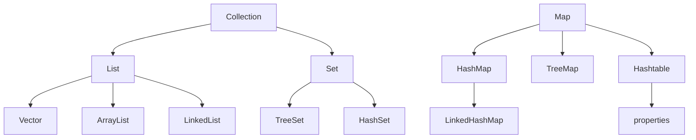

# Java

## let’s go

java se = 桌面软件

java ee  = web

android kotlin  = 手机 

## jdk

java JDK 包含了java开发工具(java、javac等)和jre(java运行环境)

jre = JVM(java虚拟机) + Java核心类库

## 环境变量

直接我的电脑系统变量Path配置 jdk bin目录和 jre bin目录(根本不需要什么JAVA_HOME这种的，如果还要配置jdk下的其他目录，直接加就行了,简单明了)

```java
D:\jdk1.8.0_191\bin
D:\jdk1.8.0_191\jre\bin
```

输入cmd 输入 java -version查看版本

## HelloWorld

```java
public class HelloWorld {
    public static void main(String[] args) {
        System.out.print("hello world!");
    }
}
```

## 编译

javac HelloWorld.java

## 运行

java HelloWorld

```java
PS D:\sxc\javastudy> java HelloWorld
hello world!
```

## args

这里的String[] args 和python里的*args差不多 不确定个数的参数打包数组

如何查看

```java
public class HelloWorld {
    public static void main(String[] args) {
        for (int i = 0; i < args.length; i++) {
            System.out.println(args[i]);
        }
        System.out.print("hello world!");
    }
}
```

编译运行查看输出

```java
PS D:\sxc\javastudy> javac HelloWorld.java
PS D:\sxc\javastudy> java HelloWorld -s -c
-s
-c
hello world!
```

tips：public修饰类有且仅有一个 文件名按public类名来命名,main方法可以写在非public类中

## VsCode运行配置

```json
{
  "code-runner.runInTerminal": true,
  "code-runner.executorMap": {
      "java": "chcp 936 && cd $dir && javac -encoding utf-8 $fileName && java $fileNameWithoutExt",
  },
}
```

自己去快捷键绑定  alt+insert(源代码操作) 用于快速生成构造方法 set get tostring等

## api文档

[https://www.matools.com/api/java8](https://www.matools.com/api/java8)

[https://docs.oracle.com/javase/8/docs/api/](https://docs.oracle.com/javase/8/docs/api/)

[https://devdocs.io/](https://devdocs.io/)

## 常用数据类型

```java
public class VarType {
    public static void main(String[] args) {
        // 整形
        int a = 123;
        int b = 345;
        System.out.println(a);
        System.out.println(b);
        //长整形
        long la = 123456;
        System.out.println(la);
        // 单精度浮点数
        float c = 3.14f;
        System.out.println(c);
        // 双精度浮点数
        double d = 3.1415926;
        System.out.println(d);
        // 字符串ps:不是基本数据类型
        String str = "hello world";
        System.out.println(str);
        // 单个字符 单引号
        char word = 97;
        System.out.println(word);
        // 布尔值
        boolean boolTrue = true;
        boolean boolFalse = false;
        System.out.println(boolTrue);
        System.out.println(boolFalse);
    }
}
```

## 类型转换

char-int-long-float-double

byte-short-int-long-float-double

从大的类型转到小就要用强转 比如double转到int 需要 (int)double

```java
public class VarType {
    public static void main(String[] args) {
        // 强制类型转换
        byte a = 97;
        byte b = 2;
        byte c = (byte) (a + b);
        char word = (char) (a + b);
        // int转String
        String str = Integer.toString(1000);
        // double转String
        String str2 = Double.toString(1000.0);
        // String转int
        int num = Integer.parseInt(str);
        System.out.println(c);// 输出99
        System.out.println(word);// 输出c
        System.out.println(str);// 输出1000
        System.out.println(str2);// 输出1000.0
        System.out.println(num);// 输出1000
        // +号强转
        System.out.println(num + "");// 输出1000

    }
}
```

## 逻辑运算符

```java
public class AndOr {
    public static void main(String[] args) {
        int a = 1, b = 3;
        // && 短路规则 => 前面的条件如果为false后面的就不执行
        if (a > b && ++b == 4) {
            // ++b没执行
        }
        System.out.println("b=" + b);
        // & 不遵循短路规则 => 前面的如果是false那后面的也执行
        a = 1;
        b = 3;
        if (a > b & ++b == 4) {
            // ++b执行了
        }
        System.out.println("b=" + b);

    }
}
```

## 条件语句

```java
public class IfElse {
    public static void main(String[] args) {
        boolean a = true;
        boolean b = false;
        if (a) {
            System.out.println("a");
        } else if (!b) {
            System.out.println("因为a满足了不会输出,a满足了就跳出这个if else if else代码块了");
        } else {
            System.out.println("因为a满足了不会输出,else不会输出的");
        }
    }
}
```

## 三元运算符

```java
public class Demo {
    public static void main(String[] args) {
        // 继承关系Integer/Double -> Number -> Object
        // 三元运算符 条件真？则取1：否则取2
        Object num = true ? new Integer(1) : new Double(2.0);
        System.out.println(num);// 会输出1.0 是因为三元运算符是一个整体 :两边的类型要一致 这里Integer直接类型提升了为Double了
    }
}
```

## 循环

### for循环计1~100的和

```java
public class SumNumber {
    public static void main(String[] args) {
        int sum = 0;
        for (int i = 1; i < 101; i++) {
            sum+=i;
        }
        System.out.println(sum);
    }
}
```

### for循环输出列表

```java
public class Demo {
    public static void main(String[] args) {
        int[] arr = { 1, 2, 3, 4 };
        for (int i = 0; i < arr.length; i++) {
            System.out.println(arr[i]);
        }
    }
}
```

### for循环打印99乘法表

```java
public class Demo {
    public static void main(String[] args) {
        for (int i = 1, j = 1; i <= 9; i++) {
            for (j = 1; j <= i; j++) {
                System.out.print(i + "*" + j + " = " + i * j + "  ");
            }
            System.out.println("\n");
        }
    }
}
```

### while循环最好是用在不确定循环次数的时,也可计算0-100的和

```java
public class Demo {
    public static void main(String[] args) {
        int sum = 0;
        int i = 1;
        while (true) {
            if (i <= 100) {
                sum += i;
                i++;
            } else {
                break;
            }
        }
        System.out.println(sum);
    }
}
```

练习：

**打印金字塔**

```
     *
    ***
   *****
  *******
 *********
***********
```

```java
public class Demo {
    public static void main(String[] args) {
        int line = 6;
        for (int i = 1; i <= line; i++) {
            for (int j = 0; j < line - i; j++) {
                System.out.print(" ");
            }
            for (int j = 0; j < i*2-1; j++) {
                System.out.print("*");
            }
            System.out.println();
        }
    }
}
```

**打印镂空金字塔**

```
         *
        * *
       *   *
      *     *
     *       *
    *         *
   *           *
  *             *
 *               *
*******************
```

```java
public class Demo {
    public static void main(String[] args) {
        int line = 10;
        for (int i = 1; i <= line; i++) {
            for (int j = 0; j < line - i; j++) {
                System.out.print(" ");
            }
            for (int j = 0; j < i * 2 - 1; j++) {
                if (i > 1 && i < line) {
                    if (j == 0 || j == i * 2 - 2) {
                        System.out.print("*");
                    } else {
                        System.out.print(" ");
                    }
                } else {
                    System.out.print("*");
                }
            }
            System.out.println();
        }
    }
}
```

### break用法

这里记录一下break可以跳出for循环标签，其他语言类似，continue也可以跳到指定标签运行

```java
public class Demo {
    public static void main(String[] args) {
        outer: for (int i = 0; i < 3; i++) {
            for (int j = 0; j < 3; j++) {
                if (j > 0)
                    break outer;
            }
            System.out.println("我不会输出，因为已经跳出最外层循环outer");
        }
    }
}
```

## 增强for循环foreach

vscode输入foreach或者iter

```java
public class Demo {
    public static void main(String[] args) {
        int[] arr = { 1, 2, 3, 4 };
        for (int i : arr) {
            System.out.println(i);
        }
    }
}
```

## 数组

### 基本操作

```java
import java.util.Arrays;

public class Demo {
    public static void main(String[] args) {
        // 定义一个数组
        double[] arr = { 1, 5, 1, 3.4, 2, 50 };
        // 或者 这种初始化是长度位6的空数组
        double[] arr1 = new double[6];
        // 牛逼初始化
        double[] arr2 = new double[] { 1, 5, 1, 3.4, 2, 50 };
        // 定义一个二维数组
        // 静态赋值
        double[][] arr3 = { { 1, 2.0 }, { 3.0 } };
        // 声明一个空数组
        double[][] arr4 = new double[6][1];
        // 动态赋值数组长度
        double[][] arr5 = new double[6][];
        // 打印某个值
        System.out.println(arr[0]);// 输出1.0
        // 赋值
        arr[0] = 3;
        // 打印数组
        System.out.println(Arrays.toString(arr)); // 输出[3.0, 5.0, 1.0, 3.4, 2.0, 50.0]
        // 遍历数组
        for (double item : arr) {
            System.out.print(item); // 输出3.05.01.03.42.050.0
        }
        System.out.println();
        for (int i = 0; i < arr.length; i++) {
            System.out.print(arr[i]); // 输出3.05.01.03.42.050.0
        }
        System.out.println();
        // 数组长度
        System.out.println(arr.length);// 输出6

    }
}
```

### 常用方法

```java
import java.util.Arrays;

public class Demo {
    public static void main(String[] args) {
        // 定义一个数组
        double[] arr = { 1, 5, 1, 3.4, 2, 50 };
        // 复制拷贝一个数组
        double[] arr2 = arr.clone();
        System.out.println(Arrays.toString(arr2));// 输出[1.0, 5.0, 1.0, 3.4, 2.0, 50.0]
        // 数组反转
        double[] arrReverse = new double[arr.length];
        for (int i = 0; i < arr.length; i++) {
            arrReverse[i] = arr[arr.length - 1 - i];
        }
        System.out.println(Arrays.toString(arrReverse));// 输出[50.0, 2.0, 3.4, 1.0, 5.0, 1.0]
    }
}
```

**二维数组案例**

输出10行的杨辉三角

```java
import java.util.Arrays;

public class Demo {
    public static void main(String[] args) {
        // 定义一个数组
        int[][] arr = new int[10][];
        for (int i = 0; i < arr.length; i++) {
            arr[i] = new int[i + 1];
            for (int j = 0; j < i + 1; j++) {
                if (j == 0 || j == i) {
                    arr[i][j] = 1;
                } else {
                    arr[i][j] = arr[i - 1][j - 1] + arr[i - 1][j];
                }
            }
        }
        for (int[] item : arr) {
            System.out.println(Arrays.toString(item));
        }
    }
}
```

```
[1]
[1, 1]
[1, 2, 1]
[1, 3, 3, 1]
[1, 4, 6, 4, 1]
[1, 5, 10, 10, 5, 1]
[1, 6, 15, 20, 15, 6, 1]
[1, 7, 21, 35, 35, 21, 7, 1]
[1, 8, 28, 56, 70, 56, 28, 8, 1]
[1, 9, 36, 84, 126, 126, 84, 36, 9, 1]
```

## 面向对象

### 创建类

```java
public class Demo {

    public static void main(String[] args) {
        Person person1 = new Person("小白", 3);
        Person person2 = new Person("小花", 100);
        System.out.println(person1.getCat());// 输出 小白 3
        System.out.println(person2.getCat());// 输出 小花 100
    }
}

class Person {
    private String name = "";
    private int age = 0;

    // 构造方法
    public Person(String name, int age) {
        this.name = name;
        this.age = age;
    }

    public String getCat() {
        return name + " " + age;
    }
}
```

### 变量

全局变量（成员方法\属性）有默认值

局部变量指在代码块中定义的，使用前必须赋值

### 静态变量

也称之为类变量，被所有对象所共享，在类加载的时候就生成了 (有一个loadClass方法)

```java
public class Demo {
    public static void main(String[] args) {
        A a = new A();
        A b = new A();
        A.count++;
        //下面代码输出的值相同
        System.out.println(A.count);// 推荐 静态变量直接用类名调用
        System.out.println(a.count);// 被a对象共享 但最好不要这么写 会有警告
        System.out.println(b.count);// 被b对象共享 但最好不要这么写 会有警告
    }
}

class A {
    public static int count;
}
```

### 构造方法

构造方法和类名同名，他既然是方法，也具有方法重载

```java
public class Demo {

    public static void main(String[] args) {
        Person person = new Person();
        System.out.println(person.getCat());// 姓名 0
    }
}

class Person {
    private String name = "";
    private int age = 0;

    public Person() {
        // 调用本类里的构造方法
        this("姓名", 0);
    }

    // 构造方法
    public Person(String name, int age) {
        this.name = name;
        this.age = age;
    }

    public String getCat() {
        return name + " " + age;
    }
}
```

### 静态方法

静态方法只能访问静态变量，不允许使用this，super关键字

```java
public class Demo {

    public static void main(String[] args) {
        Person.staticFn("直接调用");
    }
}

class Person {
    public static void staticFn(String content) {
        System.out.println(content);
    }
}
```

### 传参方式

分为引用传递和值传递

基本数据类型：int double等都是值传递（值的拷贝）  值传递不会改变原变量的值

引用数据类型：数组、对象等是引用传递（地址拷贝），在方法里改变值会影响原变量的值

另外字符串虽然是引用数据类型（但是他是不可变的对象final，String赋值的过程相当于new了一个String对象） 

tips:任何方法的调用会创建新的栈空间，如果在这个新的空间里创建同名对象，这个对象和实参是2个不同的对象

```java
import java.util.Arrays;

public class Demo {

    public static void main(String[] args) {
        int num = 1;
        int[] intArr = { 1, 2, 3, 4 };
        String str = "hello world!";
        changeNum(num);
        changeArr(intArr);
        changeStr(str);
        System.out.println(num);//1 基本数据类型是值传递 所以原变量不变
        System.out.println(Arrays.toString(intArr));// [-1, 2, 3, 4] 数组是引用传递，所以值发生了改变
        System.out.println(str);//hello world!String也是值传递 所以原变量不变
    }

    public static void changeNum(int num) {
        num = -1;
    }

    public static void changeArr(int[] intArr) {
        intArr[0] = -1;
    }

    public static void changeStr(String str) {
        str = "hello";//注意这里本质是new 了一个String对象 相当于在栈开辟了新空间，和main里的str是2个String对象了
    }
}
```

### 可变参数

可变参数 不确定参数的个数时使用 ，需要放在形参的最后

```java
import java.util.Arrays;

public class Demo {

    public static void main(String[] args) {
        Person.argsFn(1, 2, 3);// [1, 2, 3]
    }
}

class Person {

    /**
     * 
     * @param nums 可变参数 不确定参数的个数时使用 相当于int[] nums
     */
    public static void argsFn(int... nums) {
        System.out.println(Arrays.toString(nums));
    }
}
```

### 方法重载

方法的重载就是同一个类中方法名相同，形参不同（返回类型不构成重载的条件，只有返回类型不一样，不算重载）

```java
public class Demo {

    public static void main(String[] args) {
        Person.overloadFn();// 我没有形参，是overloadFn方法
        Person.overloadFn("我多了个形参，是overloadFn方法的重载");// 我多了个形参，是overloadFn方法的重载
    }
}

class Person {
    public static void overloadFn() {
        System.out.println("我没有形参，是overloadFn方法");
    }

    public static void overloadFn(String content) {
        System.out.println(content);
    }
}
```

### 返回值

返回包装类

```java
public class Demo {

    public static void main(String[] args) {
        double a = 0;
        double b = 1;
        Calc calc = new Calc();
        Double res = calc.div(a, b);
        System.out.println(res);
    }
}

class Calc {
    /**
     * 除法运算
     * @param a 除数
     * @param b 被除数
     * @return Double 是因为结果里可能包含null，所以要用包装类返回，因为类对象可以是null，不用double是因为是基本数据类型，不能为null
     */
    public Double div(double a, double b) {
        if (a == 0) {
            return null;
        } else {
            return a / b;
        }
    }
}
```

### 包

创建包

规范 com.公司名.项目名.模块名

新建文件夹com → 新建文件PackageDemo.java

```java
package com;

public class PackageDemo {

}
```

使用

```java
import com.PackageDemo;

public class Demo {
    public static void main(String[] args) {
      PackageDemo packageDemo = new PackageDemo();
    }
}
```

### 访问修饰符

| 访问修饰符     | 同类  | 同包  | 子类       | 不同包 |
| --------- | --- | --- | -------- | --- |
| public    | √   | √   | √        | √   |
| protected | √   | √   | √        | ×   |
| 默认（什么也不加） | √   | √   | 不同包× 同包√ | ×   |
| private   | √   | ×   | ×        | ×   |

### 封装

属性私有化 设置or获取数据通过方法

```java
public class Demo {
    public static void main(String[] args) {
        new Person("小白", 18);
    }
}

class Person {
    private String name;
    private int age;

    public Person() {
    }

    public Person(String name, int age) {
        setName(name);
        setAge(age);
    }

    public String getName() {
        return name;
    }

    public void setName(String name) {
        this.name = name;
    }

    public int getAge() {
        return age;
    }

    public void setAge(int age) {
        this.age = age;
    }
}
```

### 继承和多态

继承 子类和父类有共同属性或方法时使用，java是单继承，本质是查找关系，就近原则

多态 重写父类的方法，方法的多态 例如父类动物有说的方法，狗有说的方法，猫也有说的方法 这种同一个行为表现多个不同的样式称之为多态（多种形态嘛，除了方法，对象也可以是多态）

```java
public class Demo {
    public static void main(String[] args) {
        Person p = new Person("小白", 18);
        // 继承后可调用父类的方法
        p.setAddress("上海金融大厦");
        System.out.println(p.getAddress());// 输出上海金融大厦
        // 重写父类方法 多态
        System.out.println(p.getCompanyName());// 输出阿里巴巴公司
    }
}

/**
 * 公司类
 */
class Company {
    private String address = "浙江省杭州市";
    private String companyName = "阿里巴巴";

    public String getAddress() {
        return address;
    }

    public void setAddress(String address) {
        this.address = address;
    }

    public String getCompanyName() {
        return companyName;
    }

    public void setCompanyName(String companyName) {
        this.companyName = companyName;
    }

}

/**
 * Person 继承 公司类
 */
class Person extends Company {
    private String name;
    private int age;

    public Person() {
        super();// 虽然会默认调，最好写一下，因为假如父类没有无参构造器（定义了一个构造器）,那这里就会报错
    }

    public Person(String name, int age) {
        super();
        setName(name);
        setAge(age);
    }

    public String getName() {
        return name;
    }

    public void setName(String name) {
        this.name = name;
    }

    public int getAge() {
        return age;
    }

    public void setAge(int age) {
        this.age = age;
    }

    // 重写父类的方法 称之为多态。。。
    @Override
    public String getCompanyName() {
        // super.访问父类属性或方法
        return super.getCompanyName() + "公司";
    }
}
```

**多态细节**

对象的多态

向上转型 - 父类引用指向子类对象（自动转换，且对象会遗失父类中没有的方法，可以调用的方法看父类，实际运行先看子类，再看父类，tips:这里要注意一点是如果是调用属性的话，是看父类的，看编译类型而不是运行类型，属性和方法是不一样的，属性没有重写的说法）

向下转型（强制转换，只能转换父类的引用，不能转换父类对象，可用子类中的方法）

```java
public class Demo {
    public static void main(String[] args) {
        // 父类引用指向子类对象-向上转型 （自动，且对象会遗失父类中没有的方法）
        Person student1 = new Student();//左边是Person是编译类型  右边Student是运行类型
        student1.say1();// 输出 Student say1()
        student1.eat();// 输出 Person eat()
        // 强转-向下转型 （强制，可用子类中的方法）(Student) new Person();这样转是错的,
        Student student2 = (Student) student1;
        student2.say1();// 输出 Student say1()
        student2.say2();// 输出 Student say2()
    }
}

class Person {
    public void say1() {
        System.out.println("Person say1()");
    }

    public void eat() {
        System.out.println("Person eat()");
    }
}

class Student extends Person {
    public void say1() {
        System.out.println("Student say1()");
    }

    public void say2() {
        System.out.println("Student say2()");
    }
}
```

**多态数组**

对象数组编译类型是其所有元素类型的父类，称之为多态数组

```java
public class Demo {
    public static void main(String[] args) {
        // 这个数组就被称为多态数组。。挺无语的
        Person[] persons = new Person[2];
        persons[0] = new Student("小明");
        persons[1] = new Teacher("老王");
    }
}

class Person {
    private String name;

    public Person(String name) {
        this.name = name;
    }

    public String getName() {
        return name;
    }

    public void setName(String name) {
        this.name = name;
    }
}

class Student extends Person {

    public Student(String name) {
        super(name);
    }

}

class Teacher extends Person {

    public Teacher(String name) {
        super(name);
    }
}
```

### this和super关键字

| 区别    | this                     | super                       |
| ----- | ------------------------ | --------------------------- |
| 访问属性  | 先访问本类中的属性，如果没有，则继续查找父类属性 | 直接访问父类属性，就近原则               |
| 调用方法  | 先访问本类中的方法，如果没有，则继续查找父类方法 | 直接访问父类方法，就近原则               |
| 调用构造器 | 调用本类构造器，放在构造器首行this()    | 调用父类构造器，必须放在子类构造器首行，super() |
| 特殊    | 表示当前对象                   | 子类中访问父类对象                   |

**关于构造器的坑**

```java
public class Demo {
    public static void main(String[] args) {
        new C();// 输出A B C
    }
}

class A {
    public A() {
        System.out.println("A");
    }
}

class B extends A {

    public B() {
        // 这里隐式调用了父类的构造器 super();所以最好写上
        System.out.println("B");
    }
}

class C extends B {

    public C() {
        // 这里不会调用super() 因为已经调用了本类的有参构造器this(str)
        this("我是调用本类的有参构造器");
    }

    public C(String str) {
        // 这里我显示写出来了
        super();
        System.out.println("C");
    }
}
```

!> 除非方法形参和局部变量重名，否则在方法里省略this，因为java源码也是这么写的

### instanceof关键字

用于判断对象x的运行类型是否xx类型或xx类型的父类型

```java
public class Demo {
    public static void main(String[] args) {
        Integer x = new Integer(0);
        System.out.println(x instanceof Integer);//true
    }
}
```

```java
public class Demo {
    public static void main(String[] args) {
        A b = new B();
        System.out.println(b instanceof A);// b的运行类型是B类型，A是B的父类型所以是true
        System.out.println(b instanceof B);// b的运行类型是B类型所以是true

        A a = new A();
        System.out.println(a instanceof B);// a的运行类型是A类型 不是B类型所以是false
    }
}

class A {
}

class B extends A {
}
```

### 代码块

代码块用于初始化对象的共同属性，静态代码块会随着类的加载被调用，只会调用一次；普通代码块会随着对象创建被调用，创建一次调用一次

```java
public class Demo {
    public static void main(String[] args) {
        System.out.println(A.i);// 我是静态代码块，随着类的加载执行，只会执行一次 1
        new A();// 我是代码块,每创建一个对象，就会执行一次
        new A();// 我是代码块,每创建一个对象，就会执行一次
        new A();// 我是代码块,每创建一个对象，就会执行一次
    }
}

class A {

    public static int i = getI();

    // 静态代码块
    static {
        System.out.println("我是静态代码块，随着类的加载执行，只会执行一次");
    }

    // 普通代码块
    {
        System.out.println("我是代码块,每创建一个对象，就会执行一次");
    }

    public static int getI() {
        System.out.println("staic属性i和静态代码块按顺序加载，所以我先被执行");
        return 1;
    }

    public A() {
        System.out.println("构造器最后被调用");
    }

}
```

代码块的运行顺序

```java
public class Demo {
    public static void main(String[] args) {
        // A 静态属性
        // A 静态代码块
        // B 静态属性
        // B 静态代码块
        // A 普通代码块
        // A 构造方法
        // B 普通代码块
        // B 构造方法
        new B();
    }
}

class A {
    public static int i = getI();

    static {
        System.out.println("A 静态代码块");
    }

    {
        System.out.println("A 普通代码块");
    }

    public A() {
        System.out.println("A 构造方法");
    }

    private static int getI() {
        System.out.println("A 静态属性");
        return 1;
    }
}

class B extends A {
    public static int j = getJ();

    static {
        System.out.println("B 静态代码块");
    }

    {
        System.out.println("B 普通代码块");
    }

    public B() {
        // 隐式调用super();
        System.out.println("B 构造方法");
    }

    private static int getJ() {
        System.out.println("B 静态属性");
        return 2;
    }
}
```

### final关键字

可以修饰类 、方法、属性、局部变量

类加上final后不能被继承

方法加上final不能被子类重写

属性加上final后就变成常量了（大写），不能被修改

```java
public class Demo {
    public static void main(String[] args) {
        final int i = 0;
    }
}

final class A {
    private static final String BASE_URL = "";

    public static final String getUrl() {
        return BASE_URL;
    }
}
```

### abstract抽象类

抽象类（不能实例化，但它的本质还是类，也可以有属性和方法，抽象类的构造函数由其子类实例化用super(args)调用）

抽象方法（不能有方法体，子类必须实现，且不能有private,final,static关键字，因为和子类重写相违背）

```java
abstract class Animal {
    public abstract void eat();
}

class Dog extends Animal {
    @Override
    public void eat() {
        System.out.println("狗狗喜欢吃骨头");
    }
}

class Cat extends Animal {
    @Override
    public void eat() {
        System.out.println("猫喜欢吃鱼");
    }
}
```

### 接口interface

接口不能被实例化

接口中的抽象方法可以省略abstract关键字

接口中的抽象方法必须由实现该接口的类去实现

接口可以多继承

```java
public class Demo {
    public static void main(String[] args) {
        AInterface aInterface = new A();
        aInterface.fnA();
    }
}

interface AInterface {
    // 接口里的属性必须是这样声明 public static final 且必须赋值
    public static final int i = 0;

    // 抽象方法，这里可以省略abstract关键字
    public void fnA();

    // 可以有普通方法，必须要有default/static关键字
    public default void getName() {
        System.out.println("name");
    }
}

interface BInterface {
    public void fnB();
}

// 接口可以多继承接口
interface CInterface extends AInterface, BInterface {

}

// 接口可以多实现（抽象类的话只能单继承）
class A implements AInterface, BInterface {

    @Override
    public void fnA() {
        System.out.println("fnA");
    }

    @Override
    public void fnB() {
        System.out.println("fnB");
    }

}
```

### 内部类

内部类分为成员内部类（类似成员属性） 和 局部内部类（类似局部变量）

匿名内部类可用lambda表达式代替

```java
public class Demo {
    public static void main(String[] args) {
        // 创建外部类
        new Outer();
        // 匿名内部类作形参
        Demo.fn(new AInterface() {
            @Override
            public void fn() {
                System.out.println("匿名内部类实现了fn方法");
            }
        });// 匿名内部类实现了fn方法

        // lambda表达式作形参(这里作为扩展)
        Demo.fn(() -> {
            System.out.println("lambda表达式实现了fn方法");// lambda表达式实现了fn方法
        });
        // 访问成员内部类
        new Outer().new Inner();
        // 或者通过方法去访问
        new Outer().getInner();
        // 访问静态成员内部类
        new Outer.staticInner();
    }

    /**
     * 匿名内部类对象直接作形参用法（好处声明完接口，不需要创建类去实现，直接在用的地方实现）
     * 
     * @param aInterface
     */
    public static void fn(AInterface aInterface) {
        aInterface.fn();
    }
}

interface AInterface {
    public void fn();
}

class Outer {
    private int outerValue = 1;
    private int value = 2;

    // 成员内部类（类似于成员变量，可以添加任意访问修饰符，是一个独立的类）
    public class Inner {
        private int value = 3;

        public Inner() {
            // 访问内部重名变量，就近原则
            System.out.println("dupInnerValue:" + value);// 2
            // 访问外部重名变量
            System.out.println("dupOuterValue:" + Outer.this.value);// 1
            // 访问外部不重名变量
            System.out.println("outerValue:" + outerValue);
        }
    }

    // 静态成员内部类
    public static class staticInner {

        public staticInner() {
            System.out.println("静态成员内部类");
        }
    }

    /**
     * 获取成员内部类对象
     * 
     * @return
     */
    public Inner getInner() {
        return new Inner();
    }

    // 外部类构造方法
    public Outer() {
        // 内部类（类似于局部变量，可以访问外部的所有属性和方法，不能加public\private\protected修饰符）
        class InnerLocal {
            public InnerLocal() {
                System.out.println(outerValue);
            }
        }
        // 匿名内部类（直接在方法体实现了，接口仅这种方法可以new并紧跟实现方法体，
        // 他的运行类型是匿名内部类class Outer$1【可以getClass()获取】,只创建一次，赋值给对象，匿名类就销毁了）
        AInterface aInterface = new AInterface() {
            @Override
            public void fn() {
                System.out.println("匿名内部类实现了fn方法");
            }
        };

        // 实例化内部类
        new InnerLocal();// 1
        // 实例化成员内部类
        new Inner();// dupInnerValue:3 dupOuterValue:2 outerValue:1
        // 调用匿名内部类方法
        aInterface.fn();// 匿名内部类实现了fn方法
    }
}
```

## 枚举

### 定义

不用enum关键字的枚举类 基本不用这个

```java
public class Demo {
    public static void main(String[] args) {
        System.out.println(A.RED);// A@15db9742
        System.out.println(A.GREEN);// A@6d06d69c
    }

}

// 不用enum关键字的枚举类
class A {
    private String color;

    // RED,GREEN 即枚举对象 由类调用的静态属性
    public static final A RED = new A("红色");
    public static final A GREEN = new A("绿色");
    public static final A BLUE = new A("蓝色");

    // 枚举类的构造器私有化 类似于单例模式
    private A(String color) {
        this.color = color;
    }

    // 只有get方法，不设置set方法，也是不让用户改变属性
    public String getColor() {
        return color;
    }
}
```

使用enum关键字的枚举类 枚举变量是由final修饰的常量对象

```java
public class Demo {
    public static void main(String[] args) {
        System.out.println(A.RED);// RED 这里本质都调用了父类Enum的toString()方法 输出了枚举对象的名称 需要jsonp反编译class文件才能看到
        System.out.println(A.GREEN);// GREEN
        System.out.println(B.RED);// RED
    }
}

// 用enum关键字替代class的枚举类 enum底层继承了Enum类 并且父类重写了toString方法 返回枚举对象的名称
enum A {
    // 常量(构造器参数) 若构造器参数为空，则括号可以省略 注意：必须放在最前面
    RED("红色"), // 代替了 public static final A RED = new A("红色");
    GREEN("绿色"),
    BLUE("蓝色");

    private String color;

    private A(String color) {
        this.color = color;
    }

    // 只有get方法，不设置set方法，也是不让用户改变属性
    public String getColor() {
        return color;
    }
}

// 最简单的枚举类 这里面其实默认有无参构造器 B()，RED 也是由 RED() 简化而来的
enum B {
    RED,
    GREEN,
    BLUE;
}
```

### 枚举常用方法

```java
import java.util.Arrays;

public class Demo {
    public static void main(String[] args) {
        // 枚举对象名称
        System.out.println(B.RED.name()); // RED
        // 枚举对象对应的编号
        System.out.println(B.RED.ordinal()); // 0
        System.out.println(B.GREEN.ordinal()); // 1
        System.out.println(B.BLUE.ordinal()); // 2
        // 打印所有枚举
        System.out.println(Arrays.toString(B.values())); // [RED, GREEN, BLUE]
        // 将字符串转成已有枚举常量对象
        System.out.println(B.valueOf("RED"));// RED
        // 比较枚举常量对象值 返回的是编号的差值
        System.out.println(B.RED.compareTo(B.BLUE));// -2
    }
}

enum B {
    RED,
    GREEN,
    BLUE;
}
```

### 枚举判断

```java
public class Demo {
    public static void main(String[] args) {
        Color color = Color.RED;
        switch (color) {
            case RED:
                System.out.println("red");//red
                break;
            case GREEN:
                System.out.println("green");
                break;
            case BLUE:
                System.out.println("blue");
                break;
            default:
                break;
        }
    }
}

enum Color {
    RED,
    GREEN,
    BLUE;
}
```

## 注解

三种注解：@Override @Deprecated @ SuppressWarnings

```java
public class Demo {
    public static void main(String[] args) {
    }
}

interface A {
    public void fn();
}

class B implements A {
    // 抑制所有警告 这里抑制了这个私有属性未使用的警告
    // 警告类型 all unused 等
    @SuppressWarnings({ "unused" })
    private int a = 0;

    /**
     * 重写注解 实现接口方法 或者是 重写父类方法
     */
    @Override
    public void fn() {

    }

    /**
     * 过时注解 表示方法废弃了 不推荐使用
     */
    @Deprecated
    public void deprecatedFn() {

    }
}

// 表示类过时了
@Deprecated
class C extends B {

}
```

## 异常

### 普通用法

catch可以捕获多个异常，且try方法体内出现第一个异常后，异常后面的代码不执行，跳到对应的catch执行

finally不管有没有异常必定执行 tips：有finally关键字的时候catch捕获的第一个异常方法体还是执行的，只不过执行完，finally必执行，所以如果有return得看finally里的return

```java
public class Demo {
    public static void main(String[] args) throws Exception {
        // try catch finally
        try {
            // 除0异常
            int num1 = 10;
            int num2 = 0;
            int res = num1 / num2;
            System.out.println(res);
            // 空指针异常
            String str = "hello try catch";
            str = null;
            System.out.println(str.length());
        } catch (ArithmeticException e) {
            // 算数异常
            System.out.println(e.getMessage());// by zero
        } catch (NullPointerException e) {
            // 空指针异常
            System.out.println(e.getMessage());// null
        } finally {
            // 不管有没有异常都会执行
            System.out.println("一定执行");
        }
    }
}
```

### 异常主动抛出

```java
public class Demo {
    public static void main(String[] args) {
        // f2()->f1()->main() 异常传递
        try {
            new Demo().f1();
        } catch (Exception e) {
            System.out.println(e.getMessage());// 出错啦f1
        }
        new Demo().f3();// java.lang.NullPointerException
    }

    //throws抛出异常类型
    public void f1() throws Exception {
        try {
            f2();
        } catch (Exception e) {
            System.out.println(e.getMessage());// 出错啦f2
            // 抛出一个异常对象
            throw new Exception("出错啦f1");
        }
    }

    //throws抛出异常类型
    public void f2() throws Exception {
        // 抛出一个异常对象
        throw new Exception("出错啦f2");
    }

    // 由这个函数抛出多个异常类型
    @SuppressWarnings({ "all" })
    private void f3() throws NullPointerException, NumberFormatException {
        String str = "hello throws";
        str = null;
        System.out.println(str.length());
        int num = Integer.parseInt(str);
        System.out.println(num);
    }
}
```

## 包装类

### 拆箱和装箱

就是基本类型转换为对象 叫装箱 对象转换为基本类型 为拆箱

```java
public class Demo {
    @SuppressWarnings({ "all" })
    public static void main(String[] args) {
        int num1 = 100;
        // 手动装箱
        Integer num2 = Integer.valueOf(num1);
        // 手动拆箱
        Integer integer = new Integer(num1);
        int num3 = integer.intValue();

        // 自动装箱
        Integer integer2 = num1;
        // 自动拆箱
        int num4 = integer;

        // 自动装箱
        Double d = 100d; // 底层执行了 new Double.valueOf(100);
        Float f = 1.5f;
    }
}
```

### 包装类和String转换

其他类型转为String类似

```java
public class Demo {
    @SuppressWarnings({ "all" })
    public static void main(String[] args) {
        Integer num1 = 100;
        // 包装类转为String
        String str1 = String.valueOf(num1);
        String str2 = Integer.toString(num1);
        String str3 = num1 + "";
        String str4 = num1.toString();
        System.out.println(str1);
        System.out.println(str2);
        System.out.println(str3);
        System.out.println(str4);
        // String转为包装类
        Integer num2 = Integer.parseInt(str1);
        Integer num3 = Integer.valueOf(str1);
        Integer num4 = new Integer(str1);
        System.out.println(num2);
        System.out.println(num3);
        System.out.println(num4);
    }
}
```

## 集合

集合是可动态改变的数组，集合分为单列集合Collection（类似PHP索引数组）双列集合Map（类似PHP关联数组）

### 体系图



## 设计模式

### 单例模式

**饿汉式**

类加载就初始化，效率高，但浪费内存（还没用就占住这部分内存）

```java
public class Demo {
    public static void main(String[] args) {
        SingleInstance.getInstance();// 单例初始化了,只初始化一次
        SingleInstance.getInstance();// 这句不输出了
    }
}

class SingleInstance {
    // 单例对象初始化
    private static SingleInstance instance = new SingleInstance();

    // 构造方法私有化 防止用户直接new初始化类
    private SingleInstance() {
        System.out.println("单例初始化了,只初始化一次");
    }

    // 获取单例
    public static SingleInstance getInstance() {
        return instance;
    }
}
```

**懒汉式**

什么时候创建对象 什么时候调用，不浪费内存，多线程创建对象会造成创建多个对象，需要用同步锁（synchronized）解决，效率没有上面的高

```java
public class Demo {
    public static void main(String[] args) {
        SingleInstance.getInstance();// 单例初始化了,只初始化一次
        SingleInstance.getInstance();// 这句不输出了
    }
}

class SingleInstance {
    // 单例对象
    private static SingleInstance instance;

    // 构造方法私有化 防止用户直接new初始化类
    private SingleInstance() {
        System.out.println("单例初始化了,只初始化一次");
    }

    // 获取单例，单例对象初始化
    public static synchronized SingleInstance getInstance() {
        if (instance == null) {
            instance = new SingleInstance();
        }
        return instance;
    }
}
```

### 抽象模板设计模式

共同代码父类实现，不同的代码子类实现(其实这个和继承没有太大区别，无非抽象方法没有方法体了)

```java
public class Demo {
    public static void main(String[] args) {
        B b = new B();
        b.publicFn();
    }
}

abstract class A {
    // 共同代码提取到抽象类
    public void publicFn() {
        System.out.println("公共方法");
        fn();
    }

    // 不同代码变成抽象方法，由子类去实现
    public abstract void fn();
}

class B extends A {
    @Override
    public void fn() {
        System.out.println("B");
    }
}
```

### 工厂设计模式

```java
public class Demo {
    public static void main(String[] args) {
        // 使用工厂类快速创建不同对象
        // 创建B对象
        Factory.productObj(1).fn();
        // 创建C对象
        Factory.productObj(2).fn();
    }
}

abstract class A {
    public abstract void fn();
}

class B extends A {
    @Override
    public void fn() {
        System.out.println("B fn");
    }
}

class C extends A {
    @Override
    public void fn() {
        System.out.println("A fn");
    }
}

class Factory {
    public static A productObj(int type) {
        switch (type) {
            case 1:
                return new B();
            case 2:
                return new C();
        }
        return null;
    }
}
```

## 算法

### 冒泡排序

相邻两个数比较，进行arr.length-1轮比较，每轮比较的次数都会少一次

```java
import java.util.Arrays;

public class Demo {
    public static void main(String[] args) {
        // 定义一个数组
        double[] arr = { 1, 5, 1, 3.4, 2, 50 };
        // 冒泡排序从小到大
        double temp;
        for (int i = 0; i < arr.length - 1; i++) {
            for (int j = 0; j < arr.length - 1 - i; j++) {
                // 如果前面的比后面的大 则交换
                if (arr[j] > arr[j + 1]) {
                    temp = arr[j];
                    arr[j] = arr[j + 1];
                    arr[j + 1] = temp;
                }
                // 每一轮的结果是
                System.out.println(Arrays.toString(arr));
            }
        }
        System.out.println(Arrays.toString(arr));//输出[1.0, 1.0, 2.0, 3.4, 5.0, 50.0]
    }
}
```

第一轮

```
[1.0, 5.0, 1.0, 3.4, 2.0, 50.0]
[1.0, 1.0, 5.0, 3.4, 2.0, 50.0]
[1.0, 1.0, 3.4, 5.0, 2.0, 50.0]
[1.0, 1.0, 3.4, 2.0, 5.0, 50.0]
[1.0, 1.0, 3.4, 2.0, 5.0, 50.0]
```

第二轮

```
[1.0, 1.0, 3.4, 2.0, 5.0, 50.0]
[1.0, 1.0, 3.4, 2.0, 5.0, 50.0]
[1.0, 1.0, 2.0, 3.4, 5.0, 50.0]
[1.0, 1.0, 2.0, 3.4, 5.0, 50.0]
```

第三轮

```
[1.0, 1.0, 3.4, 2.0, 5.0, 50.0]
[1.0, 1.0, 3.4, 2.0, 5.0, 50.0]
[1.0, 1.0, 2.0, 3.4, 5.0, 50.0]
```

第四轮

```
[1.0, 1.0, 2.0, 3.4, 5.0, 50.0]
[1.0, 1.0, 2.0, 3.4, 5.0, 50.0]
```

第五轮

```
[1.0, 1.0, 2.0, 3.4, 5.0, 50.0]
```

### 选择排序

每次和最小值比较，选出最小的值放在第i个位置，共进行arr.length-2轮

```java
import java.util.Arrays;

public class Demo {
    public static void main(String[] args) {
        // 定义一个数组
        double[] arr = { 1, 5, 1, 3.4, 2, 50 };
        // 选择排序从小到大
        double min;
        for (int i = 0; i < arr.length - 1; i++) {
            min = arr[i];
            for (int j = i + 1; j < arr.length - 1; j++) {
                if (arr[j] < min) {
                    min = arr[j];
                    arr[j] = arr[i];
                    arr[i] = min;
                }
                System.out.println(Arrays.toString(arr));
            }
        }
        System.out.println(Arrays.toString(arr));// 输出[1.0, 1.0, 2.0, 3.4, 5.0, 50.0]
    }
}
```

第一轮 注意一共只有四轮

```
[1.0, 5.0, 1.0, 3.4, 2.0, 50.0]
[1.0, 5.0, 1.0, 3.4, 2.0, 50.0]
[1.0, 5.0, 1.0, 3.4, 2.0, 50.0]
[1.0, 5.0, 1.0, 3.4, 2.0, 50.0]
```

第二轮

```
[1.0, 1.0, 5.0, 3.4, 2.0, 50.0]
[1.0, 1.0, 5.0, 3.4, 2.0, 50.0]
[1.0, 1.0, 5.0, 3.4, 2.0, 50.0]
```

第三轮

```
[1.0, 1.0, 3.4, 5.0, 2.0, 50.0]
[1.0, 1.0, 2.0, 5.0, 3.4, 50.0]
```

第四轮

```
[1.0, 1.0, 2.0, 3.4, 5.0, 50.0]
```

### 插入排序

每次取第i个数和他前面的有序列表对比，插入到相应为止，共进行arr.length - 1

```java
import java.util.Arrays;

public class Demo {
    public static void main(String[] args) {
        // 定义一个数组
        double[] arr = { 1, 5, 1, 3.4, 2, 50 };
        // 插入排序从小到大
        double min;
        for (int i = 0; i < arr.length - 1; i++) {
            for (int j = 0; j < i + 1; j++) {
                min = arr[i + 1];
                if (min < arr[j]) {
                    arr[i + 1] = arr[j];
                    arr[j] = min;
                }
                System.out.println(Arrays.toString(arr));
            }
        }
        System.out.println(Arrays.toString(arr));// 输出[1.0, 1.0, 2.0, 3.4, 5.0, 50.0]
    }
}
```

第一轮

```
[1.0, 5.0, 1.0, 3.4, 2.0, 50.0]
```

第二轮

```
[1.0, 5.0, 1.0, 3.4, 2.0, 50.0]
[1.0, 1.0, 5.0, 3.4, 2.0, 50.0]
```

第三轮

```
[1.0, 1.0, 5.0, 3.4, 2.0, 50.0]
[1.0, 1.0, 5.0, 3.4, 2.0, 50.0]
[1.0, 1.0, 3.4, 5.0, 2.0, 50.0]
```

第四轮

```
[1.0, 1.0, 3.4, 5.0, 2.0, 50.0]
[1.0, 1.0, 3.4, 5.0, 2.0, 50.0]
[1.0, 1.0, 2.0, 5.0, 3.4, 50.0]
[1.0, 1.0, 2.0, 3.4, 5.0, 50.0]
```

第五轮

```
[1.0, 1.0, 2.0, 3.4, 5.0, 50.0]
[1.0, 1.0, 2.0, 3.4, 5.0, 50.0]
[1.0, 1.0, 2.0, 3.4, 5.0, 50.0]
[1.0, 1.0, 2.0, 3.4, 5.0, 50.0]
[1.0, 1.0, 2.0, 3.4, 5.0, 50.0]
```

## 内置类

### Scanner获取用户输入

```java
import java.util.Scanner;

public class GetInput {
    public static void main(String[] args) {
        Scanner scanner = new Scanner(System.in);
        System.out.println("请输入a");
        int a = Integer.parseInt(scanner.next());
        System.out.println("请输入b");
        int b = Integer.parseInt(scanner.next());
        System.out.println("请输入c");
        int c = scanner.nextInt();
        System.out.println(a * b * c);
        scanner.close();
    }
}
```

### Math数学方法

**random()**

随机数

```java
public class Demo {
    public static void main(String[] args) {
        // 0~10随机整数 (int)强转会舍弃小数部分 所以要 * (10 + 1)
        System.out.println((int) (Math.random() * (10 + 1)));
    }
}
```

**abs()**

取绝对值

**pow()**

平方

**ceil()**

向上取整

**floor()**

向下取整

**round()**

四舍五入

**sqrt()**

开平方根

**max()**

取最大值

**min()**

取最小值

### Random

**nextInt()**

随机整数

```java
import java.util.Random;

public class Demo {

    public static void main(String[] args) {
        Random random = new Random();
        // 输出0-10的随机整数
        System.out.println(random.nextInt(10));
    }
}
```

### String

> 存储在常量池，常量池存储的字符串只会创建一次，复用率高；字符长度不可变，重写赋值相当于新建一个String对象
> 
> 字符串不经常修改，重复使用如配置文件使用String
> 
> 字符串存在大量修改，且单线程使用StringBuilder
> 
> 字符串存在大量修改，且多线程使用StringBuffer

**format()**

格式化输出字符串

```java
public class Demo {
    public static void main(String[] args) {
        System.out.println(String.format("%s,%c,%d,%.2f", "hello", 'a', 100, 99.99));// hello,a,100,99.99
    }
}
```

**equals()**

判断两个字符串是否相等 被判断的变量放在传参里 可以防止空指针(判断的是引用对象的内容是否一致，而==在对象中判断的是地址和值是否都相同，在基本数据类型判断的是值是否相等) 

```java
public class Demo {
    public static void main(String[] args) {
        String str = "hello";
        if("hello".equals(str)){
            System.out.println("相等");
        }
    }
}
```

**equalsIgnoreCase**

忽略大小写判断是否相等，可用于验证码判断

```java
public class Demo {
    public static void main(String[] args) {
        String code1 = "A3b4";
        String code2 = "a3B4";
        System.out.println(code1.equalsIgnoreCase(code2));// true
    }
}
```

**toUpperCase()**

转大写

```java
public class Demo {
    public static void main(String[] args) {
        String str = "hello world";
        // 转大写
        System.out.println(str.toUpperCase());
    }
}
```

**toLowerCase()**

转小写

```java
public class Demo {
    public static void main(String[] args) {
        // 转小写
        String str = "HELLO WORLD";
        System.out.println(str.toLowerCase());
    }
}
```

**split**

拆分字符串为数组

```java
import java.util.Arrays;

public class Demo {
    public static void main(String[] args) {
        String str = "a,b,c,d,e";
        System.out.println(Arrays.toString(str.split(",")));// [a, b, c, d, e]
    }
}
```

**join()**

数组按指定字符拼接

```java
public class Demo {
    public static void main(String[] args) {
        String[] strings = { "hello", "a", "world" };
        System.out.println(String.join(",", strings));// hello,a,world
    }
}
```

**toCharArray()**

字符串转char数组及char数组转String

```java
import java.util.Arrays;

public class Demo {
    public static void main(String[] args) {
        // String转char数组
        String string = "abcdefg";
        char[] ch = string.toCharArray();
        System.out.println(Arrays.toString(ch));// [a, b, c, d, e, f, g]

        // char数组转String
        System.out.println(new String(ch));// abcdefg
        System.out.println(String.valueOf(ch));// abcdefg
    }
}
```

### StringBuffer

> 字符长度可变，存储字符的char数组在堆中，重写赋值大于原数组长度的话会动态创建新的数组赋予长度，stringbuffer的方法用了synchronized关键字，是线程安全的

**初始化和方法**

```java
public class Demo {
    public static void main(String[] args) {
        // 1.不初始化大小，默认为16个字符
        StringBuffer str1 = new StringBuffer();
        // 2.初始化指定大小
        StringBuffer str2 = new StringBuffer(5);
        // 3.直接使用字符串初始化，长度为字符串长度+16个字符
        StringBuffer str = new StringBuffer("hello");
        // 4.转String
        String str3 = str.toString();

        // 方法
        // 添加字符串
        str.append(" world");
        // 修改字符串
        str.replace(6, str.length(), "java");
        // 插入字符串
        str.insert(10, " world");
        // 删除字符串不包含右边界
        str.delete(5, 10);
        // 查找
        System.out.println(str.indexOf("world"));// 6
        // 输出字符串
        System.out.println(str);
        // 字符串反转
        System.out.println(str.reverse());// dlrow olleh
    }
}
```

### StringBuilder

> 基本用法同Stringbuffer，线程不安全，但是效率比Stringbuffer高

### Arrays

**toString()**

数组通过字符串输出

```java
import java.util.Arrays;

public class Demo {
    public static void main(String[] args) {
        int[] arr = { 1, 2, 3, 4, 5 };
        System.out.println(Arrays.toString(arr));// [1, 2, 3, 4, 5]
    }
}
```

**sort()**

数组排序

```java
import java.util.Arrays;
import java.util.Comparator;

public class Demo {
    public static <T> void main(String[] args) {
        Integer[] arr = { 1, 3, 4, 3, 2 };
        // 默认是升序排列
        Arrays.sort(arr);
        System.out.println(Arrays.toString(arr));// [1, 2, 3, 3, 4]
        // 使用匿名内部类或lambda改为降序 <Integer>->泛型<T>
        Arrays.sort(arr, new Comparator<Integer>() {
            @Override
            public int compare(Integer o1, Integer o2) {
                return o1 - o2;
            }
        });
        // 上面的等同于lambda表达式
        Arrays.sort(arr, (Integer o1, Integer o2) -> {
            return o1 - 02;
        });
        System.out.println(Arrays.toString(arr));// [4, 3, 3, 2, 1]
    }
}
```

**copyOf()**

拷贝数组到新数组

```java
import java.util.Arrays;

public class Demo {
    public static void main(String[] args) {
        int[] arr = { 1, 2, 3, 4, 5 };
        int[] ints = Arrays.copyOf(arr, arr.length);
        System.out.println(Arrays.toString(ints));// [1, 2, 3, 4, 5]
        // 如果拷贝数组的长度大于原数组，会在末尾加null或者0(看原数组的元素类型)
        int[] ints2 = Arrays.copyOf(arr, arr.length + 1);
        System.out.println(Arrays.toString(ints2));// [1, 2, 3, 4, 5, 0]
    }
}
```

**fill()**

数组平铺填充指定元素

```java
import java.util.Arrays;

public class Demo {
    public static void main(String[] args) {
        int[] arr = { 1, 2, 3, 4, 5 };
        Arrays.fill(arr, 6);
        System.out.println(Arrays.toString(arr));// [6, 6, 6, 6, 6]
    }
}
```

**equals()**

比较两个数组元素是否完全一致

```java
import java.util.Arrays;

public class Demo {
    public static void main(String[] args) {
        int[] arr = { 1, 2, 3, 4, 5 };
        int[] arr2 = { 1, 2, 3, 4, 5 };
        System.out.println(Arrays.equals(arr, arr2));// true
    }
}
```

**asList()**

将一组数据转成集合

```java
import java.util.ArrayList;
import java.util.Arrays;
import java.util.List;

public class Demo {
    public static void main(String[] args) {
        List<Integer> arrayList = Arrays.asList(1, 2, 3, 4, 5);
        System.out.println(arrayList);// [1, 2, 3, 4, 5]
    }
}
```

### BigInteger

超大整数

```java
import java.math.BigInteger;

public class Demo {
    public static void main(String[] args) {
        BigInteger bInteger = new BigInteger("1234567890");
        BigInteger integer = new BigInteger("10");
        // 加法
        System.out.println(bInteger.add(integer));// 1234567900
        // 减法
        System.out.println(bInteger.subtract(integer));// 1234567880
        // 乘法
        System.out.println(bInteger.multiply(integer));// 12345678900
        // 除法
        System.out.println(bInteger.divide(integer));// 123456789
    }
}
```

### BigDecimal

超高精度小数

```java
import java.math.BigDecimal;

public class Demo {
    public static void main(String[] args) {
        BigDecimal bigDecimal = new BigDecimal("1.123456789");
        BigDecimal decimal = new BigDecimal("0.1");
        // 加法
        System.out.println(bigDecimal.add(decimal));// 1.223456789
        // 减法
        System.out.println(bigDecimal.subtract(decimal));// 1.023456789
        // 乘法
        System.out.println(bigDecimal.multiply(decimal));// 0.1123456789
        // 除法 可能会抛出算术异常（无限循环小数），加一个保留精度参数即可
        System.out.println(bigDecimal.divide(decimal, BigDecimal.ROUND_CEILING));// 11.234567890
    }
}
```

### Object

**getClass()**

返回对象的运行类型，可以拿来调式

```java
public class Demo {
    public static void main(String[] args) {
        System.out.println(new A().getClass());// class A
    }
}

class A {
}
```

**hashcode()**

返回对象的哈希值 如果两个对象指向同一个地址，那么他们的hashcode值相同

**toString()**

一般需要重写该方法 用于打印对象属性 快捷生成alt+insert(idea编辑器)，vscode需要自己定义快捷键

```java
public class Demo {
    public static void main(String[] args) {
        Person person = new Person("jack", 10);
        System.out.println(person.toString());// Person [age=10, name=jack]
    }
}

class Person {
    private String name;
    private int age;

    public Person(String name, int age) {
        this.name = name;
        this.age = age;
    }

    @Override
    public String toString() {
        return "Person [age=" + age + ", name=" + name + "]";
    }
}
```

### Date

最原始的日期对象

```java
import java.text.ParseException;
import java.text.SimpleDateFormat;
import java.util.Date;

public class Demo {
    public static void main(String[] args) throws ParseException {
        // 获取毫秒数
        long milliseconds = new Date().getTime();
        System.out.println(milliseconds);// 1649509779737
        // 通过毫秒数指定日期
        Date date = new Date(milliseconds);
        System.out.println(date);

        // 格式化Date对象为日期格式
        SimpleDateFormat simpleDateFormat = new SimpleDateFormat("yyyy-MM-dd HH:mm:ss");
        System.out.println(simpleDateFormat.format(new Date()));// 2022-03-24 17:14:37
        // 日期格式转为Date对象 这里的日期格式必须和SimpleDateFormat的格式一样
        Date newDate = simpleDateFormat.parse("2022-03-24 17:14:37");
        System.out.println(newDate);
    }
}
```

### Calendar

日历类

```java
import java.text.SimpleDateFormat;
import java.util.Calendar;

public class Demo {
    public static void main(String[] args) {
        Calendar calendar = Calendar.getInstance();
        System.out.println(calendar.getTime());// Sat Apr 09 21:27:43 CST 2022
        // 格式化Calendar对象为日期格式
        SimpleDateFormat simpleDateFormat = new SimpleDateFormat("yyyy-MM-dd HH:mm:ss");
        System.out.println(simpleDateFormat.format(calendar.getTime()));// 2022-03-24 17:14:37

        // 也可使用他内部的静态变量来组合显示
        System.out.println(
                calendar.get(Calendar.YEAR) + "-" + (calendar.get(Calendar.MONTH) + 1) + "-"
                        + calendar.get(Calendar.DAY_OF_MONTH) + " " + calendar.get(Calendar.HOUR_OF_DAY)
                        + ":" + calendar.get(Calendar.MINUTE) + ":" + calendar.get(Calendar.SECOND));// 2022-4-9
                                                                                                     // 21:38:44
    }
}
```

### LocalDateTime

常用的日期时间类(jdk8)

```java
import java.time.Instant;
import java.time.LocalDate;
import java.time.LocalDateTime;
import java.time.LocalTime;
import java.time.ZoneOffset;
import java.time.format.DateTimeFormatter;

public class Demo {
    public static void main(String[] args) {
        // 获取日期
        LocalDate localDate = LocalDate.now();
        System.out.println(localDate);// 2022-04-09
        // 获取时间
        LocalTime localTime = LocalTime.now();
        System.out.println(localTime);// 21:51:29.354
        // 获取日期时间
        LocalDateTime localDateTime = LocalDateTime.now();
        System.out.println(localDateTime);// 2022-04-09T21:51:29.354
        // 获取时间戳秒
        System.out.println(localDateTime.toEpochSecond(ZoneOffset.UTC));// 1649546518
        // 获取时间戳毫秒
        System.out.println(localDateTime.toInstant(ZoneOffset.UTC).toEpochMilli());// 1649546518843
        // 时间戳秒转LocalDateTime
        System.out.println(LocalDateTime.ofEpochSecond(1649546518L, 0, ZoneOffset.UTC));// 2022-04-09T23:21:58
        // 时间戳毫秒转LocalDateTime
        System.out.println(LocalDateTime.ofInstant(Instant.ofEpochMilli(1649546518843L), ZoneOffset.UTC));// 2022-04-09T23:21:58.843

        // 获取年份
        System.out.println(localDateTime.getYear());// 2022
        // 获取月份
        System.out.println(localDateTime.getMonthValue());// 4
        // 获取天
        System.out.println(localDateTime.getDayOfMonth());// 9
        // 获取时
        System.out.println(localDateTime.getHour());// 21
        // 获取分
        System.out.println(localDateTime.getMinute());// 55
        // 获取秒
        System.out.println(localDateTime.getSecond());// 50

        // 格式化localDateTime对象为日期格式
        DateTimeFormatter dateTimeFormatter = DateTimeFormatter.ofPattern("yyyy-MM-dd HH:mm:ss");
        System.out.println(dateTimeFormatter.format(localDateTime));// 2022-04-09 22:43:32
        // 字符串转LocalDateTime时间对象
        System.out.println(LocalDateTime.parse("2022-04-09 22:43:32", dateTimeFormatter));// 2022-04-09T22:43:32

        // 运算
        // 加30天
        System.out.println(localDateTime.plusDays(30));// 2022-05-09T22:35:06.272
        // 加2个月
        System.out.println(localDateTime.plusMonths(2));// 2022-06-09T22:35:42.275
        // 减30天
        System.out.println(localDateTime.minusDays(30));// 2022-03-10T22:36:27.489

        // 判断是否是闰年
        System.out.println(localDate.isLeapYear());// false
        System.out.println(localDateTime.toLocalDate().isLeapYear());// false
    }
}
```

### Instant

时间戳(jdk8) 可用于Date和LocalDateTime转换的中间类

```java
import java.time.Instant;
import java.time.LocalDateTime;
import java.time.ZoneOffset;
import java.util.Date;
import java.util.concurrent.TimeUnit;

public class Demo {
    public static void main(String[] args) {
        // 获取当前时间
        Instant now = Instant.now().plusMillis(TimeUnit.HOURS.toMillis(8));
        System.out.println(now);// 2022-04-09T23:11:24.467Z
        // 转时间戳
        System.out.println(now.toEpochMilli());// 1649545884467
        // 时间戳转日期
        System.out.println(Instant.ofEpochMilli(1649545884467L));// 2022-04-09T23:11:24.467Z

        // Instant和Date互相转换
        Date date = Date.from(now);
        System.out.println(date);// Sun Apr 10 07:11:24 CST 2022
        Instant instant = date.toInstant();
        System.out.println(instant);// 2022-04-09T23:11:24.467Z

        // Instant和Date互相转换
        LocalDateTime localDateTime = now.atOffset(ZoneOffset.UTC).toLocalDateTime();
        System.out.println(localDateTime);// 2022-04-09T23:34:24.168
        Instant instant2 = localDateTime.toInstant(ZoneOffset.UTC);
        System.out.println(instant2);// 2022-04-09T23:35:05.948Z

        // Date和LocalDateTime
        Date date2 = Date.from(localDateTime.toInstant(ZoneOffset.UTC));
        System.out.println(date2);
        LocalDateTime localDateTime2 = date2.toInstant().atOffset(ZoneOffset.UTC).toLocalDateTime();
        System.out.println(localDateTime2);
    }
}
```

### System

**currentTimeMillis()**

返回当前时间的毫秒数

```java
public class Demo {
    public static void main(String[] args) {
        System.out.println(System.currentTimeMillis());// 1648455831901
    }
}
```

**exit()**

程序退出

```java
public class Demo {
    public static void main(String[] args) {
        System.exit(0);// 0状态码 表示正常退出
    }
}
```

**gc()**

运行垃圾回收机制
