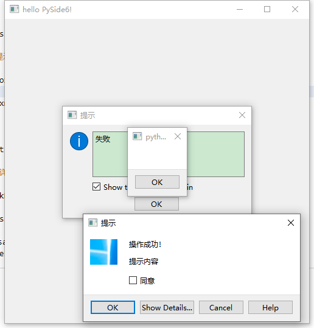
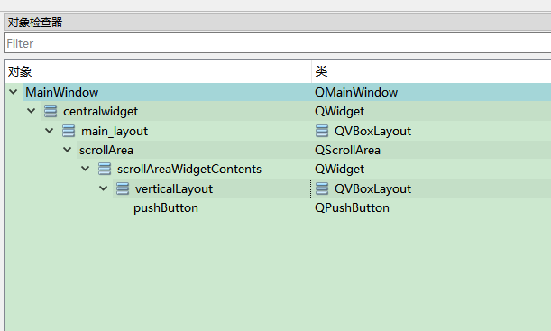
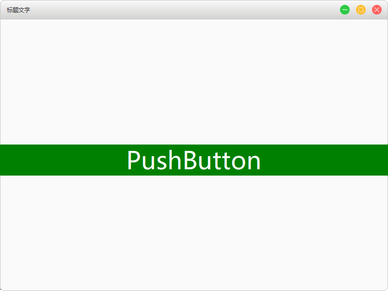

# PythonGUI
## 安装
1. 安装PySide6
```shell
pip install PySide6
```

2. designer
安装完PySide6 库里自带designer
路径大概是
```
Lib\site-packages\PySide6
```

1. 文档
   [PySide6](https://doc.qt.io/qtforpython/api.html)

2. vscode文件格式支持，编译ui文件，需要的扩展 Qt for Python

## 基本案例
```py
import sys

# 这里我们提供必要的引用。基本控件位于PySide6.qtwidgets模块中。
from PySide6.QtWidgets import QApplication, QLabel, QPushButton, QWidget


def main():
    # 创建应用程序对象  argv是命令行输入参数列表
    app = QApplication(sys.argv)
    # 创建窗口对象
    window = QWidget()
    # 设置窗口标题
    window.setWindowTitle("hello PySide6!")
    # 设置窗口大小
    window.resize(500, 500)
    # 设置窗口背景颜色
    window.setStyleSheet("background:#fafafa;")

    # 在窗口上放置一个按钮
    btn = QPushButton(window)
    # 设置按钮文字
    btn.setText("第一个按钮")
    # 设置按钮宽高
    btn.resize(120, 40)
    # 移动按钮
    btn.move(190, 230)
    # 设置样式
    btn.setStyleSheet("background:blue;color:#ffffff;font-size:16px;border-radius:3px;")

    # 在窗口上放置一个bi标签
    label = QLabel(window)
    label.setText("我是标签名")
    label.setStyleSheet("font-size:20px")
    label.move(200, 200)

    # 显示窗口
    window.show()
    # app.exec()程序一直循环运行直到主窗口被关闭终止进程  sys.exit返回退出时的状态码
    sys.exit(app.exec())


if __name__ == "__main__":
    main()
```
  

## 父子元素操作元素删除
```py
""" 
父子元素操作
"""
from PySide6.QtCore import QObject
from PySide6.QtWidgets import QApplication, QPushButton, QWidget
import sys


class Window(QWidget):
    def __init__(self):
        # 调用父类的方法
        super().__init__()
        # 初始化UI
        self.initUI()

    def initUI(self):
        """
        @description  初始化UI
        @param
        @return
        """
        # 设置窗口标题
        self.setWindowTitle("hello PySide6!")
        # 设置窗口大小
        self.resize(500, 500)
        # 设置窗口背景颜色
        self.setStyleSheet("background:#fafafa;")
        # 放置一个按钮
        btn = self.addBtn("父按钮", 100, 200, 300, 100)
        # 相当于js 设置按钮的ID
        btn.setObjectName("btn")
        # 打印按钮的ID
        print(btn.objectName())  # 输出 btn
        # 设置按钮的附加属性
        btn.setProperty("attr", "属性值1")
        btn.setProperty("name", "属性值2")
        # 打印属性
        print(btn.property("attr"))  # 输出 属性值1
        # 获取所有属性对象列表
        print(btn.dynamicPropertyNames())  # 输出[PySide6.QtCore.QByteArray(b'attr'), PySide6.QtCore.QByteArray(b'name')]
        # 创建一个按钮 这里注意的是子元素是相对于父元素定位的
        btn_son1 = self.addBtn("子按钮1", 0, 0, 120, 40, "background:red;")
        # 设置为子按钮
        btn_son1.setParent(btn)
        # 创建一个按钮
        btn_son2 = self.addBtn("子按钮2", 0, 50, 120, 40, "background:green;")
        # 设置为子按钮
        btn_son2.setParent(btn)
        # 打印父按钮的属性
        print(btn_son1.parent().property("name"))  # 输出 属性值2
        # 打印子元素列表
        print(btn.children())  # 输出 2个子按钮的列表
        # 打印子元素对象
        print(btn.findChild(QObject).text())  # 输出 子按钮1
        # 打印子元素列表
        print(btn.findChildren(QObject))  # 输出2个子按钮的列表
        # 判断控件类型
        print(btn.inherits("QPushButton"))  # 输出True
        # 删除一个按钮
        # btn_son2.deleteLater()
        # 查看指定控件有没有子元素 有则返回控件 没有则返回None
        print(btn.childAt(10, 10))  # 输出btn_son1对象
        # 查看父控件
        print(btn_son1.parentWidget())  # 输出btn对象
        # 查看子控件的范围
        print(btn.childrenRect())  # 输出PySide6.QtCore.QRect(0, 0, 120, 90)

    def addBtn(
        self,
        text="",
        x=0,
        y=0,
        width=0,
        height=0,
        style="",
    ):
        """
        @description 添加按钮
        @param
        @return
        """
        DEFAULT_STYLE = "width:120px;height:40px;background:blue;color:#ffffff;font-size:16px;border-radius:3px;"
        # 在窗口上放置一个按钮
        btn = QPushButton(self)
        # 设置按钮文字
        btn.setText(text)
        # 设置按钮宽高
        btn.resize(width, height)
        # 移动按钮
        btn.move(x, y)
        # 设置样式
        btn.setStyleSheet(DEFAULT_STYLE + style)
        return btn


def main():
    # 创建应用程序对象  argv是命令行输入参数列表
    app = QApplication(sys.argv)
    # 创建窗口对象
    window = Window()
    # 显示窗口
    window.show()
    # app.exec()程序一直循环运行直到主窗口被关闭终止进程  sys.exit返回退出时的状态码
    sys.exit(app.exec())


if __name__ == "__main__":
    main()
```
  

## 按钮事件处理机制
```py
""" 
按钮事件处理机制
"""
from PySide6.QtCore import QObject
from PySide6.QtWidgets import QApplication, QPushButton, QWidget
import sys


class Window(QWidget):
    def __init__(self):
        # 调用父类的方法
        super().__init__()
        # 初始化UI
        self.initUI()

    def initUI(self):
        """
        @description  初始化UI
        @param
        @return
        """
        # 设置窗口标题
        self.setWindowTitle("hello PySide6!")
        # 设置窗口大小
        self.resize(500, 500)
        # 设置窗口背景颜色
        self.setStyleSheet("background:#fafafa;")
        # 放置一个按钮
        btn = self.addBtn("按钮", 100, 200, 300, 100)

        def handleClickBtn():
            """
            @description 点击事件
            @param
            @return
            """
            print("点击了")

        fn = lambda: print("按下了")
        # 绑定事件
        btn.clicked.connect(handleClickBtn)
        btn.pressed.connect(fn)
        # 最终先输出按下，松开鼠标后在输出点击

    def addBtn(
        self,
        text="",
        x=0,
        y=0,
        width=0,
        height=0,
        style="",
    ):
        """
        @description 添加按钮
        @param
        @return
        """
        DEFAULT_STYLE = "width:120px;height:40px;background:blue;color:#ffffff;font-size:16px;border-radius:3px;"
        # 在窗口上放置一个按钮
        btn = QPushButton(self)
        # 设置按钮文字
        btn.setText(text)
        # 设置按钮宽高
        btn.resize(width, height)
        # 移动按钮
        btn.move(x, y)
        # 设置样式
        btn.setStyleSheet(DEFAULT_STYLE + style)
        return btn


def main():
    # 创建应用程序对象  argv是命令行输入参数列表
    app = QApplication(sys.argv)
    # 创建窗口对象
    window = Window()
    # 显示窗口
    window.show()
    # app.exec()程序一直循环运行直到主窗口被关闭终止进程  sys.exit返回退出时的状态码
    sys.exit(app.exec())


if __name__ == "__main__":
    main()
```
  

## 类封装进阶和gui里的定时器
```py
""" 
类封装和定时器
"""
from PySide6.QtWidgets import QApplication, QPushButton, QWidget
import sys
from threading import Timer


class Window(QWidget):
    def __init__(self, *args, **kwargs):
        # 调用父类的方法
        super().__init__(*args, **kwargs)
        # 初始化UI
        self.initUI()

    def initUI(self):
        """
        @description  初始化UI
        @param
        @return
        """
        # 设置窗口标题
        self.setWindowTitle("hello PySide6!")
        # 设置窗口大小
        self.resize(500, 500)
        # 设置窗口背景颜色
        self.setStyleSheet("background:#fafafa;")
        # 放置一个按钮
        btn = Btn("10", 100, 200, 300, 100, "", self)
        # 调用按钮定时器方法
        btn.setInterval2(1)


class Btn(QPushButton):
    def __init__(self, text="", x=0, y=0, width=0, height=0, style="", *args, **kwargs):
        DEFAULT_STYLE = "background:blue;color:#ffffff;font-size:16px;border-radius:3px;"
        # 调用父类的方法
        super().__init__(*args, **kwargs)
        # 设置按钮文字
        self.setText(text)
        # 设置按钮宽高
        self.resize(width, height)
        # 移动按钮
        self.move(x, y)
        # 设置样式
        self.setStyleSheet(DEFAULT_STYLE if not style else style)

    def setInterval(self, ms=1000):
        """
        @description 用内置的定时器
        @param ms 毫秒
        @return
        """
        self.interval = self.startTimer(ms)

    def timerEvent(self, *args, **kwargs):
        # 获取text中的数据
        sec = int(self.text())
        # 倒计时
        sec -= 1
        self.setText(str(sec))
        # 停止计时
        if sec == 0:
            self.killTimer(self.interval)

    def setInterval2(self, s=1):
        """
        @description 用其他的定时器
        @param s秒
        @return
        """
        self.t = Timer(s, self.setInterval2, (s,))
        self.t.start()
        self.fn()

    def fn(self):
        # 获取text中的数据
        sec = int(self.text())
        # 倒计时
        sec -= 1
        self.setText(str(sec))
        # 停止计时
        if sec == 0:
            self.t.cancel()


def main():
    # 创建应用程序对象  argv是命令行输入参数列表
    app = QApplication(sys.argv)
    # 创建窗口对象
    window = Window()
    # 显示窗口
    window.show()
    # app.exec()程序一直循环运行直到主窗口被关闭终止进程  sys.exit返回退出时的状态码
    sys.exit(app.exec())


if __name__ == "__main__":
    main()
```
  

## 自定义按钮事件含传参
```py
""" 
自定义按钮事件(右键事件)含传参
"""
from PySide6 import QtGui
from PySide6.QtCore import Qt, Signal
from PySide6.QtWidgets import QApplication, QPushButton, QWidget
import sys


class Window(QWidget):
    def __init__(self):
        # 调用父类的方法
        super().__init__()
        # 初始化UI
        self.initUI()

    def initUI(self):
        """
        @description  初始化UI
        @param
        @return
        """
        # 设置窗口标题
        self.setWindowTitle("hello PySide6!")
        # 设置窗口大小
        self.resize(500, 500)
        # 设置窗口背景颜色
        self.setStyleSheet("background:#fafafa;")
        # 放置一个按钮
        btn = self.addBtn("按钮", 100, 200, 300, 100)

        def handleClickBtn():
            """
            @description 点击事件
            @param
            @return
            """
            print("点击了")

        fn = lambda: print("按下了")
        # 绑定事件
        btn.clicked.connect(handleClickBtn)
        btn.pressed.connect(fn)
        # 最终先输出按下，松开鼠标后在输出点击
        # 绑定自定义事件 并传参，我感觉这个传参没什么鸟用
        btn.rightClicked[str, int].connect(lambda x, y: print("右键按下" + x + "，宽度是：" + str(y)))  # 输出右键按下按钮300

    def addBtn(
        self,
        text="",
        x=0,
        y=0,
        width=0,
        height=0,
        style="",
    ):
        """
        @description 添加按钮
        @param
        @return
        """
        DEFAULT_STYLE = "width:120px;height:40px;background:blue;color:#ffffff;font-size:16px;border-radius:3px;"
        # 在窗口上放置一个按钮
        btn = Btn(self)
        # 设置按钮文字
        btn.setText(text)
        # 设置按钮宽高
        btn.resize(width, height)
        # 移动按钮
        btn.move(x, y)
        # 设置样式
        btn.setStyleSheet(DEFAULT_STYLE + style)
        return btn


class Btn(QPushButton):
    """
    @description 按钮类继承自QPushButton
    @param
    @return
    """

    # 定义类属性
    # 定义了一个信号 且传递按钮的参数出去
    rightClicked = Signal([str, int])

    def mousePressEvent(self, e: QtGui.QMouseEvent) -> None:
        """
        @description 自定义鼠标按下事件
        @param
        @return
        """
        if e.button() == Qt.RightButton:
            # e.button()的值为 1左键 2右键 比较用枚举值或1,2来比较
            # emit 触发绑定的事件
            self.rightClicked[str, int].emit(self.text(), self.width())
        return super().mousePressEvent(e)


def main():
    # 创建应用程序对象  argv是命令行输入参数列表
    app = QApplication(sys.argv)
    # 创建窗口对象
    window = Window()
    # 显示窗口
    window.show()
    # app.exec()程序一直循环运行直到主窗口被关闭终止进程  sys.exit返回退出时的状态码
    sys.exit(app.exec())


if __name__ == "__main__":
    main()
```

## 使用装饰器自动连接绑定的事件
```py
""" 
使用装饰器自动连接绑定的事件
"""
from PySide6.QtCore import QMetaObject, Slot
from PySide6.QtWidgets import QApplication, QPushButton, QWidget
import sys


class Window(QWidget):
    def __init__(self):
        # 调用父类的方法
        super().__init__()
        # 初始化UI
        self.initUI()

    def initUI(self):
        """
        @description  初始化UI
        @param
        @return
        """
        # 设置窗口标题
        self.setWindowTitle("hello PySide6!")
        # 设置窗口大小
        self.resize(500, 500)
        # 设置窗口背景颜色
        self.setStyleSheet("background:#fafafa;")
        # 放置一个按钮
        btn = self.addBtn("按钮", 100, 200, 300, 100)
        # 设置按钮的唯一Name值
        btn.setObjectName("btn")
        # 使用自动绑定事件通过唯一Name值
        QMetaObject.connectSlotsByName(self)

    # 加装饰器 避免打印一次
    @Slot()
    def on_btn_clicked(self):
        """
        @description 自动绑定的点击事件 必须这样写
        @param
        @return
        """
        print("点击了")

    def addBtn(
        self,
        text="",
        x=0,
        y=0,
        width=0,
        height=0,
        style="",
    ):
        """
        @description 添加按钮
        @param
        @return
        """
        DEFAULT_STYLE = "width:120px;height:40px;background:blue;color:#ffffff;font-size:16px;border-radius:3px;"
        # 在窗口上放置一个按钮
        btn = QPushButton(self)
        # 设置按钮文字
        btn.setText(text)
        # 设置按钮宽高
        btn.resize(width, height)
        # 移动按钮
        btn.move(x, y)
        # 设置样式
        btn.setStyleSheet(DEFAULT_STYLE + style)
        return btn


def main():
    # 创建应用程序对象  argv是命令行输入参数列表
    app = QApplication(sys.argv)
    # 创建窗口对象
    window = Window()
    # 显示窗口
    window.show()
    # app.exec()程序一直循环运行直到主窗口被关闭终止进程  sys.exit返回退出时的状态码
    sys.exit(app.exec())


if __name__ == "__main__":
    main()
```

## 类之间信号和槽的用法
解释一下：信号就是去触发事件的方法，槽就是要触发的事件
```py
from PySide6.QtCore import QObject, Signal


class Signal(QObject):
    """
    @description 创建一个信号类
    @param
    @return
    """

    # 定义一个信号
    clicked = Signal(str)

    def trigger(self):
        """
        @description 去触发事件的方法
        @param
        @return
        """
        self.clicked.emit("我是触发事件的参数")


class Solt(QObject):
    """
    @description他们叫槽，其实就是上面信号触发的事件
    @param
    @return
    """

    def handleClicked(self, str):
        print(str)


def main():
    # 创建信号
    signal = Signal()
    # 创建槽
    solt = Solt()
    # 绑定信号和槽  就是绑定事件
    signal.clicked.connect(solt.handleClicked)
    # 触发
    signal.trigger()  # 输出我是触发事件的参数


if __name__ == "__main__":
    main()
```
!> 这里的solt.handleClicked可以换成任意函数 或者lambda str: print(str))

!> 信号和槽可以用在不同窗口之间传递数据

## 设置控件尺寸/边距/层级关系
```py
"""
设置控件尺寸,边距,层级关系
"""
from PySide6.QtWidgets import QApplication, QLabel, QPushButton, QWidget
import sys


class Window(QWidget):
    def __init__(self):
        # 调用父类的方法
        super().__init__()
        # 初始化UI
        self.initUI()

    def initUI(self):
        """
        @description  初始化UI
        @param
        @return
        """
        # 设置窗口标题
        self.setWindowTitle("hello PySide6!")
        # 设置窗口大小
        self.resize(500, 500)
        # 设置窗口背景颜色
        self.setStyleSheet("background:#fafafa;")
        # 设置最小尺寸和最大尺寸
        self.setMaximumSize(800, 800)
        self.setMinimumSize(400, 400)
        # 放置一个按钮
        btn = self.addBtn("按钮", 190, 230, 120, 40)
        # 设置内容自适应
        btn.adjustSize()
        # 设置固定尺寸后 其他设置宽高就没用了
        btn.setFixedSize(100, 100)
        # 放置一个标签
        label = self.addLabel("标签", 10, 10, 120, 40)
        # 设置标签边距
        label.setContentsMargins(50, 0, 0, 0)
        # 打印边距
        print(label.contentsMargins())
        # 打印内容区域
        print(label.contentsRect())
        # 放置一个标签
        label2 = self.addLabel("标签2", 20, 20, 120, 40, "background:green;")
        # 在放置一个标签叠加起来
        label3 = self.addLabel("标签3", 30, 30, 120, 40, "background:red;")
        # 让标签2在最上面 提升层级
        label2.raise_()
        # 让标签3在最小面 降低层级
        label3.lower()
        # 将标签2放到标签1的下面
        label2.stackUnder(label)

    def addBtn(
        self,
        text="",
        x=0,
        y=0,
        width=0,
        height=0,
        style="",
    ):
        """
        @description 添加按钮
        @param
        @return
        """
        DEfAULT_STYLE = "width:120px;height:40px;background:blue;color:#ffffff;font-size:16px;border-radius:3px;"
        # 在窗口上放置一个按钮
        btn = QPushButton(self)
        # 设置按钮文字
        btn.setText(text)
        # # 设置按钮宽高
        btn.resize(width, height)
        # # 移动按钮
        btn.move(x, y)
        # 上面2行代码可以用下面的代替
        btn.setGeometry(x, y, width, height)
        # 设置样式
        btn.setStyleSheet(DEfAULT_STYLE + style)
        return btn

    def addLabel(
        self,
        text="",
        x=0,
        y=0,
        width=0,
        height=0,
        style="",
    ):
        """
        @description  添加标签
        @param
        @return
        """
        DEfAULT_STYLE = "width:120px;height:40px;background:blue;color:#ffffff;font-size:16px;border-radius:3px;"
        # 窗口上放置一个标签
        label = QLabel(self)
        # 设置文字
        label.setText(text)
        # 设置位置
        label.setGeometry(x, y, width, height)
        # 设置样式
        label.setStyleSheet(DEfAULT_STYLE + style)
        return label


def main():
    # 创建应用程序对象  argv是命令行输入参数列表
    app = QApplication(sys.argv)
    # 创建窗口对象
    window = Window()
    # 显示窗口
    window.show()
    # app.exec()程序一直循环运行直到主窗口被关闭终止进程  sys.exit返回退出时的状态码
    sys.exit(app.exec())


if __name__ == "__main__":
    main()
```
  

## 设置鼠标状态和样式
```py
"""
设置鼠标状态和样式
"""

from PySide6.QtCore import Qt
from PySide6.QtGui import QCursor, QPixmap
from PySide6.QtWidgets import QApplication, QPushButton, QWidget
import sys


class Window(QWidget):
    def __init__(self):
        # 调用父类的方法
        super().__init__()
        # 初始化UI
        self.initUI()

    def initUI(self):
        """
        @description  初始化UI
        @param
        @return
        """
        # 设置窗口标题
        self.setWindowTitle("hello PySide6!")
        # 设置窗口大小
        self.resize(500, 500)
        # 设置窗口背景颜色
        self.setStyleSheet("background:#fafafa;")
        # 设置最小尺寸和最大尺寸
        self.setMaximumSize(800, 800)
        self.setMinimumSize(400, 400)
        # 放置一个按钮
        btn = self.addBtn("按钮", 190, 230, 120, 40)
        # 设置鼠标移入状态为手型 https://www.riverbankcomputing.com/static/Docs/PySide6/api/qtgui/qcursor.html
        btn.setCursor(Qt.CursorShape.PointingHandCursor)
        # 设置鼠标样式
        # 导入一张图片
        image = QPixmap("1.png")
        # 图片缩放
        new_image = image.scaled(10, 10)
        # 创建鼠标对象 bitmap,offsetx,offsety 鼠标中心焦点相对于图片的偏移位置
        cursor = QCursor(new_image, 0, 0)
        # 给当前窗口设置鼠标样式 可给任意控件设置鼠标样式
        self.setCursor(cursor)

    def addBtn(
        self,
        text="",
        x=0,
        y=0,
        width=0,
        height=0,
        style="",
    ):
        """
        @description 添加按钮
        @param
        @return
        """
        DEfAULT_STYLE = "width:120px;height:40px;background:blue;color:#ffffff;font-size:16px;border-radius:3px;"
        # 在窗口上放置一个按钮
        btn = QPushButton(self)
        # 设置按钮文字
        btn.setText(text)
        # # 设置按钮宽高
        btn.resize(width, height)
        # # 移动按钮
        btn.move(x, y)
        # 上面2行代码可以用下面的代替
        btn.setGeometry(x, y, width, height)
        # 设置样式
        btn.setStyleSheet(DEfAULT_STYLE + style)
        return btn


def main():
    # 创建应用程序对象  argv是命令行输入参数列表
    app = QApplication(sys.argv)
    # 创建窗口对象
    window = Window()
    # 显示窗口
    window.show()
    # app.exec()程序一直循环运行直到主窗口被关闭终止进程  sys.exit返回退出时的状态码
    sys.exit(app.exec())


if __name__ == "__main__":
    main()
```


## 鼠标事件
```py
""" 
鼠标事件
"""
from PySide6 import QtGui
from PySide6 import QtCore
from PySide6.QtWidgets import QApplication, QWidget
import sys


class Window(QWidget):
    def __init__(self):
        # 调用父类的方法
        super().__init__()
        # 初始化UI
        self.initUI()

    def initUI(self):
        """
        @description  初始化UI
        @param
        @return
        """
        # 设置窗口标题
        self.setWindowTitle("hello PySide6!")
        # 设置窗口大小
        self.resize(500, 500)
        # 设置窗口背景颜色
        self.setStyleSheet("background:#fafafa;")
        # 设置为True则mouseMoveEvent事件不需要按下也能触发,不然要按着鼠标左键或右键才能触发
        self.setMouseTracking(True)

    def mouseMoveEvent(self, a0: QtGui.QMouseEvent) -> None:
        """
        @description 鼠标移动事件
        @param
        @return
        """
        print("鼠标移动 x:" + str(a0.position().x()) + ",y:" + str(a0.position().y()))
        return super().mouseMoveEvent(a0)

    def mousePressEvent(self, a0: QtGui.QMouseEvent) -> None:
        """
        @description 鼠标按下事件
        @param
        @return
        """
        print("鼠标按下")
        # 鼠标相对于系统桌面的位置
        print(a0.globalPosition())
        # 鼠标相对于主界面的位置
        print(a0.position())
        return super().mousePressEvent(a0)

    def mouseDoubleClickEvent(self, a0: QtGui.QMouseEvent) -> None:
        """
        @description 鼠标双击事件
        @param
        @return
        """
        print("鼠标双击")
        return super().mouseDoubleClickEvent(a0)

    def mouseReleaseEvent(self, a0: QtGui.QMouseEvent) -> None:
        """
        @description 鼠标松开事件
        @param
        @return
        """
        print("鼠标松开")
        return super().mouseReleaseEvent(a0)

    def enterEvent(self, a0: QtCore.QEvent) -> None:
        """
        @description 鼠标进入事件
        @param
        @return
        """
        print("鼠标进入")
        return super().enterEvent(a0)

    def leaveEvent(self, a0: QtCore.QEvent) -> None:
        """
        @description 鼠标离开事件
        @param
        @return
        """
        print("鼠标离开")
        return super().leaveEvent(a0)


def main():
    # 创建应用程序对象  argv是命令行输入参数列表
    app = QApplication(sys.argv)
    # 创建窗口对象
    window = Window()
    # 显示窗口
    window.show()
    # app.exec()程序一直循环运行直到主窗口被关闭终止进程  sys.exit返回退出时的状态码
    sys.exit(app.exec())


if __name__ == "__main__":
    main()
```
  

## 窗口事件
```py
""" 
窗口事件
"""
from PySide6 import QtGui
from PySide6.QtWidgets import QApplication, QWidget
import sys


class Window(QWidget):
    def __init__(self):
        # 调用父类的方法
        super().__init__()
        # 初始化UI
        self.initUI()

    def initUI(self):
        """
        @description  初始化UI
        @param
        @return
        """
        # 设置窗口标题
        self.setWindowTitle("hello PySide6!")
        # 设置窗口大小
        self.resize(500, 500)
        # 设置窗口背景颜色
        self.setStyleSheet("background:#fafafa;")

    def showEvent(self, a0: QtGui.QShowEvent) -> None:
        """
        @description  窗口显示事件
        @param
        @return
        """
        print("窗口显示")
        return super().showEvent(a0)

    def hideEvent(self, a0: QtGui.QHideEvent) -> None:
        """
        @description  窗口隐藏事件
        @param
        @return
        """
        print("窗口隐藏")
        return super().hideEvent(a0)

    def closeEvent(self, a0: QtGui.QCloseEvent) -> None:
        """
        @description  窗口关闭事件
        @param
        @return
        """
        print("窗口关闭")
        return super().closeEvent(a0)

    def moveEvent(self, a0: QtGui.QMoveEvent) -> None:
        """
        @description  窗口移动事件
        @param
        @return
        """
        print("窗口移动事件")
        return super().moveEvent(a0)

    def resizeEvent(self, a0: QtGui.QResizeEvent) -> None:
        """
        @description  窗口缩放事件
        @param
        @return
        """
        print("窗口缩放事件")
        return super().resizeEvent(a0)


def main():
    # 创建应用程序对象  argv是命令行输入参数列表
    app = QApplication(sys.argv)
    # 创建窗口对象
    window = Window()
    # 显示窗口
    window.show()
    # app.exec()程序一直循环运行直到主窗口被关闭终止进程  sys.exit返回退出时的状态码
    sys.exit(app.exec())


if __name__ == "__main__":
    main()
```

## 设置控件显示和启用
```py
"""
设置控件显示和启用
"""
from PySide6.QtWidgets import QApplication, QLabel, QPushButton, QWidget
import sys


class Window(QWidget):
    def __init__(self):
        # 调用父类的方法
        super().__init__()
        # 初始化UI
        self.initUI()

    def initUI(self):
        """
        @description  初始化UI
        @param
        @return
        """
        # 设置窗口标题
        self.setWindowTitle("[*]hello PySide6!")
        # 设置窗口大小
        self.resize(500, 500)
        # 设置窗口背景颜色
        self.setStyleSheet("background:#fafafa;")
        # 放置一个按钮
        btn = self.addBtn("按钮", 190, 230, 120, 40)
        # 设置是否可用
        btn.setEnabled(True)
        # 判断是否可用
        print(btn.isEnabled())
        # 设置是否显示
        btn.setVisible(False)
        # 判断是否显示
        print(btn.isVisible())
        # 设置是否隐藏
        btn.setHidden(False)
        # 判断是是否隐藏
        print(btn.isHidden())
        # 关闭按钮 效果和隐藏一样
        btn.close()
        # 直接隐藏
        btn.hide()
        # 直接显示
        btn.show()
        # 设置窗口是否编辑 需要在设置标题里setWindowTitle 加上[*]
        self.setWindowModified(True)  # 设置完后处理编辑的窗口标题会显示*号
        # 判断窗口是否处理编辑状态
        print(self.isWindowModified())

    def addBtn(
        self,
        text="",
        x=0,
        y=0,
        width=0,
        height=0,
    ):
        """
        @description 添加按钮
        @param
        @return
        """
        # 在窗口上放置一个按钮
        btn = QPushButton(self)
        # 设置按钮文字
        btn.setText(text)
        # # 设置按钮宽高
        btn.resize(width, height)
        # # 移动按钮
        btn.move(x, y)
        return btn


def main():
    # 创建应用程序对象  argv是命令行输入参数列表
    app = QApplication(sys.argv)
    # 创建窗口对象
    window = Window()
    # 显示窗口
    window.show()
    # 创建窗口2
    window2 = Window()
    # 显示窗口
    window2.show()
    # 判断当前窗口是否是激活的窗口
    print(window.isActiveWindow())  # 输出False
    print(window2.isActiveWindow())  # 输出True
    # app.exec()程序一直循环运行直到主窗口被关闭终止进程  sys.exit返回退出时的状态码
    sys.exit(app.exec())


if __name__ == "__main__":
    main()
```

## 键盘交互事件
```py
"""
键盘交互事件
"""
from PySide6 import QtGui
from PySide6.QtCore import Qt
from PySide6.QtWidgets import QApplication, QLabel, QPushButton, QWidget
import sys


class Window(QWidget):
    def __init__(self):
        # 调用父类的方法
        super().__init__()

    def keyPressEvent(self, a0: QtGui.QKeyEvent) -> None:
        """
        @description 键盘按下
        @param
        @return
        """
        if a0.key() == Qt.Key.Key_A:
            print("按下了A键")
        if a0.modifiers() == Qt.KeyboardModifier.ControlModifier and a0.key() == Qt.Key.Key_C:
            print("按下了组合键Ctrl+C")
        if (
            a0.modifiers() == Qt.KeyboardModifier.ControlModifier | Qt.KeyboardModifier.ShiftModifier
            and a0.key() == Qt.Key.Key_C
        ):
            print("按下了组合键Ctrl+Shift+C")
        return super().keyPressEvent(a0)

    def keyReleaseEvent(self, a0: QtGui.QKeyEvent) -> None:
        """
        @description 键盘松开
        @param
        @return
        """
        return super().keyReleaseEvent(a0)


def main():
    # 创建应用程序对象  argv是命令行输入参数列表
    app = QApplication(sys.argv)
    # 创建窗口对象
    window = Window()
    # 显示窗口
    window.show()
    # app.exec()程序一直循环运行直到主窗口被关闭终止进程  sys.exit返回退出时的状态码
    sys.exit(app.exec())


if __name__ == "__main__":
    main()
```
  

## 单行文本框焦点控制
```py
"""
单行文本框焦点控制
"""
from PySide6 import QtGui
from PySide6.QtCore import Qt
from PySide6.QtWidgets import QApplication, QLabel, QLineEdit, QPushButton, QWidget
import sys


class Window(QWidget):
    def __init__(self):
        # 调用父类的方法
        super().__init__()
        # 初始化UI
        self.initUI()

    def initUI(self):
        """
        @description  初始化UI
        @param
        @return
        """
        # 设置窗口标题
        self.setWindowTitle("hello PySide6!")
        # 设置窗口大小
        self.resize(500, 500)
        # 设置窗口背景颜色
        self.setStyleSheet("background:#fafafa;")
        # 创建单行文本框
        text1 = QLineEdit(self)
        text1.move(100, 100)
        text2 = QLineEdit(self)
        text2.move(100, 200)
        text3 = QLineEdit(self)
        text3.move(100, 300)
        # 设置焦点
        text2.setFocus()
        # 清除焦点
        text2.clearFocus()
        # 切换焦点的方式 TabFocus tab切换  StrongFocus tab和click切换 NoFocus 不能切换 WheelFocus滚轮点击切换
        text3.setFocusPolicy(Qt.FocusPolicy.NoFocus)


def main():
    # 创建应用程序对象  argv是命令行输入参数列表
    app = QApplication(sys.argv)
    # 创建窗口对象
    window = Window()
    # 显示窗口
    window.show()
    # app.exec()程序一直循环运行直到主窗口被关闭终止进程  sys.exit返回退出时的状态码
    sys.exit(app.exec())


if __name__ == "__main__":
    main()
```
  

## 单行文本框
```py
"""
单行文本框
"""
from PySide6.QtCore import Qt
from PySide6.QtGui import QIcon, QAction
from PySide6.QtWidgets import QApplication, QCompleter, QLineEdit, QWidget
import sys


class Window(QWidget):
    def __init__(self):
        # 调用父类的方法
        super().__init__()
        # 初始化UI
        self.initUI()

    def initUI(self):
        """
        @description  初始化UI
        @param
        @return
        """
        # 设置窗口标题
        self.setWindowTitle("hello PySide6!")
        # 设置窗口大小
        self.resize(500, 500)
        # 添加单行文本框
        input = QLineEdit("", self)
        # 设置对齐方式 如右对齐
        input.setAlignment(Qt.AlignmentFlag.AlignRight)
        # 设置默认值
        input.setText("默认值")
        # 在光标处插入值
        input.insert("插入的值")
        # 设置输出模式 Normal Password PasswordEchoOnEdit
        input.setEchoMode(QLineEdit.Normal)
        # 打印文本
        print(input.text())
        # 获取文本框显示的内容 例如Password模式 输出●●●●●●●
        print(input.displayText())
        # 设置提示字符
        input.setPlaceholderText("请输入用户名")
        # 设置清空按钮
        input.setClearButtonEnabled(True)
        # 创建自动补全对象绑定到输入框
        auto_complete = QCompleter(["小明", "小红"], input)
        # 给输入框设置自动补全对象
        input.setCompleter(auto_complete)
        # 设置字符长度限制
        input.setMaxLength(10)
        # 设置只读
        input.setReadOnly(False)
        # 选中指定位置内容 索引2 开始 选中3个字符
        input.setSelection(2, 3)
        # 清空内容
        # input.clear()
        # 是复制选中的内容，不是赋值全部内容
        # input.copy()
        # 粘贴拷贝的内容到光标处
        # input.paste()

        # 信号
        # 文本编辑信号 输出改变的值 只有在手动输入的时候触发
        input.textEdited.connect(lambda val: print(val))
        # 文本改变信号 输出改变的值 不管是手动输入还是自己用setText设置都会触发
        input.textChanged.connect(lambda val: print(val))
        # 回车信号
        input.returnPressed.connect(lambda: print("按下回车键"))

        # 创建一个表单对象
        action = QAction(input)
        # 设置对象图标
        action.setIcon(QIcon("./1.png"))
        # 将表单对象放入input控件  LeadingPosition 首部 TrailingPosition 尾部
        input.addAction(action, QLineEdit.LeadingPosition)
        # 表单对象切换事件 这里点击时切换输出模式就可实现密码显示隐藏的功能
        action.triggered.connect(lambda: print("点击了图标"))

        # 创建IP输入框 不好用！
        ip_input = QLineEdit("", self)
        ip_input.move(0, 300)
        # 设置掩码 0 可以输入0~9的数字  -是连接符  ;0是默认占位符
        # ip_input.setInputMask("000-000-000-000;0")
        ip_input.setInputMask("000-000-000-000")


def main():
    # 创建应用程序对象  argv是命令行输入参数列表
    app = QApplication(sys.argv)
    # 创建窗口对象
    window = Window()
    # 显示窗口
    window.show()
    # app.exec()程序一直循环运行直到主窗口被关闭终止进程  sys.exit返回退出时的状态码
    sys.exit(app.exec())


if __name__ == "__main__":
    main()
```
  
掩码表 下图问题解答
```py
input.setInputMask("(000)000-0000")
```
  

## 前端验证器
```py
"""
前端验证器
"""
import PySide6
from PySide6.QtGui import QValidator
from PySide6.QtWidgets import QApplication, QLineEdit, QWidget
import sys

# 验证器类
class Validator(QValidator):
    def validate(self, text: str, pos: int) -> PySide6.QtGui.QValidator.State:
        """
        @description 自动验证方法 验证数字范围
        @param text 输入的内容
        @param pos 当前输入的位置
        @return
        """
        # 如果输入的整个字符串转整形后大于大于10 小于100 才能验证通过
        try:
            # 转换成整形  可能会报异常
            num = int(text)
            # 输入的输大于10 小于100 才符合条件
            if num > 10 and num < 100:
                return (QValidator.Acceptable, text, pos)
            # 如果输入数大于0 小于等于10 先不验证 可以继续输入 光标离开后验证(点击一下桌面看效果)
            elif num > 0 and num <= 10:
                return (QValidator.Intermediate, text, pos)
            # 其他验证不通过
            else:
                return (QValidator.Invalid, text, pos)
        except:
            # 如果输入为空字符串 可以继续输入
            if not text:
                return (QValidator.Intermediate, text, pos)
            # 否则直接验证不通过
            return (QValidator.Invalid, text, pos)

    def fixup(self, text: str) -> None:
        """
        @description 自动更正内容 验证不通过后走这里的方法
        @param
        @return
        """
        try:
            num = int(text)
            if num <= 10:
                # 如果输入的值小于10 自动更正为11
                return "11"
        except:
            # 如果全部删除变成空字符串执行
            return "11"


class Window(QWidget):
    def __init__(self):
        # 调用父类的方法
        super().__init__()
        # 初始化UI
        self.initUI()

    def initUI(self):
        """
        @description  初始化UI
        @param
        @return
        """
        # 设置窗口标题
        self.setWindowTitle("hello PySide6!")
        # 设置窗口大小
        self.resize(500, 500)
        # 添加单行文本框
        input = QLineEdit("", self)
        # 实例化
        validator = Validator()
        input.setValidator(validator)


def main():
    # 创建应用程序对象  argv是命令行输入参数列表
    app = QApplication(sys.argv)
    # 创建窗口对象
    window = Window()
    # 显示窗口
    window.show()
    # app.exec()程序一直循环运行直到主窗口被关闭终止进程  sys.exit返回退出时的状态码
    sys.exit(app.exec())


if __name__ == "__main__":
    main()
```

## 多行文本框
```py
"""
多行文本框
"""
from PySide6.QtCore import Qt
from PySide6.QtGui import QColor, QFont, QTextCharFormat, QTextDocument,QTextOption
from PySide6.QtWidgets import QApplication, QFrame, QPlainTextEdit, QPushButton, QTextBrowser, QTextEdit, QWidget
import sys


class Window(QWidget):
    def __init__(self):
        # 调用父类的方法
        super().__init__()
        # 初始化UI
        self.initUI()

    def initUI(self):
        """
        @description  初始化UI
        @param
        @return
        """
        # 设置窗口标题
        self.setWindowTitle("hello PySide6!")
        # 设置窗口大小
        self.resize(500, 700)
        # 添加多行文本框
        textarea = QTextEdit("多行文本框", self)
        # 设置占位符
        textarea.setPlaceholderText("描述")
        # 设置滚动条ScrollBarAsNeeded ScrollBarAlwaysOn ScrollBarAlwaysOff
        textarea.setVerticalScrollBarPolicy(Qt.ScrollBarPolicy.ScrollBarAlwaysOn)
        textarea.setHorizontalScrollBarPolicy(Qt.ScrollBarPolicy.ScrollBarAlwaysOn)
        # 设置滚动条角落控件
        btn = QPushButton("*", self)
        textarea.setCornerWidget(btn)
        # 设置边框
        textarea.setFrameStyle(QFrame.Box | QFrame.Raised)
        # 设置普通文本
        textarea.setPlainText("普通文本")
        # 获取内容
        print(textarea.toPlainText())
        # 设置富文本
        textarea.setHtml("<h1>富文本</h1>")
        # 获取内容
        print(textarea.toHtml())
        # 追加内容
        textarea.append("追加内容")
        # 清空内容
        textarea.clear()

        # 操作文本
        # 1.设置输入按单词换行模式
        # textarea.setWordWrapMode(QTextOption.WrapMode.WordWrap)
        # 2.设置以控件宽度为标准换行
        textarea.setLineWrapMode(QTextEdit.WidgetWidth)
        # 3.设置覆盖输入模式 没啥用
        textarea.setOverwriteMode(False)
        # 4.设置光标宽度 没啥用
        textarea.setCursorWidth(1)
        # 5.设置段落对齐方式 AlignRight AlignLeft AlignCenter
        textarea.setAlignment(Qt.AlignRight)
        # 6.设置字体格式 字体 字体大小 字体粗细 是否斜体
        textarea.setFont(QFont("Microsoft-yahei", 20, 30, True))
        # 7.设置下划线
        # textarea.setStyleSheet("text-decoration: underline;")
        textarea.setFontUnderline(True)
        # 8.复制文本
        textarea.copy()
        # 9.粘贴内容
        textarea.paste()
        # 10.重做
        textarea.undo()
        # 11.全选
        textarea.selectAll()
        # 12.向前查找
        textarea.find("查找的字符串", QTextDocument.FindBackward)
        # 13.设置只读
        textarea.setReadOnly(False)

        # 信号
        textarea.textChanged.connect(lambda: print("文本内容改变"))
        textarea.cursorPositionChanged.connect(lambda: print("光标位置改变改变"))

        # 光标操作 不常用
        # 1.创建光标对象
        text_cursor = textarea.textCursor()
        # 2.可以设置字体格式
        tcf = QTextCharFormat()
        tcf.setFontPointSize(20)
        # 3.插入文本
        text_cursor.insertText("通过光标对象插入的内容\n", tcf)
        text_cursor.insertHtml("通过光标对象插入的html")

        # 直接设置文本块的格式
        text_cursor.setBlockCharFormat(tcf)
        # 设置文本字符格式 是设置光标选中字符的格式
        text_cursor.setCharFormat(tcf)

        # 大文本编辑框
        textarea_big = QPlainTextEdit(self)
        textarea_big.move(0, 200)
        # 设置文本
        textarea_big.setPlainText("大文本编辑框")
        # 获取文本
        textarea_big.toPlainText()
        # 追加内容
        textarea_big.appendPlainText("追加内容")

        # 文本浏览框 只读的大文本浏览框
        textarea_browser = QTextBrowser(self)
        textarea_browser.move(0, 400)
        # 设置文本
        textarea_browser.setPlainText("文本浏览框")
        # 获取文本
        textarea_browser.toPlainText()
        # 追加内容
        textarea_browser.append("追加内容")


def main():
    # 创建应用程序对象  argv是命令行输入参数列表
    app = QApplication(sys.argv)
    # 创建窗口对象
    window = Window()
    # 显示窗口
    window.show()
    # app.exec()程序一直循环运行直到主窗口被关闭终止进程  sys.exit返回退出时的状态码
    sys.exit(app.exec())


if __name__ == "__main__":
    main()
```
  
  

## 步长和日期输入框
```py
"""
步长和日期输入框
"""
from PySide6.QtCore import QDate, QDateTime, QTime
from PySide6.QtWidgets import QApplication, QDateTimeEdit, QDoubleSpinBox, QSpinBox, QWidget
import sys
import time


class Window(QWidget):
    def __init__(self):
        # 调用父类的方法
        super().__init__()
        # 初始化UI
        self.initUI()

    def initUI(self):
        """
        @description  初始化UI
        @param
        @return
        """
        # 设置窗口标题
        self.setWindowTitle("hello PySide6!")
        # 设置窗口大小
        self.resize(500, 700)
        # 创建整型步长输入框
        int_step = QSpinBox(self)
        int_step.resize(100, 30)
        # 修改范围
        int_step.setMaximum(10)
        int_step.setMinimum(2)
        int_step.setRange(2, 10)
        # 设置循环
        int_step.setWrapping(True)
        # 设置步长
        int_step.setSingleStep(2)
        # 设置前缀后缀
        int_step.setPrefix("￥")
        int_step.setSuffix("元")
        # 设置特殊值 追加上去的
        # int_step.setSpecialValueText("￥100元")
        # 设置显示进制 为10进制
        int_step.setDisplayIntegerBase(10)
        # 获取值 cleanText 不包括前后缀
        print(int_step.text(), int_step.value(), int_step.lineEdit().text(), int_step.cleanText())
        # 设置值
        int_step.setValue(2)

        # 整型步长输入框信号
        int_step.valueChanged.connect(lambda: print("值改变"))
        int_step.textChanged.connect(lambda: print("文本发生改变"))

        # 浮点型步长输入框
        float_step = QDoubleSpinBox(self)
        float_step.resize(100, 30)
        float_step.move(0, 50)
        # 小数位数设置
        float_step.setDecimals(4)

        # 浮点型步长输入框信号 事件传递的参数直接为浮点型 都不用转化了
        float_step.valueChanged[float].connect(lambda val: print(type(val)))
        float_step.textChanged[str].connect(lambda val: print(type(val)))

        # 日期时间步长输入框
        # datetime_step = QDateTimeEdit(QDateTime(2021, 7, 2, 10, 35), self)
        datetime_step = QDateTimeEdit(QDateTime.currentDateTime(), self)
        datetime_step.resize(150, 30)
        datetime_step.move(0, 100)
        # 设置显示样式
        datetime_step.setDisplayFormat("yyyy-MM-dd HH:mm:ss")
        # 设置可选择的时间范围
        datetime_step.setMinimumDateTime(QDateTime(2020, 7, 2, 10, 35, 00))
        datetime_step.setMaximumDateTime(QDateTime(2022, 7, 2, 10, 35, 00))
        # datetime_step.setDateTimeRange(QDateTime(2020, 7, 2, 10, 35, 00), QDateTime(2022, 7, 2, 10, 35, 00))
        # 设置前一个月和后一个月
        datetime_step.setDateTimeRange(
            QDateTime.currentDateTime().addMonths(-1), QDateTime.currentDateTime().addMonths(1)
        )
        # 设置为日历选择器
        datetime_step.setCalendarPopup(True)
        # 获取时间和日期
        print(datetime_step.text(), datetime_step.dateTime().toString("yyyy-MM-dd HH:mm:ss"))
        # datetime_step.date()
        # datetime_step.time()
        # 信号
        datetime_step.dateTimeChanged.connect(lambda val: print(val.toString("yyyy-MM-dd HH:mm:ss")))
        # datetime_step.dateChanged.connect(lambda val: print(val.toString("yyyy-MM-dd HH:mm:ss")))
        # datetime_step.timeChanged.connect(lambda val: print(val.toString("yyyy-MM-dd HH:mm:ss")))

        # 日期、时间步长输入框
        date_step = QDateTimeEdit(QDate.currentDate(), self)
        time_step = QDateTimeEdit(QTime.currentTime(), self)
        date_step.move(150, 100)
        time_step.move(300, 100)


def main():
    # 创建应用程序对象  argv是命令行输入参数列表
    app = QApplication(sys.argv)
    # 创建窗口对象
    window = Window()
    # 显示窗口
    window.show()
    # app.exec()程序一直循环运行直到主窗口被关闭终止进程  sys.exit返回退出时的状态码
    sys.exit(app.exec())


if __name__ == "__main__":
    main()
```
  
  

## 下拉选择框
```py
"""
下拉选择框
"""
from PySide6.QtCore import QSize
from PySide6.QtGui import QIcon
from PySide6.QtWidgets import QApplication, QComboBox, QCompleter, QWidget
import sys


class Window(QWidget):
    def __init__(self):
        # 调用父类的方法
        super().__init__()
        # 初始化UI
        self.initUI()

    def initUI(self):
        """
        @description  初始化UI
        @param
        @return
        """
        # 设置窗口标题
        self.setWindowTitle("hello PySide6!")
        # 设置窗口大小
        self.resize(500, 500)
        # 创建下拉框
        select = QComboBox(self)
        select.resize(120, 40)
        select.move(200, 200)
        # 添加单个选项
        select.addItem("选项1")
        select.addItem(QIcon("./1.png"), "选项2", {"name": "选项2数据"})
        # 添加多个选项
        select.addItems(["选项3", "选项4"])
        # 指定索引插入单个选项
        select.insertItem(4, "选项7")
        # 指定索引插入多个选项
        select.insertItems(4, ["选项5", "选项6选项6选项6选项6选项6选项6选项6选项6"])
        # 修改指定索引选项文本
        # select.setItemText(0, "选项0")
        # 修改指定索引选项数据
        select.setItemData(2, {"name": "选项3数据"})
        # 删除指定索引选项
        select.removeItem(6)
        # 指定索引插入分割线
        select.insertSeparator(3)
        # 设置指定索引默认值
        select.setCurrentIndex(4)
        select.setCurrentText("选项2")
        # 设置可编辑
        select.setEditable(True)
        # 设置编辑的默认值
        # select.setEditText("选项1000")
        # 设置下拉自动匹配 注意不会出现在下拉选项中 只会出现在自动匹配的列表里
        select.setCompleter(QCompleter(["选项7", "选项8"]))
        # 获取指定索引数据
        print(select.itemData(2))  # 输出{"name": "选项3数据"}
        # 获取指定索引文本
        print(select.itemText(2))  # 输出选项3
        # 获取当前数据
        print(select.currentIndex(), select.currentData(), select.currentText())  # 输出 1 {'name': '选项2数据'} 选项2
        # 设置选项个数限制
        select.setMaxCount(10)
        # 设置按回车新添加的选项不能重复
        select.setDuplicatesEnabled(False)
        # 设置有无边框
        select.setFrame(False)
        # 设置图标尺寸
        select.setIconSize(QSize(20, 20))
        # 按内容调整下拉框宽度 AdjustToContents 内容自适应 AdjustToMinimumContentsLengthWithIcon 溢出中间部分变省略号
        select.setSizeAdjustPolicy(QComboBox.AdjustToMinimumContentsLengthWithIcon)  # 调整下拉框宽度
        # 清空 下拉框所有选项和内容
        # select.clear()
        # 弹出下拉框 弹出位置不正确不在窗口内部
        # select.showPopup()

        # 信号
        # 切换选中选项事件 选中自己也会输出
        select.activated.connect(lambda val: print(val))  # 输出选中的索引
        # 当前索引改变时 点击的还是当前选中的时候不会输出，只有选和当前选项不一样的才会输出
        select.currentIndexChanged.connect(lambda val: print(val))  # 输出选中的索引


def main():
    # 创建应用程序对象  argv是命令行输入参数列表
    app = QApplication(sys.argv)
    # 创建窗口对象
    window = Window()
    # 显示窗口
    window.show()
    # app.exec()程序一直循环运行直到主窗口被关闭终止进程  sys.exit返回退出时的状态码
    sys.exit(app.exec())


if __name__ == "__main__":
    main()
```
  

## 按钮方法单选多选复选框
```py
"""
按钮方法单选多选复选框
"""
import PySide6
from PySide6.QtCore import QPoint, QSize, Qt
from PySide6.QtGui import QIcon, QKeySequence
from PySide6.QtWidgets import QApplication, QCheckBox, QPushButton, QRadioButton, QWidget
import sys


class Window(QWidget):
    def __init__(self):
        # 调用父类的方法
        super().__init__()
        # 初始化UI
        self.initUI()

    def initUI(self):
        """
        @description  初始化UI
        @param
        @return
        """
        # 设置窗口标题
        self.setWindowTitle("hello PySide6!")
        # 设置窗口大小
        self.resize(500, 500)
        # 设置窗口背景颜色
        self.setStyleSheet("background:#fafafa;")
        # 放置一个按钮
        btn = Btn("按钮", 100, 200, 300, 100, "", self)
        # 设置按钮图标
        qicon = QIcon("./1.png")
        btn.setIcon(qicon)
        # 设置图标大小
        qsize = QSize(50, 50)
        btn.setIconSize(qsize)
        # 加一个按钮按下事件
        btn.pressed.connect(lambda: print("快捷键按下了"))
        # 设置快捷键 三个快捷键暂时还不知道
        # btn.setShortcut(QKeySequence("Ctrl+ALT+S"))
        btn.setShortcut(QKeySequence(Qt.CTRL + Qt.Key_S))
        # 设置点击按钮时自动重复点击事件 相当于点一下连点的功能
        btn.setAutoRepeat(True)
        # 设置自动重复的时间间隔.2s
        btn.setAutoRepeatInterval(200)
        # 设置首次重复延迟1s
        btn.setAutoRepeatDelay(1000)
        # 设置按钮状态为按下
        btn.setDown(True)
        # 设置模拟点击
        btn.click()
        # 有动画效果的点击
        btn.animateClick()
        # 添加一个单选按钮
        radio1 = QRadioButton("单选按钮1", self)
        radio2 = QRadioButton("单选按钮2", self)
        radio2.move(0, 20)
        # 设置排他性 就是设置后可以同时选中单选按钮1和单选按钮2 否则不能
        # radio1.setAutoExclusive(False)
        # radio2.setAutoExclusive(False)
        # 设置选中
        radio1.setChecked(True)
        # 添加复选框按钮
        checkbox1 = QCheckBox("浙江", self)
        checkbox2 = QCheckBox("上海", self)
        checkbox3 = QCheckBox("北京", self)
        checkbox1.move(100, 0)
        checkbox2.move(100, 20)
        checkbox3.move(100, 40)
        # 设置排他性 就是设置后变成单选啦
        # checkbox1.setAutoExclusive(True)
        # checkbox2.setAutoExclusive(True)
        # checkbox3.setAutoExclusive(True)


class Btn(QPushButton):
    def __init__(self, text="", x=0, y=0, width=0, height=0, style="", *args, **kwargs):
        DEFAULT_STYLE = "background:blue;color:#ffffff;font-size:16px;border-radius:3px;"
        # 调用父类的方法
        super().__init__(*args, **kwargs)
        # 设置按钮文字
        self.setText(text)
        # 设置按钮宽高
        self.resize(width, height)
        # 移动按钮
        self.move(x, y)
        # 设置样式
        self.setStyleSheet(DEFAULT_STYLE if not style else style)

    def hitButton(self, pos: PySide6.QtCore.QPoint) -> bool:
        """
        @description 获取按钮点击位置pos(x,y)
        @param
        @return
        """
        # 设置只能点右半边有效果
        if pos.x() > self.width() / 2:
            return super().hitButton(pos)
        return False


def main():
    # 创建应用程序对象  argv是命令行输入参数列表
    app = QApplication(sys.argv)
    # 创建窗口对象
    window = Window()
    # 显示窗口
    window.show()
    # app.exec()程序一直循环运行直到主窗口被关闭终止进程  sys.exit返回退出时的状态码
    sys.exit(app.exec())


if __name__ == "__main__":
    main()
```
  

## 单选按钮切换事件
```py
"""
单选按钮切换事件
"""
from PySide6.QtWidgets import QApplication, QRadioButton, QWidget
import sys


class Window(QWidget):
    def __init__(self):
        # 调用父类的方法
        super().__init__()
        # 初始化UI
        self.initUI()

    def initUI(self):
        """
        @description  初始化UI
        @param
        @return
        """
        # 设置窗口标题
        self.setWindowTitle("hello PySide6!")
        # 设置窗口大小
        self.resize(500, 500)
        # 设置窗口背景颜色
        self.setStyleSheet("background:#fafafa;")
        # 添加一个单选按钮
        radio1 = QRadioButton("单选按钮1", self)
        radio2 = QRadioButton("单选按钮2", self)
        radio3 = QRadioButton("单选按钮2", self)
        radio1.move(0, 0)
        radio2.move(0, 20)
        radio3.move(0, 40)
        # 设置选中
        radio1.setChecked(True)
        # 要绑定所有的才行 因为是切换 所以切换前和切换后的单选按钮的切换事件都触发了
        radio1.toggled.connect(lambda: print("切换了1"))
        radio2.toggled.connect(lambda: print("切换了2"))
        radio3.toggled.connect(lambda: print("切换了3"))


def main():
    # 创建应用程序对象  argv是命令行输入参数列表
    app = QApplication(sys.argv)
    # 创建窗口对象
    window = Window()
    # 显示窗口
    window.show()
    # app.exec()程序一直循环运行直到主窗口被关闭终止进程  sys.exit返回退出时的状态码
    sys.exit(app.exec())


if __name__ == "__main__":
    main()
```
  

## 复选框选择和切换事件
```py
"""
复选框选择和切换事件
"""
from PySide6.QtCore import Qt
from PySide6.QtWidgets import QApplication, QCheckBox, QWidget
import sys


class Window(QWidget):
    def __init__(self):
        # 调用父类的方法
        super().__init__()
        # 初始化UI
        self.initUI()

    def initUI(self):
        """
        @description  初始化UI
        @param
        @return
        """
        # 设置窗口标题
        self.setWindowTitle("hello PySide6!")
        # 设置窗口大小
        self.resize(500, 500)
        # 设置窗口背景颜色
        self.setStyleSheet("background:#fafafa;")
        # 添加复选框按钮
        checkbox1 = QCheckBox("浙江", self)
        checkbox2 = QCheckBox("上海", self)
        checkbox3 = QCheckBox("北京", self)
        checkbox1.move(100, 0)
        checkbox2.move(100, 20)
        checkbox3.move(100, 40)
        # 设置状态为三种状态
        checkbox1.setTristate(True)
        # 设置默认状态
        # 未选择
        checkbox2.setCheckState(Qt.CheckState.Unchecked)
        # 半选状态
        checkbox2.setCheckState(Qt.PartiallyChecked)
        # 选中状态
        checkbox2.setCheckState(Qt.Checked)
        # 2种状态信号
        checkbox3.toggled.connect(lambda is_checked: print(is_checked))
        # 3中状态信号 0未选择 1半选中 2选中
        checkbox1.stateChanged.connect(lambda state: print(state))


def main():
    # 创建应用程序对象  argv是命令行输入参数列表
    app = QApplication(sys.argv)
    # 创建窗口对象
    window = Window()
    # 显示窗口
    window.show()
    # app.exec()程序一直循环运行直到主窗口被关闭终止进程  sys.exit返回退出时的状态码
    sys.exit(app.exec())


if __name__ == "__main__":
    main()
```
  

## 按钮组及其事件
```py
"""
按钮组及其事件
"""
from PySide6.QtWidgets import QApplication, QButtonGroup, QRadioButton, QWidget
import sys


class Window(QWidget):
    def __init__(self):
        # 调用父类的方法
        super().__init__()
        # 初始化UI
        self.initUI()

    def initUI(self):
        """
        @description  初始化UI
        @param
        @return
        """
        # 设置窗口标题
        self.setWindowTitle("hello PySide6!")
        # 设置窗口大小
        self.resize(500, 500)
        # 设置窗口背景颜色
        self.setStyleSheet("background:#fafafa;")
        # 添加一个单选按钮
        radio1 = QRadioButton("单选按钮1", self)
        radio2 = QRadioButton("单选按钮2", self)
        radio3 = QRadioButton("单选按钮2", self)
        radio1.move(0, 0)
        radio2.move(0, 20)
        radio3.move(0, 40)
        # 创建一个按钮组 按钮组就不存在互斥了
        radio_group = QButtonGroup(self)
        # 单选按钮添加到组里面 1,2,3是按钮组中的Id
        radio_group.addButton(radio1, 1)
        radio_group.addButton(radio2, 2)
        radio_group.addButton(radio3, 3)
        # 从组中删除
        # radio_group.removeButton(radio3)
        # 获取组中的所以按钮
        print(radio_group.buttons())
        # 按Id获取组中的按钮
        print(radio_group.button(1).text())
        # 其他设置Id方法
        # radio_group.setId(radio1,1)
        # 获取Id
        print(radio_group.id(radio1))  # 输出1
        # 设置排他性 就是设置后变成单选啦 设置False为多选
        radio_group.setExclusive(True)
        # 按钮组里按钮切换事件
        # radio_group.buttonToggled.connect(lambda val: print(val))
        # 点击事件 获取点击选中的值
        # radio_group.buttonClicked.connect(lambda val: print(val.text()))
        # 点击事件 获取点击选中的按钮的Id
        radio_group.buttonClicked.connect(lambda val: print(radio_group.checkedId()))


def main():
    # 创建应用程序对象  argv是命令行输入参数列表
    app = QApplication(sys.argv)
    # 创建窗口对象
    window = Window()
    # 显示窗口
    window.show()
    # app.exec()程序一直循环运行直到主窗口被关闭终止进程  sys.exit返回退出时的状态码
    sys.exit(app.exec())


if __name__ == "__main__":
    main()
```

## 菜单按钮
```py
"""
菜单按钮
"""
from PySide6.QtGui import QIcon, QAction
from PySide6.QtWidgets import QApplication, QMenu, QPushButton, QWidget
import sys


class Window(QWidget):
    def __init__(self):
        # 调用父类的方法
        super().__init__()
        # 初始化UI
        self.initUI()

    def initUI(self):
        """
        @description  初始化UI
        @param
        @return
        """
        # 设置窗口标题
        self.setWindowTitle("hello PySide6!")
        # 设置窗口大小
        self.resize(500, 500)
        # 设置窗口背景颜色
        self.setStyleSheet("background:#fafafa;")


def main():
    # 创建应用程序对象  argv是命令行输入参数列表
    app = QApplication(sys.argv)
    # 创建窗口对象
    window = Window()
    # 添加一个按钮 这里注意在上面添加无法显示，window需要是一个实例化对象
    menu_bar = QPushButton(QIcon("./1.png"), "文件", window)
    # 按钮扁平化处理
    menu_bar.setFlat(True)
    # 1.创建菜单对象
    menu = QMenu()
    # 2.创建菜单列表
    menu1 = QAction(QIcon("./1.png"), "保存", window)
    menu2 = QAction("退出", window)
    # 3.将菜单列表添加到菜单对象
    menu.addAction(menu1)
    # 4.添加分隔线
    menu.addSeparator()
    menu.addAction(menu2)
    # 1-1.创建子菜单对象
    sub_menu = QMenu("子菜单")
    sub_menu.setTitle("选项")
    # 1-2.创建子菜单列表
    sub_menu1 = QAction(QIcon("./1.png"), "最近", window)
    sub_menu2 = QAction(QIcon("./1.png"), "新建", window)
    # 1-3.给子菜单对象添加子菜单列表
    sub_menu.addAction(sub_menu1)
    # 1-4.添加分隔线
    sub_menu.addSeparator()
    sub_menu.addAction(sub_menu2)
    # 1-5.将子菜单添加到主菜单上
    menu.addMenu(sub_menu)
    # 5.给按钮添加菜单
    menu_bar.setMenu(menu)
    # 6.给菜单添加事件
    menu2.triggered.connect(lambda: print("退出菜单被点击"))
    # 显示窗口
    window.show()
    # 立即显示菜单按钮 必须在窗口显示后面
    # menu_bar.showMenu()
    # app.exec()程序一直循环运行直到主窗口被关闭终止进程  sys.exit返回退出时的状态码
    sys.exit(app.exec())


if __name__ == "__main__":
    main()
```
  

!> 菜单按钮必须在窗口实例化之后添加，否则不显示

## 原生菜单栏
```py
"""
原生菜单栏
"""
from PySide6.QtCore import Slot
from PySide6.QtGui import QIcon
from PySide6.QtWidgets import QApplication, QMainWindow
import sys


class Window(QMainWindow):
    def __init__(self):
        # 调用父类的方法
        super().__init__()
        # 初始化UI
        self.initUI()

    def initUI(self):
        """
        @description  初始化UI
        @param
        @return
        """
        # 设置窗口标题
        self.setWindowTitle("hello PySide6!")
        # 设置窗口大小
        self.resize(500, 500)
        # 设置窗口背景颜色
        # self.setStyleSheet("background:#cccccc;")
        # 1.获取窗口菜单栏
        menu_bar = self.menuBar()
        # 2.设置菜单栏尺寸
        menu_bar.resize(1000, 20)
        # 3.给菜单栏添加菜单按钮 这里如果添加了图标，则不会显示文字了
        # menu = menu_bar.addMenu(QIcon("./1.png"), "文件")
        menu = menu_bar.addMenu("文件")
        # 4.添加菜单选项
        menu1 = menu.addAction(QIcon("./1.png"), "保存")
        # 5.添加分割线
        menu.addSeparator()
        menu2 = menu.addAction(QIcon("./1.png"), "退出")
        # 1-1.添加子菜单
        sub_menu = menu.addMenu(QIcon("./1.png"), "选项")
        # 1-2.添加子菜单选项
        sub_menu1 = sub_menu.addAction(QIcon("./1.png"), "新建")
        # 1-3.添加分割线
        menu.addSeparator()
        sub_menu2 = sub_menu.addAction(QIcon("./1.png"), "保存")
        # 给菜单添加点击事件
        # menu1.triggered.connect(lambda: print("menu1被点击"))
        menu1.triggered.connect(self.handleSlotClickSave)

    @Slot()
    def handleSlotClickSave(self):
        """
        @description 触发点击事件
        @param
        @return
        """
        print("保存按钮被点击")


def main():
    # 创建应用程序对象  argv是命令行输入参数列表
    app = QApplication(sys.argv)
    # 创建窗口对象
    window = Window()
    # 显示窗口
    window.show()
    # app.exec()程序一直循环运行直到主窗口被关闭终止进程  sys.exit返回退出时的状态码
    sys.exit(app.exec())


if __name__ == "__main__":
    main()
```
  

!> 窗口需要继承QMainwindow否则没有menuBar方法 ,设置了窗口背景颜色 会导致菜单鼠标移入的颜色变白色

## 右键菜单
1. 默认右键菜单

```py
"""
默认右键菜单
"""
import PySide6
from PySide6.QtCore import Qt
from PySide6.QtGui import QIcon, QAction
from PySide6.QtWidgets import QApplication, QMenu, QWidget
import sys


class Window(QWidget):
    def __init__(self):
        # 调用父类的方法
        super().__init__()
        # 初始化UI
        self.initUI()

    def initUI(self):
        """
        @description  初始化UI
        @param
        @return
        """
        # 设置窗口标题
        self.setWindowTitle("hello PySide6!")
        # 设置窗口大小
        self.resize(500, 500)
        # 设置窗口背景颜色
        self.setStyleSheet("background:#fafafa;")

    def contextMenuEvent(self, event: PySide6.QtGui.QContextMenuEvent) -> None:
        """
        @description 窗口右键菜单事件
        @param
        @return
        """
        # 1.创建菜单对象
        menu = QMenu()
        # 2.创建菜单列表
        menu1 = QAction(QIcon("./1.png"), "保存", self)
        menu2 = QAction("退出", self)
        # 3.将菜单列表添加到菜单对象
        menu.addAction(menu1)
        # 4.添加分隔线
        menu.addSeparator()
        menu.addAction(menu2)
        # 5.给菜单添加事件
        menu2.triggered.connect(lambda: print("退出菜单被点击"))
        # 6.显示菜单 event.globalPos()获取全局鼠标点击位置
        menu.exec(event.globalPos())

        return super().contextMenuEvent(event)


def main():
    # 创建应用程序对象  argv是命令行输入参数列表
    app = QApplication(sys.argv)
    # 创建窗口对象
    window = Window()
    # 设置默认右键菜单 这个可以不要
    # window.setContextMenuPolicy(Qt.DefaultContextMenu)
    # 显示窗口
    window.show()
    # app.exec()程序一直循环运行直到主窗口被关闭终止进程  sys.exit返回退出时的状态码
    sys.exit(app.exec())


if __name__ == "__main__":
    main()
```
  

2. 自定义右键菜单

```py
"""
自定义右键菜单
"""
from PySide6.QtCore import Qt
from PySide6.QtGui import QIcon, QAction
from PySide6.QtWidgets import QApplication, QMenu, QWidget
import sys


class Window(QWidget):
    def __init__(self):
        # 调用父类的方法
        super().__init__()
        # 初始化UI
        self.initUI()

    def initUI(self):
        """
        @description  初始化UI
        @param
        @return
        """
        # 设置窗口标题
        self.setWindowTitle("hello PySide6!")
        # 设置窗口大小
        self.resize(500, 500)
        # 设置窗口背景颜色
        self.setStyleSheet("background:#fafafa;")
        # 设置默认右键菜单
        self.setContextMenuPolicy(Qt.CustomContextMenu)
        # 绑定右键槽函数
        self.customContextMenuRequested.connect(self.rightMenu)

    # 右键响应自定义事件
    def rightMenu(self, point):
        # 1.创建菜单对象
        menu = QMenu()
        # 2.创建菜单列表
        menu1 = QAction(QIcon("./1.png"), "保存", self)
        menu2 = QAction("退出", self)
        # 3.将菜单列表添加到菜单对象
        menu.addAction(menu1)
        # 4.添加分隔线
        menu.addSeparator()
        menu.addAction(menu2)
        # 5.给菜单添加事件
        menu2.triggered.connect(lambda: print("退出菜单被点击"))
        # 6.显示菜单 window.mapToGlobal 将点击的点坐标 映射到 电脑屏幕的鼠标点击位置
        menu.exec(self.mapToGlobal(point))


def main():
    # 创建应用程序对象  argv是命令行输入参数列表
    app = QApplication(sys.argv)
    # 创建窗口对象
    window = Window()
    # 显示窗口
    window.show()
    # app.exec()程序一直循环运行直到主窗口被关闭终止进程  sys.exit返回退出时的状态码
    sys.exit(app.exec())


if __name__ == "__main__":
    main()
```
  

## 工具按钮及其菜单和事件
```py
"""
工具按钮及其菜单和事件
"""
from PySide6.QtCore import Qt
from PySide6.QtGui import QIcon, QAction
from PySide6.QtWidgets import QApplication, QMenu, QToolButton, QWidget
import sys


class Window(QWidget):
    def __init__(self):
        # 调用父类的方法
        super().__init__()
        # 初始化UI
        self.initUI()

    def initUI(self):
        """
        @description  初始化UI
        @param
        @return
        """
        # 设置窗口标题
        self.setWindowTitle("hello PySide6!")
        # 设置窗口大小
        self.resize(500, 500)
        # 设置窗口背景颜色
        self.setStyleSheet("background:#fafafa;")
        # 添加工具按钮
        btn = QToolButton(self)
        # 设置文本 必须这么设置
        btn.setText("工具按钮")
        # 设置大小和位置
        btn.resize(80, 40)
        btn.move(100, 100)
        # 设置图标 会把文字覆盖掉
        btn.setIcon(QIcon("./1.png"))
        # 设置按钮图标都显示  ToolButtonIconOnly ToolButtonTextOnly ToolButtonTextUnderIcon ToolButtonTextBesideIcon
        btn.setToolButtonStyle(Qt.ToolButtonStyle.ToolButtonTextBesideIcon)
        # 设置箭头 LeftArrow NoArrow UpArrow DownArrow RightArrow
        btn.setArrowType(Qt.ArrowType.RightArrow)
        # 设置扁平化
        btn.setAutoRaise(True)
        # 设置属性
        self.btn = btn


def main():
    # 创建应用程序对象  argv是命令行输入参数列表
    app = QApplication(sys.argv)
    # 创建窗口对象
    window = Window()
    # 1.创建菜单对象
    menu = QMenu()
    # 2.创建菜单列表
    menu1 = QAction(QIcon("./1.png"), "保存", window)
    menu2 = QAction("退出", window)
    # 3.将菜单列表添加到菜单对象
    menu.addAction(menu1)
    # 4.添加分隔线
    menu.addSeparator()
    menu.addAction(menu2)
    # 5.给菜单添加事件
    menu2.triggered.connect(lambda: print("退出菜单被点击"))
    # 菜单放入工具按钮
    window.btn.setMenu(menu)
    # MenuButtonPopup 点击箭头显示菜单 InstantPopup 单击显示菜单 DelayedPopup 长按显示菜单
    window.btn.setPopupMode(QToolButton.MenuButtonPopup)
    # 设置菜单点击的数据
    menu1.setData("菜单1点击的数据")
    menu2.setData("菜单2点击的数据")
    # 点击信号 相当于下拉菜单所有点击的事件都会被捕捉 第5点只能捕捉一个菜单
    window.btn.triggered.connect(lambda x: print(x.data()))

    # 显示窗口
    window.show()
    # app.exec()程序一直循环运行直到主窗口被关闭终止进程  sys.exit返回退出时的状态码
    sys.exit(app.exec())


if __name__ == "__main__":
    main()
```
  

!> 菜单按钮必须在窗口实例化之后添加，否则不显示

## 滚动条
```py
"""
滚动条
"""
from PySide6.QtCore import Qt
from PySide6.QtWidgets import QApplication, QScrollBar, QWidget
import sys


class Window(QWidget):
    def __init__(self):
        # 调用父类的方法
        super().__init__()
        # 初始化UI
        self.initUI()

    def initUI(self):
        """
        @description  初始化UI
        @param
        @return
        """
        # 设置窗口标题
        self.setWindowTitle("hello PySide6!")
        # 设置窗口大小
        self.resize(500, 800)
        # 设置垂直滚动条
        v_scroll_bar = QScrollBar(self)
        v_scroll_bar.resize(20, 700)
        v_scroll_bar.move(480, 0)
        # 设置水平滚动条
        h_scroll_bar = QScrollBar(self)
        h_scroll_bar.resize(500, 20)
        h_scroll_bar.move(0, 700)
        h_scroll_bar.setOrientation(Qt.Horizontal)
        # 设置步长
        h_scroll_bar.setPageStep(100)
        # 设置最大值 设置为255 即可做一个rgb的数值调色滑块
        v_scroll_bar.setMaximum(255)

        # 信号
        # 滚动条发送变化 这个不伦是拖动还是点击都会输出
        v_scroll_bar.valueChanged.connect(lambda val: print(val))  # 输出scollTop的值
        # 拖动滑块事件 只有拖动的时候会输出 基本无用
        v_scroll_bar.sliderMoved.connect(lambda val: print(val))  # 输出scollTop的值


def main():
    # 创建应用程序对象  argv是命令行输入参数列表
    app = QApplication(sys.argv)
    # 创建窗口对象
    window = Window()
    # 显示窗口
    window.show()
    # app.exec()程序一直循环运行直到主窗口被关闭终止进程  sys.exit返回退出时的状态码
    sys.exit(app.exec())


if __name__ == "__main__":
    main()
```
  

## 输入对话框
```py
"""
输入对话框
"""
from PySide6.QtGui import Qt
from PySide6.QtWidgets import QApplication, QInputDialog, QWidget
import sys


class Window(QWidget):
    def __init__(self):
        # 调用父类的方法
        super().__init__()
        # 初始化UI
        self.initUI()

    def initUI(self):
        """
        @description  初始化UI
        @param
        @return
        """
        # 设置窗口标题
        self.setWindowTitle("hello PySide6!")
        # 设置窗口大小
        self.resize(500, 500)
        # 1.创建输入对话框
        input_dialog = QInputDialog(self)
        # 设置标题
        input_dialog.setWindowTitle("请输入年龄")
        # 设置小标题
        input_dialog.setLabelText("年龄：")
        # 设置按钮文字
        input_dialog.setOkButtonText("确定")
        input_dialog.setCancelButtonText("取消")
        # 设置对话框内容格式
        # 不显示按钮
        # input_dialog.setOption(QInputDialog.NoButtons, on=True)
        # 下面两张必须要有选项才行
        input_dialog.setComboBoxItems(["选项1", "选项2"])
        # 设置列表方式展示
        input_dialog.setOption(QInputDialog.UseListViewForComboBoxItems, on=True)
        # 设置下拉列表展示
        input_dialog.setOption(QInputDialog.UsePlainTextEditForTextInput, on=True)
        # 显示对话框
        input_dialog.show()

        # 信号
        # 点击确认选择
        input_dialog.textValueSelected.connect(lambda val: print(val))


def main():
    # 创建应用程序对象  argv是命令行输入参数列表
    app = QApplication(sys.argv)
    # 创建窗口对象
    window = Window()
    # 显示窗口
    window.show()

    # 2.简单方法显示一个对话框 注意这里需要在窗口显示后
    # 返回一个元组 (输入的值，点击了确定还是取消True or False)
    res, ok_pressed = QInputDialog.getText(window, "请输入姓名", "姓名：")
    if not ok_pressed:
        print("点击取消按钮")
    else:
        print(res, ok_pressed)

    # app.exec()程序一直循环运行直到主窗口被关闭终止进程  sys.exit返回退出时的状态码
    sys.exit(app.exec())


if __name__ == "__main__":
    main()
```
  

## 文件对话框
```py
"""
文件对话框
"""
from PySide6.QtCore import QUrl
from PySide6.QtWidgets import QApplication, QFileDialog, QPushButton, QWidget
import sys


class Window(QWidget):
    def __init__(self):
        # 调用父类的方法
        super().__init__()
        # 初始化UI
        self.initUI()

    def initUI(self):
        """
        @description  初始化UI
        @param
        @return
        """
        # 设置窗口标题
        self.setWindowTitle("hello PySide6!")
        # 设置窗口大小
        self.resize(500, 500)
        # 添加选中文件按钮1
        file_btn = QPushButton("点击选择文件1", self)
        file_btn.move(120, 120)
        file_btn.resize(120, 40)
        # 创建选择文件对话框 pyy可以自己随便取名字  ;;双分号分隔 *.ext为扩展名
        file_dialog = QFileDialog(self, "请选择文件", "./1.png", "所有(*.*);;图片(*.jpg *.png);;pyy(*.py)")
        # 设置为保存模式
        # file_dialog.setAcceptMode(QFileDialog.AcceptOpen)
        file_dialog.setAcceptMode(QFileDialog.AcceptSave)
        # 设置默认文件后缀名 还未测试
        file_dialog.setDefaultSuffix("jpg")
        # 设置选择模式  选择目录
        # file_dialog.setFileMode(QFileDialog.Directory)
        # 设置选择模式  选择文件
        file_dialog.setFileMode(QFileDialog.AnyFile)
        # 设置选择模式  选择单个文件
        # file_dialog.setFileMode(QFileDialog.ExistingFile)
        # 设置选择模式  选择多个个文件
        # file_dialog.setFileMode(QFileDialog.ExistingFiles)
        # 设置扩展名
        # file_dialog.setNameFilter("pyy(*.py)")
        # file_dialog.setNameFilters(["所有(*.*)", "图片(*.jpg *.png)", "pyy(*.py)"])
        # 绑定按钮点击事件,打开文件选择对话框
        def execFile():
            """
            @description 打开并获取保存或选择的文件路径列表
            @param
            @return
            """
            if file_dialog.exec():
                res = file_dialog.selectedFiles()
                # res = file_dialog.selectedUrls()
                print(res)

        file_btn.clicked.connect(lambda: execFile())

        # 添加选中文件按钮2
        file_btn2 = QPushButton("点击选择文件2", self)
        file_btn2.move(120, 240)
        file_btn2.resize(120, 40)
        # 绑定按钮点击事件,打开文件选择对话框
        def fileSelecteOpen():
            # 文件操作
            res = QFileDialog.getOpenFileName(self, "请选择文件", "./", "所有(*.*);;图片(*.jpg *.png);;pyy(*.py)")
            # res = QFileDialog.getOpenFileNames(self, "请选择文件", "./", "所有(*.*);;图片(*.jpg *.png);;pyy(*.py)")
            # res = QFileDialog.getOpenFileUrl(self, "请选择文件", "./", "所有(*.*);;图片(*.jpg *.png);;pyy(*.py)")
            # res = QFileDialog.getOpenFileUrls(self, "请选择文件", "./", "所有(*.*);;图片(*.jpg *.png);;pyy(*.py)")
            # res = QFileDialog.getSaveFileName(self, "保存文件名", "./1.png", "所有(*.*);;图片(*.jpg *.png);;pyy(*.py)")
            # res = QFileDialog.getSaveFileUrl(self, "保存文件名", "./1.png", "所有(*.*);;图片(*.jpg *.png);;pyy(*.py)")
            print(res)
            # 目录操作
            # dir_name = QFileDialog.getExistingDirectory(self, "获取文件夹", "./")
            # dir_name = QFileDialog.getExistingDirectoryUrl(self, "获取文件夹", QUrl("./"))
            # print(dir_name)
            # 保存文件在获取路径后手动保存到此路径即可
            # 选择文件也是获取路径后手动使用该文件即可

        file_btn2.clicked.connect(lambda: fileSelecteOpen())


def main():
    # 创建应用程序对象  argv是命令行输入参数列表
    app = QApplication(sys.argv)
    # 创建窗口对象
    window = Window()
    # 显示窗口
    window.show()
    # app.exec()程序一直循环运行直到主窗口被关闭终止进程  sys.exit返回退出时的状态码
    sys.exit(app.exec())


if __name__ == "__main__":
    main()
```
  

## 日历
```py
"""
日历
"""
from PySide6.QtCore import QDate, Qt
from PySide6.QtGui import QFont
from PySide6.QtWidgets import QApplication, QCalendarWidget, QWidget
import sys


class Window(QWidget):
    def __init__(self):
        # 调用父类的方法
        super().__init__()
        # 初始化UI
        self.initUI()

    def initUI(self):
        """
        @description  初始化UI
        @param
        @return
        """
        # 设置窗口标题
        self.setWindowTitle("hello PySide6!")
        # 设置窗口大小
        self.resize(500, 500)
        # 创建日历
        calendar = QCalendarWidget(self)
        # 设置范围
        # calendar.setMinimumDate(QDate(2021, 1, 1))
        # calendar.setMaximumDate(QDate(2022, 2, 1))
        calendar.setDateRange(QDate(2021, 1, 1), QDate(2022, 2, 1))
        # 日期编辑 设置后可直接输入后搜索日期
        calendar.setDateEditEnabled(True)
        # 获取日期
        print(calendar.selectedDate())
        print(calendar.monthShown())
        print(calendar.yearShown())
        # 外观控制
        # calendar.setNavigationBarVisible(False)  # 头部栏隐藏
        calendar.setFirstDayOfWeek(Qt.Sunday)  # 控制一周的第一天
        calendar.setGridVisible(True)  # 日期网格显示
        # 设置字体
        calendar.setFont(QFont("宋体", 12, 50, False))
        # 设置格式为为星期几
        calendar.setHorizontalHeaderFormat(QCalendarWidget.LongDayNames)
        # 设置默认值 当前日期前5天
        calendar.setSelectedDate(QDate.currentDate().addDays(-5))

        # 可用信号
        calendar.selectionChanged.connect(lambda: print(calendar.selectedDate()))


def main():
    # 创建应用程序对象  argv是命令行输入参数列表
    app = QApplication(sys.argv)
    # 创建窗口对象
    window = Window()
    # 显示窗口
    window.show()
    # app.exec()程序一直循环运行直到主窗口被关闭终止进程  sys.exit返回退出时的状态码
    sys.exit(app.exec())


if __name__ == "__main__":
    main()
```
  

## 标签
```py
"""
标签控件
"""
from PySide6.QtCore import Qt
from PySide6.QtGui import QPixmap
from PySide6.QtWidgets import QApplication, QLabel, QWidget
import sys


class Window(QWidget):
    def __init__(self):
        # 调用父类的方法
        super().__init__()
        # 初始化UI
        self.initUI()

    def initUI(self):
        """
        @description  初始化UI
        @param
        @return
        """
        # 设置窗口标题
        self.setWindowTitle("hello PySide6!")
        # 设置窗口大小
        self.resize(500, 500)
        # 创建标签
        label = QLabel("hello PySde2！hello PySde2！hello PySde2！hello PySde2！hello PySde2！", self)
        # 设置样式
        label.resize(100, 300)
        label.move(120, 120)
        label.setStyleSheet("background:green;")
        label.setMargin(20)
        # 设置对齐方式
        label.setAlignment(Qt.AlignRight | Qt.AlignTop)
        # 设置文本可鼠标选中 且可编辑
        label.setTextInteractionFlags(Qt.TextSelectableByMouse | Qt.TextEditable)
        # 设置尺寸根据内容调整，换行失效
        # label.adjustSize()
        # 设置单词换行
        label.setWordWrap(True)
        # 设置文本
        label.setText("哈哈哈")

        # 创建图片标签
        label2 = QLabel(self)
        label2.resize(50, 50)
        label2.move(120, 300)
        # 切记这里的路径不能设置错误，否则无法显示
        label2.setPixmap(QPixmap("./1.jpg"))
        # 根据图片缩放 显示原始大小
        # label2.adjustSize()
        # 根据标签大小显示图片
        label2.setScaledContents(True)


def main():
    # 创建应用程序对象  argv是命令行输入参数列表
    app = QApplication(sys.argv)
    # 创建窗口对象
    window = Window()
    # 显示窗口
    window.show()

    # app.exec()程序一直循环运行直到主窗口被关闭终止进程  sys.exit返回退出时的状态码
    sys.exit(app.exec())


if __name__ == "__main__":
    main()
```
  

## 进度条
```py
"""
进度条
"""
from PySide6.QtCore import QTimer, Qt
from PySide6.QtWidgets import QApplication, QProgressBar, QWidget
import sys


class Window(QWidget):
    def __init__(self):
        # 调用父类的方法
        super().__init__()
        # 初始化UI
        self.initUI()

    def initUI(self):
        """
        @description  初始化UI
        @param
        @return
        """
        # 设置窗口标题
        self.setWindowTitle("hello PySide6!")
        # 设置窗口大小
        self.resize(500, 500)
        # 进度条
        progress_bar = QProgressBar(self)
        progress_bar.resize(300, 20)
        progress_bar.move(100, 200)
        # 设置范围
        progress_bar.setMinimum(0)
        progress_bar.setMaximum(100)
        # progress_bar.setRange(0,100)
        # 设置当前进度
        progress_bar.setValue(50)
        # 获取进度
        progress_bar.value()
        # 设置文字水平居中
        progress_bar.setAlignment(Qt.AlignHCenter)
        # 设置方向
        # progress_bar.setOrientation(Qt.Vertical)
        progress_bar.setOrientation(Qt.Horizontal)
        # 设置显示格式 %p:百分比   %v:当前值   %m:总值
        progress_bar.setFormat("当前下载%v%")
        # 创建定时器对象
        timer = QTimer(progress_bar)

        def progressBarStart():
            """
            @description  进度条值定时更新方法
            @param
            @return
            """
            if progress_bar.value() == progress_bar.maximum():
                timer.stop()
            progress_bar.setValue(progress_bar.value() + 10)

        # 时间定时信号
        timer.timeout.connect(progressBarStart)
        # 设置定时时间
        timer.start(1000)
        # 信号
        progress_bar.valueChanged.connect(lambda val: print("当前下载：", val))


def main():
    # 创建应用程序对象  argv是命令行输入参数列表
    app = QApplication(sys.argv)
    # 创建窗口对象
    window = Window()
    # 显示窗口
    window.show()
    # app.exec()程序一直循环运行直到主窗口被关闭终止进程  sys.exit返回退出时的状态码
    sys.exit(app.exec())


if __name__ == "__main__":
    main()
```
  

## 操作提示框
```py
"""
操作提示框
"""
from PySide6.QtGui import QPixmap
from PySide6.QtWidgets import QApplication, QCheckBox, QErrorMessage, QMessageBox, QPushButton, QWidget
import sys


class Window(QWidget):
    def __init__(self):
        # 调用父类的方法
        super().__init__()
        # 初始化UI
        self.initUI()

    def initUI(self):
        """
        @description  初始化UI
        @param
        @return
        """
        # 设置窗口标题
        self.setWindowTitle("hello PySide6!")
        # 设置窗口大小
        self.resize(500, 500)
        # 创建错误消息提示框
        error_message = QErrorMessage(self)
        # 设置标题
        error_message.setWindowTitle("提示")
        # 设置内容同时展示
        error_message.showMessage("失败")
        # 展示
        # error_message.show()

        # 1.创建消息提示框
        message = QMessageBox(self)
        # 2.设置非模态
        message.setModal(False)
        # 显示消息框
        message.show()

        # 1.创建
        message_box = QMessageBox(QMessageBox.Warning, "警告", "你好不对", QMessageBox.Ok, self)
        # 2.设置标题
        message_box.setWindowTitle("提示")
        # 3.设置图标
        message_box.setIcon(QMessageBox.Question)
        # 4.设置自定义图标
        message_box.setIconPixmap(QPixmap("./1.png"))
        # 5.设置内容
        message_box.setText("操作成功！")
        # 6.设置提示内容
        message_box.setInformativeText("提示内容")
        # 7.设置详细文本
        message_box.setDetailedText("详细内容")
        # 8.设置复选框
        message_box.setCheckBox(QCheckBox("同意", message_box))
        # 9.设置按钮
        message_box.setStandardButtons(QMessageBox.Ok | QMessageBox.Help | QMessageBox.Cancel)
        # 10.自定义按钮
        btn = QPushButton("确定", message_box)
        message_box.addButton(btn, QMessageBox.YesRole)
        # 11.删除按钮
        message_box.removeButton(btn)
        # 显示
        message_box.show()
        # 12.获取按钮
        ok_btn = message_box.button(QMessageBox.Ok)
        cancel_btn = message_box.button(QMessageBox.Cancel)
        # 13.判断按钮点击
        def buttonClick(btn):
            if btn == ok_btn:
                print("确定按钮按下")
            print("取消按钮按下")

        # 14.信号
        message_box.buttonClicked.connect(lambda btn: buttonClick(btn))
        message_box.show()

        # 1.创建消息提示框
        message_quick = QMessageBox()
        # 3.快捷方法
        message_quick.information(self, "信息", "内容", QMessageBox.Ok)
        # 显示消息框
        message_quick.show()


def main():
    # 创建应用程序对象  argv是命令行输入参数列表
    app = QApplication(sys.argv)
    # 创建窗口对象
    window = Window()
    # 显示窗口
    window.show()
    # app.exec()程序一直循环运行直到主窗口被关闭终止进程  sys.exit返回退出时的状态码
    sys.exit(app.exec())


if __name__ == "__main__":
    main()
```
  

## 盒子布局
```py
"""
盒子布局
"""
from PySide6.QtCore import Qt
from PySide6.QtWidgets import QApplication, QBoxLayout, QLabel, QWidget
import sys


class Window(QWidget):
    def __init__(self):
        # 调用父类的方法
        super().__init__()
        # 初始化UI
        self.initUI()

    def initUI(self):
        """
        @description  初始化UI
        @param
        @return
        """
        # 设置窗口标题
        self.setWindowTitle("hello PySide6!")
        # 设置窗口大小
        self.resize(500, 500)
        label1 = QLabel("按钮1", self)
        label1.setStyleSheet("background-color:green")
        label2 = QLabel("按钮2", self)
        label2.setStyleSheet("background-color:red")
        label3 = QLabel("按钮3", self)
        label3.setStyleSheet("background-color:green")
        label4 = QLabel("按钮4", self)
        label4.setStyleSheet("background-color:green")

        # 1.创建布局
        # 垂直布局
        layout = QBoxLayout(QBoxLayout.LeftToRight, self)
        # 2.添加子控件到布局
        layout.addWidget(label1)
        # 添加子控件到布局
        layout.addWidget(label2)
        # 3.添加布局到父控件
        self.setLayout(layout)
        # 4.添加子控件
        layout.addWidget(label4)
        # 5.插入子控件
        layout.insertWidget(2, label3)
        # 6.删除子控件 需要隐藏控件
        label4.hide()
        layout.removeWidget(label4)
        # 7.添加空白块
        layout.addSpacing(100)
        # 添加2/3的剩余宽度空白
        # layout.addStretch(2)
        # 添加1/3的剩余宽度空白
        # layout.addStretch(1)

        # 8.添加子布局
        label5 = QLabel("按钮5", self)
        label5.setStyleSheet("background-color:green")
        label6 = QLabel("按钮6", self)
        label6.setStyleSheet("background-color:red")
        label7 = QLabel("按钮7", self)
        label7.setStyleSheet("background-color:green")
        v_layout = QBoxLayout(QBoxLayout.TopToBottom)
        # 9.添加子控件到布局
        v_layout.addWidget(label5)
        v_layout.addWidget(label6)
        v_layout.addWidget(label7)
        layout.addLayout(v_layout)


def main():
    # 创建应用程序对象  argv是命令行输入参数列表
    app = QApplication(sys.argv)
    # 创建窗口对象
    window = Window()
    # 显示窗口
    window.show()
    # app.exec()程序一直循环运行直到主窗口被关闭终止进程  sys.exit返回退出时的状态码
    sys.exit(app.exec())


if __name__ == "__main__":
    main()
```
  

## 垂直或水平盒子布局
```py
"""
垂直或水平盒子布局
"""
from PySide6.QtCore import Qt
from PySide6.QtWidgets import QApplication, QHBoxLayout, QLabel, QVBoxLayout, QWidget
import sys


class Window(QWidget):
    def __init__(self):
        # 调用父类的方法
        super().__init__()
        # 初始化UI
        self.initUI()

    def initUI(self):
        """
        @description  初始化UI
        @param
        @return
        """
        # 设置窗口标题
        self.setWindowTitle("hello PySide6!")
        # 设置窗口大小
        self.resize(500, 500)
        label1 = QLabel("按钮1", self)
        label1.setStyleSheet("background-color:green")
        label2 = QLabel("按钮2", self)
        label2.setStyleSheet("background-color:red")
        label3 = QLabel("按钮3", self)
        label3.setStyleSheet("background-color:green")

        # 1.创建布局
        # 垂直布局
        # v_layout = QVBoxLayout(self)
        # 水平布局
        h_layout = QHBoxLayout(self)
        # 设置边距 左上右下
        h_layout.setContentsMargins(10, 30, 50, 70)
        # 设置内边距 row or col每块之间的间距
        h_layout.setSpacing(100)

        # 2.设置布局方向
        # 从右到左
        # self.setLayoutDirection(Qt.RightToLeft)

        # 3.添加子控件到布局
        h_layout.addWidget(label1)
        h_layout.addWidget(label2)
        h_layout.addWidget(label3)

        # 4.添加布局到父控件
        self.setLayout(h_layout)


def main():
    # 创建应用程序对象  argv是命令行输入参数列表
    app = QApplication(sys.argv)
    # 创建窗口对象
    window = Window()
    # 显示窗口
    window.show()
    # app.exec()程序一直循环运行直到主窗口被关闭终止进程  sys.exit返回退出时的状态码
    sys.exit(app.exec())


if __name__ == "__main__":
    main()
```
  

## Qss加载方式
```py
"""
Qss加载方式
"""
from PySide6.QtWidgets import QApplication, QLabel, QWidget
import sys


class Window(QWidget):
    def __init__(self):
        # 调用父类的方法
        super().__init__()
        # 初始化UI
        self.initUI()

    def initUI(self):
        """
        @description  初始化UI
        @param
        @return
        """
        # 设置窗口标题
        self.setWindowTitle("hello PySide6!")
        # 设置窗口大小
        self.resize(500, 500)
        label = QLabel("hello PySide6！", self)
        # 设置Id 通过#号调用
        label.setObjectName("label")
        # 设置属性 通过[属性名="属性值"]调用
        label.setProperty("name", "label")


def main():
    # 创建应用程序对象  argv是命令行输入参数列表
    app = QApplication(sys.argv)
    # 创建窗口对象
    window = Window()
    with open("./qss/index.qss", "r", encoding="UTF-8") as f:
        app.setStyleSheet(f.read())
    # # 全局设置
    # QssStyle = '''
    #         QPushButton:hover{
    #                 background-color: green;
    #             }
    #         QPushButton[name="btn"]:hover{
    #                 background-color: red;
    #             }
    #         QPushButton#btn:hover{
    #                 background-color: green;
    #                 color:red;
    #             }
    #         '''
    # window.setStyleSheet(QssStyle)  # 当前窗口全局有效
    # 显示窗口
    window.show()
    # app.exec()程序一直循环运行直到主窗口被关闭终止进程  sys.exit返回退出时的状态码
    sys.exit(app.exec())


if __name__ == "__main__":
    main()
```
index.qss
```css
#label{
    color:red;
    font-size:25px;
    background:#ffffff;
}
#label:hover{
    background:#f60f60;
    font-size:50px;
    color:#ffffff;
}
/* QLabel[name="label"]{
    color:red;
    font-size:25px;
    background:#ffffff;
} 
QLabel[name="label"]:hover{
    background:#f60f60;
    font-size:50px;
    color:#ffffff;
} */
```
  

!> 注意一点就行了，设置同一个控件样式要用一样的选择器，用不一样的第二种会失效

## 表单布局
```py
"""
表单布局
"""
from PySide6.QtCore import Qt
from PySide6.QtWidgets import QApplication, QFormLayout, QLabel, QLineEdit, QPushButton, QRadioButton, QSpinBox, QWidget
import sys


class Window(QWidget):
    def __init__(self):
        # 调用父类的方法
        super().__init__()
        # 初始化UI
        self.initUI()

    def initUI(self):
        """
        @description  初始化UI
        @param
        @return
        """
        # 设置窗口标题
        self.setWindowTitle("hello PySide6!")
        # 设置窗口大小
        self.resize(500, 500)
        # 输出框
        label = QLabel("姓名：")
        input = QLineEdit()

        # 单选框
        radio_man = QRadioButton("男")
        radio_woman = QRadioButton("女")

        sub_btn = QPushButton("提交")

        # 1.创建表单布局
        form = QFormLayout()
        self.setLayout(form)
        # 2.行操作
        # 2.1添加行
        # form.addWidget(input)
        # form.addRow(label, input)
        form.addRow("姓名：", input)  # 这种最方便
        # 2.2添加子布局
        # 创建子布局
        form_sub = QFormLayout()
        form_sub.addRow(radio_man, radio_woman)
        form.addRow("性别：", form_sub)
        # 2.2 插入到行
        form.insertRow(2, sub_btn)  # 这种最方便
        # 2.3移除
        # form.removeRow(2)
        # 3.设置标签样式
        # QFormLayout.DontWrapRows  # 字段一直在标签旁边
        # QFormLayout.WrapLongRows  # 标签文本过长，字段自动换行
        # QFormLayout.WrapAllRows  # 字段一直位于标签下方
        form.setRowWrapPolicy(QFormLayout.WrapLongRows)
        # 4.设置对齐
        form.setFormAlignment(Qt.AlignLeft | Qt.AlignTop)  # 表单对齐
        form.setLabelAlignment(Qt.AlignRight)  # 标签对齐
        # 5.设置间距
        form.setHorizontalSpacing(100)  # 水平间距
        form.setVerticalSpacing(50)  # 垂直间距
        # 5.输入框宽度设置 默认宽度自适应变化
        # 宽度不变
        # form.setFieldGrowthPolicy(QFormLayout.FieldsStayAtSizeHint)


def main():
    # 创建应用程序对象  argv是命令行输入参数列表
    app = QApplication(sys.argv)
    # 创建窗口对象
    window = Window()
    # 显示窗口
    window.show()
    # app.exec()程序一直循环运行直到主窗口被关闭终止进程  sys.exit返回退出时的状态码
    sys.exit(app.exec())


if __name__ == "__main__":
    main()
```
  

## 长宽自适应设置
```py
"""
长宽自适应设置
"""
from PySide6.QtWidgets import QApplication, QLabel, QSizePolicy, QVBoxLayout, QWidget
import sys


class Window(QWidget):
    def __init__(self):
        # 调用父类的方法
        super().__init__()
        # 初始化UI
        self.initUI()

    def initUI(self):
        """
        @description  初始化UI
        @param
        @return
        """
        # 设置窗口标题
        self.setWindowTitle("hello PySide6!")
        # 设置窗口大小
        self.resize(500, 500)
        label = QLabel("hello PySide6!", self)
        label.resize(300, 300)
        label.setStyleSheet("background:red;")
        bl = QVBoxLayout()
        self.setLayout(bl)
        bl.addWidget(label)
        # 初始化长宽变化QSizePolicy（长，宽）
        # QSizePolicy.Fixed  # 按照控件本身尺寸取值
        # QSizePolicy.Minimum  # 可以伸缩尺寸，sizeHide已确定最小控件尺寸
        # QSizePolicy.Maximum  # 可以伸缩尺寸，sizeHide已确定最大控件尺寸
        # QSizePolicy.Preferred  # 可以伸缩尺寸，没有限制
        # QSizePolicy.Expanding  # 可以伸缩尺寸，相比上一个优先级更高
        # QSizePolicy.MinimumExpanding  # 可以伸缩尺寸......
        # QSizePolicy.Ignored  # 忽略sizeHide的作用，可以小到0
        qsp = QSizePolicy(QSizePolicy.Fixed, QSizePolicy.Preferred)
        label.setSizePolicy(qsp)
        # label.setFixedSize(300, 300)  # 设置固定尺寸


def main():
    # 创建应用程序对象  argv是命令行输入参数列表
    app = QApplication(sys.argv)
    # 创建窗口对象
    window = Window()
    # 显示窗口
    window.show()
    # app.exec()程序一直循环运行直到主窗口被关闭终止进程  sys.exit返回退出时的状态码
    sys.exit(app.exec())


if __name__ == "__main__":
    main()
```
  

!> qtdesigner里面主窗口一定要右键 布局 垂直或水平布局，然后主窗口里面的布局才会自适应窗口

## 表格
```py
"""
表格
"""
from PySide6.QtWidgets import (
    QAbstractItemView,
    QApplication,
    QHBoxLayout,
    QLabel,
    QPushButton,
    QTableWidget,
    QTableWidgetItem,
    QWidget,
)
import sys


class Window(QWidget):
    def __init__(self):
        # 调用父类的方法
        super().__init__()
        # 初始化UI
        self.initUI()

    def initUI(self):
        """
        @description  初始化UI
        @param
        @return
        """
        # 设置窗口标题
        self.setWindowTitle("hello PySide6!")
        # 设置窗口大小
        self.resize(500, 500)

        # 1.创建表格
        table = QTableWidget(self)
        # 2.设置行列
        table.setRowCount(2)
        table.setColumnCount(2)
        # 3.表头自适应
        table.horizontalHeader().setStretchLastSection(True)
        # 4.添加数据
        list = [{"id": 1, "name": "赵四"}, {"id": 2, "name": "王五"}]
        for i, row in enumerate(list):
            for j, key in enumerate(row):
                table.setItem(i, j, QTableWidgetItem(str(row[key])))
        # 5.插入一行
        table.insertRow(2)
        # 6.删除一行
        table.removeRow(2)
        # 7.修改内容
        table.item(0, 1).setText("")
        # 8.添加控件
        label = QLabel("hello PySide6")
        table.setCellWidget(0, 1, label)
        # 9.获取内容
        print(table.item(1, 1).text())  # 输出王五
        # 10.获取当前选中是第几行
        print(table.currentRow())
        # 11.清除表格内容
        # table.clearContents()
        # 12.删除表格 表头没删除
        # table.setRowCount(0)
        # 13.禁用编辑
        # table.setEditTriggers(QAbstractItemView.NoEditTriggers)
        
        # 14.删除选中的行
        # select_row_index = []
        # for item in table.selectedItems():
        #     if item.row() not in select_row_index:
        #         select_row_index.append(item.row())
        # select_row_index.sort(reverse=True)
        # # 多选删除的时候要从大到小删除不然删了前面的，后面选中的索引就不对了
        # for item in select_row_index:
        #     table.removeRow(item)

        # 信号
        # 1.单元格内容改动
        table.cellChanged.connect(lambda row, column: print(row, column))
        layout = QHBoxLayout()
        layout.addWidget(table)
        self.setLayout(layout)


def main():
    # 创建应用程序对象  argv是命令行输入参数列表
    app = QApplication(sys.argv)
    # 创建窗口对象
    window = Window()
    # 显示窗口
    window.show()
    # app.exec()程序一直循环运行直到主窗口被关闭终止进程  sys.exit返回退出时的状态码
    sys.exit(app.exec())


if __name__ == "__main__":
    main()
```
  

```py
"""
列表
"""
from PySide6.QtWidgets import QApplication, QListWidget, QWidget
import sys


class Window(QWidget):
    def __init__(self):
        # 调用父类的方法
        super().__init__()
        # 初始化UI
        self.initUI()

    def initUI(self):
        """
        @description  初始化UI
        @param
        @return
        """
        # 设置窗口标题
        self.setWindowTitle("hello PySide6!")
        # 设置窗口大小
        self.resize(500, 500)

        # 列表控件
        list = QListWidget(self)

        # 1.添加
        list.addItem("第一行")
        list.addItems(["第二行", "第三行"])
        # 2.删除
        list.takeItem(2)
        # 3.清空
        # list.clear()
        # 4.设置选中项
        list.setCurrentRow(1)
        # 5.获取
        print(list.currentItem().text())


def main():
    # 创建应用程序对象  argv是命令行输入参数列表
    app = QApplication(sys.argv)
    # 创建窗口对象
    window = Window()
    # 显示窗口
    window.show()
    # app.exec()程序一直循环运行直到主窗口被关闭终止进程  sys.exit返回退出时的状态码
    sys.exit(app.exec())


if __name__ == "__main__":
    main()
```
  


## tab选项卡
```py
"""
tab选项卡
"""
from PySide6.QtWidgets import QApplication, QLabel, QTabWidget, QWidget
import sys


class Window(QWidget):
    def __init__(self):
        # 调用父类的方法
        super().__init__()
        # 初始化UI
        self.initUI()

    def initUI(self):
        """
        @description  初始化UI
        @param
        @return
        """
        # 设置窗口标题
        self.setWindowTitle("hello PySide6!")
        # 设置窗口大小
        self.resize(500, 500)

        # 1.创建选项卡
        tab = QTabWidget(self)
        tab.resize(480, 480)
        # 2.创建每个选项卡窗口
        tab1 = QWidget()
        QLabel("TAB1内容", tab1)
        tab2 = QWidget()
        QLabel("TAB2内容", tab2)
        tab3 = QWidget()
        QLabel("TAB3内容", tab3)
        # 3. 添加
        tab.addTab(tab1, "1")
        tab.addTab(tab2, "2")
        tab.addTab(tab3, "3")
        # 4.改变选项卡名称
        tab.setTabText(0, "选项卡1")
        tab.setTabText(1, "选项卡2")
        tab.setTabText(2, "选项卡3")


def main():
    # 创建应用程序对象  argv是命令行输入参数列表
    app = QApplication(sys.argv)
    # 创建窗口对象
    window = Window()
    # 显示窗口
    window.show()
    # app.exec()程序一直循环运行直到主窗口被关闭终止进程  sys.exit返回退出时的状态码
    sys.exit(app.exec())


if __name__ == "__main__":
    main()
```
  

## 滚动区域ScrollArea
滚动区域自适应高度，必须在内容scrollAreaWidgetContents里添加垂直布局
  

## 动画
```py
"""
动画
"""
from PySide2.QtCore import (
    Property,
    QEasingCurve,
    QParallelAnimationGroup,
    QPoint,
    QPropertyAnimation,
    QSequentialAnimationGroup,
)
from PySide2.QtGui import QColor, QPalette
from PySide2.QtWidgets import QApplication, QLabel, QPushButton, QWidget
import sys


class Window(QWidget):
    def __init__(self):
        # 调用父类的方法
        super().__init__()
        # 初始化UI
        self.initUI()

    def initUI(self):
        """
        @description  初始化UI
        @param
        @return
        """
        # 设置窗口标题
        self.setWindowTitle("hello PySide2!")
        # 设置窗口大小
        self.resize(500, 500)
        # 添加2个按钮
        btn1 = QPushButton("按钮1", self)
        btn1.resize(120, 40)
        btn1.move(100, 100)
        btn2 = QPushButton("按钮2", self)
        btn2.resize(120, 40)
        btn2.move(100, 200)

        ## 属性动画
        # 1.创建动画
        # animation = QPropertyAnimation(btn1, b"pos", self)
        animation = QPropertyAnimation(self)
        # 2.设置对象和属性 这里的pos为改变的属性名在 button的基类里面可以找到 QPushButton->QAbstractButton->QWidget->def pos(self) -> PySide2.QtCore.QPoint: ...
        animation.setTargetObject(btn1)
        animation.setPropertyName(b"pos")
        # 3.设置属性动画开始值和结束值
        animation.setStartValue(QPoint(100, 100))
        animation.setEndValue(QPoint(200, 50))
        # 4.设置动画持续时间
        animation.setDuration(300)
        # 5.设置动画曲线
        animation.setEasingCurve(QEasingCurve.Linear)
        # 6.开启动画 执行一次
        animation.start()

        ## 插值动画  和css from to里的百分比进度定义动画一个道理
        # 1.创建动画
        insert_animation = QPropertyAnimation(btn2, b"pos", self)
        # 2.定义动画插值
        insert_animation.setKeyValueAt(0, QPoint(100, 200))
        insert_animation.setKeyValueAt(0.25, QPoint(200, 200))
        insert_animation.setKeyValueAt(0.5, QPoint(200, 300))
        insert_animation.setKeyValueAt(0.75, QPoint(100, 300))
        insert_animation.setKeyValueAt(1, QPoint(100, 200))
        # 3.设置动画持续时间
        insert_animation.setDuration(1000)
        # 4. 设置循环次数
        insert_animation.setLoopCount(-1)
        # 5.开启动画 执行一次
        insert_animation.start()

        ## 动画组 同时执行2个标签的颜色改变动画    # 注意：QPushButton的背景色涉及样式表，所以不能通过QPalette修改.所以这里用Qlabel代替演示
        # 1.添加2个自定义标签
        label1 = QSelfQLabel("自定义标签1", self)
        label1.resize(80, 40)
        label1.move(100, 400)
        label2 = QSelfQLabel("自定义标签2", self)
        label2.resize(80, 40)
        label2.move(200, 400)

        animation_1 = QPropertyAnimation(label1, b"backgournd_color", self)
        animation_1.setStartValue(QColor(255, 255, 255))
        animation_1.setEndValue(QColor(255, 0, 255))
        animation_1.setDuration(2000)

        animation_2 = QPropertyAnimation(label2, b"backgournd_color", self)
        animation_2.setStartValue(QColor(255, 255, 255))
        animation_2.setEndValue(QColor(100, 100, 100))
        animation_2.setDuration(4000)

        # 顺序动画组
        # animation_group = QSequentialAnimationGroup(self)
        # 并行动画组
        animation_group = QParallelAnimationGroup(self)
        animation_group.addAnimation(animation_1)
        animation_group.addAnimation(animation_2)

        animation_group.start()


# 由于QLabel及其父类没有背景颜色属性，自己定义一个
class QSelfQLabel(QLabel):
    def __init__(self, text, *args, **kwargs):
        super().__init__(text, *args, **kwargs)

    def backgournd_color(self, backgournd_color: QColor):
        """
        @description 用画笔设置背景颜色
        @param
        @return
        """
        palette = self.palette()
        palette.setColor(QPalette.Background, backgournd_color)
        self.setPalette(palette)
        self.setAutoFillBackground(True)

    # 定义背景颜色属性必须要这么定义  self.xxx 会提示属性不存在
    backgournd_color = Property(QColor, fset=backgournd_color)


def main():
    # 创建应用程序对象  argv是命令行输入参数列表
    app = QApplication(sys.argv)
    # 创建窗口对象
    window = Window()
    # 显示窗口
    window.show()
    # app.exec_()程序一直循环运行直到主窗口被关闭终止进程  sys.exit返回退出时的状态码
    sys.exit(app.exec_())


if __name__ == "__main__":
    main()
```
常见属性值
- geometry
- pos
- size
- windowOpacity

## 加载ui文件
```py
"""
使用ui文件
"""
from PySide6.QtWidgets import QApplication, QMessageBox
from PySide6.QtUiTools import QUiLoader
from PySide6.QtCore import QFile, QIODevice
import sys


class MainWindow:
    def __init__(self):
        # 初始化UI
        ui_file_name = "main.ui"
        ui_file = QFile(ui_file_name)
        if not ui_file.open(QIODevice.ReadOnly):
            print(f"Cannot open {ui_file_name}: {ui_file.errorString()}")
            sys.exit(-1)
        self.ui = QUiLoader().load("./main.ui")
        ui_file.close()

        # 绑定事件
        self.ui.submit_btn.clicked.connect(self.handleClickBtn)

    def handleClickBtn(self):
        """
        @description
        @param
        @return
        """
        message_box = QMessageBox(QMessageBox.Information, "提示", "hello!", QMessageBox.Ok, self.ui)
        message_box.show()


def main():
    # 创建应用程序对象  argv是命令行输入参数列表
    app = QApplication(sys.argv)
    # 创建窗口对象
    window = MainWindow()
    with open("./qss/index.qss", "r", encoding="UTF-8") as f:
        window.ui.setStyleSheet(f.read())
    # 显示窗口
    window.ui.show()
    # app.exec()程序一直循环运行直到主窗口被关闭终止进程  sys.exit返回退出时的状态码
    sys.exit(app.exec())


if __name__ == "__main__":
    main()
```
!> 使用ui加载方式，代码没有智能提示


## 使用ui导出的py文件
```py
"""
使用ui导出的py文件
"""
from PySide6.QtWidgets import QApplication, QMainWindow, QMessageBox
from lib.ui_main import Ui_MainWindow
from lib.qss import qss
import sys


class MainWindow(QMainWindow, Ui_MainWindow):
    def __init__(self):
        # 调用父类的方法
        super(MainWindow, self).__init__()
        # 初始化界面
        self.setupUi(self)
        # 绑定事件
        self.submit_btn.clicked.connect(self.handleClickBtn)

    def handleClickBtn(self):
        """
        @description 按钮点击事件
        @param
        @return
        """
        message_box = QMessageBox(QMessageBox.Information, "提示", "hello!", QMessageBox.Ok, self)
        message_box.show()


def main():
    # 创建应用程序对象  argv是命令行输入参数列表
    app = QApplication(sys.argv)
    # 创建窗口对象
    window = MainWindow()
    window.setStyleSheet(qss)
    # 显示窗口
    window.show()
    # app.exec()程序一直循环运行直到主窗口被关闭终止进程  sys.exit返回退出时的状态码
    sys.exit(app.exec())


if __name__ == "__main__":
    main()
```
lib\qss.py
```py
qss = """
#submit_btn{
    background:red;
}
"""
```
lib\ui_main.ui
```xml
<?xml version="1.0" encoding="UTF-8"?>
<ui version="4.0">
 <class>MainWindow</class>
 <widget class="QMainWindow" name="MainWindow">
  <property name="geometry">
   <rect>
    <x>0</x>
    <y>0</y>
    <width>800</width>
    <height>600</height>
   </rect>
  </property>
  <property name="windowTitle">
   <string>MainWindow</string>
  </property>
  <widget class="QWidget" name="centralwidget">
   <layout class="QVBoxLayout" name="verticalLayout_2">
    <item>
     <layout class="QVBoxLayout" name="v_layout">
      <item>
       <widget class="QPushButton" name="submit_btn">
        <property name="text">
         <string>按钮</string>
        </property>
       </widget>
      </item>
     </layout>
    </item>
   </layout>
  </widget>
 </widget>
 <resources/>
 <connections/>
</ui>
```

!> 这种有智能提示，但是每次修改界面需要重新执行 PySide6-uic ./lib/ui_main.ui > ./lib/ui_main.py  这种完了之后还要改成utf8编码 也可以直接在qtdesigner里面转换，如果提示uic错误的，创建一个bin目录，把uic.exe放到bin目录下就行了

!> 推荐这种 vscode 直接下右键ui文件可以直接编译 用qt for python扩展

?> 这里的qss样式也可以放在资源目录里，然后打包完后，再放到打包完成的文件夹中

## PySide6加载pyecharts
```py
"""
PySide6加载echarts
"""
import PySide6
from PySide6.QtCore import QUrl
from PySide6.QtWidgets import QApplication, QMainWindow, QSizePolicy
from lib.ui_main import Ui_MainWindow
from PySide6.QtWebEngineWidgets import QWebEngineView
from pyecharts.charts import Bar
import sys


class MainWindow(QMainWindow, Ui_MainWindow):
    def __init__(self):
        # 调用父类的方法
        super(MainWindow, self).__init__()
        # 初始化界面
        self.setupUi(self)
        # 初始化webview
        self.webview = QWebEngineView(self)
        # 设置webview 宽度自适应 高度固定  这行可以不要
        self.webview.setSizePolicy(QSizePolicy.Preferred, QSizePolicy.Fixed)
        # 设置最小高度
        self.webview.setFixedHeight(500)
        # 生成图表
        self.renderEcharts()
        # 渲染画布
        self.renderCanvas("bar.html")
        # 是否正在渲染
        self.is_rendering = False

    def renderEcharts(self):
        """
        @description 生成饼图
        @param
        @return
        """
        bar = Bar({"width": "100%", "height": "500px"})
        # 自适应窗口大小 "width": str(self.width() - 100) + "px", "height": str(self.height() - 100) + "px"
        bar.add_xaxis(["衬衫", "羊毛衫", "雪纺衫", "裤子", "高跟鞋", "袜子"])
        bar.add_yaxis("商家A", [5, 20, 36, 10, 75, 90])
        bar.render("bar.html")

    def renderCanvas(self, url):
        """
        @description 初始化画布
        @param url 图表路径
        @return
        """
        # echarts生成的html文件
        html_url = QUrl("file:///./" + url)
        # 加载html
        self.webview.load(html_url)
        # 添加到ui里的垂直布局里
        self.v_layout.addWidget(self.webview)

    def resizeEvent(self, event: PySide6.QtGui.QResizeEvent) -> None:
        if not self.is_rendering:
            self.is_rendering = True
            # 生成图表
            self.renderEcharts()
            # 渲染画布
            self.renderCanvas("bar.html")
            self.is_rendering = False
        return super().resizeEvent(event)


def main():
    # 创建应用程序对象  argv是命令行输入参数列表
    app = QApplication(sys.argv)
    # 创建窗口对象
    window = MainWindow()
    # 显示窗口
    window.show()
    # app.exec()程序一直循环运行直到主窗口被关闭终止进程  sys.exit返回退出时的状态码
    sys.exit(app.exec())


if __name__ == "__main__":
    main()
```
!> 最新的pyside6还没有将移除的QtWebEngineWidgets模块加回来，等加回来就用了，或者直接切换回PySide2开发

## 打包exe
```py
pyinstall -w -D ./index.py --distpath ./dist 
```

然后将输出的./dist/index 目录用 [enigmaprotector](https://enigmaprotector.com/cn/downloads.html) 打包 这样打包的体积虽然大，但是启动速度会和文件夹里的exe启动速度一样快

更好的打包方式
```shell
# 安装
pip install nuitka
# 打包调试
nuitka --mingw64 --standalone --show-memory --show-progress --enable-plugin=pyside6 --nofollow-imports --follow-import-to=lib --include-package=pyautogui,pyperclip,keyboard,mouse --output-dir=dist  --include-data-dir=./images=images --include-data-dir=./qss=qss ./index.py
# 打包安装
nuitka --mingw64 --standalone --show-memory --show-progress --enable-plugin=pyside6 --windows-disable-console --nofollow-imports --follow-import-to=lib --include-package=pyautogui,pyperclip,keyboard,mouse --output-dir=dist --windows-icon-from-ico=./favicon.ico  --include-data-dir=./images=images --include-data-dir=./qss=qss ./index.py


--mingw64 # 默认为已经安装的vs2017去编译，否则就按指定的比如mingw(官方建议)
--standalone 独立环境，这是必须的(否则拷给别人无法使用)
--show-memory 显示内存的占用
--show-progress 显示编译的进度
--plugin-enable=pyside6 启用pyside6插件
--windows-disable-console 没有CMD控制窗口
--nofollow-imports  # 所有的import不编译，交给python3x.dll执行
--follow-import-to=lib  # 自己import的py类放在这里面
--output-dir=dist 生成exe到dist文件夹
--windows-icon-from-ico=你的.ico 软件的图标
--onefile 像pyinstaller一样打包成单个exe文件


--help 查看所有命令
--include-package=pyautogui,pyperclip,keyboard,mouse # 打包要用到的包
--windows-icon-from-ico=./favicon.ico # 添加图标
--windows-product-name=WINDOWS_PRODUCT_NAME # 应用名称 这个中文名好像不行，英文的也还没试
```
!> 打包文件夹的启动速度比较快，打包成文件夹再用 enigmaprotector 打包成单个文件比较好

## 无边框窗口缩放和标题可拖动模板
```py
"""
引用自定义的标题栏 copy内的就是窗口拖动和缩放的代码 ps:全屏状态下 边界拖动问题 没解决 影响不大
打包后，需要把qss和images文件夹拖到应用根目录 
其他问题 设置了centralwidget 背景色导致按钮背景色不见的问题，需要把centralwidget的背景色也放到qss里面去，反正全部写在qss里面读取就可以了
"""
from PySide6 import QtGui, QtWidgets
from PySide6.QtCore import QRect, QSize, Qt
from PySide6.QtWidgets import QApplication, QLabel, QMainWindow, QPushButton
from lib.ui_main import Ui_MainWindow
import sys

# 调用windll显示任务栏图标 任务栏图标不要通过QTdesiner去引入，直接在代码里引入 这里在images里面放入图标 打包的时候会把images图标一起打包
import ctypes

""" copy start """
# 默认标题栏高度 必须设
DEFAULT_TITILE_BAR_HEIGHT = 40
# 鼠标缩放窗口最小宽度，必须设
MIN_WINDOW_WIDTH = 500
MIN_WINDOW_HEIGHT = 500


class QCustomTitleBar:
    def __init__(self, window: QtWidgets):
        self.window = window
        # 1.设置无边框 和 透明背景
        self.window.setWindowFlags(Qt.FramelessWindowHint)
        self.window.setAttribute(Qt.WA_TranslucentBackground)
        # 2.添加自定义的标题栏到最顶部
        self.title = QLabel("标题文字", self.window)
        # 3.设置标题栏样式
        self.setStyle()
        # 4.添加按钮
        # 添加关闭按钮
        self.close_btn = QPushButton("", self.window)
        self.close_btn.setGeometry(self.window.width() - 33, 10, 20, 20)
        # 添加最大化按钮
        self.max_btn = QPushButton("", self.window)
        self.max_btn.setGeometry(self.window.width() - 66, 10, 20, 20)
        # 添加最小化按钮
        self.min_btn = QPushButton("", self.window)
        self.min_btn.setGeometry(self.window.width() - 99, 10, 20, 20)
        # 设置三个按钮的鼠标样式
        self.close_btn.setCursor(Qt.PointingHandCursor)
        self.max_btn.setCursor(Qt.PointingHandCursor)
        self.min_btn.setCursor(Qt.PointingHandCursor)
        # 设置三个按钮的样式
        self.close_btn.setStyleSheet(
            "QPushButton{border-image:url('./images/close.png');background:#ff625f;border-radius:10px;}"
            "QPushButton:hover{background:#eb4845;}"
        )
        self.max_btn.setStyleSheet(
            "QPushButton{border-image:url('./images/max.png');background:#ffbe2f;border-radius:10px;}"
            "QPushButton:hover{background:#ecae27;}"
        )
        self.min_btn.setStyleSheet(
            "QPushButton{border-image:url('./images/min.png');background:#29c941;border-radius:10px;}"
            "QPushButton:hover{background:#1ac033;}"
        )

        # 5.添加工具栏按钮事件
        # 关闭按钮点击绑定窗口关闭事件
        self.close_btn.pressed.connect(self.window.close)
        # 最大化按钮绑定窗口最大化事件
        self.max_btn.pressed.connect(self.setMaxEvent)
        # 最小化按钮绑定窗口最小化事件
        self.min_btn.pressed.connect(self.window.showMinimized)
        # 6.记录全屏窗口的大小-ps非常有用
        self.window_max_size = None
        # 7.设置标题栏鼠标跟踪 鼠标移入触发，不设置，移入标题栏不触发
        self.title.setMouseTracking(True)

    def setMaxEvent(self, flag=False):
        """
        @description  最大化按钮绑定窗口最大化事件和事件 拿出来是因为拖动标题栏时需要恢复界面大小
        @param flag 是否是拖动标题栏 bool
        @return
        """
        if flag:
            if self.window.isMaximized():
                self.window.showNormal()
                self.max_btn.setStyleSheet(
                    "QPushButton{border-image:url('./images/max.png');background:#ffbe2f;border-radius:10px;}"
                    "QPushButton:hover{background:#ecae27;}"
                )
                return self.window_max_size
            return None
        else:
            if self.window.isMaximized():
                self.window.showNormal()
                self.max_btn.setStyleSheet(
                    "QPushButton{border-image:url('./images/max.png');background:#ffbe2f;border-radius:10px;}"
                    "QPushButton:hover{background:#ecae27;}"
                )
            else:
                self.window.showMaximized()
                self.max_btn.setStyleSheet(
                    "QPushButton{border-image:url('./images/restore.png');background:#ffbe2f;border-radius:10px;}"
                    "QPushButton:hover{background:#ecae27;}"
                )
                # 记录最大化窗口的大小  用于返回最大化时拖动窗口恢复前的大小 这个程序循环帧会取不到恢复前的宽度
                self.window_max_size = QSize(self.window.width(), self.window.height())

    def setStyle(self, style: str = ""):
        """
        @description 设置自定义标题栏样式
        @param
        @return
        """
        # 想要边框 加上border:1px solid #cccccc;
        DEFAULT_STYLE = """
                            background-color: qlineargradient(x1:0, y1:0, x2:0, y2:1,stop:0 #fafafa,stop:1 #d1d1d1);
                            color:#333333;padding:10px;border:1px solid #c6c6c6;
                            border-top-left-radius:4px;
                            border-top-right-radius:4px;
                        """
        self.title.setAlignment(Qt.AlignLeft | Qt.AlignVCenter)
        # 设置样式
        self.title.setStyleSheet(DEFAULT_STYLE if not style else DEFAULT_STYLE + style)
        # 设置大小
        self.title.setGeometry(0, 0, self.window.width(), DEFAULT_TITILE_BAR_HEIGHT)


""" copy end"""


class MainWindow(QMainWindow, Ui_MainWindow):
    def __init__(self):
        # 调用父类的方法
        super(MainWindow, self).__init__()
        # 初始化界面
        self.setupUi(self)
        """ copy start"""
        # 初始化标题栏
        self.titleBar = QCustomTitleBar(self)
        # 设置ui文件里main_layout上边距，以免遮挡标题栏
        self.main_layout.setContentsMargins(0, DEFAULT_TITILE_BAR_HEIGHT, 0, 0)
        # 初始化鼠标拖动标题栏标志
        self.drag_flag = False
        # 记录按下时窗口坐标， 这个用于窗口移动
        self.win_x = 0
        self.win_y = 0
        # 记录按下时鼠标坐标，这个用于计算鼠标移动的距离
        self.mouse_x = 0
        self.mouse_y = 0
        # 记录鼠标移入的拖动区域，共8种区域 左上 左 左下 上 下 右上 右 右下
        self.left_up = None
        self.left = None
        self.left_down = None
        self.up = None
        self.down = None
        self.right_up = None
        self.right = None
        self.right_down = None
        # 设置为True则mouseMoveEvent事件不需要按下也能触发,不然要按着鼠标左键或右键才能触发
        self.setMouseTracking(True)
        # 设置子类的mousetrack
        self.centralwidget.setMouseTracking(True)
        # 记录按下时窗口的大小，用于计算鼠标相对于窗口移动的距离，用于缩放
        self.win_w = 0
        self.win_h = 0
        # 初始化鼠标缩放标志
        self.move_left_up_flag = False
        self.move_left_flag = False
        self.move_left_down_flag = False
        self.move_up_flag = False
        self.move_down_flag = False
        self.move_right_up_flag = False
        self.move_right_flag = False
        self.move_right_down_flag = False
        """ copy end"""

    """ copy start"""

    def resizeEvent(self, a0: QtGui.QResizeEvent) -> None:
        """
        @description  窗口缩放事件
        @param
        @return
        """
        # 最大化最小化的时候，需要去改变按钮组位置
        self.titleBar.close_btn.move(self.width() - 33, 10)
        self.titleBar.max_btn.move(self.width() - 66, 10)
        self.titleBar.min_btn.move(self.width() - 99, 10)
        self.titleBar.title.resize(self.width(), DEFAULT_TITILE_BAR_HEIGHT)

        # 记录鼠标移入的拖动区域，共8种区域
        self.left_up = QRect(0, 0, 10, 10)
        self.left = QRect(0, 10, 10, self.height() - 20)
        self.left_down = QRect(0, self.height() - 10, 10, 10)
        self.up = QRect(10, 0, self.width() - 20, 10)
        self.down = QRect(10, self.height() - 10, self.width() - 20, 10)
        self.right_up = QRect(self.width() - 10, 0, 10, 10)
        self.right = QRect(self.width() - 10, 10, 10, self.height() - 20)
        self.right_down = QRect(self.width() - 10, self.height() - 10, 10, 10)

        return super().resizeEvent(a0)

    def mousePressEvent(self, a0: QtGui.QMouseEvent) -> None:
        """
        @description 鼠标按下事件
        @param
        @return
        """
        # 记录按下时窗口坐标， 这个用于窗口移动
        self.win_x = self.x()
        self.win_y = self.y()
        # 记录按下时鼠标坐标，这个用于计算鼠标移动的距离
        self.mouse_x = a0.globalPosition().x()
        self.mouse_y = a0.globalPosition().y()
        # 记录按下时窗口的大小，用于计算鼠标相对于窗口移动的距离，用于缩放
        self.win_w = self.width()
        self.win_h = self.height()

        # 如果按下的是鼠标左键
        if a0.button() == Qt.MouseButton.LeftButton and self.left_up.contains(a0.position().x(), a0.position().y()):
            self.move_left_up_flag = True
        if a0.button() == Qt.MouseButton.LeftButton and self.left.contains(a0.position().x(), a0.position().y()):
            self.move_left_flag = True
        if a0.button() == Qt.MouseButton.LeftButton and self.left_down.contains(a0.position().x(), a0.position().y()):
            self.move_left_down_flag = True
        if a0.button() == Qt.MouseButton.LeftButton and self.up.contains(a0.position().x(), a0.position().y()):
            self.move_up_flag = True
        if a0.button() == Qt.MouseButton.LeftButton and self.down.contains(a0.position().x(), a0.position().y()):
            self.move_down_flag = True
        if a0.button() == Qt.MouseButton.LeftButton and self.right_up.contains(a0.position().x(), a0.position().y()):
            self.move_right_up_flag = True
        if a0.button() == Qt.MouseButton.LeftButton and self.right.contains(a0.position().x(), a0.position().y()):
            self.move_right_flag = True
        if a0.button() == Qt.MouseButton.LeftButton and self.right_down.contains(a0.position().x(), a0.position().y()):
            self.move_right_down_flag = True
        # 如果按下的是鼠标左键 且在标题栏范围内
        elif a0.button() == Qt.MouseButton.LeftButton and a0.position().y() < self.titleBar.title.height():
            # 设置为按下
            self.drag_flag = True
        return super().mousePressEvent(a0)

    def mouseMoveEvent(self, a0: QtGui.QMouseEvent) -> None:
        """
        @description 鼠标按下移动事件
        @param
        @return
        """
        # 获取移动后鼠标的位置
        mouse_move_x = a0.globalPosition().x()
        mouse_move_y = a0.globalPosition().y()
        # 计算移动的距离
        offset_x = mouse_move_x - self.mouse_x
        offset_y = mouse_move_y - self.mouse_y
        # 左上
        if self.left_up.contains(a0.position().x(), a0.position().y()):
            self.setCursor(Qt.SizeFDiagCursor)
        # 左
        elif self.left.contains(a0.position().x(), a0.position().y()):
            self.setCursor(Qt.SizeHorCursor)
        # 左下
        elif self.left_down.contains(a0.position().x(), a0.position().y()):
            self.setCursor(Qt.SizeBDiagCursor)
        # 上
        elif self.up.contains(a0.position().x(), a0.position().y()):
            self.setCursor(Qt.SizeVerCursor)
        # 下
        elif self.down.contains(a0.position().x(), a0.position().y()):
            self.setCursor(Qt.SizeVerCursor)
        # 右上
        elif self.right_up.contains(a0.position().x(), a0.position().y()):
            self.setCursor(Qt.SizeBDiagCursor)
        # 右
        elif self.right.contains(a0.position().x(), a0.position().y()):
            self.setCursor(Qt.SizeHorCursor)
        # 右下
        elif self.right_down.contains(a0.position().x(), a0.position().y()):
            self.setCursor(Qt.SizeFDiagCursor)
        else:
            self.setCursor(Qt.ArrowCursor)
        # 如果按下且在左上角范围内则缩放（其他代码参考左上）
        if self.move_left_up_flag:
            # 拖动的时候也要设置一下形状
            self.setCursor(Qt.SizeFDiagCursor)
            resize_w = self.win_w - offset_x
            resize_h = self.win_h - offset_y
            # 如果缩放后的尺寸小于最小尺寸则窗口不能缩放了
            resize_w = MIN_WINDOW_WIDTH if resize_w < MIN_WINDOW_WIDTH else resize_w
            resize_h = MIN_WINDOW_HEIGHT if resize_h < MIN_WINDOW_HEIGHT else resize_h
            # 设置窗口缩放尺寸
            self.resize(resize_w, resize_h)
            # 设置窗口移动,需要鼠标跟随
            # x y 都要鼠标跟随
            if resize_w != MIN_WINDOW_WIDTH and resize_h != MIN_WINDOW_HEIGHT:
                self.move(self.win_x + offset_x, self.win_y + offset_y)
            # 缩放宽度等于最小宽度，高度鼠标跟随
            if resize_w == MIN_WINDOW_WIDTH and resize_h != MIN_WINDOW_HEIGHT:
                self.move(self.x(), self.win_y + offset_y)
            # 缩放高度等于最小高度，宽度鼠标跟随
            if resize_w != MIN_WINDOW_WIDTH and resize_h == MIN_WINDOW_HEIGHT:
                self.move(self.win_x + offset_x, self.y())
        # 如果按下且在左边范围内则缩放
        elif self.move_left_flag:
            # 拖动的时候也要设置一下形状
            self.setCursor(Qt.SizeHorCursor)
            resize_w = self.win_w - offset_x
            resize_h = self.win_h
            # 如果缩放后的尺寸小于最小尺寸则窗口不能缩放了
            resize_w = MIN_WINDOW_WIDTH if resize_w < MIN_WINDOW_WIDTH else resize_w
            # 设置窗口缩放尺寸
            self.resize(resize_w, resize_h)
            # 设置窗口移动,需要鼠标跟随
            # 只要宽度鼠标跟随
            if resize_w != MIN_WINDOW_WIDTH:
                self.move(self.win_x + offset_x, self.win_y)
        # 如果按下且在左下角范围内则缩放
        elif self.move_left_down_flag:
            # 拖动的时候也要设置一下形状
            self.setCursor(Qt.SizeBDiagCursor)
            resize_w = self.win_w - offset_x
            resize_h = self.win_h + offset_y
            # 如果缩放后的尺寸小于最小尺寸则窗口不能缩放了
            resize_w = MIN_WINDOW_WIDTH if resize_w < MIN_WINDOW_WIDTH else resize_w
            resize_h = MIN_WINDOW_HEIGHT if resize_h < MIN_WINDOW_HEIGHT else resize_h
            # 设置窗口缩放尺寸
            self.resize(resize_w, resize_h)
            # 设置窗口移动,需要鼠标跟随
            # x y 都要鼠标跟随
            if resize_w != MIN_WINDOW_WIDTH and resize_h != MIN_WINDOW_HEIGHT:
                self.move(self.win_x + offset_x, self.y())
            # 缩放高度等于最小高度，宽度鼠标跟随
            if resize_w != MIN_WINDOW_WIDTH and resize_h == MIN_WINDOW_HEIGHT:
                self.move(self.win_x + offset_x, self.y())
        # 如果按下且在上边范围内则缩放
        elif self.move_up_flag:
            # 拖动的时候也要设置一下形状
            self.setCursor(Qt.SizeVerCursor)
            resize_w = self.win_w
            resize_h = self.win_h - offset_y
            # 如果缩放后的尺寸小于最小尺寸则窗口不能缩放了
            resize_h = MIN_WINDOW_HEIGHT if resize_h < MIN_WINDOW_HEIGHT else resize_h
            # 设置窗口缩放尺寸
            self.resize(resize_w, resize_h)
            # 设置窗口移动,需要鼠标跟随
            # 只要高度鼠标跟随
            if resize_h != MIN_WINDOW_HEIGHT:
                self.move(self.win_x, self.win_y + offset_y)
        # 如果按下且在下边范围内则缩放
        elif self.move_down_flag:
            # 拖动的时候也要设置一下形状
            self.setCursor(Qt.SizeVerCursor)
            resize_w = self.win_w
            resize_h = self.win_h + offset_y
            # 如果缩放后的尺寸小于最小尺寸则窗口不能缩放了
            resize_h = MIN_WINDOW_HEIGHT if resize_h < MIN_WINDOW_HEIGHT else resize_h
            # 设置窗口缩放尺寸
            self.resize(resize_w, resize_h)
        # 如果按下且在右上角范围内则缩放
        elif self.move_right_up_flag:
            # 拖动的时候也要设置一下形状
            self.setCursor(Qt.SizeBDiagCursor)
            resize_w = self.win_w + offset_x
            resize_h = self.win_h - offset_y
            # 如果缩放后的尺寸小于最小尺寸则窗口不能缩放了
            resize_w = MIN_WINDOW_WIDTH if resize_w < MIN_WINDOW_WIDTH else resize_w
            resize_h = MIN_WINDOW_HEIGHT if resize_h < MIN_WINDOW_HEIGHT else resize_h
            # 设置窗口缩放尺寸
            self.resize(resize_w, resize_h)
            # 设置窗口移动,需要鼠标跟随
            # x y 都要鼠标跟随
            if resize_w != MIN_WINDOW_WIDTH and resize_h != MIN_WINDOW_HEIGHT:
                self.move(self.win_x, self.win_y + offset_y)
            # 缩放宽度等于最小宽度，高度鼠标跟随
            if resize_w == MIN_WINDOW_WIDTH and resize_h != MIN_WINDOW_HEIGHT:
                self.move(self.x(), self.win_y + offset_y)
        # 如果按下且在右边范围内则缩放
        elif self.move_right_flag:
            # 拖动的时候也要设置一下形状
            self.setCursor(Qt.SizeHorCursor)
            resize_w = self.win_w + offset_x
            resize_h = self.win_h
            # 如果缩放后的尺寸小于最小尺寸则窗口不能缩放了
            resize_w = MIN_WINDOW_WIDTH if resize_w < MIN_WINDOW_WIDTH else resize_w
            # 设置窗口缩放尺寸
            self.resize(resize_w, resize_h)
        # 如果按下且在右下角范围内则缩放
        elif self.move_right_down_flag:
            # 拖动的时候也要设置一下形状
            self.setCursor(Qt.SizeFDiagCursor)
            resize_w = self.win_w + offset_x
            resize_h = self.win_h + offset_y
            # 如果缩放后的尺寸小于最小尺寸则窗口不能缩放了
            resize_w = MIN_WINDOW_WIDTH if resize_w < MIN_WINDOW_WIDTH else resize_w
            resize_h = MIN_WINDOW_HEIGHT if resize_h < MIN_WINDOW_HEIGHT else resize_h
            # 设置窗口缩放尺寸
            self.resize(resize_w, resize_h)
        # 如果按下才能移动
        elif self.drag_flag:
            # 窗口恢复
            window_max_size = self.titleBar.setMaxEvent(True)
            # 如果有恢复窗口，则返回恢复时窗口坐标
            if window_max_size:
                # 这里没有解决双屏BUG
                # 移动到鼠标正确的比例位置 按下时的位置 - (比例 * 恢复后的宽度)  比例等于 按下时的位置/ 全屏窗口的宽度
                self.win_x = self.mouse_x - (self.mouse_x / window_max_size.width()) * self.width()
            # 设置窗口移动的距离
            self.move(self.win_x + offset_x, self.win_y + offset_y)
        return super().mouseMoveEvent(a0)

    def mouseReleaseEvent(self, a0: QtGui.QMouseEvent) -> None:
        """
        @description 鼠标按下松开事件
        @param
        @return
        """
        self.drag_flag = False
        self.move_left_up_flag = False
        self.move_left_flag = False
        self.move_left_down_flag = False
        self.move_up_flag = False
        self.move_down_flag = False
        self.move_right_up_flag = False
        self.move_right_flag = False
        self.move_right_down_flag = False
        return super().mouseReleaseEvent(a0)

    def mouseDoubleClickEvent(self, a0: QtGui.QMouseEvent) -> None:
        """
        @description 鼠标双击事件
        @param
        @return
        """
        # 如果双击的是鼠标左键 且在标题栏范围内 则放大缩小窗口
        if a0.button() == Qt.MouseButton.LeftButton and a0.position().y() < self.titleBar.title.height():
            self.titleBar.setMaxEvent()
        return super().mouseDoubleClickEvent(a0)

    """ copy end"""


def main():
    # 创建应用程序对象  argv是命令行输入参数列表
    app = QApplication(sys.argv)
    # 创建窗口对象
    window = MainWindow()
    # 设置全局qss样式
    with open("./qss/index.qss", "r", encoding="UTF-8") as f:
        app.setStyleSheet(f.read())
    # 设置任务栏图标
    icon = QtGui.QIcon()
    icon.addFile(u"./images/favicon.ico", QSize(), QtGui.QIcon.Normal, QtGui.QIcon.Off)
    window.setWindowIcon(icon)
    # 显示任务栏图标必须
    ctypes.windll.shell32.SetCurrentProcessExplicitAppUserModelID("app")
    # 显示窗口
    window.show()
    # app.exec()程序一直循环运行直到主窗口被关闭终止进程  sys.exit返回退出时的状态码
    sys.exit(app.exec())


if __name__ == "__main__":
    main()
```
index.less vscode用 Easy Less 转成qss就行了
```less
#centralwidget {
  border: 1px solid #c6c6c6;
  background: #fafafa;
  border-radius: 4px;
}
#centralwidget {
  QPushButton {
    padding: 10px 0;
    background: rgb(8, 158, 228);
    color: #ffffff;
    font-size: 16px;
    border: none;
    border-radius: 4px;
    &:hover {
      background: rgb(18, 144, 202);
    }
  }
}
```
  
[min.png](https://shenxingchao.github.io/sxc-doc/images/pyside6/images/min.png)  
[max.png](https://shenxingchao.github.io/sxc-doc/images/pyside6/images/max.png)  
[close.png](https://shenxingchao.github.io/sxc-doc/images/pyside6/images/close.png)  
[restore.png](https://shenxingchao.github.io/sxc-doc/images/pyside6/images/restore.png)  
[favicon.icon](https://shenxingchao.github.io/sxc-doc/images/pyside6/images/favicon.ico)  

?> [无边框拖动案例](https://blog.csdn.net/qq_38528972/article/details/78573591)参考自这个，他的不完善，我的基本完善

?> 鼠标移动发现的BUG，若里面放表格控件的时候，鼠标移入会变成缩放的指针，只要再qtdesiner里面把表格的指针设一下就行了
<!--
## 集成mysql 无边框窗口 -->

