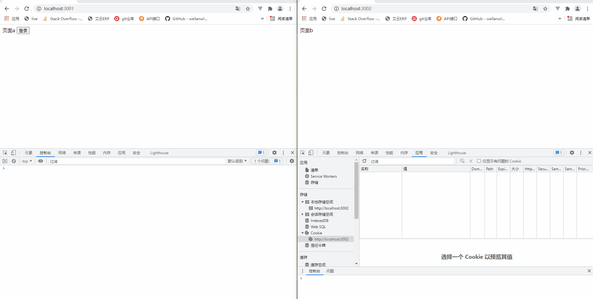

# JavaScript

# 效果

## 浏览器的滚动条的滚动监听事件实现随滚动条滚动的广告

<p align="left" style="color:#777777;">发布日期：2019-03-27</p>

经常可以看到网页上悬浮在边上的广告  
无论你怎么拖动滚动条，他都不会离开视窗  

实现悬浮广告的方法有两个  

1. 用css的position：fixed;  
    在页面内放一个div，给要悬浮的div元素加上如下样式  
   
   ```css
   div{
       width:200px;
       height:200px;
       background:red;
       position:fixed;
       top:300px;
       right:2px;
   }
   ```
   
    这样既可以了，但是这样有个不好的问题，当你缩小浏览器窗口，会盖住其他内容。
    所有你可以用js动态添加样式解决。

2. 用滚动监听来实现悬浮广告  
   
   ```javascript
   $(window).scroll(function () {
       if($(window).width() > 750){
           var offsetTop = 0 + $(window).scrollTop() +"px";
           $('div').css('margin-top',offsetTop);
       }
   });
   ```
   
    解释一下这段代码  
    $(window).scroll()就是当你拖动滚动条时，会出发的事件  
    $(window).width()是获取当前浏览器可视窗口的大小  
    $(window).scrollTop()就是滚动条拖动的距离  
    那么你滚动条拖动多少，悬浮的广告给他加上相应的margin-top他是不是跟着滚动条下来了呢，这样也就达到了和fixed同样的效果  
    当然前提是这个div首先要浮动到浏览器窗口的右边  

# 方法

## 浮点数四舍五入保留小数位数

<p align="left" style="color:#777777;">发布日期：2021-01-26</p>

错误写法使用toFixed()，导致精度丢失

```javascript
let num = 0.35;
num = num.toFixed(1); //输出0.3 并没有进位
```

!>千万不要直接使用toFixed 保留小数
正确写法使用Math.round()四舍五入取整后，使用toFixed()保留
错误示例 测试数据2.445 保留2位

```javascript
let num = 2.445;
num = (Math.round(num * 100) / 100).toFixed(1); //输出2.44
```

正确示例

```javascript
function GetRound(num, len) {
     var x = num.toString().indexOf(".") !== -1?num.toString().length -num.toString().indexOf(".")-1:0
     return Number((Math.round(num * Math.pow(10, x)/Math.pow(10, x-len)) / Math.pow(10, len).toFixed(len)));
}
GetRound(2.445,2) //2.45
```

!>精髓就是先四舍五入，再保留。保留几位小数就*多少  但是这里的乘法会出问题原因是2.445 * 100 = 244.49999999999997

**解决浮点数加法和乘法丢失精度**

```javascript
//自定义加法运算
function addNum(num1: any, num2: any) {
  var sq1, sq2, m
  try {
    sq1 = num1.toString().split('.')[1].length
  } catch (e) {
    sq1 = 0
  }
  try {
    sq2 = num2.toString().split('.')[1].length
  } catch (e) {
    sq2 = 0
  }
  m = Math.pow(10, Math.max(sq1, sq2))
  return (mulNum(num1, m) + mulNum(num2, m)) / m
}
//乘法
function mulNum(arg1: any, arg2: any) {
  var m = 0,
    s1 = arg1.toString(),
    s2 = arg2.toString()
  try {
    m += s1.split('.')[1].length
  } catch (e) {}
  try {
    m += s2.split('.')[1].length
  } catch (e) {}
  return (
    (Number(s1.replace('.', '')) * Number(s2.replace('.', ''))) /
    Math.pow(10, m)
  )
}
```

也可以改写底层函数来四舍五入保留小数 [来源](https://zhuanlan.zhihu.com/p/31202697)

```javascript
if (!Number.prototype._toFixed) {
    Number.prototype._toFixed = Number.prototype.toFixed;
}
Number.prototype.toFixed = function(n) {
    return (this + 3e-16)._toFixed(n);
};
```

?>实际开发可以直接用lodash中的[ceil](https://www.lodashjs.com/docs/lodash.ceil)方法

## 数组按某个值排序

<p align="left" style="color:#777777;">发布日期：2021-01-22</p>

?>按order值的大小，对数组List进行升序排序

```javascript
let List = [{
        id: 1,
        order: 1
    },
    {
        id: 2,
        order: 0
    }
];
List.sort((x, y) => {
    return x.order - y.order
});
```

!>sort会改变原数组内容 若需要保留原数组 使用深拷贝即可

## 数组对象按某个属性值分组

<p align="left" style="color:#777777;">发布日期：2021-01-22</p>

?>就是以对象的某个属性作为索引值key 变成一个关联数组，然后再用Object.keys 循环关联数组赋给新数组，以去掉索引key

```javascript
let List = [{
        id: '1001',
        name: '值1',
        value: '1'
    },
    {
        id: '1001',
        name: '值1',
        value: '2'
    },
    {
        id: '1002',
        name: '值2',
        value: '3'
    },
    {
        id: '1002',
        name: '值2',
        value: '4'
    },
    {
        id: '1002',
        name: '值2',
        value: '5'
    },
    {
        id: '1003',
        name: '值3',
        value: '6'
    },
];
let map = {}
for (let i = 0; i < List.length; i++) {
    let item = List[i]
    if (!map[item.id]) {
        map[item.id] = [item]
    } else {
        map[item.id].push(item)
    }
}
let res = []
Object.keys(map).forEach(key => {
    res.push(map[key])
})
console.log(res)
```

# jquery

## jquery插件编写模板

<p align="left" style="color:#777777;">发布日期：2019-04-02</p>

可以编写各种插件，如弹窗，表格，选项卡，等等。

```javascript
;(function($){
    $.fn.functionName1 = function(options){
        var defaults = {
            //默认值
        }
        var options = $.extend(defaults,options);
        this.each(function(){ 
            var _this = $(this);
            //功能编写
        });
        return this;
}

$.fn.functionName2 = function(options){
        ...
}
})(jQuery);
```

## jquery重复执行事件导致的动画在队列里的问题停止动画

<p align="left" style="color:#777777;">发布日期：2019-03-17</p>

用jquery动画的时候，经常会出现的一个问题
比如鼠标移入移出事件中,在元素上加上 淡入淡出

```javascript
$('div').mousemove(function(){
    $('span').fadeIn();
});
$('div').mouseout(function(){
    $('span').fadeOut();
});
```

我重复我移入移出div  
那么span的动画会累积到队列里面，直到执行完毕，那么怎么解决这个问题呢  
其实很简单,只要把当前元素要执行的动画前面的所有动画停止掉就好了，加上stop()  

```javascript
$('div').mousemove(function(){
    $('span').stop().fadeIn();
});
$('div').mouseout(function(){
    $('span').stop().fadeOut();
});
```

这样，问题是不是解决了呢？  
stop()方法还带有两个参数，自行百度  

# typescript

<p align="left" style="color:#777777;">发布日期：2020-08-18</p>

## 初始化tscofig

```tsc
tsc --init
```

## 编译

```tsc
tsc test.ts
```

## 编译遇到错误终止选项

```tsc
tsc test.ts --noEmitOnError
```

## 数据类型定义

```typescript
let isFlag: boolean = false;
let num: number = 1;
let names: string = 'hello';
let n: null = null;
```

## 没有返回值方法定义

```typescript
function nFn(): void {
    console.log('void');
}
```

## 回调函数

```typescript
//回调函数就是函数传参
const fn = (a: number, b: number, callback): Function => {
    //callback就是回调函数
    return callback(a + b);
}

//在回调函数中输出结果
fn(1, 2, (sum: number) => {
    console.log(sum);
})
```

## 任意值类型定义

```typescript
let anyValue: any = 'xxx';
```

可随意改变类型 赋值， 如果设置了其他的类型就不可以改变了

```typescript
anyValue = 3
```

也可以随意调用属性和方法

```typescript
anyValue.name;
anyValue.setName();
```

## 类型推论

定义时赋值 则会被推出字符串类型  
如下编译会报错， 会被推出let a: string = 3;  

```typescript
let a = '3';
a = 4;
```

如下编译不会报错， 此时会被推出为任意类型let a: any;  

```typescript
let a;
a = '3';
a = 4;
```

## 联合类型

```typescript
let name: string | number;
```

## 简单的接口

接口开头字母大写， 定义的变量的格式必须和接口格式一致

```typescript
interface Person {
    name: string;
    age: number;
}
let tom: Person = {
    name: 'Tom',
    age: 25
};
```

## 可选属性

不一致可定义可选属性

```typescript
interface Person {
    name: string;
    age ? : number;
}
let tom: Person = {
    name: 'Tom'
};
```

## 任意属性

允许任意属性[propName: string]: any;  
那么定义的name: string 和 可选属性age ? : number必须是string 类型的 所以下面的age也要改为age ? : string(不需要，因为有:any)  

```typescript
interface Person {
    name: string;
    age ? : number;
    [propName: string]: any;
}
let tom: Person = {
    name: 'Tom',
    gender: 'male'
};
```

多个任意属性 用联合类型定义

```typescript
interface Person {
    name: string;
    age ? : number;
    [propName: string]: string | number;
}
let tom: Person = {
    name: 'Tom',
    age: 25,
    gender: 'male'
};
```

## 只读属性

用readonly定义只读属性  

```typescript
interface Person {
    readonly id: number;
    name: string;
    age ? : number;
    [propName: string]: any;
}
let tom: Person = {
    id: 89757,
    name: 'Tom',
    gender: 'male'
};
```

只读只有在第一次给对象复制的时候， 第二次给只读属性复制会报错  
如tom.id = 333 会报错  
如果第一次给对象复制的时候没有初始化只读属性， 也会报错  
如

```typescript
let tom: Person = {
    name: 'Tom',
    gender: 'male'
};
```

## 数组声明

```typescript
let names: string[] = ['a', 'n', 'c'];
```

【泛型表示】

```typescript
//Array<string>用到了泛型Array<T> T可以是任意类型
let names: Array<string> = new Array<string>();
let names: Array<string> = ['a', 'b', 'c', 'd'];
```

【接口表示法】 一般不用这个

```typescript
interface NumberArray {
    [index: number]: number;
}
let fibonacci: NumberArray = [1, 1, 2, 3, 5];
```

## 函数中定义数组

需要用接口对象来定义数组 而不是let args: number[] = arguments
length和 callee 额外的约束属性而已

```typescript
function sum() {
    let args: {
        [index: number]: number;
        length: number;
        callee: Function;
    } = arguments;
}
```

也可以把接口事先定义好

```typescript
interface IArguments {
    [index: number]: any;
    length: number;
    callee: Function;
}
```

再引用

```typescript
function sum() {
    let args: IArguments = arguments;
}
```

## 任意类型的数组定义

```typescript
let names: any[] = [1, '3', 444, {
    name: 'ssss'
}];
```

## 元组

```typescript
//元组 类型必须一一对应
let tuple: [number, string] = [1, "2"];
//应用 函数返回值不同的时候 直接返回元组

const fn = (a: number, b: number): [string, number] => {
    return [a.toString(), b];
}

let [a, b]: [string, number] = fn(1, 2);
console.log(a, b);
```

## 字典

```typescript
let dict: { [key: string]: any } = { "a": 1, "b": "2" }
console.log(dict["a"])
```

## 函数声明参数输入和返回输出都被约束

```typescript
function sum(x: number, y: number): number {
    return x + y;
}
```

表达式定义法

```typescript
let mySum: (x: number, y: number) => number = function (x: number, y: number): number {
    return x + y;
};
```

```typescript
let mySum: (x: number, y: number) => number =  (x: number, y: number): number => {
    return x + y;
};
```

(x: number, y: number) => number 表示函数类型,这里的x,y可以用任何名称  
这里的 => 左边表示输入类型， 右边表示输出类型  
(x: number, y: number): number 表示参数和返回值

## 函数变量可选参数

和可选属性一样加？

```typescript
function fn(one: string, two ? : string) {
    return one;
}
```

可选参数必须加在必须参数后面， 如果给参数设置了默认值就不受前面的规则约束了

## 类型断言

就是自己知道这是什么类型的时候，告诉编译器这是什么类型

```typescript
let someValue: any = "this is a string";
//第一种方式
let strLength: number = (<string>someValue).length;
//第二种方式
let strLength: number = (someValue as string).length;
```

## 枚举类型

```typescript
enum Color {
    red,
    green,
    blue
}
let color: Color = Color.red; //红色
console.log(color); //输出0
```

## 类

```typescript
class Person{
    private _name: string;
    private _age: number;

    constructor(name: string = "默认name", age: number = 0) {
        this._name = name;
        this._age = age;
    }

    say() {
        console.log(this._name, this._age);
    }
}

let person1 = new Person("马云", 99);
person1.say();
let person2 = new Person();
person2.say();
```

## 抽象类与继承

```typescript
abstract class Person {
    //可以有实现的方法
    run() {
        console.log("会跑步");
    }
    //可以有抽象方法 必须被子类所实现
    abstract say();
}

//继承抽象类
class Student extends Person {
    run() {
        //重写 可调用父类的方法 不掉就完全覆盖了
        super.run();
        console.log("学生会跑步");
    }
    say() {
        console.log("会说话");
    }
}


let person1: Student = new Student();
person1.say();
//这里的的Person类型 说明父类指针（地址）可以指向子类对象
//反之不行, 因为你调用person.xxx() xxx()方法在父类不存在, 只在子类存在就会报错
let person2: Person = new Student();
person2.say();
```

## 接口与实现

```typescript
interface Person {
    name: string;
    age?: number;
    //接口方法不需要实现
    run();
}

class Student implements Person {
    //实现接口  接口里的东西必须都在这里出现 可选属性age可以不用加
    name: string = '';
    run() {
        console.log("会跑步");
    }
}

let person: Person = new Student();
person.run();
```

## set和get

```typescript
class Person {
    private _name: string;

    get name(): string {
        return this._name;
    }

    set name(name: string) {
        if (name == '马云') {
            this._name = "阿里巴巴董事长";
            return;
        }
        this._name = name;
    }
}

let person = new Person();
person.name = '马云';
```

## namespace命名空间

```typescript
namespace workspace1 {
    //必须要加export才能在外部被引用
    export class Person {
        _name: string = '马云1';

        get name(): string {
            return this._name;
        }
    }
}
namespace workspace2 {
    export class Person {
        _name: string = '马云2';

        get name(): string {
            return this._name;
        }
    }
}

//调用不同命名空间的同名方法
let person1 = new workspace1.Person();
console.log(person1.name);
let person2 = new workspace2.Person();
console.log(person1.name);
```

## 单例模式

单例模式就是一个类只产生一个对象

```typescript
//游戏管理类
class GameManager {
    //定义一个唯一实例
    private static _instance: GameManager;
    public name: string;

    //使用静态方法 获取单例 保证这个类上只产生这一个对象 这样用静态方法调用 保证在调用的时候才会产生对象
    //因为如果你在构造方法里调用
    static Instance() {
        if (!this._instance) {
            this._instance = new GameManager();
        }
        return this._instance;
    }
}

let game1 = GameManager.Instance();
game1.name = "愤怒的小鸡";
console.log(game1.name);//输出愤怒的小鸡
let game2 = GameManager.Instance();
game2.name = "打地鼠";
console.log(game1.name);//输出打地鼠
console.log(game2.name);//输出打地鼠
//说明game1和game2指向了同一个单例
console.log(game1==game2)//输出true
```

## 代理模式

代理模式就是一件事情，让不同的人去做

```typescript
interface Name {
    setName(name: string): string;
}

//代理人1
class Person1 implements Name {
    setName(name: string): string {
        return "代理人1起的名字" + name;
    }
}

//代理人2
class Person2 implements Name {
    setName(name: string): string {
        return "代理人2起的名字" + name;
    }
}


class Person {
    //使用哪个接口代理
    public agent: Name;

    getName() {
        //使用代理去获取名称
        let name = this.agent.setName("马云");
        return name;
    }
}

let person = new Person();
//设定一个使用的代理人 才能使用代理人的方法
person.agent = new Person1();
console.log(person.getName());
```

## 观察者模式和vue2的原理

观察者模式就是一个观察者监听一个变量自动触发函数

```typescript
//观察者协议
interface Observer {
    //观察名字改变
    emitNameChange(newValue);
}

class Person {
    private _name: string;
    //用数组保存所有的观察者
    public observers: Array<Observer> = new Array<Observer>();

    get name(): string {
        return this._name;
    }

    set name(name: string) {
        this._name = name;
        //通知其他类名字改变了
        //遍历观察者数组 并发送消息
        this.observers.forEach((observer) => {
            observer.emitNameChange(this.name);
        })
    }
}

class Test implements Observer {
    emitNameChange(newValue) {
        console.log(newValue);
    }
}


let person = new Person()
let test = new Test()
//设置test对象为person对象的观察者
person.observers.push(test)

person.name = "马云" //这个时候test.nameChange就被调用了
```

vue2的原理就是在set方法里调用观察者的回调函数去更新dom元素

```javascript
//视图元素，获取form中的DOM节点并设置默认值，该默认值是VUE是data对象中的数据。
let form = document.querySelector(".form");
//定义对象
let object = {
    _data:{
        username:"",
        usertype:""
    }
};
//实现用户输入数据与object对象内同名属性的同步修改
Object.defineProperty(object, "username", {
    get(){return object._data.username;},
    set(value){object._data.username = value;}
});
Object.defineProperty(object, "usertype",{
    get(){return object._data.usertype;},
    set(value){object._data.usertype = value;}
});
//监听form元素事件，获取目标DOM节点的value并赋值给object对象中的响应属性，即可完成用户输入与对象值之间的数据绑定。
form.addEventListener("input", (event)=>{
    let value = event.target.value;
    let name = event.target.getAttribute("name");
    object[name] = value;
});
```

## 工厂模式

工厂模式就是帮助我们快速创建对象  
假入你在项目中new了某个对象100次，一年后由于业务逻辑变更，构造方法多了一个参数，你会怎么办？你应该会这么做：找到这100个对象new的地方，用新的构造方法来创建对象，你重复劳动了100次，假如采用工厂模式，你只用改一次：把创建工厂给改一下就好了。这就是工厂模式最简单最直接的好处。

```typescript
//身份类型
enum PersonType {
    student = 1,//学生
    teacher = 2,//老师
}

//就是一个工厂类 用来创建对象的
class Person {
    static create(personType: PersonType): Person {
        let person: Person;

        //想要什么类型的人就创建什么类型的对象  这就是工厂模式
        switch (personType) {
            case PersonType.student:
                person = new Student()
                break;
            case PersonType.teacher:
                person = new Teacher()
                break;
                break;
        }

        return person;
    }
}


class Student extends Person { }
class Teacher extends Person { }

let student = Person.create(PersonType.student);
console.log(student)
```

[vue 集成 typescript](https://www.jianshu.com/p/9eca70b033da)

# es6

## 数组去重

<p align="left" style="color:#777777;">发布日期：2020-11-13</p>

- 普通数组去重
  
  ```javascript
  let arr = [1, 2, 3, 2, 1];
  let temp = new Set(arr);
  console.log([...temp]); //输出[1, 2, 3]
  ```

- 对象数组去重 某个值
  
  1. 数组方法
     
     ```javascript
     arr = [{
             name: 1,
             value: 2
         },
         {
             name: 2,
             value: 3
         },
         {
             name: 1,
             value: 2
         },
         {
             name: 4,
             value: 3
         },
     ];
     temp = [];
     let newArr = arr.filter(
         (item) => !temp.includes(item.value) && temp.push(item.value)
     );
     console.log(newArr); //输出{name: 1, value: 2}{name: 2, value: 3}
     ```
  2. set方法
     
     ```javascript
     temp = new Set();
     newArr = arr.filter(
         (item) => !temp.has(item.value) && temp.add(item.value)
     );
     console.log(newArr); //输出{name: 1, value: 2}{name: 2, value: 3}
     ```
  3. map方法
     
     ```javascript
     temp = new Map();
     newArr = arr.filter(
         (item, key) => !temp.has(item.value + '') && temp.set(item.value + '', true)
     );
     console.log(newArr); //输出{name: 1, value: 2}{name: 2, value: 3}
     ```
     
     ?>三个方法都可以封装为  fn(arr,key)  key 即是item.value的value

- 对象数组去重 整个对象
  
  ```javascript
  temp = new Map();
  newArr = arr.filter((item, key) =>
      !temp.has(JSON.stringify(item)) && temp.set(JSON.stringify(item), true)
  );
  console.log(newArr); //输出{name: 1, value: 2}{name: 2, value: 3}{name: 4, value: 3}
  ```

## 求数组并集 差集 交集

<p align="left" style="color:#777777;">发布日期：2021-01-26</p>

```javascript
let a = new Set([1, 2, 3, 4, 5]);
let b = new Set([1, 2, 3, 6]);
let union = new Set([...a, ...b]); //并集 输出1,2,3,4,5,6
let difference1 = [...union].filter(x => (!a.has(x) || !b.has(x))); //差集 输出4,5,6
let difference2 = [...b].filter(x => !a.has(x)); //返回a在b中没有的  输出6
let difference3 = [...a].filter(x => !b.has(x)); //返回b在a中没有的  输出4,5
let intersect = [...a].filter(x => b.has(x)); //交集 返回a和b共有的  也可以反着来 输出1,2,3
```

# 框架

## apidoc

<p align="left" style="color:#777777;">发布日期：2021-01-28</p>

[apidoc官方网站](https://apidocjs.com/#demo)

1. 已经安装了node.js 和 npm
2. 安装apidoc
   
   ```npm
   npm install apidoc -g
   ```
3. 创建apidoc.json 在项目根目录
   内容如下
   
   ```json
   {
    "name": "接口文档",
    "version": "0.3.0",
    "description": "接口描述",
    "url": "http://www.baidu.com",
    "sampleUrl": "http://test.baidu.com"
   }
   ```

?>url和sampleUrl分别为正式地址和测试地址

4. 按他的规则写注释如下
   
   ```
    /**
    * @api {get} /user/:id Get方法获取用户信息（前面的是接口名称）
    * @apiVersion 0.2.2
    * @apiName getUserInfo（前面的是方法名）
    * @apiGroup 用户
    * 
    * @apiParam (参数) {Number} id 用户id
    * @apiParamExample {json} 请求示例
    * {
    *  "id": 1
    * }
    * @apiSuccess (返回字段) {String} firstname 姓
    * @apiSuccess (返回字段) {String} lastname  名字
    *
    * @apiSuccessExample 成功示例
    * HTTP/1.1 200 Success
    *    {
    *       "firstname": "张",
    *       "lastname": "三四"
    *     }
    * @apiErrorExample 失败示例1
    *     {
    *       "code": "1001"
    *     }
    * @apiErrorExample 失败示例2
    *     {
    *       "code": "1002"
    *     }
    * @apiError (错误代码) 1001 内容1
    * @apiError (错误代码) 1002 内容2
    */
    /**
    * @api {post} /user Post方法获取用户信息（前面的是接口名称）
    * @apiVersion 0.2.2
    * @apiName getUserInfoByPost（前面的是方法名）
    * @apiGroup 用户
    * 
    * @apiParam (参数) {Number} id=2 用户id
    * @apiParam (参数) {Number} [age=4] 年龄(中括号表示可选)
    * @apiParamExample {json} 请求示例
    * {
    *  "id": 1，
    *  "age": 2
    * }
    * @apiSuccess (返回字段) {String} firstname 姓
    * @apiSuccess (返回字段) {String} lastname  名字
    *
    * @apiSuccessExample 成功示例
    * HTTP/1.1 200 Success
    *    {
    *       "firstname": "张",
    *       "lastname": "三四"
    *     }
    * @apiErrorExample 失败示例1
    *     {
    *       "code": "1001"
    *     }
    * @apiErrorExample 失败示例2
    *     {
    *       "code": "1002"
    *     }
    * @apiError (错误代码) 1001 内容1
    * @apiError (错误代码) 1002 内容2
    */
   ```
5. 生成api文档到指定目录
   
   ```
   apidoc -i ./test（需要扫描的文件夹） -o ./doc(存放的文件夹) -f .php(需要生成接口的文件类型)
   ```
6. 版本控制
   建立一个同类型的后缀文件 如_olddoc.php 存放之前接口的注释就可以

# 实战

## 利用iframe跨域单点登录

单点登录就是不同域名系统之间只需要登录一次 就可以访问多个系统了  
如下图  
   

页面a

```html
<!DOCTYPE html>
<html lang="en">
  <head>
    <meta charset="UTF-8" />
    <meta http-equiv="X-UA-Compatible" content="IE=edge" />
    <meta name="viewport" content="width=device-width, initial-scale=1.0" />
    <title>Document</title>
  </head>
  <body>
    页面a
    <button onclick="login()">登录</button>
    <script>
      login = () => {
        //获取 token
        var token = "xxxxxxxxxxxxxxxxxxxxx";
        //动态创建一个不可见的iframe，在iframe中加载一个跨域HTML
        var iframe = document.createElement("iframe");
        //隐藏
        iframe.style.display = "none";
        //设置iframe地址
        iframe.src = "http://localhost:3002/";
        //放入body
        document.body.append(iframe);
        //使用postMessage()方法将token传递给iframe 出错的话可增加延时时间
        setTimeout(function () {
          iframe.contentWindow.postMessage(token, "*");
          console.log("发送成功");
        }, 1000);
        //删除iframe
        setTimeout(function () {
          iframe.remove();
        }, 2000);
        //监听b页面返回的操作状态
        window.addEventListener(
          "message",
          function (event) {
            console.log(event.data);
          },
          false
        );
      };
    </script>
  </body>
</html>
```

页面b

```html
<!DOCTYPE html>
<html lang="en">
  <head>
    <meta charset="UTF-8" />
    <meta http-equiv="X-UA-Compatible" content="IE=edge" />
    <meta name="viewport" content="width=device-width, initial-scale=1.0" />
    <title>Document</title>
  </head>
  <body>
    页面b
    <script>
      function setCookie(name, value) {
        var Days = 30;
        var exp = new Date();
        exp.setTime(exp.getTime() + Days * 24 * 60 * 60 * 1000);
        document.cookie =
          name + "=" + escape(value) + ";expires=" + exp.toGMTString();
      }
      // 在这个iframe所加载的HTML中绑定一个事件监听器，当事件被触发时，把接收到的token数据写入localStorage
      window.addEventListener(
        "message",
        function (event) {
          localStorage.setItem("localstorage_token", event.data);
          setCookie("cookie_token", event.data);
          top.postMessage("登录成功", "*");
        },
        false
      );
    </script>
  </body>
</html>
```