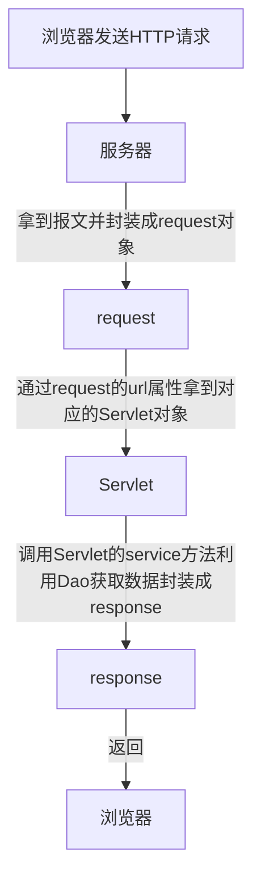

# JavaWeb

## 最原始的服务器

```java
public class Demo {
    public static void main(String[] args) throws IOException {
        ServerSocket serverSocket = new ServerSocket(8888);
        //阻塞 等待连接
        Socket socket = serverSocket.accept();

        // 输入流 读取数据
        InputStream inputStream = socket.getInputStream();
        byte[] bytes = new byte[8192];
        int len;
        while (inputStream.available() > 0) {
            len = inputStream.read(bytes);
            System.out.print(new String(bytes, 0, len));
        }
        // 输出流 回发数据
        OutputStream outputStream = socket.getOutputStream();
        // 按照http协议的格式封装一个报文
        String response = "HTTP/1.1 200 OK\r\n" +
                "Content-Length: 39\r\n" +
                "Content-Type: text/html;charset=UTF-8\r\n\r\n" +
                "<h1 style=\"color:red\">hello server!<h1>";
        outputStream.write(response.getBytes());
        outputStream.flush();
        //不要关闭，关闭会导致服务器断开
    }
}
```

浏览器输入http://localhost:8888/ 访问，会在控制台输出访问的HTTP信息,且在页面显示hello server!

```
GET / HTTP/1.1
Host: localhost:8888
Connection: keep-alive
...
```

## Servlet

Servlet 是基于 Jakarta 技术的 Web 组件，由容器管理，可生成动态内容

servlet 是独立于平台的 Java 类；容器，有时也称为 servlet 引擎

Servlet 通过 servlet 容器实现的请求/响应范式与 Web 客户端交互

### Servlet 容器

Servlet 容器是 Web 服务器或应用程序服务器的一部分，它提供发送请求和响应的网络服务、解码基于 MIME 的请求以及格式化基于 MIME 的响应。Servlet 容器还通过其生命周期包含和管理 Servlet。

### 流程图



这里的通过request的url属性拿到对应的Servlet对象，是在Servlet静态代码块初始化好url对应Servlet的map容器,然后通过url拿到Servlet，就是个多态

然后那些静态代码块初始化可以写在配置文件通过Propertiesload到代码块中

### Servlet的生命周期

- init()：Servlet进行初始化；
- service()：Servlet处理客户端的请求；
- destroy()：Servlet结束，释放资源；

## 创建一个普通的web工程

File --> New --> Project --> 输入项目名称webProjectName，语言选择Java

项目根目录下新建文件夹webapp（存放静态资源文件）--> webapp下新建WEB-INF -->复制tomcat目录下的web.xml，并清除根节点里面的所有内容

File --> Project Structue(项目构建) --> Facts(特性) --> Web(添加一个web特性)

Module --> 重新配置Deployment Descriotors web.xml路径 D:\sxc\java\www\webProjectName\webapp\WEB-INF\web.xml  --> 重新配置WebRsoucre静态文件根目录 D:\sxc\java\www\webProjectName\webapp

Artifacts --> 新建一个Web Application:expolode(可以热更新的不压缩的，另外一个是压缩的不能热更新) -->Form Modules --> 随便改个名字webProjectName

Add Configuration --> Tomcat Server --> Local --> 随便改个名字 tomcat10 --> 配置Application server --> No artifacts marked for deployment --> Fix(配置部署) --> On 'Update' action 和 On frame deactivation配置为Update classes and resources

## 添加Servlet

### 新建Servlet

src目录下新建HelloServlet.java 下面的要重写声明周期方法

```java
package com.sxc.servlet;

import jakarta.servlet.*;

import java.io.IOException;
import java.io.PrintWriter;

public class HelloServlet implements Servlet {
    @Override
    public void init(ServletConfig servletConfig) throws ServletException {
        System.out.println("servlet初始化");
    }

    @Override
    public ServletConfig getServletConfig() {
        return null;
    }

    @Override
    public void service(ServletRequest servletRequest, ServletResponse servletResponse) throws ServletException, IOException {
        PrintWriter writer = servletResponse.getWriter();
        writer.println("hello servlet");
        writer.println(servletRequest);
        writer.println(servletResponse);
        writer.flush();
    }

    @Override
    public String getServletInfo() {
        return null;
    }

    @Override
    public void destroy() {
        System.out.println("servlet销毁");
    }
}
```

简化 GenericServlet 已经帮我做了实现Servlet的接口并提供了一个service抽象方法

```java
package com.sxc.servlet;

import jakarta.servlet.*;

import java.io.IOException;
import java.io.PrintWriter;

public class HelloServlet extends GenericServlet {

    @Override
    public void service(ServletRequest servletRequest, ServletResponse servletResponse) throws IOException {
        PrintWriter writer = servletResponse.getWriter();
        writer.println("hello servlet2");
        writer.println(servletRequest);
        writer.println(servletResponse);
        writer.flush();
    }
}
```

继续简化，可以处理指定的resultFul接口 测试使用 FeHelper的简易Postman

```java
package com.sxc.servlet;

import jakarta.servlet.ServletException;
import jakarta.servlet.http.HttpServlet;
import jakarta.servlet.http.HttpServletRequest;
import jakarta.servlet.http.HttpServletResponse;

import java.io.IOException;
import java.io.PrintWriter;

public class HelloServlet extends HttpServlet {
    @Override
    protected void doGet(HttpServletRequest req, HttpServletResponse resp) throws IOException {
        PrintWriter writer = resp.getWriter();
        writer.println("servlet get");
        writer.flush();
        //注释下面方法
        //super.doGet(req, resp);
    }

    @Override
    protected void doPost(HttpServletRequest req, HttpServletResponse resp) throws ServletException, IOException {
        PrintWriter writer = resp.getWriter();
        writer.println("servlet post");
        writer.flush();
    }

    @Override
    protected void doPut(HttpServletRequest req, HttpServletResponse resp) throws ServletException, IOException {
        PrintWriter writer = resp.getWriter();
        writer.println("servlet put");
        writer.flush();
    }

    @Override
    protected void doDelete(HttpServletRequest req, HttpServletResponse resp) throws ServletException, IOException {
        PrintWriter writer = resp.getWriter();
        writer.println("servlet delete");
        writer.flush();
    }
}
```

### 注册一个Servlet到容器当中

web.xml alt+insert快速添加servlet,之后访问http://localhost:8888/webProjectName/HelloServlet

```xml
<?xml version="1.0" encoding="UTF-8"?>
<web-app xmlns="https://jakarta.ee/xml/ns/jakartaee"
         xmlns:xsi="http://www.w3.org/2001/XMLSchema-instance"
         xsi:schemaLocation="https://jakarta.ee/xml/ns/jakartaee
                      https://jakarta.ee/xml/ns/jakartaee/web-app_5_0.xsd"
         version="5.0"
         metadata-complete="true">
    <servlet>
        <!--名称-->
        <servlet-name>HelloServlet</servlet-name>
        <!--路径-->
        <servlet-class>com.sxc.servlet.HelloServlet</servlet-class>
    </servlet>
    <!--servlet对应url的映射关系-->
    <servlet-mapping>
        <servlet-name>HelloServlet</servlet-name>
        <url-pattern>/HelloServlet</url-pattern>
    </servlet-mapping>
</web-app>
```

### URL路由匹配

```xml
<?xml version="1.0" encoding="UTF-8"?>
<web-app xmlns="https://jakarta.ee/xml/ns/jakartaee"
         xmlns:xsi="http://www.w3.org/2001/XMLSchema-instance"
         xsi:schemaLocation="https://jakarta.ee/xml/ns/jakartaee
                      https://jakarta.ee/xml/ns/jakartaee/web-app_5_0.xsd"
         version="5.0"
         metadata-complete="true">
    <servlet>
        <!--名称-->
        <servlet-name>HelloServlet</servlet-name>
        <!--路径-->
        <servlet-class>com.sxc.servlet.HelloServlet</servlet-class>
    </servlet>
    <!--servlet对应url的映射关系-->
    <servlet-mapping>
        <servlet-name>HelloServlet</servlet-name>
        <!--精确匹配-->
        <url-pattern>/HelloServlet</url-pattern>
        <!--路径匹配 按长短匹配 先匹配长的-->
        <url-pattern>/HelloServlet/a/b</url-pattern>
        <url-pattern>/HelloServlet/a</url-pattern>
        <!--通配符匹配以HelloServlet开头-->
        <url-pattern>/HelloServlet/*</url-pattern>
        <!--扩展名匹配，只能加扩展名-->
        <url-pattern>*.exe</url-pattern>
        <!--默认匹配，任意都会匹配到这个-->
        <url-pattern>/</url-pattern>
    </servlet-mapping>
</web-app>
```

## 请求HttpServletRequest

HttpServletRequest

### 常用方法

```java
package com.sxc.servlet;

import jakarta.servlet.http.HttpServlet;
import jakarta.servlet.http.HttpServletRequest;
import jakarta.servlet.http.HttpServletResponse;

import java.io.IOException;
import java.io.PrintWriter;
import java.util.Arrays;
import java.util.Enumeration;
import java.util.Map;

public class HelloServlet extends HttpServlet {
    @Override
    protected void doGet(HttpServletRequest req, HttpServletResponse resp) throws IOException {
        PrintWriter writer = resp.getWriter();
        writer.println("servlet get");
        writer.flush();

        //获取参数
        Map<String, String[]> parameterMap = req.getParameterMap();
        for (Map.Entry<String, String[]> stringEntry : parameterMap.entrySet()) {
            System.out.println(stringEntry.getKey() + ":" + Arrays.toString(stringEntry.getValue()));
        }

        //项目根目录
        System.out.println(req.getContextPath());// /webProjectName
        //servlet路径
        System.out.println(req.getServletPath());// /HelloServlet
        //请求的方法
        System.out.println(req.getMethod());//GET
        //查询的参数
        System.out.println(req.getQueryString());//id=3&&name=4
        //访问的URL
        System.out.println(req.getRequestURI());// /webProjectName/HelloServlet
        System.out.println(req.getRequestURL());// http://localhost:8888/webProjectName/HelloServlet
        //远程主机
        System.out.println(req.getRemoteHost());// 0:0:0:0:0:0:0:1
        //访问的ip
        System.out.println(req.getRemoteAddr());// 0:0:0:0:0:0:0:1
        //协议
        System.out.println(req.getScheme());//http

        //头部信息
        System.out.println(req.getHeader("Content-Type"));
        //所有头部名称
        Enumeration<String> headerNames = req.getHeaderNames();
        while (headerNames.hasMoreElements()) {
            String s = headerNames.nextElement();
            System.out.println(s + ":" + req.getHeader(s));
        }
    }
}
```

### 请求转发

web.xml新增一个OtherServlet

```xml
    <servlet>
        <servlet-name>OtherServlet</servlet-name>
        <servlet-class>com.sxc.servlet.OtherServlet</servlet-class>
    </servlet>
    <servlet-mapping>
        <servlet-name>OtherServlet</servlet-name>
        <url-pattern>/OtherServlet</url-pattern>
    </servlet-mapping>
```


```java
public class HelloServlet extends HttpServlet {
    @Override
    protected void doGet(HttpServletRequest req, HttpServletResponse resp) throws IOException, ServletException {
        //转发
        RequestDispatcher requestDispatcher = req.getRequestDispatcher("/OtherServlet");
        requestDispatcher.forward(req, resp);
    }
}
```

```java
public class OtherServlet extends HttpServlet {
    @Override
    protected void doGet(HttpServletRequest req, HttpServletResponse resp) throws IOException {
        System.out.println("OtherServlet");
    }
}
```

### 在各个转发中共享数据

该方法称之为域方法。。。

```java
public class HelloServlet extends HttpServlet {
    @Override
    protected void doGet(HttpServletRequest req, HttpServletResponse resp) throws IOException, ServletException {
        RequestDispatcher requestDispatcher = req.getRequestDispatcher("/OtherServlet");
        //该方法可以在多个Servlet中共享
        req.setAttribute("access_token","abcd");
        requestDispatcher.forward(req, resp);
    }
}
```

```java
public class OtherServlet extends HttpServlet {
    @Override
    protected void doGet(HttpServletRequest req, HttpServletResponse resp) throws IOException {
        System.out.println(req.getAttribute("access_token"));
    }
}
```

## 响应

### 响应流类型

```java
PrintWriter out = response.getWriter();//获取字符流，处理字符；
ServletOutputStream out = response.getOutputStream();//获取字节流，处理文件；
```

tips:getWriter 会有一个缓冲区大小为8KB 如果要立即刷新缓冲区 使用flushBuffer()

### 响应中文字符乱码

```java
public class HelloServlet extends HttpServlet {
    @Override
    protected void doGet(HttpServletRequest req, HttpServletResponse resp) throws IOException {
        resp.setCharacterEncoding("GBK");
        PrintWriter writer = resp.getWriter();
        writer.println("hello中文字符");
        writer.flush();
    }
}
```

优化

```java
public class HelloServlet extends HttpServlet {
    @Override
    protected void doGet(HttpServletRequest req, HttpServletResponse resp) throws IOException {
        resp.setContentType("text/html;charset=UTF-8");
        //文本
        //resp.setContentType("text/plain;charset=UTF-8");
        //json
        //resp.setContentType("application/json;charset=UTF-8");
        PrintWriter writer = resp.getWriter();
        writer.println("hello中文字符");
        writer.flush();
    }
}
```

### 设置响应头

```java
public class HelloServlet extends HttpServlet {
    @Override
    protected void doGet(HttpServletRequest req, HttpServletResponse resp) throws IOException {
        resp.setContentType("text/html;charset=UTF-8");
        resp.setHeader("token","abcd");
        PrintWriter writer = resp.getWriter();
        writer.println("hello");
        writer.flush();
    }
}
```

### 重定向

```java
public class HelloServlet extends HttpServlet {
    @Override
    protected void doGet(HttpServletRequest req, HttpServletResponse resp) throws IOException {
        resp.sendRedirect("https://www.baidu.com");
    }
}
```

## Cookie

```java
public class HelloServlet extends HttpServlet {
    @Override
    protected void doGet(HttpServletRequest req, HttpServletResponse resp) throws IOException {
        resp.setContentType("text/html;charset=UTF-8");
        //创建Cookie
        Cookie cookie = new Cookie("jseesion", UUID.randomUUID().toString());
        //设置过期时间 s 小于0 就是关闭浏览器就失效 0是立即失效(ps失效了浏览器会自动删除这个cookie)
        cookie.setMaxAge(10);
        //添加到响应头就是 addHeader("Set-Cookie","xxx")
        resp.addCookie(cookie);
        PrintWriter writer = resp.getWriter();
        writer.println("hello");
        writer.flush();
    }
}
```

## Session

服务器端第一次调用getSession()的时候会创建；(保存在服务器内存中),应该和php中session_start()一个道理

第一次调用会在请求里添加Set-Cookie

```
Set-Cookie: JSESSIONID=F186609E35A640E7B308F74CA2DB5D99; Path=/webProjectName; HttpOnly
```

### 配置

web.xml配置失效时间

```xml
<session-config>
    <!-- 30 minute -->
    <session-timeout>30</session-timeout>
</session-config>
```

### 存储

```java
public class HelloServlet extends HttpServlet {
    @Override
    protected void doGet(HttpServletRequest req, HttpServletResponse resp) throws IOException {
        resp.setContentType("text/html;charset=UTF-8");
        //启用session true,如果没有session则创建
        HttpSession session = req.getSession(true);
        //往里面存东西取东西就可以了
        session.setAttribute("userId","9999");
        PrintWriter writer = resp.getWriter();
        writer.println("hello");
        writer.flush();
    }
}
```

### 读取

```java
public class OtherServlet extends HttpServlet {
    @Override
    protected void doGet(HttpServletRequest req, HttpServletResponse resp) throws IOException {
        //获取session 获取的时候不要创建了 false如果不存在会返回null
        HttpSession session = req.getSession(false);
        System.out.println(session.getAttribute("userId"));
    }
}
```

# IDEA

## 添加jar包

[jar包搜索](https://mvnrepository.com/)

将jar包放在libs文件夹下，右键as library,选择项目即可

删除 File - Project Structure - Modules - Dependencies 选中要删除的包remove即可

# 工具类

## 高并发测试方法

自己封装了一下

```java
//用于并发模拟n个用户同时执行一个方法
public class ThreadConcurrentUtil {

    //用接口的方式 用内部类或lambda实现这个方法
    interface ThreadConcurrentInterface {
        public void fn();
    }

    //该对象可以阻塞线程
    private CyclicBarrier cyclicBarrier = null;
    //并发数
    private int n = 0;

    /**
     * @param n 并发数
     */
    public ThreadConcurrentUtil(int n) {
        this.n = n;
        cyclicBarrier = new CyclicBarrier(n);
    }

    /**
     * 并发测试方法
     *
     * @param tThreadConcurrentInterface 用内部类或lambda实现这个方法
     */
    public void test(ThreadConcurrentInterface tThreadConcurrentInterface) {
        ArrayList<Thread> list = new ArrayList<>();
        for (int i = 0; i < n; i++) {
            Thread thread = new Thread(new Runnable() {
                @Override
                public void run() {
                    System.out.println("线程开始时间：" + System.currentTimeMillis());
                    //线程等待
                    try {
                        cyclicBarrier.await();
                    } catch (InterruptedException | BrokenBarrierException e) {
                        e.printStackTrace();
                    }
                    tThreadConcurrentInterface.fn();
                }
            });
            list.add(thread);
        }
        for (Thread t : list) {
            t.start();
        }
        try {
            Thread.sleep(300);
        } catch (InterruptedException e) {
            e.printStackTrace();
        }
    }

    /**
     * 使用方法
     *
     * @param args
     */
    public static void main(String[] args) {
        new ThreadConcurrentUtil(10).test(new ThreadConcurrentInterface() {
            @Override
            public void fn() {
                System.out.println("这里写是实际的测试内容");
            }
        });
    }
}
```

也可以用线程池

```java
import java.util.concurrent.*;

public class Demo {
    public static void main(String[] args) {
        Runnable runnable = () -> {
            System.out.println("线程开始时间：" + System.currentTimeMillis());
            try {
                Thread.sleep(1000);
            } catch (InterruptedException e) {
                e.printStackTrace();
            }
        };

        ExecutorService pools = Executors.newFixedThreadPool(1000);
        //最大就70个，i大于70就异常
        for (int i = 0; i < 700; i++) {
            pools.submit(runnable);
        }
    }
}
```

## 读取xml

[dom4j](https://dom4j.github.io/)

示例xml

只要知道Element就是标签，获取标签名称用.getName(),获取标签innerHtml用.getText();Attribute就是属性，获取属性值用.getValue()

```xml
<?xml version="1.0" encoding="UTF-8" ?>
<app>
    <!--第一种是配置在属性里面的-->
    <dataSource>
        <properties name="dbnameAttribute" value="dbnameValue"/>
        <properties name="userAttribute" value="userValue"/>
        <properties name="passwordAttribute" value="passwordValue"/>
    </dataSource>
    <!--第二种是配置在innerHtml里面-->
    <config>
        <baseUrl>http://127.0.0.1</baseUrl>
        <port>8080</port>
    </config>
    <!--第三种名称在标签上值在innerHtml-->
    <dataSource2>
        <properties name="dbnameAttribute">dbnameValue</properties>
        <properties name="userAttribute">userValue</properties>
        <properties name="passwordAttribute">passwordValue</properties>
    </dataSource2>
    <!--第四种双重循环-->
    <configs>
        <config>
            <baseUrl>http://127.0.0.1</baseUrl>
            <port>8080</port>
        </config>
        <config>
            <baseUrl>http://127.0.0.2</baseUrl>
            <port>8888</port>
        </config>
    </configs>
</app>
```

```java
public class Demo {
    public static void main(String[] args) throws IOException, DocumentException {
        //需要的URL对象
        URL resource = Demo.class.getClassLoader().getResource("web.xml");
        SAXReader reader = new SAXReader();
        Document document = reader.read(resource);
        //拿到xml根节点
        Element rootElement = document.getRootElement();
        /*---------------------第一种--------------------*/
        //拿到需要的节点
        Element dataSource = rootElement.element("dataSource");
        //遍历节点
        Iterator<Element> elementIterator = dataSource.elementIterator();
        while (elementIterator.hasNext()) {
            //拿到节点
            Element element = elementIterator.next();
            //获取节点属性
            Attribute nameAttribute = element.attribute("name");
            Attribute valueAttribute = element.attribute("value");
            //获取属性值
            System.out.println(nameAttribute.getValue() + ":" + valueAttribute.getValue());
        }
        /*---------------------第二种--------------------*/
        //拿到需要的节点
        dataSource = rootElement.element("config");
        //遍历节点
        elementIterator = dataSource.elementIterator();
        while (elementIterator.hasNext()) {
            //拿到节点
            Element element = elementIterator.next();
            //拿到值
            System.out.println(element.getName() + ":" + element.getText());
        }
        /*---------------------第三种--------------------*/
        //拿到需要的节点
        dataSource = rootElement.element("dataSource2");
        //遍历节点
        elementIterator = dataSource.elementIterator();
        while (elementIterator.hasNext()) {
            //拿到节点
            Element element = elementIterator.next();
            //获取属性
            Attribute nameAttribute = element.attribute("name");
            //拿到值
            System.out.println(nameAttribute.getValue() + ":" + element.getText());
        }
        /*---------------------第四种--------------------*/
        //拿到需要的节点
        dataSource = rootElement.element("configs");
        //遍历节点
        elementIterator = dataSource.elementIterator();
        while (elementIterator.hasNext()) {
            //拿到节点 config
            Element element = elementIterator.next();
            //拿到子节点值
            String baseUrl = element.element("baseUrl").getText();
            String port = element.element("port").getText();
            //拿到值
            System.out.println(baseUrl + ":" + port);
        }
    }
}
```

# 经典解决方案

## ThreadLocal

**线程本地变量**

底层保存一个ThreadLocalMap key是当前线程（Thread.currentThread()） value是实际保存的值

解决每个线程需要独享一个对象,或者是每个线程需要有一个全局变量的时候
（静态变量会导致每个线程共用一个变量，可以用synchronized解决，但是不够完美；另外如果在线程里每次调用方法就创建一个对象，内存开销太大，所以这个时候就需要每个线程有一个隔离的属于自己的静态变量）

一般在连接池优化上会使用到ThreadLocal，在多线程获取连接池时，会有同步操作，影响性能。如果使用ThreadLocal，每个线程使用自己的独立连接，性能会有一定的提升

使用案例见**DAO事务操作**，同一个线程中，多个模型类事务操作，需要使用同一个连接


# JDBC

基础的JDBC看看就行

需要将mysql-connector-java.jar包导入,mysql5.7可以直接用8.0版本的，也支持

[下载地址](https://dev.mysql.com/downloads/connector/j/) 选择Platform Independent

## 步骤

db.properties文件内容见 *写入配置文件加载(推荐)*

1. 注册驱动，加载Driver类
2. 获取连接，得到Connection
3. 执行sql
4. 释放资源

```java
import java.io.*;
import java.sql.*;
import java.util.Properties;

public class Demo {
    public static void main(String[] args) throws SQLException, IOException, ClassNotFoundException {
        //新建Properties对象
        Properties properties = new Properties();
        //获取文件输入流
        BufferedInputStream bufferedInputStream = new BufferedInputStream(new FileInputStream("db.properties"));
        //加载输入流到properties对象
        properties.load(bufferedInputStream);
        //加载Driver时自动完成注册
        Class.forName(properties.getProperty("driver"));
        //得到连接
        Connection connection = DriverManager.getConnection(properties.getProperty("url"), properties.getProperty("user"), properties.getProperty("password"));
        //执行sql statement.execute 返回值不代表执行成功或失败，如果执行的是查询语句，返回的是ResultSet则返回true，其他查询或更新语句返回false
        Statement statement = connection.createStatement();
        int i = statement.executeUpdate("INSERT INTO `user` (name,age) VALUES ('张四',4)");
        if (i > 0) {
            System.out.println("新增一条数据");
        }
        ResultSet resultSet = statement.executeQuery("SELECT * FROM `user`");
        while (resultSet.next()) {
            int id = resultSet.getInt(1);
            String name = resultSet.getString(2);
            int age = resultSet.getInt(3);
            System.out.println(id + "\t" + name + "\t" + age);
        }
        //关闭连接
        resultSet.close();
        statement.close();
        connection.close();
        //关闭流
        bufferedInputStream.close();
    }
}
```

## 连接方式

原始方式

```java
import com.mysql.jdbc.Driver;

import java.sql.Connection;
import java.sql.SQLException;
import java.util.Properties;

public class Demo {
    public static void main(String[] args) throws SQLException {
        //得到驱动
        Driver driver = new Driver();
        //得到连接
        Properties properties = new Properties();
        properties.put("user", "root");
        properties.put("password", "");
        Connection connection = driver.connect("jdbc:mysql://localhost:3307/dbname?useSSL=false&&rewriteBatchedStatements=true&&characterEncoding=utf-8", properties);
        //关闭连接
        connection.close();
    }
}
```

反射方式

```java
import com.mysql.jdbc.Driver;

import java.lang.reflect.InvocationTargetException;
import java.sql.Connection;
import java.sql.SQLException;
import java.util.Properties;

public class Demo {
    public static void main(String[] args) throws SQLException, ClassNotFoundException, IllegalAccessException, InstantiationException, NoSuchMethodException, InvocationTargetException {
        //得到驱动
        Class<?> aClass = Class.forName("com.mysql.jdbc.Driver");
        Driver driver = (Driver) aClass.getConstructor().newInstance();
        //得到连接
        Properties properties = new Properties();
        properties.put("user", "root");
        properties.put("password", "");
        Connection connection = driver.connect("jdbc:mysql://localhost:3307/dbname?useSSL=false&&rewriteBatchedStatements=true&&characterEncoding=utf-8", properties);
        //关闭连接
        connection.close();
    }
}
```

DriverManager方式

```java
import com.mysql.jdbc.Driver;

import java.sql.Connection;
import java.sql.DriverManager;
import java.sql.SQLException;

public class Demo {
    public static void main(String[] args) throws SQLException, ClassNotFoundException, IllegalAccessException, InstantiationException {
        //得到驱动
        Class<?> aClass = Class.forName("com.mysql.jdbc.Driver");
        Driver driver = (Driver) aClass.newInstance();
        //注册驱动
        DriverManager.registerDriver(driver);
        //得到连接
        Connection connection = DriverManager.getConnection("jdbc:mysql://localhost:3307/dbname?useSSL=false&&rewriteBatchedStatements=true&&characterEncoding=utf-8", "root", "");
        //关闭连接
        connection.close();
    }
}
```

加载Driver时自动完成注册

```java
import java.sql.Connection;
import java.sql.DriverManager;
import java.sql.SQLException;

public class Demo {
    public static void main(String[] args) throws SQLException, ClassNotFoundException {
        //加载Driver时自动完成注册
        Class.forName("com.mysql.jdbc.Driver");
        //得到连接
        Connection connection = DriverManager.getConnection("jdbc:mysql://localhost:3307/dbname?useSSL=false&&rewriteBatchedStatements=true&&characterEncoding=utf-8", "root", "");
        //关闭连接
        connection.close();
    }
}
```

全自动加载

```java
import java.sql.Connection;
import java.sql.DriverManager;
import java.sql.SQLException;

public class Demo {
    public static void main(String[] args) throws SQLException {
        //在mysql-connector-java.jar/META-INF/services/java.sql.Driver自动注册了，所以不加载都可以
        //得到连接
        Connection connection = DriverManager.getConnection("jdbc:mysql://localhost:3307/dbname?useSSL=false&&rewriteBatchedStatements=true&&characterEncoding=utf-8", "root", "");
        //关闭连接
        connection.close();
    }
}
```

写入配置文件加载(推荐)

db.properties

```properties
user=root
password=
url=jdbc:mysql://localhost:3307/dbname?useSSL=false&&rewriteBatchedStatements=true&&characterEncoding=utf-8
driver=com.mysql.jdbc.Driver
```

tips:useSSL 去除mysql高版本ssl警告；rewriteBatchedStatements 使用批处理功能；characterEncoding 编码格式

```java
import java.io.*;
import java.sql.Connection;
import java.sql.DriverManager;
import java.sql.SQLException;
import java.util.Properties;

public class Demo {
    public static void main(String[] args) throws SQLException, IOException, ClassNotFoundException {
        //新建Properties对象
        Properties properties = new Properties();
        //获取文件输入流
        BufferedInputStream bufferedInputStream = new BufferedInputStream(new FileInputStream("db.properties"));
        //加载输入流到properties对象
        properties.load(bufferedInputStream);
        //加载Driver时自动完成注册
        Class.forName(properties.getProperty("driver"));
        //得到连接
        Connection connection = DriverManager.getConnection(properties.getProperty("url"), properties.getProperty("user"), properties.getProperty("password"));
        //关闭连接
        connection.close();
        //关闭流
        bufferedInputStream.close();
    }
}
```

## 预处理

PreparedStatement 效率高，不存在sql注入风险

因为Statement存在sql注入风险，所以不用

```java
import java.io.*;
import java.sql.*;
import java.util.Properties;

public class Demo {
    public static void main(String[] args) throws SQLException, IOException, ClassNotFoundException {
        //新建Properties对象
        Properties properties = new Properties();
        //获取文件输入流
        BufferedInputStream bufferedInputStream = new BufferedInputStream(new FileInputStream("db.properties"));
        //加载输入流到properties对象
        properties.load(bufferedInputStream);
        //加载Driver时自动完成注册
        Class.forName(properties.getProperty("driver"));
        //得到连接
        Connection connection = DriverManager.getConnection(properties.getProperty("url"), properties.getProperty("user"), properties.getProperty("password"));
        //预处理sql
        PreparedStatement preparedStatement = connection.prepareStatement("SELECT * FROM `user` where id = ?");
        //设置 占位符？处的值 注意这里的参数顺序从1开始，第二个表示参数值
        //或者作为对象设置setObject(1, 2)也可以
        preparedStatement.setInt(1, 2);
        //执行sql查询 其他增删改使用executeUpdate
        ResultSet resultSet = preparedStatement.executeQuery();
        while (resultSet.next()) {
            int id = resultSet.getInt(1);//也可以改成resultSet.getInt("id") 或者 Object id = resultSet.getObject("id")
            String name = resultSet.getString(2);
            int age = resultSet.getInt(3);
            System.out.println(id + "\t" + name + "\t" + age);//2	李四	1
        }
        //关闭连接
        resultSet.close();
        preparedStatement.close();
        connection.close();
        //关闭流
        bufferedInputStream.close();
    }
}
```

## 封装工具类及调用

JDBCUtil

```java
import java.io.BufferedInputStream;
import java.io.FileInputStream;
import java.sql.*;
import java.util.Properties;

public class JDBCUtil {
    //url
    private static String url;
    //用户名
    private static String user;
    //密码
    private static String password;

    //静态代码块只会加载一次
    static {
        //新建Properties对象
        Properties properties = new Properties();
        try {
            //获取文件输入流
            BufferedInputStream bufferedInputStream = new BufferedInputStream(new FileInputStream("db.properties"));
            //加载输入流到properties对象
            properties.load(bufferedInputStream);
            //加载Driver时自动完成注册
            Class.forName(properties.getProperty("driver"));
            url = properties.getProperty("url");
            user = properties.getProperty("user");
            password = properties.getProperty("password");
            //关闭流
            bufferedInputStream.close();
        } catch (Exception e) {
            //本来这里抛出的是编译异常，现在转成运行异常，在运行阶段通过jvm抛出异常，调用者也可以手动处理该异常
            throw new RuntimeException(e);
        }
    }

    /**
     * 获取连接
     *
     * @return
     */
    public static Connection getConnection() {
        try {
            return DriverManager.getConnection(url, user, password);
        } catch (SQLException e) {
            throw new RuntimeException(e);
        }
    }

    /**
     * 关闭并释放资源
     *
     * @param resultSet         结果集
     * @param preparedStatement 预处理
     * @param connection        连接
     */
    public static void close(ResultSet resultSet, PreparedStatement preparedStatement, Connection connection) {
        //关闭连接
        try {
            if (resultSet != null) {
                //关闭结果集释放资源
                resultSet.close();
            }
            if (preparedStatement != null) {
                //关闭预处理释放资源
                preparedStatement.close();
            }
            if (connection != null) {
                //关闭连接释放资源 这里是真的关闭连接
                connection.close();
            }
        } catch (SQLException e) {
            e.printStackTrace();
        }
    }
}
```

调用

```java
import java.sql.*;

public class Demo {
    public static void main(String[] args) throws SQLException {
        //得到连接
        Connection connection = JDBCUtil.getConnection();
        //预处理sql
        PreparedStatement preparedStatement = connection.prepareStatement("SELECT * FROM `user` where id = ?");
        preparedStatement.setInt(1, 2);
        //执行sql查询 其他增删改使用executeUpdate
        ResultSet resultSet = preparedStatement.executeQuery();
        while (resultSet.next()) {
            int id = resultSet.getInt("id");
            String name = resultSet.getString("name");
            int age = resultSet.getInt("age");
            System.out.println(id + "\t" + name + "\t" + age);//2	李四	1
        }
        //关闭连接
        JDBCUtil.close(resultSet, preparedStatement, connection);
    }
}
```

## 事务

```java
import java.sql.*;

public class Demo {
    public static void main(String[] args) throws SQLException {
        //得到连接
        Connection connection = JDBCUtil.getConnection();
        //设置为不提交,相当于开启事务
        connection.setAutoCommit(false);
        //预处理sql
        PreparedStatement preparedStatement = connection.prepareStatement("UPDATE `user` SET name=?,age = ? WHERE name = ? AND age = ?");
        preparedStatement.setString(1, "李五");
        preparedStatement.setInt(2, 4);
        preparedStatement.setString(3, "李四");
        preparedStatement.setInt(4, 2);
        //将上面这条语句改为下面这条就不会执行成功,且抛出异常
        //preparedStatement.setString(4, "二");
        try {
            //执行sql
            int i = preparedStatement.executeUpdate();
            //提交事务
            connection.commit();
            if (i > 0) {
                System.out.println("更新成功");
            }
        } catch (Exception e) {
            connection.rollback();
            throw new RuntimeException(e);
        }
        //关闭连接
        JDBCUtil.close(null, preparedStatement, connection);
    }
}
```

## sql批处理

批量处理减少网络开销和编译次数，提高效率；

tips:事务和批处理的区别，事务在数据库层执行，消耗数据库内存；批处理在客户端层执行，消耗客户端内存。测试过批量添加50W条数据比事务快6.8倍，如果可以选择批处理更好。

```java
import java.sql.*;

public class Demo {
    public static void main(String[] args) throws SQLException {
        //得到连接
        Connection connection = JDBCUtil.getConnection();
        //预处理sql
        PreparedStatement preparedStatement = connection.prepareStatement("INSERT INTO `user` (name,age) VALUES (?,?)");
        //添加批处理
        for (int i = 0; i < 10; i++) {
            preparedStatement.setString(1, "张三");
            preparedStatement.setInt(2, i);
            preparedStatement.addBatch();
        }
        //执行sql批处理
        preparedStatement.executeBatch();
        //清空sql批处理
        preparedStatement.clearBatch();
        //关闭连接
        JDBCUtil.close(null, preparedStatement, connection);
    }
}
```

## 连接池

**c3p0**

[下载地址](https://sourceforge.net/projects/c3p0/?source=navbar) 直接下载即可 [官网](https://www.mchange.com/projects/c3p0/)

下载并将c3p0-0.9.5.5.jar包和mchange-commons-java-0.2.19.jar包添加到项目

使用代码设置来连接

```java

import com.mchange.v2.c3p0.ComboPooledDataSource;

import java.io.BufferedInputStream;
import java.io.FileInputStream;
import java.util.Properties;
import java.sql.*;

public class Demo {
    public static void main(String[] args) throws Exception {
        //创建数据源对象
        ComboPooledDataSource comboPooledDataSource = new ComboPooledDataSource();
        //新建Properties对象
        Properties properties = new Properties();
        //获取文件输入流
        BufferedInputStream bufferedInputStream = new BufferedInputStream(new FileInputStream("db.properties"));
        //加载输入流到properties对象
        properties.load(bufferedInputStream);
        //关闭流
        bufferedInputStream.close();
        //设置驱动
        comboPooledDataSource.setDriverClass(properties.getProperty("driver"));
        //设置协议
        comboPooledDataSource.setJdbcUrl(properties.getProperty("url"));
        //设置用户名
        comboPooledDataSource.setUser(properties.getProperty("user"));
        //设置密码
        comboPooledDataSource.setPassword(properties.getProperty("password"));
        //初始化连接池数量
        comboPooledDataSource.setInitialPoolSize(10);
        //设置最大连接数
        comboPooledDataSource.setMaxPoolSize(50);
        //得到连接 这里会打印一堆log信息，暂时不管他
        Connection connection = comboPooledDataSource.getConnection();
        //关闭
        connection.close();
    }
}
```

使用配置文件

配置文件必须命名为c3p0-config.xml

```xml
<?xml version="1.0" encoding="UTF-8"?>
<c3p0-config>
    <!-- 默认配置，只可以出现一次 -->
    <default-config>
        <property name="driverClass">com.mysql.jdbc.Driver</property>
        <property name="jdbcUrl">
            <![CDATA[jdbc:mysql://localhost:3307/dbname?useSSL=false&&rewriteBatchedStatements=true&&characterEncoding=utf-8]]>
        </property>
        <property name="user">root</property>
        <property name="password"></property>
        <!--每次增长连接数-->
        <property name="acquireIncrement">3</property>
        <!--初始化连接数-->
        <property name="initialPoolSize">3</property>
        <!--最大连接数-->
        <property name="maxPoolSize">15</property>
        <!--最小连接数-->
        <property name="minPoolSize">3</property>
        <!--可连接的最多命令对象数-->
        <property name="maxStatements">5</property>
        <!--每个连接对象可连接的最多命令对象数-->
        <property name="maxStatementsPerConnection">2</property>
    </default-config>
    <!-- 名称配置 -->
    <named-config name="dataSource">
        <property name="driverClass">com.mysql.jdbc.Driver</property>
        <property name="jdbcUrl">
            <![CDATA[jdbc:mysql://localhost:3307/dbname?useSSL=false&&rewriteBatchedStatements=true&&characterEncoding=utf-8]]>
        </property>
        <property name="user">root</property>
        <property name="password"></property>
        <!--每次增长连接数-->
        <property name="acquireIncrement">3</property>
        <!--初始化连接数-->
        <property name="initialPoolSize">3</property>
        <!--最大连接数-->
        <property name="maxPoolSize">15</property>
        <!--最小连接数-->
        <property name="minPoolSize">3</property>
        <!--可连接的最多命令对象数-->
        <property name="maxStatements">5</property>
        <!--每个连接对象可连接的最多命令对象数-->
        <property name="maxStatementsPerConnection">2</property>
    </named-config>
</c3p0-config>
```

使用

```java

import com.mchange.v2.c3p0.ComboPooledDataSource;

import java.sql.*;

public class Demo {
    public static void main(String[] args) throws SQLException {
        //创建数据源对象 使用默认配置的话可以省略dataSource
        ComboPooledDataSource comboPooledDataSource = new ComboPooledDataSource("dataSource");
        //得到连接 这里会打印一堆log信息，暂时不管他
        Connection connection = comboPooledDataSource.getConnection();
        //关闭
        connection.close();
    }
}
```

**druid**

阿里出品

[下载地址](https://repo1.maven.org/maven2/com/alibaba/druid/)

[文档](https://github.com/alibaba/druid/wiki/%E5%B8%B8%E8%A7%81%E9%97%AE%E9%A2%98)

[配置](https://github.com/alibaba/druid/wiki/DruidDataSource%E9%85%8D%E7%BD%AE) 他是xml配置的。改成.properities即可

druid.properties

```properties
#druid已经可以自动识别常用的驱动，可省略
driverClassName=com.mysql.jdbc.Driver
url=jdbc:mysql://localhost:3307/dbname?useSSL=false&&rewriteBatchedStatements=true&&characterEncoding=utf-8
username=root
password=
#初始化连接数
initialSize=3
#等待时间
maxWait=6000
#最大连接数
maxActive=20
#最小连接数
minIdle=1
```
连接

```java
import com.alibaba.druid.pool.DruidDataSourceFactory;

import javax.sql.DataSource;
import java.io.BufferedInputStream;
import java.io.FileInputStream;
import java.util.Properties;
import java.sql.*;

public class Demo {
    public static void main(String[] args) throws Exception {
        //新建Properties对象
        Properties properties = new Properties();
        //获取文件输入流
        BufferedInputStream bufferedInputStream = new BufferedInputStream(new FileInputStream("druid.properties"));
        //加载输入流到properties对象
        properties.load(bufferedInputStream);
        //关闭流
        bufferedInputStream.close();
        //使用properties创建
        DataSource dataSource = DruidDataSourceFactory.createDataSource(properties);
        //得到连接 同样也会有log信息
        Connection connection = dataSource.getConnection();
        //关闭
        connection.close();
    }
}
```

工具类

JDBCUtilByDruid

```java
import com.alibaba.druid.pool.DruidDataSourceFactory;

import javax.sql.DataSource;
import java.io.BufferedInputStream;
import java.io.FileInputStream;
import java.sql.Connection;
import java.sql.PreparedStatement;
import java.sql.ResultSet;
import java.sql.SQLException;
import java.util.Properties;

public class JDBCUtilByDruid {

    private static DataSource dataSource;

    //初始化数据源
    static {
        try {
            //新建Properties对象
            Properties properties = new Properties();
            //获取文件输入流
            BufferedInputStream bufferedInputStream = new BufferedInputStream(new FileInputStream("druid.properties"));
            //加载输入流到properties对象
            properties.load(bufferedInputStream);
            //关闭流
            bufferedInputStream.close();
            //使用properties创建
            dataSource = DruidDataSourceFactory.createDataSource(properties);
        } catch (Exception e) {
            throw new RuntimeException(e);
        }
    }

    /**
     * 得到连接
     *
     * @return
     */
    public static Connection getConnection() {
        //得到连接 同样也会有log信息
        try {
            return dataSource.getConnection();
        } catch (SQLException e) {
            throw new RuntimeException(e);
        }
    }

    /**
     * 关闭并释放资源
     *
     * @param resultSet         结果集
     * @param preparedStatement 预处理
     * @param connection        连接
     */
    public static void close(ResultSet resultSet, PreparedStatement preparedStatement, Connection connection) {
        //关闭连接
        try {
            if (resultSet != null) {
                //关闭结果集释放资源
                resultSet.close();
            }
            if (preparedStatement != null) {
                //关闭预处理释放资源
                preparedStatement.close();
            }
            if (connection != null) {
                //这里的关闭只是放回连接池，不是真正的关闭
                connection.close();
            }
        } catch (SQLException e) {
            throw new RuntimeException(e);
        }
    }
}
```

使用

```java
import java.sql.*;

public class Demo {
    public static void main(String[] args) throws Exception {
        //得到连接 同样也会有log信息
        Connection connection = JDBCUtilByDruid.getConnection();
        //关闭
        JDBCUtilByDruid.close(null, null, connection);
    }
}
```

## DBUtils

apache封装的工具类 数据库ORM

[下载](https://repo1.maven.org/maven2/commons-dbutils/commons-dbutils/)


使用DBUtils+JDBCUtilByDruid工具类

**orm(对象关系映射)**

*orm对象（javabean对象或者叫domain对象）*

如果是多表，则orm对象的属性就是多张表结合就可以了；如果是重名，则使用别名就可以了;名称可以改为类似UserAddress

```java
public class User {
    private int id;
    private String name;
    private int age;

    //可以直接使用无参构造器拿到属性
    public User() {
    }

    public User(int id, String name, int age) {
        this.id = id;
        this.name = name;
        this.age = age;
    }

    public int getId() {
        return id;
    }

    public void setId(int id) {
        this.id = id;
    }

    public String getName() {
        return name;
    }

    public void setName(String name) {
        this.name = name;
    }

    public int getAge() {
        return age;
    }

    public void setAge(int age) {
        this.age = age;
    }
}
```

使用

```java
import org.apache.commons.dbutils.QueryRunner;
import org.apache.commons.dbutils.handlers.BeanHandler;
import org.apache.commons.dbutils.handlers.BeanListHandler;
import org.apache.commons.dbutils.handlers.ScalarHandler;

import java.sql.*;
import java.util.List;

public class Demo {
    public static void main(String[] args) throws Exception {
        //得到连接 同样也会有log信息
        Connection connection = JDBCUtilByDruid.getConnection();
        //查询生成器
        QueryRunner queryRunner = new QueryRunner();
        //查询结果集
        //new BeanListHandler 底层使用反射机制去获取属性(见反射 获取所有属性),然后放入User对象,最后将User对象放入ArrayList集合
        //1是给sql语句中的?赋值的
        List<User> query = queryRunner.query(connection, "SELECT * FROM `user` where id = ?", new BeanListHandler<>(User.class), 1);
        for (User user : query) {
            System.out.println(user.getId() + "\t" + user.getName() + "\t" + user.getAge());//1	张三	1
        }
        //查询单行
        User user = queryRunner.query(connection, "SELECT * FROM `user` where id = ?", new BeanHandler<>(User.class), 1);
        System.out.println(user.getId() + "\t" + user.getName() + "\t" + user.getAge());//1	张三	1
        //查询单列
        Object obj = queryRunner.query(connection, "SELECT name FROM `user` where id = ?", new ScalarHandler(), 1);
        System.out.println(obj);//张三
        //增删改
        int execute = queryRunner.execute(connection, "UPDATE `user` SET name=?,age = ? WHERE name = ? AND age = ?", "李五", 4, "李四", 2);
        if (execute > 0) {
            System.out.println("修改成功");
        }
        //关闭
        JDBCUtilByDruid.close(null, null, connection);
    }
}
```

自己来封装一把数据库ORM反射，User类和Druid工具类用的上面的

```java
import java.lang.reflect.Field;
import java.sql.Connection;
import java.sql.PreparedStatement;
import java.sql.ResultSet;
import java.util.ArrayList;

public class DbUtil {
    public static void main(String[] args) {
        //得到连接 同样也会有log信息
        Connection connection = JDBCUtilByDruid.getConnection();
        //查询结果集
        ArrayList<User> users = DbUtil.toArrayList(connection, "SELECT * FROM `user` where id = ?", User.class, 1);
        for (User user : users) {
            System.out.println(user.getId() + "\t" + user.getName() + "\t" + user.getAge());//1	张三	1
        }
        //关闭
        JDBCUtilByDruid.close(null, null, connection);
    }

    /**
     * 结果集转ArrayList
     *
     * @param connection 数据库连接
     * @param sql        数据库sql语句
     * @param type       Class对象
     * @param params     参数赋值
     * @param <T>        反射对象泛型
     * @return ArrayList
     */
    private static <T> ArrayList<T> toArrayList(Connection connection, String sql, Class<T> type, Object... params) {
        try {
            //预处理sql
            PreparedStatement preparedStatement = connection.prepareStatement(sql);
            for (int i = 0; i < params.length; i++) {
                preparedStatement.setObject(i + 1, params[i]);
            }
            //获取结果集
            ResultSet resultSet = preparedStatement.executeQuery();
            //通过反射对象获取所有属性
            Field[] declaredFields = type.getDeclaredFields();
            //构造字段名集合
            ArrayList<T> list = new ArrayList<>();
            //遍历结果集，存储到List
            while (resultSet.next()) {
                //循环放到每个字段上
                T bean = type.newInstance();
                for (Field declaredField : declaredFields) {
                    //反射爆破
                    declaredField.setAccessible(true);
                    //获取类型
                    Class<?> fieldType = declaredField.getType();
                    //判断类型 并向下转型
                    Object object = resultSet.getObject(declaredField.getName());
                    Class<?> aClass = object.getClass();
                    //这里数据库varchar查出来是java.lang.Long 类型
                    if (aClass == Long.class) {
                        declaredField.set(bean, Integer.parseInt(String.valueOf(object)));
                    } else {
                        declaredField.set(bean, String.valueOf(object));
                    }
                }
                list.add(bean);
            }
            resultSet.close();
            preparedStatement.close();
            return list;
        } catch (Exception e) {
            throw new RuntimeException(e);
        }
    }
}
```

## DAO

访问数据库数据的对象 data access object

意思一下Dao封装，就是把上面的连接，执行sql,关闭连接，再封装一下，作为数据层M的基类，相当于thinkphp Model基类

其他的表Model类基础这个Dao基类即可


```java
import org.apache.commons.dbutils.QueryRunner;
import org.apache.commons.dbutils.handlers.BeanListHandler;

import java.sql.Connection;
import java.sql.SQLException;
import java.util.List;

//model层基类
public class BasicDao<T> {
    private final QueryRunner queryRunner = new QueryRunner();

    /**
     * 查询结果集返回集合
     *
     * @param sql  sql语句
     * @param type Class类对象
     * @return List<T>
     */
    public List<T> queryList(String sql, Class<T> type, Object... params) {
        Connection connection = null;
        try {
            connection = JDBCUtilByDruid.getConnection();
            return queryRunner.query(connection, sql, new BeanListHandler<T>(type), params);
        } catch (SQLException e) {
            throw new RuntimeException(e);
        } finally {
            //关闭
            JDBCUtilByDruid.close(null, null, connection);
        }
    }
}
```

但是上面的类会有一个问题，如果要操作事务，不同的BasicDao子类（Model类），使用的connection不一样

同一事务多DAO共享同一connection，必须在一个共同的外部类中(BasicDao)使用threadLocal保存connection

```java
import org.apache.commons.dbutils.QueryRunner;
import org.apache.commons.dbutils.handlers.BeanListHandler;

import java.sql.Connection;
import java.sql.SQLException;
import java.util.List;

//model层基类
public class BasicDao<T> {
    //同一事务多DAO共享同一Connection，必须在一个共同的外部类中使用threadLocal保存Connection
    public static ThreadLocal<Connection> threadLocal = new ThreadLocal<>();
    //查询生成器
    private final QueryRunner queryRunner = new QueryRunner();

    /**
     * 获取threadLocal里保存的连接
     *
     * @return
     */
    public static Connection getConnection() {
        //从threadLocal拿，如果没有则设置一个
        Connection connection = threadLocal.get();
        if (connection == null) {
            connection = JDBCUtilByDruid.getConnection();
            threadLocal.set(connection);
        }
        return connection;
    }

    /**
     * 开启事务 不关闭连接
     */
    public static void startTransaction() {
        Connection connection = getConnection();
        try {
            connection.setAutoCommit(false);
        } catch (SQLException e) {
            throw new RuntimeException(e);
        }
    }

    /**
     * 事务提交
     */
    public static void commit() {
        Connection connection = getConnection();
        try {
            connection.commit();
        } catch (SQLException e) {
            throw new RuntimeException(e);
        }
    }

    /**
     * 事务回滚
     */
    public static void rollback() {
        Connection connection = getConnection();
        try {
            connection.rollback();
        } catch (SQLException e) {
            throw new RuntimeException(e);
        }
    }

    /**
     * 事务关闭
     */
    public static void closeTransaction() {
        Connection connection = getConnection();
        JDBCUtilByDruid.close(null, null, connection);
        //一次事务完成，可以释放这个threadLocal对象了
        threadLocal.remove();
    }


    /**
     * 查询结果集返回集合
     *
     * @param sql  sql语句
     * @param type Class类对象
     * @return List<T>
     */
    public List<T> queryList(String sql, Class<T> type, Object... params) {
        Connection connection = null;
        try {
            connection = JDBCUtilByDruid.getConnection();
            return queryRunner.query(connection, sql, new BeanListHandler<T>(type), params);
        } catch (SQLException e) {
            throw new RuntimeException(e);
        } finally {
            //关闭
            JDBCUtilByDruid.close(null, null, connection);
        }
    }

    /**
     * 普通insert方法
     *
     * @param sql
     * @param params
     * @return
     */
    public int insert(String sql, Object... params) {
        Connection connection = null;
        try {
            connection = JDBCUtilByDruid.getConnection();
            return queryRunner.update(connection, sql, params);
        } catch (SQLException e) {
            throw new RuntimeException(e);
        } finally {
            //关闭
            JDBCUtilByDruid.close(null, null, connection);
        }
    }

    /**
     * 事务insert方法
     *
     * @param sql
     * @param params
     * @return
     */
    public int insertByTransaction(String sql, Object... params) {
        Connection connection = null;
        try {
            //事务这里就需要拿threadLocal里的连接了并且不能关闭
            connection = getConnection();
            System.out.println(connection.hashCode());//来打印是否使用了同一个连接
            return queryRunner.update(connection, sql, params);
        } catch (SQLException e) {
            throw new RuntimeException(e);
        }
    }

    //测试
    public static void main(String[] args) {
        //开启事务
        BasicDao.startTransaction();

        //创建2个Dao来模拟不同的dao
        try {
            BasicDao<User> userBasicDao1 = new BasicDao<>();
            BasicDao<User> userBasicDao2 = new BasicDao<>();
            //下面如果用insert方法，打印出来的connection hashCode会不一样
            //并且这里第二条故意用错误的值插入，让第一条成功，第二条失败，可见第一条也回滚了
            //如果用insert方法第一条是不会回滚的 (ps:ThreadLocal牛叉)
            userBasicDao1.insert("INSERT INTO `user` (name,age) VALUES (?,?)", "张八", 1);
            userBasicDao2.insert("INSERT INTO `user` (name,age) VALUES (?,?)", "张八", "二");
            //事务提交
            BasicDao.commit();
        } catch (Exception e) {
            //事务回滚
            rollback();
            throw new RuntimeException(e);
        } finally {
            //关闭事务
            BasicDao.closeTransaction();
        }
    }
}
```

# 分层架构

## DAO

一般会有一个基类，只有原子性增删改查，开启关闭事务等

将数据对象化，转为orm对象

## Service

业务逻辑层 业务逻辑，以及调用DAO层的一些方法来获取数据

## Controller

控制器层负责数据传输 接收前端数据或者返回数据给前端 也就是Api提供者

## View

基本不需要，前后端分离。。。

# tomcat

## 下载

[tomcat](https://tomcat.apache.org/download-10.cgi)

## 环境变量

### windows

系统变量新建 CATALINA_HOME 为tomcat根目录，然后添加Path为bin目录和lib目录

cmd->startup

## 服务器配置文件

server.xml

```xml
<?xml version="1.0" encoding="UTF-8"?>
<!-- 服务器 port监听关闭的端口 -->
<Server port="8005" shutdown="SHUTDOWN">
  <Listener className="org.apache.catalina.startup.VersionLoggerListener" />
  <Listener className="org.apache.catalina.core.AprLifecycleListener" SSLEngine="on" />
  <Listener className="org.apache.catalina.core.JreMemoryLeakPreventionListener" />
  <Listener className="org.apache.catalina.mbeans.GlobalResourcesLifecycleListener" />
  <Listener className="org.apache.catalina.core.ThreadLocalLeakPreventionListener" />
  <GlobalNamingResources>
    <Resource name="UserDatabase" auth="Container"
              type="org.apache.catalina.UserDatabase"
              description="User database that can be updated and saved"
              factory="org.apache.catalina.users.MemoryUserDatabaseFactory"
              pathname="conf/tomcat-users.xml" />
  </GlobalNamingResources>
  <!-- 服务 可以有多个 -->
  <Service name="Catalina">
     <!-- 端口配置 可以有多个 用于创建socket服务器并进行监听，等待客户端连接 -->
    <Connector port="8888" protocol="HTTP/1.1"
               connectionTimeout="20000"
               redirectPort="8443" />
     <!-- 引擎只能有一个也叫容器，负责处理请求 -->
    <Engine name="Catalina" defaultHost="localhost">
      <Realm className="org.apache.catalina.realm.LockOutRealm">
        <Realm className="org.apache.catalina.realm.UserDatabaseRealm"
               resourceName="UserDatabase"/>
      </Realm>
      <!-- 应用 可以有多个 需要注意的是后面appBase虽然是网站根目录，但是如果要显示index.html需要放在文件夹中
      然后访问www.test.com/webapp/index/html 默认根目录是ROOT 放在此文件夹中访问时不需要加目录名-->
     <Host name="www.test.com"  appBase="D://sxc/java/www2/"
            unpackWARs="true" autoDeploy="true">
        <Valve className="org.apache.catalina.valves.AccessLogValve" directory="logs"
               prefix="localhost_access_log" suffix=".txt"
               pattern="%h %l %u %t &quot;%r&quot; %s %b" />
      </Host>
      <Host name="localhost"  appBase="D://sxc/java/www/"
            unpackWARs="true" autoDeploy="true">
        <Valve className="org.apache.catalina.valves.AccessLogValve" directory="logs"
               prefix="localhost_access_log" suffix=".txt"
               pattern="%h %l %u %t &quot;%r&quot; %s %b" />
      </Host>
    </Engine>
  </Service>
</Server>
```

## IDEA 启动控制台乱码

tomcat/conf/logging.properties

```
java.util.logging.ConsoleHandler.encoding = UTF-8
改为
java.util.logging.ConsoleHandler.encoding = GBK
```