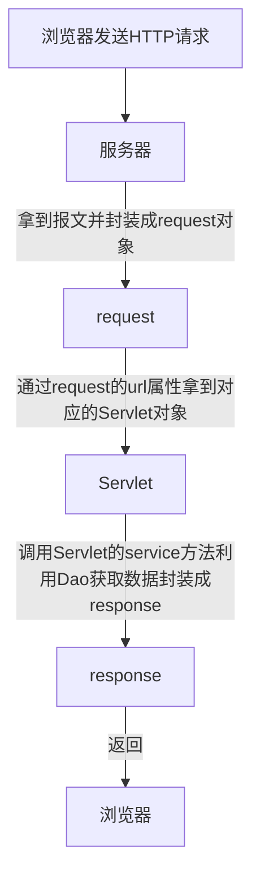
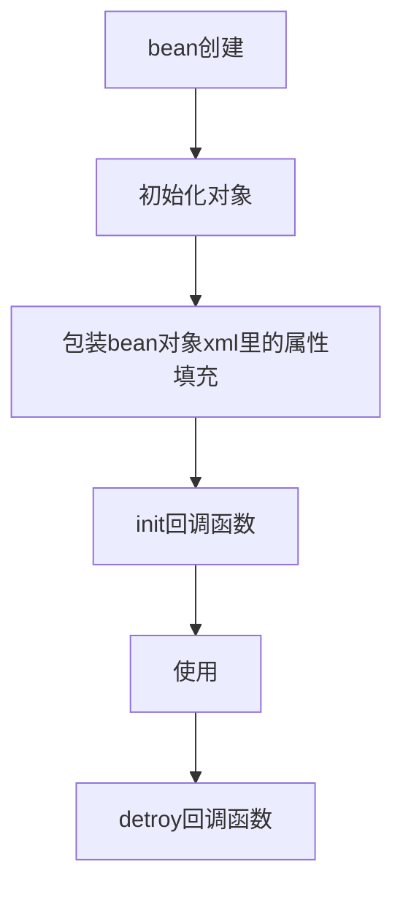

# JavaWeb

## 最原始的服务器

```java
public class Demo {
    public static void main(String[] args) throws IOException {
        ServerSocket serverSocket = new ServerSocket(8888);
        //阻塞 等待连接
        Socket socket = serverSocket.accept();

        // 输入流 读取数据
        InputStream inputStream = socket.getInputStream();
        byte[] bytes = new byte[8192];
        int len;
        while (inputStream.available() > 0) {
            len = inputStream.read(bytes);
            System.out.print(new String(bytes, 0, len));
        }
        // 输出流 回发数据
        OutputStream outputStream = socket.getOutputStream();
        // 按照http协议的格式封装一个报文
        String response = "HTTP/1.1 200 OK\r\n" +
                "Content-Length: 39\r\n" +
                "Content-Type: text/html;charset=UTF-8\r\n\r\n" +
                "<h1 style=\"color:red\">hello server!<h1>";
        outputStream.write(response.getBytes());
        outputStream.flush();
        //不要关闭，关闭会导致服务器断开
    }
}
```

浏览器输入http://localhost:8888/ 访问，会在控制台输出访问的HTTP信息,且在页面显示hello server!

```
GET / HTTP/1.1
Host: localhost:8888
Connection: keep-alive
...
```

## Servlet

Servlet 是基于 Jakarta 技术的 Web 组件，由容器管理，可生成动态内容

servlet 是独立于平台的 Java 类；容器，有时也称为 servlet 引擎

Servlet 通过 servlet 容器实现的请求/响应范式与 Web 客户端交互

### Servlet 容器

Servlet 容器是 Web 服务器或应用程序服务器的一部分，它提供发送请求和响应的网络服务、解码基于 MIME 的请求以及格式化基于 MIME 的响应。Servlet 容器还通过其生命周期包含和管理 Servlet。

### 流程图



这里的通过request的url属性拿到对应的Servlet对象，是在Servlet静态代码块初始化好url对应Servlet的map容器,然后通过url拿到Servlet，就是个多态

然后那些静态代码块初始化可以写在配置文件通过Propertiesload到代码块中

### Servlet的生命周期

- init()：Servlet进行初始化；
- service()：Servlet处理客户端的请求；
- destroy()：Servlet结束，释放资源；

### 声明周期注解

就是个钩子函数

@PostConstruct和@PreDestory

执行顺序
- @PostConstruct
- init()
- service()
- destroy()
- @PreDestory


## 创建一个普通的web工程

- File --> New --> Project --> 输入项目名称webProjectName，语言选择Java

- 项目根目录下新建文件夹webapp（存放静态资源文件）--> webapp下新建WEB-INF -->复制tomcat目录下的web.xml，并清除根节点里面的所有内容

- File --> Project Structue(项目构建) --> Facts(特性) --> Web(添加一个web特性)

- Module --> 重新配置Deployment Descriotors web.xml路径 D:\sxc\java\www\webProjectName\webapp\WEB-INF\web.xml  --> 重新配置WebRsoucre静态文件根目录 D:\sxc\java\www\webProjectName\webapp

- Artifacts --> 新建一个Web Application:expolode(可以热更新的不压缩的，另外一个是压缩的不能热更新) -->Form Modules --> 随便改个名字webProjectName

- Add Configuration --> Tomcat Server --> Local --> 随便改个名字 tomcat10 --> 配置Application server --> No artifacts marked for deployment --> Fix(配置部署) --> On 'Update' action 和 On frame deactivation配置为Update classes and resources(这两个热更新没用)

## webxml

直接全局搜索web.xml，配置都分开写了

```xml
<?xml version="1.0" encoding="UTF-8"?>
<web-app xmlns="https://jakarta.ee/xml/ns/jakartaee"
         xmlns:xsi="http://www.w3.org/2001/XMLSchema-instance"
         xsi:schemaLocation="https://jakarta.ee/xml/ns/jakartaee
                      https://jakarta.ee/xml/ns/jakartaee/web-app_5_0.xsd"
         version="5.0"
         metadata-complete="false">
    <!--metadata-complete="false" 配置false会扫描注解-->
    <servlet>
        <!--名称-->
        <servlet-name>HelloServlet</servlet-name>
        <!--路径-->
        <servlet-class>com.sxc.servlet.HelloServlet</servlet-class>
        <!--当前servlet参数-->
        <init-param>
            <param-name>DbName</param-name>
            <param-value>dbname</param-value>
        </init-param>
        <!--启动时加载-->
        <load-on-startup>1</load-on-startup>
    </servlet>
    <!--多个servlet-->
    <servlet>
        <servlet-name>OtherServlet</servlet-name>
        <servlet-class>com.sxc.servlet.OtherServlet</servlet-class>
    </servlet>
    <!--servlet对应url的映射关系-->
    <servlet-mapping>
        <servlet-name>HelloServlet</servlet-name>
        <!--精确匹配-->
        <url-pattern>/HelloServlet</url-pattern>
    </servlet-mapping>
    <servlet-mapping>
        <servlet-name>OtherServlet</servlet-name>
        <url-pattern>/OtherServlet</url-pattern>
    </servlet-mapping>
    <!--全局的参数-->
    <context-param>
        <param-name>GlobalName</param-name>
        <param-value>GlobalValue</param-value>
    </context-param>
    <!--filter过滤器-->
    <filter>
        <filter-name>MyHttpFilter</filter-name>
        <filter-class>com.sxc.filter.MyHttpFilter</filter-class>
    </filter>
    <!--filter过滤器映射-->
    <filter-mapping>
        <filter-name>MyHttpFilter</filter-name>
        <url-pattern>/*</url-pattern>
    </filter-mapping>
    <!--listener监听器-->
    <listener>
        <listener-class>com.sxc.listener.RequestListener</listener-class>
    </listener>
    <!--欢迎页配置-->
    <welcome-file-list>
        <welcome-file>index.jsp</welcome-file>
        <welcome-file>index.html</welcome-file>
    </welcome-file-list>
    <!--错误页面配置-->
    <error-page>
        <error-code>404</error-code>
        <location>/404.html</location>
    </error-page>
    <!--异常页面配置-->
    <error-page>
        <exception-type>java.lang.Exception</exception-type>
        <location>/exception.html</location>
    </error-page>
</web-app>
```

## 添加Servlet

导入tomcat/lib/servlet-api.jar 到webapp/lib目录下

### 新建Servlet

src目录下新建HelloServlet.java 下面的要重写声明周期方法

```java
package com.sxc.servlet;

import jakarta.servlet.*;

import java.io.IOException;
import java.io.PrintWriter;

public class HelloServlet implements Servlet {
    @Override
    public void init(ServletConfig servletConfig) throws ServletException {
        System.out.println("servlet初始化");
    }

    @Override
    public ServletConfig getServletConfig() {
        return null;
    }

    @Override
    public void service(ServletRequest servletRequest, ServletResponse servletResponse) throws ServletException, IOException {
        PrintWriter writer = servletResponse.getWriter();
        writer.println("hello servlet");
        writer.println(servletRequest);
        writer.println(servletResponse);
        writer.flush();
    }

    @Override
    public String getServletInfo() {
        return null;
    }

    @Override
    public void destroy() {
        System.out.println("servlet销毁");
    }
}
```

简化 GenericServlet 已经帮我做了实现Servlet的接口并提供了一个service抽象方法

```java
package com.sxc.servlet;

import jakarta.servlet.*;

import java.io.IOException;
import java.io.PrintWriter;

public class HelloServlet extends GenericServlet {

    @Override
    public void service(ServletRequest servletRequest, ServletResponse servletResponse) throws IOException {
        PrintWriter writer = servletResponse.getWriter();
        writer.println("hello servlet2");
        writer.println(servletRequest);
        writer.println(servletResponse);
        writer.flush();
    }
}
```

继续简化，可以处理指定的resultFul接口 测试使用 FeHelper的简易Postman

```java
package com.sxc.servlet;

import jakarta.servlet.ServletException;
import jakarta.servlet.http.HttpServlet;
import jakarta.servlet.http.HttpServletRequest;
import jakarta.servlet.http.HttpServletResponse;

import java.io.IOException;
import java.io.PrintWriter;

public class HelloServlet extends HttpServlet {
    @Override
    protected void doGet(HttpServletRequest req, HttpServletResponse resp) throws IOException {
        PrintWriter writer = resp.getWriter();
        writer.println("servlet get");
        writer.flush();
        //注释下面方法
        //super.doGet(req, resp);
    }

    @Override
    protected void doPost(HttpServletRequest req, HttpServletResponse resp) throws ServletException, IOException {
        PrintWriter writer = resp.getWriter();
        writer.println("servlet post");
        writer.flush();
    }

    @Override
    protected void doPut(HttpServletRequest req, HttpServletResponse resp) throws ServletException, IOException {
        PrintWriter writer = resp.getWriter();
        writer.println("servlet put");
        writer.flush();
    }

    @Override
    protected void doDelete(HttpServletRequest req, HttpServletResponse resp) throws ServletException, IOException {
        PrintWriter writer = resp.getWriter();
        writer.println("servlet delete");
        writer.flush();
    }
}
```

### 注册一个Servlet到容器当中

web.xml alt+insert快速添加servlet,之后访问http://localhost:8888/webProjectName/HelloServlet

```xml
<?xml version="1.0" encoding="UTF-8"?>
<web-app xmlns="https://jakarta.ee/xml/ns/jakartaee"
         xmlns:xsi="http://www.w3.org/2001/XMLSchema-instance"
         xsi:schemaLocation="https://jakarta.ee/xml/ns/jakartaee
                      https://jakarta.ee/xml/ns/jakartaee/web-app_5_0.xsd"
         version="5.0"
         metadata-complete="true">
    <servlet>
        <!--名称-->
        <servlet-name>HelloServlet</servlet-name>
        <!--路径-->
        <servlet-class>com.sxc.servlet.HelloServlet</servlet-class>
    </servlet>
    <!--servlet对应url的映射关系-->
    <servlet-mapping>
        <servlet-name>HelloServlet</servlet-name>
        <url-pattern>/HelloServlet</url-pattern>
    </servlet-mapping>
</web-app>
```

### URL路由匹配

web.xml

```xml
<?xml version="1.0" encoding="UTF-8"?>
<web-app xmlns="https://jakarta.ee/xml/ns/jakartaee"
         xmlns:xsi="http://www.w3.org/2001/XMLSchema-instance"
         xsi:schemaLocation="https://jakarta.ee/xml/ns/jakartaee
                      https://jakarta.ee/xml/ns/jakartaee/web-app_5_0.xsd"
         version="5.0"
         metadata-complete="true">
    <servlet>
        <!--名称-->
        <servlet-name>HelloServlet</servlet-name>
        <!--路径-->
        <servlet-class>com.sxc.servlet.HelloServlet</servlet-class>
    </servlet>
    <!--servlet对应url的映射关系-->
    <servlet-mapping>
        <servlet-name>HelloServlet</servlet-name>
        <!--精确匹配-->
        <url-pattern>/HelloServlet</url-pattern>
        <!--路径匹配 按长短匹配 先匹配长的-->
        <url-pattern>/HelloServlet/a/b</url-pattern>
        <url-pattern>/HelloServlet/a</url-pattern>
        <!--通配符匹配以HelloServlet开头-->
        <url-pattern>/HelloServlet/*</url-pattern>
        <!--扩展名匹配，只能加扩展名-->
        <url-pattern>*.exe</url-pattern>
        <!--默认匹配，任意都会匹配到这个-->
        <url-pattern>/</url-pattern>
    </servlet-mapping>
</web-app>
```

### 获取servlet里的配置

web.xml

```xml
<servlet>
    <servlet-name>HelloServlet</servlet-name>
    <servlet-class>com.sxc.servlet.HelloServlet</servlet-class>
    <!--参数-->
    <init-param>
        <param-name>DbName</param-name>
        <param-value>dbname</param-value>
    </init-param>
</servlet>
```

获取

```java
public class HelloServlet extends HttpServlet {
    @Override
    protected void doGet(HttpServletRequest req, HttpServletResponse resp) {
        System.out.println(getInitParameter("DbName"));
    }
}
```

### 配置文件里全局读取

任意一个Servlet都可以读取

web.xml

```xml
<context-param>
    <param-name>GlobalName</param-name>
    <param-value>GlobalValue</param-value>
</context-param>
```

获取

```java
public class HelloServlet extends HttpServlet {
    @Override
    protected void doGet(HttpServletRequest req, HttpServletResponse resp) {
        ServletContext servletContext = getServletContext();
        //getInitParameter 获取当前Servlet配置； servletContext.getInitParameter获取全局的配置
        System.out.println(servletContext.getInitParameter("GlobalName"));//GlobalValue
        //不要用下面这个，无法输出
        System.out.println(getInitParameter("GlobalName"));//null
    }
}
```

### 加载优先级

load-on-startup标签可以设置servlet的加载优先级别和容器是否在启动时加载该servlet,正数的值越小，启动时加载该servlet的优先级越高

```xml
<servlet>
    <load-on-startup>1</load-on-startup>
</servlet>
```

### 使用注解配置Servlet

web.xml

```xml
<web-app xmlns="https://jakarta.ee/xml/ns/jakartaee"
         xmlns:xsi="http://www.w3.org/2001/XMLSchema-instance"
         xsi:schemaLocation="https://jakarta.ee/xml/ns/jakartaee
                      https://jakarta.ee/xml/ns/jakartaee/web-app_5_0.xsd"
         version="5.0"
         metadata-complete="false">
         <!-- metadata-complete需要配置为false -->
</web-app>
```

```java
@WebServlet(
        //名称
        name = "HelloServlet",
        //url访问地址
        urlPatterns = {"/HelloServlet"},//用value也一样
        //启动时加载
        loadOnStartup = 1,
        //当前servlet初始化参数
        initParams = {
                @WebInitParam(
                        name = "DbName",
                        value = "dbname"
                )
        }
)
public class HelloServlet extends HttpServlet {
    @Override
    protected void doGet(HttpServletRequest req, HttpServletResponse resp) throws ServletException, IOException {
        System.out.println("hello");
    }
}
```


## 请求HttpServletRequest

HttpServletRequest

### 常用方法

```java
package com.sxc.servlet;

import jakarta.servlet.http.HttpServlet;
import jakarta.servlet.http.HttpServletRequest;
import jakarta.servlet.http.HttpServletResponse;

import java.io.IOException;
import java.io.PrintWriter;
import java.util.Arrays;
import java.util.Enumeration;
import java.util.Map;

public class HelloServlet extends HttpServlet {
    @Override
    protected void doGet(HttpServletRequest req, HttpServletResponse resp) throws IOException {
        PrintWriter writer = resp.getWriter();
        writer.println("servlet get");
        writer.flush();

        //获取参数
        Map<String, String[]> parameterMap = req.getParameterMap();
        for (Map.Entry<String, String[]> stringEntry : parameterMap.entrySet()) {
            System.out.println(stringEntry.getKey() + ":" + Arrays.toString(stringEntry.getValue()));
        }

        //项目根目录
        System.out.println(req.getContextPath());// /webProjectName
        //servlet路径
        System.out.println(req.getServletPath());// /HelloServlet
        //请求的方法
        System.out.println(req.getMethod());//GET
        //查询的参数
        System.out.println(req.getQueryString());//id=3&&name=4
        //访问的URL
        System.out.println(req.getRequestURI());// /webProjectName/HelloServlet
        System.out.println(req.getRequestURL());// http://localhost:8888/webProjectName/HelloServlet
        //远程主机
        System.out.println(req.getRemoteHost());// 0:0:0:0:0:0:0:1
        //访问的ip
        System.out.println(req.getRemoteAddr());// 0:0:0:0:0:0:0:1
        //协议
        System.out.println(req.getScheme());//http

        //头部信息
        System.out.println(req.getHeader("Content-Type"));
        //所有头部名称
        Enumeration<String> headerNames = req.getHeaderNames();
        while (headerNames.hasMoreElements()) {
            String s = headerNames.nextElement();
            System.out.println(s + ":" + req.getHeader(s));
        }
    }
}
```

### 请求转发

web.xml新增一个OtherServlet

```xml
    <servlet>
        <servlet-name>OtherServlet</servlet-name>
        <servlet-class>com.sxc.servlet.OtherServlet</servlet-class>
    </servlet>
    <servlet-mapping>
        <servlet-name>OtherServlet</servlet-name>
        <url-pattern>/OtherServlet</url-pattern>
    </servlet-mapping>
```


```java
public class HelloServlet extends HttpServlet {
    @Override
    protected void doGet(HttpServletRequest req, HttpServletResponse resp) throws IOException, ServletException {
        //转发
        RequestDispatcher requestDispatcher = req.getRequestDispatcher("/OtherServlet");
        requestDispatcher.forward(req, resp);
    }
}
```

```java
public class OtherServlet extends HttpServlet {
    @Override
    protected void doGet(HttpServletRequest req, HttpServletResponse resp) throws IOException {
        System.out.println("OtherServlet");
    }
}
```

### 在各个转发中共享数据

该方法称之为域方法。。。

```java
public class HelloServlet extends HttpServlet {
    @Override
    protected void doGet(HttpServletRequest req, HttpServletResponse resp) throws IOException, ServletException {
        RequestDispatcher requestDispatcher = req.getRequestDispatcher("/OtherServlet");
        //该方法可以在多个Servlet中共享
        req.setAttribute("access_token","abcd");
        requestDispatcher.forward(req, resp);
    }
}
```

```java
public class OtherServlet extends HttpServlet {
    @Override
    protected void doGet(HttpServletRequest req, HttpServletResponse resp) throws IOException {
        System.out.println(req.getAttribute("access_token"));
    }
}
```

### 整个应用里共享数据

ServletContext叫做Application域,关闭浏览器也不会消失

设置

```java
public class HelloServlet extends HttpServlet {
    @Override
    protected void doGet(HttpServletRequest req, HttpServletResponse resp) {
        ServletContext servletContext = req.getServletContext();
        //该方法可以在整个应用中共享数据
        servletContext.setAttribute("globalValue", "abcd");
    }
}
```

读取

```java
public class OtherServlet extends HttpServlet {
    @Override
    protected void doGet(HttpServletRequest req, HttpServletResponse resp) {
        ServletContext servletContext = req.getServletContext();
        System.out.println(servletContext.getAttribute("globalValue"));
    }
}
```

## 响应

### 响应流类型

```java
PrintWriter out = response.getWriter();//获取字符流，处理字符；
ServletOutputStream out = response.getOutputStream();//获取字节流，处理文件；
```

tips:getWriter 会有一个缓冲区大小为8KB 如果要立即刷新缓冲区 使用flushBuffer()

### 响应中文字符乱码

```java
public class HelloServlet extends HttpServlet {
    @Override
    protected void doGet(HttpServletRequest req, HttpServletResponse resp) throws IOException {
        resp.setCharacterEncoding("GBK");
        PrintWriter writer = resp.getWriter();
        writer.println("hello中文字符");
        writer.flush();
    }
}
```

优化

```java
public class HelloServlet extends HttpServlet {
    @Override
    protected void doGet(HttpServletRequest req, HttpServletResponse resp) throws IOException {
        resp.setContentType("text/html;charset=UTF-8");
        //文本
        //resp.setContentType("text/plain;charset=UTF-8");
        //json
        //resp.setContentType("application/json;charset=UTF-8");
        PrintWriter writer = resp.getWriter();
        writer.println("hello中文字符");
        writer.flush();
    }
}
```

### 设置响应头

```java
public class HelloServlet extends HttpServlet {
    @Override
    protected void doGet(HttpServletRequest req, HttpServletResponse resp) throws IOException {
        resp.setContentType("text/html;charset=UTF-8");
        resp.setHeader("token","abcd");
        PrintWriter writer = resp.getWriter();
        writer.println("hello");
        writer.flush();
    }
}
```

### 重定向

```java
public class HelloServlet extends HttpServlet {
    @Override
    protected void doGet(HttpServletRequest req, HttpServletResponse resp) throws IOException {
        resp.sendRedirect("https://www.baidu.com");
    }
}
```

## Cookie

```java
public class HelloServlet extends HttpServlet {
    @Override
    protected void doGet(HttpServletRequest req, HttpServletResponse resp) throws IOException {
        resp.setContentType("text/html;charset=UTF-8");
        //创建Cookie
        Cookie cookie = new Cookie("jseesion", UUID.randomUUID().toString());
        //设置过期时间 s 小于0 就是关闭浏览器就失效 0是立即失效(ps失效了浏览器会自动删除这个cookie)
        cookie.setMaxAge(10);
        //添加到响应头就是 addHeader("Set-Cookie","xxx")
        resp.addCookie(cookie);
        PrintWriter writer = resp.getWriter();
        writer.println("hello");
        writer.flush();
    }
}
```

## Session

服务器端第一次调用getSession()的时候会创建；(保存在服务器内存中),应该和php中session_start()一个道理

第一次调用会在请求里添加Set-Cookie

```
Set-Cookie: JSESSIONID=F186609E35A640E7B308F74CA2DB5D99; Path=/webProjectName; HttpOnly
```

### 配置

web.xml配置失效时间

```xml
<session-config>
    <!-- 30 minute -->
    <session-timeout>30</session-timeout>
</session-config>
```

### 存储

```java
public class HelloServlet extends HttpServlet {
    @Override
    protected void doGet(HttpServletRequest req, HttpServletResponse resp) throws IOException {
        resp.setContentType("text/html;charset=UTF-8");
        //启用session true,如果没有session则创建
        HttpSession session = req.getSession(true);
        //往里面存东西取东西就可以了
        session.setAttribute("userId","9999");
        PrintWriter writer = resp.getWriter();
        writer.println("hello");
        writer.flush();
    }
}
```

### 读取

```java
public class OtherServlet extends HttpServlet {
    @Override
    protected void doGet(HttpServletRequest req, HttpServletResponse resp) throws IOException {
        //获取session
        HttpSession session = req.getSession(true);
        if (session != null){
            System.out.println(session.getAttribute("userId"));
        }
    }
}
```

### 解决session浏览器关闭失效

自带的session设置的cookie是-1 关闭浏览器即失效

```java
public class HelloServlet extends HttpServlet {
    @Override
    protected void doGet(HttpServletRequest req, HttpServletResponse resp) throws IOException {
        resp.setContentType("text/html;charset=UTF-8");
        //启用session true,如果没有session则创建
        HttpSession session = req.getSession(true);
        //手动创建JSESSIONID Cookie JSESSIONID=F186609E35A640E7B308F74CA2DB5D99; Path=/webProjectName; HttpOnly 会返回2个Set-Cookie
        Cookie cookie = new Cookie("JSESSIONID", session.getId());
        //设置过期时间非常大
        cookie.setMaxAge(Integer.MAX_VALUE);
        cookie.setHttpOnly(true);
        cookie.setPath(req.getContextPath());

        resp.addCookie(cookie);
        PrintWriter writer = resp.getWriter();
        writer.println("hello");
        writer.flush();
    }
}
```

## JSP

本质就是转成servlet 使用resp.getWriter()拼接输出

了解一下，他的标签不用学

### 案例

```java
<%@ page contentType="text/html;charset=UTF-8" language="java" %>
<html>
<head>
    <title>Title</title>
</head>
<body>
<%-- <%!可以放在servic方法外面 --%>
<%!
    public static String name = "JSP";

    static {
        System.out.println("static block");
    }

    public static void fun() {
        System.out.println("static fun");
    }
%>
<%
    System.out.println("hello");
    int count = 30;
    System.out.println(name);
    fun();
%>
<h1><%=count%>
</h1>
<%--全局域--%>
${applicationScope}
<%--session域--%>
${sessionScope}
<%--当前servlet--%>
${pageScope}
<%--请求域--%>
${requestScope}
</body>
</html>
```

### 本质

Servlet处理请求存放到request中，然后通过转发到jsp页面去显示数据

```java
public class HelloServlet extends HttpServlet {
    @Override
    protected void doGet(HttpServletRequest req, HttpServletResponse resp) throws ServletException, IOException {
        //转发
        RequestDispatcher requestDispatcher = req.getRequestDispatcher("/home.jsp");
        requestDispatcher.forward(req, resp);
    }
}
```

### 配置错误页面

web.xml

```xml
<error-page>
    <error-code>404</error-code>
    <location>/pages/404.jsp</location>
</error-page>

<error-page>
    <exception-type>java.lang.Exception</exception-type>
    <location>/pages/err.jsp</location>
</error-page>
```

### 配置首页

web.xml

```xml
<welcome-file-list>
    <welcome-file>index.jsp</welcome-file>
    <welcome-file>index.html</welcome-file>
</welcome-file-list>
```


## Filter

使用场景，字符集设置，权限认证

过滤器 启动服务器时即加载

每个Filter顺序执行，执行完毕逆向放行，先进后出

### 配置

web.xml

```xml
<filter>
    <filter-name>MyHttpFilter</filter-name>
    <filter-class>com.sxc.filter.MyHttpFilter</filter-class>
</filter>

<filter-mapping>
    <filter-name>MyHttpFilter</filter-name>
        <!-- /*是全部匹配了 -->
    <url-pattern>/*</url-pattern>
</filter-mapping>
```

### 使用案例

拦截http请求

MyHttpFilter.java

```java
public class MyHttpFilter extends jakarta.servlet.http.HttpFilter {
    @Override
    protected void doFilter(HttpServletRequest request, HttpServletResponse response, FilterChain chain) throws IOException, ServletException {
        //对request方法进行过滤，假如只允许POST请求
        if (!request.getMethod().equals("POST")) {
            System.out.println("不是POST方法不放行");
            return;
        }
        //下面那个doFilter的作用是放行的意思，就是过滤通过了
        super.doFilter(request, response, chain);//就是执行了chain.doFilter()
    }
}
```

HelloServlet.java

```java
public class HelloServlet extends HttpServlet {
    @Override
    protected void doGet(HttpServletRequest req, HttpServletResponse resp) {
        System.out.println("永远进不来");
    }

    @Override
    protected void doPost(HttpServletRequest req, HttpServletResponse resp) {
        System.out.println("放行了");
    }
}
```

### 使用注解配置filter

注意web.xml需要开启扫描

```xml
metadata-complete="false"
```

```java
@WebFilter(filterName = "MyHttpFilter", urlPatterns = {"/*"})
public class MyHttpFilter extends jakarta.servlet.http.HttpFilter {
    @Override
    protected void doFilter(HttpServletRequest request, HttpServletResponse response, FilterChain chain) throws IOException, ServletException {
        //对request方法进行过滤，假如只允许POST请求
        if (!request.getMethod().equals("POST")) {
            System.out.println("不是POST方法不放行");
            return;
        }
        //下面那个doFilter的作用是放行的意思，就是过滤通过了
        super.doFilter(request, response, chain);//就是执行了chain.doFilter()
    }
}
```

## Listener

监听器，用于监听各种类启动时，创建时，触发回调函数，类似于button.onclick = function(){} ...

继承EventListener的有很多如ServletRequestListener（每次请求监听），HttpSessionListener（session创建监听），ServletContextListener（应用创建监听，做初始化工作）等，具体ctrl+h EventListener查看


### 配置

web.xml

```xml
<listener>
    <listener-class>com.sxc.listener.RequestListener</listener-class>
</listener>
```

### 使用案例

监听网站访问

```java
public class RequestListener implements ServletRequestListener {
    /**
     * @param sre 事件绑定的对象 就是servlet对象
     */
    @Override
    public void requestInitialized(ServletRequestEvent sre) {
        //Servlet每初始化一次，说明URL被访问一次
        ServletContext servletContext = sre.getServletContext();
        Object visitCount = servletContext.getAttribute("visitCount");
        if (visitCount == null) {
            visitCount = 0;
        }
        servletContext.setAttribute("visitCount", (Integer) (visitCount) + 1);
        System.out.println("访问了" + visitCount);
        ServletRequestListener.super.requestInitialized(sre);
    }
}
```

### 使用注解配置Listener

注意web.xml需要开启扫描

```xml
metadata-complete="false"
```

```java
@WebListener
public class RequestListener implements ServletRequestListener {
    /**
     * @param sre 事件绑定的对象 就是servlet对象
     */
    @Override
    public void requestInitialized(ServletRequestEvent sre) {
        //Servlet每初始化一次，说明URL被访问一次
        ServletContext servletContext = sre.getServletContext();
        Object visitCount = servletContext.getAttribute("visitCount");
        if (visitCount == null) {
            visitCount = 0;
        }
        servletContext.setAttribute("visitCount", (Integer) (visitCount) + 1);
        System.out.println("访问了" + visitCount);
        ServletRequestListener.super.requestInitialized(sre);
    }
}
```

## JNDI全局配置

### 创建

可以配置数据源，一些全局的常量，比较解耦。目录是webapp/META-INF/context.xml,手动创建，或者自动生成

- File --> Project Structue(项目构建) --> Facts(特性) --> Deployment Descriptors --> Add Application Server specific descriptor --> 选择tomcat server

### 配置

context.xml

```xml
<?xml version="1.0" encoding="UTF-8"?>
<Context path="/">
    <!--数据源-->
    <Resource name="dataSource/mysql"
              auth="Container"
              type="javax.sql.DataSource"
              driverClassName="com.mysql.jdbc.Driver"
              url="jdbc:mysql://127.0.0.1:3306/dbname??useSSL=false;rewriteBatchedStatements=true;characterEncoding=utf-8;serverTimezone=Asia/Shanghai;"
              username="root" password=""
              maxTotal="20" maxIdle="10"
              maxWaitMillis="10000"/>
</Context>
```

然后在webapp/lib下面导入mysql-connector-java-5.1.47.jar下载地址见JDBC

### 使用

```java
public class HelloServlet extends HttpServlet {
    @Override
    protected void doGet(HttpServletRequest req, HttpServletResponse resp) {
        Context ctx;
        try {
            //初始化Context
            ctx = new InitialContext();
            //获取mysql连接
            DataSource dataSource = (DataSource) ctx.lookup("java:comp/env/dataSource/mysql");
            Connection connection = dataSource.getConnection();
            System.out.println(connection);//53913482, URL=jdbc:mysql://127.0.0.1:3306/dbname??useSSL=false;rewriteBatchedStatements=true;characterEncoding=utf-8;serverTimezone=Asia/Shanghai, MySQL Connector Java
        } catch (NamingException | SQLException e) {
            throw new RuntimeException(e);
        }
    }
}
```

### 在webxml中定义

也可以在web.xml中定义基础数据类型

```xml
<!--基础数据类型-->
<env-entry>
    <env-entry-name>config/baseUrl</env-entry-name>
    <env-entry-type>java.lang.String</env-entry-type>
    <env-entry-value>D://www/</env-entry-value>
</env-entry>
```

使用

```java
public class HelloServlet extends HttpServlet {
    @Override
    protected void doGet(HttpServletRequest req, HttpServletResponse resp) {
        Context ctx;
        try {
            //初始化Context
            ctx = new InitialContext();
            //获取全局常量
            String baseUrl = (String) ctx.lookup("java:comp/env/config/baseUrl");
            System.out.println(baseUrl);//D://www/
        } catch (NamingException e) {
            throw new RuntimeException(e);
        }
    }
}
```

### 使用注解引入资源

前提是导入tomcat/lib目录下的annotations-api.jar

然后使用import jakarta.annotation.Resource;

```java
@WebServlet(
        //名称
        name = "HelloServlet",
        //url访问地址
        urlPatterns = {"/HelloServlet"},//用value也一样
        //启动时加载
        loadOnStartup = 1
)
public class HelloServlet extends HttpServlet {

    @Resource(lookup = "java:comp/env/config/baseUrl")
    String baseUrl;

    @Override
    protected void doGet(HttpServletRequest req, HttpServletResponse resp) {
        System.out.println(baseUrl);//D://www/
    }
}
```

## 文件上传

在webapp下新建一个upload.html

```html
<!DOCTYPE html>
<html lang="en">
<head>
    <meta charset="UTF-8">
    <title>Title</title>
</head>
<body>
    <form action="/webProjectName/UploadServlet" enctype="multipart/form-data" method="post">
        <input type="file" name="filename">
        <input type="submit" value="提交">
    </form>
</body>
</html>
```

处理文件上传需要多部分的注解@MultipartConfig

```java
@WebServlet("/UploadServlet")
@MultipartConfig
public class UploadServlet extends HttpServlet {

    @Override
    protected void doPost(HttpServletRequest req, HttpServletResponse resp) {
        BufferedInputStream bufferedInputStream = null;
        BufferedOutputStream bufferedOutputStream = null;
        ByteArrayOutputStream byteArrayOutputStream;
        try {
            //获取文件对象
            Part filename = req.getPart("filename");
            String submittedFileName = filename.getSubmittedFileName();
            InputStream inputStream = filename.getInputStream();
            bufferedInputStream = new BufferedInputStream(inputStream);

            // 文件输出流用于保存文件
            bufferedOutputStream = new BufferedOutputStream(new FileOutputStream("D://sxc/java/www/webProjectName/webapp/" + submittedFileName, true));

            // 字节数组流 存储文件
            byteArrayOutputStream = new ByteArrayOutputStream();
            byte[] bytes = new byte[1024 * 1024];
            int len;
            while ((len = bufferedInputStream.read(bytes)) != -1) {
                byteArrayOutputStream.write(bytes, 0, len);
            }
            // 写入文件流
            bufferedOutputStream.write(byteArrayOutputStream.toByteArray());
            bufferedOutputStream.flush();
            System.out.println("完成");
        } catch (IOException | ServletException e) {
            throw new RuntimeException(e);
        } finally {
            try {
                if (bufferedInputStream != null)
                    bufferedInputStream.close();
                if (bufferedOutputStream != null)
                    bufferedOutputStream.close();
                if (bufferedOutputStream != null)
                    bufferedOutputStream.close();
            } catch (IOException e) {
                e.printStackTrace();
            }
        }
    }
}
```

## JSON解析

使用[fastjson](https://github.com/alibaba/fastjson/)

## 打包

### 构建

- Artifacts --> 新建一个Web Application:Archive -->Form Modules --> 随便改个名字webProjectNameWar
- Build --> Build Artifacts

修改配置文件

servel.xml

```xml
<!-- 注释旧的测试的那个，新增appBase为webapps，因为这是tomcat目录下的文件夹名称... -->
<Host name="localhost"  appBase="webapps"
    unpackWARs="true" autoDeploy="true">
<Valve className="org.apache.catalina.valves.AccessLogValve" directory="logs"
        prefix="localhost_access_log" suffix=".txt"
        pattern="%h %l %u %t &quot;%r&quot; %s %b" />
</Host>
```

然后把打包后的war文件放入D:\sxc\tomcat\apache-tomcat-10.0.22\webapps

然后命令行运行startup启动tomcat

访问http://localhost:8888/webProjectNameWar/


# 工具类

## 高并发测试方法

自己封装了一下

```java
//用于并发模拟n个用户同时执行一个方法
public class ThreadConcurrentUtil {

    //用接口的方式 用内部类或lambda实现这个方法
    interface ThreadConcurrentInterface {
        public void fn();
    }

    //该对象可以阻塞线程
    private CyclicBarrier cyclicBarrier = null;
    //并发数
    private int n = 0;

    /**
     * @param n 并发数
     */
    public ThreadConcurrentUtil(int n) {
        this.n = n;
        cyclicBarrier = new CyclicBarrier(n);
    }

    /**
     * 并发测试方法
     *
     * @param tThreadConcurrentInterface 用内部类或lambda实现这个方法
     */
    public void test(ThreadConcurrentInterface tThreadConcurrentInterface) {
        ArrayList<Thread> list = new ArrayList<>();
        for (int i = 0; i < n; i++) {
            Thread thread = new Thread(new Runnable() {
                @Override
                public void run() {
                    System.out.println("线程开始时间：" + System.currentTimeMillis());
                    //线程等待
                    try {
                        cyclicBarrier.await();
                    } catch (InterruptedException | BrokenBarrierException e) {
                        e.printStackTrace();
                    }
                    tThreadConcurrentInterface.fn();
                }
            });
            list.add(thread);
        }
        for (Thread t : list) {
            t.start();
        }
        try {
            Thread.sleep(300);
        } catch (InterruptedException e) {
            e.printStackTrace();
        }
    }

    /**
     * 使用方法
     *
     * @param args
     */
    public static void main(String[] args) {
        new ThreadConcurrentUtil(10).test(new ThreadConcurrentInterface() {
            @Override
            public void fn() {
                System.out.println("这里写是实际的测试内容");
            }
        });
    }
}
```

也可以用线程池

```java
import java.util.concurrent.*;

public class Demo {
    public static void main(String[] args) {
        Runnable runnable = () -> {
            System.out.println("线程开始时间：" + System.currentTimeMillis());
            try {
                Thread.sleep(1000);
            } catch (InterruptedException e) {
                e.printStackTrace();
            }
        };

        ExecutorService pools = Executors.newFixedThreadPool(1000);
        //最大就70个，i大于70就异常
        for (int i = 0; i < 700; i++) {
            pools.submit(runnable);
        }
    }
}
```

## 读取xml

[dom4j](https://dom4j.github.io/)

示例xml

只要知道Element就是标签，获取标签名称用.getName(),获取标签innerHtml用.getText();Attribute就是属性，获取属性值用.getValue()

```xml
<?xml version="1.0" encoding="UTF-8" ?>
<app>
    <!--第一种是配置在属性里面的-->
    <dataSource>
        <properties name="dbnameAttribute" value="dbnameValue"/>
        <properties name="userAttribute" value="userValue"/>
        <properties name="passwordAttribute" value="passwordValue"/>
    </dataSource>
    <!--第二种是配置在innerHtml里面-->
    <config>
        <baseUrl>http://127.0.0.1</baseUrl>
        <port>8080</port>
    </config>
    <!--第三种名称在标签上值在innerHtml-->
    <dataSource2>
        <properties name="dbnameAttribute">dbnameValue</properties>
        <properties name="userAttribute">userValue</properties>
        <properties name="passwordAttribute">passwordValue</properties>
    </dataSource2>
    <!--第四种双重循环-->
    <configs>
        <config>
            <baseUrl>http://127.0.0.1</baseUrl>
            <port>8080</port>
        </config>
        <config>
            <baseUrl>http://127.0.0.2</baseUrl>
            <port>8888</port>
        </config>
    </configs>
</app>
```

```java
public class Demo {
    public static void main(String[] args) throws IOException, DocumentException {
        //需要的URL对象
        URL resource = Demo.class.getClassLoader().getResource("web.xml");
        SAXReader reader = new SAXReader();
        Document document = reader.read(resource);
        //拿到xml根节点
        Element rootElement = document.getRootElement();
        /*---------------------第一种--------------------*/
        //拿到需要的节点
        Element dataSource = rootElement.element("dataSource");
        //遍历节点
        Iterator<Element> elementIterator = dataSource.elementIterator();
        while (elementIterator.hasNext()) {
            //拿到节点
            Element element = elementIterator.next();
            //获取节点属性
            Attribute nameAttribute = element.attribute("name");
            Attribute valueAttribute = element.attribute("value");
            //获取属性值
            System.out.println(nameAttribute.getValue() + ":" + valueAttribute.getValue());
        }
        /*---------------------第二种--------------------*/
        //拿到需要的节点
        dataSource = rootElement.element("config");
        //遍历节点
        elementIterator = dataSource.elementIterator();
        while (elementIterator.hasNext()) {
            //拿到节点
            Element element = elementIterator.next();
            //拿到值
            System.out.println(element.getName() + ":" + element.getText());
        }
        /*---------------------第三种--------------------*/
        //拿到需要的节点
        dataSource = rootElement.element("dataSource2");
        //遍历节点
        elementIterator = dataSource.elementIterator();
        while (elementIterator.hasNext()) {
            //拿到节点
            Element element = elementIterator.next();
            //获取属性
            Attribute nameAttribute = element.attribute("name");
            //拿到值
            System.out.println(nameAttribute.getValue() + ":" + element.getText());
        }
        /*---------------------第四种--------------------*/
        //拿到需要的节点
        dataSource = rootElement.element("configs");
        //遍历节点
        elementIterator = dataSource.elementIterator();
        while (elementIterator.hasNext()) {
            //拿到节点 config
            Element element = elementIterator.next();
            //拿到子节点值
            String baseUrl = element.element("baseUrl").getText();
            String port = element.element("port").getText();
            //拿到值
            System.out.println(baseUrl + ":" + port);
        }
    }
}
```

# 经典解决方案

## ThreadLocal

**线程本地变量**

底层保存一个ThreadLocalMap key是当前线程（Thread.currentThread()） value是实际保存的值

解决每个线程需要独享一个对象,或者是每个线程需要有一个全局变量的时候
（静态变量会导致每个线程共用一个变量，可以用synchronized解决，但是不够完美；另外如果在线程里每次调用方法就创建一个对象，内存开销太大，所以这个时候就需要每个线程有一个隔离的属于自己的静态变量）

一般在连接池优化上会使用到ThreadLocal，在多线程获取连接池时，会有同步操作，影响性能。如果使用ThreadLocal，每个线程使用自己的独立连接，性能会有一定的提升

使用案例见**DAO事务操作**，同一个线程中，多个模型类事务操作，需要使用同一个连接


# JDBC

基础的JDBC看看就行

需要将mysql-connector-java.jar包导入,mysql5.7可以直接用8.0版本的，也支持

[下载地址](https://dev.mysql.com/downloads/connector/j/) 选择Platform Independent

## 步骤

db.properties文件内容见 *写入配置文件加载(推荐)*

1. 注册驱动，加载Driver类
2. 获取连接，得到Connection
3. 执行sql
4. 释放资源

```java
import java.io.*;
import java.sql.*;
import java.util.Properties;

public class Demo {
    public static void main(String[] args) throws SQLException, IOException, ClassNotFoundException {
        //新建Properties对象
        Properties properties = new Properties();
        //获取文件输入流
        BufferedInputStream bufferedInputStream = new BufferedInputStream(new FileInputStream("db.properties"));
        //加载输入流到properties对象
        properties.load(bufferedInputStream);
        //加载Driver时自动完成注册
        Class.forName(properties.getProperty("driver"));
        //得到连接
        Connection connection = DriverManager.getConnection(properties.getProperty("url"), properties.getProperty("user"), properties.getProperty("password"));
        //执行sql statement.execute 返回值不代表执行成功或失败，如果执行的是查询语句，返回的是ResultSet则返回true，其他查询或更新语句返回false
        Statement statement = connection.createStatement();
        int i = statement.executeUpdate("INSERT INTO `user` (name,age) VALUES ('张四',4)");
        if (i > 0) {
            System.out.println("新增一条数据");
        }
        ResultSet resultSet = statement.executeQuery("SELECT * FROM `user`");
        while (resultSet.next()) {
            int id = resultSet.getInt(1);
            String name = resultSet.getString(2);
            int age = resultSet.getInt(3);
            System.out.println(id + "\t" + name + "\t" + age);
        }
        //关闭连接
        resultSet.close();
        statement.close();
        connection.close();
        //关闭流
        bufferedInputStream.close();
    }
}
```

## 连接方式

### 原始方式

```java
import com.mysql.jdbc.Driver;

import java.sql.Connection;
import java.sql.SQLException;
import java.util.Properties;

public class Demo {
    public static void main(String[] args) throws SQLException {
        //得到驱动
        Driver driver = new Driver();
        //得到连接
        Properties properties = new Properties();
        properties.put("user", "root");
        properties.put("password", "");
        Connection connection = driver.connect("jdbc:mysql://localhost:3307/dbname?useSSL=false&&rewriteBatchedStatements=true&&characterEncoding=utf-8&&serverTimezone=Asia/Shanghai", properties);
        //关闭连接
        connection.close();
    }
}
```

### 反射方式

```java
import com.mysql.jdbc.Driver;

import java.lang.reflect.InvocationTargetException;
import java.sql.Connection;
import java.sql.SQLException;
import java.util.Properties;

public class Demo {
    public static void main(String[] args) throws SQLException, ClassNotFoundException, IllegalAccessException, InstantiationException, NoSuchMethodException, InvocationTargetException {
        //得到驱动
        Class<?> aClass = Class.forName("com.mysql.jdbc.Driver");
        Driver driver = (Driver) aClass.getConstructor().newInstance();
        //得到连接
        Properties properties = new Properties();
        properties.put("user", "root");
        properties.put("password", "");
        Connection connection = driver.connect("jdbc:mysql://localhost:3307/dbname?useSSL=false&&rewriteBatchedStatements=true&&characterEncoding=utf-8&&serverTimezone=Asia/Shanghai", properties);
        //关闭连接
        connection.close();
    }
}
```

### DriverManager方式

```java
import com.mysql.jdbc.Driver;

import java.sql.Connection;
import java.sql.DriverManager;
import java.sql.SQLException;

public class Demo {
    public static void main(String[] args) throws SQLException, ClassNotFoundException, IllegalAccessException, InstantiationException {
        //得到驱动
        Class<?> aClass = Class.forName("com.mysql.jdbc.Driver");
        Driver driver = (Driver) aClass.newInstance();
        //注册驱动
        DriverManager.registerDriver(driver);
        //得到连接
        Connection connection = DriverManager.getConnection("jdbc:mysql://localhost:3307/dbname?useSSL=false&&rewriteBatchedStatements=true&&characterEncoding=utf-8&&serverTimezone=Asia/Shanghai", "root", "");
        //关闭连接
        connection.close();
    }
}
```

### 加载Driver时自动完成注册

```java
import java.sql.Connection;
import java.sql.DriverManager;
import java.sql.SQLException;

public class Demo {
    public static void main(String[] args) throws SQLException, ClassNotFoundException {
        //加载Driver时自动完成注册
        Class.forName("com.mysql.jdbc.Driver");
        //得到连接
        Connection connection = DriverManager.getConnection("jdbc:mysql://localhost:3307/dbname?useSSL=false&&rewriteBatchedStatements=true&&characterEncoding=utf-8&&serverTimezone=Asia/Shanghai", "root", "");
        //关闭连接
        connection.close();
    }
}
```

### 全自动加载

```java
import java.sql.Connection;
import java.sql.DriverManager;
import java.sql.SQLException;

public class Demo {
    public static void main(String[] args) throws SQLException {
        //在mysql-connector-java.jar/META-INF/services/java.sql.Driver自动注册了，所以不加载都可以
        //得到连接
        Connection connection = DriverManager.getConnection("jdbc:mysql://localhost:3307/dbname?useSSL=false&&rewriteBatchedStatements=true&&characterEncoding=utf-8&&serverTimezone=Asia/Shanghai", "root", "");
        //关闭连接
        connection.close();
    }
}
```

### 写入配置文件加载(推荐)

db.properties

```properties
user=root
password=
url=jdbc:mysql://localhost:3307/dbname?useSSL=false&&rewriteBatchedStatements=true&&characterEncoding=utf-8&&serverTimezone=Asia/Shanghai
driver=com.mysql.jdbc.Driver
```

tips:useSSL 去除mysql高版本ssl警告；rewriteBatchedStatements 使用批处理功能；characterEncoding 编码格式

```java
import java.io.*;
import java.sql.Connection;
import java.sql.DriverManager;
import java.sql.SQLException;
import java.util.Properties;

public class Demo {
    public static void main(String[] args) throws SQLException, IOException, ClassNotFoundException {
        //新建Properties对象
        Properties properties = new Properties();
        //获取文件输入流
        BufferedInputStream bufferedInputStream = new BufferedInputStream(new FileInputStream("db.properties"));
        //加载输入流到properties对象
        properties.load(bufferedInputStream);
        //加载Driver时自动完成注册
        Class.forName(properties.getProperty("driver"));
        //得到连接
        Connection connection = DriverManager.getConnection(properties.getProperty("url"), properties.getProperty("user"), properties.getProperty("password"));
        //关闭连接
        connection.close();
        //关闭流
        bufferedInputStream.close();
    }
}
```

## 预处理

PreparedStatement 效率高，不存在sql注入风险

因为Statement存在sql注入风险，所以不用

```java
import java.io.*;
import java.sql.*;
import java.util.Properties;

public class Demo {
    public static void main(String[] args) throws SQLException, IOException, ClassNotFoundException {
        //新建Properties对象
        Properties properties = new Properties();
        //获取文件输入流
        BufferedInputStream bufferedInputStream = new BufferedInputStream(new FileInputStream("db.properties"));
        //加载输入流到properties对象
        properties.load(bufferedInputStream);
        //加载Driver时自动完成注册
        Class.forName(properties.getProperty("driver"));
        //得到连接
        Connection connection = DriverManager.getConnection(properties.getProperty("url"), properties.getProperty("user"), properties.getProperty("password"));
        //预处理sql
        PreparedStatement preparedStatement = connection.prepareStatement("SELECT * FROM `user` where id = ?");
        //设置 占位符？处的值 注意这里的参数顺序从1开始，第二个表示参数值
        //或者作为对象设置setObject(1, 2)也可以
        preparedStatement.setInt(1, 2);
        //执行sql查询 其他增删改使用executeUpdate
        ResultSet resultSet = preparedStatement.executeQuery();
        while (resultSet.next()) {
            int id = resultSet.getInt(1);//也可以改成resultSet.getInt("id") 或者 Object id = resultSet.getObject("id")
            String name = resultSet.getString(2);
            int age = resultSet.getInt(3);
            System.out.println(id + "\t" + name + "\t" + age);//2	李四	1
        }
        //关闭连接
        resultSet.close();
        preparedStatement.close();
        connection.close();
        //关闭流
        bufferedInputStream.close();
    }
}
```

## 封装工具类及调用

JDBCUtil

```java
import java.io.BufferedInputStream;
import java.io.FileInputStream;
import java.sql.*;
import java.util.Properties;

public class JDBCUtil {
    //url
    private static String url;
    //用户名
    private static String user;
    //密码
    private static String password;

    //静态代码块只会加载一次
    static {
        //新建Properties对象
        Properties properties = new Properties();
        try {
            //获取文件输入流
            BufferedInputStream bufferedInputStream = new BufferedInputStream(new FileInputStream("db.properties"));
            //加载输入流到properties对象
            properties.load(bufferedInputStream);
            //加载Driver时自动完成注册
            Class.forName(properties.getProperty("driver"));
            url = properties.getProperty("url");
            user = properties.getProperty("user");
            password = properties.getProperty("password");
            //关闭流
            bufferedInputStream.close();
        } catch (Exception e) {
            //本来这里抛出的是编译异常，现在转成运行异常，在运行阶段通过jvm抛出异常，调用者也可以手动处理该异常
            throw new RuntimeException(e);
        }
    }

    /**
     * 获取连接
     *
     * @return
     */
    public static Connection getConnection() {
        try {
            return DriverManager.getConnection(url, user, password);
        } catch (SQLException e) {
            throw new RuntimeException(e);
        }
    }

    /**
     * 关闭并释放资源
     *
     * @param resultSet         结果集
     * @param preparedStatement 预处理
     * @param connection        连接
     */
    public static void close(ResultSet resultSet, PreparedStatement preparedStatement, Connection connection) {
        //关闭连接
        try {
            if (resultSet != null) {
                //关闭结果集释放资源
                resultSet.close();
            }
            if (preparedStatement != null) {
                //关闭预处理释放资源
                preparedStatement.close();
            }
            if (connection != null) {
                //关闭连接释放资源 这里是真的关闭连接
                connection.close();
            }
        } catch (SQLException e) {
            e.printStackTrace();
        }
    }
}
```

调用

```java
import java.sql.*;

public class Demo {
    public static void main(String[] args) throws SQLException {
        //得到连接
        Connection connection = JDBCUtil.getConnection();
        //预处理sql
        PreparedStatement preparedStatement = connection.prepareStatement("SELECT * FROM `user` where id = ?");
        preparedStatement.setInt(1, 2);
        //执行sql查询 其他增删改使用executeUpdate
        ResultSet resultSet = preparedStatement.executeQuery();
        while (resultSet.next()) {
            int id = resultSet.getInt("id");
            String name = resultSet.getString("name");
            int age = resultSet.getInt("age");
            System.out.println(id + "\t" + name + "\t" + age);//2	李四	1
        }
        //关闭连接
        JDBCUtil.close(resultSet, preparedStatement, connection);
    }
}
```

## 事务

```java
import java.sql.*;

public class Demo {
    public static void main(String[] args) throws SQLException {
        //得到连接
        Connection connection = JDBCUtil.getConnection();
        //设置为不提交,相当于开启事务
        connection.setAutoCommit(false);
        //预处理sql
        PreparedStatement preparedStatement = connection.prepareStatement("UPDATE `user` SET name=?,age = ? WHERE name = ? AND age = ?");
        preparedStatement.setString(1, "李五");
        preparedStatement.setInt(2, 4);
        preparedStatement.setString(3, "李四");
        preparedStatement.setInt(4, 2);
        //将上面这条语句改为下面这条就不会执行成功,且抛出异常
        //preparedStatement.setString(4, "二");
        try {
            //执行sql
            int i = preparedStatement.executeUpdate();
            //提交事务
            connection.commit();
            if (i > 0) {
                System.out.println("更新成功");
            }
        } catch (Exception e) {
            connection.rollback();
            throw new RuntimeException(e);
        }
        //关闭连接
        JDBCUtil.close(null, preparedStatement, connection);
    }
}
```

## sql批处理

批量处理减少网络开销和编译次数，提高效率；

tips:事务和批处理的区别，事务在数据库层执行，消耗数据库内存；批处理在客户端层执行，消耗客户端内存。测试过批量添加50W条数据比事务快6.8倍，如果可以选择批处理更好。

```java
import java.sql.*;

public class Demo {
    public static void main(String[] args) throws SQLException {
        //得到连接
        Connection connection = JDBCUtil.getConnection();
        //预处理sql
        PreparedStatement preparedStatement = connection.prepareStatement("INSERT INTO `user` (name,age) VALUES (?,?)");
        //添加批处理
        for (int i = 0; i < 10; i++) {
            preparedStatement.setString(1, "张三");
            preparedStatement.setInt(2, i);
            preparedStatement.addBatch();
        }
        //执行sql批处理
        preparedStatement.executeBatch();
        //清空sql批处理
        preparedStatement.clearBatch();
        //关闭连接
        JDBCUtil.close(null, preparedStatement, connection);
    }
}
```

## 连接池

**c3p0**

[下载地址](https://sourceforge.net/projects/c3p0/?source=navbar) 直接下载即可 [官网](https://www.mchange.com/projects/c3p0/)

下载并将c3p0-0.9.5.5.jar包和mchange-commons-java-0.2.19.jar包添加到项目

使用代码设置来连接

```java

import com.mchange.v2.c3p0.ComboPooledDataSource;

import java.io.BufferedInputStream;
import java.io.FileInputStream;
import java.util.Properties;
import java.sql.*;

public class Demo {
    public static void main(String[] args) throws Exception {
        //创建数据源对象
        ComboPooledDataSource comboPooledDataSource = new ComboPooledDataSource();
        //新建Properties对象
        Properties properties = new Properties();
        //获取文件输入流
        BufferedInputStream bufferedInputStream = new BufferedInputStream(new FileInputStream("db.properties"));
        //加载输入流到properties对象
        properties.load(bufferedInputStream);
        //关闭流
        bufferedInputStream.close();
        //设置驱动
        comboPooledDataSource.setDriverClass(properties.getProperty("driver"));
        //设置协议
        comboPooledDataSource.setJdbcUrl(properties.getProperty("url"));
        //设置用户名
        comboPooledDataSource.setUser(properties.getProperty("user"));
        //设置密码
        comboPooledDataSource.setPassword(properties.getProperty("password"));
        //初始化连接池数量
        comboPooledDataSource.setInitialPoolSize(10);
        //设置最大连接数
        comboPooledDataSource.setMaxPoolSize(50);
        //得到连接 这里会打印一堆log信息，暂时不管他
        Connection connection = comboPooledDataSource.getConnection();
        //关闭
        connection.close();
    }
}
```

使用配置文件

配置文件必须命名为c3p0-config.xml

```xml
<?xml version="1.0" encoding="UTF-8"?>
<c3p0-config>
    <!-- 默认配置，只可以出现一次 -->
    <default-config>
        <property name="driverClass">com.mysql.jdbc.Driver</property>
        <property name="jdbcUrl">
            <![CDATA[jdbc:mysql://localhost:3307/dbname?useSSL=false&&rewriteBatchedStatements=true&&characterEncoding=utf-8&&serverTimezone=Asia/Shanghai]]>
        </property>
        <property name="user">root</property>
        <property name="password"></property>
        <!--每次增长连接数-->
        <property name="acquireIncrement">3</property>
        <!--初始化连接数-->
        <property name="initialPoolSize">3</property>
        <!--最大连接数-->
        <property name="maxPoolSize">15</property>
        <!--最小连接数-->
        <property name="minPoolSize">3</property>
        <!--可连接的最多命令对象数-->
        <property name="maxStatements">5</property>
        <!--每个连接对象可连接的最多命令对象数-->
        <property name="maxStatementsPerConnection">2</property>
    </default-config>
    <!-- 名称配置 -->
    <named-config name="dataSource">
        <property name="driverClass">com.mysql.jdbc.Driver</property>
        <property name="jdbcUrl">
            <![CDATA[jdbc:mysql://localhost:3307/dbname?useSSL=false&&rewriteBatchedStatements=true&&characterEncoding=utf-8&&serverTimezone=Asia/Shanghai]]>
        </property>
        <property name="user">root</property>
        <property name="password"></property>
        <!--每次增长连接数-->
        <property name="acquireIncrement">3</property>
        <!--初始化连接数-->
        <property name="initialPoolSize">3</property>
        <!--最大连接数-->
        <property name="maxPoolSize">15</property>
        <!--最小连接数-->
        <property name="minPoolSize">3</property>
        <!--可连接的最多命令对象数-->
        <property name="maxStatements">5</property>
        <!--每个连接对象可连接的最多命令对象数-->
        <property name="maxStatementsPerConnection">2</property>
    </named-config>
</c3p0-config>
```

使用

```java

import com.mchange.v2.c3p0.ComboPooledDataSource;

import java.sql.*;

public class Demo {
    public static void main(String[] args) throws SQLException {
        //创建数据源对象 使用默认配置的话可以省略dataSource
        ComboPooledDataSource comboPooledDataSource = new ComboPooledDataSource("dataSource");
        //得到连接 这里会打印一堆log信息，暂时不管他
        Connection connection = comboPooledDataSource.getConnection();
        //关闭
        connection.close();
    }
}
```

**druid**

阿里出品

[下载地址](https://repo1.maven.org/maven2/com/alibaba/druid/)

[文档](https://github.com/alibaba/druid/wiki/%E5%B8%B8%E8%A7%81%E9%97%AE%E9%A2%98)

[配置](https://github.com/alibaba/druid/wiki/DruidDataSource%E9%85%8D%E7%BD%AE) 他是xml配置的。改成.properities即可

druid.properties

```properties
#druid已经可以自动识别常用的驱动，可省略
driverClassName=com.mysql.jdbc.Driver
url=jdbc:mysql://localhost:3307/dbname?useSSL=false&&rewriteBatchedStatements=true&&characterEncoding=utf-8&&serverTimezone=Asia/Shanghai
username=root
password=
#初始化连接数
initialSize=3
#等待时间
maxWait=6000
#最大连接数
maxActive=20
#最小连接数
minIdle=1
```
连接

```java
import com.alibaba.druid.pool.DruidDataSourceFactory;

import javax.sql.DataSource;
import java.io.BufferedInputStream;
import java.io.FileInputStream;
import java.util.Properties;
import java.sql.*;

public class Demo {
    public static void main(String[] args) throws Exception {
        //新建Properties对象
        Properties properties = new Properties();
        //获取文件输入流
        BufferedInputStream bufferedInputStream = new BufferedInputStream(new FileInputStream("druid.properties"));
        //加载输入流到properties对象
        properties.load(bufferedInputStream);
        //关闭流
        bufferedInputStream.close();
        //使用properties创建
        DataSource dataSource = DruidDataSourceFactory.createDataSource(properties);
        //得到连接 同样也会有log信息
        Connection connection = dataSource.getConnection();
        //关闭
        connection.close();
    }
}
```

工具类

JDBCUtilByDruid

```java
import com.alibaba.druid.pool.DruidDataSourceFactory;

import javax.sql.DataSource;
import java.io.BufferedInputStream;
import java.io.FileInputStream;
import java.sql.Connection;
import java.sql.PreparedStatement;
import java.sql.ResultSet;
import java.sql.SQLException;
import java.util.Properties;

public class JDBCUtilByDruid {

    private static DataSource dataSource;

    //初始化数据源
    static {
        try {
            //新建Properties对象
            Properties properties = new Properties();
            //获取文件输入流
            BufferedInputStream bufferedInputStream = new BufferedInputStream(new FileInputStream("druid.properties"));
            //加载输入流到properties对象
            properties.load(bufferedInputStream);
            //关闭流
            bufferedInputStream.close();
            //使用properties创建
            dataSource = DruidDataSourceFactory.createDataSource(properties);
        } catch (Exception e) {
            throw new RuntimeException(e);
        }
    }

    /**
     * 得到连接
     *
     * @return
     */
    public static Connection getConnection() {
        //得到连接 同样也会有log信息
        try {
            return dataSource.getConnection();
        } catch (SQLException e) {
            throw new RuntimeException(e);
        }
    }

    /**
     * 关闭并释放资源
     *
     * @param resultSet         结果集
     * @param preparedStatement 预处理
     * @param connection        连接
     */
    public static void close(ResultSet resultSet, PreparedStatement preparedStatement, Connection connection) {
        //关闭连接
        try {
            if (resultSet != null) {
                //关闭结果集释放资源
                resultSet.close();
            }
            if (preparedStatement != null) {
                //关闭预处理释放资源
                preparedStatement.close();
            }
            if (connection != null) {
                //这里的关闭只是放回连接池，不是真正的关闭
                connection.close();
            }
        } catch (SQLException e) {
            throw new RuntimeException(e);
        }
    }
}
```

使用

```java
import java.sql.*;

public class Demo {
    public static void main(String[] args) throws Exception {
        //得到连接 同样也会有log信息
        Connection connection = JDBCUtilByDruid.getConnection();
        //关闭
        JDBCUtilByDruid.close(null, null, connection);
    }
}
```

## DBUtils

apache封装的工具类 数据库ORM

[下载](https://repo1.maven.org/maven2/commons-dbutils/commons-dbutils/)


使用DBUtils+JDBCUtilByDruid工具类

**entity(数据表实体类)**

如果是多表，则orm对象的属性就是多张表结合就可以了；如果是重名，则使用别名就可以了;名称可以改为类似UserAddress

```java
public class User implements Serializable {
    //明确定义，不然会导致序列化和反序列化的对象不一样
    private static final long serialVersionUID = 1L;
    private Integer id;
    private String name;
    private Integer age;

    //可以直接使用无参构造器拿到属性
    public User() {
    }

    public User(int id, String name, int age) {
        this.id = id;
        this.name = name;
        this.age = age;
    }

    public int getId() {
        return id;
    }

    public void setId(int id) {
        this.id = id;
    }

    public String getName() {
        return name;
    }

    public void setName(String name) {
        this.name = name;
    }

    public int getAge() {
        return age;
    }

    public void setAge(int age) {
        this.age = age;
    }
}
```

使用

```java
import org.apache.commons.dbutils.QueryRunner;
import org.apache.commons.dbutils.handlers.BeanHandler;
import org.apache.commons.dbutils.handlers.BeanListHandler;
import org.apache.commons.dbutils.handlers.ScalarHandler;

import java.sql.*;
import java.util.List;

public class Demo {
    public static void main(String[] args) throws Exception {
        //得到连接 同样也会有log信息
        Connection connection = JDBCUtilByDruid.getConnection();
        //查询生成器
        QueryRunner queryRunner = new QueryRunner();
        //查询结果集
        //new BeanListHandler 底层使用反射机制去获取属性(见反射 获取所有属性),然后放入User对象,最后将User对象放入ArrayList集合
        //1是给sql语句中的?赋值的
        List<User> query = queryRunner.query(connection, "SELECT * FROM `user` where id = ?", new BeanListHandler<>(User.class), 1);
        for (User user : query) {
            System.out.println(user.getId() + "\t" + user.getName() + "\t" + user.getAge());//1	张三	1
        }
        //查询单行
        User user = queryRunner.query(connection, "SELECT * FROM `user` where id = ?", new BeanHandler<>(User.class), 1);
        System.out.println(user.getId() + "\t" + user.getName() + "\t" + user.getAge());//1	张三	1
        //查询单列
        Object obj = queryRunner.query(connection, "SELECT name FROM `user` where id = ?", new ScalarHandler(), 1);
        System.out.println(obj);//张三
        //增删改
        int execute = queryRunner.execute(connection, "UPDATE `user` SET name=?,age = ? WHERE name = ? AND age = ?", "李五", 4, "李四", 2);
        if (execute > 0) {
            System.out.println("修改成功");
        }
        //关闭
        JDBCUtilByDruid.close(null, null, connection);
    }
}
```

自己来封装一把数据库ORM反射，User类和Druid工具类用的上面的

```java
import java.lang.reflect.Field;
import java.sql.Connection;
import java.sql.PreparedStatement;
import java.sql.ResultSet;
import java.util.ArrayList;

public class DbUtil {
    public static void main(String[] args) {
        //得到连接 同样也会有log信息
        Connection connection = JDBCUtilByDruid.getConnection();
        //查询结果集
        ArrayList<User> users = DbUtil.toArrayList(connection, "SELECT * FROM `user` where id = ?", User.class, 1);
        for (User user : users) {
            System.out.println(user.getId() + "\t" + user.getName() + "\t" + user.getAge());//1	张三	1
        }
        //关闭
        JDBCUtilByDruid.close(null, null, connection);
    }

    /**
     * 结果集转ArrayList
     *
     * @param connection 数据库连接
     * @param sql        数据库sql语句
     * @param type       Class对象
     * @param params     参数赋值
     * @param <T>        反射对象泛型
     * @return ArrayList
     */
    private static <T> ArrayList<T> toArrayList(Connection connection, String sql, Class<T> type, Object... params) {
        try {
            //预处理sql
            PreparedStatement preparedStatement = connection.prepareStatement(sql);
            for (int i = 0; i < params.length; i++) {
                preparedStatement.setObject(i + 1, params[i]);
            }
            //获取结果集
            ResultSet resultSet = preparedStatement.executeQuery();
            //通过反射对象获取所有属性
            Field[] declaredFields = type.getDeclaredFields();
            //构造字段名集合
            ArrayList<T> list = new ArrayList<>();
            //遍历结果集，存储到List
            while (resultSet.next()) {
                //循环放到每个字段上
                T bean = type.newInstance();
                for (Field declaredField : declaredFields) {
                    //反射爆破
                    declaredField.setAccessible(true);
                    //获取类型
                    Class<?> fieldType = declaredField.getType();
                    //判断类型 并向下转型
                    Object object = resultSet.getObject(declaredField.getName());
                    Class<?> aClass = object.getClass();
                    //这里数据库varchar查出来是java.lang.Long 类型
                    if (aClass == Long.class) {
                        declaredField.set(bean, Integer.parseInt(String.valueOf(object)));
                    } else {
                        declaredField.set(bean, String.valueOf(object));
                    }
                }
                list.add(bean);
            }
            resultSet.close();
            preparedStatement.close();
            return list;
        } catch (Exception e) {
            throw new RuntimeException(e);
        }
    }
}
```

## DAO

访问数据库数据的对象 data access object

意思一下Dao封装，就是把上面的连接，执行sql,关闭连接，再封装一下，作为数据层M的基类，相当于thinkphp Model基类

其他的表Model类基础这个Dao基类即可


```java
import org.apache.commons.dbutils.QueryRunner;
import org.apache.commons.dbutils.handlers.BeanListHandler;

import java.sql.Connection;
import java.sql.SQLException;
import java.util.List;

//model层基类
public class BasicDao<T> {
    private final QueryRunner queryRunner = new QueryRunner();

    /**
     * 查询结果集返回集合
     *
     * @param sql  sql语句
     * @param type Class类对象
     * @return List<T>
     */
    public List<T> queryList(String sql, Class<T> type, Object... params) {
        Connection connection = null;
        try {
            connection = JDBCUtilByDruid.getConnection();
            return queryRunner.query(connection, sql, new BeanListHandler<T>(type), params);
        } catch (SQLException e) {
            throw new RuntimeException(e);
        } finally {
            //关闭
            JDBCUtilByDruid.close(null, null, connection);
        }
    }
}
```

但是上面的类会有一个问题，如果要操作事务，不同的BasicDao子类（Model类），使用的connection不一样

同一事务多DAO共享同一connection，必须在一个共同的外部类中(BasicDao)使用threadLocal保存connection

```java
import org.apache.commons.dbutils.QueryRunner;
import org.apache.commons.dbutils.handlers.BeanListHandler;

import java.sql.Connection;
import java.sql.SQLException;
import java.util.List;

//model层基类
public class BasicDao<T> {
    //同一事务多DAO共享同一Connection，必须在一个共同的外部类中使用threadLocal保存Connection
    public static ThreadLocal<Connection> threadLocal = new ThreadLocal<>();
    //查询生成器
    private final QueryRunner queryRunner = new QueryRunner();

    /**
     * 获取threadLocal里保存的连接
     *
     * @return
     */
    public static Connection getConnection() {
        //从threadLocal拿，如果没有则设置一个
        Connection connection = threadLocal.get();
        if (connection == null) {
            connection = JDBCUtilByDruid.getConnection();
            threadLocal.set(connection);
        }
        return connection;
    }

    /**
     * 开启事务 不关闭连接
     */
    public static void startTransaction() {
        Connection connection = getConnection();
        try {
            connection.setAutoCommit(false);
        } catch (SQLException e) {
            throw new RuntimeException(e);
        }
    }

    /**
     * 事务提交
     */
    public static void commit() {
        Connection connection = getConnection();
        try {
            connection.commit();
        } catch (SQLException e) {
            throw new RuntimeException(e);
        }
    }

    /**
     * 事务回滚
     */
    public static void rollback() {
        Connection connection = getConnection();
        try {
            connection.rollback();
        } catch (SQLException e) {
            throw new RuntimeException(e);
        }
    }

    /**
     * 事务关闭
     */
    public static void closeTransaction() {
        Connection connection = getConnection();
        JDBCUtilByDruid.close(null, null, connection);
        //一次事务完成，可以释放这个threadLocal对象了
        threadLocal.remove();
    }


    /**
     * 查询结果集返回集合
     *
     * @param sql  sql语句
     * @param type Class类对象
     * @return List<T>
     */
    public List<T> queryList(String sql, Class<T> type, Object... params) {
        Connection connection = null;
        try {
            connection = JDBCUtilByDruid.getConnection();
            return queryRunner.query(connection, sql, new BeanListHandler<T>(type), params);
        } catch (SQLException e) {
            throw new RuntimeException(e);
        } finally {
            //关闭
            JDBCUtilByDruid.close(null, null, connection);
        }
    }

    /**
     * 普通insert方法
     *
     * @param sql
     * @param params
     * @return
     */
    public int insert(String sql, Object... params) {
        Connection connection = null;
        try {
            connection = JDBCUtilByDruid.getConnection();
            return queryRunner.update(connection, sql, params);
        } catch (SQLException e) {
            throw new RuntimeException(e);
        } finally {
            //关闭
            JDBCUtilByDruid.close(null, null, connection);
        }
    }

    /**
     * 事务insert方法
     *
     * @param sql
     * @param params
     * @return
     */
    public int insertByTransaction(String sql, Object... params) {
        Connection connection = null;
        try {
            //事务这里就需要拿threadLocal里的连接了并且不能关闭
            connection = getConnection();
            System.out.println(connection.hashCode());//来打印是否使用了同一个连接
            return queryRunner.update(connection, sql, params);
        } catch (SQLException e) {
            throw new RuntimeException(e);
        }
    }

    //测试
    public static void main(String[] args) {
        //开启事务
        BasicDao.startTransaction();

        //创建2个Dao来模拟不同的dao
        try {
            BasicDao<User> userBasicDao1 = new BasicDao<>();
            BasicDao<User> userBasicDao2 = new BasicDao<>();
            //下面如果用insert方法，打印出来的connection hashCode会不一样
            //并且这里第二条故意用错误的值插入，让第一条成功，第二条失败，可见第一条也回滚了
            //如果用insert方法第一条是不会回滚的 (ps:ThreadLocal牛叉)
            userBasicDao1.insert("INSERT INTO `user` (name,age) VALUES (?,?)", "张八", 1);
            userBasicDao2.insert("INSERT INTO `user` (name,age) VALUES (?,?)", "张八", "二");
            //事务提交
            BasicDao.commit();
        } catch (Exception e) {
            //事务回滚
            rollback();
            throw new RuntimeException(e);
        } finally {
            //关闭事务
            BasicDao.closeTransaction();
        }
    }
}
```

# 分层架构

## DAO

一般会有一个基类，只有原子性增删改查，开启关闭事务等

将数据对象化，转为orm对象

## Service

业务逻辑层 业务逻辑，以及调用DAO层的一些方法来获取数据

## Controller

控制器层负责数据传输 接收前端数据或者返回数据给前端（如果是页面用servlet转发到jsp。。。） 也就是Api提供者

## View

基本不需要，前后端分离。。。

# tomcat

## 下载

[tomcat](https://tomcat.apache.org/download-10.cgi)

## 环境变量

### windows

系统变量新建 CATALINA_HOME 为tomcat根目录，然后添加Path为bin目录和lib目录，另外保证java的环境变量配置好

cmd->startup

tips:如果还启动不了，以管理员启动cmd

## 服务器配置文件

server.xml

```xml
<?xml version="1.0" encoding="UTF-8"?>
<!-- 服务器 port监听关闭的端口 -->
<Server port="8005" shutdown="SHUTDOWN">
  <Listener className="org.apache.catalina.startup.VersionLoggerListener" />
  <Listener className="org.apache.catalina.core.AprLifecycleListener" SSLEngine="on" />
  <Listener className="org.apache.catalina.core.JreMemoryLeakPreventionListener" />
  <Listener className="org.apache.catalina.mbeans.GlobalResourcesLifecycleListener" />
  <Listener className="org.apache.catalina.core.ThreadLocalLeakPreventionListener" />
  <GlobalNamingResources>
    <Resource name="UserDatabase" auth="Container"
              type="org.apache.catalina.UserDatabase"
              description="User database that can be updated and saved"
              factory="org.apache.catalina.users.MemoryUserDatabaseFactory"
              pathname="conf/tomcat-users.xml" />
  </GlobalNamingResources>
  <!-- 服务 可以有多个 -->
  <Service name="Catalina">
     <!-- 端口配置 可以有多个 用于创建socket服务器并进行监听，等待客户端连接 -->
    <Connector port="8888" protocol="HTTP/1.1"
               connectionTimeout="20000"
               redirectPort="8443" />
     <!-- 引擎只能有一个也叫容器，负责处理请求 -->
    <Engine name="Catalina" defaultHost="localhost">
      <Realm className="org.apache.catalina.realm.LockOutRealm">
        <Realm className="org.apache.catalina.realm.UserDatabaseRealm"
               resourceName="UserDatabase"/>
      </Realm>
      <!-- 应用 可以有多个 需要注意的是后面appBase是应用根目录，里面是放很多应用的，要显示index.html需要放在文件夹webapp(随意起名)，如果放在WEB-INF则需要请求转发才能访问
      然后访问www.test.com/webapp/index/html-->
     <Host name="www.test.com"  appBase="D://sxc/java/www2/"
            unpackWARs="true" autoDeploy="true">
        <Valve className="org.apache.catalina.valves.AccessLogValve" directory="logs"
               prefix="localhost_access_log" suffix=".txt"
               pattern="%h %l %u %t &quot;%r&quot; %s %b" />
      </Host>
      <Host name="localhost"  appBase="D://sxc/java/www/"
            unpackWARs="true" autoDeploy="true">
        <Valve className="org.apache.catalina.valves.AccessLogValve" directory="logs"
               prefix="localhost_access_log" suffix=".txt"
               pattern="%h %l %u %t &quot;%r&quot; %s %b" />
      </Host>
    </Engine>
  </Service>
</Server>
```

## 优化访问路径

### windows

以下修改server.xml

去除8080端口,8080改为80

```xml
<Connector port="80" protocol="HTTP/1.1"
               connectionTimeout="20000"
               redirectPort="8443" />
```

(暂时不对)去除项目名称，配置完需清空tomcat缓存，清空C:\Users\123456\AppData\Local\JetBrains\IntelliJIdea2022.1\tomcat\xxx\work\

```xml
<Host name="localhost"  appBase="D://sxc/java/www/"
            unpackWARs="true" autoDeploy="true">
        <!-- 添加下面这行 path代表没有目录  docBase就是项目名 reloadable 监视class文件改的热加载 debug是debug的level，0表示最低级别-->
        <!-- 下面如果是部署到tomcat目录下则这么设置 -->
        <Context path="/" docBase="webProjectNameWar" debug="0" reloadable="true"/>
        <Valve className="org.apache.catalina.valves.AccessLogValve" directory="logs"
               prefix="localhost_access_log" suffix=".txt"
               pattern="%h %l %u %t &quot;%r&quot; %s %b" />
      </Host>
```

### IDEA开始时隐藏项目名

点击Edit Configrations

DePloyment -->Application context 设置为 /


## IDEA启动控制台乱码

tomcat/conf/logging.properties

```
java.util.logging.ConsoleHandler.encoding = UTF-8
改为
java.util.logging.ConsoleHandler.encoding = GBK
```

# Maven

- 可以自动下载jar包
- 构建项目自动化

[下载](https://maven.apache.org/)

## 环境变量

### windows

系统变量新建 MAVEN_HOME 为maven根目录，然后添加Path为bin目录 %MAVEN_HOME%/bin

## 配置

D:\sxc\apache-maven-3.8.6-bin\apache-maven-3.8.6\conf\setting.xml

```xml
<!-- 下载后的jar包存放目录 -->
<localRepository>D:\\sxc\maven_repository</localRepository>

...
<!-- 下载地址aliyun代理,建议配在pom.xml中 -->
<mirrors>
    <!-- 注释掉默认的 -->
    <mirror>
        <id>aliyunmaven</id>
        <mirrorOf>*</mirrorOf>
        <name>阿里云公共仓库</name>
        <url>https://maven.aliyun.com/repository/public</url>
    </mirror>
<mirrors>

...
<!-- 全局jdk版本,建议配在pom.xml中-->
<profiles>
    <profile>    
        <id>jdk-1.8</id>    
        <activation>    
            <activeByDefault>true</activeByDefault>    
            <jdk>1.8</jdk>    
        </activation>    
        <properties>    
            <maven.compiler.source>1.8</maven.compiler.source>    
            <maven.compiler.target>1.8</maven.compiler.target>    
            <maven.compiler.compilerVersion>1.8</maven.compiler.compilerVersion>    
        </properties>    
    </profile>
</profiles>
```

## 工程目录

```
src                                 
    |--main
        |--java         源代码目录
        |--resources    资源目录      
    |--test
        |--java         测试代码目录
        |--resources    测试资源目录
target
    |--classes      编译后的class文件目录
    |--test-classes 编译后的测试class文件目录
pom.xml             Maven工程配置文件
```

### pomxml

```xml
<?xml version="1.0" encoding="UTF-8"?>
<project xmlns="http://maven.apache.org/POM/4.0.0"
         xmlns:xsi="http://www.w3.org/2001/XMLSchema-instance"
         xsi:schemaLocation="http://maven.apache.org/POM/4.0.0     
         http://maven.apache.org/xsd/maven-4.0.0.xsd">

    <modelVersion>4.0.0</modelVersion>
    <!-- 项目唯一标识符 -->
    <artifactId>test</artifactId>
    <!-- 包名倒着来，因为二级域名的问题 org(公司组织名称) sxc(项目名称)-->
    <groupId>org.sxc</groupId>
    <!-- 版本 快照版 -->
    <version>1.0-SNAPSHOT</version>
    <!-- 打包后生产war(web)/jar(普通jar包)/pom（父子模块） 默认是jar -->
    <packaging>war</packaging>

    <!--依赖列表-->
    <dependencies>
        <!--加依赖-->
        <dependency>
            <!--组织id-->
            <groupId>mysql</groupId>
            <!--成品id-->
            <artifactId>mysql-connector-java</artifactId>
            <!--版本-->
            <version>5.1.49</version>
            <!--类似于npm provided已经提供的依赖只有开发时使用 compile全部依赖(默认) test测试时依赖 runtime 只有测试和运行时需要，开发时不需要-->
            <scope>provided</scope>

            <!--子模块是否继承父模块的依赖，如果不写则默认false(继承)，如果是true则子模块需要手动添加依赖-->
            <optional>false</optional>
            <!--下面的是用于在当前依赖所依赖的库中排除依赖，然后可以自己在外面加想要的依赖-->
            <exclustions>
                <exclustion>
                    <groupId>mysql</groupId>
                    <artifactId>mysql-connector-java</artifactId>
                </exclustion>
            </exclustions>
        </dependency>
    </dependencies>

    <properties>
        <!-- 控制版本变量也可以放在这里，然后使用这个变量 -->
        <mysql.connector.java.version>5.1.49</mysql.connector.java.version>
        <!-- 然后在依赖里使用${mysql.connector.java.version} -->

        <!-- jdk版本 还需要在在Build中配置编译插件 -->
        <maven.compiler.source>8</maven.compiler.source>
        <maven.compiler.target>8</maven.compiler.target>
        <!-- 添加编码，不然编译会有警告 -->
        <project.build.sourceEncoding>UTF-8</project.build.sourceEncoding>
    </properties>

    <!-- 下面是项目下的镜像配置 -->
    <repositories>
        <repository>
            <id>alimaven</id>
            <name>aliyun maven</name>
            <url>https://maven.aliyun.com/repository/public</url>
            <releases>
                <enabled>true</enabled>
            </releases>
            <snapshots>
                <enabled>false</enabled>
            </snapshots>
        </repository>
    </repositories>

    <!--下面是build配置，构建配置-->
    <build>
        <!-- 产生的构件的文件名，默认值是${artifactId}-${version}。 -->
        <sourceDirectory>${basedir}\src\main\java</sourceDirectory>
        <!--项目单元测试使用的源码目录，当测试项目的时候，构建系统会编译目录里的源码。该路径是相对于pom.xml的相对路径。 -->
        <outputDirectory>${basedir}\target\classes</outputDirectory>
        <!--被编译过的测试class文件存放的目录。 -->
        <testOutputDirectory>${basedir}\target\test-classes
        </testOutputDirectory>
        <!-- 以上配置都有默认值，就是约定好了目录就这么建 -->

        <!-- 如果要把xml等资源文件放在src/main下面则需要配下面这个 -->
        <resources>
            <resource>
                <directory>src/main/java</directory>
                <includes>
                    <include>**/*.properties</include>
                    <include>**/*.xml</include>
                </includes>
                <filtering>false</filtering>
            </resource>
            <resource>
                <directory>src/main/resources</directory>
                <includes>
                    <include>**/*.properties</include>
                    <include>**/*.xml</include>
                </includes>
                <filtering>false</filtering>
            </resource>
        </resources>

        <!--使用的插件列表 。 -->
        <plugins>
            <!-- Maven使用的jdk版本，不配置默认是1.5必须配置 -->
            <plugin>
                <groupId>org.apache.maven.plugins</groupId>
                <artifactId>maven-compiler-plugin</artifactId>
                <version>3.1</version>
                <configuration>
                    <source>${maven.compiler.source}</source> <!-- 源代码使用的JDK版本 -->
                    <target>${maven.compiler.target}</target> <!-- 需要生成的目标class文件的编译版本 -->
                    <encoding>${project.build.sourceEncoding}</encoding><!-- 字符集编码 -->
                </configuration>
            </plugin>
            <!-- tomcat插件 内嵌tomcat9服务器 -->
            <plugin>
                <groupId>org.opoo.maven</groupId>
                <artifactId>tomcat9-maven-plugin</artifactId>
                <version>3.0.1</version>
                <configuration>
                    <port>9002</port>
                    <uriEncoding>UTF-8</uriEncoding>
                    <!-- 访问路径 -->
                    <path>/</path>
                </configuration>
            </plugin>
            <!-- war包打包插件 -->
            <plugin>
                <groupId>org.apache.maven.plugins</groupId>
                <artifactId>maven-war-plugin</artifactId>
                <configuration>
                    <warName>test</warName>
                    <webResources>
                        <resource>
                            <directory>src/main/webapp/WEB-INF</directory>
                            <filtering>true</filtering>
                            <targetPath>WEB-INF</targetPath>
                            <includes>
                                <include>web.xml</include>
                            </includes>
                        </resource>
                    </webResources>
                </configuration>
            </plugin>
            <!-- jar包打包插件 -->
            <plugin>
                <groupId>org.apache.maven.plugins</groupId>
                <artifactId>maven-assembly-plugin</artifactId>
                <version>3.3.0</version>
                <executions>
                    <execution>
                        <id>make-assembly</id>
                        <!-- 绑定到package生命周期 -->
                        <phase>package</phase>
                        <goals>
                            <!-- 只运行一次 -->
                            <goal>single</goal>
                        </goals>
                    </execution>
                </executions>
                <configuration>
                    <archive>
                        <manifest>
                            <addClasspath>true</addClasspath>
                            <mainClass>com.sxc.Test</mainClass> <!-- 你的主类名 -->
                        </manifest>
                    </archive>
                    <descriptorRefs>
                        <descriptorRef>jar-with-dependencies</descriptorRef>
                    </descriptorRefs>
                </configuration>
            </plugin>
        </plugins>

        <!-- 后面的不常用 -->
        <!--单元测试相关的所有资源路径，配制方法与resources类似 -->
        <testResources>
            <testResource>
                <targetPath />
                <filtering />
                <directory />
                <includes />
                <excludes />
            </testResource>
        </testResources>

        <!--主要定义插件的共同元素、扩展元素集合，类似于dependencyManagement， -->
        <!--所有继承于此项目的子项目都能使用。该插件配置项直到被引用时才会被解析或绑定到生命周期。 -->
        <!--给定插件的任何本地配置都会覆盖这里的配置 -->
        <pluginManagement>
            <plugins>...</plugins>
        </pluginManagement>
    </build>

    <!--用于不同环境配置，可以把上面的配置都放在profile里面的-->
    <profiles>
        <profile>
            <id>dev</id>
            <build>
                <finalName>dev</finalName>
            </build>
        </profile>
        <profile>
            <id>test</id>
            <build>
                <finalName>test</finalName>
            </build>
        </profile>
        <profile>
            <!--激活当前环境，然后打包出来的就是pro.jar,只能激活一个环境-->
            <activation>
                <activeByDefault>true</activeByDefault>
            </activation>
            <id>pro</id>
            <build>
                <finalName>pro</finalName>
            </build>
        </profile>
    </profiles>
</project>
```

### 常用命令

| 命令                   | 说明                                                   |
| :--------------------- | :----------------------------------------------------- |
| mvn –v                 | 显示版本信息                                           |
| mvn clean              | 清理项目生产的临时文件,一般是模块下的target目录        |
| mvn compile            | 编译源代码，一般编译模块下的src/main/java目录          |
| mvn package            | 项目打包工具,会在模块下的target目录生成jar或war等文件  |
| mvn test               | 测试命令,或执行src/test/java/下junit的测试用例         |
| mvn install            | 将打包的jar/war文件复制到你的本地仓库中,供其他模块使用 |
| mvn deploy             | 将打包的文件发布到远程参考,提供其他人员进行下载依赖    |
| mvn site               | 生成项目相关信息的网站                                 |
| mvn dependency:tree    | 打印出项目的整个依赖树                                 |
| mvn archetype:generate | 创建Maven的普通java项目                                |
| mvn tomcat:run         | 在tomcat容器中运行web应用                              |

### 版本规范

所有的软件都用版本

Maven使用如下几个要素来定位一个项目，因此它们又称为项目的坐标。

- groudId 团体、组织的标识符。团体标识的约定是，它以创建这个项目的组织名称的逆向域名开头。一般对应着JAVA的包的结构，例如org.apache。
- artifactId 单独项目的唯一标识符。比如我们的tomcat, commons等。不要在artifactId中包含点号(.)。
- version 项目的版本。
- packaging 项目的类型，默认是jar，描述了项目打包后的输出。类型为jar的项目产生一个JAR文件，类型为war的项目产生一个web应用。

Maven在版本管理时候可以使用几个特殊的字符串 SNAPSHOT，LATEST，RELEASE。比如"1.0-SNAPSHOT"。各个部分的含义和处理逻辑如下说明：
  - SNAPSHOT 这个版本一般用于开发过程中，表示不稳定的版本。
  - LATEST 指某个特定构件的最新发布，这个发布可能是一个发布版，也可能是一个snapshot版，具体看哪个时间最后。
  - RELEASE 指最后一个发布版

## IDEA配置

File --> Settings --> Build --> BUild Tools --> Maven
    - Maven home path (配置为maven根目录D:/sxc/apache-maven-3.8.6-bin/apache-maven-3.8.6)
    - User settings file (配置为maven setting.xml目录 D:\sxc\apache-maven-3.8.6-bin\apache-maven-3.8.6\conf\settings.xml)
    - Local repository(配置为maven jar包下载存放目录 D:\sxc\maven_repository)
    - 记得勾上后面的Override（覆盖配置）

还有一个新建项目的配置和上面的配置一样

File --> New Project Step --> Setting for New Projects --> Build --> BUild Tools --> Maven

## 创建

idea2022.1创建Maven会卡死

需要关闭项目再NewProject --> New Project --> Name --> Language Java --> Build system Maven --> GroupId com.sxc 

## maven搜索

[网址1](http://mvn.coderead.cn/)

[网址2](https://search.maven.org/)

## 父子模块

先创建maven项目作为模块，然后New --> Modlue 创建子工程（注意选择他的parent模块）

父工程的pom.xml 的打包方式必须为pom,子工程可以使用父工程的依赖,父工程的src都可以删掉

parent pom.xml

```xml
...
    <!-- 父工程的的打包方式必须为pom -->
    <packaging>pom</packaging>
    <!-- 这是个模块关系 -->
    <modules>
        <module>test</module>
    </modules>
    <!-- 父工程统一管理版本 -->
    <dependencyManagement>
        <dependencies>
            <dependency>
                <groupId>xxx</groupId>
                <artifactId>xxx</artifactId>
                <version>1.0.0</version>
            </dependency>
        </dependencies>
    </dependencyManagement>
...
```

son pom.xml

```xml
...
    <!-- 假设子工程是一个web项目 -->
    <packaging>war</packaging>
    <!-- 这是个模块关系 -->
    <parent>
        <artifactId>maventest</artifactId>
        <groupId>com.sxc</groupId>
        <version>1.0-SNAPSHOT</version>
    </parent>

    <!-- 如果父工程dependencyManagement 已经有了则会使用他里面的版本，而不是最新版，不写version会使用最新版本 -->
    <dependencies>
        <dependency>
            <groupId>xxx</groupId>
            <artifactId>xxx</artifactId>
        </dependency>
    </dependencies>
...
```

## docker搭建maven本地服务器

```shell
// 安装docker
yum install docker -y
// 启动
systemctl start docker
// 修改镜像路径 自己登陆阿里云-》 容器镜像服务 -》 镜像加速器 -》 centos 就可以了
sudo mkdir -p /etc/docker
sudo tee /etc/docker/daemon.json <<-'EOF'
{
  "registry-mirrors": ["https://jf8zmt.mirror.aliyuncs.com"]
}
EOF
sudo systemctl daemon-reload
sudo systemctl restart docker


docker run -d -p 8081:8081 --name nexus3 sonatype/nexus3

// 查看运行状态
docker container ls

// 开放端口
firewall-cmd --zone=public --add-port=8081/tcp --permanent
// 获取密码
docker exec -it nexus3 /bin/bash
cd nexus-data/
cat admin.password
```

# 常用jar包

| 包名                                                    | 说明                                                                      |
| :------------------------------------------------------ | :------------------------------------------------------------------------ |
| [commons-lang3](https://www.jianshu.com/p/89287d907b68) | 对java.lang的扩展 处理字符串日期等。使用xxxUtil.                          |
| lombok                                                  | lombok可以简化orm类的编写，不需要写setter/getter/构造函数，编译后自动加上 |

## lombok

IDEA需要安装Lombok插件，一般已经默认装好了

```java
//以下是LomBook的注释
@Data
@AllArgsConstructor
@NoArgsConstructor
public class User implements Serializable {
    private static final long serialVersionUID = 1L;
    private Integer id;
    private String name;
    private Integer age;
}
```

# 日志

## JUL

java util logging 内置日志框架

### 案例

新建一个maven项目在src/test/java/新建TestJUL.java

pom.xml 引入单元测试junit

```xml
    <dependencies>
        <dependency>
            <groupId>junit</groupId>
            <artifactId>junit</artifactId>
            <version>4.13.2</version>
            <scope>test</scope>
        </dependency>
    </dependencies>
```


```java
import org.junit.Test;

import java.util.logging.*;

public class TestJUL {
    //获取一个jul日志对象
    public static final Logger LOGGER = Logger.getLogger("logger");

    @Test
    public void testJUL() {
        //去除jdk默认配置
        LOGGER.setUseParentHandlers(false);
        //获取一个控制台处理器
        ConsoleHandler consoleHandler = new ConsoleHandler();
        //设置格式化
        consoleHandler.setFormatter(new SimpleFormatter());
        //添加一个日志处理器
        LOGGER.addHandler(consoleHandler);
        //设置日志级别
        LOGGER.setLevel(Level.ALL);
        consoleHandler.setLevel(Level.ALL);
        //打印日志
        LOGGER.info("info");
        LOGGER.warning("waring");
        LOGGER.severe("deep waring");
        LOGGER.fine("success");
        /*六月 23, 2022 2:47:27 下午 TestJUL testJUL
        信息: info
        六月 23, 2022 2:47:27 下午 TestJUL testJUL
        警告: waring
        六月 23, 2022 2:47:27 下午 TestJUL testJUL
        严重: deep waring
        六月 23, 2022 2:47:27 下午 TestJUL testJUL
        详细: success*/
    }
}
```

### 写入文件

```java
public class TestJUL {
    //获取一个jul日志对象
    public static final Logger LOGGER = Logger.getLogger("logger");

    @Test
    public void testJUL() throws IOException {
        //去除jdk默认配置
        LOGGER.setUseParentHandlers(false);
        //获取一个文件处理器
        FileHandler fileHandler = new FileHandler("./log.txt", true);
        //设置格式化
        fileHandler.setFormatter(new SimpleFormatter());
        //添加一个日志处理器
        LOGGER.addHandler(fileHandler);
        //设置日志级别
        LOGGER.setLevel(Level.ALL);
        fileHandler.setLevel(Level.ALL);
        //打印日志
        LOGGER.info("info");
        LOGGER.warning("waring");
        LOGGER.severe("deep waring");
        LOGGER.fine("success");
        /*六月 23, 2022 2:47:27 下午 TestJUL testJUL
        信息: info
        六月 23, 2022 2:47:27 下午 TestJUL testJUL
        警告: waring
        六月 23, 2022 2:47:27 下午 TestJUL testJUL
        严重: deep waring
        六月 23, 2022 2:47:27 下午 TestJUL testJUL
        详细: success*/
    }
}
```

### 日志父子关系

日志底层维护了一个root manage

父日志继承root manage 子日志的设置会继承父日志

```java
import org.junit.Test;

import java.util.logging.*;

public class TestJUL {
    @Test
    public void testJUL() {
        Logger logger1 = Logger.getLogger("com.sxc.TestJUL");
        Logger logger2 = Logger.getLogger("com.sxc");
        // 一、对logger2进行独立的配置
        // 1.关闭系统默认配置
        logger2.setUseParentHandlers(false);
        // 2.创建handler对象
        ConsoleHandler consoleHandler = new ConsoleHandler();
        // 3.创建formatter对象
        SimpleFormatter simpleFormatter = new SimpleFormatter();
        // 4.进行关联
        consoleHandler.setFormatter(simpleFormatter);
        logger2.addHandler(consoleHandler);
        // 5.设置日志级别
        logger2.setLevel(Level.ALL);
        consoleHandler.setLevel(Level.ALL);
        // 测试logger1是否被logger2影响
        logger1.info("info");
        logger1.warning("waring");
        logger1.severe("deep waring");
        logger1.fine("success");
    }
}
```

### 自定义格式化

```java
public class TestJUL {
    //获取一个jul日志对象
    public static final Logger LOGGER = Logger.getLogger("logger");

    @Test
    public void testJUL() {
        //去除jdk默认配置
        LOGGER.setUseParentHandlers(false);
        //获取一个控制台处理器
        ConsoleHandler consoleHandler = new ConsoleHandler();
        //自定义设置格式化
        consoleHandler.setFormatter(new Formatter() {
            @Override
            public String format(LogRecord record) {
                return "等级:" + record.getLevel() + "消息:" + record.getMessage()
                        + "时间戳:" + record.getMillis() + "\r\n";
            }
        });
        //添加一个日志处理器
        LOGGER.addHandler(consoleHandler);
        //设置日志级别
        LOGGER.setLevel(Level.ALL);
        consoleHandler.setLevel(Level.ALL);
        //打印日志
        LOGGER.info("info");
        LOGGER.warning("waring");
        LOGGER.severe("deep waring");
        LOGGER.fine("success");
        // 等级:INFO消息:info时间:1655975264779
        // 等级:WARNING消息:waring时间:1655975264780
        // 等级:SEVERE消息:deep waring时间:1655975264780
        // 等级:FINE消息:success时间:1655975264780
    }
}
```

### 自定义日志配置文件

复制jdk/jre/lib/logging.properties存放到src/main/resource/logging.properties

修改下面的配置

```
#rootHandler可以配置多个
handlers= java.util.logging.FileHandler,java.util.logging.ConsoleHandler
#rootHandler日志级别 ALL INFO WARNING SEVERE FINE FINER....
.level= ALL


#%u是下面count的计数，作用于生成的文件名 %h 是home路径
#java.util.logging.FileHandler.pattern = %h/java%u.log
java.util.logging.FileHandler.pattern = ./java%u.log
java.util.logging.FileHandler.limit = 50000
java.util.logging.FileHandler.append = true
java.util.logging.FileHandler.count = 1
#文件输出级别
java.util.logging.FileHandler.level = FINER
java.util.logging.FileHandler.formatter = java.util.logging.SimpleFormatter
#不要继承rootHandler
java.util.logging.FileHandler.useParentHandlers = false

#控制台输出级别
java.util.logging.ConsoleHandler.level = FINER
java.util.logging.ConsoleHandler.formatter = java.util.logging.SimpleFormatter
java.util.logging.ConsoleHandler.useParentHandlers = false

#配置格式化 这里的%4$s 代表SimpleFormatter这个类中format方法返回值的第n+1个参数
java.util.logging.SimpleFormatter.format = level:%4$s "message":%5$s "time":[%1$tc] "THROW:"%6$s %n
```


```java
import org.junit.Test;

import java.io.IOException;
import java.io.InputStream;
import java.util.logging.*;

public class TestJUL {
    //在静态代码块初始化root logger配置文件
    static{
        //获取底层的日志管理器
        LogManager logManager = LogManager.getLogManager();
        InputStream resourceAsStream = Thread.currentThread().getContextClassLoader().getResourceAsStream("logging.properties");
        try {
            logManager.readConfiguration(resourceAsStream);
        } catch (IOException e) {
            throw new RuntimeException(e);
        }
    }
    //获取一个jul日志对象
    public static final Logger LOGGER = Logger.getLogger("logger");

    @Test
    public void testJUL()  {
        //打印日志
        LOGGER.info("info");
        LOGGER.warning("waring");
        LOGGER.severe("deep waring");
        LOGGER.fine("success");
    }
}
```

### 打印异常

```java
    @Test
    public void testJUL() {
        try {
            int i = 1 / 0;
        } catch (Exception e) {
            //打印异常日志
            LOGGER.throwing(Thread.currentThread().getName(), "testJUL", e);
        }
    }
```

## log4j

不推荐了，只是试一下

pom.xml引入依赖

```xml
<dependency>
    <groupId>log4j</groupId>
    <artifactId>log4j</artifactId>
    <version>1.2.17</version>
</dependency>
```

### 基本案例

```java
import org.apache.log4j.BasicConfigurator;
import org.apache.log4j.Logger;
import org.junit.Test;

public class TestLog4J {

    static {
        //初始化最基本的配置 输出级别debug
        BasicConfigurator.configure();
    }
    //获取一个jul日志对象
    public static final Logger LOGGER = Logger.getLogger(TestLog4J.class);

    @Test
    public void testLog4J() {
        // 日志记录输出
        LOGGER.info("hello log4j");
        // 日志级别
        LOGGER.fatal("fatal"); // 严重错误，一般会造成系统崩溃和终止运行
        LOGGER.error("error"); // 错误信息，但不会影响系统运行
        LOGGER.warn("warn"); // 警告信息，可能会发生问题
        LOGGER.info("info"); // 程序运行信息，数据库的连接、网络、IO操作等
        LOGGER.debug("debug"); // 调试信息，一般在开发阶段使用，记录程序的变量、参数等
        LOGGER.trace("trace"); // 追踪信息，记录程序的所有流程信息
    }
}
```

### 自定义格式化

```java
import org.apache.log4j.*;
import org.apache.log4j.spi.LoggingEvent;
import org.junit.Test;

public class TestLog4J {

    static {
        //自定义配置
        Logger root = Logger.getRootLogger();
        root.addAppender(new ConsoleAppender(
                new Layout() {
                    @Override
                    public String format(LoggingEvent loggingEvent) {
                        return "name:" + loggingEvent.getLoggerName() + " level:" + loggingEvent.getLevel()
                                + " timestamp:" + loggingEvent.getTimeStamp() + " message:" + loggingEvent.getMessage()
                                + "\r\n";
                    }

                    @Override
                    public boolean ignoresThrowable() {
                        return false;
                    }

                    @Override
                    public void activateOptions() {

                    }
                }
        ));
    }

    //获取一个jul日志对象
    public static final Logger LOGGER = Logger.getLogger(TestLog4J.class);

    @Test
    public void testLog4J() {
        // 日志记录输出
        LOGGER.info("hello log4j");
        // 日志级别
        LOGGER.fatal("fatal"); // 严重错误，一般会造成系统崩溃和终止运行
        LOGGER.error("error"); // 错误信息，但不会影响系统运行
        LOGGER.warn("warn"); // 警告信息，可能会发生问题
        LOGGER.info("info"); // 程序运行信息，数据库的连接、网络、IO操作等
        LOGGER.debug("debug"); // 调试信息，一般在开发阶段使用，记录程序的变量、参数等
        LOGGER.trace("trace"); // 追踪信息，记录程序的所有流程信息
    }
}
```

### 默认格式化占位符

```
%m 输出代码中指定的日志信息
%p 输出日志级别，及 DEBUG、INFO 等
%n 换行符（Windows平台的换行符为 "\n"，Unix 平台为 "\n"）
%r 输出自应用启动到输出该 log 信息耗费的毫秒数
%c 输出打印语句所属的类的全名
%t 输出产生该日志的线程全名
%d 输出服务器当前时间，默认为 ISO8601，也可以指定格式，如：%d{yyyy年MM月dd日HH:mm:ss}
%l 输出日志时间发生的位置，包括类名、线程、及在代码中的行数。如：Test.main(Test.java:10)
%F 输出日志消息产生时所在的文件名称
%L 输出代码中的行号
%% 输出一个 "%" 字符
* 可以在 % 与字符之间加上修饰符来控制最小宽度、最大宽度和文本的对其方式。如：
%5c 输出category名称，最小宽度是5，category<5，默认的情况下右对齐
%-5c 输出category名称，最小宽度是5，category<5，"-"号指定左对齐,会有空格
%.5c 输出category名称，最大宽度是5，category>5，就会将左边多出的字符截掉，<5不会有空格
%20.30c category名称<20补空格，并且右对齐，>30字符，就从左边交远销出的字符截掉
```

```java
    static {
        //自定义配置
        Logger root = Logger.getRootLogger();
        root.addAppender(new ConsoleAppender(new PatternLayout("%r [%t] %p %c %x - %m%n")));
    }
```

### 日志写入Mysql

pom.xml配置mysql依赖

```xml
    <dependency>
        <groupId>mysql</groupId>
        <artifactId>mysql-connector-java</artifactId>
        <version>5.1.49</version>
        <!-- 5.1.49对应mysql5.6;5.7以上用8.x  -->
    </dependency>
```

创建一张日志表

```sql
CREATE TABLE `log` (
    `id` int(11) NOT NULL AUTO_INCREMENT,
    `create_date` varchar(255) DEFAULT NULL COMMENT '创建时间',
    `level` varchar(255) DEFAULT NULL COMMENT '优先级',
    `category` varchar(255) DEFAULT NULL COMMENT '所在类的全名',
    `file_name` varchar(255) DEFAULT NULL COMMENT '输出日志消息产生时所在的文件名称 ',
    `thread_name` varchar(255) DEFAULT NULL COMMENT '日志事件的线程名',
    `line` varchar(255) DEFAULT NULL COMMENT '号行',
    `all_category` varchar(255) DEFAULT NULL COMMENT '日志事件的发生位置',
    `message` text DEFAULT NULL COMMENT '输出代码中指定的消息',
    PRIMARY KEY (`id`)
);
```

```java
import org.apache.log4j.*;
import org.apache.log4j.jdbc.JDBCAppender;
import org.junit.Test;

public class TestLog4J {

    static {
        //自定义配置
        Logger root = Logger.getRootLogger();
        JDBCAppender jdbcAppender = new JDBCAppender();
        //驱动如果是8.x的 下面的驱动路径需要改成com.mysql.cj.jdbc.Driver
        jdbcAppender.setDriver("com.mysql.jdbc.Driver");
        jdbcAppender.setURL("jdbc:mysql://localhost:3306/dbname?useSSL=false&&rewriteBatchedStatements=true&&characterEncoding=utf-8&&serverTimezone=Asia/Shanghai");
        jdbcAppender.setUser("root");
        jdbcAppender.setPassword("");
        jdbcAppender.setSql("INSERT INTO log(create_date,level,category,file_name,thread_name,line,all_category,message) values('%d{yyyy-MM-dd HH:mm:ss}','%p','%c','%F','%t','%L','%l','%m')");
        root.addAppender(jdbcAppender);
    }

    //获取一个jul日志对象
    public static final Logger LOGGER = Logger.getLogger(TestLog4J.class);

    @Test
    public void testLog4J() {
        // 日志记录输出
        LOGGER.info("hello log4j");
        // 日志级别
        LOGGER.fatal("fatal"); // 严重错误，一般会造成系统崩溃和终止运行
        LOGGER.error("error"); // 错误信息，但不会影响系统运行
        LOGGER.warn("warn"); // 警告信息，可能会发生问题
        LOGGER.info("info"); // 程序运行信息，数据库的连接、网络、IO操作等
        LOGGER.debug("debug"); // 调试信息，一般在开发阶段使用，记录程序的变量、参数等
        LOGGER.trace("trace"); // 追踪信息，记录程序的所有流程信息
    }
}
```

### 自定义日志配置文件

存放到src/main/resource/log4j.properties

在初始化话getLigger的时候默认会去读取配置文件

```
#root logger指定日志的输出级别与输出端 ALL是输出级别 Console,fileAppender,dbAppender是appender的名称
log4j.rootLogger=ALL,consoleAppender,fileAppender,dbAppender
#自定义每个包的logger
log4j.logger.customLoggerName=ALL,consoleAppender,fileAppender,dbAppender
#设置不要继承root logger
log4j.additivity.customLoggerName=false
# 控制台输出配置
log4j.appender.consoleAppender=org.apache.log4j.ConsoleAppender
log4j.appender.consoleAppender.layout=org.apache.log4j.PatternLayout
log4j.appender.consoleAppender.layout.ConversionPattern=%d [%t] %-5p [%c] - %m%n
# 文件输出配置 日期滚动处理器
log4j.appender.fileAppender=org.apache.log4j.DailyRollingFileAppender
#指定日志的输出路径
log4j.appender.fileAppender.file=./log.txt
#指定写入方式追加
log4j.appender.fileAppender.append=true
#使用自定义日志格式化器
log4j.appender.fileAppender.layout=org.apache.log4j.PatternLayout
#指定日志的输出格式
log4j.appender.fileAppender.layout.ConversionPattern=%-d{yyyy-MM-dd HH:mm:ss} [%t:%r] -[%p] %m%n
#指定日志的文件编码
log4j.appender.fileAppender.encoding=UTF-8
#mysql
log4j.appender.dbAppender=org.apache.log4j.jdbc.JDBCAppender
log4j.appender.dbAppender.layout=org.apache.log4j.PatternLayout
#mysql5.7及以上  驱动用8.0的时候变成com.mysql.cj.jdbc.Driver
log4j.appender.dbAppender.Driver=com.mysql.jdbc.Driver
log4j.appender.dbAppender.URL=jdbc:mysql://localhost:3306/dbname?useSSL=false&&rewriteBatchedStatements=true&&characterEncoding=utf-8&&serverTimezone=Asia/Shanghai
log4j.appender.dbAppender.User=root
log4j.appender.dbAppender.Password=
log4j.appender.dbAppender.Sql=INSERT INTO log(create_date,level,category,file_name,thread_name,line,all_category,message) values('%d{yyyy-MM-dd HH:mm:ss}','%p','%c','%F','%t','%L','%l','%m')
```

下面是自定义名称，用了字符串

```java
import org.apache.log4j.Logger;
import org.junit.Test;

public class TestLog4J {
    //获取一个jul日志对象
    public static final Logger LOGGER = Logger.getLogger("customLoggerName");

    @Test
    public void testLog4J() {
        // 日志记录输出
        LOGGER.info("hello log4j");
        // 日志级别
        LOGGER.fatal("fatal"); // 严重错误，一般会造成系统崩溃和终止运行
        LOGGER.error("error"); // 错误信息，但不会影响系统运行
        LOGGER.warn("warn"); // 警告信息，可能会发生问题
        LOGGER.info("info"); // 程序运行信息，数据库的连接、网络、IO操作等
        LOGGER.debug("debug"); // 调试信息，一般在开发阶段使用，记录程序的变量、参数等
        LOGGER.trace("trace"); // 追踪信息，记录程序的所有流程信息
    }
}
```

## slf4j

slf4j是一个日志门面（相当于是一个统一的规约 就和mysql规约一样）

首先引入依赖

pom.xml

```xml
    <!--门面（接口规范）-->
    <dependency>
        <groupId>org.slf4j</groupId>
        <artifactId>slf4j-api</artifactId>
        <version>1.7.36</version>
    </dependency>
    <!--简单实现-->
    <dependency>
        <groupId>org.slf4j</groupId>
        <artifactId>slf4j-simple</artifactId>
        <version>1.7.36</version>
    </dependency>
```

### 使用他的简单实现

```java
public class TestSlf4j {

    public static final Logger LOGGER = LoggerFactory.getLogger(TestSlf4j.class);

    @Test
    public void testSlf4j() {
        //打印日志信息
        LOGGER.error("error");
        LOGGER.warn("warn");
        LOGGER.info("info");
        LOGGER.debug("debug");
        LOGGER.trace("trace");
        // 使用占位符输出日志信息
        String name = "lucy";
        Integer age = 18;
        LOGGER.info("{}今年{}岁了！", name, age);
        // 将系统异常信息写入日志
        try {
            int i = 1 / 0;
        } catch (Exception e) {
            // e.printStackTrace();
            LOGGER.info("出现异常：", e);
        }
    }
}
```

### 绑定一些过时的库

例如绑定log4j，相当于用slf4j的方式去使用log4j了,slf4j只是接口规范，记住

pom.xml添加依赖

```xml
    <!--门面（接口规范）-->
    <dependency>
        <groupId>org.slf4j</groupId>
        <artifactId>slf4j-api</artifactId>
        <version>1.7.36</version>
    </dependency>
    <!--绑定log4j-->
    <dependency>
        <groupId>org.slf4j</groupId>
        <artifactId>slf4j-log4j12</artifactId>
        <version>1.7.36</version>
    </dependency>
    <!--log4j-->
    <dependency>
        <groupId>log4j</groupId>
        <artifactId>log4j</artifactId>
        <version>1.2.17</version>
    </dependency>
```

修改log4j的配置文件如下

```
log4j.rootLogger=ALL,consoleAppender
#这里修改为WARN
log4j.logger.customLoggerName=WARN,consoleAppender
log4j.additivity.customLoggerName=false
# 控制台输出配置
log4j.appender.consoleAppender=org.apache.log4j.ConsoleAppender
log4j.appender.consoleAppender.layout=org.apache.log4j.PatternLayout
log4j.appender.consoleAppender.layout.ConversionPattern=%d [%t] %-5p [%c] - %m%n
```

使用slf4j的方式去使用log4j，看到只能打印出Warn级别的

```java
public class TestSlf4j {

    public static final Logger LOGGER = LoggerFactory.getLogger("customLoggerName");

    @Test
    public void testSlf4j() {
        //打印日志信息
        LOGGER.error("error");
        LOGGER.warn("warn");
        LOGGER.info("info");
        LOGGER.debug("debug");
        LOGGER.trace("trace");
        // 使用占位符输出日志信息
        String name = "lucy";
        Integer age = 18;
        LOGGER.info("{}今年{}岁了！", name, age);
        // 将系统异常信息写入日志
        try {
            int i = 1 / 0;
        } catch (Exception e) {
            // e.printStackTrace();
            LOGGER.info("出现异常：", e);
        }
    }
}
```

## log4j2推荐

[log4j2](https://logging.apache.org/log4j/2.x/manual/configuration.html#XML)
[log4j2 jdbc](https://logging.apache.org/log4j/2.x/manual/appenders.html#JDBCAppender)

0. 创建数据库dbname

建表

创建一张日志表

```sql
CREATE TABLE `log` (
    `id` int(11) NOT NULL AUTO_INCREMENT,
    `create_date` varchar(255) DEFAULT NULL COMMENT '创建时间',
    `level` varchar(255) DEFAULT NULL COMMENT '优先级',
    `category` varchar(255) DEFAULT NULL COMMENT '所在类的全名',
    `file_name` varchar(255) DEFAULT NULL COMMENT '输出日志消息产生时所在的文件名称 ',
    `thread_name` varchar(255) DEFAULT NULL COMMENT '日志事件的线程名',
    `line` varchar(255) DEFAULT NULL COMMENT '号行',
    `all_category` varchar(255) DEFAULT NULL COMMENT '日志事件的发生位置',
    `message` text DEFAULT NULL COMMENT '输出代码中指定的消息',
    PRIMARY KEY (`id`)
);
```

1. 需要创建一个德鲁伊数据库的工厂类

druid.properties 放到src/main/resources下 见JDBC德鲁伊


然后创建工厂类

```java
import com.alibaba.druid.pool.DruidDataSourceFactory;

import javax.sql.DataSource;
import java.io.BufferedInputStream;
import java.sql.Connection;
import java.sql.SQLException;
import java.util.Objects;
import java.util.Properties;

public class ConnectionFactory {
    private interface Singleton {
        ConnectionFactory INSTANCE = new ConnectionFactory();
    }

    private final DataSource dataSource;

    private ConnectionFactory() {
        try {
            //新建Properties对象
            Properties properties = new Properties();
            //获取文件输入流
            BufferedInputStream bufferedInputStream = new BufferedInputStream(Objects.requireNonNull(Thread.currentThread().getContextClassLoader().getResourceAsStream("druid.properties")));
            //加载输入流到properties对象
            properties.load(bufferedInputStream);
            //关闭流
            bufferedInputStream.close();
            //使用properties创建
            dataSource = DruidDataSourceFactory.createDataSource(properties);
        } catch (Exception e) {
            throw new RuntimeException(e);
        }
    }

    public static Connection getDatabaseConnection() throws SQLException {
        return Singleton.INSTANCE.dataSource.getConnection();
    }
}
```

2. 添加依赖

pom.xml

```xml
    <!--mysql驱动-->
    <dependency>
        <groupId>mysql</groupId>
        <artifactId>mysql-connector-java</artifactId>
        <version>5.1.49</version>
    </dependency>
    <!--德鲁伊依赖-->
    <dependency>
        <groupId>com.alibaba</groupId>
        <artifactId>druid</artifactId>
        <version>1.2.11</version>
    </dependency>
    <!-- Log4j2 门面API-->
    <dependency>
        <groupId>org.apache.logging.log4j</groupId>
        <artifactId>log4j-api</artifactId>
        <version>2.17.2</version>
    </dependency>
    <!-- Log4j2 日志实现 -->
    <dependency>
        <groupId>org.apache.logging.log4j</groupId>
        <artifactId>log4j-core</artifactId>
        <version>2.17.2</version>
    </dependency>
    <!--使用slf4j作为日志的门面,使用log4j2来记录日志 -->
    <dependency>
        <groupId>org.slf4j</groupId>
        <artifactId>slf4j-api</artifactId>
        <version>1.7.36</version>
    </dependency>
    <!--为slf4j绑定日志实现 log4j2的适配器 -->
    <dependency>
        <groupId>org.apache.logging.log4j</groupId>
        <artifactId>log4j-slf4j-impl</artifactId>
        <version>2.17.2</version>
    </dependency>
    <!--支持web-->
    <dependency>
        <groupId>org.apache.logging.log4j</groupId>
        <artifactId>log4j-web</artifactId>
        <version>2.17.2</version>
    </dependency>
```

3.log4j2.xml配置

一样放在resources目录下 src/main/resourecs/log4j2.xml

```xml
<?xml version="1.0" encoding="UTF-8"?>
<!--status日志系统本身的level monitorInterval自动重启-->
<Configuration status="error" monitorInterval="30">
    <Appenders>
        <!--控制台 name名称-->
        <Console name="consoleAppender" target="SYSTEM_OUT">
            <!--22-06-24 13:08:14 [main] TestSlf4j - error 日期 线程 类名 错误消息 换行-->
            <PatternLayout pattern="%d{yy-MM-dd HH:mm:ss} [%t] %c %level - %m %n"/>
        </Console>
        <!--文件-->
        <RollingFile name="fileAppender" fileName="./log/log.txt"
                     filePattern="./log/log-%d{yy-MM-dd}-%i.txt">
            <PatternLayout>
                <pattern>%d{yy-MM-dd HH:mm:ss} [%t] %c %level - %m %n</pattern>
            </PatternLayout>
            <Policies>
                <!--每个日志大小-->
                <SizeBasedTriggeringPolicy size="1MB"/>
            </Policies>
            <!--max=10最多创建10个日志-->
            <DefaultRolloverStrategy max="10">
                <Delete basePath="./" maxDepth="2">
                    <IfFileName glob="./*/*.log"/>
                    <!--保留7天-->
                    <IfLastModified age="7d"/>
                </Delete>
            </DefaultRolloverStrategy>
        </RollingFile>
        <!--数据库Appender-->
        <JDBC name="databaseAppender" tableName="dbname.log">
            <ConnectionFactory class="ConnectionFactory" method="getDatabaseConnection"/>
            <Column name="create_date" pattern="%d{yyyy-MM-dd HH:mm:ss}"/>
            <Column name="level" pattern="%p"/>
            <Column name="category" pattern="%c"/>
            <Column name="file_name" pattern="%F"/>
            <Column name="thread_name" pattern="%t"/>
            <Column name="line" pattern="%L"/>
            <Column name="all_category" pattern="%l"/>
            <Column name="message" pattern="%m"/>
        </JDBC>
    </Appenders>
    <Loggers>
        <!--自定义logger配置 additivity不继承root的-->
        <Logger name="customLoggerName" level="ALL" additivity="false">
            <AppenderRef ref="consoleAppender"/>
            <AppenderRef ref="databaseAppender"/>
            <AppenderRef ref="fileAppender"/>
        </Logger>
        <!--root logger-->
        <Root level="WARN">
            <AppenderRef ref="consoleAppender"/>
        </Root>
    </Loggers>
</Configuration>
```

4. 使用

```java
import org.junit.Test;
import org.slf4j.Logger;
import org.slf4j.LoggerFactory;

public class TestSlf4j {

    public static final Logger LOGGER = LoggerFactory.getLogger("customLoggerName");

    @Test
    public void testSlf4j() {
        //打印日志信息
        LOGGER.error("error");
        LOGGER.warn("warn");
        LOGGER.info("info");
        LOGGER.debug("debug");
        LOGGER.trace("trace");
        // 使用占位符输出日志信息
        String name = "lucy";
        Integer age = 18;
        LOGGER.info("{}今年{}岁了！", name, age);
        // 将系统异常信息写入日志
        try {
            int i = 1 / 0;
        } catch (Exception e) {
            // e.printStackTrace();
            LOGGER.info("出现异常：", e);
        }
    }
}
```

# MyBatis

[mybatis](https://mybatis.org/mybatis-3/)

## 安装插件

IDEA插件 Free MyBatis Tool

## 配置

### 案例数据库

新建一个dbname的数据库

表格数据

```sql
DROP TABLE IF EXISTS `user`;
CREATE TABLE `user`  (
  `id` int(11) UNSIGNED NOT NULL AUTO_INCREMENT,
  `name` varchar(255) CHARACTER SET utf8 COLLATE utf8_general_ci NOT NULL DEFAULT '',
  `age` int(2) UNSIGNED NOT NULL DEFAULT 0,
  PRIMARY KEY (`id`) USING BTREE
) ENGINE = InnoDB AUTO_INCREMENT = 4 CHARACTER SET = utf8 COLLATE = utf8_general_ci ROW_FORMAT = Dynamic;

-- ----------------------------
-- Records of user
-- ----------------------------
INSERT INTO `user` VALUES (1, '张三', 1);
INSERT INTO `user` VALUES (2, '李四', 1);
INSERT INTO `user` VALUES (3, '李四', 2);

SET FOREIGN_KEY_CHECKS = 1;
```

### 工程配置

构件一个父工程 参照maven父子工程

pom.xml

```xml
<?xml version="1.0" encoding="UTF-8"?>
<project xmlns="http://maven.apache.org/POM/4.0.0"
         xmlns:xsi="http://www.w3.org/2001/XMLSchema-instance"
         xsi:schemaLocation="http://maven.apache.org/POM/4.0.0 http://maven.apache.org/xsd/maven-4.0.0.xsd">
    <modelVersion>4.0.0</modelVersion>

    <groupId>com.sxc</groupId>
    <artifactId>test-mybatis</artifactId>
    <version>1.0-SNAPSHOT</version>
    <modules>
        <module>mybatis-01</module>
    </modules>
    <packaging>pom</packaging>

    <properties>
        <maven.compiler.source>8</maven.compiler.source>
        <maven.compiler.target>8</maven.compiler.target>
        <junit.version>4.13.2</junit.version>
        <mysql.version>8.0.29</mysql.version>
        <mybatis.version>3.5.9</mybatis.version>
        <lombok.version>1.18.24</lombok.version>
        <log4j.version>2.17.2</log4j.version>
        <slf4j.version>1.7.36</slf4j.version>
        <druid.version>1.2.11</druid.version>
    </properties>

    <dependencyManagement>
        <dependencies>
            <dependency>
                <groupId>junit</groupId>
                <artifactId>junit</artifactId>
                <version>${junit.version}</version>
                <scope>test</scope>
            </dependency>
            <dependency>
                <groupId>mysql</groupId>
                <artifactId>mysql-connector-java</artifactId>
                <version>${mysql.version}</version>
            </dependency>
            <!--mybatis-->
            <dependency>
                <groupId>org.mybatis</groupId>
                <artifactId>mybatis</artifactId>
                <version>${mybatis.version}</version>
            </dependency>
            <!--lombok-->
            <dependency>
                <groupId>org.projectlombok</groupId>
                <artifactId>lombok</artifactId>
                <version>${lombok.version}</version>
                <scope>provided</scope>
            </dependency>
            <!-- Log4j2 门面API-->
            <dependency>
                <groupId>org.apache.logging.log4j</groupId>
                <artifactId>log4j-api</artifactId>
                <version>${log4j.version}</version>
            </dependency>
            <!-- Log4j2 日志实现 -->
            <dependency>
                <groupId>org.apache.logging.log4j</groupId>
                <artifactId>log4j-core</artifactId>
                <version>${log4j.version}</version>
            </dependency>
            <!--使用slf4j作为日志的门面,使用log4j2来记录日志 -->
            <dependency>
                <groupId>org.slf4j</groupId>
                <artifactId>slf4j-api</artifactId>
                <version>${slf4j.version}</version>
            </dependency>
            <!--为slf4j绑定日志实现 log4j2的适配器 -->
            <dependency>
                <groupId>org.apache.logging.log4j</groupId>
                <artifactId>log4j-slf4j-impl</artifactId>
                <version>${log4j.version}</version>
            </dependency>
            <!--支持web-->
            <dependency>
                <groupId>org.apache.logging.log4j</groupId>
                <artifactId>log4j-web</artifactId>
                <version>${log4j.version}</version>
            </dependency>
            <!--德鲁伊-->
            <dependency>
                <groupId>com.alibaba</groupId>
                <artifactId>druid</artifactId>
                <version>${druid.version}</version>
            </dependency>
        </dependencies>
    </dependencyManagement>
</project>
```

子工程 pom.xml

```xml
<?xml version="1.0" encoding="UTF-8"?>
<project xmlns="http://maven.apache.org/POM/4.0.0"
         xmlns:xsi="http://www.w3.org/2001/XMLSchema-instance"
         xsi:schemaLocation="http://maven.apache.org/POM/4.0.0 http://maven.apache.org/xsd/maven-4.0.0.xsd">
    <parent>
        <artifactId>test-mybatis</artifactId>
        <groupId>com.sxc</groupId>
        <version>1.0-SNAPSHOT</version>
    </parent>
    <modelVersion>4.0.0</modelVersion>

    <artifactId>mybatis-01</artifactId>

    <!-- 下面是项目下的镜像配置 -->
    <repositories>
        <repository>
            <id>alimaven</id>
            <name>aliyun maven</name>
            <url>https://maven.aliyun.com/repository/public</url>
            <releases>
                <enabled>true</enabled>
            </releases>
            <snapshots>
                <enabled>false</enabled>
            </snapshots>
        </repository>
    </repositories>

    <properties>
        <!-- jdk版本 还需要在在Build中配置编译插件 -->
        <maven.compiler.source>8</maven.compiler.source>
        <maven.compiler.target>8</maven.compiler.target>
        <!-- 添加编码，不然编译会有警告 -->
        <project.build.sourceEncoding>UTF-8</project.build.sourceEncoding>
    </properties>

    <dependencies>
        <dependency>
            <groupId>junit</groupId>
            <artifactId>junit</artifactId>
            <scope>test</scope>
        </dependency>
        <dependency>
            <groupId>mysql</groupId>
            <artifactId>mysql-connector-java</artifactId>
        </dependency>
        <!--mybatis-->
        <dependency>
            <groupId>org.mybatis</groupId>
            <artifactId>mybatis</artifactId>
        </dependency>
        <!--lombok-->
        <dependency>
            <groupId>org.projectlombok</groupId>
            <artifactId>lombok</artifactId>
            <scope>provided</scope>
        </dependency>
        <!-- Log4j2 门面API-->
        <dependency>
            <groupId>org.apache.logging.log4j</groupId>
            <artifactId>log4j-api</artifactId>
        </dependency>
        <!-- Log4j2 日志实现 -->
        <dependency>
            <groupId>org.apache.logging.log4j</groupId>
            <artifactId>log4j-core</artifactId>
        </dependency>
        <!--使用slf4j作为日志的门面,使用log4j2来记录日志 -->
        <dependency>
            <groupId>org.slf4j</groupId>
            <artifactId>slf4j-api</artifactId>
        </dependency>
        <!--为slf4j绑定日志实现 log4j2的适配器 -->
        <dependency>
            <groupId>org.apache.logging.log4j</groupId>
            <artifactId>log4j-slf4j-impl</artifactId>
        </dependency>
        <!--支持web-->
        <dependency>
            <groupId>org.apache.logging.log4j</groupId>
            <artifactId>log4j-web</artifactId>
        </dependency>
        <!--德鲁伊-->
        <dependency>
            <groupId>com.alibaba</groupId>
            <artifactId>druid</artifactId>
        </dependency>
    </dependencies>

    <!--下面是build配置，构建配置-->
    <build>
        <!-- 如果要把xml等资源文件放在src/main下面则需要配下面这个 -->
        <resources>
            <resource>
                <directory>src/main/java</directory>
                <includes>
                    <include>**/*.properties</include>
                    <include>**/*.xml</include>
                </includes>
                <filtering>false</filtering>
            </resource>
            <resource>
                <directory>src/main/resources</directory>
                <includes>
                    <include>**/*.properties</include>
                    <include>**/*.xml</include>
                </includes>
                <filtering>false</filtering>
            </resource>
        </resources>

        <!--使用的插件列表 。 -->
        <plugins>
            <!-- Maven使用的jdk版本，不配置默认是1.5必须配置 -->
            <plugin>
                <groupId>org.apache.maven.plugins</groupId>
                <artifactId>maven-compiler-plugin</artifactId>
                <version>3.1</version>
                <configuration>
                    <source>${maven.compiler.source}</source> <!-- 源代码使用的JDK版本 -->
                    <target>${maven.compiler.target}</target> <!-- 需要生成的目标class文件的编译版本 -->
                    <encoding>${project.build.sourceEncoding}</encoding><!-- 字符集编码 -->
                </configuration>
            </plugin>
        </plugins>
    </build>
</project>
```

### Mybatis配置

resource目录下新建mybatis-config.xml

```xml
<?xml version="1.0" encoding="UTF-8" ?>
<!DOCTYPE configuration
        PUBLIC "-//mybatis.org//DTD Config 3.0//EN"
        "http://mybatis.org/dtd/mybatis-3-config.dtd">
<configuration>
    <properties>
        <property name="driver" value="com.mysql.cj.jdbc.Driver"/>
        <property name="url"
                  value="jdbc:mysql://localhost:3307/dbname?useSSL=false&amp;rewriteBatchedStatements=true&amp;
        characterEncoding=utf-8&amp;serverTimezone=Asia/Shanghai"/>
        <property name="username" value="root"/>
        <property name="password" value=""/>
    </properties>
    <settings>
        <!--配置mybatis内置的日志实现 STDOUT_LOGGING SLF4J-->
        <setting name="logImpl" value="SLF4J"/>
        <!--mybatis日志输出前缀 相当于给sql日志起了名称，然后在log4j2日志的配置文件中可以单独配置sql的日志文件-->
        <setting name="logPrefix" value="mybatis.sql."/>
        <!--开启驼峰式命名 goods_name自动转成goodsName-->
        <setting name="mapUnderscoreToCamelCase" value="true"/>
    </settings>
    <!--配置别名，其实就是配置map.xml下sql标签resultType的根路径 配置之后就可以简写 <select id="select" resultType="User">xxx</select>-->
    <typeAliases>
        <package name="com.sxc.entity"/>
    </typeAliases>
    <!--配置开发啊-->
    <environments default="development">
        <environment id="development">
            <transactionManager type="JDBC"/>
            <dataSource type="POOLED">
                <property name="driver" value="${driver}"/>
                <property name="url" value="${url}"/>
                <property name="username" value="${username}"/>
                <property name="password" value="${password}"/>
            </dataSource>
        </environment>
        <!--德鲁伊配置 使用druid需要将上面的default改为production-->
        <environment id="production">
            <transactionManager type="JDBC"/>
            <dataSource type="com.sxc.dataSource.DruidDataSourceFactory">
                <property name="druid.driverClass" value="${driver}"/>
                <property name="druid.url" value="${url}"/>
                <property name="druid.username" value="${username}"/>
                <property name="druid.password" value="${password}"/>
            </dataSource>
        </environment>
    </environments>
    <!--使用这个mapper进行映射sql语句-->
    <mappers>
        <mapper resource="UserMapper.xml"/>
    </mappers>
</configuration>
```

resource目录下新建数据库映射UserMapper.xml
```xml
<?xml version="1.0" encoding="UTF-8" ?>
<!DOCTYPE mapper
        PUBLIC "-//mybatis.org//DTD Mapper 3.0//EN"
        "http://mybatis.org/dtd/mybatis-3-mapper.dtd">
<mapper namespace="com.sxc.mapper.UserMapper">
    <!--namespace和id分别为接口全路径和接口里面的抽象方法-->
    <select id="selectUserList" resultType="com.sxc.entity.User">
        SELECT * FROM user
    </select>
</mapper>
```

### mybatis集成log4j2

resource下面新建log4j2.xml

```xml
<?xml version="1.0" encoding="UTF-8"?>
<!--status日志系统本身的level monitorInterval自动重启-->
<Configuration status="error" monitorInterval="30">
    <Appenders>
        <!--控制台 name名称-->
        <Console name="consoleAppender" target="SYSTEM_OUT">
            <!--22-06-24 13:08:14 [main] TestSlf4j - error 日期 线程 类名 错误消息 换行-->
            <PatternLayout pattern="%d{yy-MM-dd HH:mm:ss} [%t] %c %level - %m %n"/>
        </Console>
        <!--文件-->
        <RollingFile name="fileAppender" fileName="./log/sql.log.txt"
                     filePattern="./log/log-%d{yy-MM-dd}-%i.txt">
            <PatternLayout>
                <pattern>%d{yy-MM-dd HH:mm:ss} [%t] %c %level - %m %n</pattern>
            </PatternLayout>
            <Policies>
                <!--每个日志大小-->
                <SizeBasedTriggeringPolicy size="1MB"/>
            </Policies>
            <!--max=10最多创建10个日志-->
            <DefaultRolloverStrategy max="10">
                <Delete basePath="./" maxDepth="2">
                    <IfFileName glob="./*/*.log"/>
                    <!--保留7天-->
                    <IfLastModified age="7d"/>
                </Delete>
            </DefaultRolloverStrategy>
        </RollingFile>
    </Appenders>
    <Loggers>
        <!--root logger-->
        <Root level="debug">
            <AppenderRef ref="consoleAppender"/>
        </Root>
        <!--自定义logger配置 additivity不继承root的-->
        <!--mybatis.sql是mybatis-config.xml配置文件中的log前缀，这样可以单独将sql的日志拿出来-->
        <Logger name="mybatis.sql" level="debug" additivity="false">
            <AppenderRef ref="consoleAppender"/>
            <AppenderRef ref="fileAppender"/>
        </Logger>
    </Loggers>
</Configuration>
```

### orm类

src/main/java下新建 com.sxc.entity.User

```java
package com.sxc.entity;

import lombok.*;

import java.io.Serializable;

//以下是LomBook的注解
@Data
@AllArgsConstructor
@NoArgsConstructor
@RequiredArgsConstructor //可以使带有@NonNull生成该参数的构造方法
public class User implements Serializable {
    private static final long serialVersionUID = 1L;
    private Integer id;
    @NonNull
    private  String name;
    private Integer age;
}
```

### mapper接口

src/main/java/com/sxc/mapper/UserMapper 底层会通过代理实现一个mapper实例

```java
package com.sxc.mapper;

import com.sxc.entity.User;

import java.util.List;

public interface UserMapper {
    List<User> selectUserList();
}
```

### 使用

test/java目录下新建TestMyBatis

```java
import com.sxc.entity.User;
import com.sxc.mapper.UserMapper;
import lombok.extern.slf4j.Slf4j;
import org.apache.ibatis.io.Resources;
import org.apache.ibatis.session.SqlSession;
import org.apache.ibatis.session.SqlSessionFactory;
import org.apache.ibatis.session.SqlSessionFactoryBuilder;
import org.junit.Test;

import java.io.IOException;
import java.io.InputStream;
import java.util.List;

@Slf4j //   lombok的注解替代日志初始化public static final Logger LOGGER = LoggerFactory.getLogger(TestMyBatis.class);
public class TestMyBatis {
    SqlSessionFactory sqlSessionFactory = null;

    //方法名随意 @Before就是junit运行的一个钩子注解  即运行前会执行这个方法
    @Before
    public void init() throws IOException {
        String resource = "mybatis-config.xml";
        InputStream inputStream = Resources.getResourceAsStream(resource);
        sqlSessionFactory = new SqlSessionFactoryBuilder().build(inputStream);
    }

    @Test
    public void testMyBatis(){
        //自动释放连接
        try (SqlSession session = sqlSessionFactory.openSession()) {
            //获得一个代理对象 使用的是jdk的Proxy类 代理对象实现了UserMapper接口
            UserMapper mapper = session.getMapper(UserMapper.class);
            List<User> userList = mapper.selectUserList();
            log.debug("res [{}]",userList);//res [[User(id=1, name=张三, age=1), User(id=2, name=李四, age=1), User(id=3, name=李四, age=2)]]
        }
    }
}
```

## 增删改查

src/main/resource/UserMapper.xml

```xml
<?xml version="1.0" encoding="UTF-8" ?>
<!DOCTYPE mapper
        PUBLIC "-//mybatis.org//DTD Mapper 3.0//EN"
        "http://mybatis.org/dtd/mybatis-3-mapper.dtd">
<mapper namespace="com.sxc.mapper.UserMapper">
    <!--#{}代表生成的sql语句使用占位符? 如果是${}代表的是字符串直接代入SELECT * FROM user WHERE id = ?-->
    <!--根据id查询-->
    <select id="selectOne" resultType="com.sxc.entity.User">
        SELECT *
        FROM user
        WHERE id = #{id}
    </select>
    <!--多条件查询-->
    <select id="selectByIdAndName" resultType="com.sxc.entity.User">
        SELECT *
        FROM user
        WHERE id = #{id}
          AND name = #{name}
    </select>
    <!--通过对象条件查询-->
    <select id="selectByUser" resultType="com.sxc.entity.User">
        SELECT *
        FROM user
        WHERE id = #{id}
          AND name = #{name}
    </select>
    <!--通过map来查询-->
    <select id="selectByMap" resultType="com.sxc.entity.User">
        SELECT *
        FROM user
        WHERE id = #{id}
          AND name = #{name}
    </select>
    <!--模糊查询${}可以进行字符串拼接，%%也可在外面传参的时候拼接-->
    <select id="selectByName" resultType="com.sxc.entity.User">
        SELECT *
        FROM user
        WHERE name LIKE '%${name}%'
    </select>
    <!--新增单条记录-->
    <insert id="insert">
        INSERT INTO `user` (`name`, `age`)
        VALUES (#{name}, #{age})
    </insert>
    <!--更新记录-->
    <update id="updateById">
        UPDATE `user`
        SET `name`=#{name}
        WHERE id > #{id}
    </update>
    <!--删除-->
    <delete id="deleteById">
        DELETE
        FROM `user`
        WHERE id > #{id}
    </delete>
</mapper>
```

src/main/java/mapper/UserMapper.java

```java
package com.sxc.mapper;

import com.sxc.entity.User;
import org.apache.ibatis.annotations.Param;

import java.util.HashMap;
import java.util.List;

public interface UserMapper {
    /**
     * 根据id查询
     *
     * @param id
     * @return
     */
    User selectOne(int id);

    /**
     * 多条件查询
     *
     * @param id
     * @param name
     * @return
     */
    User selectByIdAndName(@Param("id") Integer id, @Param("name") String name);//@Param 用于对应map sql语句里的占位 一定要加上 不使用会报arg0,parma1,让你去用这个

    /**
     * 通过对象条件查询
     *
     * @param user
     * @return
     */
    User selectByUser(User user);

    /**
     * 通过map来查询
     *
     * @param hashMap
     * @return
     */
    User selectByMap(HashMap<String, Object> hashMap);

    /**
     * 模糊查询
     *
     * @param name
     * @return
     */
    List<User> selectByName(@Param("name") String name);

    /**
     * 新增单条记录
     *
     * @param user
     * @return
     */
    int insert(User user);

    /**
     * 根据id更新记录
     *
     * @param id
     * @return
     */
    int updateById(@Param("id") Integer id, @Param("name") String name);

    /**
     * 根据id删除记录
     * @param id
     * @return
     */
    int deleteById(@Param("id") Integer id);
}
```

src/test/java/TestMyBatis.java

```java
import com.sxc.entity.User;
import com.sxc.mapper.UserMapper;
import lombok.extern.slf4j.Slf4j;
import org.apache.ibatis.io.Resources;
import org.apache.ibatis.session.SqlSession;
import org.apache.ibatis.session.SqlSessionFactory;
import org.apache.ibatis.session.SqlSessionFactoryBuilder;
import org.junit.Test;

import java.io.IOException;
import java.io.InputStream;
import java.util.HashMap;
import java.util.List;

@Slf4j //   lombok的注解替代日志初始化public static final Logger LOGGER = LoggerFactory.getLogger(TestMyBatis.class);
public class TestMyBatis {
    SqlSessionFactory sqlSessionFactory = null;

    //方法名随意 @Before就是junit运行的一个钩子注解  即运行前会执行这个方法
    @Before
    public void init() throws IOException {
        String resource = "mybatis-config.xml";
        InputStream inputStream = Resources.getResourceAsStream(resource);
        sqlSessionFactory = new SqlSessionFactoryBuilder().build(inputStream);
    }

    @Test
    public void testMyBatis() {
        //自动释放连接 设置事务自动提交 sqlSessionFactory.openSession(true)
        try (SqlSession session = sqlSessionFactory.openSession()) {
            //获得一个代理对象 使用的是jdk的Proxy类 代理对象实现了UserMapper接口
            UserMapper mapper = session.getMapper(UserMapper.class);

            //根据id查询
            User user = mapper.selectOne(1);
            log.debug("res [{}]", user);//res [User(id=1, name=张三, age=1)]

            //多条件查询
            User user2 = mapper.selectByIdAndName(1, "张三");
            log.debug("res [{}]", user2);//res [User(id=1, name=张三, age=1)]

            //通过对象条件查询
            User user3 = mapper.selectByUser(new User(1, "张三", 1));
            log.debug("res [{}]", user3);//res [User(id=1, name=张三, age=1)]

            //通过map来查询
            HashMap<String, Object> hashMap = new HashMap<>(2);
            hashMap.put("id", 1);
            hashMap.put("name", "张三");
            User user4 = mapper.selectByMap(hashMap);
            log.debug("res [{}]", user4);//res [User(id=1, name=张三, age=1)]

            //模糊查询
            List<User> userList = mapper.selectByName("李");
            log.debug("res [{}]", userList);//res [[User(id=2, name=李四, age=1), User(id=3, name=李四, age=2)]]

            //新增单条记录
            int affectedRow = 0;
            try {
                affectedRow = mapper.insert(new User("王五"));
                //如果没有设置自动提交，必须手动提交事务
                session.commit();
            } catch (Exception e) {
                log.error("exception [{}]", e.getMessage());
                session.rollback();
            }
            log.debug("res [{}]", affectedRow);//res [1]

            //更新id大于3的记录
            int affectedRow2 = mapper.updateById(3, "hello mybatis");
            session.commit();
            log.debug("res [{}]", affectedRow2);//res [1]

            //删除id大于3的记录
            int affectedRow3 = mapper.deleteById(3);
            session.commit();
            log.debug("res [{}]", affectedRow3);//res [1]
        }
    }
}
```

## mybatis集成durid德鲁伊连接池

底层原理：mybatis底层解析配置文件时（构件sqlSessionFactory对象里面）会解析配置文件的dataSouce标签中的type属性，创建一个DataSourceFactory,并调用setProperties方法，并返回这个对像并设置到他自己的dataSource属性中

src/main/dataSource下新建德鲁伊数据源工厂类，并配置到mybatis-config.xml当中

```java
package com.sxc.dataSource;

import com.alibaba.druid.pool.DruidDataSource;
import org.apache.ibatis.datasource.DataSourceFactory;

import javax.sql.DataSource;
import java.util.Properties;

public class DruidDataSourceFactory implements DataSourceFactory {
    private Properties properties;

    /**
     * mybatis底层解析配置文件时主动调用setProperties方法
     * @param properties
     */
    @Override
    public void setProperties(Properties properties) {
        this.properties = properties;
    }

    @Override
    public DataSource getDataSource() {
        try(DruidDataSource druidDataSource = new DruidDataSource()){
            druidDataSource.configFromPropety(properties);
            return  druidDataSource;
        }
    }
}
```

## 字段别名

```xml
<?xml version="1.0" encoding="UTF-8" ?>
<!DOCTYPE mapper
        PUBLIC "-//mybatis.org//DTD Mapper 3.0//EN"
        "http://mybatis.org/dtd/mybatis-3-mapper.dtd">
<mapper namespace="com.sxc.mapper.UserMapper">
    <!--配置一个字段别名映射 这里的id是下面resultMap的id type就是resultType-->
    <resultMap id="userMap" type="User">
        <!--这里的 property是对应实体类的属性名 column是数据库表的列名-->
        <id property="id" column="id"/>
        <result property="name" column="name"/>
        <result property="age" column="age"/>
    </resultMap>
    <select id="selectOne" resultMap="userMap">
        SELECT *
        FROM user
        WHERE id = #{id}
    </select>
</mapper>
```

## 下划线自动转驼峰 

mybatis-config.xml开启驼峰,开启后就不需要配置上面的字段别名,除非你需要的字段名称和数据库的不一样才需要别名

```xml
    <!--开启驼峰式命名 goods_name自动转成goodsName-->
    <setting name="mapUnderscoreToCamelCase" value="true"/>
```

## 动态sql

相当于php里面的链式调用，只不过用xml来写，这样写原生比较容易优化sql，感觉xml写起来很恶心...应该是落伍了

### ifwhere

src/main/java/mapper/UserMapper.java

```java
package com.sxc.mapper;

import com.sxc.entity.User;
import org.apache.ibatis.annotations.Param;

import java.util.List;

public interface UserMapper {
    /**
     * 查询单条记录 多条件查询 @Param是查询的别名必须加上
     *
     * @param id
     * @param name
     * @param age
     * @return
     */
    List<User> selectUserList(@Param("id") Integer id,
                              @Param("name") String name,
                              @Param("age") Integer age);
}
```

sql语句书写 src/main/resource/UserMapper.xml

```xml
<?xml version="1.0" encoding="UTF-8" ?>
<!DOCTYPE mapper
        PUBLIC "-//mybatis.org//DTD Mapper 3.0//EN"
        "http://mybatis.org/dtd/mybatis-3-mapper.dtd">
<mapper namespace="com.sxc.mapper.UserMapper">
    <!--配置一个字段别名映射 这里的id是下面resultMap的id type就是resultType-->
    <resultMap id="userMap" type="User">
        <id property="id" column="id"/>
        <result property="name" column="name"/>
        <result property="age" column="age"/>
    </resultMap>
    <select id="selectUserList" resultMap="userMap">
        SELECT *
        FROM user
        <where>
            <if test="id != null">
                AND `id` = #{id}
            </if>
            <if test="name != null and name != ''">
                AND `name` = #{name}
            </if>
            <if test="age != null">
                AND `age` = #{age}
            </if>
        </where>
    </select>
</mapper>
```

使用 src/test/java/TestMyBatis.java

```java
import com.sxc.entity.User;
import com.sxc.mapper.UserMapper;
import lombok.extern.slf4j.Slf4j;
import org.apache.ibatis.io.Resources;
import org.apache.ibatis.session.SqlSession;
import org.apache.ibatis.session.SqlSessionFactory;
import org.apache.ibatis.session.SqlSessionFactoryBuilder;
import org.junit.Test;

import java.io.IOException;
import java.io.InputStream;
import java.util.List;

@Slf4j //   lombok的注解替代日志初始化public static final Logger LOGGER = LoggerFactory.getLogger(TestMyBatis.class);
public class TestMyBatis {
    SqlSessionFactory sqlSessionFactory = null;

    //方法名随意 @Before就是junit运行的一个钩子注解  即运行前会执行这个方法
    @Before
    public void init() throws IOException {
        String resource = "mybatis-config.xml";
        InputStream inputStream = Resources.getResourceAsStream(resource);
        sqlSessionFactory = new SqlSessionFactoryBuilder().build(inputStream);
    }

    @Test
    public void testMyBatis() {
        //自动释放连接 设置事务自动提交 sqlSessionFactory.openSession(true)
        try (SqlSession session = sqlSessionFactory.openSession()) {
            //获得一个代理对象 使用的是jdk的Proxy类 代理对象实现了UserMapper接口
            UserMapper mapper = session.getMapper(UserMapper.class);

            //多条件查询
            List<User> userList = mapper.selectUserList(null,"张三",null);
            log.debug("res [{}]", userList);//res [[User(id=1, name=张三, age=1)]]
        }
    }
}
```

### trim

用于增改语句拼接

```xml
    <insert id="insert">
        INSERT INTO `user`
        <trim prefix="(" suffix=")" suffixOverrides=",">
            <if test="name != null and name != ''">
                `name`,
            </if>
            <if test="age != null">
                `age`,
            </if>
        </trim>
        <trim prefix=" VALUES (" suffix=")" suffixOverrides=",">
            <if test="name != null and name != ''">
                #{name},
            </if>
            <if test="age != null">
                #{age},
            </if>
        </trim>
    </insert>
```

### choosewhen

基本不用和if同样效果

```xml
    <select id="selectUserList" resultMap="userMap">
        SELECT *
        FROM user
        <where>
            <choose>
                <when test="id != null">
                    AND `id` = #{id}
                </when>
                <when test="name != null and name != ''">
                    AND `name` = #{name}
                </when>
                <when test="age != null">
                    AND `age` = #{age}
                </when>
            </choose>
        </where>
    </select>
```

### set

set用于更新记录，可以自动去除语句中的,

UserMapper.java修改如下

```java
public interface UserMapper {
    /**
     * 根据id更新记录
     *
     * @param id
     * @return
     */
    int updateById(@Param("id") Integer id, @Param("name") String name,@Param("age") Integer age);
}
```

UserMapper.xml

```xml
    <!--更新记录-->
    <update id="updateById">
        UPDATE `user`
        <set>
            <if test="name != null and name != ''">
                name = #{name},
            </if>
            <if test="age != null">
                age = #{age}
            </if>
        </set>
        <!-- 下面这个这么加让他必须传 不要用标签 一般都是有条件的 -->
        WHERE id > #{id}
    </update>
```

```java
@Slf4j //   lombok的注解替代日志初始化public static final Logger LOGGER = LoggerFactory.getLogger(TestMyBatis.class);
public class TestMyBatis {
    SqlSessionFactory sqlSessionFactory = null;

    //方法名随意 @Before就是junit运行的一个钩子注解  即运行前会执行这个方法
    @Before
    public void init() throws IOException {
        String resource = "mybatis-config.xml";
        InputStream inputStream = Resources.getResourceAsStream(resource);
        sqlSessionFactory = new SqlSessionFactoryBuilder().build(inputStream);
    }

    @Test
    public void testMyBatis() {
        //自动释放连接 设置事务自动提交 sqlSessionFactory.openSession(true)
        try (SqlSession session = sqlSessionFactory.openSession()) {
            //获得一个代理对象 使用的是jdk的Proxy类 代理对象实现了UserMapper接口
            UserMapper mapper = session.getMapper(UserMapper.class);

            //更新id大于3的记录
            int affectedRow2 = mapper.updateById(3, "hello mybatis",null);
            session.commit();
            log.debug("res [{}]", affectedRow2);//res [1]
        }
    }
}
```

### foreach

可以用于IN查询，IN删除，In修改 和 批量新增

IN查找

UserMapper.java

```java
public interface UserMapper {
    //@Param 加上不然会找不到idList
    List<User> selectUserListByIdList(@Param("idList") List<Integer> idList);
}
```

UserMapper.xml

```xml
    <select id="selectUserListByIdList" resultMap="userMap">
        SELECT *
        FROM user
        WHERE id IN
        <foreach collection="idList" item="id" open="(" close=")" separator=",">
            #{id}
        </foreach>
    </select>
```

TestMyBatis.java

```java
    public void testMyBatis(){
        //自动释放连接 设置事务自动提交 sqlSessionFactory.openSession(true)
        try (SqlSession session = sqlSessionFactory.openSession()) {
            //获得一个代理对象 使用的是jdk的Proxy类 代理对象实现了UserMapper接口
            UserMapper mapper = session.getMapper(UserMapper.class);

            //多条件查询
            List<User> userList = mapper.selectUserListByIdList(Arrays.asList(1, 2));
            log.debug("res [{}]", userList);//res [[User(id=1, name=张三, age=1)]]
        }
    }
```

批量新增

这里不举例了，之前创建的orm类没加name,age的构造器，age上没加@NonNull

```java
    int insertBatch(@Param("userList") List<User> userList);
```

```xml
    <!--parameterType代表传入的是一个List集合-->
    <insert id="insertBatch" parameterType="List">
        INSERT INTO `user` (`name`,`age`) VALUES
        <foreach collection="userList" item="user" separator=",">
            (#{user.name},#{user.age})
        </foreach>
    </insert>
```

### sql片段

用于提取公共的查询字段

```xml
    <!--定义片段-->
    <sql id="selectField">
        `id`,`name`,`age`
    </sql>
    <select id="selectUserList" resultMap="userMap">
        SELECT <include refid="selectField"/>
        FROM user
        <where>
            <if test="id != null">
                AND `id` = #{id}
            </if>
            <if test="name != null and name != ''">
                AND `name` = #{name}
            </if>
            <if test="age != null">
                AND `age` = #{age}
            </if>
        </where>
    </select>
```

### 连表查询

一对一或者多对一使用association

一对多使用collection

用户表在前面找

首先建立用户地址表，假设用户是一对多地址

```sql
DROP TABLE IF EXISTS `user_address`;
CREATE TABLE `user_address`  (
  `id` int(11) UNSIGNED NOT NULL AUTO_INCREMENT COMMENT 'id',
  `address` varchar(255) CHARACTER SET utf8 COLLATE utf8_general_ci NOT NULL DEFAULT '' COMMENT 'address',
  `user_id` int(11) UNSIGNED NOT NULL DEFAULT 0 COMMENT '外键',
  PRIMARY KEY (`id`) USING BTREE,
  INDEX `user_id`(`user_id`) USING BTREE,
  CONSTRAINT `user_id_key` FOREIGN KEY (`user_id`) REFERENCES `user` (`id`) ON DELETE RESTRICT ON UPDATE RESTRICT
) ENGINE = InnoDB AUTO_INCREMENT = 5 CHARACTER SET = utf8 COLLATE = utf8_general_ci ROW_FORMAT = Dynamic;

-- ----------------------------
-- Records of user_address
-- ----------------------------
INSERT INTO `user_address` VALUES (1, '上海', 1);
INSERT INTO `user_address` VALUES (2, '北京', 2);
INSERT INTO `user_address` VALUES (3, '天津', 1);
```

然后新建用户实体类src/main/java/com/sxc/entity/User.java

```java
package com.sxc.entity;

import lombok.*;

import java.io.Serializable;

//以下是LomBook的注解
@Data
@AllArgsConstructor
@NoArgsConstructor
@RequiredArgsConstructor //可以使带有@NonNull生成该参数的构造方法
public class User implements Serializable {
    private static final long serialVersionUID = 1L;
    private Integer id;
    @NonNull
    private  String name;
    private Integer age;


    //一个用户有多个地址
    private UserAddress userAddress;
}
```

建立员工用户地址类src/main/java/com/sxc/entity/UserAddress.java

```java
package com.sxc.entity;

import lombok.AllArgsConstructor;
import lombok.Data;
import lombok.NoArgsConstructor;

import java.io.Serializable;

@Data
@AllArgsConstructor
@NoArgsConstructor
public class UserAddress implements Serializable {
    private static final long serialVersionUID = 1L;
    private Integer id;
    private String address;
}
```

然后编写查询mapper接口  src/main/java/com/sxc/mappter/UserMapper.java

```java
package com.sxc.mapper;

import com.sxc.entity.User;
import org.apache.ibatis.annotations.Param;

import java.util.List;

public interface UserMapper {
    //一对一
    List<User> selectUserListOneByOne();

    //一对多
    List<User> selectUserListOneByMultiple();
}
```

src/main/java/com/sxc/mappter/UserAddressMap.java这个这里其实没用到，写一下而已

```java
package com.sxc.mapper;

import com.sxc.entity.UserAddress;
import org.apache.ibatis.annotations.Param;

import java.util.List;

public interface UserAddressMap {
    List<UserAddress> selectAddressList(@Param("userId") Integer userId);
}
```

然后创建mapper.xml 这里可以在建一个mapper文件夹，把xml文件放里面

src/main/resource/UserMapper.xml

```xml
<?xml version="1.0" encoding="UTF-8" ?>
<!DOCTYPE mapper
        PUBLIC "-//mybatis.org//DTD Mapper 3.0//EN"
        "http://mybatis.org/dtd/mybatis-3-mapper.dtd">
<mapper namespace="com.sxc.mapper.UserMapper">
    <!--配置一个字段别名映射 这里的id是下面resultMap的id type就是resultType-->
    <resultMap id="userMap" type="User">
        <id property="id" column="id"/>
        <result property="name" column="name"/>
        <result property="age" column="age"/>
        <!--一对一 或者多对一 且还能嵌套-->
        <association property="userAddress" javaType="UserAddress">
            <id property="id" column="addressId"/>
            <result property="address" column="address"/>
        </association>
    </resultMap>
    <resultMap id="userMapTwo" type="User">
        <id property="id" column="id"/>
        <result property="name" column="name"/>
        <result property="age" column="age"/>
        <!--多对一 也能嵌套-->
        <collection property="userAddressList" javaType="List" ofType="UserAddress">
            <id property="id" column="addressId"/>
            <result property="address" column="address"/>
        </collection>
    </resultMap>
    <select id="selectUserListOneByOne" resultMap="userMap">
        SELECT u.id,
               u.name,
               u.age,
               ua.id as addressId,
               ua.address
        FROM `user` AS u
                 LEFT JOIN `user_address` AS ua ON u.id = ua.user_id
    </select>
    <select id="selectUserListOneByMultiple" resultMap="userMapTwo">
        SELECT u.id,
               u.name,
               u.age,
               ua.id as addressId,
               ua.address
        FROM `user` AS u
                 LEFT JOIN `user_address` AS ua ON u.id = ua.user_id
    </select>
</mapper>
```

src/main/resource/UserAddressMapper.xml

```xml
<?xml version="1.0" encoding="UTF-8" ?>
<!DOCTYPE mapper
        PUBLIC "-//mybatis.org//DTD Mapper 3.0//EN"
        "http://mybatis.org/dtd/mybatis-3-mapper.dtd">
<mapper namespace="com.sxc.mapper.UserAddressMap">
    <!--配置一个字段别名映射 这里的id是下面resultMap的id type就是resultType-->
    <resultMap id="userAddressMap" type="UserAddress">
        <result property="id" column="id"/>
        <result property="address" column="address"/>
    </resultMap>
    <!--定义片段-->
    <sql id="selectField">
        `id`
        ,`address`,`user_id`
    </sql>
    <select id="selectAddressList" resultMap="userAddressMap">
        SELECT
        <include refid="selectField"/>
        FROM user_address
        WHERE user_id = #{userId}
    </select>
</mapper>
```

把xml配置mybatis-config.xml

```xml
...
    <!--使用这个mapper进行映射sql语句-->
    <mappers>
        <mapper resource="UserMapper.xml"/>
        <mapper resource="UserAddressMapper.xml"/>
    </mappers>
...
```

使用src/test/java/TestMyBatis.java

```java
import com.sxc.entity.User;
import com.sxc.mapper.UserMapper;
import lombok.extern.slf4j.Slf4j;
import org.apache.ibatis.io.Resources;
import org.apache.ibatis.session.SqlSession;
import org.apache.ibatis.session.SqlSessionFactory;
import org.apache.ibatis.session.SqlSessionFactoryBuilder;
import org.junit.Test;

import java.io.IOException;
import java.io.InputStream;
import java.util.List;

@Slf4j //   lombok的注解替代日志初始化public static final Logger LOGGER = LoggerFactory.getLogger(TestMyBatis.class);
public class TestMyBatis {
    SqlSessionFactory sqlSessionFactory = null;

    //方法名随意 @Before就是junit运行的一个钩子注解  即运行前会执行这个方法
    @Before
    public void init() throws IOException {
        String resource = "mybatis-config.xml";
        InputStream inputStream = Resources.getResourceAsStream(resource);
        sqlSessionFactory = new SqlSessionFactoryBuilder().build(inputStream);
    }

    @Test
    public void testMyBatis() {
        //自动释放连接 设置事务自动提交 sqlSessionFactory.openSession(true)
        try (SqlSession session = sqlSessionFactory.openSession()) {
            //获得一个代理对象 使用的是jdk的Proxy类 代理对象实现了UserMapper接口
            UserMapper mapper = session.getMapper(UserMapper.class);

            //一对一查询
            List<User> userList = mapper.selectUserListOneByOne();
            log.debug("res [{}]", userList);
            //res [[
            // User(id=1, name=张三, age=1, userAddress=UserAddress(id=3, address=天津), userAddressList=null),
            // User(id=2, name=李四, age=1, userAddress=UserAddress(id=2, address=北京), userAddressList=null),
            // User(id=3, name=李四, age=2, userAddress=null, userAddressList=null)
            // ]]
            //一对多查询
            List<User> userListTwo = mapper.selectUserListOneByMultiple();
            log.debug("res [{}]", userListTwo);
            //res [[
            // User(id=1, name=张三, age=1, userAddress=null,
            //      userAddressList=[UserAddress(id=1, address=上海), UserAddress(id=3, address=天津)]),
            // User(id=2, name=李四, age=1, userAddress=null,
            //      userAddressList=[UserAddress(id=2, address=北京)]),
            // User(id=3, name=李四, age=2, userAddress=null,
            //      userAddressList=[])]]
        }
    }
}
```

### 获取自增Id

UserMapper.xml

```xml
    <!--useGeneratedKeys获取自增主键 keyColumn数据库字段 keyProperty实体类映射字段-->
    <insert id="insert" useGeneratedKeys="true" keyColumn="id" keyProperty="id">
        INSERT INTO `user` (`name`, `age`)
        VALUES (#{name}, #{age})
    </insert>
```

TestMyBatis获取  mybatis会把id赋值到传入的user对象中

```java
    //新增单条记录
    int affectedRow = 0;
    try {
        User user =  new User(null,"王五",18,null,null);
        affectedRow = mapper.insert(user);
        //如果没有设置自动提交，必须手动提交事务
        session.commit();
        log.debug("res [{}]", affectedRow);//res [1]
        //拿到自增Id
        log.debug("res [{}]", user.getId());//res [21]
    } catch (Exception e) {
        log.error("exception [{}]", e.getMessage());
        session.rollback();
    }
```

**全局配置**

mybatis-config.xml 一般不配，哪里需要返回自增Id哪里加一下就行了

```xml
<setting name="useGeneratedKeys" value="true"/>
```


## 缓存

### 一级缓存

生命周期

默认是开启一级缓存的，缓存只存在同一个SqlSession会话范围内，执行任何的新增修改删除操作都会清空缓存

底层是存放在localCache.cache的HashMap当中

### 二级缓存

生命周期

默认不开启，会造成数据不一致的问题，用于不同SqlSession会话范围内共享缓存

启用方法

mybatis-config.xml

```xml
    <!--开启全局二级缓存-->
    <setting name="cacheEnabled" value="true"/>
```

开启一个mapper namespace下的缓存

```xml
<mapper namespace="com.sxc.mapper.UserMapper">
    <!--开启当前命名空间下的所有语句的二级缓存-->
    <cache/>

    <!-- 默认不使用 -->
    <select id="selectUserListOneByOne" resultMap="userMap" useCache="false">
        ...
    </select>
</mapper>
```

使用

```java
 @Test
    public void testMyBatis(){
        //自动释放连接 设置事务自动提交 sqlSessionFactory.openSession(true)
        try (SqlSession session = sqlSessionFactory.openSession()) {
            //获得一个代理对象 使用的是jdk的Proxy类 代理对象实现了UserMapper接口
            UserMapper mapper = session.getMapper(UserMapper.class);

            //一对一查询
            List<User> userList = mapper.selectUserListOneByOne();
            log.debug("res [{}]", userList);
            //commit会把一级缓存刷到二级缓存当中
            session.commit();
            SqlSession session2 = sqlSessionFactory.openSession();
            UserMapper mapper2 = session2.getMapper(UserMapper.class);
            List<User> userList2 = mapper2.selectUserListOneByOne();
            log.debug("res [{}]", userList2);
        }
    }
```

## 处理枚举类型

[枚举类型不存字符串而是序列号](https://mybatis.org/mybatis-3/zh/configuration.html#%E5%A4%84%E7%90%86%E6%9E%9A%E4%B8%BE%E7%B1%BB%E5%9E%8B)

## 分页插件

[github](https://github.com/pagehelper/Mybatis-PageHelper)

# Spring

[官网](https://spring.io/)

## 配置

创建一个maven工程

pom.xml

```xml
<?xml version="1.0" encoding="UTF-8"?>
<project xmlns="http://maven.apache.org/POM/4.0.0"
         xmlns:xsi="http://www.w3.org/2001/XMLSchema-instance"
         xsi:schemaLocation="http://maven.apache.org/POM/4.0.0 http://maven.apache.org/xsd/maven-4.0.0.xsd">
    <modelVersion>4.0.0</modelVersion>

    <groupId>com.sxc</groupId>
    <artifactId>spring-study</artifactId>
    <version>1.0-SNAPSHOT</version>

    <properties>
        <maven.compiler.source>8</maven.compiler.source>
        <maven.compiler.target>8</maven.compiler.target>
        <!-- 添加编码，不然编译会有警告 -->
        <project.build.sourceEncoding>UTF-8</project.build.sourceEncoding>
    </properties>

    <dependencies>
        <dependency>
            <groupId>junit</groupId>
            <artifactId>junit</artifactId>
            <version>4.13.2</version>
            <scope>test</scope>
        </dependency>
        <!--spring核心库-->
        <dependency>
            <groupId>org.springframework</groupId>
            <artifactId>spring-core</artifactId>
            <version>5.3.20</version>
        </dependency>
        <!--spring-bean 容器负责控制反转-ioc(把各种对象放到容器中，通过容器获取一个对象)-->
        <dependency>
            <groupId>org.springframework</groupId>
            <artifactId>spring-beans</artifactId>
            <version>5.3.20</version>
        </dependency>
        <!--context是spring-bean的扩展-->
        <dependency>
            <groupId>org.springframework</groupId>
            <artifactId>spring-context</artifactId>
            <version>5.3.20</version>
        </dependency>
    </dependencies>

    <build>
        <plugins>
            <!-- Maven使用的jdk版本，不配置默认是1.5必须配置 -->
            <plugin>
                <groupId>org.apache.maven.plugins</groupId>
                <artifactId>maven-compiler-plugin</artifactId>
                <version>3.1</version>
                <configuration>
                    <source>${maven.compiler.source}</source> <!-- 源代码使用的JDK版本 -->
                    <target>${maven.compiler.target}</target> <!-- 需要生成的目标class文件的编译版本 -->
                    <encoding>${project.build.sourceEncoding}</encoding><!-- 字符集编码 -->
                </configuration>
            </plugin>
        </plugins>
    </build>
</project>
```

## 容器

### IOC控制反转

spring beans容器负责控制反转 (把各种对象放到容器中，通过容器获取一个对象)

新建bean配置文件（元数据） src/main/resources/application.xml

```xml
<?xml version="1.0" encoding="UTF-8"?>
<beans xmlns="http://www.springframework.org/schema/beans"
       xmlns:xsi="http://www.w3.org/2001/XMLSchema-instance"
       xsi:schemaLocation="http://www.springframework.org/schema/beans
        https://www.springframework.org/schema/beans/spring-beans.xsd">

    <bean id="userDao" class="com.sxc.dao.UserDao">
    </bean>
    <!--定义更多的bean-->
</beans>
```

新建一个dao数据操作类 src/main/java/com/sxc/dao/UserDao.java

```java
package com.sxc.dao;

public class UserDao {
    public void fn(){
        System.out.println("hello dao");
    }
}
```

新建测试类 src/test/java/TestSpring.java

```java
import com.sxc.dao.UserDao;
import org.springframework.context.ApplicationContext;
import org.springframework.context.support.ClassPathXmlApplicationContext;

public class TestSpring {
    public static ApplicationContext context = null;

    @Before
    public void init(){
        //装载容器 就是初始化 application.xml里的对象,可以同时实例化多个xml元数据里所有对象
        context = new ClassPathXmlApplicationContext("application.xml");
    }

    @org.junit.Test
    public void testIoc(){
        //获取容器内的dao对象
        UserDao userDao = context.getBean(UserDao.class);
        userDao.fn();
    }
}
```

### 静态工厂方法创建对象

先创建好静态单例对象，然后放到容器当中

src/main/java/com/sxc/service/UserService.java

```java
package com.sxc.service;


public class UserService {

    private static final UserService instance = new UserService();

    // 构造方法私有化 防止用户直接new初始化类
    private UserService() {
    }

    public static UserService getInstance() {
        return instance;
    }

    public void fn() {
        System.out.println("hello service");
    }
}
```

src/main/resources/application.xml添加一个属性factory-method 用于指定单例对象

```xml
    <bean id="userService" class="com.sxc.service.UserService" factory-method="getInstance">
    </bean>
```

测试类获取对象同上节相同

### 实例工厂创建对象

例如你要创建一个Service对象然后，然后调用Dao的方法,可以省略掉创建Service这一步，让容器去管理

过程就是在Service类中有一个创建Dao的方法，然后使用UserService的bean去添加userDao的bean

src/main/java/com/sxc/service/UserService.java修改如下

```java
package com.sxc.service;


import com.sxc.dao.UserDao;

public class UserService {

    private static final UserService instance = new UserService();

    // 构造方法私有化 防止用户直接new初始化类
    private UserService() {
    }

    public static UserService getInstance() {
        return instance;
    }

    public void fn() {
        System.out.println("hello spring");
    }

    //关键代码，获取一个dao工厂方法
    public UserDao getUserDao(){
        return new UserDao();
    }
}
```

src/main/resources/application.xml修改如下

```xml
    <bean id="userService" class="com.sxc.service.UserService" factory-method="getInstance">
    </bean>
    <!-- factory-bean使用了上面的UserService实例 方法使用了UserService创建Dao对象方法，所以叫实例工厂创建对象... -->
    <bean id="userDao" factory-bean="userService" factory-method="getUserDao">
    </bean>
```

测试类获取对象同上节相同


### 依赖注入

Dependency Injection

UserService依赖UserDao,所以要把UserDao注入给UserService，就是需要在UserService的userDao属性初始化赋值。这个过程就是依赖注入

#### 构造方法依赖注入

通过构造方法实现上面所说的依赖注入

修改src/main/java/com/sxc/service/UserService.java

```java
package com.sxc.service;

import com.sxc.dao.UserDao;

public class UserService {

    //假设我需要操作UserDao
    private UserDao userDao;

    //spring bean必须提供无参构造，用于反射创建对象
    public UserService() {
    }

    //通过构造器注入 就是new的时候传一个UserDao
    public UserService(UserDao userDao) {
        this.userDao = userDao;
    }

    public void fn() {
        //使用容器创建的userDao
        userDao.fn();
        System.out.println("hello service");
    }
}
```

配置application.xml

```xml
    <bean id="userDao" class="com.sxc.dao.UserDao"></bean>

    <bean id="userService" class="com.sxc.service.UserService">
        <!--构造方法依赖注入配置,把上面那个bean引用到这个构造方法标签中,实现依赖注入-->
        <constructor-arg name="userDao" ref="userDao"/>
    </bean>
```

src/test/java/TestSpring.java调用

```java
    @org.junit.Test
    public void testConstructorArg(){
        //获取容器内的service对象
        UserService userService = context.getBean(UserService.class);
        userService.fn();
        // hello dao
        // hello service
    }
```

#### 通过构造器赋默认值

src/main/java/com/sxc/service/UserService.java

```java
package com.sxc.service;

public class UserService {
    //假如有简单数据类型的配置,在配置里赋默认值
    private String baseUrl;

    //spring bean必须提供无参构造，用于反射创建对象
    public UserService() {
    }

    //通过构造器注入 默认值
    public UserService(String baseUrl) {
        this.baseUrl = baseUrl;
    }

    public String getBaseUrl() {
        return baseUrl;
    }
}
```

src/main/resources/application.xml

```xml
    <bean id="userService" class="com.sxc.service.UserService">
        <!--通过构造器赋默认值-->
        <constructor-arg value="https://www.baidu.com" type="java.lang.String"/>
    </bean>
```

src/test/java/TestSpring.java

```java
    @org.junit.Test
    public void testConstructorArgDefault() {
        //获取容器内的service对象
        UserService userService = context.getBean(UserService.class);
        System.out.println("userService.getBaseUrl() = " + userService.getBaseUrl());
        //userService.getBaseUrl() = http://www.baidu.comF
    }
```

#### setter方法注入

src/main/java/com/sxc/service/UserService.java

```java
package com.sxc.service;

import com.sxc.dao.UserDao;

public class UserService {

    //假设我需要操作UserDao
    private UserDao userDao;

    //spring bean必须提供无参构造，用于反射创建对象
    public UserService() {
    }

    public UserDao getUserDao() {
        return userDao;
    }

    public void setUserDao(UserDao userDao) {
        this.userDao = userDao;
    }

    public void fn() {
        //使用容器创建的userDao
        userDao.fn();
        System.out.println("hello service");
    }
}
```

src/main/resources/application.xml

```xml
    <bean id="userDao" class="com.sxc.dao.UserDao"></bean>

    <bean id="userService" class="com.sxc.service.UserService">
        <property name="userDao" ref="userDao"/>
    </bean>
```

测试类获取对象同**构造方法依赖注入**相同

#### 通过setter方法赋默认值

需要添加setter方法

src/main/java/com/sxc/service/UserService.java

```java
package com.sxc.service;

public class UserService {
    //假如有简单数据类型的配置,在配置里赋默认值
    private String baseUrl;

    //spring bean必须提供无参构造，用于反射创建对象
    public UserService() {
    }
    
    public String getBaseUrl() {
        return baseUrl;
    }

    public void setBaseUrl(String baseUrl) {
        this.baseUrl = baseUrl;
    }
}
```

src/main/resources/application.xml

```xml
    <bean id="userService" class="com.sxc.service.UserService">
        <property name="baseUrl" value="https://www.baidu.com"/>
        <!-- 数组 -->
            <!-- 嵌套<array><value></value></array> -->
        <!-- 集合 -->
            <!-- 嵌套<list><value></value></list> -->
        <!-- map -->
            <!-- 嵌套<map><entry key="" value=""></entry></map> -->
        <!-- null值 -->
            <!-- 嵌套<null/> -->
    </bean>
```

测试类获取对象同**通过构造器赋默认值**相同


#### 使用命名空间简写属性

src/main/resources/application.xml xml配置 添加xmlns:p="http://www.springframework.org/schema/p"

```xml
<?xml version="1.0" encoding="UTF-8"?>
<beans xmlns="http://www.springframework.org/schema/beans"
       xmlns:xsi="http://www.w3.org/2001/XMLSchema-instance"
       xmlns:p="http://www.springframework.org/schema/p"
       xsi:schemaLocation="http://www.springframework.org/schema/beans
        https://www.springframework.org/schema/beans/spring-beans.xsd">
    <!-- 然后可以使用p:baseUrl简写上一点的属性配置 -->
    <bean id="userService" class="com.sxc.service.UserService"
          p:baseUrl="https://www.baidu.com"/>
    <!--定义更多的bean-->
</beans>
```

还有一个c命名空间，用于简写构造器，xmlns:c="http://www.springframework.org/schema/c"

#### 自动装配

自动实现setter注入，不需要写property去引用bean

将**setter方法注入**这一节的xml修改如下,别的不变

src/main/resources/application.xml

```xml
    <bean id="userDao" class="com.sxc.dao.UserDao"></bean>
    <!--autowire自动装配 byName 或者 byType-->
    <!--  byName会根据属性的名称userDao去找id或者name属性为useDao的bean  -->
    <!--  byType会根据属性的类型UerDao去找class为UerDao的bean  -->
    <bean id="userService" class="com.sxc.service.UserService" autowire="byName">
    </bean>
```

**全局定义自动装配**

在beans标签上配置即可default-autowire="byName"

**自动装配排除某个bean**

在bean 或 beans上配置 autowire-candidates="false"和default-autowire-candidates="false"

### 作用域

#### 单例作用域

默认就是单例作用域，每个bean对象只创建一个

```xml
<bean scope="singleton"/>
```

#### 原型作用域

每次请求或者获取bean对象都会创建一个新的，容器只负责创建，不负责使用和销毁

```xml
<bean scope="prototype"/>
```

### 生命周期




添加测试方法,获取bean的同时会触发生命周期回调

src/test/java/TestSpring.java

```java
    @org.junit.Test
    public void testLife() {
        //获取容器内的service对象
        UserService userService = context.getBean(UserService.class);
    }
```

#### 实现接口方式使用回调函数

src/main/java/com/sxc/service/UserService.java

```java
package com.sxc.service;

import org.springframework.beans.factory.DisposableBean;
import org.springframework.beans.factory.InitializingBean;

public class UserService implements InitializingBean, DisposableBean {

    //spring bean必须提供无参构造，用于反射创建对象
    public UserService() {
    }

    @Override
    public void afterPropertiesSet() {
        System.out.println("属性设置后回调函数");
    }

    @Override
    public void destroy() {
        System.out.println("bean销毁后回调函数");
    }
}
```

#### 配置方式使用回调函数

src/main/java/com/sxc/service/UserService.java

```java
package com.sxc.service;

public class UserService {

    //spring bean必须提供无参构造，用于反射创建对象
    public UserService() {
    }

    public void init() {
        System.out.println("属性设置后回调函数");
    }

    public void dispose() {
        System.out.println("bean销毁后回调函数");
    }
}
```

src/main/resources/application.xml

init-method 初始化回调函数  destroy-method销毁回调函数 

```xml
    <bean id="userService" class="com.sxc.service.UserService" init-method="init" destroy-method="dispose">
    </bean>
```

> tips:default-init-method default-destroy-method设置统一的方法名称，如果bean存在则会在适当的时候被调用

#### 注解方式使用回调函数

[开启注解需要配置xml,下面3个context相关的](https://docs.spring.io/spring-framework/docs/current/reference/html/core.html#beans-annotation-config)

src/main/resources/application.xml

```xml
<?xml version="1.0" encoding="UTF-8"?>
<beans xmlns="http://www.springframework.org/schema/beans"
       xmlns:xsi="http://www.w3.org/2001/XMLSchema-instance"
       xmlns:context="http://www.springframework.org/schema/context"
       xsi:schemaLocation="http://www.springframework.org/schema/beans
        https://www.springframework.org/schema/beans/spring-beans.xsd
        http://www.springframework.org/schema/context
        https://www.springframework.org/schema/context/spring-context.xsd">
    <!-- 开启注解 -->
    <context:annotation-config/>

    <bean id="userService" class="com.sxc.service.UserService">
    </bean>
</beans>
```

src/main/java/com/sxc/service/UserService.java

```java
package com.sxc.service;
import javax.annotation.PostConstruct;
import javax.annotation.PreDestroy;

public class UserService {

    //spring bean必须提供无参构造，用于反射创建对象
    public UserService() {
    }

    @PostConstruct
    public void init() {
        System.out.println("属性设置后回调函数");
    }

    @PreDestroy
    public void dispose() {
        System.out.println("bean销毁后回调函数");
    }
}
```

### 使用容器的一些上下文

实现Aware接口可以帮我们拿到容器初始的一些对象

#### ApplicationContextAware

bean当前spring容器的上下文

#### BeanNameAware

bean初始化后的名称

#### 案例

src/main/java/com/sxc/service/UserService.java

```java
package com.sxc.service;

import org.springframework.beans.BeansException;
import org.springframework.beans.factory.BeanNameAware;
import org.springframework.context.ApplicationContext;
import org.springframework.context.ApplicationContextAware;

public class UserService implements ApplicationContextAware, BeanNameAware {
    private ApplicationContext context;
    private String bean;

    //spring bean必须提供无参构造，用于反射创建对象
    public UserService() {
    }

    /**
     * 获取spring的ApplicationContext对象
     *
     * @param applicationContext the ApplicationContext object to be used by this object
     * @throws BeansException
     */
    @Override
    public void setApplicationContext(ApplicationContext applicationContext) throws BeansException {
        context = applicationContext;
    }

    /**
     * 获取spring的Bean名称
     *
     * @param s
     */
    @Override
    public void setBeanName(String s) {
        bean = s;
    }

    public ApplicationContext getContext() {
        return context;
    }

    public void setContext(ApplicationContext context) {
        this.context = context;
    }

    public String getBean() {
        return bean;
    }

    public void setBean(String bean) {
        this.bean = bean;
    }
}
```

src/test/java/TestSpring.java

```java
    @org.junit.Test
    public void testGetApplication() {
        //获取容器内的service对象
        UserService userService = context.getBean(UserService.class);
        System.out.println("userService.getContext() = " + userService.getContext());
        System.out.println("userService.getBean() = " + userService.getBean());
    }
```

### 使用注解配置容器

xml开启使用注解见**注解方式使用回调函数**

#### 自动依赖注入Autowired

@Autowired 可以在属性、Setter或者构造器上使用，完成自动装配

直接在属性上加的时候，setter getter方法全部可以不要

!> tips:只能按照Bean的类型去查找

src/main/resources/application.xml

```xml
<?xml version="1.0" encoding="UTF-8"?>
<beans xmlns="http://www.springframework.org/schema/beans"
       xmlns:xsi="http://www.w3.org/2001/XMLSchema-instance"
       xmlns:context="http://www.springframework.org/schema/context"
       xsi:schemaLocation="http://www.springframework.org/schema/beans
        https://www.springframework.org/schema/beans/spring-beans.xsd
        http://www.springframework.org/schema/context
        https://www.springframework.org/schema/context/spring-context.xsd">

    <context:annotation-config/>

    <!-- 定义2个bean -->
    <bean class="com.sxc.service.UserService"/>
    <bean class="com.sxc.dao.UserDao"/>
    <!--定义更多的bean-->
</beans>
```

src/main/java/com/sxc/service/UserService.java

```java
package com.sxc.service;

import com.sxc.dao.UserDao;
import org.springframework.beans.factory.annotation.Autowired;

public class UserService{
    //假设我需要操作UserDao
    /**
     * @Autowired 自动装配 自动依赖注入
     */
    @Autowired
    private UserDao userDao;

    //spring bean必须提供无参构造，用于反射创建对象
    public UserService() {
    }

    public UserDao getUserDao() {
        return userDao;
    }

    public void setUserDao(UserDao userDao) {
        this.userDao = userDao;
    }

    public void fn() {
        //使用容器创建的userDao
        userDao.fn();
        System.out.println("hello service");
    }
}
```

src/test/java/TestSpring.java

```java
    @org.junit.Test
    public void testAnnotation() {
        //获取容器内的service对象
        UserService userService = context.getBean(UserService.class);
        userService.fn();
    }
```

tips:不需要注入@Autowired(required = false)

#### 指定主要的Bean自动注入依赖Primary

@Primary 指定自动注入过程中，如果有多个相同返回类型获取实例的方法，优先注入

只能在获取单例或实例对象的方法是上使用,也可以在xml bean标签上配置

#### 指定名称自动注入依赖Qualifier

 @Qualifier("beanName")

 作用于属性或者是构造方法参数上

#### 使用名称或者类型注入Resource推荐

@Resource如果指定了bean的name则按name注入，否则按照类型注入

```xml
    <bean class="com.sxc.service.UserService"/>
    <bean class="com.sxc.dao.UserDao" name="userDao"/>
````

```java
package com.sxc.service;

import com.sxc.dao.UserDao;

import javax.annotation.Resource;

public class UserService {
    //假设我需要操作UserDao
    @Resource(name = "userDao")
    private UserDao userDao;


    //spring bean必须提供无参构造，用于反射创建对象
    public UserService() {
    }

    public void fn() {
        //使用容器创建的userDao
        userDao.fn();
        System.out.println("hello service");
    }
}
```

### 容器启动过程

底层核心方法refresh() 刷新容器

```java
public void refresh() throws BeansException, IllegalStateException {
    synchronized (this.startupShutdownMonitor) {
        StartupStep contextRefresh = this.applicationStartup.start("spring.context.refresh");

        //准备刷新容器 例如日志配置
        prepareRefresh();

        //初始化bean工厂 就是读取bean的xml文件并加载到配置文件对象
        ConfigurableListableBeanFactory beanFactory = obtainFreshBeanFactory();

        //配置bean工厂 注册可解析的依赖性和默认环境bean 
        prepareBeanFactory(beanFactory);

        try {
            //允许子类进行后置处理（后置回调）
            postProcessBeanFactory(beanFactory);

            StartupStep beanPostProcess = this.applicationStartup.start("spring.context.beans.post-process");
            //调用bean工厂拦截处理器（调用回调）bean需要实现BeanFactoryPostProcessor
            invokeBeanFactoryPostProcessors(beanFactory);

            //注册bean的后置处理器（注册回调）
            registerBeanPostProcessors(beanFactory);
            beanPostProcess.end();

            // Initialize message source for this context.
            initMessageSource();

            // Initialize event multicaster for this context.
            initApplicationEventMulticaster();

            // Initialize other special beans in specific context subclasses.
            onRefresh();

            // Check for listener beans and register them.
            registerListeners();

            // 初始化bean过程 bean需要实现这些接口才会调下面的钩子
            // 填充bean属性populateBean()
            // 调用实现Aware接口invokeAwareMethods()
            // 初始化前调用创建前钩子applyBeanPostProcessorsBeforeInitialization()
            // 然后初始化beaninvokeInitMethods()
            // 然后调用初始化后钩子applyBeanPostProcessorsAfterInitialization()
            finishBeanFactoryInitialization(beanFactory);

            // 完成刷新
            finishRefresh();
        }

        catch (BeansException ex) {
            if (logger.isWarnEnabled()) {
                logger.warn("Exception encountered during context initialization - " +
                        "cancelling refresh attempt: " + ex);
            }

            // Destroy already created singletons to avoid dangling resources.
            destroyBeans();

            // Reset 'active' flag.
            cancelRefresh(ex);

            // Propagate exception to caller.
            throw ex;
        }

        finally {
            // Reset common introspection caches in Spring's core, since we
            // might not ever need metadata for singleton beans anymore...
            resetCommonCaches();
            contextRefresh.end();
        }
    }
}
```

### 使用类注解配置bean

加上这些注解表示这个类是一个bean

#### Component

使用@Component注解来表示这个类是一个bean

```java
package com.sxc.dao;

import org.springframework.stereotype.Component;

@Component
public class UserDao {
    public void fn() {
        System.out.println("hello dao");
    }
}
```

#### 语义Bean注解

默认生成的bean 会有一个默认名称:根据类名然后第一个字母变小写

@Repository dao层 数据库层 持久层
@Service 业务逻辑层
@Controller 控制器层

```java
package com.sxc.service;

import com.sxc.dao.UserDao;
import org.springframework.stereotype.Service;

import javax.annotation.Resource;

@Service
public class UserService {
...
}
```

```java
@Repository(value = "userDao") //给bean加名字
public class UserDao {
...
}
```

创建 src/main/java/com/sxc/controller/UserController

```java
@Controller
public class UserController {
...
}
```

#### 使用配置文件配置扫描bean

src/main/resources/application.xml

```xml
    <!-- <context:annotation-config/> 开了下面的扫包，则不需要上面的了，默认会把使用注释配置给打开 -->
    <context:component-scan base-package="com.sxc"/>
```

#### 使用配置类扫描bean

需要我们修改一下测试类,使用AnnotationConfigApplicationContext 获取context，会自动扫描包下面的配置类

```java
public class TestSpring {
    public static final Logger LOGGER = LoggerFactory.getLogger(TestSpring.class);
    public static ApplicationContext context = null;

    @Before
    public void init() {
        //装载容器 就是初始化 application.xml里的对象,可以同时实例化多个xml元数据里所有对象
        //context = new ClassPathXmlApplicationContext("application.xml");
        //使用配置类装载配置传一个包就可以了，他自己会扫描配置类
        context = new AnnotationConfigApplicationContext("com.sxc");
    }
}
```

配置类

```java
package com.sxc.config;

import com.sxc.dao.UserDao;
import org.springframework.beans.factory.annotation.Configurable;
import org.springframework.context.annotation.ComponentScan;
import org.springframework.context.annotation.FilterType;

@Configurable //表示是一个配置文件类
@ComponentScan(
        basePackages = "com.sxc",//扫描的包
        excludeFilters = @ComponentScan.Filter(
                type = FilterType.ASSIGNABLE_TYPE, classes = {
                UserDao.class
        }//排除要扫描的bean，如果要全扫描，可以忽略
        )
) //表示开启bean扫描
public class AppConfig {
}
```

### 让一个方法称为bean

@Bean

```java
package com.sxc.service;

import com.sxc.dao.UserDao;
import org.springframework.context.annotation.Bean;
import org.springframework.context.annotation.Configuration;
import org.springframework.stereotype.Service;

@Service
@Configuration //不加这个注解会导致bean与bean之间调用报错
public class UserService {
    //假设我需要操作UserDao 变为方法获取依赖bean
    //@Resource
    //private UserDao userDao;


    //spring bean必须提供无参构造，用于反射创建对象
    public UserService() {
    }

    @Bean
    public UserDao userDao() {
        return new UserDao();
    }

    public void fn() {
        //使用容器创建的userDao
        userDao().fn();
        System.out.println("hello service");
    }
}
```