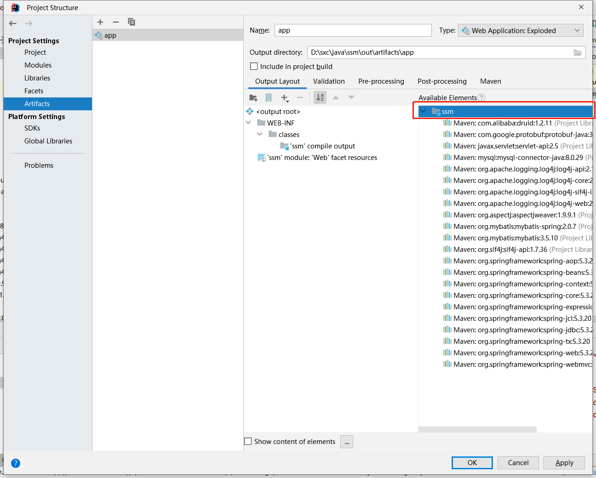
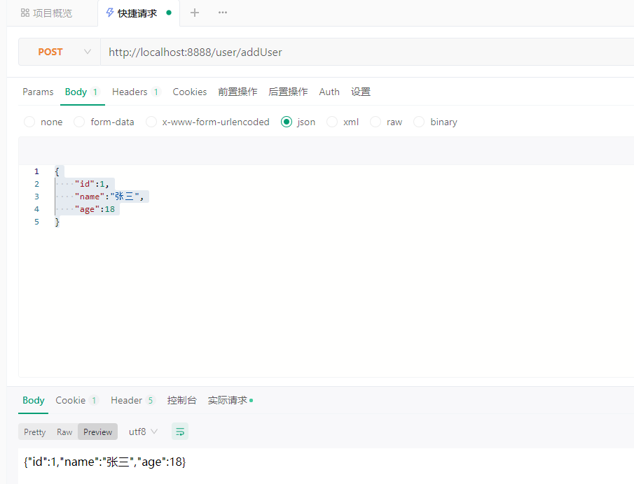
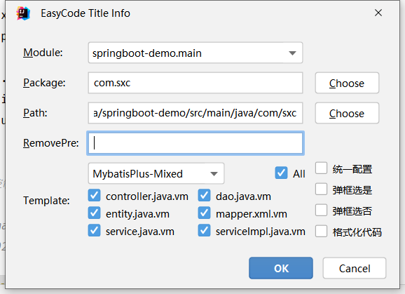

# JavaWeb

## 最原始的服务器

```java
public class Demo {
    public static void main(String[] args) throws IOException {
        ServerSocket serverSocket = new ServerSocket(8888);
        //阻塞 等待连接
        Socket socket = serverSocket.accept();

        // 输入流 读取数据
        InputStream inputStream = socket.getInputStream();
        byte[] bytes = new byte[8192];
        int len;
        while (inputStream.available() > 0) {
            len = inputStream.read(bytes);
            System.out.print(new String(bytes, 0, len));
        }
        // 输出流 回发数据
        OutputStream outputStream = socket.getOutputStream();
        // 按照http协议的格式封装一个报文
        String response = "HTTP/1.1 200 OK\r\n" +
                "Content-Length: 39\r\n" +
                "Content-Type: text/html;charset=UTF-8\r\n\r\n" +
                "<h1 style=\"color:red\">hello server!<h1>";
        outputStream.write(response.getBytes());
        outputStream.flush();
        //不要关闭，关闭会导致服务器断开
    }
}
```

浏览器输入http://localhost:8888/ 访问，会在控制台输出访问的HTTP信息,且在页面显示hello server!

```
GET / HTTP/1.1
Host: localhost:8888
Connection: keep-alive
...
```

## Servlet

Servlet 是基于 Jakarta 技术的 Web 组件，由容器管理，可生成动态内容

servlet 是独立于平台的 Java 类；容器，有时也称为 servlet 引擎

Servlet 通过 servlet 容器实现的请求/响应范式与 Web 客户端交互

### Servlet 容器

Servlet 容器是 Web 服务器或应用程序服务器的一部分，它提供发送请求和响应的网络服务、解码基于 MIME 的请求以及格式化基于 MIME 的响应。Servlet 容器还通过其生命周期包含和管理 Servlet。

### 流程图


这里的通过request的url属性拿到对应的Servlet对象，是在Servlet静态代码块初始化好url对应Servlet的map容器,然后通过url拿到Servlet，就是个多态

然后那些静态代码块初始化可以写在配置文件通过Propertiesload到代码块中

### Servlet的生命周期

- init()：Servlet进行初始化；
- service()：Servlet处理客户端的请求；
- destroy()：Servlet结束，释放资源；

### 声明周期注解

就是个钩子函数

@PostConstruct和@PreDestory

执行顺序
- @PostConstruct
- init()
- service()
- destroy()
- @PreDestory


## 创建一个普通的web工程

- File --> New --> Project --> 输入项目名称webProjectName，语言选择Java

- 项目根目录下新建文件夹webapp（存放静态资源文件）--> webapp下新建WEB-INF -->复制tomcat目录下的web.xml，并清除根节点里面的所有内容

- File --> Project Structue(项目构建) --> Facts(特性) --> Web(添加一个web特性)

- Module --> 重新配置Deployment Descriotors web.xml路径 D:\sxc\java\www\webProjectName\webapp\WEB-INF\web.xml  --> 重新配置WebRsoucre静态文件根目录 D:\sxc\java\www\webProjectName\webapp

- Artifacts --> 新建一个Web Application:expolode(可以热更新的不压缩的，另外一个是压缩的不能热更新) -->Form Modules --> 随便改个名字webProjectName

- Add Configuration --> Tomcat Server --> Local --> 随便改个名字 tomcat10 --> 配置Application server --> No artifacts marked for deployment --> Fix(配置部署) --> On 'Update' action 和 On frame deactivation配置为Update classes and resources

## webxml

直接全局搜索web.xml，配置都分开写了

```xml
<?xml version="1.0" encoding="UTF-8"?>
<web-app xmlns="https://jakarta.ee/xml/ns/jakartaee"
         xmlns:xsi="http://www.w3.org/2001/XMLSchema-instance"
         xsi:schemaLocation="https://jakarta.ee/xml/ns/jakartaee
                      https://jakarta.ee/xml/ns/jakartaee/web-app_5_0.xsd"
         version="5.0"
         metadata-complete="false">
    <!--metadata-complete="false" 配置false会扫描注解-->
    <servlet>
        <!--名称-->
        <servlet-name>HelloServlet</servlet-name>
        <!--路径-->
        <servlet-class>com.sxc.servlet.HelloServlet</servlet-class>
        <!--当前servlet参数-->
        <init-param>
            <param-name>DbName</param-name>
            <param-value>dbname</param-value>
        </init-param>
        <!--启动时加载-->
        <load-on-startup>1</load-on-startup>
    </servlet>
    <!--多个servlet-->
    <servlet>
        <servlet-name>OtherServlet</servlet-name>
        <servlet-class>com.sxc.servlet.OtherServlet</servlet-class>
    </servlet>
    <!--servlet对应url的映射关系-->
    <servlet-mapping>
        <servlet-name>HelloServlet</servlet-name>
        <!--精确匹配-->
        <url-pattern>/HelloServlet</url-pattern>
    </servlet-mapping>
    <servlet-mapping>
        <servlet-name>OtherServlet</servlet-name>
        <url-pattern>/OtherServlet</url-pattern>
    </servlet-mapping>
    <!--全局的参数-->
    <context-param>
        <param-name>GlobalName</param-name>
        <param-value>GlobalValue</param-value>
    </context-param>
    <!--filter过滤器-->
    <filter>
        <filter-name>MyHttpFilter</filter-name>
        <filter-class>com.sxc.filter.MyHttpFilter</filter-class>
    </filter>
    <!--filter过滤器映射-->
    <filter-mapping>
        <filter-name>MyHttpFilter</filter-name>
        <url-pattern>/*</url-pattern>
    </filter-mapping>
    <!--listener监听器-->
    <listener>
        <listener-class>com.sxc.listener.RequestListener</listener-class>
    </listener>
    <!--欢迎页配置-->
    <welcome-file-list>
        <welcome-file>index.jsp</welcome-file>
        <welcome-file>index.html</welcome-file>
    </welcome-file-list>
    <!--错误页面配置-->
    <error-page>
        <error-code>404</error-code>
        <location>/404.html</location>
    </error-page>
    <!--异常页面配置-->
    <error-page>
        <exception-type>java.lang.Exception</exception-type>
        <location>/exception.html</location>
    </error-page>
</web-app>
```

## 添加Servlet

导入tomcat/lib/servlet-api.jar 到webapp/lib目录下

### 新建Servlet

src目录下新建HelloServlet.java 下面的要重写声明周期方法

```java
package com.sxc.servlet;

import jakarta.servlet.*;

import java.io.IOException;
import java.io.PrintWriter;

public class HelloServlet implements Servlet {
    @Override
    public void init(ServletConfig servletConfig) throws ServletException {
        System.out.println("servlet初始化");
    }

    @Override
    public ServletConfig getServletConfig() {
        return null;
    }

    @Override
    public void service(ServletRequest servletRequest, ServletResponse servletResponse) throws ServletException, IOException {
        PrintWriter writer = servletResponse.getWriter();
        writer.println("hello servlet");
        writer.println(servletRequest);
        writer.println(servletResponse);
        writer.flush();
    }

    @Override
    public String getServletInfo() {
        return null;
    }

    @Override
    public void destroy() {
        System.out.println("servlet销毁");
    }
}
```

简化 GenericServlet 已经帮我做了实现Servlet的接口并提供了一个service抽象方法

```java
package com.sxc.servlet;

import jakarta.servlet.*;

import java.io.IOException;
import java.io.PrintWriter;

public class HelloServlet extends GenericServlet {

    @Override
    public void service(ServletRequest servletRequest, ServletResponse servletResponse) throws IOException {
        PrintWriter writer = servletResponse.getWriter();
        writer.println("hello servlet2");
        writer.println(servletRequest);
        writer.println(servletResponse);
        writer.flush();
    }
}
```

继续简化，可以处理指定的resultFul接口 测试使用 FeHelper的简易Postman

```java
package com.sxc.servlet;

import jakarta.servlet.ServletException;
import jakarta.servlet.http.HttpServlet;
import jakarta.servlet.http.HttpServletRequest;
import jakarta.servlet.http.HttpServletResponse;

import java.io.IOException;
import java.io.PrintWriter;

public class HelloServlet extends HttpServlet {
    @Override
    protected void doGet(HttpServletRequest req, HttpServletResponse resp) throws IOException {
        PrintWriter writer = resp.getWriter();
        writer.println("servlet get");
        writer.flush();
        //注释下面方法
        //super.doGet(req, resp);
    }

    @Override
    protected void doPost(HttpServletRequest req, HttpServletResponse resp) throws ServletException, IOException {
        PrintWriter writer = resp.getWriter();
        writer.println("servlet post");
        writer.flush();
    }

    @Override
    protected void doPut(HttpServletRequest req, HttpServletResponse resp) throws ServletException, IOException {
        PrintWriter writer = resp.getWriter();
        writer.println("servlet put");
        writer.flush();
    }

    @Override
    protected void doDelete(HttpServletRequest req, HttpServletResponse resp) throws ServletException, IOException {
        PrintWriter writer = resp.getWriter();
        writer.println("servlet delete");
        writer.flush();
    }
}
```

### 注册一个Servlet到容器当中

web.xml alt+insert快速添加servlet,之后访问http://localhost:8888/webProjectName/HelloServlet

```xml
<?xml version="1.0" encoding="UTF-8"?>
<web-app xmlns="https://jakarta.ee/xml/ns/jakartaee"
         xmlns:xsi="http://www.w3.org/2001/XMLSchema-instance"
         xsi:schemaLocation="https://jakarta.ee/xml/ns/jakartaee
                      https://jakarta.ee/xml/ns/jakartaee/web-app_5_0.xsd"
         version="5.0"
         metadata-complete="true">
    <servlet>
        <!--名称-->
        <servlet-name>HelloServlet</servlet-name>
        <!--路径-->
        <servlet-class>com.sxc.servlet.HelloServlet</servlet-class>
    </servlet>
    <!--servlet对应url的映射关系-->
    <servlet-mapping>
        <servlet-name>HelloServlet</servlet-name>
        <url-pattern>/HelloServlet</url-pattern>
    </servlet-mapping>
</web-app>
```

### URL路由匹配

web.xml

```xml
<?xml version="1.0" encoding="UTF-8"?>
<web-app xmlns="https://jakarta.ee/xml/ns/jakartaee"
         xmlns:xsi="http://www.w3.org/2001/XMLSchema-instance"
         xsi:schemaLocation="https://jakarta.ee/xml/ns/jakartaee
                      https://jakarta.ee/xml/ns/jakartaee/web-app_5_0.xsd"
         version="5.0"
         metadata-complete="true">
    <servlet>
        <!--名称-->
        <servlet-name>HelloServlet</servlet-name>
        <!--路径-->
        <servlet-class>com.sxc.servlet.HelloServlet</servlet-class>
    </servlet>
    <!--servlet对应url的映射关系-->
    <servlet-mapping>
        <servlet-name>HelloServlet</servlet-name>
        <!--精确匹配-->
        <url-pattern>/HelloServlet</url-pattern>
        <!--路径匹配 按长短匹配 先匹配长的-->
        <url-pattern>/HelloServlet/a/b</url-pattern>
        <url-pattern>/HelloServlet/a</url-pattern>
        <!--通配符匹配以HelloServlet开头-->
        <url-pattern>/HelloServlet/*</url-pattern>
        <!--扩展名匹配，只能加扩展名-->
        <url-pattern>*.exe</url-pattern>
        <!--默认匹配，任意都会匹配到这个-->
        <url-pattern>/</url-pattern>
    </servlet-mapping>
</web-app>
```

### 获取servlet里的配置

web.xml

```xml
<servlet>
    <servlet-name>HelloServlet</servlet-name>
    <servlet-class>com.sxc.servlet.HelloServlet</servlet-class>
    <!--参数-->
    <init-param>
        <param-name>DbName</param-name>
        <param-value>dbname</param-value>
    </init-param>
</servlet>
```

获取

```java
public class HelloServlet extends HttpServlet {
    @Override
    protected void doGet(HttpServletRequest req, HttpServletResponse resp) {
        System.out.println(getInitParameter("DbName"));
    }
}
```

### 配置文件里全局读取

任意一个Servlet都可以读取

web.xml

```xml
<context-param>
    <param-name>GlobalName</param-name>
    <param-value>GlobalValue</param-value>
</context-param>
```

获取

```java
public class HelloServlet extends HttpServlet {
    @Override
    protected void doGet(HttpServletRequest req, HttpServletResponse resp) {
        ServletContext servletContext = getServletContext();
        //getInitParameter 获取当前Servlet配置； servletContext.getInitParameter获取全局的配置
        System.out.println(servletContext.getInitParameter("GlobalName"));//GlobalValue
        //不要用下面这个，无法输出
        System.out.println(getInitParameter("GlobalName"));//null
    }
}
```

### 加载优先级

load-on-startup标签可以设置servlet的加载优先级别和容器是否在启动时加载该servlet,正数的值越小，启动时加载该servlet的优先级越高

```xml
<servlet>
    <load-on-startup>1</load-on-startup>
</servlet>
```

### 使用注解配置Servlet

web.xml

```xml
<web-app xmlns="https://jakarta.ee/xml/ns/jakartaee"
         xmlns:xsi="http://www.w3.org/2001/XMLSchema-instance"
         xsi:schemaLocation="https://jakarta.ee/xml/ns/jakartaee
                      https://jakarta.ee/xml/ns/jakartaee/web-app_5_0.xsd"
         version="5.0"
         metadata-complete="false">
         <!-- metadata-complete需要配置为false -->
</web-app>
```

```java
@WebServlet(
        //名称
        name = "HelloServlet",
        //url访问地址
        urlPatterns = {"/HelloServlet"},//用value也一样
        //启动时加载
        loadOnStartup = 1,
        //当前servlet初始化参数
        initParams = {
                @WebInitParam(
                        name = "DbName",
                        value = "dbname"
                )
        }
)
public class HelloServlet extends HttpServlet {
    @Override
    protected void doGet(HttpServletRequest req, HttpServletResponse resp) throws ServletException, IOException {
        System.out.println("hello");
    }
}
```


## 请求HttpServletRequest

HttpServletRequest

### 常用方法

```java
package com.sxc.servlet;

import jakarta.servlet.http.HttpServlet;
import jakarta.servlet.http.HttpServletRequest;
import jakarta.servlet.http.HttpServletResponse;

import java.io.IOException;
import java.io.PrintWriter;
import java.util.Arrays;
import java.util.Enumeration;
import java.util.Map;

public class HelloServlet extends HttpServlet {
    @Override
    protected void doGet(HttpServletRequest req, HttpServletResponse resp) throws IOException {
        PrintWriter writer = resp.getWriter();
        writer.println("servlet get");
        writer.flush();

        //获取参数
        Map<String, String[]> parameterMap = req.getParameterMap();
        for (Map.Entry<String, String[]> stringEntry : parameterMap.entrySet()) {
            System.out.println(stringEntry.getKey() + ":" + Arrays.toString(stringEntry.getValue()));
        }

        //项目根目录
        System.out.println(req.getContextPath());// /webProjectName
        //servlet路径
        System.out.println(req.getServletPath());// /HelloServlet
        //请求的方法
        System.out.println(req.getMethod());//GET
        //查询的参数
        System.out.println(req.getQueryString());//id=3&&name=4
        //访问的URL
        System.out.println(req.getRequestURI());// /webProjectName/HelloServlet
        System.out.println(req.getRequestURL());// http://localhost:8888/webProjectName/HelloServlet
        //远程主机
        System.out.println(req.getRemoteHost());// 0:0:0:0:0:0:0:1
        //访问的ip
        System.out.println(req.getRemoteAddr());// 0:0:0:0:0:0:0:1
        //协议
        System.out.println(req.getScheme());//http

        //头部信息
        System.out.println(req.getHeader("Content-Type"));
        //所有头部名称
        Enumeration<String> headerNames = req.getHeaderNames();
        while (headerNames.hasMoreElements()) {
            String s = headerNames.nextElement();
            System.out.println(s + ":" + req.getHeader(s));
        }
    }
}
```

### 请求转发

web.xml新增一个OtherServlet

```xml
    <servlet>
        <servlet-name>OtherServlet</servlet-name>
        <servlet-class>com.sxc.servlet.OtherServlet</servlet-class>
    </servlet>
    <servlet-mapping>
        <servlet-name>OtherServlet</servlet-name>
        <url-pattern>/OtherServlet</url-pattern>
    </servlet-mapping>
```


```java
public class HelloServlet extends HttpServlet {
    @Override
    protected void doGet(HttpServletRequest req, HttpServletResponse resp) throws IOException, ServletException {
        //转发
        RequestDispatcher requestDispatcher = req.getRequestDispatcher("/OtherServlet");
        requestDispatcher.forward(req, resp);
    }
}
```

```java
public class OtherServlet extends HttpServlet {
    @Override
    protected void doGet(HttpServletRequest req, HttpServletResponse resp) throws IOException {
        System.out.println("OtherServlet");
    }
}
```

### 在各个转发中共享数据

该方法称之为域方法。。。

```java
public class HelloServlet extends HttpServlet {
    @Override
    protected void doGet(HttpServletRequest req, HttpServletResponse resp) throws IOException, ServletException {
        RequestDispatcher requestDispatcher = req.getRequestDispatcher("/OtherServlet");
        //该方法可以在多个Servlet中共享
        req.setAttribute("access_token","abcd");
        requestDispatcher.forward(req, resp);
    }
}
```

```java
public class OtherServlet extends HttpServlet {
    @Override
    protected void doGet(HttpServletRequest req, HttpServletResponse resp) throws IOException {
        System.out.println(req.getAttribute("access_token"));
    }
}
```

### 整个应用里共享数据

ServletContext叫做Application域,关闭浏览器也不会消失

设置

```java
public class HelloServlet extends HttpServlet {
    @Override
    protected void doGet(HttpServletRequest req, HttpServletResponse resp) {
        ServletContext servletContext = req.getServletContext();
        //该方法可以在整个应用中共享数据
        servletContext.setAttribute("globalValue", "abcd");
    }
}
```

读取

```java
public class OtherServlet extends HttpServlet {
    @Override
    protected void doGet(HttpServletRequest req, HttpServletResponse resp) {
        ServletContext servletContext = req.getServletContext();
        System.out.println(servletContext.getAttribute("globalValue"));
    }
}
```

## 响应

### 响应流类型

```java
PrintWriter out = response.getWriter();//获取字符流，处理字符；
ServletOutputStream out = response.getOutputStream();//获取字节流，处理文件；
```

tips:getWriter 会有一个缓冲区大小为8KB 如果要立即刷新缓冲区 使用flushBuffer()

### 响应中文字符乱码

```java
public class HelloServlet extends HttpServlet {
    @Override
    protected void doGet(HttpServletRequest req, HttpServletResponse resp) throws IOException {
        resp.setCharacterEncoding("GBK");
        PrintWriter writer = resp.getWriter();
        writer.println("hello中文字符");
        writer.flush();
    }
}
```

优化

```java
public class HelloServlet extends HttpServlet {
    @Override
    protected void doGet(HttpServletRequest req, HttpServletResponse resp) throws IOException {
        resp.setContentType("text/html;charset=UTF-8");
        //文本
        //resp.setContentType("text/plain;charset=UTF-8");
        //json
        //resp.setContentType("application/json;charset=UTF-8");
        PrintWriter writer = resp.getWriter();
        writer.println("hello中文字符");
        writer.flush();
    }
}
```

### 设置响应头

```java
public class HelloServlet extends HttpServlet {
    @Override
    protected void doGet(HttpServletRequest req, HttpServletResponse resp) throws IOException {
        resp.setContentType("text/html;charset=UTF-8");
        resp.setHeader("token","abcd");
        PrintWriter writer = resp.getWriter();
        writer.println("hello");
        writer.flush();
    }
}
```

### 重定向

```java
public class HelloServlet extends HttpServlet {
    @Override
    protected void doGet(HttpServletRequest req, HttpServletResponse resp) throws IOException {
        resp.sendRedirect("https://www.baidu.com");
    }
}
```

## Cookie

```java
public class HelloServlet extends HttpServlet {
    @Override
    protected void doGet(HttpServletRequest req, HttpServletResponse resp) throws IOException {
        resp.setContentType("text/html;charset=UTF-8");
        //创建Cookie
        Cookie cookie = new Cookie("jseesion", UUID.randomUUID().toString());
        //设置过期时间 s 小于0 就是关闭浏览器就失效 0是立即失效(ps失效了浏览器会自动删除这个cookie)
        cookie.setMaxAge(10);
        //添加到响应头就是 addHeader("Set-Cookie","xxx")
        resp.addCookie(cookie);
        PrintWriter writer = resp.getWriter();
        writer.println("hello");
        writer.flush();
    }
}
```

## Session

服务器端第一次调用getSession()的时候会创建；(保存在服务器内存中),应该和php中session_start()一个道理

第一次调用会在请求里添加Set-Cookie

```
Set-Cookie: JSESSIONID=F186609E35A640E7B308F74CA2DB5D99; Path=/webProjectName; HttpOnly
```

### 配置

web.xml配置失效时间

```xml
<session-config>
    <!-- 30 minute -->
    <session-timeout>30</session-timeout>
</session-config>
```

### 存储

```java
public class HelloServlet extends HttpServlet {
    @Override
    protected void doGet(HttpServletRequest req, HttpServletResponse resp) throws IOException {
        resp.setContentType("text/html;charset=UTF-8");
        //启用session true,如果没有session则创建
        HttpSession session = req.getSession(true);
        //往里面存东西取东西就可以了
        session.setAttribute("userId","9999");
        PrintWriter writer = resp.getWriter();
        writer.println("hello");
        writer.flush();
    }
}
```

### 读取

```java
public class OtherServlet extends HttpServlet {
    @Override
    protected void doGet(HttpServletRequest req, HttpServletResponse resp) throws IOException {
        //获取session
        HttpSession session = req.getSession(true);
        if (session != null){
            System.out.println(session.getAttribute("userId"));
        }
    }
}
```

### 解决session浏览器关闭失效

自带的session设置的cookie是-1 关闭浏览器即失效

```java
public class HelloServlet extends HttpServlet {
    @Override
    protected void doGet(HttpServletRequest req, HttpServletResponse resp) throws IOException {
        resp.setContentType("text/html;charset=UTF-8");
        //启用session true,如果没有session则创建
        HttpSession session = req.getSession(true);
        //手动创建JSESSIONID Cookie JSESSIONID=F186609E35A640E7B308F74CA2DB5D99; Path=/webProjectName; HttpOnly 会返回2个Set-Cookie
        Cookie cookie = new Cookie("JSESSIONID", session.getId());
        //设置过期时间非常大
        cookie.setMaxAge(Integer.MAX_VALUE);
        cookie.setHttpOnly(true);
        cookie.setPath(req.getContextPath());

        resp.addCookie(cookie);
        PrintWriter writer = resp.getWriter();
        writer.println("hello");
        writer.flush();
    }
}
```

## JSP

本质就是转成servlet 使用resp.getWriter()拼接输出

了解一下，他的标签不用学

### 案例

```java
<%@ page contentType="text/html;charset=UTF-8" language="java" %>
<html>
<head>
    <title>Title</title>
</head>
<body>
<%-- <%!可以放在servic方法外面 --%>
<%!
    public static String name = "JSP";

    static {
        System.out.println("static block");
    }

    public static void fun() {
        System.out.println("static fun");
    }
%>
<%
    System.out.println("hello");
    int count = 30;
    System.out.println(name);
    fun();
%>
<h1><%=count%>
</h1>
<%--全局域--%>
${applicationScope}
<%--session域--%>
${sessionScope}
<%--当前servlet--%>
${pageScope}
<%--请求域--%>
${requestScope}
</body>
</html>
```

### 本质

Servlet处理请求存放到request中，然后通过转发到jsp页面去显示数据

```java
public class HelloServlet extends HttpServlet {
    @Override
    protected void doGet(HttpServletRequest req, HttpServletResponse resp) throws ServletException, IOException {
        //转发
        RequestDispatcher requestDispatcher = req.getRequestDispatcher("/home.jsp");
        requestDispatcher.forward(req, resp);
    }
}
```

### 配置错误页面

web.xml

```xml
<error-page>
    <error-code>404</error-code>
    <location>/pages/404.jsp</location>
</error-page>

<error-page>
    <exception-type>java.lang.Exception</exception-type>
    <location>/pages/err.jsp</location>
</error-page>
```

### 配置首页

web.xml

```xml
<welcome-file-list>
    <welcome-file>index.jsp</welcome-file>
    <welcome-file>index.html</welcome-file>
</welcome-file-list>
```


## Filter

使用场景，字符集设置，权限认证

过滤器 启动服务器时即加载

每个Filter顺序执行，执行完毕逆向放行，先进后出

### 配置

web.xml

```xml
<filter>
    <filter-name>MyHttpFilter</filter-name>
    <filter-class>com.sxc.filter.MyHttpFilter</filter-class>
</filter>

<filter-mapping>
    <filter-name>MyHttpFilter</filter-name>
        <!-- /*是全部匹配了 -->
    <url-pattern>/*</url-pattern>
</filter-mapping>
```

### 使用案例

拦截http请求

MyHttpFilter.java

```java
public class MyHttpFilter extends jakarta.servlet.http.HttpFilter {
    @Override
    protected void doFilter(HttpServletRequest request, HttpServletResponse response, FilterChain chain) throws IOException, ServletException {
        //对request方法进行过滤，假如只允许POST请求
        if (!request.getMethod().equals("POST")) {
            System.out.println("不是POST方法不放行");
            return;
        }
        //下面那个doFilter的作用是放行的意思，就是过滤通过了
        super.doFilter(request, response, chain);//就是执行了chain.doFilter()
    }
}
```

HelloServlet.java

```java
public class HelloServlet extends HttpServlet {
    @Override
    protected void doGet(HttpServletRequest req, HttpServletResponse resp) {
        System.out.println("永远进不来");
    }

    @Override
    protected void doPost(HttpServletRequest req, HttpServletResponse resp) {
        System.out.println("放行了");
    }
}
```

### 使用注解配置filter

注意web.xml需要开启扫描

```xml
metadata-complete="false"
```

```java
@WebFilter(filterName = "MyHttpFilter", urlPatterns = {"/*"})
public class MyHttpFilter extends jakarta.servlet.http.HttpFilter {
    @Override
    protected void doFilter(HttpServletRequest request, HttpServletResponse response, FilterChain chain) throws IOException, ServletException {
        //对request方法进行过滤，假如只允许POST请求
        if (!request.getMethod().equals("POST")) {
            System.out.println("不是POST方法不放行");
            return;
        }
        //下面那个doFilter的作用是放行的意思，就是过滤通过了
        super.doFilter(request, response, chain);//就是执行了chain.doFilter()
    }
}
```

## Listener

监听器，用于监听各种类启动时，创建时，触发回调函数，类似于button.onclick = function(){} ...

继承EventListener的有很多如ServletRequestListener（每次请求监听），HttpSessionListener（session创建监听），ServletContextListener（应用创建监听，做初始化工作）等，具体ctrl+h EventListener查看


### 配置

web.xml

```xml
<listener>
    <listener-class>com.sxc.listener.RequestListener</listener-class>
</listener>
```

### 使用案例

监听网站访问

```java
public class RequestListener implements ServletRequestListener {
    /**
     * @param sre 事件绑定的对象 就是servlet对象
     */
    @Override
    public void requestInitialized(ServletRequestEvent sre) {
        //Servlet每初始化一次，说明URL被访问一次
        ServletContext servletContext = sre.getServletContext();
        Object visitCount = servletContext.getAttribute("visitCount");
        if (visitCount == null) {
            visitCount = 0;
        }
        servletContext.setAttribute("visitCount", (Integer) (visitCount) + 1);
        System.out.println("访问了" + visitCount);
        ServletRequestListener.super.requestInitialized(sre);
    }
}
```

### 使用注解配置Listener

注意web.xml需要开启扫描

```xml
metadata-complete="false"
```

```java
@WebListener
public class RequestListener implements ServletRequestListener {
    /**
     * @param sre 事件绑定的对象 就是servlet对象
     */
    @Override
    public void requestInitialized(ServletRequestEvent sre) {
        //Servlet每初始化一次，说明URL被访问一次
        ServletContext servletContext = sre.getServletContext();
        Object visitCount = servletContext.getAttribute("visitCount");
        if (visitCount == null) {
            visitCount = 0;
        }
        servletContext.setAttribute("visitCount", (Integer) (visitCount) + 1);
        System.out.println("访问了" + visitCount);
        ServletRequestListener.super.requestInitialized(sre);
    }
}
```

## JNDI全局配置

### 创建

可以配置数据源，一些全局的常量，比较解耦。目录是webapp/META-INF/context.xml,手动创建，或者自动生成

- File --> Project Structue(项目构建) --> Facts(特性) --> Deployment Descriptors --> Add Application Server specific descriptor --> 选择tomcat server

### 配置

context.xml

```xml
<?xml version="1.0" encoding="UTF-8"?>
<Context path="/">
    <!--数据源-->
    <Resource name="dataSource/mysql"
              auth="Container"
              type="javax.sql.DataSource"
              driverClassName="com.mysql.jdbc.Driver"
              url="jdbc:mysql://127.0.0.1:3306/dbname??useSSL=false;rewriteBatchedStatements=true;characterEncoding=utf-8;serverTimezone=Asia/Shanghai;"
              username="root" password=""
              maxTotal="20" maxIdle="10"
              maxWaitMillis="10000"/>
</Context>
```

然后在webapp/lib下面导入mysql-connector-java-5.1.47.jar下载地址见JDBC

### 使用

```java
public class HelloServlet extends HttpServlet {
    @Override
    protected void doGet(HttpServletRequest req, HttpServletResponse resp) {
        Context ctx;
        try {
            //初始化Context
            ctx = new InitialContext();
            //获取mysql连接
            DataSource dataSource = (DataSource) ctx.lookup("java:comp/env/dataSource/mysql");
            Connection connection = dataSource.getConnection();
            System.out.println(connection);//53913482, URL=jdbc:mysql://127.0.0.1:3306/dbname??useSSL=false;rewriteBatchedStatements=true;characterEncoding=utf-8;serverTimezone=Asia/Shanghai, MySQL Connector Java
        } catch (NamingException | SQLException e) {
            throw new RuntimeException(e);
        }
    }
}
```

### 在webxml中定义

也可以在web.xml中定义基础数据类型

```xml
<!--基础数据类型-->
<env-entry>
    <env-entry-name>config/baseUrl</env-entry-name>
    <env-entry-type>java.lang.String</env-entry-type>
    <env-entry-value>D://www/</env-entry-value>
</env-entry>
```

使用

```java
public class HelloServlet extends HttpServlet {
    @Override
    protected void doGet(HttpServletRequest req, HttpServletResponse resp) {
        Context ctx;
        try {
            //初始化Context
            ctx = new InitialContext();
            //获取全局常量
            String baseUrl = (String) ctx.lookup("java:comp/env/config/baseUrl");
            System.out.println(baseUrl);//D://www/
        } catch (NamingException e) {
            throw new RuntimeException(e);
        }
    }
}
```

### 使用注解引入资源

前提是导入tomcat/lib目录下的annotations-api.jar

然后使用import jakarta.annotation.Resource;

```java
@WebServlet(
        //名称
        name = "HelloServlet",
        //url访问地址
        urlPatterns = {"/HelloServlet"},//用value也一样
        //启动时加载
        loadOnStartup = 1
)
public class HelloServlet extends HttpServlet {

    @Resource(lookup = "java:comp/env/config/baseUrl")
    String baseUrl;

    @Override
    protected void doGet(HttpServletRequest req, HttpServletResponse resp) {
        System.out.println(baseUrl);//D://www/
    }
}
```

## 文件上传

在webapp下新建一个upload.html

```html
<!DOCTYPE html>
<html lang="en">
<head>
    <meta charset="UTF-8">
    <title>Title</title>
</head>
<body>
    <form action="/webProjectName/UploadServlet" enctype="multipart/form-data" method="post">
        <input type="file" name="filename">
        <input type="submit" value="提交">
    </form>
</body>
</html>
```

处理文件上传需要多部分的注解@MultipartConfig

```java
@WebServlet("/UploadServlet")
@MultipartConfig
public class UploadServlet extends HttpServlet {

    @Override
    protected void doPost(HttpServletRequest req, HttpServletResponse resp) {
        BufferedInputStream bufferedInputStream = null;
        BufferedOutputStream bufferedOutputStream = null;
        ByteArrayOutputStream byteArrayOutputStream;
        try {
            //获取文件对象
            Part filename = req.getPart("filename");
            String submittedFileName = filename.getSubmittedFileName();
            InputStream inputStream = filename.getInputStream();
            bufferedInputStream = new BufferedInputStream(inputStream);

            // 文件输出流用于保存文件
            bufferedOutputStream = new BufferedOutputStream(new FileOutputStream("D://sxc/java/www/webProjectName/webapp/" + submittedFileName, true));

            // 字节数组流 存储文件
            byteArrayOutputStream = new ByteArrayOutputStream();
            byte[] bytes = new byte[1024 * 1024];
            int len;
            while ((len = bufferedInputStream.read(bytes)) != -1) {
                byteArrayOutputStream.write(bytes, 0, len);
            }
            // 写入文件流
            bufferedOutputStream.write(byteArrayOutputStream.toByteArray());
            bufferedOutputStream.flush();
            System.out.println("完成");
        } catch (IOException | ServletException e) {
            throw new RuntimeException(e);
        } finally {
            try {
                if (bufferedInputStream != null)
                    bufferedInputStream.close();
                if (bufferedOutputStream != null)
                    bufferedOutputStream.close();
                if (bufferedOutputStream != null)
                    bufferedOutputStream.close();
            } catch (IOException e) {
                e.printStackTrace();
            }
        }
    }
}
```

## JSON解析

使用[fastjson](https://github.com/alibaba/fastjson/)

## 打包

### 构建

- Artifacts --> 新建一个Web Application:Archive -->Form Modules --> 随便改个名字webProjectNameWar
- Build --> Build Artifacts

修改配置文件

servel.xml

```xml
<!-- 注释旧的测试的那个，新增appBase为webapps，因为这是tomcat目录下的文件夹名称... -->
<Host name="localhost"  appBase="webapps"
    unpackWARs="true" autoDeploy="true">
<Valve className="org.apache.catalina.valves.AccessLogValve" directory="logs"
        prefix="localhost_access_log" suffix=".txt"
        pattern="%h %l %u %t &quot;%r&quot; %s %b" />
</Host>
```

然后把打包后的war文件放入D:\sxc\tomcat\apache-tomcat-10.0.22\webapps

然后命令行运行startup启动tomcat

访问http://localhost:8888/webProjectNameWar/


# 工具类

## 高并发测试方法

自己封装了一下

```java
//用于并发模拟n个用户同时执行一个方法
public class ThreadConcurrentUtil {

    //用接口的方式 用内部类或lambda实现这个方法
    interface ThreadConcurrentInterface {
        public void fn();
    }

    //该对象可以阻塞线程
    private CyclicBarrier cyclicBarrier = null;
    //并发数
    private int n = 0;

    /**
     * @param n 并发数
     */
    public ThreadConcurrentUtil(int n) {
        this.n = n;
        cyclicBarrier = new CyclicBarrier(n);
    }

    /**
     * 并发测试方法
     *
     * @param tThreadConcurrentInterface 用内部类或lambda实现这个方法
     */
    public void test(ThreadConcurrentInterface tThreadConcurrentInterface) {
        ArrayList<Thread> list = new ArrayList<>();
        for (int i = 0; i < n; i++) {
            Thread thread = new Thread(new Runnable() {
                @Override
                public void run() {
                    System.out.println("线程开始时间：" + System.currentTimeMillis());
                    //线程等待
                    try {
                        cyclicBarrier.await();
                    } catch (InterruptedException | BrokenBarrierException e) {
                        e.printStackTrace();
                    }
                    tThreadConcurrentInterface.fn();
                }
            });
            list.add(thread);
        }
        for (Thread t : list) {
            t.start();
        }
        try {
            Thread.sleep(300);
        } catch (InterruptedException e) {
            e.printStackTrace();
        }
    }

    /**
     * 使用方法
     *
     * @param args
     */
    public static void main(String[] args) {
        new ThreadConcurrentUtil(10).test(new ThreadConcurrentInterface() {
            @Override
            public void fn() {
                System.out.println("这里写是实际的测试内容");
            }
        });
    }
}
```

也可以用线程池

```java
import java.util.concurrent.*;

public class Demo {
    public static void main(String[] args) {
        Runnable runnable = () -> {
            System.out.println("线程开始时间：" + System.currentTimeMillis());
            try {
                Thread.sleep(1000);
            } catch (InterruptedException e) {
                e.printStackTrace();
            }
        };

        ExecutorService pools = Executors.newFixedThreadPool(1000);
        //最大就70个，i大于70就异常
        for (int i = 0; i < 700; i++) {
            pools.submit(runnable);
        }
    }
}
```

## 读取xml

[dom4j](https://dom4j.github.io/)

示例xml

只要知道Element就是标签，获取标签名称用.getName(),获取标签innerHtml用.getText();Attribute就是属性，获取属性值用.getValue()

```xml
<?xml version="1.0" encoding="UTF-8" ?>
<app>
    <!--第一种是配置在属性里面的-->
    <dataSource>
        <properties name="dbnameAttribute" value="dbnameValue"/>
        <properties name="userAttribute" value="userValue"/>
        <properties name="passwordAttribute" value="passwordValue"/>
    </dataSource>
    <!--第二种是配置在innerHtml里面-->
    <config>
        <baseUrl>http://127.0.0.1</baseUrl>
        <port>8080</port>
    </config>
    <!--第三种名称在标签上值在innerHtml-->
    <dataSource2>
        <properties name="dbnameAttribute">dbnameValue</properties>
        <properties name="userAttribute">userValue</properties>
        <properties name="passwordAttribute">passwordValue</properties>
    </dataSource2>
    <!--第四种双重循环-->
    <configs>
        <config>
            <baseUrl>http://127.0.0.1</baseUrl>
            <port>8080</port>
        </config>
        <config>
            <baseUrl>http://127.0.0.2</baseUrl>
            <port>8888</port>
        </config>
    </configs>
</app>
```

```java
public class Demo {
    public static void main(String[] args) throws IOException, DocumentException {
        //需要的URL对象
        URL resource = Demo.class.getClassLoader().getResource("web.xml");
        SAXReader reader = new SAXReader();
        Document document = reader.read(resource);
        //拿到xml根节点
        Element rootElement = document.getRootElement();
        /*---------------------第一种--------------------*/
        //拿到需要的节点
        Element dataSource = rootElement.element("dataSource");
        //遍历节点
        Iterator<Element> elementIterator = dataSource.elementIterator();
        while (elementIterator.hasNext()) {
            //拿到节点
            Element element = elementIterator.next();
            //获取节点属性
            Attribute nameAttribute = element.attribute("name");
            Attribute valueAttribute = element.attribute("value");
            //获取属性值
            System.out.println(nameAttribute.getValue() + ":" + valueAttribute.getValue());
        }
        /*---------------------第二种--------------------*/
        //拿到需要的节点
        dataSource = rootElement.element("config");
        //遍历节点
        elementIterator = dataSource.elementIterator();
        while (elementIterator.hasNext()) {
            //拿到节点
            Element element = elementIterator.next();
            //拿到值
            System.out.println(element.getName() + ":" + element.getText());
        }
        /*---------------------第三种--------------------*/
        //拿到需要的节点
        dataSource = rootElement.element("dataSource2");
        //遍历节点
        elementIterator = dataSource.elementIterator();
        while (elementIterator.hasNext()) {
            //拿到节点
            Element element = elementIterator.next();
            //获取属性
            Attribute nameAttribute = element.attribute("name");
            //拿到值
            System.out.println(nameAttribute.getValue() + ":" + element.getText());
        }
        /*---------------------第四种--------------------*/
        //拿到需要的节点
        dataSource = rootElement.element("configs");
        //遍历节点
        elementIterator = dataSource.elementIterator();
        while (elementIterator.hasNext()) {
            //拿到节点 config
            Element element = elementIterator.next();
            //拿到子节点值
            String baseUrl = element.element("baseUrl").getText();
            String port = element.element("port").getText();
            //拿到值
            System.out.println(baseUrl + ":" + port);
        }
    }
}
```

# 经典解决方案

## ThreadLocal

**线程本地变量**

底层保存一个ThreadLocalMap key是当前线程（Thread.currentThread()） value是实际保存的值

解决每个线程需要独享一个对象,或者是每个线程需要有一个全局变量的时候
（静态变量会导致每个线程共用一个变量，可以用synchronized解决，但是不够完美；另外如果在线程里每次调用方法就创建一个对象，内存开销太大，所以这个时候就需要每个线程有一个隔离的属于自己的静态变量）

一般在连接池优化上会使用到ThreadLocal，在多线程获取连接池时，会有同步操作，影响性能。如果使用ThreadLocal，每个线程使用自己的独立连接，性能会有一定的提升

使用案例见**DAO事务操作**，同一个线程中，多个模型类事务操作，需要使用同一个连接


# JDBC

基础的JDBC看看就行

需要将mysql-connector-java.jar包导入,mysql5.7可以直接用8.0版本的，也支持

[下载地址](https://dev.mysql.com/downloads/connector/j/) 选择Platform Independent

## 步骤

db.properties文件内容见 *写入配置文件加载(推荐)*

1. 注册驱动，加载Driver类
2. 获取连接，得到Connection
3. 执行sql
4. 释放资源

```java
import java.io.*;
import java.sql.*;
import java.util.Properties;

public class Demo {
    public static void main(String[] args) throws SQLException, IOException, ClassNotFoundException {
        //新建Properties对象
        Properties properties = new Properties();
        //获取文件输入流
        BufferedInputStream bufferedInputStream = new BufferedInputStream(new FileInputStream("db.properties"));
        //加载输入流到properties对象
        properties.load(bufferedInputStream);
        //加载Driver时自动完成注册
        Class.forName(properties.getProperty("driver"));
        //得到连接
        Connection connection = DriverManager.getConnection(properties.getProperty("url"), properties.getProperty("user"), properties.getProperty("password"));
        //执行sql statement.execute 返回值不代表执行成功或失败，如果执行的是查询语句，返回的是ResultSet则返回true，其他查询或更新语句返回false
        Statement statement = connection.createStatement();
        int i = statement.executeUpdate("INSERT INTO `user` (name,age) VALUES ('张四',4)");
        if (i > 0) {
            System.out.println("新增一条数据");
        }
        ResultSet resultSet = statement.executeQuery("SELECT * FROM `user`");
        while (resultSet.next()) {
            int id = resultSet.getInt(1);
            String name = resultSet.getString(2);
            int age = resultSet.getInt(3);
            System.out.println(id + "\t" + name + "\t" + age);
        }
        //关闭连接
        resultSet.close();
        statement.close();
        connection.close();
        //关闭流
        bufferedInputStream.close();
    }
}
```

## 连接方式

### 原始方式

```java
import com.mysql.jdbc.Driver;

import java.sql.Connection;
import java.sql.SQLException;
import java.util.Properties;

public class Demo {
    public static void main(String[] args) throws SQLException {
        //得到驱动
        Driver driver = new Driver();
        //得到连接
        Properties properties = new Properties();
        properties.put("user", "root");
        properties.put("password", "");
        Connection connection = driver.connect("jdbc:mysql://localhost:3307/dbname?useSSL=false&&rewriteBatchedStatements=true&&characterEncoding=utf-8&&serverTimezone=Asia/Shanghai", properties);
        //关闭连接
        connection.close();
    }
}
```

### 反射方式

```java
import com.mysql.jdbc.Driver;

import java.lang.reflect.InvocationTargetException;
import java.sql.Connection;
import java.sql.SQLException;
import java.util.Properties;

public class Demo {
    public static void main(String[] args) throws SQLException, ClassNotFoundException, IllegalAccessException, InstantiationException, NoSuchMethodException, InvocationTargetException {
        //得到驱动
        Class<?> aClass = Class.forName("com.mysql.jdbc.Driver");
        Driver driver = (Driver) aClass.getConstructor().newInstance();
        //得到连接
        Properties properties = new Properties();
        properties.put("user", "root");
        properties.put("password", "");
        Connection connection = driver.connect("jdbc:mysql://localhost:3307/dbname?useSSL=false&&rewriteBatchedStatements=true&&characterEncoding=utf-8&&serverTimezone=Asia/Shanghai", properties);
        //关闭连接
        connection.close();
    }
}
```

### DriverManager方式

```java
import com.mysql.jdbc.Driver;

import java.sql.Connection;
import java.sql.DriverManager;
import java.sql.SQLException;

public class Demo {
    public static void main(String[] args) throws SQLException, ClassNotFoundException, IllegalAccessException, InstantiationException {
        //得到驱动
        Class<?> aClass = Class.forName("com.mysql.jdbc.Driver");
        Driver driver = (Driver) aClass.newInstance();
        //注册驱动
        DriverManager.registerDriver(driver);
        //得到连接
        Connection connection = DriverManager.getConnection("jdbc:mysql://localhost:3307/dbname?useSSL=false&&rewriteBatchedStatements=true&&characterEncoding=utf-8&&serverTimezone=Asia/Shanghai", "root", "");
        //关闭连接
        connection.close();
    }
}
```

### 加载Driver时自动完成注册

```java
import java.sql.Connection;
import java.sql.DriverManager;
import java.sql.SQLException;

public class Demo {
    public static void main(String[] args) throws SQLException, ClassNotFoundException {
        //加载Driver时自动完成注册
        Class.forName("com.mysql.jdbc.Driver");
        //得到连接
        Connection connection = DriverManager.getConnection("jdbc:mysql://localhost:3307/dbname?useSSL=false&&rewriteBatchedStatements=true&&characterEncoding=utf-8&&serverTimezone=Asia/Shanghai", "root", "");
        //关闭连接
        connection.close();
    }
}
```

### 全自动加载

```java
import java.sql.Connection;
import java.sql.DriverManager;
import java.sql.SQLException;

public class Demo {
    public static void main(String[] args) throws SQLException {
        //在mysql-connector-java.jar/META-INF/services/java.sql.Driver自动注册了，所以不加载都可以
        //得到连接
        Connection connection = DriverManager.getConnection("jdbc:mysql://localhost:3307/dbname?useSSL=false&&rewriteBatchedStatements=true&&characterEncoding=utf-8&&serverTimezone=Asia/Shanghai", "root", "");
        //关闭连接
        connection.close();
    }
}
```

### 写入配置文件加载(推荐)

db.properties

```properties
user=root
password=
url=jdbc:mysql://localhost:3307/dbname?useSSL=false&&rewriteBatchedStatements=true&&characterEncoding=utf-8&&serverTimezone=Asia/Shanghai
driver=com.mysql.jdbc.Driver
```

tips:useSSL 去除mysql高版本ssl警告；rewriteBatchedStatements 使用批处理功能；characterEncoding 编码格式

```java
import java.io.*;
import java.sql.Connection;
import java.sql.DriverManager;
import java.sql.SQLException;
import java.util.Properties;

public class Demo {
    public static void main(String[] args) throws SQLException, IOException, ClassNotFoundException {
        //新建Properties对象
        Properties properties = new Properties();
        //获取文件输入流
        BufferedInputStream bufferedInputStream = new BufferedInputStream(new FileInputStream("db.properties"));
        //加载输入流到properties对象
        properties.load(bufferedInputStream);
        //加载Driver时自动完成注册
        Class.forName(properties.getProperty("driver"));
        //得到连接
        Connection connection = DriverManager.getConnection(properties.getProperty("url"), properties.getProperty("user"), properties.getProperty("password"));
        //关闭连接
        connection.close();
        //关闭流
        bufferedInputStream.close();
    }
}
```

## 预处理

PreparedStatement 效率高，不存在sql注入风险

因为Statement存在sql注入风险，所以不用

```java
import java.io.*;
import java.sql.*;
import java.util.Properties;

public class Demo {
    public static void main(String[] args) throws SQLException, IOException, ClassNotFoundException {
        //新建Properties对象
        Properties properties = new Properties();
        //获取文件输入流
        BufferedInputStream bufferedInputStream = new BufferedInputStream(new FileInputStream("db.properties"));
        //加载输入流到properties对象
        properties.load(bufferedInputStream);
        //加载Driver时自动完成注册
        Class.forName(properties.getProperty("driver"));
        //得到连接
        Connection connection = DriverManager.getConnection(properties.getProperty("url"), properties.getProperty("user"), properties.getProperty("password"));
        //预处理sql
        PreparedStatement preparedStatement = connection.prepareStatement("SELECT * FROM `user` where id = ?");
        //设置 占位符？处的值 注意这里的参数顺序从1开始，第二个表示参数值
        //或者作为对象设置setObject(1, 2)也可以
        preparedStatement.setInt(1, 2);
        //执行sql查询 其他增删改使用executeUpdate
        ResultSet resultSet = preparedStatement.executeQuery();
        while (resultSet.next()) {
            int id = resultSet.getInt(1);//也可以改成resultSet.getInt("id") 或者 Object id = resultSet.getObject("id")
            String name = resultSet.getString(2);
            int age = resultSet.getInt(3);
            System.out.println(id + "\t" + name + "\t" + age);//2	李四	1
        }
        //关闭连接
        resultSet.close();
        preparedStatement.close();
        connection.close();
        //关闭流
        bufferedInputStream.close();
    }
}
```

## 封装工具类及调用

JDBCUtil

```java
import java.io.BufferedInputStream;
import java.io.FileInputStream;
import java.sql.*;
import java.util.Properties;

public class JDBCUtil {
    //url
    private static String url;
    //用户名
    private static String user;
    //密码
    private static String password;

    //静态代码块只会加载一次
    static {
        //新建Properties对象
        Properties properties = new Properties();
        try {
            //获取文件输入流
            BufferedInputStream bufferedInputStream = new BufferedInputStream(new FileInputStream("db.properties"));
            //加载输入流到properties对象
            properties.load(bufferedInputStream);
            //加载Driver时自动完成注册
            Class.forName(properties.getProperty("driver"));
            url = properties.getProperty("url");
            user = properties.getProperty("user");
            password = properties.getProperty("password");
            //关闭流
            bufferedInputStream.close();
        } catch (Exception e) {
            //本来这里抛出的是编译异常，现在转成运行异常，在运行阶段通过jvm抛出异常，调用者也可以手动处理该异常
            throw new RuntimeException(e);
        }
    }

    /**
     * 获取连接
     *
     * @return
     */
    public static Connection getConnection() {
        try {
            return DriverManager.getConnection(url, user, password);
        } catch (SQLException e) {
            throw new RuntimeException(e);
        }
    }

    /**
     * 关闭并释放资源
     *
     * @param resultSet         结果集
     * @param preparedStatement 预处理
     * @param connection        连接
     */
    public static void close(ResultSet resultSet, PreparedStatement preparedStatement, Connection connection) {
        //关闭连接
        try {
            if (resultSet != null) {
                //关闭结果集释放资源
                resultSet.close();
            }
            if (preparedStatement != null) {
                //关闭预处理释放资源
                preparedStatement.close();
            }
            if (connection != null) {
                //关闭连接释放资源 这里是真的关闭连接
                connection.close();
            }
        } catch (SQLException e) {
            e.printStackTrace();
        }
    }
}
```

调用

```java
import java.sql.*;

public class Demo {
    public static void main(String[] args) throws SQLException {
        //得到连接
        Connection connection = JDBCUtil.getConnection();
        //预处理sql
        PreparedStatement preparedStatement = connection.prepareStatement("SELECT * FROM `user` where id = ?");
        preparedStatement.setInt(1, 2);
        //执行sql查询 其他增删改使用executeUpdate
        ResultSet resultSet = preparedStatement.executeQuery();
        while (resultSet.next()) {
            int id = resultSet.getInt("id");
            String name = resultSet.getString("name");
            int age = resultSet.getInt("age");
            System.out.println(id + "\t" + name + "\t" + age);//2	李四	1
        }
        //关闭连接
        JDBCUtil.close(resultSet, preparedStatement, connection);
    }
}
```

## 事务

```java
import java.sql.*;

public class Demo {
    public static void main(String[] args) throws SQLException {
        //得到连接
        Connection connection = JDBCUtil.getConnection();
        //设置为不提交,相当于开启事务
        connection.setAutoCommit(false);
        //预处理sql
        PreparedStatement preparedStatement = connection.prepareStatement("UPDATE `user` SET name=?,age = ? WHERE name = ? AND age = ?");
        preparedStatement.setString(1, "李五");
        preparedStatement.setInt(2, 4);
        preparedStatement.setString(3, "李四");
        preparedStatement.setInt(4, 2);
        //将上面这条语句改为下面这条就不会执行成功,且抛出异常
        //preparedStatement.setString(4, "二");
        try {
            //执行sql
            int i = preparedStatement.executeUpdate();
            //提交事务
            connection.commit();
            if (i > 0) {
                System.out.println("更新成功");
            }
        } catch (Exception e) {
            connection.rollback();
            throw new RuntimeException(e);
        }
        //关闭连接
        JDBCUtil.close(null, preparedStatement, connection);
    }
}
```

## sql批处理

批量处理减少网络开销和编译次数，提高效率；

tips:事务和批处理的区别，事务在数据库层执行，消耗数据库内存；批处理在客户端层执行，消耗客户端内存。测试过批量添加50W条数据比事务快6.8倍，如果可以选择批处理更好。

```java
import java.sql.*;

public class Demo {
    public static void main(String[] args) throws SQLException {
        //得到连接
        Connection connection = JDBCUtil.getConnection();
        //预处理sql
        PreparedStatement preparedStatement = connection.prepareStatement("INSERT INTO `user` (name,age) VALUES (?,?)");
        //添加批处理
        for (int i = 0; i < 10; i++) {
            preparedStatement.setString(1, "张三");
            preparedStatement.setInt(2, i);
            preparedStatement.addBatch();
        }
        //执行sql批处理
        preparedStatement.executeBatch();
        //清空sql批处理
        preparedStatement.clearBatch();
        //关闭连接
        JDBCUtil.close(null, preparedStatement, connection);
    }
}
```

## 连接池

**c3p0**

[下载地址](https://sourceforge.net/projects/c3p0/?source=navbar) 直接下载即可 [官网](https://www.mchange.com/projects/c3p0/)

下载并将c3p0-0.9.5.5.jar包和mchange-commons-java-0.2.19.jar包添加到项目

使用代码设置来连接

```java

import com.mchange.v2.c3p0.ComboPooledDataSource;

import java.io.BufferedInputStream;
import java.io.FileInputStream;
import java.util.Properties;
import java.sql.*;

public class Demo {
    public static void main(String[] args) throws Exception {
        //创建数据源对象
        ComboPooledDataSource comboPooledDataSource = new ComboPooledDataSource();
        //新建Properties对象
        Properties properties = new Properties();
        //获取文件输入流
        BufferedInputStream bufferedInputStream = new BufferedInputStream(new FileInputStream("db.properties"));
        //加载输入流到properties对象
        properties.load(bufferedInputStream);
        //关闭流
        bufferedInputStream.close();
        //设置驱动
        comboPooledDataSource.setDriverClass(properties.getProperty("driver"));
        //设置协议
        comboPooledDataSource.setJdbcUrl(properties.getProperty("url"));
        //设置用户名
        comboPooledDataSource.setUser(properties.getProperty("user"));
        //设置密码
        comboPooledDataSource.setPassword(properties.getProperty("password"));
        //初始化连接池数量
        comboPooledDataSource.setInitialPoolSize(10);
        //设置最大连接数
        comboPooledDataSource.setMaxPoolSize(50);
        //得到连接 这里会打印一堆log信息，暂时不管他
        Connection connection = comboPooledDataSource.getConnection();
        //关闭
        connection.close();
    }
}
```

使用配置文件

配置文件必须命名为c3p0-config.xml

```xml
<?xml version="1.0" encoding="UTF-8"?>
<c3p0-config>
    <!-- 默认配置，只可以出现一次 -->
    <default-config>
        <property name="driverClass">com.mysql.jdbc.Driver</property>
        <property name="jdbcUrl">
            <![CDATA[jdbc:mysql://localhost:3307/dbname?useSSL=false&&rewriteBatchedStatements=true&&characterEncoding=utf-8&&serverTimezone=Asia/Shanghai]]>
        </property>
        <property name="user">root</property>
        <property name="password"></property>
        <!--每次增长连接数-->
        <property name="acquireIncrement">3</property>
        <!--初始化连接数-->
        <property name="initialPoolSize">3</property>
        <!--最大连接数-->
        <property name="maxPoolSize">15</property>
        <!--最小连接数-->
        <property name="minPoolSize">3</property>
        <!--可连接的最多命令对象数-->
        <property name="maxStatements">5</property>
        <!--每个连接对象可连接的最多命令对象数-->
        <property name="maxStatementsPerConnection">2</property>
    </default-config>
    <!-- 名称配置 -->
    <named-config name="dataSource">
        <property name="driverClass">com.mysql.jdbc.Driver</property>
        <property name="jdbcUrl">
            <![CDATA[jdbc:mysql://localhost:3307/dbname?useSSL=false&&rewriteBatchedStatements=true&&characterEncoding=utf-8&&serverTimezone=Asia/Shanghai]]>
        </property>
        <property name="user">root</property>
        <property name="password"></property>
        <!--每次增长连接数-->
        <property name="acquireIncrement">3</property>
        <!--初始化连接数-->
        <property name="initialPoolSize">3</property>
        <!--最大连接数-->
        <property name="maxPoolSize">15</property>
        <!--最小连接数-->
        <property name="minPoolSize">3</property>
        <!--可连接的最多命令对象数-->
        <property name="maxStatements">5</property>
        <!--每个连接对象可连接的最多命令对象数-->
        <property name="maxStatementsPerConnection">2</property>
    </named-config>
</c3p0-config>
```

使用

```java

import com.mchange.v2.c3p0.ComboPooledDataSource;

import java.sql.*;

public class Demo {
    public static void main(String[] args) throws SQLException {
        //创建数据源对象 使用默认配置的话可以省略dataSource
        ComboPooledDataSource comboPooledDataSource = new ComboPooledDataSource("dataSource");
        //得到连接 这里会打印一堆log信息，暂时不管他
        Connection connection = comboPooledDataSource.getConnection();
        //关闭
        connection.close();
    }
}
```

**druid**

阿里出品

[下载地址](https://repo1.maven.org/maven2/com/alibaba/druid/)

[文档](https://github.com/alibaba/druid/wiki/%E5%B8%B8%E8%A7%81%E9%97%AE%E9%A2%98)

[配置](https://github.com/alibaba/druid/wiki/DruidDataSource%E9%85%8D%E7%BD%AE) 他是xml配置的。改成.properities即可

druid.properties

```properties
#druid已经可以自动识别常用的驱动，可省略
driverClassName=com.mysql.jdbc.Driver
url=jdbc:mysql://localhost:3307/dbname?useSSL=false&&rewriteBatchedStatements=true&&characterEncoding=utf-8&&serverTimezone=Asia/Shanghai
username=root
password=
#初始化连接数
initialSize=3
#等待时间
maxWait=6000
#最大连接数
maxActive=20
#最小连接数
minIdle=1
```
连接

```java
import com.alibaba.druid.pool.DruidDataSourceFactory;

import javax.sql.DataSource;
import java.io.BufferedInputStream;
import java.io.FileInputStream;
import java.util.Properties;
import java.sql.*;

public class Demo {
    public static void main(String[] args) throws Exception {
        //新建Properties对象
        Properties properties = new Properties();
        //获取文件输入流
        BufferedInputStream bufferedInputStream = new BufferedInputStream(new FileInputStream("druid.properties"));
        //加载输入流到properties对象
        properties.load(bufferedInputStream);
        //关闭流
        bufferedInputStream.close();
        //使用properties创建
        DataSource dataSource = DruidDataSourceFactory.createDataSource(properties);
        //得到连接 同样也会有log信息
        Connection connection = dataSource.getConnection();
        //关闭
        connection.close();
    }
}
```

工具类

JDBCUtilByDruid

```java
import com.alibaba.druid.pool.DruidDataSourceFactory;

import javax.sql.DataSource;
import java.io.BufferedInputStream;
import java.io.FileInputStream;
import java.sql.Connection;
import java.sql.PreparedStatement;
import java.sql.ResultSet;
import java.sql.SQLException;
import java.util.Properties;

public class JDBCUtilByDruid {

    private static DataSource dataSource;

    //初始化数据源
    static {
        try {
            //新建Properties对象
            Properties properties = new Properties();
            //获取文件输入流
            BufferedInputStream bufferedInputStream = new BufferedInputStream(new FileInputStream("druid.properties"));
            //加载输入流到properties对象
            properties.load(bufferedInputStream);
            //关闭流
            bufferedInputStream.close();
            //使用properties创建
            dataSource = DruidDataSourceFactory.createDataSource(properties);
        } catch (Exception e) {
            throw new RuntimeException(e);
        }
    }

    /**
     * 得到连接
     *
     * @return
     */
    public static Connection getConnection() {
        //得到连接 同样也会有log信息
        try {
            return dataSource.getConnection();
        } catch (SQLException e) {
            throw new RuntimeException(e);
        }
    }

    /**
     * 关闭并释放资源
     *
     * @param resultSet         结果集
     * @param preparedStatement 预处理
     * @param connection        连接
     */
    public static void close(ResultSet resultSet, PreparedStatement preparedStatement, Connection connection) {
        //关闭连接
        try {
            if (resultSet != null) {
                //关闭结果集释放资源
                resultSet.close();
            }
            if (preparedStatement != null) {
                //关闭预处理释放资源
                preparedStatement.close();
            }
            if (connection != null) {
                //这里的关闭只是放回连接池，不是真正的关闭
                connection.close();
            }
        } catch (SQLException e) {
            throw new RuntimeException(e);
        }
    }
}
```

使用

```java
import java.sql.*;

public class Demo {
    public static void main(String[] args) throws Exception {
        //得到连接 同样也会有log信息
        Connection connection = JDBCUtilByDruid.getConnection();
        //关闭
        JDBCUtilByDruid.close(null, null, connection);
    }
}
```

## DBUtils

apache封装的工具类 数据库ORM

[下载](https://repo1.maven.org/maven2/commons-dbutils/commons-dbutils/)


使用DBUtils+JDBCUtilByDruid工具类

**entity(数据表实体类)**

如果是多表，则orm对象的属性就是多张表结合就可以了；如果是重名，则使用别名就可以了;名称可以改为类似UserAddress

```java
public class User implements Serializable {
    //明确定义，不然会导致序列化和反序列化的对象不一样
    private static final long serialVersionUID = 1L;
    private Integer id;
    private String name;
    private Integer age;

    //可以直接使用无参构造器拿到属性
    public User() {
    }

    public User(int id, String name, int age) {
        this.id = id;
        this.name = name;
        this.age = age;
    }

    public int getId() {
        return id;
    }

    public void setId(int id) {
        this.id = id;
    }

    public String getName() {
        return name;
    }

    public void setName(String name) {
        this.name = name;
    }

    public int getAge() {
        return age;
    }

    public void setAge(int age) {
        this.age = age;
    }
}
```

使用

```java
import org.apache.commons.dbutils.QueryRunner;
import org.apache.commons.dbutils.handlers.BeanHandler;
import org.apache.commons.dbutils.handlers.BeanListHandler;
import org.apache.commons.dbutils.handlers.ScalarHandler;

import java.sql.*;
import java.util.List;

public class Demo {
    public static void main(String[] args) throws Exception {
        //得到连接 同样也会有log信息
        Connection connection = JDBCUtilByDruid.getConnection();
        //查询生成器
        QueryRunner queryRunner = new QueryRunner();
        //查询结果集
        //new BeanListHandler 底层使用反射机制去获取属性(见反射 获取所有属性),然后放入User对象,最后将User对象放入ArrayList集合
        //1是给sql语句中的?赋值的
        List<User> query = queryRunner.query(connection, "SELECT * FROM `user` where id = ?", new BeanListHandler<>(User.class), 1);
        for (User user : query) {
            System.out.println(user.getId() + "\t" + user.getName() + "\t" + user.getAge());//1	张三	1
        }
        //查询单行
        User user = queryRunner.query(connection, "SELECT * FROM `user` where id = ?", new BeanHandler<>(User.class), 1);
        System.out.println(user.getId() + "\t" + user.getName() + "\t" + user.getAge());//1	张三	1
        //查询单列
        Object obj = queryRunner.query(connection, "SELECT name FROM `user` where id = ?", new ScalarHandler(), 1);
        System.out.println(obj);//张三
        //增删改
        int execute = queryRunner.execute(connection, "UPDATE `user` SET name=?,age = ? WHERE name = ? AND age = ?", "李五", 4, "李四", 2);
        if (execute > 0) {
            System.out.println("修改成功");
        }
        //关闭
        JDBCUtilByDruid.close(null, null, connection);
    }
}
```

自己来封装一把数据库ORM反射，User类和Druid工具类用的上面的

```java
import java.lang.reflect.Field;
import java.sql.Connection;
import java.sql.PreparedStatement;
import java.sql.ResultSet;
import java.util.ArrayList;

public class DbUtil {
    public static void main(String[] args) {
        //得到连接 同样也会有log信息
        Connection connection = JDBCUtilByDruid.getConnection();
        //查询结果集
        ArrayList<User> users = DbUtil.toArrayList(connection, "SELECT * FROM `user` where id = ?", User.class, 1);
        for (User user : users) {
            System.out.println(user.getId() + "\t" + user.getName() + "\t" + user.getAge());//1	张三	1
        }
        //关闭
        JDBCUtilByDruid.close(null, null, connection);
    }

    /**
     * 结果集转ArrayList
     *
     * @param connection 数据库连接
     * @param sql        数据库sql语句
     * @param type       Class对象
     * @param params     参数赋值
     * @param <T>        反射对象泛型
     * @return ArrayList
     */
    private static <T> ArrayList<T> toArrayList(Connection connection, String sql, Class<T> type, Object... params) {
        try {
            //预处理sql
            PreparedStatement preparedStatement = connection.prepareStatement(sql);
            for (int i = 0; i < params.length; i++) {
                preparedStatement.setObject(i + 1, params[i]);
            }
            //获取结果集
            ResultSet resultSet = preparedStatement.executeQuery();
            //通过反射对象获取所有属性
            Field[] declaredFields = type.getDeclaredFields();
            //构造字段名集合
            ArrayList<T> list = new ArrayList<>();
            //遍历结果集，存储到List
            while (resultSet.next()) {
                //循环放到每个字段上
                T bean = type.newInstance();
                for (Field declaredField : declaredFields) {
                    //反射爆破
                    declaredField.setAccessible(true);
                    //获取类型
                    Class<?> fieldType = declaredField.getType();
                    //判断类型 并向下转型
                    Object object = resultSet.getObject(declaredField.getName());
                    Class<?> aClass = object.getClass();
                    //这里数据库varchar查出来是java.lang.Long 类型
                    if (aClass == Long.class) {
                        declaredField.set(bean, Integer.parseInt(String.valueOf(object)));
                    } else {
                        declaredField.set(bean, String.valueOf(object));
                    }
                }
                list.add(bean);
            }
            resultSet.close();
            preparedStatement.close();
            return list;
        } catch (Exception e) {
            throw new RuntimeException(e);
        }
    }
}
```

## DAO

访问数据库数据的对象 data access object

意思一下Dao封装，就是把上面的连接，执行sql,关闭连接，再封装一下，作为数据层M的基类，相当于thinkphp Model基类

其他的表Model类基础这个Dao基类即可


```java
import org.apache.commons.dbutils.QueryRunner;
import org.apache.commons.dbutils.handlers.BeanListHandler;

import java.sql.Connection;
import java.sql.SQLException;
import java.util.List;

//model层基类
public class BasicDao<T> {
    private final QueryRunner queryRunner = new QueryRunner();

    /**
     * 查询结果集返回集合
     *
     * @param sql  sql语句
     * @param type Class类对象
     * @return List<T>
     */
    public List<T> queryList(String sql, Class<T> type, Object... params) {
        Connection connection = null;
        try {
            connection = JDBCUtilByDruid.getConnection();
            return queryRunner.query(connection, sql, new BeanListHandler<T>(type), params);
        } catch (SQLException e) {
            throw new RuntimeException(e);
        } finally {
            //关闭
            JDBCUtilByDruid.close(null, null, connection);
        }
    }
}
```

但是上面的类会有一个问题，如果要操作事务，不同的BasicDao子类（Model类），使用的connection不一样

同一事务多DAO共享同一connection，必须在一个共同的外部类中(BasicDao)使用threadLocal保存connection

```java
import org.apache.commons.dbutils.QueryRunner;
import org.apache.commons.dbutils.handlers.BeanListHandler;

import java.sql.Connection;
import java.sql.SQLException;
import java.util.List;

//model层基类
public class BasicDao<T> {
    //同一事务多DAO共享同一Connection，必须在一个共同的外部类中使用threadLocal保存Connection
    public static ThreadLocal<Connection> threadLocal = new ThreadLocal<>();
    //查询生成器
    private final QueryRunner queryRunner = new QueryRunner();

    /**
     * 获取threadLocal里保存的连接
     *
     * @return
     */
    public static Connection getConnection() {
        //从threadLocal拿，如果没有则设置一个
        Connection connection = threadLocal.get();
        if (connection == null) {
            connection = JDBCUtilByDruid.getConnection();
            threadLocal.set(connection);
        }
        return connection;
    }

    /**
     * 开启事务 不关闭连接
     */
    public static void startTransaction() {
        Connection connection = getConnection();
        try {
            connection.setAutoCommit(false);
        } catch (SQLException e) {
            throw new RuntimeException(e);
        }
    }

    /**
     * 事务提交
     */
    public static void commit() {
        Connection connection = getConnection();
        try {
            connection.commit();
        } catch (SQLException e) {
            throw new RuntimeException(e);
        }
    }

    /**
     * 事务回滚
     */
    public static void rollback() {
        Connection connection = getConnection();
        try {
            connection.rollback();
        } catch (SQLException e) {
            throw new RuntimeException(e);
        }
    }

    /**
     * 事务关闭
     */
    public static void closeTransaction() {
        Connection connection = getConnection();
        JDBCUtilByDruid.close(null, null, connection);
        //一次事务完成，可以释放这个threadLocal对象了
        threadLocal.remove();
    }


    /**
     * 查询结果集返回集合
     *
     * @param sql  sql语句
     * @param type Class类对象
     * @return List<T>
     */
    public List<T> queryList(String sql, Class<T> type, Object... params) {
        Connection connection = null;
        try {
            connection = JDBCUtilByDruid.getConnection();
            return queryRunner.query(connection, sql, new BeanListHandler<T>(type), params);
        } catch (SQLException e) {
            throw new RuntimeException(e);
        } finally {
            //关闭
            JDBCUtilByDruid.close(null, null, connection);
        }
    }

    /**
     * 普通insert方法
     *
     * @param sql
     * @param params
     * @return
     */
    public int insert(String sql, Object... params) {
        Connection connection = null;
        try {
            connection = JDBCUtilByDruid.getConnection();
            return queryRunner.update(connection, sql, params);
        } catch (SQLException e) {
            throw new RuntimeException(e);
        } finally {
            //关闭
            JDBCUtilByDruid.close(null, null, connection);
        }
    }

    /**
     * 事务insert方法
     *
     * @param sql
     * @param params
     * @return
     */
    public int insertByTransaction(String sql, Object... params) {
        Connection connection = null;
        try {
            //事务这里就需要拿threadLocal里的连接了并且不能关闭
            connection = getConnection();
            System.out.println(connection.hashCode());//来打印是否使用了同一个连接
            return queryRunner.update(connection, sql, params);
        } catch (SQLException e) {
            throw new RuntimeException(e);
        }
    }

    //测试
    public static void main(String[] args) {
        //开启事务
        BasicDao.startTransaction();

        //创建2个Dao来模拟不同的dao
        try {
            BasicDao<User> userBasicDao1 = new BasicDao<>();
            BasicDao<User> userBasicDao2 = new BasicDao<>();
            //下面如果用insert方法，打印出来的connection hashCode会不一样
            //并且这里第二条故意用错误的值插入，让第一条成功，第二条失败，可见第一条也回滚了
            //如果用insert方法第一条是不会回滚的 (ps:ThreadLocal牛叉)
            userBasicDao1.insert("INSERT INTO `user` (name,age) VALUES (?,?)", "张八", 1);
            userBasicDao2.insert("INSERT INTO `user` (name,age) VALUES (?,?)", "张八", "二");
            //事务提交
            BasicDao.commit();
        } catch (Exception e) {
            //事务回滚
            rollback();
            throw new RuntimeException(e);
        } finally {
            //关闭事务
            BasicDao.closeTransaction();
        }
    }
}
```

# tomcat

## 下载

[tomcat](https://tomcat.apache.org/download-10.cgi)

## 环境变量

### windows

系统变量新建 CATALINA_HOME 为tomcat根目录，然后添加Path为bin目录和lib目录，另外保证java的环境变量配置好

cmd->startup

tips:如果还启动不了，以管理员启动cmd

## 服务器配置文件

server.xml

```xml
<?xml version="1.0" encoding="UTF-8"?>
<!-- 服务器 port监听关闭的端口 -->
<Server port="8005" shutdown="SHUTDOWN">
  <Listener className="org.apache.catalina.startup.VersionLoggerListener" />
  <Listener className="org.apache.catalina.core.AprLifecycleListener" SSLEngine="on" />
  <Listener className="org.apache.catalina.core.JreMemoryLeakPreventionListener" />
  <Listener className="org.apache.catalina.mbeans.GlobalResourcesLifecycleListener" />
  <Listener className="org.apache.catalina.core.ThreadLocalLeakPreventionListener" />
  <GlobalNamingResources>
    <Resource name="UserDatabase" auth="Container"
              type="org.apache.catalina.UserDatabase"
              description="User database that can be updated and saved"
              factory="org.apache.catalina.users.MemoryUserDatabaseFactory"
              pathname="conf/tomcat-users.xml" />
  </GlobalNamingResources>
  <!-- 服务 可以有多个 -->
  <Service name="Catalina">
     <!-- 端口配置 可以有多个 用于创建socket服务器并进行监听，等待客户端连接 -->
    <Connector port="8888" protocol="HTTP/1.1"
               connectionTimeout="20000"
               redirectPort="8443" />
     <!-- 引擎只能有一个也叫容器，负责处理请求 -->
    <Engine name="Catalina" defaultHost="localhost">
      <Realm className="org.apache.catalina.realm.LockOutRealm">
        <Realm className="org.apache.catalina.realm.UserDatabaseRealm"
               resourceName="UserDatabase"/>
      </Realm>
      <!-- 应用 可以有多个 需要注意的是后面appBase是应用根目录，里面是放很多应用的，要显示index.html需要放在文件夹webapp(随意起名)，如果放在WEB-INF则需要请求转发才能访问
      然后访问www.test.com/webapp/index/html-->
     <Host name="www.test.com"  appBase="D://sxc/java/www2/"
            unpackWARs="true" autoDeploy="true">
        <Valve className="org.apache.catalina.valves.AccessLogValve" directory="logs"
               prefix="localhost_access_log" suffix=".txt"
               pattern="%h %l %u %t &quot;%r&quot; %s %b" />
      </Host>
      <Host name="localhost"  appBase="D://sxc/java/www/"
            unpackWARs="true" autoDeploy="true">
        <Valve className="org.apache.catalina.valves.AccessLogValve" directory="logs"
               prefix="localhost_access_log" suffix=".txt"
               pattern="%h %l %u %t &quot;%r&quot; %s %b" />
      </Host>
    </Engine>
  </Service>
</Server>
```

## 优化访问路径

### windows

以下修改server.xml

去除8080端口,8080改为80

```xml
<Connector port="80" protocol="HTTP/1.1"
               connectionTimeout="20000"
               redirectPort="8443" />
```

(暂时不对)去除项目名称，配置完需清空tomcat缓存，清空C:\Users\123456\AppData\Local\JetBrains\IntelliJIdea2022.1\tomcat\xxx\work\

```xml
<Host name="localhost"  appBase="D://sxc/java/www/"
            unpackWARs="true" autoDeploy="true">
        <!-- 添加下面这行 path代表没有目录  docBase就是项目名 reloadable 监视class文件改的热加载 debug是debug的level，0表示最低级别-->
        <!-- 下面如果是部署到tomcat目录下则这么设置 -->
        <Context path="/" docBase="webProjectNameWar" debug="0" reloadable="true"/>
        <Valve className="org.apache.catalina.valves.AccessLogValve" directory="logs"
               prefix="localhost_access_log" suffix=".txt"
               pattern="%h %l %u %t &quot;%r&quot; %s %b" />
      </Host>
```

### IDEA开始时隐藏项目名

点击Edit Configrations

DePloyment -->Application context 设置为 /


## IDEA启动控制台乱码

tomcat/conf/logging.properties

```java
java.util.logging.ConsoleHandler.encoding = UTF-8
改为
java.util.logging.ConsoleHandler.encoding = GBK
```

## IDEA配置tomcat热更新

1. tomcat运行配置需要热加载class 第二项配置donothing 失去焦点不要编译
2. 设置Setting-Build-Compiler-Build project automatically
3. tomcat必须debug模式启动
4. 修改代码手动update class and resource既可以,不要自动编译，会变卡

# Maven

- 可以自动下载jar包
- 构建项目自动化

[下载](https://maven.apache.org/)

## 环境变量

### windows

系统变量新建 MAVEN_HOME 为maven根目录，然后添加Path为bin目录 %MAVEN_HOME%/bin

## 配置

D:\sxc\apache-maven-3.8.6-bin\apache-maven-3.8.6\conf\setting.xml

```xml
<!-- 下载后的jar包存放目录 -->
<localRepository>D:\\sxc\maven_repository</localRepository>

...
<!-- 下载地址aliyun代理,建议配在pom.xml中 -->
<mirrors>
    <!-- 注释掉默认的 -->
    <mirror>
        <id>aliyunmaven</id>
        <mirrorOf>*</mirrorOf>
        <name>阿里云公共仓库</name>
        <url>https://maven.aliyun.com/repository/public</url>
    </mirror>
<mirrors>

...
<!-- 全局jdk版本,建议配在pom.xml中-->
<profiles>
    <profile>    
        <id>jdk-1.8</id>    
        <activation>    
            <activeByDefault>true</activeByDefault>    
            <jdk>1.8</jdk>    
        </activation>    
        <properties>    
            <maven.compiler.source>1.8</maven.compiler.source>    
            <maven.compiler.target>1.8</maven.compiler.target>    
            <maven.compiler.compilerVersion>1.8</maven.compiler.compilerVersion>    
        </properties>    
    </profile>
</profiles>
```

## 工程目录

```
src                                 
    |--main
        |--java         源代码目录
        |--resources    资源目录      
    |--test
        |--java         测试代码目录
        |--resources    测试资源目录
target
    |--classes      编译后的class文件目录
    |--test-classes 编译后的测试class文件目录
pom.xml             Maven工程配置文件
```

### pomxml

```xml
<?xml version="1.0" encoding="UTF-8"?>
<project xmlns="http://maven.apache.org/POM/4.0.0"
         xmlns:xsi="http://www.w3.org/2001/XMLSchema-instance"
         xsi:schemaLocation="http://maven.apache.org/POM/4.0.0     
         http://maven.apache.org/xsd/maven-4.0.0.xsd">

    <modelVersion>4.0.0</modelVersion>
    <!-- 项目唯一标识符 -->
    <artifactId>test</artifactId>
    <!-- 包名倒着来，因为二级域名的问题 org(公司组织名称) sxc(项目名称)-->
    <groupId>org.sxc</groupId>
    <!-- 版本 快照版 -->
    <version>1.0-SNAPSHOT</version>
    <!-- 打包后生产war(web)/jar(普通jar包)/pom（父子模块） 默认是jar -->
    <packaging>war</packaging>

    <!--依赖列表-->
    <dependencies>
        <!--加依赖-->
        <dependency>
            <!--组织id-->
            <groupId>mysql</groupId>
            <!--成品id-->
            <artifactId>mysql-connector-java</artifactId>
            <!--版本-->
            <version>5.1.49</version>
            <!--类似于npm provided已经提供的依赖只有开发时使用 compile全部依赖(默认) test测试时依赖 runtime 只有测试和运行时需要，开发时不需要-->
            <scope>provided</scope>

            <!--子模块是否继承父模块的依赖，如果不写则默认false(继承)，如果是true则子模块需要手动添加依赖-->
            <optional>false</optional>
            <!--下面的是用于在当前依赖所依赖的库中排除依赖，然后可以自己在外面加想要的依赖-->
            <exclustions>
                <exclustion>
                    <groupId>mysql</groupId>
                    <artifactId>mysql-connector-java</artifactId>
                </exclustion>
            </exclustions>
        </dependency>
    </dependencies>

    <properties>
        <!-- 控制版本变量也可以放在这里，然后使用这个变量 -->
        <mysql.connector.java.version>5.1.49</mysql.connector.java.version>
        <!-- 然后在依赖里使用${mysql.connector.java.version} -->

        <!-- jdk版本 还需要在在Build中配置编译插件 -->
        <maven.compiler.source>8</maven.compiler.source>
        <maven.compiler.target>8</maven.compiler.target>
        <!-- 添加编码，不然编译会有警告 -->
        <project.build.sourceEncoding>UTF-8</project.build.sourceEncoding>
    </properties>

    <!-- 下面是项目下的镜像配置 -->
    <repositories>
        <repository>
            <id>alimaven</id>
            <name>aliyun maven</name>
            <url>https://maven.aliyun.com/repository/public</url>
            <releases>
                <enabled>true</enabled>
            </releases>
            <snapshots>
                <enabled>false</enabled>
            </snapshots>
        </repository>
    </repositories>

    <!--下面是build配置，构建配置-->
    <build>
        <!-- 产生的构件的文件名，默认值是${artifactId}-${version}。 -->
        <sourceDirectory>${basedir}\src\main\java</sourceDirectory>
        <!--项目单元测试使用的源码目录，当测试项目的时候，构建系统会编译目录里的源码。该路径是相对于pom.xml的相对路径。 -->
        <outputDirectory>${basedir}\target\classes</outputDirectory>
        <!--被编译过的测试class文件存放的目录。 -->
        <testOutputDirectory>${basedir}\target\test-classes
        </testOutputDirectory>
        <!-- 以上配置都有默认值，就是约定好了目录就这么建 -->

        <!-- 如果要把xml等资源文件放在src/main下面则需要配下面这个 -->
        <resources>
            <resource>
                <directory>src/main/java</directory>
                <includes>
                    <include>**/*.properties</include>
                    <include>**/*.xml</include>
                </includes>
                <filtering>false</filtering>
            </resource>
            <resource>
                <directory>src/main/resources</directory>
                <includes>
                    <include>**/*.properties</include>
                    <include>**/*.xml</include>
                </includes>
                <filtering>false</filtering>
            </resource>
        </resources>

        <!--使用的插件列表 。 -->
        <plugins>
            <!-- Maven使用的jdk版本，不配置默认是1.5必须配置 -->
            <plugin>
                <groupId>org.apache.maven.plugins</groupId>
                <artifactId>maven-compiler-plugin</artifactId>
                <version>3.1</version>
                <configuration>
                    <source>${maven.compiler.source}</source> <!-- 源代码使用的JDK版本 -->
                    <target>${maven.compiler.target}</target> <!-- 需要生成的目标class文件的编译版本 -->
                    <encoding>${project.build.sourceEncoding}</encoding><!-- 字符集编码 -->
                </configuration>
            </plugin>
            <!-- tomcat插件 内嵌tomcat9服务器 -->
            <plugin>
                <groupId>org.opoo.maven</groupId>
                <artifactId>tomcat9-maven-plugin</artifactId>
                <version>3.0.1</version>
                <configuration>
                    <port>9002</port>
                    <uriEncoding>UTF-8</uriEncoding>
                    <!-- 访问路径 -->
                    <path>/</path>
                </configuration>
            </plugin>
            <!-- war包打包插件 -->
            <plugin>
                <groupId>org.apache.maven.plugins</groupId>
                <artifactId>maven-war-plugin</artifactId>
                <configuration>
                    <warName>test</warName>
                    <webResources>
                        <resource>
                            <directory>src/main/webapp/WEB-INF</directory>
                            <filtering>true</filtering>
                            <targetPath>WEB-INF</targetPath>
                            <includes>
                                <include>web.xml</include>
                            </includes>
                        </resource>
                    </webResources>
                </configuration>
            </plugin>
            <!-- jar包打包插件 -->
            <plugin>
                <groupId>org.apache.maven.plugins</groupId>
                <artifactId>maven-assembly-plugin</artifactId>
                <version>3.3.0</version>
                <executions>
                    <execution>
                        <id>make-assembly</id>
                        <!-- 绑定到package生命周期 -->
                        <phase>package</phase>
                        <goals>
                            <!-- 只运行一次 -->
                            <goal>single</goal>
                        </goals>
                    </execution>
                </executions>
                <configuration>
                    <archive>
                        <manifest>
                            <addClasspath>true</addClasspath>
                            <mainClass>com.sxc.Test</mainClass> <!-- 你的主类名 -->
                        </manifest>
                    </archive>
                    <descriptorRefs>
                        <descriptorRef>jar-with-dependencies</descriptorRef>
                    </descriptorRefs>
                </configuration>
            </plugin>
        </plugins>

        <!-- 后面的不常用 -->
        <!--单元测试相关的所有资源路径，配制方法与resources类似 -->
        <testResources>
            <testResource>
                <targetPath />
                <filtering />
                <directory />
                <includes />
                <excludes />
            </testResource>
        </testResources>

        <!--主要定义插件的共同元素、扩展元素集合，类似于dependencyManagement， -->
        <!--所有继承于此项目的子项目都能使用。该插件配置项直到被引用时才会被解析或绑定到生命周期。 -->
        <!--给定插件的任何本地配置都会覆盖这里的配置 -->
        <pluginManagement>
            <plugins>...</plugins>
        </pluginManagement>
    </build>

    <!--用于不同环境配置，可以把上面的配置都放在profile里面的-->
    <profiles>
        <profile>
            <id>dev</id>
            <build>
                <finalName>dev</finalName>
            </build>
        </profile>
        <profile>
            <id>test</id>
            <build>
                <finalName>test</finalName>
            </build>
        </profile>
        <profile>
            <!--激活当前环境，然后打包出来的就是pro.jar,只能激活一个环境-->
            <activation>
                <activeByDefault>true</activeByDefault>
            </activation>
            <id>pro</id>
            <build>
                <finalName>pro</finalName>
            </build>
        </profile>
    </profiles>
</project>
```

### 常用命令

| 命令                   | 说明                                                   |
| :--------------------- | :----------------------------------------------------- |
| mvn –v                 | 显示版本信息                                           |
| mvn clean              | 清理项目生产的临时文件,一般是模块下的target目录        |
| mvn compile            | 编译源代码，一般编译模块下的src/main/java目录          |
| mvn package            | 项目打包工具,会在模块下的target目录生成jar或war等文件  |
| mvn test               | 测试命令,或执行src/test/java/下junit的测试用例         |
| mvn install            | 将打包的jar/war文件复制到你的本地仓库中,供其他模块使用 |
| mvn deploy             | 将打包的文件发布到远程参考,提供其他人员进行下载依赖    |
| mvn site               | 生成项目相关信息的网站                                 |
| mvn dependency:tree    | 打印出项目的整个依赖树                                 |
| mvn archetype:generate | 创建Maven的普通java项目                                |
| mvn tomcat:run         | 在tomcat容器中运行web应用                              |

### 版本规范

所有的软件都用版本

Maven使用如下几个要素来定位一个项目，因此它们又称为项目的坐标。

- groudId 团体、组织的标识符。团体标识的约定是，它以创建这个项目的组织名称的逆向域名开头。一般对应着JAVA的包的结构，例如org.apache。
- artifactId 单独项目的唯一标识符。比如我们的tomcat, commons等。不要在artifactId中包含点号(.)。
- version 项目的版本。
- packaging 项目的类型，默认是jar，描述了项目打包后的输出。类型为jar的项目产生一个JAR文件，类型为war的项目产生一个web应用。

Maven在版本管理时候可以使用几个特殊的字符串 SNAPSHOT，LATEST，RELEASE。比如"1.0-SNAPSHOT"。各个部分的含义和处理逻辑如下说明：
  - SNAPSHOT 这个版本一般用于开发过程中，表示不稳定的版本。
  - LATEST 指某个特定构件的最新发布，这个发布可能是一个发布版，也可能是一个snapshot版，具体看哪个时间最后。
  - RELEASE 指最后一个发布版

## IDEA配置

File --> Settings --> Build --> BUild Tools --> Maven
    - Maven home path (配置为maven根目录D:/sxc/apache-maven-3.8.6-bin/apache-maven-3.8.6)
    - User settings file (配置为maven setting.xml目录 D:\sxc\apache-maven-3.8.6-bin\apache-maven-3.8.6\conf\settings.xml)
    - Local repository(配置为maven jar包下载存放目录 D:\sxc\maven_repository)
    - 记得勾上后面的Override（覆盖配置）

还有一个新建项目的配置和上面的配置一样

File --> New Project Step --> Setting for New Projects --> Build --> BUild Tools --> Maven

## 创建

idea2022.1创建Maven会卡死

需要关闭项目再NewProject --> New Project --> Name --> Language Java --> Build system Maven --> GroupId com.sxc 

## maven搜索

[网址1](http://mvn.coderead.cn/)

[网址2](https://search.maven.org/)

## 父子模块

先创建maven项目作为模块，然后New --> Modlue 创建子工程（注意选择他的parent模块）

父工程的pom.xml 的打包方式必须为pom,子工程可以使用父工程的依赖,父工程的src都可以删掉

parent pom.xml

```xml
...
    <!-- 父工程的的打包方式必须为pom -->
    <packaging>pom</packaging>
    <!-- 这是个模块关系 -->
    <modules>
        <module>test</module>
    </modules>
    <!-- 父工程统一管理版本 -->
    <dependencyManagement>
        <dependencies>
            <dependency>
                <groupId>xxx</groupId>
                <artifactId>xxx</artifactId>
                <version>1.0.0</version>
            </dependency>
        </dependencies>
    </dependencyManagement>
...
```

son pom.xml

```xml
...
    <!-- 假设子工程是一个web项目 -->
    <packaging>war</packaging>
    <!-- 这是个模块关系 -->
    <parent>
        <artifactId>maventest</artifactId>
        <groupId>com.sxc</groupId>
        <version>1.0-SNAPSHOT</version>
    </parent>

    <!-- 如果父工程dependencyManagement 已经有了则会使用他里面的版本，而不是最新版，不写version会使用最新版本 -->
    <dependencies>
        <dependency>
            <groupId>xxx</groupId>
            <artifactId>xxx</artifactId>
        </dependency>
    </dependencies>
...
```

## docker搭建maven本地服务器

```powershell
// 安装docker
yum install docker -y
// 启动
systemctl start docker
// 修改镜像路径 自己登陆阿里云-》 容器镜像服务 -》 镜像加速器 -》 centos 就可以了
sudo mkdir -p /etc/docker
sudo tee /etc/docker/daemon.json <<-'EOF'
{
  "registry-mirrors": ["https://jf8zmt.mirror.aliyuncs.com"]
}
EOF
sudo systemctl daemon-reload
sudo systemctl restart docker


docker run -d -p 8081:8081 --name nexus3 sonatype/nexus3

// 查看运行状态
docker container ls

// 开放端口
firewall-cmd --zone=public --add-port=8081/tcp --permanent
// 获取密码
docker exec -it nexus3 /bin/bash
cd nexus-data/
cat admin.password
```

# 常用jar包

| 包名                                                    | 说明                                                                      |
| :------------------------------------------------------ | :------------------------------------------------------------------------ |
| [commons-lang3](https://www.jianshu.com/p/89287d907b68) | 对java.lang的扩展 处理字符串日期等。使用xxxUtil.                          |
| lombok                                                  | lombok可以简化orm类的编写，不需要写setter/getter/构造函数，编译后自动加上 |

## lombok

IDEA需要安装Lombok插件，一般已经默认装好了

```java
//以下是LomBook的注解
@Data
@AllArgsConstructor
@NoArgsConstructor
@RequiredArgsConstructor //可以使带有@NonNull生成该参数的构造方法
@Builder//使用构建者模式
public class Response implements Serializable {
    private static final long serialVersionUID = 1L;

    @NonNull
    private String message;

    @NonNull
    private Integer code;

    private Object data;

    //调用Response.success();
    public static Response success() {
        return Response.builder().message("success").code(0).data(null).build();
    }

    public static Response success(Object data) {
        return Response.builder().message("success").code(0).data(data).build();
    }

    public static Response fail() {
        return Response.builder().message("fail").code(10001).data(null).build();
    }

    public static Response fail(Integer code) {
        return Response.builder().message("fail").code(code).data(null).build();
    }
}
```

# 日志

## JUL

java util logging 内置日志框架

### 案例

新建一个maven项目在src/test/java/新建TestJUL.java

pom.xml 引入单元测试junit

```xml
    <dependencies>
        <dependency>
            <groupId>junit</groupId>
            <artifactId>junit</artifactId>
            <version>4.13.2</version>
            <scope>test</scope>
        </dependency>
    </dependencies>
```


```java
import org.junit.Test;

import java.util.logging.*;

public class TestJUL {
    //获取一个jul日志对象
    public static final Logger LOGGER = Logger.getLogger("logger");

    @Test
    public void testJUL() {
        //去除jdk默认配置
        LOGGER.setUseParentHandlers(false);
        //获取一个控制台处理器
        ConsoleHandler consoleHandler = new ConsoleHandler();
        //设置格式化
        consoleHandler.setFormatter(new SimpleFormatter());
        //添加一个日志处理器
        LOGGER.addHandler(consoleHandler);
        //设置日志级别
        LOGGER.setLevel(Level.ALL);
        consoleHandler.setLevel(Level.ALL);
        //打印日志
        LOGGER.info("info");
        LOGGER.warning("waring");
        LOGGER.severe("deep waring");
        LOGGER.fine("success");
        /*六月 23, 2022 2:47:27 下午 TestJUL testJUL
        信息: info
        六月 23, 2022 2:47:27 下午 TestJUL testJUL
        警告: waring
        六月 23, 2022 2:47:27 下午 TestJUL testJUL
        严重: deep waring
        六月 23, 2022 2:47:27 下午 TestJUL testJUL
        详细: success*/
    }
}
```

### 写入文件

```java
public class TestJUL {
    //获取一个jul日志对象
    public static final Logger LOGGER = Logger.getLogger("logger");

    @Test
    public void testJUL() throws IOException {
        //去除jdk默认配置
        LOGGER.setUseParentHandlers(false);
        //获取一个文件处理器
        FileHandler fileHandler = new FileHandler("./log.txt", true);
        //设置格式化
        fileHandler.setFormatter(new SimpleFormatter());
        //添加一个日志处理器
        LOGGER.addHandler(fileHandler);
        //设置日志级别
        LOGGER.setLevel(Level.ALL);
        fileHandler.setLevel(Level.ALL);
        //打印日志
        LOGGER.info("info");
        LOGGER.warning("waring");
        LOGGER.severe("deep waring");
        LOGGER.fine("success");
        /*六月 23, 2022 2:47:27 下午 TestJUL testJUL
        信息: info
        六月 23, 2022 2:47:27 下午 TestJUL testJUL
        警告: waring
        六月 23, 2022 2:47:27 下午 TestJUL testJUL
        严重: deep waring
        六月 23, 2022 2:47:27 下午 TestJUL testJUL
        详细: success*/
    }
}
```

### 日志父子关系

日志底层维护了一个root manage

父日志继承root manage 子日志的设置会继承父日志

```java
import org.junit.Test;

import java.util.logging.*;

public class TestJUL {
    @Test
    public void testJUL() {
        Logger logger1 = Logger.getLogger("com.sxc.TestJUL");
        Logger logger2 = Logger.getLogger("com.sxc");
        // 一、对logger2进行独立的配置
        // 1.关闭系统默认配置
        logger2.setUseParentHandlers(false);
        // 2.创建handler对象
        ConsoleHandler consoleHandler = new ConsoleHandler();
        // 3.创建formatter对象
        SimpleFormatter simpleFormatter = new SimpleFormatter();
        // 4.进行关联
        consoleHandler.setFormatter(simpleFormatter);
        logger2.addHandler(consoleHandler);
        // 5.设置日志级别
        logger2.setLevel(Level.ALL);
        consoleHandler.setLevel(Level.ALL);
        // 测试logger1是否被logger2影响
        logger1.info("info");
        logger1.warning("waring");
        logger1.severe("deep waring");
        logger1.fine("success");
    }
}
```

### 自定义格式化

```java
public class TestJUL {
    //获取一个jul日志对象
    public static final Logger LOGGER = Logger.getLogger("logger");

    @Test
    public void testJUL() {
        //去除jdk默认配置
        LOGGER.setUseParentHandlers(false);
        //获取一个控制台处理器
        ConsoleHandler consoleHandler = new ConsoleHandler();
        //自定义设置格式化
        consoleHandler.setFormatter(new Formatter() {
            @Override
            public String format(LogRecord record) {
                return "等级:" + record.getLevel() + "消息:" + record.getMessage()
                        + "时间戳:" + record.getMillis() + "\r\n";
            }
        });
        //添加一个日志处理器
        LOGGER.addHandler(consoleHandler);
        //设置日志级别
        LOGGER.setLevel(Level.ALL);
        consoleHandler.setLevel(Level.ALL);
        //打印日志
        LOGGER.info("info");
        LOGGER.warning("waring");
        LOGGER.severe("deep waring");
        LOGGER.fine("success");
        // 等级:INFO消息:info时间:1655975264779
        // 等级:WARNING消息:waring时间:1655975264780
        // 等级:SEVERE消息:deep waring时间:1655975264780
        // 等级:FINE消息:success时间:1655975264780
    }
}
```

### 自定义日志配置文件

复制jdk/jre/lib/logging.properties存放到src/main/resource/logging.properties

修改下面的配置

```java
#rootHandler可以配置多个
handlers= java.util.logging.FileHandler,java.util.logging.ConsoleHandler
#rootHandler日志级别 ALL INFO WARNING SEVERE FINE FINER....
.level= ALL


#%u是下面count的计数，作用于生成的文件名 %h 是home路径
#java.util.logging.FileHandler.pattern = %h/java%u.log
java.util.logging.FileHandler.pattern = ./java%u.log
java.util.logging.FileHandler.limit = 50000
java.util.logging.FileHandler.append = true
java.util.logging.FileHandler.count = 1
#文件输出级别
java.util.logging.FileHandler.level = FINER
java.util.logging.FileHandler.formatter = java.util.logging.SimpleFormatter
#不要继承rootHandler
java.util.logging.FileHandler.useParentHandlers = false

#控制台输出级别
java.util.logging.ConsoleHandler.level = FINER
java.util.logging.ConsoleHandler.formatter = java.util.logging.SimpleFormatter
java.util.logging.ConsoleHandler.useParentHandlers = false

#配置格式化 这里的%4$s 代表SimpleFormatter这个类中format方法返回值的第n+1个参数
java.util.logging.SimpleFormatter.format = level:%4$s "message":%5$s "time":[%1$tc] "THROW:"%6$s %n
```


```java
import org.junit.Test;

import java.io.IOException;
import java.io.InputStream;
import java.util.logging.*;

public class TestJUL {
    //在静态代码块初始化root logger配置文件
    static{
        //获取底层的日志管理器
        LogManager logManager = LogManager.getLogManager();
        InputStream resourceAsStream = Thread.currentThread().getContextClassLoader().getResourceAsStream("logging.properties");
        try {
            logManager.readConfiguration(resourceAsStream);
        } catch (IOException e) {
            throw new RuntimeException(e);
        }
    }
    //获取一个jul日志对象
    public static final Logger LOGGER = Logger.getLogger("logger");

    @Test
    public void testJUL()  {
        //打印日志
        LOGGER.info("info");
        LOGGER.warning("waring");
        LOGGER.severe("deep waring");
        LOGGER.fine("success");
    }
}
```

### 打印异常

```java
    @Test
    public void testJUL() {
        try {
            int i = 1 / 0;
        } catch (Exception e) {
            //打印异常日志
            LOGGER.throwing(Thread.currentThread().getName(), "testJUL", e);
        }
    }
```

## log4j

不推荐了，只是试一下

pom.xml引入依赖

```xml
<dependency>
    <groupId>log4j</groupId>
    <artifactId>log4j</artifactId>
    <version>1.2.17</version>
</dependency>
```

### 基本案例

```java
import org.apache.log4j.BasicConfigurator;
import org.apache.log4j.Logger;
import org.junit.Test;

public class TestLog4J {

    static {
        //初始化最基本的配置 输出级别debug
        BasicConfigurator.configure();
    }
    //获取一个jul日志对象
    public static final Logger LOGGER = Logger.getLogger(TestLog4J.class);

    @Test
    public void testLog4J() {
        // 日志记录输出
        LOGGER.info("hello log4j");
        // 日志级别
        LOGGER.fatal("fatal"); // 严重错误，一般会造成系统崩溃和终止运行
        LOGGER.error("error"); // 错误信息，但不会影响系统运行
        LOGGER.warn("warn"); // 警告信息，可能会发生问题
        LOGGER.info("info"); // 程序运行信息，数据库的连接、网络、IO操作等
        LOGGER.debug("debug"); // 调试信息，一般在开发阶段使用，记录程序的变量、参数等
        LOGGER.trace("trace"); // 追踪信息，记录程序的所有流程信息
    }
}
```

### 自定义格式化

```java
import org.apache.log4j.*;
import org.apache.log4j.spi.LoggingEvent;
import org.junit.Test;

public class TestLog4J {

    static {
        //自定义配置
        Logger root = Logger.getRootLogger();
        root.addAppender(new ConsoleAppender(
                new Layout() {
                    @Override
                    public String format(LoggingEvent loggingEvent) {
                        return "name:" + loggingEvent.getLoggerName() + " level:" + loggingEvent.getLevel()
                                + " timestamp:" + loggingEvent.getTimeStamp() + " message:" + loggingEvent.getMessage()
                                + "\r\n";
                    }

                    @Override
                    public boolean ignoresThrowable() {
                        return false;
                    }

                    @Override
                    public void activateOptions() {

                    }
                }
        ));
    }

    //获取一个jul日志对象
    public static final Logger LOGGER = Logger.getLogger(TestLog4J.class);

    @Test
    public void testLog4J() {
        // 日志记录输出
        LOGGER.info("hello log4j");
        // 日志级别
        LOGGER.fatal("fatal"); // 严重错误，一般会造成系统崩溃和终止运行
        LOGGER.error("error"); // 错误信息，但不会影响系统运行
        LOGGER.warn("warn"); // 警告信息，可能会发生问题
        LOGGER.info("info"); // 程序运行信息，数据库的连接、网络、IO操作等
        LOGGER.debug("debug"); // 调试信息，一般在开发阶段使用，记录程序的变量、参数等
        LOGGER.trace("trace"); // 追踪信息，记录程序的所有流程信息
    }
}
```

### 默认格式化占位符

```
%m 输出代码中指定的日志信息
%p 输出日志级别，及 DEBUG、INFO 等
%n 换行符（Windows平台的换行符为 "\n"，Unix 平台为 "\n"）
%r 输出自应用启动到输出该 log 信息耗费的毫秒数
%c 输出打印语句所属的类的全名
%t 输出产生该日志的线程全名
%d 输出服务器当前时间，默认为 ISO8601，也可以指定格式，如：%d{yyyy年MM月dd日HH:mm:ss}
%l 输出日志时间发生的位置，包括类名、线程、及在代码中的行数。如：Test.main(Test.java:10)
%F 输出日志消息产生时所在的文件名称
%L 输出代码中的行号
%% 输出一个 "%" 字符
* 可以在 % 与字符之间加上修饰符来控制最小宽度、最大宽度和文本的对其方式。如：
%5c 输出category名称，最小宽度是5，category<5，默认的情况下右对齐
%-5c 输出category名称，最小宽度是5，category<5，"-"号指定左对齐,会有空格
%.5c 输出category名称，最大宽度是5，category>5，就会将左边多出的字符截掉，<5不会有空格
%20.30c category名称<20补空格，并且右对齐，>30字符，就从左边交远销出的字符截掉
```

```java
    static {
        //自定义配置
        Logger root = Logger.getRootLogger();
        root.addAppender(new ConsoleAppender(new PatternLayout("%r [%t] %p %c %x - %m%n")));
    }
```

### 日志写入Mysql

pom.xml配置mysql依赖

```xml
    <dependency>
        <groupId>mysql</groupId>
        <artifactId>mysql-connector-java</artifactId>
        <version>5.1.49</version>
        <!-- 5.1.49对应mysql5.6;5.7以上用8.x  -->
    </dependency>
```

创建一张日志表

```sql
CREATE TABLE `log` (
    `id` int(11) NOT NULL AUTO_INCREMENT,
    `create_date` varchar(255) DEFAULT NULL COMMENT '创建时间',
    `level` varchar(255) DEFAULT NULL COMMENT '优先级',
    `category` varchar(255) DEFAULT NULL COMMENT '所在类的全名',
    `file_name` varchar(255) DEFAULT NULL COMMENT '输出日志消息产生时所在的文件名称 ',
    `thread_name` varchar(255) DEFAULT NULL COMMENT '日志事件的线程名',
    `line` varchar(255) DEFAULT NULL COMMENT '号行',
    `all_category` varchar(255) DEFAULT NULL COMMENT '日志事件的发生位置',
    `message` text DEFAULT NULL COMMENT '输出代码中指定的消息',
    PRIMARY KEY (`id`)
);
```

```java
import org.apache.log4j.*;
import org.apache.log4j.jdbc.JDBCAppender;
import org.junit.Test;

public class TestLog4J {

    static {
        //自定义配置
        Logger root = Logger.getRootLogger();
        JDBCAppender jdbcAppender = new JDBCAppender();
        //驱动如果是8.x的 下面的驱动路径需要改成com.mysql.cj.jdbc.Driver
        jdbcAppender.setDriver("com.mysql.jdbc.Driver");
        jdbcAppender.setURL("jdbc:mysql://localhost:3306/dbname?useSSL=false&&rewriteBatchedStatements=true&&characterEncoding=utf-8&&serverTimezone=Asia/Shanghai");
        jdbcAppender.setUser("root");
        jdbcAppender.setPassword("");
        jdbcAppender.setSql("INSERT INTO log(create_date,level,category,file_name,thread_name,line,all_category,message) values('%d{yyyy-MM-dd HH:mm:ss}','%p','%c','%F','%t','%L','%l','%m')");
        root.addAppender(jdbcAppender);
    }

    //获取一个jul日志对象
    public static final Logger LOGGER = Logger.getLogger(TestLog4J.class);

    @Test
    public void testLog4J() {
        // 日志记录输出
        LOGGER.info("hello log4j");
        // 日志级别
        LOGGER.fatal("fatal"); // 严重错误，一般会造成系统崩溃和终止运行
        LOGGER.error("error"); // 错误信息，但不会影响系统运行
        LOGGER.warn("warn"); // 警告信息，可能会发生问题
        LOGGER.info("info"); // 程序运行信息，数据库的连接、网络、IO操作等
        LOGGER.debug("debug"); // 调试信息，一般在开发阶段使用，记录程序的变量、参数等
        LOGGER.trace("trace"); // 追踪信息，记录程序的所有流程信息
    }
}
```

### 自定义日志配置文件

存放到src/main/resource/log4j.properties

在初始化话getLigger的时候默认会去读取配置文件

```java
#root logger指定日志的输出级别与输出端 ALL是输出级别 Console,fileAppender,dbAppender是appender的名称
log4j.rootLogger=ALL,consoleAppender,fileAppender,dbAppender
#自定义每个包的logger
log4j.logger.customLoggerName=ALL,consoleAppender,fileAppender,dbAppender
#设置不要继承root logger
log4j.additivity.customLoggerName=false
# 控制台输出配置
log4j.appender.consoleAppender=org.apache.log4j.ConsoleAppender
log4j.appender.consoleAppender.layout=org.apache.log4j.PatternLayout
log4j.appender.consoleAppender.layout.ConversionPattern=%d [%t] %-5p [%c] - %m%n
# 文件输出配置 日期滚动处理器
log4j.appender.fileAppender=org.apache.log4j.DailyRollingFileAppender
#指定日志的输出路径
log4j.appender.fileAppender.file=./log.txt
#指定写入方式追加
log4j.appender.fileAppender.append=true
#使用自定义日志格式化器
log4j.appender.fileAppender.layout=org.apache.log4j.PatternLayout
#指定日志的输出格式
log4j.appender.fileAppender.layout.ConversionPattern=%-d{yyyy-MM-dd HH:mm:ss} [%t:%r] -[%p] %m%n
#指定日志的文件编码
log4j.appender.fileAppender.encoding=UTF-8
#mysql
log4j.appender.dbAppender=org.apache.log4j.jdbc.JDBCAppender
log4j.appender.dbAppender.layout=org.apache.log4j.PatternLayout
#mysql5.7及以上  驱动用8.0的时候变成com.mysql.cj.jdbc.Driver
log4j.appender.dbAppender.Driver=com.mysql.jdbc.Driver
log4j.appender.dbAppender.URL=jdbc:mysql://localhost:3306/dbname?useSSL=false&&rewriteBatchedStatements=true&&characterEncoding=utf-8&&serverTimezone=Asia/Shanghai
log4j.appender.dbAppender.User=root
log4j.appender.dbAppender.Password=
log4j.appender.dbAppender.Sql=INSERT INTO log(create_date,level,category,file_name,thread_name,line,all_category,message) values('%d{yyyy-MM-dd HH:mm:ss}','%p','%c','%F','%t','%L','%l','%m')
```

下面是自定义名称，用了字符串

```java
import org.apache.log4j.Logger;
import org.junit.Test;

public class TestLog4J {
    //获取一个jul日志对象
    public static final Logger LOGGER = Logger.getLogger("customLoggerName");

    @Test
    public void testLog4J() {
        // 日志记录输出
        LOGGER.info("hello log4j");
        // 日志级别
        LOGGER.fatal("fatal"); // 严重错误，一般会造成系统崩溃和终止运行
        LOGGER.error("error"); // 错误信息，但不会影响系统运行
        LOGGER.warn("warn"); // 警告信息，可能会发生问题
        LOGGER.info("info"); // 程序运行信息，数据库的连接、网络、IO操作等
        LOGGER.debug("debug"); // 调试信息，一般在开发阶段使用，记录程序的变量、参数等
        LOGGER.trace("trace"); // 追踪信息，记录程序的所有流程信息
    }
}
```

## slf4j

slf4j是一个日志门面（相当于是一个统一的规约 就和mysql规约一样）

首先引入依赖

pom.xml

```xml
    <!--门面（接口规范）-->
    <dependency>
        <groupId>org.slf4j</groupId>
        <artifactId>slf4j-api</artifactId>
        <version>1.7.36</version>
    </dependency>
    <!--简单实现-->
    <dependency>
        <groupId>org.slf4j</groupId>
        <artifactId>slf4j-simple</artifactId>
        <version>1.7.36</version>
    </dependency>
```

### 使用他的简单实现

```java
public class TestSlf4j {

    public static final Logger LOGGER = LoggerFactory.getLogger(TestSlf4j.class);

    @Test
    public void testSlf4j() {
        //打印日志信息
        LOGGER.error("error");
        LOGGER.warn("warn");
        LOGGER.info("info");
        LOGGER.debug("debug");
        LOGGER.trace("trace");
        // 使用占位符输出日志信息
        String name = "lucy";
        Integer age = 18;
        LOGGER.info("{}今年{}岁了！", name, age);
        // 将系统异常信息写入日志
        try {
            int i = 1 / 0;
        } catch (Exception e) {
            // e.printStackTrace();
            LOGGER.info("出现异常：", e);
        }
    }
}
```

### 绑定一些过时的库

例如绑定log4j，相当于用slf4j的方式去使用log4j了,slf4j只是接口规范，记住

pom.xml添加依赖

```xml
    <!--门面（接口规范）-->
    <dependency>
        <groupId>org.slf4j</groupId>
        <artifactId>slf4j-api</artifactId>
        <version>1.7.36</version>
    </dependency>
    <!--绑定log4j-->
    <dependency>
        <groupId>org.slf4j</groupId>
        <artifactId>slf4j-log4j12</artifactId>
        <version>1.7.36</version>
    </dependency>
    <!--log4j-->
    <dependency>
        <groupId>log4j</groupId>
        <artifactId>log4j</artifactId>
        <version>1.2.17</version>
    </dependency>
```

修改log4j的配置文件如下

```java
log4j.rootLogger=ALL,consoleAppender
#这里修改为WARN
log4j.logger.customLoggerName=WARN,consoleAppender
log4j.additivity.customLoggerName=false
# 控制台输出配置
log4j.appender.consoleAppender=org.apache.log4j.ConsoleAppender
log4j.appender.consoleAppender.layout=org.apache.log4j.PatternLayout
log4j.appender.consoleAppender.layout.ConversionPattern=%d [%t] %-5p [%c] - %m%n
```

使用slf4j的方式去使用log4j，看到只能打印出Warn级别的

```java
public class TestSlf4j {

    public static final Logger LOGGER = LoggerFactory.getLogger("customLoggerName");

    @Test
    public void testSlf4j() {
        //打印日志信息
        LOGGER.error("error");
        LOGGER.warn("warn");
        LOGGER.info("info");
        LOGGER.debug("debug");
        LOGGER.trace("trace");
        // 使用占位符输出日志信息
        String name = "lucy";
        Integer age = 18;
        LOGGER.info("{}今年{}岁了！", name, age);
        // 将系统异常信息写入日志
        try {
            int i = 1 / 0;
        } catch (Exception e) {
            // e.printStackTrace();
            LOGGER.info("出现异常：", e);
        }
    }
}
```

## log4j2推荐

[log4j2](https://logging.apache.org/log4j/2.x/manual/configuration.html#XML)
[log4j2 jdbc](https://logging.apache.org/log4j/2.x/manual/appenders.html#JDBCAppender)

0. 创建数据库dbname

建表

创建一张日志表

```sql
CREATE TABLE `log` (
    `id` int(11) NOT NULL AUTO_INCREMENT,
    `create_date` varchar(255) DEFAULT NULL COMMENT '创建时间',
    `level` varchar(255) DEFAULT NULL COMMENT '优先级',
    `category` varchar(255) DEFAULT NULL COMMENT '所在类的全名',
    `file_name` varchar(255) DEFAULT NULL COMMENT '输出日志消息产生时所在的文件名称 ',
    `thread_name` varchar(255) DEFAULT NULL COMMENT '日志事件的线程名',
    `line` varchar(255) DEFAULT NULL COMMENT '号行',
    `all_category` varchar(255) DEFAULT NULL COMMENT '日志事件的发生位置',
    `message` text DEFAULT NULL COMMENT '输出代码中指定的消息',
    PRIMARY KEY (`id`)
);
```

1. 需要创建一个德鲁伊数据库的工厂类

druid.properties 放到src/main/resources下 见JDBC德鲁伊


然后创建工厂类

```java
import com.alibaba.druid.pool.DruidDataSourceFactory;

import javax.sql.DataSource;
import java.io.BufferedInputStream;
import java.sql.Connection;
import java.sql.SQLException;
import java.util.Objects;
import java.util.Properties;

public class ConnectionFactory {
    private interface Singleton {
        ConnectionFactory INSTANCE = new ConnectionFactory();
    }

    private final DataSource dataSource;

    private ConnectionFactory() {
        try {
            //新建Properties对象
            Properties properties = new Properties();
            //获取文件输入流
            BufferedInputStream bufferedInputStream = new BufferedInputStream(Objects.requireNonNull(Thread.currentThread().getContextClassLoader().getResourceAsStream("druid.properties")));
            //加载输入流到properties对象
            properties.load(bufferedInputStream);
            //关闭流
            bufferedInputStream.close();
            //使用properties创建
            dataSource = DruidDataSourceFactory.createDataSource(properties);
        } catch (Exception e) {
            throw new RuntimeException(e);
        }
    }

    public static Connection getDatabaseConnection() throws SQLException {
        return Singleton.INSTANCE.dataSource.getConnection();
    }
}
```

2. 添加依赖

pom.xml

```xml
    <!--mysql驱动-->
    <dependency>
        <groupId>mysql</groupId>
        <artifactId>mysql-connector-java</artifactId>
        <version>5.1.49</version>
    </dependency>
    <!--德鲁伊依赖-->
    <dependency>
        <groupId>com.alibaba</groupId>
        <artifactId>druid</artifactId>
        <version>1.2.11</version>
    </dependency>
    <!-- Log4j2 门面API-->
    <dependency>
        <groupId>org.apache.logging.log4j</groupId>
        <artifactId>log4j-api</artifactId>
        <version>2.17.2</version>
    </dependency>
    <!-- Log4j2 日志实现 -->
    <dependency>
        <groupId>org.apache.logging.log4j</groupId>
        <artifactId>log4j-core</artifactId>
        <version>2.17.2</version>
    </dependency>
    <!--使用slf4j作为日志的门面,使用log4j2来记录日志 -->
    <dependency>
        <groupId>org.slf4j</groupId>
        <artifactId>slf4j-api</artifactId>
        <version>1.7.36</version>
    </dependency>
    <!--为slf4j绑定日志实现 log4j2的适配器 -->
    <dependency>
        <groupId>org.apache.logging.log4j</groupId>
        <artifactId>log4j-slf4j-impl</artifactId>
        <version>2.17.2</version>
    </dependency>
    <!--支持web-->
    <dependency>
        <groupId>org.apache.logging.log4j</groupId>
        <artifactId>log4j-web</artifactId>
        <version>2.17.2</version>
    </dependency>
```

3.log4j2.xml配置

一样放在resources目录下 src/main/resourecs/log4j2.xml

```xml
<?xml version="1.0" encoding="UTF-8"?>
<!--status日志系统本身的level monitorInterval自动重启-->
<Configuration status="error" monitorInterval="30">
    <Appenders>
        <!--控制台 name名称-->
        <Console name="consoleAppender" target="SYSTEM_OUT">
            <!--22-06-24 13:08:14 [main] TestSlf4j - error 日期 线程 类名 错误消息 换行-->
            <PatternLayout pattern="%d{yy-MM-dd HH:mm:ss} [%t] %c %level - %m %n"/>
        </Console>
        <!--文件-->
        <RollingFile name="fileAppender" fileName="./log/log.txt"
                     filePattern="./log/log-%d{yy-MM-dd}-%i.txt">
            <PatternLayout>
                <pattern>%d{yy-MM-dd HH:mm:ss} [%t] %c %level - %m %n</pattern>
            </PatternLayout>
            <Policies>
                <!--每个日志大小-->
                <SizeBasedTriggeringPolicy size="1MB"/>
            </Policies>
            <!--max=10最多创建10个日志-->
            <DefaultRolloverStrategy max="10">
                <Delete basePath="./" maxDepth="2">
                    <IfFileName glob="./*/*.log"/>
                    <!--保留7天-->
                    <IfLastModified age="7d"/>
                </Delete>
            </DefaultRolloverStrategy>
        </RollingFile>
        <!--数据库Appender-->
        <JDBC name="databaseAppender" tableName="dbname.log">
            <ConnectionFactory class="ConnectionFactory" method="getDatabaseConnection"/>
            <Column name="create_date" pattern="%d{yyyy-MM-dd HH:mm:ss}"/>
            <Column name="level" pattern="%p"/>
            <Column name="category" pattern="%c"/>
            <Column name="file_name" pattern="%F"/>
            <Column name="thread_name" pattern="%t"/>
            <Column name="line" pattern="%L"/>
            <Column name="all_category" pattern="%l"/>
            <Column name="message" pattern="%m"/>
        </JDBC>
    </Appenders>
    <Loggers>
        <!--自定义logger配置 additivity不继承root的-->
        <Logger name="customLoggerName" level="ALL" additivity="false">
            <AppenderRef ref="consoleAppender"/>
            <AppenderRef ref="databaseAppender"/>
            <AppenderRef ref="fileAppender"/>
        </Logger>
        <!--root logger-->
        <Root level="WARN">
            <AppenderRef ref="consoleAppender"/>
        </Root>
    </Loggers>
</Configuration>
```

4. 使用

```java
import org.junit.Test;
import org.slf4j.Logger;
import org.slf4j.LoggerFactory;

public class TestSlf4j {

    public static final Logger LOGGER = LoggerFactory.getLogger("customLoggerName");

    @Test
    public void testSlf4j() {
        //打印日志信息
        LOGGER.error("error");
        LOGGER.warn("warn");
        LOGGER.info("info");
        LOGGER.debug("debug");
        LOGGER.trace("trace");
        // 使用占位符输出日志信息
        String name = "lucy";
        Integer age = 18;
        LOGGER.info("{}今年{}岁了！", name, age);
        // 将系统异常信息写入日志
        try {
            int i = 1 / 0;
        } catch (Exception e) {
            // e.printStackTrace();
            LOGGER.info("出现异常：", e);
        }
    }
}
```

# MyBatis

[mybatis](https://mybatis.org/mybatis-3/)

## 安装插件

IDEA插件 Free MyBatis Tool

## 配置

### 案例数据库

新建一个dbname的数据库

表格数据

```sql
DROP TABLE IF EXISTS `user`;
CREATE TABLE `user`  (
  `id` int(11) UNSIGNED NOT NULL AUTO_INCREMENT,
  `name` varchar(255) CHARACTER SET utf8 COLLATE utf8_general_ci NOT NULL DEFAULT '',
  `age` int(2) UNSIGNED NOT NULL DEFAULT 0,
  PRIMARY KEY (`id`) USING BTREE
) ENGINE = InnoDB AUTO_INCREMENT = 4 CHARACTER SET = utf8 COLLATE = utf8_general_ci ROW_FORMAT = Dynamic;

-- ----------------------------
-- Records of user
-- ----------------------------
INSERT INTO `user` VALUES (1, '张三', 1);
INSERT INTO `user` VALUES (2, '李四', 1);
INSERT INTO `user` VALUES (3, '李四', 2);

SET FOREIGN_KEY_CHECKS = 1;
```

### 工程配置

构件一个父工程 参照maven父子工程

pom.xml

```xml
<?xml version="1.0" encoding="UTF-8"?>
<project xmlns="http://maven.apache.org/POM/4.0.0"
         xmlns:xsi="http://www.w3.org/2001/XMLSchema-instance"
         xsi:schemaLocation="http://maven.apache.org/POM/4.0.0 http://maven.apache.org/xsd/maven-4.0.0.xsd">
    <modelVersion>4.0.0</modelVersion>

    <groupId>com.sxc</groupId>
    <artifactId>test-mybatis</artifactId>
    <version>1.0-SNAPSHOT</version>
    <modules>
        <module>mybatis-01</module>
    </modules>
    <packaging>pom</packaging>

    <properties>
        <maven.compiler.source>8</maven.compiler.source>
        <maven.compiler.target>8</maven.compiler.target>
        <junit.version>4.13.2</junit.version>
        <mysql.version>8.0.29</mysql.version>
        <mybatis.version>3.5.9</mybatis.version>
        <lombok.version>1.18.24</lombok.version>
        <log4j.version>2.17.2</log4j.version>
        <slf4j.version>1.7.36</slf4j.version>
        <druid.version>1.2.11</druid.version>
    </properties>

    <dependencyManagement>
        <dependencies>
            <dependency>
                <groupId>junit</groupId>
                <artifactId>junit</artifactId>
                <version>${junit.version}</version>
                <scope>test</scope>
            </dependency>
            <dependency>
                <groupId>mysql</groupId>
                <artifactId>mysql-connector-java</artifactId>
                <version>${mysql.version}</version>
            </dependency>
            <!--mybatis-->
            <dependency>
                <groupId>org.mybatis</groupId>
                <artifactId>mybatis</artifactId>
                <version>${mybatis.version}</version>
            </dependency>
            <!--lombok-->
            <dependency>
                <groupId>org.projectlombok</groupId>
                <artifactId>lombok</artifactId>
                <version>${lombok.version}</version>
                <scope>provided</scope>
            </dependency>
            <!-- Log4j2 门面API-->
            <dependency>
                <groupId>org.apache.logging.log4j</groupId>
                <artifactId>log4j-api</artifactId>
                <version>${log4j.version}</version>
            </dependency>
            <!-- Log4j2 日志实现 -->
            <dependency>
                <groupId>org.apache.logging.log4j</groupId>
                <artifactId>log4j-core</artifactId>
                <version>${log4j.version}</version>
            </dependency>
            <!--使用slf4j作为日志的门面,使用log4j2来记录日志 -->
            <dependency>
                <groupId>org.slf4j</groupId>
                <artifactId>slf4j-api</artifactId>
                <version>${slf4j.version}</version>
            </dependency>
            <!--为slf4j绑定日志实现 log4j2的适配器 -->
            <dependency>
                <groupId>org.apache.logging.log4j</groupId>
                <artifactId>log4j-slf4j-impl</artifactId>
                <version>${log4j.version}</version>
            </dependency>
            <!--支持web-->
            <dependency>
                <groupId>org.apache.logging.log4j</groupId>
                <artifactId>log4j-web</artifactId>
                <version>${log4j.version}</version>
            </dependency>
            <!--德鲁伊-->
            <dependency>
                <groupId>com.alibaba</groupId>
                <artifactId>druid</artifactId>
                <version>${druid.version}</version>
            </dependency>
        </dependencies>
    </dependencyManagement>
</project>
```

子工程 pom.xml

```xml
<?xml version="1.0" encoding="UTF-8"?>
<project xmlns="http://maven.apache.org/POM/4.0.0"
         xmlns:xsi="http://www.w3.org/2001/XMLSchema-instance"
         xsi:schemaLocation="http://maven.apache.org/POM/4.0.0 http://maven.apache.org/xsd/maven-4.0.0.xsd">
    <parent>
        <artifactId>test-mybatis</artifactId>
        <groupId>com.sxc</groupId>
        <version>1.0-SNAPSHOT</version>
    </parent>
    <modelVersion>4.0.0</modelVersion>

    <artifactId>mybatis-01</artifactId>

    <!-- 下面是项目下的镜像配置 -->
    <repositories>
        <repository>
            <id>alimaven</id>
            <name>aliyun maven</name>
            <url>https://maven.aliyun.com/repository/public</url>
            <releases>
                <enabled>true</enabled>
            </releases>
            <snapshots>
                <enabled>false</enabled>
            </snapshots>
        </repository>
    </repositories>

    <properties>
        <!-- jdk版本 还需要在在Build中配置编译插件 -->
        <maven.compiler.source>8</maven.compiler.source>
        <maven.compiler.target>8</maven.compiler.target>
        <!-- 添加编码，不然编译会有警告 -->
        <project.build.sourceEncoding>UTF-8</project.build.sourceEncoding>
    </properties>

    <dependencies>
        <dependency>
            <groupId>junit</groupId>
            <artifactId>junit</artifactId>
            <scope>test</scope>
        </dependency>
        <dependency>
            <groupId>mysql</groupId>
            <artifactId>mysql-connector-java</artifactId>
        </dependency>
        <!--mybatis-->
        <dependency>
            <groupId>org.mybatis</groupId>
            <artifactId>mybatis</artifactId>
        </dependency>
        <!--lombok-->
        <dependency>
            <groupId>org.projectlombok</groupId>
            <artifactId>lombok</artifactId>
            <scope>provided</scope>
        </dependency>
        <!-- Log4j2 门面API-->
        <dependency>
            <groupId>org.apache.logging.log4j</groupId>
            <artifactId>log4j-api</artifactId>
        </dependency>
        <!-- Log4j2 日志实现 -->
        <dependency>
            <groupId>org.apache.logging.log4j</groupId>
            <artifactId>log4j-core</artifactId>
        </dependency>
        <!--使用slf4j作为日志的门面,使用log4j2来记录日志 -->
        <dependency>
            <groupId>org.slf4j</groupId>
            <artifactId>slf4j-api</artifactId>
        </dependency>
        <!--为slf4j绑定日志实现 log4j2的适配器 -->
        <dependency>
            <groupId>org.apache.logging.log4j</groupId>
            <artifactId>log4j-slf4j-impl</artifactId>
        </dependency>
        <!--支持web-->
        <dependency>
            <groupId>org.apache.logging.log4j</groupId>
            <artifactId>log4j-web</artifactId>
        </dependency>
        <!--德鲁伊-->
        <dependency>
            <groupId>com.alibaba</groupId>
            <artifactId>druid</artifactId>
        </dependency>
    </dependencies>

    <!--下面是build配置，构建配置-->
    <build>
        <!-- 如果要把xml等资源文件放在src/main下面则需要配下面这个 -->
        <resources>
            <resource>
                <directory>src/main/java</directory>
                <includes>
                    <include>**/*.properties</include>
                    <include>**/*.xml</include>
                </includes>
                <filtering>false</filtering>
            </resource>
            <resource>
                <directory>src/main/resources</directory>
                <includes>
                    <include>**/*.properties</include>
                    <include>**/*.xml</include>
                </includes>
                <filtering>false</filtering>
            </resource>
        </resources>

        <!--使用的插件列表 。 -->
        <plugins>
            <!-- Maven使用的jdk版本，不配置默认是1.5必须配置 -->
            <plugin>
                <groupId>org.apache.maven.plugins</groupId>
                <artifactId>maven-compiler-plugin</artifactId>
                <version>3.1</version>
                <configuration>
                    <source>${maven.compiler.source}</source> <!-- 源代码使用的JDK版本 -->
                    <target>${maven.compiler.target}</target> <!-- 需要生成的目标class文件的编译版本 -->
                    <encoding>${project.build.sourceEncoding}</encoding><!-- 字符集编码 -->
                </configuration>
            </plugin>
        </plugins>
    </build>
</project>
```

### Mybatis配置

resource目录下新建mybatis-config.xml

```xml
<?xml version="1.0" encoding="UTF-8" ?>
<!DOCTYPE configuration
        PUBLIC "-//mybatis.org//DTD Config 3.0//EN"
        "http://mybatis.org/dtd/mybatis-3-config.dtd">
<configuration>
    <properties>
        <property name="driver" value="com.mysql.cj.jdbc.Driver"/>
        <property name="url"
                  value="jdbc:mysql://localhost:3307/dbname?useSSL=false&amp;rewriteBatchedStatements=true&amp;
        characterEncoding=utf-8&amp;serverTimezone=Asia/Shanghai"/>
        <property name="username" value="root"/>
        <property name="password" value=""/>
    </properties>
    <settings>
        <!--配置mybatis内置的日志实现 STDOUT_LOGGING SLF4J-->
        <setting name="logImpl" value="SLF4J"/>
        <!--mybatis日志输出前缀 相当于给sql日志起了名称，然后在log4j2日志的配置文件中可以单独配置sql的日志文件-->
        <setting name="logPrefix" value="mybatis.sql."/>
        <!--开启驼峰式命名 goods_name自动转成goodsName-->
        <setting name="mapUnderscoreToCamelCase" value="true"/>
    </settings>
    <!--配置别名，其实就是配置map.xml下sql标签resultType的根路径 配置之后就可以简写 <select id="select" resultType="User">xxx</select>-->
    <typeAliases>
        <package name="com.sxc.entity"/>
    </typeAliases>
    <!--配置开发啊-->
    <environments default="development">
        <environment id="development">
            <transactionManager type="JDBC"/>
            <dataSource type="POOLED">
                <property name="driver" value="${driver}"/>
                <property name="url" value="${url}"/>
                <property name="username" value="${username}"/>
                <property name="password" value="${password}"/>
            </dataSource>
        </environment>
        <!--德鲁伊配置 使用druid需要将上面的default改为production-->
        <environment id="production">
            <transactionManager type="JDBC"/>
            <dataSource type="com.sxc.dataSource.DruidDataSourceFactory">
                <property name="druid.driverClass" value="${driver}"/>
                <property name="druid.url" value="${url}"/>
                <property name="druid.username" value="${username}"/>
                <property name="druid.password" value="${password}"/>
            </dataSource>
        </environment>
    </environments>
    <!--使用这个mapper进行映射sql语句-->
    <mappers>
        <mapper resource="UserMapper.xml"/>
    </mappers>
</configuration>
```

resource目录下新建数据库映射UserMapper.xml
```xml
<?xml version="1.0" encoding="UTF-8" ?>
<!DOCTYPE mapper
        PUBLIC "-//mybatis.org//DTD Mapper 3.0//EN"
        "http://mybatis.org/dtd/mybatis-3-mapper.dtd">
<mapper namespace="com.sxc.mapper.UserMapper">
    <!--namespace和id分别为接口全路径和接口里面的抽象方法-->
    <select id="selectUserList" resultType="com.sxc.entity.User">
        SELECT * FROM user
    </select>
</mapper>
```

### mybatis集成log4j2

resource下面新建log4j2.xml

```xml
<?xml version="1.0" encoding="UTF-8"?>
<!--status日志系统本身的level monitorInterval自动重启-->
<Configuration status="error" monitorInterval="30">
    <Appenders>
        <!--控制台 name名称-->
        <Console name="consoleAppender" target="SYSTEM_OUT">
            <!--22-06-24 13:08:14 [main] TestSlf4j - error 日期 线程 类名 错误消息 换行-->
            <PatternLayout pattern="%d{yy-MM-dd HH:mm:ss} [%t] %c %level - %m %n"/>
        </Console>
        <!--文件-->
        <RollingFile name="fileAppender" fileName="./log/sql.log.txt"
                     filePattern="./log/log-%d{yy-MM-dd}-%i.txt">
            <PatternLayout>
                <pattern>%d{yy-MM-dd HH:mm:ss} [%t] %c %level - %m %n</pattern>
            </PatternLayout>
            <Policies>
                <!--每个日志大小-->
                <SizeBasedTriggeringPolicy size="1MB"/>
            </Policies>
            <!--max=10最多创建10个日志-->
            <DefaultRolloverStrategy max="10">
                <Delete basePath="./" maxDepth="2">
                    <IfFileName glob="./*/*.log"/>
                    <!--保留7天-->
                    <IfLastModified age="7d"/>
                </Delete>
            </DefaultRolloverStrategy>
        </RollingFile>
    </Appenders>
    <Loggers>
        <!--root logger-->
        <Root level="debug">
            <AppenderRef ref="consoleAppender"/>
        </Root>
        <!--自定义logger配置 additivity不继承root的-->
        <!--mybatis.sql是mybatis-config.xml配置文件中的log前缀，这样可以单独将sql的日志拿出来-->
        <Logger name="mybatis.sql" level="debug" additivity="false">
            <AppenderRef ref="consoleAppender"/>
            <AppenderRef ref="fileAppender"/>
        </Logger>
    </Loggers>
</Configuration>
```

### orm类

src/main/java下新建 com.sxc.entity.User

```java
package com.sxc.entity;

import lombok.*;

import java.io.Serializable;

//以下是LomBook的注解
@Data
@AllArgsConstructor
@NoArgsConstructor
@RequiredArgsConstructor //可以使带有@NonNull生成该参数的构造方法
public class User implements Serializable {
    private static final long serialVersionUID = 1L;
    private Integer id;
    @NonNull
    private  String name;
    private Integer age;
}
```

### mapper接口

src/main/java/com/sxc/mapper/UserMapper 底层会通过代理实现一个mapper实例

```java
package com.sxc.mapper;

import com.sxc.entity.User;

import java.util.List;

public interface UserMapper {
    List<User> selectUserList();
}
```

### 使用

test/java目录下新建TestMyBatis

```java
import com.sxc.entity.User;
import com.sxc.mapper.UserMapper;
import lombok.extern.slf4j.Slf4j;
import org.apache.ibatis.io.Resources;
import org.apache.ibatis.session.SqlSession;
import org.apache.ibatis.session.SqlSessionFactory;
import org.apache.ibatis.session.SqlSessionFactoryBuilder;
import org.junit.Test;

import java.io.IOException;
import java.io.InputStream;
import java.util.List;

@Slf4j //   lombok的注解替代日志初始化public static final Logger LOGGER = LoggerFactory.getLogger(TestMyBatis.class);
public class TestMyBatis {
    SqlSessionFactory sqlSessionFactory = null;

    //方法名随意 @Before就是junit运行的一个钩子注解  即运行前会执行这个方法
    @Before
    public void init() throws IOException {
        String resource = "mybatis-config.xml";
        InputStream inputStream = Resources.getResourceAsStream(resource);
        sqlSessionFactory = new SqlSessionFactoryBuilder().build(inputStream);
    }

    @Test
    public void testMyBatis(){
        //自动释放连接
        try (SqlSession session = sqlSessionFactory.openSession()) {
            //获得一个代理对象 使用的是jdk的Proxy类 代理对象实现了UserMapper接口
            UserMapper mapper = session.getMapper(UserMapper.class);
            List<User> userList = mapper.selectUserList();
            log.debug("res [{}]",userList);//res [[User(id=1, name=张三, age=1), User(id=2, name=李四, age=1), User(id=3, name=李四, age=2)]]
        }
    }
}
```

## 增删改查

src/main/resource/UserMapper.xml

```xml
<?xml version="1.0" encoding="UTF-8" ?>
<!DOCTYPE mapper
        PUBLIC "-//mybatis.org//DTD Mapper 3.0//EN"
        "http://mybatis.org/dtd/mybatis-3-mapper.dtd">
<mapper namespace="com.sxc.mapper.UserMapper">
    <!--#{}代表生成的sql语句使用占位符? 如果是${}代表的是字符串直接代入SELECT * FROM user WHERE id = ?-->
    <!--根据id查询-->
    <select id="selectOne" resultType="com.sxc.entity.User">
        SELECT *
        FROM user
        WHERE id = #{id}
    </select>
    <!--多条件查询-->
    <select id="selectByIdAndName" resultType="com.sxc.entity.User">
        SELECT *
        FROM user
        WHERE id = #{id}
          AND name = #{name}
    </select>
    <!--通过对象条件查询-->
    <select id="selectByUser" resultType="com.sxc.entity.User">
        SELECT *
        FROM user
        WHERE id = #{id}
          AND name = #{name}
    </select>
    <!--通过map来查询-->
    <select id="selectByMap" resultType="com.sxc.entity.User">
        SELECT *
        FROM user
        WHERE id = #{id}
          AND name = #{name}
    </select>
    <!--模糊查询${}可以进行字符串拼接，%%也可在外面传参的时候拼接-->
    <select id="selectByName" resultType="com.sxc.entity.User">
        SELECT *
        FROM user
        WHERE name LIKE '%${name}%'
    </select>
    <!--新增单条记录-->
    <insert id="insert">
        INSERT INTO `user` (`name`, `age`)
        VALUES (#{name}, #{age})
    </insert>
    <!--更新记录-->
    <update id="updateById">
        UPDATE `user`
        SET `name`=#{name}
        WHERE id > #{id}
    </update>
    <!--删除-->
    <delete id="deleteById">
        DELETE
        FROM `user`
        WHERE id > #{id}
    </delete>
</mapper>
```

src/main/java/mapper/UserMapper.java

```java
package com.sxc.mapper;

import com.sxc.entity.User;
import org.apache.ibatis.annotations.Param;

import java.util.HashMap;
import java.util.List;

public interface UserMapper {
    /**
     * 根据id查询
     *
     * @param id
     * @return
     */
    User selectOne(int id);

    /**
     * 多条件查询
     *
     * @param id
     * @param name
     * @return
     */
    User selectByIdAndName(@Param("id") Integer id, @Param("name") String name);//@Param 用于对应map sql语句里的占位 一定要加上 不使用会报arg0,parma1,让你去用这个

    /**
     * 通过对象条件查询
     *
     * @param user
     * @return
     */
    User selectByUser(User user);

    /**
     * 通过map来查询
     *
     * @param hashMap
     * @return
     */
    User selectByMap(HashMap<String, Object> hashMap);

    /**
     * 模糊查询
     *
     * @param name
     * @return
     */
    List<User> selectByName(@Param("name") String name);

    /**
     * 新增单条记录
     *
     * @param user
     * @return
     */
    int insert(User user);

    /**
     * 根据id更新记录
     *
     * @param id
     * @return
     */
    int updateById(@Param("id") Integer id, @Param("name") String name);

    /**
     * 根据id删除记录
     * @param id
     * @return
     */
    int deleteById(@Param("id") Integer id);
}
```

src/test/java/TestMyBatis.java

```java
import com.sxc.entity.User;
import com.sxc.mapper.UserMapper;
import lombok.extern.slf4j.Slf4j;
import org.apache.ibatis.io.Resources;
import org.apache.ibatis.session.SqlSession;
import org.apache.ibatis.session.SqlSessionFactory;
import org.apache.ibatis.session.SqlSessionFactoryBuilder;
import org.junit.Test;

import java.io.IOException;
import java.io.InputStream;
import java.util.HashMap;
import java.util.List;

@Slf4j //   lombok的注解替代日志初始化public static final Logger LOGGER = LoggerFactory.getLogger(TestMyBatis.class);
public class TestMyBatis {
    SqlSessionFactory sqlSessionFactory = null;

    //方法名随意 @Before就是junit运行的一个钩子注解  即运行前会执行这个方法
    @Before
    public void init() throws IOException {
        String resource = "mybatis-config.xml";
        InputStream inputStream = Resources.getResourceAsStream(resource);
        sqlSessionFactory = new SqlSessionFactoryBuilder().build(inputStream);
    }

    @Test
    public void testMyBatis() {
        //自动释放连接 设置事务自动提交 sqlSessionFactory.openSession(true)
        try (SqlSession session = sqlSessionFactory.openSession()) {
            //获得一个代理对象 使用的是jdk的Proxy类 代理对象实现了UserMapper接口
            UserMapper mapper = session.getMapper(UserMapper.class);

            //根据id查询
            User user = mapper.selectOne(1);
            log.debug("res [{}]", user);//res [User(id=1, name=张三, age=1)]

            //多条件查询
            User user2 = mapper.selectByIdAndName(1, "张三");
            log.debug("res [{}]", user2);//res [User(id=1, name=张三, age=1)]

            //通过对象条件查询
            User user3 = mapper.selectByUser(new User(1, "张三", 1));
            log.debug("res [{}]", user3);//res [User(id=1, name=张三, age=1)]

            //通过map来查询
            HashMap<String, Object> hashMap = new HashMap<>(2);
            hashMap.put("id", 1);
            hashMap.put("name", "张三");
            User user4 = mapper.selectByMap(hashMap);
            log.debug("res [{}]", user4);//res [User(id=1, name=张三, age=1)]

            //模糊查询
            List<User> userList = mapper.selectByName("李");
            log.debug("res [{}]", userList);//res [[User(id=2, name=李四, age=1), User(id=3, name=李四, age=2)]]

            //新增单条记录
            int affectedRow = 0;
            try {
                affectedRow = mapper.insert(new User("王五"));
                //如果没有设置自动提交，必须手动提交事务
                session.commit();
            } catch (Exception e) {
                log.error("exception [{}]", e.getMessage());
                session.rollback();
            }
            log.debug("res [{}]", affectedRow);//res [1]

            //更新id大于3的记录
            int affectedRow2 = mapper.updateById(3, "hello mybatis");
            session.commit();
            log.debug("res [{}]", affectedRow2);//res [1]

            //删除id大于3的记录
            int affectedRow3 = mapper.deleteById(3);
            session.commit();
            log.debug("res [{}]", affectedRow3);//res [1]
        }
    }
}
```

## mybatis集成durid德鲁伊连接池

底层原理：mybatis底层解析配置文件时（构件sqlSessionFactory对象里面）会解析配置文件的dataSouce标签中的type属性，创建一个DataSourceFactory,并调用setProperties方法，并返回这个对像并设置到他自己的dataSource属性中

src/main/dataSource下新建德鲁伊数据源工厂类，并配置到mybatis-config.xml当中

```java
package com.sxc.dataSource;

import com.alibaba.druid.pool.DruidDataSource;
import org.apache.ibatis.datasource.DataSourceFactory;

import javax.sql.DataSource;
import java.util.Properties;

public class DruidDataSourceFactory implements DataSourceFactory {
    private Properties properties;

    /**
     * mybatis底层解析配置文件时主动调用setProperties方法
     * @param properties
     */
    @Override
    public void setProperties(Properties properties) {
        this.properties = properties;
    }

    @Override
    public DataSource getDataSource() {
        try(DruidDataSource druidDataSource = new DruidDataSource()){
            druidDataSource.configFromPropety(properties);
            return  druidDataSource;
        }
    }
}
```

## 字段别名

```xml
<?xml version="1.0" encoding="UTF-8" ?>
<!DOCTYPE mapper
        PUBLIC "-//mybatis.org//DTD Mapper 3.0//EN"
        "http://mybatis.org/dtd/mybatis-3-mapper.dtd">
<mapper namespace="com.sxc.mapper.UserMapper">
    <!--配置一个字段别名映射 这里的id是下面resultMap的id type就是resultType-->
    <resultMap id="userMap" type="User">
        <!--这里的 property是对应实体类的属性名 column是数据库表的列名-->
        <id property="id" column="id"/>
        <result property="name" column="name"/>
        <result property="age" column="age"/>
    </resultMap>
    <select id="selectOne" resultMap="userMap">
        SELECT *
        FROM user
        WHERE id = #{id}
    </select>
</mapper>
```

## 下划线自动转驼峰 

mybatis-config.xml开启驼峰,开启后就不需要配置上面的字段别名,除非你需要的字段名称和数据库的不一样才需要别名

```xml
    <!--开启驼峰式命名 goods_name自动转成goodsName-->
    <setting name="mapUnderscoreToCamelCase" value="true"/>
```

## 动态sql

相当于php里面的链式调用，只不过用xml来写，这样写原生比较容易优化sql，感觉xml写起来很恶心...应该是落伍了

### ifwhere

src/main/java/mapper/UserMapper.java

```java
package com.sxc.mapper;

import com.sxc.entity.User;
import org.apache.ibatis.annotations.Param;

import java.util.List;

public interface UserMapper {
    /**
     * 查询单条记录 多条件查询 @Param是查询的别名必须加上
     *
     * @param id
     * @param name
     * @param age
     * @return
     */
    List<User> selectUserList(@Param("id") Integer id,
                              @Param("name") String name,
                              @Param("age") Integer age);
}
```

sql语句书写 src/main/resource/UserMapper.xml

```xml
<?xml version="1.0" encoding="UTF-8" ?>
<!DOCTYPE mapper
        PUBLIC "-//mybatis.org//DTD Mapper 3.0//EN"
        "http://mybatis.org/dtd/mybatis-3-mapper.dtd">
<mapper namespace="com.sxc.mapper.UserMapper">
    <!--配置一个字段别名映射 这里的id是下面resultMap的id type就是resultType-->
    <resultMap id="userMap" type="User">
        <id property="id" column="id"/>
        <result property="name" column="name"/>
        <result property="age" column="age"/>
    </resultMap>
    <select id="selectUserList" resultMap="userMap">
        SELECT *
        FROM user
        <where>
            <if test="id != null">
                AND `id` = #{id}
            </if>
            <if test="name != null and name != ''">
                AND `name` = #{name}
            </if>
            <if test="age != null">
                AND `age` = #{age}
            </if>
        </where>
    </select>
</mapper>
```

使用 src/test/java/TestMyBatis.java

```java
import com.sxc.entity.User;
import com.sxc.mapper.UserMapper;
import lombok.extern.slf4j.Slf4j;
import org.apache.ibatis.io.Resources;
import org.apache.ibatis.session.SqlSession;
import org.apache.ibatis.session.SqlSessionFactory;
import org.apache.ibatis.session.SqlSessionFactoryBuilder;
import org.junit.Test;

import java.io.IOException;
import java.io.InputStream;
import java.util.List;

@Slf4j //   lombok的注解替代日志初始化public static final Logger LOGGER = LoggerFactory.getLogger(TestMyBatis.class);
public class TestMyBatis {
    SqlSessionFactory sqlSessionFactory = null;

    //方法名随意 @Before就是junit运行的一个钩子注解  即运行前会执行这个方法
    @Before
    public void init() throws IOException {
        String resource = "mybatis-config.xml";
        InputStream inputStream = Resources.getResourceAsStream(resource);
        sqlSessionFactory = new SqlSessionFactoryBuilder().build(inputStream);
    }

    @Test
    public void testMyBatis() {
        //自动释放连接 设置事务自动提交 sqlSessionFactory.openSession(true)
        try (SqlSession session = sqlSessionFactory.openSession()) {
            //获得一个代理对象 使用的是jdk的Proxy类 代理对象实现了UserMapper接口
            UserMapper mapper = session.getMapper(UserMapper.class);

            //多条件查询
            List<User> userList = mapper.selectUserList(null,"张三",null);
            log.debug("res [{}]", userList);//res [[User(id=1, name=张三, age=1)]]
        }
    }
}
```

### trim

用于增改语句拼接

```xml
    <insert id="insert">
        INSERT INTO `user`
        <trim prefix="(" suffix=")" suffixOverrides=",">
            <if test="name != null and name != ''">
                `name`,
            </if>
            <if test="age != null">
                `age`,
            </if>
        </trim>
        <trim prefix=" VALUES (" suffix=")" suffixOverrides=",">
            <if test="name != null and name != ''">
                #{name},
            </if>
            <if test="age != null">
                #{age},
            </if>
        </trim>
    </insert>
```

### choosewhen

基本不用和if同样效果

```xml
    <select id="selectUserList" resultMap="userMap">
        SELECT *
        FROM user
        <where>
            <choose>
                <when test="id != null">
                    AND `id` = #{id}
                </when>
                <when test="name != null and name != ''">
                    AND `name` = #{name}
                </when>
                <when test="age != null">
                    AND `age` = #{age}
                </when>
            </choose>
        </where>
    </select>
```

### set

set用于更新记录，可以自动去除语句中的,

UserMapper.java修改如下

```java
public interface UserMapper {
    /**
     * 根据id更新记录
     *
     * @param id
     * @return
     */
    int updateById(@Param("id") Integer id, @Param("name") String name,@Param("age") Integer age);
}
```

UserMapper.xml

```xml
    <!--更新记录-->
    <update id="updateById">
        UPDATE `user`
        <set>
            <if test="name != null and name != ''">
                name = #{name},
            </if>
            <if test="age != null">
                age = #{age}
            </if>
        </set>
        <!-- 下面这个这么加让他必须传 不要用标签 一般都是有条件的 -->
        WHERE id > #{id}
    </update>
```

```java
@Slf4j //   lombok的注解替代日志初始化public static final Logger LOGGER = LoggerFactory.getLogger(TestMyBatis.class);
public class TestMyBatis {
    SqlSessionFactory sqlSessionFactory = null;

    //方法名随意 @Before就是junit运行的一个钩子注解  即运行前会执行这个方法
    @Before
    public void init() throws IOException {
        String resource = "mybatis-config.xml";
        InputStream inputStream = Resources.getResourceAsStream(resource);
        sqlSessionFactory = new SqlSessionFactoryBuilder().build(inputStream);
    }

    @Test
    public void testMyBatis() {
        //自动释放连接 设置事务自动提交 sqlSessionFactory.openSession(true)
        try (SqlSession session = sqlSessionFactory.openSession()) {
            //获得一个代理对象 使用的是jdk的Proxy类 代理对象实现了UserMapper接口
            UserMapper mapper = session.getMapper(UserMapper.class);

            //更新id大于3的记录
            int affectedRow2 = mapper.updateById(3, "hello mybatis",null);
            session.commit();
            log.debug("res [{}]", affectedRow2);//res [1]
        }
    }
}
```

### foreach

可以用于IN查询，IN删除，In修改 和 批量新增

IN查找

UserMapper.java

```java
public interface UserMapper {
    //@Param 加上不然会找不到idList
    List<User> selectUserListByIdList(@Param("idList") List<Integer> idList);
}
```

UserMapper.xml

```xml
    <select id="selectUserListByIdList" resultMap="userMap">
        SELECT *
        FROM user
        WHERE id IN
        <foreach collection="idList" item="id" open="(" close=")" separator=",">
            #{id}
        </foreach>
    </select>
```

TestMyBatis.java

```java
    public void testMyBatis(){
        //自动释放连接 设置事务自动提交 sqlSessionFactory.openSession(true)
        try (SqlSession session = sqlSessionFactory.openSession()) {
            //获得一个代理对象 使用的是jdk的Proxy类 代理对象实现了UserMapper接口
            UserMapper mapper = session.getMapper(UserMapper.class);

            //多条件查询
            List<User> userList = mapper.selectUserListByIdList(Arrays.asList(1, 2));
            log.debug("res [{}]", userList);//res [[User(id=1, name=张三, age=1)]]
        }
    }
```

批量新增

这里不举例了，之前创建的orm类没加name,age的构造器，age上没加@NonNull

```java
    int insertBatch(@Param("userList") List<User> userList);
```

```xml
    <!--parameterType代表传入的是一个List集合-->
    <insert id="insertBatch" parameterType="List">
        INSERT INTO `user` (`name`,`age`) VALUES
        <foreach collection="userList" item="user" separator=",">
            (#{user.name},#{user.age})
        </foreach>
    </insert>
```

### sql片段

用于提取公共的查询字段

```xml
    <!--定义片段-->
    <sql id="selectField">
        `id`,`name`,`age`
    </sql>
    <select id="selectUserList" resultMap="userMap">
        SELECT <include refid="selectField"/>
        FROM user
        <where>
            <if test="id != null">
                AND `id` = #{id}
            </if>
            <if test="name != null and name != ''">
                AND `name` = #{name}
            </if>
            <if test="age != null">
                AND `age` = #{age}
            </if>
        </where>
    </select>
```

### 连表查询

一对一或者多对一使用association

一对多使用collection

用户表在前面找

首先建立用户地址表，假设用户是一对多地址

```sql
DROP TABLE IF EXISTS `user_address`;
CREATE TABLE `user_address`  (
  `id` int(11) UNSIGNED NOT NULL AUTO_INCREMENT COMMENT 'id',
  `address` varchar(255) CHARACTER SET utf8 COLLATE utf8_general_ci NOT NULL DEFAULT '' COMMENT 'address',
  `user_id` int(11) UNSIGNED NOT NULL DEFAULT 0 COMMENT '外键',
  PRIMARY KEY (`id`) USING BTREE,
  INDEX `user_id`(`user_id`) USING BTREE,
  CONSTRAINT `user_id_key` FOREIGN KEY (`user_id`) REFERENCES `user` (`id`) ON DELETE RESTRICT ON UPDATE RESTRICT
) ENGINE = InnoDB AUTO_INCREMENT = 5 CHARACTER SET = utf8 COLLATE = utf8_general_ci ROW_FORMAT = Dynamic;

-- ----------------------------
-- Records of user_address
-- ----------------------------
INSERT INTO `user_address` VALUES (1, '上海', 1);
INSERT INTO `user_address` VALUES (2, '北京', 2);
INSERT INTO `user_address` VALUES (3, '天津', 1);
```

然后新建用户实体类src/main/java/com/sxc/entity/User.java

```java
package com.sxc.entity;

import lombok.*;

import java.io.Serializable;

//以下是LomBook的注解
@Data
@AllArgsConstructor
@NoArgsConstructor
@RequiredArgsConstructor //可以使带有@NonNull生成该参数的构造方法
public class User implements Serializable {
    private static final long serialVersionUID = 1L;
    private Integer id;
    @NonNull
    private  String name;
    private Integer age;


    //一个用户有多个地址
    private UserAddress userAddress;
}
```

建立员工用户地址类src/main/java/com/sxc/entity/UserAddress.java

```java
package com.sxc.entity;

import lombok.AllArgsConstructor;
import lombok.Data;
import lombok.NoArgsConstructor;

import java.io.Serializable;

@Data
@AllArgsConstructor
@NoArgsConstructor
public class UserAddress implements Serializable {
    private static final long serialVersionUID = 1L;
    private Integer id;
    private String address;
}
```

然后编写查询mapper接口  src/main/java/com/sxc/mappter/UserMapper.java

```java
package com.sxc.mapper;

import com.sxc.entity.User;
import org.apache.ibatis.annotations.Param;

import java.util.List;

public interface UserMapper {
    //一对一
    List<User> selectUserListOneByOne();

    //一对多
    List<User> selectUserListOneByMultiple();
}
```

src/main/java/com/sxc/mappter/UserAddressMap.java这个这里其实没用到，写一下而已

```java
package com.sxc.mapper;

import com.sxc.entity.UserAddress;
import org.apache.ibatis.annotations.Param;

import java.util.List;

public interface UserAddressMap {
    List<UserAddress> selectAddressList(@Param("userId") Integer userId);
}
```

然后创建mapper.xml 这里可以在建一个mapper文件夹，把xml文件放里面

src/main/resource/UserMapper.xml

```xml
<?xml version="1.0" encoding="UTF-8" ?>
<!DOCTYPE mapper
        PUBLIC "-//mybatis.org//DTD Mapper 3.0//EN"
        "http://mybatis.org/dtd/mybatis-3-mapper.dtd">
<mapper namespace="com.sxc.mapper.UserMapper">
    <!--配置一个字段别名映射 这里的id是下面resultMap的id type就是resultType-->
    <resultMap id="userMap" type="User">
        <id property="id" column="id"/>
        <result property="name" column="name"/>
        <result property="age" column="age"/>
        <!--一对一 或者多对一 且还能嵌套-->
        <association property="userAddress" javaType="UserAddress">
            <id property="id" column="addressId"/>
            <result property="address" column="address"/>
        </association>
    </resultMap>
    <resultMap id="userMapTwo" type="User">
        <id property="id" column="id"/>
        <result property="name" column="name"/>
        <result property="age" column="age"/>
        <!--多对一 也能嵌套-->
        <collection property="userAddressList" javaType="List" ofType="UserAddress">
            <id property="id" column="addressId"/>
            <result property="address" column="address"/>
        </collection>
    </resultMap>
    <select id="selectUserListOneByOne" resultMap="userMap">
        SELECT u.id,
               u.name,
               u.age,
               ua.id as addressId,
               ua.address
        FROM `user` AS u
                 LEFT JOIN `user_address` AS ua ON u.id = ua.user_id
    </select>
    <select id="selectUserListOneByMultiple" resultMap="userMapTwo">
        SELECT u.id,
               u.name,
               u.age,
               ua.id as addressId,
               ua.address
        FROM `user` AS u
                 LEFT JOIN `user_address` AS ua ON u.id = ua.user_id
    </select>
</mapper>
```

src/main/resource/UserAddressMapper.xml

```xml
<?xml version="1.0" encoding="UTF-8" ?>
<!DOCTYPE mapper
        PUBLIC "-//mybatis.org//DTD Mapper 3.0//EN"
        "http://mybatis.org/dtd/mybatis-3-mapper.dtd">
<mapper namespace="com.sxc.mapper.UserAddressMap">
    <!--配置一个字段别名映射 这里的id是下面resultMap的id type就是resultType-->
    <resultMap id="userAddressMap" type="UserAddress">
        <result property="id" column="id"/>
        <result property="address" column="address"/>
    </resultMap>
    <!--定义片段-->
    <sql id="selectField">
        `id`
        ,`address`,`user_id`
    </sql>
    <select id="selectAddressList" resultMap="userAddressMap">
        SELECT
        <include refid="selectField"/>
        FROM user_address
        WHERE user_id = #{userId}
    </select>
</mapper>
```

把xml配置mybatis-config.xml

```xml
...
    <!--使用这个mapper进行映射sql语句-->
    <mappers>
        <mapper resource="UserMapper.xml"/>
        <mapper resource="UserAddressMapper.xml"/>
    </mappers>
...
```

使用src/test/java/TestMyBatis.java

```java
import com.sxc.entity.User;
import com.sxc.mapper.UserMapper;
import lombok.extern.slf4j.Slf4j;
import org.apache.ibatis.io.Resources;
import org.apache.ibatis.session.SqlSession;
import org.apache.ibatis.session.SqlSessionFactory;
import org.apache.ibatis.session.SqlSessionFactoryBuilder;
import org.junit.Test;

import java.io.IOException;
import java.io.InputStream;
import java.util.List;

@Slf4j //   lombok的注解替代日志初始化public static final Logger LOGGER = LoggerFactory.getLogger(TestMyBatis.class);
public class TestMyBatis {
    SqlSessionFactory sqlSessionFactory = null;

    //方法名随意 @Before就是junit运行的一个钩子注解  即运行前会执行这个方法
    @Before
    public void init() throws IOException {
        String resource = "mybatis-config.xml";
        InputStream inputStream = Resources.getResourceAsStream(resource);
        sqlSessionFactory = new SqlSessionFactoryBuilder().build(inputStream);
    }

    @Test
    public void testMyBatis() {
        //自动释放连接 设置事务自动提交 sqlSessionFactory.openSession(true)
        try (SqlSession session = sqlSessionFactory.openSession()) {
            //获得一个代理对象 使用的是jdk的Proxy类 代理对象实现了UserMapper接口
            UserMapper mapper = session.getMapper(UserMapper.class);

            //一对一查询
            List<User> userList = mapper.selectUserListOneByOne();
            log.debug("res [{}]", userList);
            //res [[
            // User(id=1, name=张三, age=1, userAddress=UserAddress(id=3, address=天津), userAddressList=null),
            // User(id=2, name=李四, age=1, userAddress=UserAddress(id=2, address=北京), userAddressList=null),
            // User(id=3, name=李四, age=2, userAddress=null, userAddressList=null)
            // ]]
            //一对多查询
            List<User> userListTwo = mapper.selectUserListOneByMultiple();
            log.debug("res [{}]", userListTwo);
            //res [[
            // User(id=1, name=张三, age=1, userAddress=null,
            //      userAddressList=[UserAddress(id=1, address=上海), UserAddress(id=3, address=天津)]),
            // User(id=2, name=李四, age=1, userAddress=null,
            //      userAddressList=[UserAddress(id=2, address=北京)]),
            // User(id=3, name=李四, age=2, userAddress=null,
            //      userAddressList=[])]]
        }
    }
}
```

### 获取自增Id

UserMapper.xml

```xml
    <!--useGeneratedKeys获取自增主键 keyColumn数据库字段 keyProperty实体类映射字段-->
    <insert id="insert" useGeneratedKeys="true" keyColumn="id" keyProperty="id">
        INSERT INTO `user` (`name`, `age`)
        VALUES (#{name}, #{age})
    </insert>
```

TestMyBatis获取  mybatis会把id赋值到传入的user对象中

```java
    //新增单条记录
    int affectedRow = 0;
    try {
        User user =  new User(null,"王五",18,null,null);
        affectedRow = mapper.insert(user);
        //如果没有设置自动提交，必须手动提交事务
        session.commit();
        log.debug("res [{}]", affectedRow);//res [1]
        //拿到自增Id
        log.debug("res [{}]", user.getId());//res [21]
    } catch (Exception e) {
        log.error("exception [{}]", e.getMessage());
        session.rollback();
    }
```

**全局配置**

mybatis-config.xml 一般不配，哪里需要返回自增Id哪里加一下就行了

```xml
<setting name="useGeneratedKeys" value="true"/>
```


## 缓存

### 一级缓存

生命周期

默认是开启一级缓存的，缓存只存在同一个SqlSession会话范围内，执行任何的新增修改删除操作都会清空缓存

底层是存放在localCache.cache的HashMap当中

### 二级缓存

生命周期

默认不开启，会造成数据不一致的问题，用于不同SqlSession会话范围内共享缓存

启用方法

mybatis-config.xml

```xml
    <!--开启全局二级缓存-->
    <setting name="cacheEnabled" value="true"/>
```

开启一个mapper namespace下的缓存

```xml
<mapper namespace="com.sxc.mapper.UserMapper">
    <!--开启当前命名空间下的所有语句的二级缓存-->
    <cache/>

    <!-- 默认不使用 -->
    <select id="selectUserListOneByOne" resultMap="userMap" useCache="false">
        ...
    </select>
</mapper>
```

使用

```java
 @Test
    public void testMyBatis(){
        //自动释放连接 设置事务自动提交 sqlSessionFactory.openSession(true)
        try (SqlSession session = sqlSessionFactory.openSession()) {
            //获得一个代理对象 使用的是jdk的Proxy类 代理对象实现了UserMapper接口
            UserMapper mapper = session.getMapper(UserMapper.class);

            //一对一查询
            List<User> userList = mapper.selectUserListOneByOne();
            log.debug("res [{}]", userList);
            //commit会把一级缓存刷到二级缓存当中
            session.commit();
            SqlSession session2 = sqlSessionFactory.openSession();
            UserMapper mapper2 = session2.getMapper(UserMapper.class);
            List<User> userList2 = mapper2.selectUserListOneByOne();
            log.debug("res [{}]", userList2);
        }
    }
```

## 处理枚举类型

[枚举类型不存字符串而是序列号](https://mybatis.org/mybatis-3/zh/configuration.html#%E5%A4%84%E7%90%86%E6%9E%9A%E4%B8%BE%E7%B1%BB%E5%9E%8B)

## 分页插件

[github](https://github.com/pagehelper/Mybatis-PageHelper)

# Spring

[官网](https://spring.io/)

## 配置

创建一个maven工程

pom.xml

```xml
<?xml version="1.0" encoding="UTF-8"?>
<project xmlns="http://maven.apache.org/POM/4.0.0"
         xmlns:xsi="http://www.w3.org/2001/XMLSchema-instance"
         xsi:schemaLocation="http://maven.apache.org/POM/4.0.0 http://maven.apache.org/xsd/maven-4.0.0.xsd">
    <modelVersion>4.0.0</modelVersion>

    <groupId>com.sxc</groupId>
    <artifactId>spring-study</artifactId>
    <version>1.0-SNAPSHOT</version>

    <properties>
        <maven.compiler.source>8</maven.compiler.source>
        <maven.compiler.target>8</maven.compiler.target>
        <!-- 添加编码，不然编译会有警告 -->
        <project.build.sourceEncoding>UTF-8</project.build.sourceEncoding>
    </properties>

    <dependencies>
        <dependency>
            <groupId>junit</groupId>
            <artifactId>junit</artifactId>
            <version>4.13.2</version>
            <scope>test</scope>
        </dependency>
        <!--spring核心库-->
        <dependency>
            <groupId>org.springframework</groupId>
            <artifactId>spring-core</artifactId>
            <version>5.3.20</version>
        </dependency>
        <!--spring-bean 容器负责控制反转-ioc(把各种对象放到容器中，通过容器获取一个对象)-->
        <dependency>
            <groupId>org.springframework</groupId>
            <artifactId>spring-beans</artifactId>
            <version>5.3.20</version>
        </dependency>
        <!--context是spring-bean的扩展 ctrl点击spring-context 可以看到上面两个都已经被导入，不需要重复导入-->
        <dependency>
            <groupId>org.springframework</groupId>
            <artifactId>spring-context</artifactId>
            <version>5.3.20</version>
        </dependency>
    </dependencies>

    <build>
        <plugins>
            <!-- Maven使用的jdk版本，不配置默认是1.5必须配置 -->
            <plugin>
                <groupId>org.apache.maven.plugins</groupId>
                <artifactId>maven-compiler-plugin</artifactId>
                <version>3.1</version>
                <configuration>
                    <source>${maven.compiler.source}</source> <!-- 源代码使用的JDK版本 -->
                    <target>${maven.compiler.target}</target> <!-- 需要生成的目标class文件的编译版本 -->
                    <encoding>${project.build.sourceEncoding}</encoding><!-- 字符集编码 -->
                </configuration>
            </plugin>
        </plugins>
    </build>
</project>
```

## 容器

### IOC控制反转

spring beans容器负责控制反转 (把各种对象放到容器中，通过容器获取一个对象)

新建bean配置文件（元数据） src/main/resources/application.xml

```xml
<?xml version="1.0" encoding="UTF-8"?>
<beans xmlns="http://www.springframework.org/schema/beans"
       xmlns:xsi="http://www.w3.org/2001/XMLSchema-instance"
       xsi:schemaLocation="http://www.springframework.org/schema/beans
        https://www.springframework.org/schema/beans/spring-beans.xsd">

    <bean id="userDao" class="com.sxc.dao.UserDao">
    </bean>
    <!--定义更多的bean-->
</beans>
```

新建一个dao数据操作类 src/main/java/com/sxc/dao/UserDao.java

```java
package com.sxc.dao;

public class UserDao {
    public void fn(){
        System.out.println("hello dao");
    }
}
```

新建测试类 src/test/java/TestSpring.java

```java
import com.sxc.dao.UserDao;
import org.junit.Test;
import org.springframework.context.ApplicationContext;
import org.springframework.context.support.ClassPathXmlApplicationContext;

public class TestSpring {
    public static ApplicationContext context = null;

    @Before
    public void init(){
        //装载容器 就是初始化 application.xml里的对象,可以同时实例化多个xml元数据里所有对象
        context = new ClassPathXmlApplicationContext("application.xml");
    }

    @Test
    public void testIoc(){
        //获取容器内的dao对象
        UserDao userDao = context.getBean(UserDao.class);
        userDao.fn();
    }
}
```

### 静态工厂方法创建对象

先创建好静态单例对象，然后放到容器当中

src/main/java/com/sxc/service/UserService.java

```java
package com.sxc.service;


public class UserService {

    private static final UserService instance = new UserService();

    // 构造方法私有化 防止用户直接new初始化类
    private UserService() {
    }

    public static UserService getInstance() {
        return instance;
    }

    public void fn() {
        System.out.println("hello service");
    }
}
```

src/main/resources/application.xml添加一个属性factory-method 用于指定单例对象

```xml
    <bean id="userService" class="com.sxc.service.UserService" factory-method="getInstance">
    </bean>
```

测试类获取对象同上节相同

### 实例工厂创建对象

例如你要创建一个Service对象然后，然后调用Dao的方法,可以省略掉创建Service这一步，让容器去管理

过程就是在Service类中有一个创建Dao的方法，然后使用UserService的bean去添加userDao的bean

src/main/java/com/sxc/service/UserService.java修改如下

```java
package com.sxc.service;


import com.sxc.dao.UserDao;

public class UserService {

    private static final UserService instance = new UserService();

    // 构造方法私有化 防止用户直接new初始化类
    private UserService() {
    }

    public static UserService getInstance() {
        return instance;
    }

    public void fn() {
        System.out.println("hello spring");
    }

    //关键代码，获取一个dao工厂方法
    public UserDao getUserDao(){
        return new UserDao();
    }
}
```

src/main/resources/application.xml修改如下

```xml
    <bean id="userService" class="com.sxc.service.UserService" factory-method="getInstance">
    </bean>
    <!-- factory-bean使用了上面的UserService实例 方法使用了UserService创建Dao对象方法，所以叫实例工厂创建对象... -->
    <bean id="userDao" factory-bean="userService" factory-method="getUserDao">
    </bean>
```

测试类获取对象同上节相同


### 依赖注入

Dependency Injection

UserService依赖UserDao,所以要把UserDao注入给UserService，就是需要在UserService的userDao属性初始化赋值。这个过程就是依赖注入

#### 构造方法依赖注入

通过构造方法实现上面所说的依赖注入

修改src/main/java/com/sxc/service/UserService.java

```java
package com.sxc.service;

import com.sxc.dao.UserDao;

public class UserService {

    //假设我需要操作UserDao
    private UserDao userDao;

    //spring bean必须提供无参构造，用于反射创建对象
    public UserService() {
    }

    //通过构造器注入 就是new的时候传一个UserDao
    public UserService(UserDao userDao) {
        this.userDao = userDao;
    }

    public void fn() {
        //使用容器创建的userDao
        userDao.fn();
        System.out.println("hello service");
    }
}
```

配置application.xml

```xml
    <bean id="userDao" class="com.sxc.dao.UserDao"></bean>

    <bean id="userService" class="com.sxc.service.UserService">
        <!--构造方法依赖注入配置,把上面那个bean引用到这个构造方法标签中,实现依赖注入-->
        <constructor-arg name="userDao" ref="userDao"/>
    </bean>
```

src/test/java/TestSpring.java调用

```java
    @Test
    public void testConstructorArg(){
        //获取容器内的service对象
        UserService userService = context.getBean(UserService.class);
        userService.fn();
        // hello dao
        // hello service
    }
```

#### 通过构造器赋默认值

src/main/java/com/sxc/service/UserService.java

```java
package com.sxc.service;

public class UserService {
    //假如有简单数据类型的配置,在配置里赋默认值
    private String baseUrl;

    //spring bean必须提供无参构造，用于反射创建对象
    public UserService() {
    }

    //通过构造器注入 默认值
    public UserService(String baseUrl) {
        this.baseUrl = baseUrl;
    }

    public String getBaseUrl() {
        return baseUrl;
    }
}
```

src/main/resources/application.xml

```xml
    <bean id="userService" class="com.sxc.service.UserService">
        <!--通过构造器赋默认值-->
        <constructor-arg value="https://www.baidu.com" type="java.lang.String"/>
    </bean>
```

src/test/java/TestSpring.java

```java
    @Test
    public void testConstructorArgDefault() {
        //获取容器内的service对象
        UserService userService = context.getBean(UserService.class);
        System.out.println("userService.getBaseUrl() = " + userService.getBaseUrl());
        //userService.getBaseUrl() = http://www.baidu.comF
    }
```

#### setter方法注入

src/main/java/com/sxc/service/UserService.java

```java
package com.sxc.service;

import com.sxc.dao.UserDao;

public class UserService {

    //假设我需要操作UserDao
    private UserDao userDao;

    //spring bean必须提供无参构造，用于反射创建对象
    public UserService() {
    }

    public UserDao getUserDao() {
        return userDao;
    }

    public void setUserDao(UserDao userDao) {
        this.userDao = userDao;
    }

    public void fn() {
        //使用容器创建的userDao
        userDao.fn();
        System.out.println("hello service");
    }
}
```

src/main/resources/application.xml

```xml
    <bean id="userDao" class="com.sxc.dao.UserDao"></bean>

    <bean id="userService" class="com.sxc.service.UserService">
        <property name="userDao" ref="userDao"/>
    </bean>
```

测试类获取对象同**构造方法依赖注入**相同

#### 通过setter方法赋默认值

需要添加setter方法

src/main/java/com/sxc/service/UserService.java

```java
package com.sxc.service;

public class UserService {
    //假如有简单数据类型的配置,在配置里赋默认值
    private String baseUrl;

    //spring bean必须提供无参构造，用于反射创建对象
    public UserService() {
    }
    
    public String getBaseUrl() {
        return baseUrl;
    }

    public void setBaseUrl(String baseUrl) {
        this.baseUrl = baseUrl;
    }
}
```

src/main/resources/application.xml

```xml
    <bean id="userService" class="com.sxc.service.UserService">
        <property name="baseUrl" value="https://www.baidu.com"/>
        <!-- 数组 -->
            <!-- 嵌套<array><value></value></array> -->
        <!-- 集合 -->
            <!-- 嵌套<list><value></value></list> -->
        <!-- map -->
            <!-- 嵌套<map><entry key="" value=""></entry></map> -->
        <!-- null值 -->
            <!-- 嵌套<null/> -->
    </bean>
```

测试类获取对象同**通过构造器赋默认值**相同


#### 使用命名空间简写属性

src/main/resources/application.xml xml配置 添加xmlns:p="http://www.springframework.org/schema/p"

```xml
<?xml version="1.0" encoding="UTF-8"?>
<beans xmlns="http://www.springframework.org/schema/beans"
       xmlns:xsi="http://www.w3.org/2001/XMLSchema-instance"
       xmlns:p="http://www.springframework.org/schema/p"
       xsi:schemaLocation="http://www.springframework.org/schema/beans
        https://www.springframework.org/schema/beans/spring-beans.xsd">
    <!-- 然后可以使用p:baseUrl简写上一点的属性配置 -->
    <bean id="userService" class="com.sxc.service.UserService"
          p:baseUrl="https://www.baidu.com"/>
    <!--定义更多的bean-->
</beans>
```

还有一个c命名空间，用于简写构造器，xmlns:c="http://www.springframework.org/schema/c"

#### 自动装配——重要

自动实现setter注入，不需要写property去引用bean

将**setter方法注入**这一节的xml修改如下,别的不变

src/main/resources/application.xml

```xml
    <bean id="userDao" class="com.sxc.dao.UserDao"></bean>
    <!--autowire自动装配 byName 或者 byType-->
    <!--  byName会根据属性的名称userDao去找id或者name属性为useDao的bean  -->
    <!--  byType会根据属性的类型UerDao去找class为UerDao的bean  -->
    <bean id="userService" class="com.sxc.service.UserService" autowire="byName">
    </bean>
```

**全局定义自动装配**

在beans标签上配置即可default-autowire="byName"

**自动装配排除某个bean**

在bean 或 beans上配置 autowire-candidates="false"和default-autowire-candidates="false"

### 作用域

#### 单例作用域

默认就是单例作用域，每个bean对象只创建一个

```xml
<bean scope="singleton"/>
```

#### 原型作用域

每次请求或者获取bean对象都会创建一个新的，容器只负责创建，不负责使用和销毁

```xml
<bean scope="prototype"/>
```

### 生命周期


添加测试方法,获取bean的同时会触发生命周期回调

src/test/java/TestSpring.java

```java
    @Test
    public void testLife() {
        //获取容器内的service对象
        UserService userService = context.getBean(UserService.class);
    }
```

#### 实现接口方式使用回调函数

src/main/java/com/sxc/service/UserService.java

```java
package com.sxc.service;

import org.springframework.beans.factory.DisposableBean;
import org.springframework.beans.factory.InitializingBean;

public class UserService implements InitializingBean, DisposableBean {

    //spring bean必须提供无参构造，用于反射创建对象
    public UserService() {
    }

    @Override
    public void afterPropertiesSet() {
        System.out.println("属性设置后回调函数");
    }

    @Override
    public void destroy() {
        System.out.println("bean销毁后回调函数");
    }
}
```

#### 配置方式使用回调函数

src/main/java/com/sxc/service/UserService.java

```java
package com.sxc.service;

public class UserService {

    //spring bean必须提供无参构造，用于反射创建对象
    public UserService() {
    }

    public void init() {
        System.out.println("属性设置后回调函数");
    }

    public void dispose() {
        System.out.println("bean销毁后回调函数");
    }
}
```

src/main/resources/application.xml

init-method 初始化回调函数  destroy-method销毁回调函数 

```xml
    <bean id="userService" class="com.sxc.service.UserService" init-method="init" destroy-method="dispose">
    </bean>
```

> tips:default-init-method default-destroy-method设置统一的方法名称，如果bean存在则会在适当的时候被调用

#### 注解方式使用回调函数

[开启注解需要配置xml,下面3个context相关的](https://docs.spring.io/spring-framework/docs/current/reference/html/core.html#beans-annotation-config)

src/main/resources/application.xml

```xml
<?xml version="1.0" encoding="UTF-8"?>
<beans xmlns="http://www.springframework.org/schema/beans"
       xmlns:xsi="http://www.w3.org/2001/XMLSchema-instance"
       xmlns:context="http://www.springframework.org/schema/context"
       xsi:schemaLocation="http://www.springframework.org/schema/beans
        https://www.springframework.org/schema/beans/spring-beans.xsd
        http://www.springframework.org/schema/context
        https://www.springframework.org/schema/context/spring-context.xsd">
    <!-- 开启注解 -->
    <context:annotation-config/>

    <bean id="userService" class="com.sxc.service.UserService">
    </bean>
</beans>
```

src/main/java/com/sxc/service/UserService.java

```java
package com.sxc.service;
import javax.annotation.PostConstruct;
import javax.annotation.PreDestroy;

public class UserService {

    //spring bean必须提供无参构造，用于反射创建对象
    public UserService() {
    }

    @PostConstruct
    public void init() {
        System.out.println("属性设置后回调函数");
    }

    @PreDestroy
    public void dispose() {
        System.out.println("bean销毁后回调函数");
    }
}
```

### 使用容器的一些上下文

实现Aware接口可以帮我们拿到容器初始的一些对象

#### ApplicationContextAware

bean当前spring容器的上下文

#### BeanNameAware

bean初始化后的名称

#### 案例

src/main/java/com/sxc/service/UserService.java

```java
package com.sxc.service;

import org.springframework.beans.BeansException;
import org.springframework.beans.factory.BeanNameAware;
import org.springframework.context.ApplicationContext;
import org.springframework.context.ApplicationContextAware;

public class UserService implements ApplicationContextAware, BeanNameAware {
    private ApplicationContext context;
    private String bean;

    //spring bean必须提供无参构造，用于反射创建对象
    public UserService() {
    }

    /**
     * 获取spring的ApplicationContext对象
     *
     * @param applicationContext the ApplicationContext object to be used by this object
     * @throws BeansException
     */
    @Override
    public void setApplicationContext(ApplicationContext applicationContext) throws BeansException {
        context = applicationContext;
    }

    /**
     * 获取spring的Bean名称
     *
     * @param s
     */
    @Override
    public void setBeanName(String s) {
        bean = s;
    }

    public ApplicationContext getContext() {
        return context;
    }

    public void setContext(ApplicationContext context) {
        this.context = context;
    }

    public String getBean() {
        return bean;
    }

    public void setBean(String bean) {
        this.bean = bean;
    }
}
```

src/test/java/TestSpring.java

```java
    @Test
    public void testGetApplication() {
        //获取容器内的service对象
        UserService userService = context.getBean(UserService.class);
        System.out.println("userService.getContext() = " + userService.getContext());
        System.out.println("userService.getBean() = " + userService.getBean());
    }
```

### 使用注解配置容器——重要

xml开启使用注解见**注解方式使用回调函数**

#### 自动依赖注入Autowired

@Autowired 可以在属性、Setter或者构造器上使用，完成自动装配

直接在属性上加的时候，setter getter方法全部可以不要

!> tips:只能按照Bean的类型去查找

src/main/resources/application.xml

```xml
<?xml version="1.0" encoding="UTF-8"?>
<beans xmlns="http://www.springframework.org/schema/beans"
       xmlns:xsi="http://www.w3.org/2001/XMLSchema-instance"
       xmlns:context="http://www.springframework.org/schema/context"
       xsi:schemaLocation="http://www.springframework.org/schema/beans
        https://www.springframework.org/schema/beans/spring-beans.xsd
        http://www.springframework.org/schema/context
        https://www.springframework.org/schema/context/spring-context.xsd">

    <context:annotation-config/>

    <!-- 定义2个bean -->
    <bean class="com.sxc.service.UserService"/>
    <bean class="com.sxc.dao.UserDao"/>
    <!--定义更多的bean-->
</beans>
```

src/main/java/com/sxc/service/UserService.java

```java
package com.sxc.service;

import com.sxc.dao.UserDao;
import org.springframework.beans.factory.annotation.Autowired;

public class UserService{
    //假设我需要操作UserDao
    /**
     * @Autowired 自动装配 自动依赖注入
     */
    @Autowired
    private UserDao userDao;

    //spring bean必须提供无参构造，用于反射创建对象
    public UserService() {
    }

    public UserDao getUserDao() {
        return userDao;
    }

    public void setUserDao(UserDao userDao) {
        this.userDao = userDao;
    }

    public void fn() {
        //使用容器创建的userDao
        userDao.fn();
        System.out.println("hello service");
    }
}
```

src/test/java/TestSpring.java

```java
    @Test
    public void testAnnotation() {
        //获取容器内的service对象
        UserService userService = context.getBean(UserService.class);
        userService.fn();
    }
```

tips:不需要注入@Autowired(required = false)

#### 指定主要的Bean自动注入依赖Primary

@Primary 指定自动注入过程中，如果有多个相同返回类型获取实例的方法，优先注入

只能在获取单例或实例对象的方法是上使用,也可以在xml bean标签上配置

#### 指定名称自动注入依赖Qualifier

 @Qualifier("beanName")

 作用于属性或者是构造方法参数上

#### 使用名称或者类型注入Resource推荐

@Resource如果指定了bean的name则按name注入，否则按照类型注入

```xml
    <bean class="com.sxc.service.UserService"/>
    <bean class="com.sxc.dao.UserDao" name="userDao"/>
````

```java
package com.sxc.service;

import com.sxc.dao.UserDao;

import javax.annotation.Resource;

public class UserService {
    //假设我需要操作UserDao
    @Resource(name = "userDao")
    private UserDao userDao;


    //spring bean必须提供无参构造，用于反射创建对象
    public UserService() {
    }

    public void fn() {
        //使用容器创建的userDao
        userDao.fn();
        System.out.println("hello service");
    }
}
```

### 容器启动过程

底层核心方法refresh() 刷新容器

```java
public void refresh() throws BeansException, IllegalStateException {
    synchronized (this.startupShutdownMonitor) {
        StartupStep contextRefresh = this.applicationStartup.start("spring.context.refresh");

        //准备刷新容器 例如日志配置
        prepareRefresh();

        //初始化bean工厂 就是读取bean的xml文件并加载到配置文件对象
        ConfigurableListableBeanFactory beanFactory = obtainFreshBeanFactory();

        //配置bean工厂 注册可解析的依赖性和默认环境bean 
        prepareBeanFactory(beanFactory);

        try {
            //允许子类进行后置处理（后置回调）
            postProcessBeanFactory(beanFactory);

            StartupStep beanPostProcess = this.applicationStartup.start("spring.context.beans.post-process");
            //调用bean工厂拦截处理器（调用回调）bean需要实现BeanFactoryPostProcessor
            invokeBeanFactoryPostProcessors(beanFactory);

            //注册bean的后置处理器（注册回调）
            registerBeanPostProcessors(beanFactory);
            beanPostProcess.end();

            // Initialize message source for this context.
            initMessageSource();

            // Initialize event multicaster for this context.
            initApplicationEventMulticaster();

            // Initialize other special beans in specific context subclasses.
            onRefresh();

            // Check for listener beans and register them.
            registerListeners();

            // 初始化bean过程 bean需要实现这些接口才会调下面的钩子
            // 填充bean属性populateBean()
            // 调用实现Aware接口invokeAwareMethods()
            // 初始化前调用创建前钩子applyBeanPostProcessorsBeforeInitialization()
            // 然后初始化beaninvokeInitMethods()
            // 然后调用初始化后钩子applyBeanPostProcessorsAfterInitialization()
            finishBeanFactoryInitialization(beanFactory);

            // 完成刷新
            finishRefresh();
        }

        catch (BeansException ex) {
            if (logger.isWarnEnabled()) {
                logger.warn("Exception encountered during context initialization - " +
                        "cancelling refresh attempt: " + ex);
            }

            // Destroy already created singletons to avoid dangling resources.
            destroyBeans();

            // Reset 'active' flag.
            cancelRefresh(ex);

            // Propagate exception to caller.
            throw ex;
        }

        finally {
            // Reset common introspection caches in Spring's core, since we
            // might not ever need metadata for singleton beans anymore...
            resetCommonCaches();
            contextRefresh.end();
        }
    }
}
```

### 使用类注解配置bean——重要

加上这些注解表示这个类是一个bean

#### Component

使用@Component注解来表示这个类是一个bean

```java
package com.sxc.dao;

import org.springframework.stereotype.Component;

@Component
public class UserDao {
    public void fn() {
        System.out.println("hello dao");
    }
}
```

#### 语义Bean注解

默认生成的bean 会有一个默认名称:根据类名然后第一个字母变小写

@Repository dao层 数据库层 持久层
@Service 业务逻辑层
@Controller 控制器层

```java
package com.sxc.service;

import com.sxc.dao.UserDao;
import org.springframework.stereotype.Service;

import javax.annotation.Resource;

@Service
public class UserService {
...
}
```

```java
@Repository(value = "userDao") //给bean加名字
public class UserDao {
...
}
```

创建 src/main/java/com/sxc/controller/UserController

```java
@Controller
public class UserController {
...
}
```

#### 使用配置文件配置扫描bean

src/main/resources/application.xml

```xml
    <!-- <context:annotation-config/> 开了下面的扫包，则不需要上面的了，默认会把使用注释配置给打开 -->
    <context:component-scan base-package="com.sxc"/>
```

#### 使用配置类扫描bean

需要我们修改一下测试类,使用AnnotationConfigApplicationContext 获取context，会自动扫描包下面bean

```java
public class TestSpring {
    public static final Logger LOGGER = LoggerFactory.getLogger(TestSpring.class);
    public static ApplicationContext context = null;

    @Before
    public void init() {
        //装载容器 就是初始化 application.xml里的对象,可以同时实例化多个xml元数据里所有对象
        //context = new ClassPathXmlApplicationContext("application.xml");
        //使用配置类装载配置传一个包就可以了，他自己会扫描配置类 
        context = new AnnotationConfigApplicationContext("com.sxc");
        //也可以直接配置为配置类扫包如下面
        //context = new AnnotationConfigApplicationContext(AppConfig.class);

        //下面的代码是创建一个无参构造，然后动态注册扫描类
        // AnnotationConfigApplicationContext ctx = new AnnotationConfigApplicationContext();
        // ctx.register(AppConfig.class， OtherConfig.class);
        // ctx.register(AdditionalConfig.class);
        // ctx.refresh();

        // ctx.scan("com.sxc");
        // ctx.refresh();
    }
}
```

配置类

```java
package com.sxc.config;

import com.sxc.dao.UserDao;
import org.springframework.beans.factory.annotation.Configurable;
import org.springframework.context.annotation.ComponentScan;
import org.springframework.context.annotation.FilterType;

@Configuration //表示是一个bean配置类
@ComponentScan(
        basePackages = "com.sxc",//扫描的包
        excludeFilters = @ComponentScan.Filter(
                type = FilterType.ASSIGNABLE_TYPE, classes = {
                UserDao.class
        }//排除要扫描的bean，如果要全扫描，可以忽略
        )
) //表示开启bean扫描
public class AppConfig {
}
```

#### 让一个方法成为bean——重要

@Bean

也可以指定名称@Bean(name = "")

```java
package com.sxc.service;

import com.sxc.dao.UserDao;
import org.springframework.context.annotation.Bean;
import org.springframework.context.annotation.Configuration;
import org.springframework.stereotype.Service;

@Service
@Configuration //不加这个注解会导致bean与bean之间调用报错
public class UserService {
    //假设我需要操作UserDao 变为方法获取依赖bean
    //@Resource
    //private UserDao userDao;


    //spring bean必须提供无参构造，用于反射创建对象
    public UserService() {
    }

    //方法获取依赖bean
    @Bean
    public UserDao userDao() {
        return new UserDao();
    }

    public void fn() {
        //使用容器创建的userDao bean与bean之间调用 要加注解@Configuration
        userDao().fn();
        System.out.println("hello service");
    }
}
```

#### 配置类注解

@Configuration就如上节所示，一般是用作配置类，配置多个bean

#### 引入注解类解耦

可以将一个类的配置引入另一个类

```java
//引入配置类
@Import(XxxConfig.class)
//引入配置文件
@ImportResource("classpath:/com/sxc/xxx-config.xml")
```

实战，让配置变的简单,xml引入properties，类中写配置,并引入xml，读取properties

pom.xml引入依赖

```xml
        <dependency>
            <groupId>com.alibaba</groupId>
            <artifactId>druid</artifactId>
            <version>1.2.11</version>
        </dependency>
        <!-- 若是mysql5.7以上需要引入8.x 并使用cj.jdbc下的驱动 -->
        <dependency>
            <groupId>mysql</groupId>
            <artifactId>mysql-connector-java</artifactId>
            <version>5.1.49</version>
        </dependency>
```

Bean配置文件 AppConfig.java

```java
package com.sxc.config;

import com.alibaba.druid.pool.DruidDataSource;
import org.springframework.beans.factory.annotation.Value;
import org.springframework.context.annotation.Bean;
import org.springframework.context.annotation.Configuration;
import org.springframework.context.annotation.ImportResource;

import javax.sql.DataSource;
import java.util.Properties;

@Configuration
@ImportResource("classpath:/application.xml") //classpath就是编译后的target/classes目录
// @PropertySource("classpath:/druid.properties") 也可以直接用这个替代
public class AppConfig {

    @Value("${druid.driverClassName}")
    private String driverClassName;

    @Value("${druid.url}")
    private String url;

    @Value("${druid.username}")
    private String username;

    @Value("${druid.password}")
    private String password;

    @Bean
    public DataSource dataSource() {
        DruidDataSource druidDataSource = new DruidDataSource();
        Properties properties = new Properties();
        properties.put("druid.driverClassName", driverClassName);
        properties.put("druid.url", url);
        properties.put("druid.username", username);
        properties.put("druid.password", password);
        System.out.println("properties = " + properties);
        druidDataSource.configFromPropety(properties);
        return druidDataSource;
    }
}
```

application.xml

```xml
<beans>
    <context:property-placeholder location="classpath:/druid.properties"/>
</beans>
```

druid.properties  com.mysql.jdbc.Driver视mysql版本5.7以上改为com.mysql.cj.jdbc.Driver

```
druid.driverClassName=com.mysql.jdbc.Driver
druid.url=jdbc:mysql://localhost:3306/dbname?useSSL=false&&rewriteBatchedStatements=true&&characterEncoding=utf-8&&serverTimezone=Asia/Shanghai
druid.username=root
druid.password=
```

TestSpring.java

```java
    @Test
    public void testAppConfig() {
        //获取容器内的service对象
        DataSource bean = context.getBean(DataSource.class);
        System.out.println(bean);
        try {
            //获取druid数据源
            System.out.println(bean.getConnection());
        } catch (SQLException e) {
            throw new RuntimeException(e);
        }
    }
```

#### PropertySource配置类加载Properties

@PropertySource可以直接加载.properties文件到env环境对象中，也可以用@Value读取环境变量的值，如上一节

如上一节的AppConfig.java 可以改为如下

```java
package com.sxc.config;

import com.alibaba.druid.pool.DruidDataSource;
import org.springframework.context.annotation.Bean;
import org.springframework.context.annotation.Configuration;
import org.springframework.context.annotation.PropertySource;
import org.springframework.core.env.Environment;

import javax.sql.DataSource;
import java.util.Properties;

@Configuration
@PropertySource("classpath:/druid.properties")
public class AppConfig {

    final
    Environment env;

    public AppConfig(Environment env) {
        this.env = env;
    }

    @Bean
    public DataSource dataSource() {
        DruidDataSource druidDataSource = new DruidDataSource();
        Properties properties = new Properties();
        properties.put("druid.driverClassName", env.getProperty("druid.driverClassName"));
        properties.put("druid.url", env.getProperty("druid.url"));
        properties.put("druid.username", env.getProperty("druid.username"));
        properties.put("druid.password", env.getProperty("druid.password"));
        System.out.println("properties = " + properties);
        druidDataSource.configFromPropety(properties);
        return druidDataSource;
    }
}
```


#### 环境配置

生产环境或者是开发环境，类和方法都可以配置

@Profile("production") @Profile("development")

xml配置<beans profile="production"> <beans profile="development">

**激活环境**

使用代码激活环境

```java
// 创建容器
AnnotationConfigApplicationContext context = new AnnotationConfigApplicationContext();
// 激活环境
context.getEnvironment().setActiveProfiles("development");
```

也可以添加JVM启动参数

-Dspring.profiles.active="production,development"


### 事件发布与订阅

在src/main/java/event下新建事件处理者UserLoginEvent和事件的监听者(订阅)

UserLoginEvent.java

```java
package com.sxc.event;

import org.springframework.context.ApplicationEvent;

/**
 * 用户登录事件 相当于监听用户登录 然后这里收到通知执行方法
 */
public class UserLoginEvent extends ApplicationEvent {
    public String msg = "";

    public UserLoginEvent(Object source) {
        super(source);
        msg = (String) source;
    }

    public void fn() {
        System.out.println("我是事件处理者收到" + msg);
    }
}
```

UserLoginListener.java

```java
package com.sxc.event;

import org.springframework.context.ApplicationListener;
import org.springframework.stereotype.Component;

//需要装载监听者到Bean容器
@Component
public class UserLoginListener implements ApplicationListener<UserLoginEvent> {
    @Override
    public void onApplicationEvent(UserLoginEvent event) {
        //监听到事件 触发事件函数
        event.fn();
    }
}
```

然后测试类 发布事件者 假设这是在用户登录操作

TestSpring.java

```java
    @Test
    public void testAppConfig() {
        context.publishEvent(new UserLoginEvent("XXX用户登录了"));
    }
```

最后会输出：我是事件处理者收到XXX用户登录了

**实现ApplicationEventPublisherAware接口的方式发布事件**

如果是在Service里发布，则src/main/java/com/sxc/service/UserService.java如下

```java
package com.sxc.service;

import com.sxc.dao.UserDao;
import com.sxc.event.UserLoginEvent;
import org.springframework.context.ApplicationEventPublisher;
import org.springframework.context.ApplicationEventPublisherAware;
import org.springframework.context.annotation.Bean;
import org.springframework.context.annotation.Configuration;
import org.springframework.stereotype.Service;

@Service
@Configuration //不加这个注解会导致bean与bean之间调用报错
public class UserService implements ApplicationEventPublisherAware {

    private ApplicationEventPublisher applicationEventPublisher;

    //spring bean必须提供无参构造，用于反射创建对象
    public UserService() {
    }

    @Bean
    public UserDao userDao() {
        return new UserDao();
    }

    public void fn() {
        //使用容器创建的userDao
        userDao().fn();
        System.out.println("hello service");
        //发布事件
        applicationEventPublisher.publishEvent(new UserLoginEvent("XXX用户登录了"));
    }

    @Override
    public void setApplicationEventPublisher(ApplicationEventPublisher applicationEventPublisher) {
        this.applicationEventPublisher = applicationEventPublisher;
    }
}
```

**使用注解方式简写监听者Listener**

```java
package com.sxc.event;

import org.springframework.context.event.EventListener;
import org.springframework.stereotype.Component;

@Component
public class UserLoginListener {
    @EventListener
    public void onApplicationEvent(UserLoginEvent event) {
        //监听到事件 触发事件函数
        event.fn();
    }
}
```

**标准事件**

就是内置的事件处理者 ContextRefreshedEvent(容器调用fresh()方法完成后会触发),ContextStartedEvent,ContextStoppedEvent,ContextClosedEvent,RequestHandledEvent,ServletRequestHandledEvent

```java
    @EventListener
    public void internalEvent(ContextRefreshedEvent event) {
        System.out.println("容器调用refresh完成");
    }
```

### JdbcTemplate简化jdbc操作

[参考地址](https://docs.spring.io/spring-framework/docs/current/reference/html/data-access.html#jdbc-JdbcTemplate)

**主要依赖pom.xml**

```xml
   <dependency>
        <groupId>com.alibaba</groupId>
        <artifactId>druid</artifactId>
        <version>1.2.11</version>
    </dependency>
    <dependency>
        <groupId>mysql</groupId>
        <artifactId>mysql-connector-java</artifactId>
        <version>8.0.29</version>
    </dependency>
    <!-- jdbc template -->
    <dependency>
        <groupId>org.springframework</groupId>
        <artifactId>spring-jdbc</artifactId>
        <version>5.3.20</version>
    </dependency>
```

**配置扫包类**

src/main/java/com/sxc/config/AppConfig.java

```java
package com.sxc.config;

import org.springframework.context.annotation.ComponentScan;
import org.springframework.context.annotation.Configuration;

@Configuration
@ComponentScan(basePackages = "com.sxc")
public class AppConfig {
    public AppConfig() {
    }
}
```

**配置JdbcTempalte Bean**

src/main/java/com/sxc/config/JdbcTemplateConfig.java

```java
package com.sxc.config;

import com.alibaba.druid.pool.DruidDataSource;
import org.springframework.beans.factory.annotation.Value;
import org.springframework.context.annotation.Bean;
import org.springframework.context.annotation.Configuration;
import org.springframework.context.annotation.PropertySource;
import org.springframework.jdbc.core.JdbcTemplate;

import javax.sql.DataSource;

@Configuration
@PropertySource("classpath:/druid.properties")
public class JdbcTemplateConfig {

    @Value("${druid.driverClassName}")
    private String driverClassName;

    @Value("${druid.url}")
    private String url;

    @Value("${druid.username}")
    private String username;

    @Value("${druid.password}")
    private String password;

    /**
     * 获取DataSource实例
     *
     * @return
     */
    @Bean
    public DataSource dataSource() {
        DruidDataSource druidDataSource = new DruidDataSource();
        druidDataSource.setDriverClassName(driverClassName);
        druidDataSource.setUrl(url);
        druidDataSource.setUsername(username);
        druidDataSource.setPassword(password);
        return druidDataSource;
    }

    /**
     * 返回一个JdbcTemplate实例
     *
     * @param dataSource
     * @return
     */
    @Bean
    public JdbcTemplate jdbcTemplate(DataSource dataSource) {
        JdbcTemplate jdbcTemplate = new JdbcTemplate();
        jdbcTemplate.setDataSource(dataSource);
        return jdbcTemplate;
    }
}
```

**配置德鲁伊数据源**，这里用了5.7版本测试的，所以用的cj.jdbc

```java
druid.driverClassName=com.mysql.cj.jdbc.Driver
druid.url=jdbc:mysql://localhost:3307/dbname?useSSL=false&&rewriteBatchedStatements=true&&characterEncoding=utf-8&&serverTimezone=Asia/Shanghai
druid.username=root
druid.password=
```

**Service层**

src/main/java/com/sxc/service/UserService.java 负责调用Dao层方法

```java
package com.sxc.service.impl;

import com.sxc.dao.UserDao;
import com.sxc.service.IUserService;
import org.springframework.beans.factory.annotation.Autowired;
import org.springframework.stereotype.Service;

@Service
public class UserService implements IUserService {
    @Autowired
    private UserDao userDao;

    //spring bean必须提供无参构造，用于反射创建对象
    public UserService() {
    }

    @Override
    public void fn() {
        //使用容器创建的userDao
        userDao.fn();
        System.out.println("hello service");
    }
}
```

**Dao层**

src/main/java/com/sxc/data/UserDao.java 负责操作数据库

```java
package com.sxc.dao;

import org.springframework.beans.factory.annotation.Autowired;
import org.springframework.jdbc.core.JdbcTemplate;
import org.springframework.jdbc.core.RowMapper;
import org.springframework.stereotype.Repository;

import java.sql.ResultSet;
import java.sql.SQLException;
import java.util.HashMap;
import java.util.List;
import java.util.Map;

@Repository(value = "userDao")
public class UserDao {
    @Autowired
    JdbcTemplate jdbcTemplate;

    public void fn() {
        System.out.println(jdbcTemplate);
        //获取记录数
        int rowCount = (int) jdbcTemplate.queryForObject("SELECT COUNT(*) FROM user", Integer.class);
        System.out.println(rowCount);//3

        //获取List
        List<Map<String, Object>> list = jdbcTemplate.queryForList("SELECT * FROM user WHERE name = ?", "张三");
        System.out.println(list);//[{id=1, name=张三, age=1}]

        //获取单个对象
        Object user = jdbcTemplate.queryForObject("SELECT * FROM user WHERE id = ?", new RowMapper<Object>() {
            @Override
            public Object mapRow(ResultSet rs, int rowNum) throws SQLException {
                System.out.println(rs);
                HashMap<String, Object> user = new HashMap<>();
                user.put("id", rs.getString("id"));
                user.put("name", rs.getString("name"));
                user.put("age", rs.getString("age"));
                return user;
            }
        }, 1);//{name=张三, id=1, age=1}
        System.out.println(user);

        //测试一下连表
        //获取List
        String sql = "SELECT u.id,u.name,u.age,ua.id as addressId,ua.address" +
                " FROM `user` AS u" +
                " LEFT JOIN `user_address` AS ua ON u.id = ua.user_id" +
                " WHERE u.id = ?";
        list = jdbcTemplate.queryForList(sql, 1);
        System.out.println(list);//[{id=1, name=张三, age=1, addressId=1, address=上海}, {id=1, name=张三, age=1, addressId=3, address=天津}]
        
        //其他增删改操作参考官网
    }
}
```

**测试类**

src/test/java/TestSpring.java

```java
import com.sxc.config.AppConfig;
import com.sxc.service.IUserService;
import org.junit.Before;
import org.junit.Test;
import org.slf4j.Logger;
import org.slf4j.LoggerFactory;
import org.springframework.context.ApplicationContext;
import org.springframework.context.annotation.AnnotationConfigApplicationContext;

public class TestSpring {
    public static final Logger LOGGER = LoggerFactory.getLogger(TestSpring.class);
    public static ApplicationContext context = null;

    @Before
    public void init() {
        //使用配置类装载配置传一个包就可以了，他自己会扫描配置类
        context = new AnnotationConfigApplicationContext(AppConfig.class);
    }

    @Test
    public void testJdbcTemplate() {
        //获取容器内的dao对象
        IUserService userService = context.getBean(IUserService.class);
        userService.fn();
    }
}
```

### ApplicationContext中的加载资源

#### 初始化提供批量加载xml

这里我更喜欢用扫包的方式

```java
public class TestSpring {
    public static final Logger LOGGER = LoggerFactory.getLogger(TestSpring.class);
    public static ApplicationContext context = null;

    @Before
    public void init() {
        //这个是根据类中的配置扫包，也可以直接配置要扫描的包目录
        context = new AnnotationConfigApplicationContext(AppConfig.class);
        //如果使用xml配置文件，则可以使用下面的方式批量加载
        //使用通配符加载所有classpath目录下的xml资源
        //context = new ClassPathXmlApplicationContext("classpath:*.xml");
    }
}
```

#### 使用内置的加载各种渠道的资源

加载网络资源，加载classpath目录下的资源，加载本地资源等

```java
   @Test
    public void testResource() throws IOException {
        //ApplicationContext 加载classpath目录下的资源(编译后的target/classes目录) 假设resource目录下有这个文件
        Resource resource = context.getResource("classpath:druid.properties");
        System.out.println(resource.getFilename());//druid.properties
        //加载网络资源
        resource = context.getResource("http:http://sanic-kuwo.o8o8o8.com/version/app-release.apk");
        System.out.println(resource.getFilename());//app-release.apk
        //加载本地资源
        resource = context.getResource("file:D://1.txt");
        System.out.println(resource.getFile().length());
    }
```

## Spring内置的工具类

### BeanWrapperImpl属性包装类

Spring工具类，用于Bean的属性的设置，只能说非常的方便

新建两个实体类

src/main/java/com/sxc/entity/User.java

```java
package com.sxc.entity;

import java.io.Serializable;
import java.util.List;

public class User implements Serializable {
    //明确定义，不然会导致序列化和反序列化的对象不一样
    private static final long serialVersionUID = 1L;
    private Integer id;
    private String name;
    private Integer age;

    private List<UserAddress> userAddress;

    //可以直接使用无参构造器拿到属性
    public User() {
    }

    public User(int id, String name, int age) {
        this.id = id;
        this.name = name;
        this.age = age;
    }

    public Integer getId() {
        return id;
    }

    public void setId(Integer id) {
        this.id = id;
    }

    public String getName() {
        return name;
    }

    public void setName(String name) {
        this.name = name;
    }

    public Integer getAge() {
        return age;
    }

    public void setAge(Integer age) {
        this.age = age;
    }

    public List<UserAddress> getUserAddress() {
        return userAddress;
    }

    public void setUserAddress(List<UserAddress> userAddress) {
        this.userAddress = userAddress;
    }

    @Override
    public String toString() {
        return "User{" +
                "id=" + id +
                ", name='" + name + '\'' +
                ", age=" + age +
                ", userAddress=" + userAddress +
                '}';
    }
}
```

src/main/java/com/sxc/entity/UserAddress.java

```java
package com.sxc.entity;

import java.io.Serializable;

public class UserAddress implements Serializable {
    private static final long serialVersionUID = 1L;
    private Integer id;
    private String address;

    public UserAddress() {
    }

    public UserAddress(Integer id, String address) {
        this.id = id;
        this.address = address;
    }

    public Integer getId() {
        return id;
    }

    public void setId(Integer id) {
        this.id = id;
    }

    public String getAddress() {
        return address;
    }

    public void setAddress(String address) {
        this.address = address;
    }

    @Override
    public String toString() {
        return "UserAddress{" +
                "id=" + id +
                ", address='" + address + '\'' +
                '}';
    }
}
```

测试类 src/test/java/TestSpring.java

```java
    @Test
    public void testBeanWrapper() {
        User user = new User();
        UserAddress userAddress = new UserAddress();

        //进行包装
        BeanWrapperImpl beanWrapper = new BeanWrapperImpl(user);
        //设置属性
        beanWrapper.setPropertyValue("id", 1);
        beanWrapper.setPropertyValue("name", "张三");
        beanWrapper.setPropertyValue("age", 18);
        List list = new ArrayList<UserAddress>() {{
            add(userAddress);
        }};
        beanWrapper.setPropertyValue("userAddress", list);
        //还能设置嵌套属性
        beanWrapper.setPropertyValue("userAddress[0].id", 1);
        beanWrapper.setPropertyValue("userAddress[0].address", "上海");
        System.out.println("beanWrapper = " + beanWrapper.getWrappedInstance());
        //beanWrapper = User{id=1, name='张三', age=18, userAddress=[UserAddress{id=1, address='上海'}]}
    }
```

### 类型转化Converter

ConversionServiceFactoryBean 是一个系统内置的bean通过给他设置Convert转换器，可以在使用Bean的时候，查找是否有强制类型转化，然后会去找对应类型转化的Convert转换器

配置类src/main/resources/application.xml

```xml
<?xml version="1.0" encoding="UTF-8"?>
<beans xmlns:xsi="http://www.w3.org/2001/XMLSchema-instance"
       xmlns:context="http://www.springframework.org/schema/context"
       xmlns="http://www.springframework.org/schema/beans"
       xsi:schemaLocation="http://www.springframework.org/schema/beans
        https://www.springframework.org/schema/beans/spring-beans.xsd
        http://www.springframework.org/schema/context
        https://www.springframework.org/schema/context/spring-context.xsd">
    <!--开启扫包-->
    <context:component-scan base-package="com.sxc"/>
    <!--类型转换器 必须要叫这个-->
    <bean id="conversionService" class="org.springframework.context.support.ConversionServiceFactoryBean">
        <property name="converters">
            <list>
                <bean class="com.sxc.convert.CustomConvert"/>
            </list>
        </property>
    </bean>
</beans>
```

或者不用xml，自己注册这个工厂Bean

src/main/java/com/sxc/config/ConversionConfig.java

```java
package com.sxc.config;

import com.sxc.convert.CustomConvert;
import org.springframework.context.annotation.Bean;
import org.springframework.context.annotation.Configuration;
import org.springframework.context.support.ConversionServiceFactoryBean;

import java.util.HashSet;

@Configuration
public class ConversionConfig {
    //自定义类型转换器bean
    @Bean
    public CustomConvert customConvert() {
        return new CustomConvert();
    }

    //-类型转换器 bean conversionService名字必须这么叫，因为这是工厂bean
    @Bean
    public ConversionServiceFactoryBean conversionService(CustomConvert customConvert) {
        ConversionServiceFactoryBean conversionServiceFactoryBean = new ConversionServiceFactoryBean();
        HashSet<Object> hashSet = new HashSet<>();
        hashSet.add(customConvert);
        conversionServiceFactoryBean.setConverters(hashSet);
        return conversionServiceFactoryBean;
    }
}
```


自定义转化器类src/main/java/com/sxc/convert/CustomConvert.java
```java
package com.sxc.convert;

import org.springframework.core.convert.converter.Converter;

import java.text.ParseException;
import java.text.SimpleDateFormat;
import java.util.Date;


public class CustomConvert implements Converter<String, Date> {
    @Override
    public Date convert(String source) {
        SimpleDateFormat simpleDateFormat = new SimpleDateFormat("yyyy-MM-dd");
        try {
            return simpleDateFormat.parse(source);
        } catch (ParseException e) {
            throw new RuntimeException(e);
        }
    }
}
```

结果显示类src/main/java/com/sxc/service/impl/UserService.java

```java
package com.sxc.service.impl;

import com.sxc.dao.UserDao;
import com.sxc.service.IUserService;
import org.springframework.beans.factory.annotation.Autowired;
import org.springframework.beans.factory.annotation.Value;
import org.springframework.stereotype.Service;

import java.util.Date;

@Service
public class UserService implements IUserService {
    @Autowired
    private UserDao userDao;

    //假设这个字段读取到的是字符串，则使用这个字段时容器会进行强制转化
    @Value("2022-07-04")
    private Date birthday;

    //spring bean必须提供无参构造，用于反射创建对象
    public UserService() {
    }

    @Override
    public void fn() {
        //这里会进行自动转化
        System.out.println(birthday);//Mon Jul 04 00:00:00 CST 202
        //使用容器创建的userDao
        userDao.fn();
        System.out.println("hello service");
    }
}
```


### DataBinder验证器

[DataBinder](https://docs.spring.io/spring-framework/docs/current/reference/html/core.html#validation-binder)用于验证bean的数据是否合法

## EL表达式

用于解析字符串或配置文件中的字符串，或者是@Value注解中的字符串

### 简介

```java
    @Test
    public void testElExpression() {
        ExpressionParser parser = new SpelExpressionParser();
        //解析字符串
        Expression exp = parser.parseExpression("'Hello World'");
        String message = (String) exp.getValue();
        System.out.println("message = " + message);//Hello World
        //解析字符串调用函数
        exp = parser.parseExpression("'Hello World'.concat('!')");
        message = (String) exp.getValue();
        System.out.println("message = " + message);//Hello World!
        //解析对象调用函数
        exp = parser.parseExpression("new String('hello world!').toUpperCase()");
        message = (String) exp.getValue();
        System.out.println("message = " + message);//HELLO WORLD!
        //解析一个对象的属性值
        exp = parser.parseExpression("name");
        message = (String) exp.getValue(new User(1, "张三", 18));
        System.out.println("message = " + message);//张三

        //解析器的上下文
        EvaluationContext evaluationContext = SimpleEvaluationContext.forReadOnlyDataBinding().build();
        //解析一个数组
        User user = new User(1, "张三", 18);
        user.setUserAddress(Arrays.asList(new UserAddress(1, "上海")));
        UserAddress userAddress = parser.parseExpression("userAddress[0]").getValue(evaluationContext, user, UserAddress.class);
        System.out.println("userAddress = " + userAddress);//userAddress = UserAddress{id=1, address='上海'}

        //解析字符串表达式成数组
        ArrayList list = parser.parseExpression("{1,2,3,4}").getValue(evaluationContext, ArrayList.class);
        System.out.println("list = " + list);//[1, 2, 3, 4]
    }
```

### xml配置文件里Bean中使用

```xml
#{expression string}
```

### 在注解中使用

```java
    @Value("#{'2022'.concat('-').concat('09').concat('-').concat('09')}")
    private Date birthday;
```

## AOP面向切面编程

就是统一的给所有的Service，Controller，Dao做处理，他们都是Bean，Bean在加载到容器到加载完成的过程中会有很多的钩子(bean实现BeanPostProcessor)，可以在这些钩子进行统一处理，比如对加了@Service所有注解的Bean进行统一处理。

底层用的是动态代理模式

### AspectJ

@Aspect 将java类声明为一个切面

#### 依赖

pom.xml

```xml
<dependency>
    <groupId>org.aspectj</groupId>
    <artifactId>aspectjweaver</artifactId>
    <version>1.9.9.1</version>
</dependency>
```

#### 开启切面

src/main/java/com/sxc/config/AppConfig.java

```java
package com.sxc.config;

import org.springframework.context.annotation.ComponentScan;
import org.springframework.context.annotation.Configuration;
import org.springframework.context.annotation.EnableAspectJAutoProxy;

@Configuration
@ComponentScan(basePackages = "com.sxc")
@EnableAspectJAutoProxy //开启AspectJ的自动代理
public class AppConfig {
    public AppConfig() {
    }
}
```

#### 切面和切入点表达式

切入点就是方法增强处理的位置

表达式就是用来找切入点的

[切入点表达式](https://blog.csdn.net/qq_31854907/article/details/122585195)，常用的是execution和@annotation

声明为一个切面和使用切点表达式src/main/java/com/sxc/aspectj/AspectJ.java

```java
package com.sxc.aspectj;

import org.aspectj.lang.annotation.Aspect;
import org.aspectj.lang.annotation.Pointcut;

@Component
@Aspect //这个注解将类定义为切面
public class AspectJ {

    //切点 就是方法需要增强的位置
    //execution 匹配方法 * 所有包下的 fn()方法 ..任意参数
    @Pointcut("execution(* fn(..))")
    private void strongPoint() {
    }
}
```

#### 切入点增强方法

修改src/main/java/com/sxc/aspectj/AspectJ.java

```java
package com.sxc.aspectj;

import org.aspectj.lang.ProceedingJoinPoint;
import org.aspectj.lang.annotation.*;
import org.springframework.stereotype.Component;

@Component
@Aspect //这个注解将类定义为切面
public class AspectJ {

    //匹配所有Service下的方法
    @Pointcut("execution(public * com.sxc.service..*(..))")
    private void beforePointcut() {
    }

    //下面是所有的增强方法
    // @Before里面也是可以写表达式的 也可以是切点的引用，下面都是切点的引用
    @Before("beforePointcut()")
    private void beforeAdvice() {
        System.out.println("前置增强方法");
    }

    /**
     * 如果出异常不会执行
     */
    @AfterReturning("beforePointcut()")
    private void afterReturningAdvice() {
        System.out.println("返回后增强方法");
    }

    @After("beforePointcut()")
    private void afterAdvice() {
        System.out.println("后置增强方法");
    }

    @AfterThrowing("beforePointcut()")
    private void afterThrowing() {
        System.out.println("异常增强方法");
    }


    /**
     * 包围增强
     */
    @Around("beforePointcut()")
    private Object around(ProceedingJoinPoint proceedingJoinPoint) {
        try {
            System.out.println("包围增强前置");
            //处理切入点方法
            Object proceed = proceedingJoinPoint.proceed();
            System.out.println("包围增强后置");
            return proceed;
        } catch (Throwable e) {
            throw new RuntimeException(e);
        }
    }
}
```

测试src/test/java/TestSpring.java

```java
    @Test
    public void testAOP() {
        IUserService userService = context.getBean(IUserService.class);
        userService.fn();
      /*  包围增强前置
        前置增强方法
        hello dao
        hello service
        返回后增强方法
        后置增强方法
        包围增强后置*/
    }
```

#### 切入方法参数JoinPoint

```java
    //JoinPoint 可以拿到目标对象，和代理对象，还有执行的方法，方法的签名,每个增强方法都有这个参数注入
    @Before("beforePointcut()")
    private void beforeAdvice(JoinPoint joinPoint) {
        //目标对象
        System.out.println(joinPoint.getTarget());//com.sxc.service.impl.UserService@73163d48
        //代理对象
        System.out.println(joinPoint.getThis());//com.sxc.service.impl.UserService@73163d48
        //方法参数
        System.out.println(Arrays.toString(joinPoint.getArgs()));//[]
        //签名
        System.out.println(joinPoint.getSignature());//void com.sxc.service.IUserService.fn()

        //拿到类的反射信息
        MethodSignature signature = (MethodSignature) joinPoint.getSignature();
        //拿到注解 这里需要有一个SXC的注解在方法上
        Annotation annotations = null;
        try {
            annotation = joinPoint.getTarget().getClass().getMethod("fn").getAnnotation(SXC.class);
            System.out.println(annotation.annotationType() == SXC.class);//true
        } catch (NoSuchMethodException e) {
            throw new RuntimeException(e);
        }
        //下面的相当于在调用一遍切入的方法了
        //try {
        //    method.invoke(joinPoint.getTarget(), joinPoint.getArgs());
        //} catch (IllegalAccessException | InvocationTargetException e) {
        //    throw new RuntimeException(e);
        //}
        System.out.println("前置增强方法");
    }
```

注解接口src/main/java/com/sxc/annotation/SXC.java

```java
package com.sxc.annotation;

import java.lang.annotation.ElementType;
import java.lang.annotation.Retention;
import java.lang.annotation.RetentionPolicy;
import java.lang.annotation.Target;

@Target(ElementType.METHOD) //作用于方法
@Retention(RetentionPolicy.RUNTIME) //整个jvm加载运行一直存在
public @interface SXC {
}
```

**接收被增强方法的实参**

```java
    //src/main/java/com/sxc/service/IUserService.java
    public interface IUserService {
        //假设这个方法有一个参数a
        void fn(String a);
    }

    //args 接收  src/main/java/com/sxc/aspectj/AspectJ.java
    @Before("execution(public * com.sxc.service.IUserService.fn(String))&& args(a,...)")
    private void beforeAdvice(JoinPoint joinPoint, String a) {
        System.out.println(a);
    }
```

#### 使用注解进行权限认证

**在需要加权限的控制器上加上注解**

```java
package com.sxc.annotation;

import java.lang.annotation.ElementType;
import java.lang.annotation.Retention;
import java.lang.annotation.RetentionPolicy;
import java.lang.annotation.Target;

@Target(ElementType.METHOD)
@Retention(RetentionPolicy.RUNTIME)
public @interface SXC {
    String[] value();
}
```

**然后在控制器上使用注解，这里就加在service上算了**

```java
@Service
public class UserService implements IUserService {
    @Autowired
    private UserDao userDao;

    //spring bean必须提供无参构造，用于反射创建对象
    public UserService() {
    }

    @Override
    //接收的是数组传参 可以加多个权限,角色也是同样的做法
    @SXC({"permission1,permission2"})
    public void fn() {
        //使用容器创建的userDao
        userDao.fn();
        System.out.println("hello service");
    }
}
```

**编写切面Bean**

```java
package com.sxc.aspectj;

import com.sxc.annotation.SXC;
import org.aspectj.lang.JoinPoint;
import org.aspectj.lang.annotation.Aspect;
import org.aspectj.lang.annotation.Before;
import org.springframework.stereotype.Component;

@Component
@Aspect
public class PermissionAspectJ {

    //通过括号里的参数来接收注解匿名对象
    @Before("@annotation(sxc)")
    private void beforeAdvice(JoinPoint joinPoint, SXC sxc) {
        String[] params = sxc.value();
        for (String param : params) {
            System.out.println(param);
        }//permission1,permission2
    }
}
```

## 事务

spring事务依赖pom.xml

```xml
<!--spring事务，引入spring-jdbc就不需要引入这个了，里面有-->
<dependency>
    <groupId>org.springframework</groupId>
    <artifactId>spring-tx</artifactId>
    <version>5.3.20</version>
</dependency>
```

### 开启一个事务管理器

注解 @Transactional 可以作用于类或者方法

**开启事务管理器**src/main/java/com/sxc/config/AppConfig.java

```java
package com.sxc.config;

import org.springframework.context.annotation.ComponentScan;
import org.springframework.context.annotation.Configuration;
import org.springframework.context.annotation.EnableAspectJAutoProxy;
import org.springframework.transaction.annotation.EnableTransactionManagement;

@Configuration
@ComponentScan(basePackages = "com.sxc")
@EnableAspectJAutoProxy //开启AspectJ的自动代理
@EnableTransactionManagement //开启事务管理器
public class AppConfig {
    public AppConfig() {
    }
}
```

**配置事务管理器的数据源**src/main/java/com/sxc/config/TransactionManagerConfig.java

```java
package com.sxc.config;

import org.springframework.beans.factory.annotation.Autowired;
import org.springframework.context.annotation.Bean;
import org.springframework.context.annotation.Configuration;
import org.springframework.jdbc.datasource.DataSourceTransactionManager;
import org.springframework.transaction.TransactionManager;

import javax.sql.DataSource;

@Configuration
public class TransactionManagerConfig {

    //给事务管理器Bean配置使用的数据源
    @Bean
    public TransactionManager transactionManager(@Autowired DataSource dataSource) {
        DataSourceTransactionManager dataSourceTransactionManager = new DataSourceTransactionManager();
        dataSourceTransactionManager.setDataSource(dataSource);
        return dataSourceTransactionManager;
    }
}
```

测试一下事务回滚 默认只有运行时异常RuntimeException 及其子类时才会回滚

src/main/java/com/sxc/dao/UserDao.java

```java
package com.sxc.dao;

import org.springframework.beans.factory.annotation.Autowired;
import org.springframework.jdbc.core.JdbcTemplate;
import org.springframework.stereotype.Repository;
import org.springframework.transaction.annotation.Propagation;
import org.springframework.transaction.annotation.Transactional;

@Repository(value = "userDao")
//propagation 事务的传播方式
@Transactional(
        propagation = Propagation.REQUIRED//增删改使用默认的事务 如果嵌套在另一个事务，则会融入到那个事务
        //propagation = Propagation.SUPPORTS //查询 不使用事务
        //propagation = Propagation.REQUIRES_NEW //打印日志可以用这个事务 创建新的事务，相当于事务又嵌套了一个事务
        //rollbackFor = Exception.class 配置回滚策略,不只是运行异常才会回滚
)
public class UserDao {
    @Autowired
    JdbcTemplate jdbcTemplate;

    public void fn() {
        String sql = "UPDATE user SET name = ? WHERE id = ?";
        jdbcTemplate.update(sql, "张四", 1);
        System.out.println(1 / 0);
        sql = "UPDATE user SET name = ? WHERE id = ?";
        jdbcTemplate.update(sql, "张五", 1);
        System.out.println("hello dao");
    }
}
```

## 整合mybatis案例

[官方文档](http://mybatis.org/spring/zh)

新建一个maven项目 ssm

### 依赖

pom.xml

```xml
<?xml version="1.0" encoding="UTF-8"?>
<project xmlns="http://maven.apache.org/POM/4.0.0"
         xmlns:xsi="http://www.w3.org/2001/XMLSchema-instance"
         xsi:schemaLocation="http://maven.apache.org/POM/4.0.0 http://maven.apache.org/xsd/maven-4.0.0.xsd">
    <modelVersion>4.0.0</modelVersion>

    <groupId>com.sxc</groupId>
    <artifactId>ssm</artifactId>
    <version>1.0-SNAPSHOT</version>

    <properties>
        <maven.compiler.source>8</maven.compiler.source>
        <maven.compiler.target>8</maven.compiler.target>
        <!-- 添加编码，不然编译会有警告 -->
        <project.build.sourceEncoding>UTF-8</project.build.sourceEncoding>
    </properties>


    <dependencies>
        <!--单元测试-->
        <dependency>
            <groupId>junit</groupId>
            <artifactId>junit</artifactId>
            <version>4.13.2</version>
            <scope>test</scope>
        </dependency>
        <!--spring核心库 bean 扩展库都在这里-->
        <dependency>
            <groupId>org.springframework</groupId>
            <artifactId>spring-context</artifactId>
            <version>5.3.20</version>
        </dependency>
        <!--jdbc 事务-->
        <dependency>
            <groupId>org.springframework</groupId>
            <artifactId>spring-jdbc</artifactId>
            <version>5.3.20</version>
        </dependency>
        <!--AOP切面库-->
        <dependency>
            <groupId>org.aspectj</groupId>
            <artifactId>aspectjweaver</artifactId>
            <version>1.9.9.1</version>
        </dependency>
        <!--DataSource数据源-->
        <dependency>
            <groupId>com.alibaba</groupId>
            <artifactId>druid</artifactId>
            <version>1.2.11</version>
        </dependency>
        <!--mysql连接驱动-->
        <dependency>
            <groupId>mysql</groupId>
            <artifactId>mysql-connector-java</artifactId>
            <version>8.0.29</version>
        </dependency>
        <!--mybatis-->
        <dependency>
            <groupId>org.mybatis</groupId>
            <artifactId>mybatis</artifactId>
            <version>3.5.10</version>
        </dependency>
        <!--spring整合mybatis-->
        <dependency>
            <groupId>org.mybatis</groupId>
            <artifactId>mybatis-spring</artifactId>
            <version>2.0.7</version>
        </dependency>
        <!--lombok-->
        <dependency>
            <groupId>org.projectlombok</groupId>
            <artifactId>lombok</artifactId>
            <version>1.18.24</version>
            <scope>provided</scope>
        </dependency>
        <!--日志start-->
        <dependency>
            <groupId>org.apache.logging.log4j</groupId>
            <artifactId>log4j-api</artifactId>
            <version>2.17.2</version>
        </dependency>
        <dependency>
            <groupId>org.apache.logging.log4j</groupId>
            <artifactId>log4j-core</artifactId>
            <version>2.17.2</version>
        </dependency>
        <dependency>
            <groupId>org.slf4j</groupId>
            <artifactId>slf4j-api</artifactId>
            <version>1.7.36</version>
        </dependency>
        <dependency>
            <groupId>org.apache.logging.log4j</groupId>
            <artifactId>log4j-slf4j-impl</artifactId>
            <version>2.17.2</version>
        </dependency>
        <dependency>
            <groupId>org.apache.logging.log4j</groupId>
            <artifactId>log4j-web</artifactId>
            <version>2.17.2</version>
        </dependency>
        <!--日志end-->
    </dependencies>

    <build>
        <plugins>
            <!-- Maven使用的jdk版本，不配置默认是1.5必须配置 -->
            <plugin>
                <groupId>org.apache.maven.plugins</groupId>
                <artifactId>maven-compiler-plugin</artifactId>
                <version>3.1</version>
                <configuration>
                    <source>${maven.compiler.source}</source> <!-- 源代码使用的JDK版本 -->
                    <target>${maven.compiler.target}</target> <!-- 需要生成的目标class文件的编译版本 -->
                    <encoding>${project.build.sourceEncoding}</encoding><!-- 字符集编码 -->
                </configuration>
            </plugin>
        </plugins>
    </build>
</project>
```

### 资源文件

**数据源**

src/main/resources/druid.properties

```java
druid.driverClassName=com.mysql.cj.jdbc.Driver
druid.url=jdbc:mysql://localhost:3307/dbname?useSSL=false&&rewriteBatchedStatements=true&&characterEncoding=utf-8&&serverTimezone=Asia/Shanghai
druid.username=root
druid.password=
```

**mybatis xml文件**

src/main/resources/mappers/UserMapper.xml

```xml
<?xml version="1.0" encoding="UTF-8" ?>
<!DOCTYPE mapper
        PUBLIC "-//mybatis.org//DTD Mapper 3.0//EN"
        "http://mybatis.org/dtd/mybatis-3-mapper.dtd">
<mapper namespace="com.sxc.mapper.UserMapper">
    <resultMap id="userMap" type="com.sxc.entity.User">
        <id property="id" column="id"/>
        <result property="name" column="name"/>
        <result property="age" column="age"/>
    </resultMap>
    <!--更新记录-->
    <update id="updateById">
        UPDATE `user`
        SET `name`=#{name}
        WHERE id = #{id}
    </update>
    <select id="selectOne" resultMap="userMap">
        SELECT *
        FROM user
        <where>
            `id` = #{id}
        </where>
    </select>
</mapper>
```

**日志配置**

src/main/resources/log4j2.xml

```xml
<?xml version="1.0" encoding="UTF-8"?>
<!--status日志系统本身的level monitorInterval自动重启-->
<Configuration status="error" monitorInterval="30">
    <Appenders>
        <!--控制台 name名称-->
        <Console name="consoleAppender" target="SYSTEM_OUT">
            <!--22-06-24 13:08:14 [main] TestSlf4j - error 日期 线程 类名 错误消息 换行-->
            <PatternLayout pattern="%d{yy-MM-dd HH:mm:ss} [%t] %c %level - %m %n"/>
        </Console>
        <!--文件-->
        <RollingFile name="fileAppender" fileName="./log/sql.log.txt"
                     filePattern="./log/log-%d{yy-MM-dd}-%i.txt">
            <PatternLayout>
                <pattern>%d{yy-MM-dd HH:mm:ss} [%t] %c %level - %m %n</pattern>
            </PatternLayout>
            <Policies>
                <!--每个日志大小-->
                <SizeBasedTriggeringPolicy size="1MB"/>
            </Policies>
            <!--max=10最多创建10个日志-->
            <DefaultRolloverStrategy max="10">
                <Delete basePath="./" maxDepth="2">
                    <IfFileName glob="./*/*.log"/>
                    <!--保留7天-->
                    <IfLastModified age="7d"/>
                </Delete>
            </DefaultRolloverStrategy>
        </RollingFile>
    </Appenders>
    <Loggers>
        <!--root logger-->
        <Root level="debug">
            <AppenderRef ref="consoleAppender"/>
        </Root>
        <!--自定义logger配置 additivity不继承root的-->
        <!--mybatis.sql是mybatis-config.xml配置文件中的log前缀，这样可以单独将sql的日志拿出来-->
        <Logger name="mybatis.sql" level="debug" additivity="false">
            <AppenderRef ref="consoleAppender"/>
            <AppenderRef ref="fileAppender"/>
        </Logger>
    </Loggers>
</Configuration>
```

### 源代码

#### Spring配置类

**Spring容器核心配置类**

src/main/java/com/sxc/config/AppConfig.java

```java
package com.sxc.config;

import com.alibaba.druid.pool.DruidDataSource;
import org.apache.ibatis.logging.slf4j.Slf4jImpl;
import org.apache.ibatis.session.SqlSessionFactory;
import org.mybatis.spring.SqlSessionFactoryBean;
import org.mybatis.spring.annotation.MapperScan;
import org.springframework.beans.factory.annotation.Value;
import org.springframework.context.annotation.*;
import org.springframework.core.io.support.PathMatchingResourcePatternResolver;
import org.springframework.jdbc.datasource.DataSourceTransactionManager;
import org.springframework.transaction.TransactionManager;
import org.springframework.transaction.annotation.EnableTransactionManagement;
import org.springframework.transaction.config.JtaTransactionManagerFactoryBean;
import org.springframework.transaction.jta.JtaTransactionManager;

import javax.sql.DataSource;

@Configuration
@ComponentScan(basePackages = "com.sxc")
@MapperScan(basePackages = "com.sxc.mapper") //扫描mapper下的所有Mapper
@EnableAspectJAutoProxy //开启AspectJ的自动代理
@EnableTransactionManagement //开启事务管理器
@PropertySource("classpath:druid.properties")
public class AppConfig {
    @Value("${druid.driverClassName}")
    private String driverClassName;

    @Value("${druid.url}")
    private String url;

    @Value("${druid.username}")
    private String username;

    @Value("${druid.password}")
    private String password;

    public AppConfig() {
    }

    /**
     * 获取DataSource实例
     *
     * @return DataSource
     */
    @Bean
    public DataSource dataSource() {
        DruidDataSource druidDataSource = new DruidDataSource();
        druidDataSource.setDriverClassName(driverClassName);
        druidDataSource.setUrl(url);
        druidDataSource.setUsername(username);
        druidDataSource.setPassword(password);
        return druidDataSource;
    }

    //要开启Spring的事务处理功能,给事务管理器Bean配置使用的数据源
    @Bean
    public TransactionManager transactionManager(DataSource dataSource) {
        DataSourceTransactionManager dataSourceTransactionManager = new DataSourceTransactionManager();
        dataSourceTransactionManager.setDataSource(dataSource);
        return dataSourceTransactionManager;
    }

    /**
     * 交由容器管理事务
     *
     * @return JtaTransactionManager
     */
    @Bean
    public JtaTransactionManager transactionManager() {
        return new JtaTransactionManagerFactoryBean().getObject();
    }

    /**
     * SqlSessionFactory
     *
     * @param dataSource 数据源
     * @return SqlSessionFactory
     */
    @Bean
    public SqlSessionFactory sqlSessionFactory(DataSource dataSource) throws Exception {
        SqlSessionFactoryBean sqlSessionFactoryBean = new SqlSessionFactoryBean();
        sqlSessionFactoryBean.setDataSource(dataSource);
        //指定MyBatis配置文件路径
        //sqlSessionFactoryBean.setConfigLocation(new PathMatchingResourcePatternResolver()
        //                .getResources("classpath:mybatis-config.xml"));
        //也可直接使用内部bean的方式代替配置文件 下面是mybatis的配置
        org.apache.ibatis.session.Configuration configuration = new org.apache.ibatis.session.Configuration();
        configuration.setLogImpl(Slf4jImpl.class);
        configuration.setLogPrefix("mybatis.sql.");
        configuration.setMapUnderscoreToCamelCase(true);
        sqlSessionFactoryBean.setConfiguration(configuration);
        //配置别名 如果mybatis sql语句用的xml写，则无效- -
        //sqlSessionFactoryBean.setTypeAliasesPackage("com.sxc.entity");
        //指定mapper.xml文件位置
        sqlSessionFactoryBean.setMapperLocations(new PathMatchingResourcePatternResolver()
                .getResources("classpath:mappers/**/*.xml"));
        return sqlSessionFactoryBean.getObject();
    }
}
```

**APO+Spring事务拦截器TransactionInterceptor**

src/main/java/com/sxc/config/TransactionalAopConfig.java

```java
package com.sxc.config;

import org.aspectj.lang.annotation.Aspect;
import org.springframework.aop.Advisor;
import org.springframework.aop.aspectj.AspectJExpressionPointcut;
import org.springframework.aop.support.DefaultPointcutAdvisor;
import org.springframework.context.annotation.Bean;
import org.springframework.context.annotation.Configuration;
import org.springframework.transaction.TransactionDefinition;
import org.springframework.transaction.TransactionManager;
import org.springframework.transaction.interceptor.*;

import javax.annotation.Resource;
import java.util.Collections;
import java.util.HashMap;
import java.util.Map;

@Aspect
@Configuration
public class TransactionalAopConfig {
    //配置方法过期时间，默认-1,永不超时
    private final static int METHOD_TIME_OUT = 5000;

    //配置切入点表达式
    private static final String POINTCUT_EXPRESSION = "execution(* com.sxc.service..*.*(..))";

    //事务管理器
    @Resource
    private TransactionManager transactionManager;

    //这就是xml配置里的txAdvice
    //https://docs.spring.io/spring-framework/docs/current/reference/html/data-access.html#transaction-declarative-applying-more-than-just-tx-advice
    @Bean
    public TransactionInterceptor txAdvice() {
        //事务管理规则，声明具备事务管理的方法名
        NameMatchTransactionAttributeSource source = new NameMatchTransactionAttributeSource();
        //只读事务，不做更新操作
        RuleBasedTransactionAttribute readOnly = new RuleBasedTransactionAttribute();
        readOnly.setReadOnly(true);
        readOnly.setPropagationBehavior(TransactionDefinition.PROPAGATION_NOT_SUPPORTED);
        //当前存在事务就使用当前事务，当前不存在事务就创建一个新的事务
        RuleBasedTransactionAttribute required = new RuleBasedTransactionAttribute();
        //抛出异常后执行切点回滚,这边你可以更换异常的类型
        required.setRollbackRules(Collections.singletonList(new RollbackRuleAttribute(Exception.class)));
        //PROPAGATION_REQUIRED:事务隔离性为1，若当前存在事务，则加入该事务；如果当前没有事务，则创建一个新的事务。这是默认值
        required.setPropagationBehavior(TransactionDefinition.PROPAGATION_REQUIRED);
        //设置事务失效时间，如果超过5秒，则回滚事务
        required.setTimeout(METHOD_TIME_OUT);
        Map<String, TransactionAttribute> attributesMap = new HashMap<>(30);
        //查询开启只读
        attributesMap.put("select*", readOnly);
        attributesMap.put("get*", readOnly);
        attributesMap.put("find*", readOnly);
        //设置增删改上传等使用事务
        attributesMap.put("add*", required);
        attributesMap.put("insert*", required);
        attributesMap.put("remove*", required);
        attributesMap.put("delete*", required);
        attributesMap.put("update*", required);
        attributesMap.put("save*", required);
        attributesMap.put("import*", required);
        attributesMap.put("edit*", required);
        source.setNameMap(attributesMap);
        return new TransactionInterceptor(transactionManager, source);
    }

    //设置切面=切点pointcut+通知TxAdvice
    @Bean
    public Advisor txAdviceAdvisor() {
        /* 声明切点的面：切面就是通知和切入点的结合。通知和切入点共同定义了关于切面的全部内容——它的功能、在何时和何地完成其功能*/
        AspectJExpressionPointcut pointcut = new AspectJExpressionPointcut();
        /*声明和设置需要拦截的方法,用切点语言描写*/
        pointcut.setExpression(POINTCUT_EXPRESSION);
        /*设置切面=切点pointcut+通知TxAdvice*/
        return new DefaultPointcutAdvisor(pointcut, txAdvice());
    }
}
```

#### 实体

src/main/java/com/sxc/entity/User.java

```java
package com.sxc.entity;

import lombok.*;

import java.io.Serializable;

//以下是LomBook的注解
@Data
@AllArgsConstructor
@NoArgsConstructor
@RequiredArgsConstructor //可以使带有@NonNull生成该参数的构造方法
public class User implements Serializable {
    private static final long serialVersionUID = 1L;
    private Integer id;
    @NonNull
    private  String name;
    private Integer age;
}
```

### Dao

Mybatis的Mapper接口

src/main/java/com/sxc/mapper/UserMapper.java

```java
package com.sxc.mapper;

import com.sxc.entity.User;
import org.apache.ibatis.annotations.Param;

public interface UserMapper {
    /**
     * 根据id查询
     *
     * @param id
     * @return
     */
    User selectOne(@Param("id") Integer id);

    /**
     * 根据id更新记录
     *
     * @param id
     * @return
     */
    int updateById(@Param("id") Integer id, @Param("name") String name);
}
```

#### service

业务逻辑层

接口src/main/java/com/sxc/service/IUserService.java

```java
package com.sxc.service;

public interface IUserService {
    void getFn();

    void updateFn(Integer id);
}
```

接口实现src/main/java/com/sxc/service/impl/UserService.java

```java
package com.sxc.service.impl;

import com.sxc.entity.User;
import com.sxc.mapper.UserMapper;
import com.sxc.service.IUserService;
import org.springframework.stereotype.Service;

import javax.annotation.Resource;

@Service
public class UserService implements IUserService {
    @Resource
    private UserMapper userMapper;

    @Override
    public void getFn() {
        User user = userMapper.selectOne(3);
        System.out.println(user);
    }

    @Override
    public void updateFn(Integer id) {
        int row = userMapper.updateById(id, "王五");
        System.out.println("row = " + row);
        //这里定义一个异常 来验证事务是否执行回滚
        int i = 1 / 0;
        row = userMapper.updateById(id, "赵六");
        System.out.println("row = " + row);
    }
}
```

#### 测试类

src/main/java/com/sxc/Test.java

```java
package com.sxc;

import com.sxc.config.AppConfig;
import com.sxc.service.IUserService;
import lombok.extern.slf4j.Slf4j;
import org.springframework.context.annotation.AnnotationConfigApplicationContext;

@Slf4j
public class Test {
    public static void main(String[] args) {
        AnnotationConfigApplicationContext context = new AnnotationConfigApplicationContext(AppConfig.class);
        IUserService bean = context.getBean(IUserService.class);
        bean.getFn();
        bean.updateFn(1);
    }
}
```

# SpringMVC

核心就是控制器转发DispatcherServlet这个类

## 创建maven项目

### 新建一个maven项目ssm


### 添加web特性


### 添加成品


### 然后运行里配置tomcat服务器


去除访问路径中的app


### 添加web需要的servlet依赖

pom.xml

```xml
    <!--servlet-api tomcat10用的是jakarta,不能兼容spring5.x版本，需要用tomcat9-->
    <dependency>
        <groupId>javax.servlet</groupId>
        <artifactId>javax.servlet-api</artifactId>
        <version>4.0.1</version>
    </dependency>
```

### 配置webxml

web.xml

```xml
<?xml version="1.0" encoding="UTF-8"?>
<web-app xmlns:xsi="http://www.w3.org/2001/XMLSchema-instance"
         xmlns="http://xmlns.jcp.org/xml/ns/javaee"
         xsi:schemaLocation="http://xmlns.jcp.org/xml/ns/javaee http://xmlns.jcp.org/xml/ns/javaee/web-app_4_0.xsd"
         version="4.0">
</web-app>
```

### 创建一个Servlet测试

访问http://localhost:8888/HelloServlet 显示hello即成功

src/main/java/com/sxc/servlet/HelloServlet.java

```java
package com.sxc.servlet;


import jakarta.servlet.annotation.WebServlet;
import jakarta.servlet.http.HttpServlet;
import jakarta.servlet.http.HttpServletRequest;
import jakarta.servlet.http.HttpServletResponse;

import java.io.IOException;
import java.io.PrintWriter;

@WebServlet(
        //名称
        name = "HelloServlet",
        //url访问地址
        urlPatterns = {"/HelloServlet"}//用value也一样
)
public class HelloServlet extends HttpServlet {
    @Override
    protected void doGet(HttpServletRequest req, HttpServletResponse resp) throws IOException {
        PrintWriter writer = resp.getWriter();
        writer.println("hello");
        writer.flush();
    }
}
```

## maven配置springmvc

### 添加springmvc依赖

```xml
    <!--spring mvc包含了所有spring相关的依赖 不需要spring-context了-->
    <dependency>
        <groupId>org.springframework</groupId>
        <artifactId>spring-webmvc</artifactId>
        <version>5.3.20</version>
    </dependency>
```

### 添加配置

首先需要相关的jar包依赖进WEB-IN/lib目录,否则会报异常一个或多个listeners启动失败，更多详细信息查看对应的容器日志文件



**web配置文件**

web/WEB-INF/web.xml

```xml
<?xml version="1.0" encoding="UTF-8"?>
<web-app xmlns:xsi="http://www.w3.org/2001/XMLSchema-instance"
         xmlns="http://xmlns.jcp.org/xml/ns/javaee"
         xsi:schemaLocation="http://xmlns.jcp.org/xml/ns/javaee http://xmlns.jcp.org/xml/ns/javaee/web-app_4_0.xsd"
         version="4.0">
    <!--配置一个ContextLoaderListener，他会在servlet容器启动时帮我们初始化spring容器-->
    <listener>
        <listener-class>org.springframework.web.context.ContextLoaderListener</listener-class>
    </listener>

    <!--指定启动spring容器的配置文件-->
    <context-param>
        <param-name>contextConfigLocation</param-name>
        <param-value>/WEB-INF/app-context.xml</param-value>
    </context-param>

    <!--注册DispatcherServlet，这是springmvc的核心 请求分发器，前端控制器-->
    <servlet>
        <servlet-name>springmvc</servlet-name>
        <servlet-class>org.springframework.web.servlet.DispatcherServlet</servlet-class>
        <init-param>
            <param-name>contextConfigLocation</param-name>
            <param-value>/WEB-INF/app-context.xml</param-value>
        </init-param>
        <!--加载时先启动-->
        <load-on-startup>1</load-on-startup>
    </servlet>
    <!--/ 匹配所有的请求；（不包括.jsp）-->
    <!--/* 匹配所有的请求；（包括.jsp）-->
    <servlet-mapping>
        <servlet-name>springmvc</servlet-name>
        <url-pattern>/*</url-pattern>
    </servlet-mapping>
</web-app>
```

**springmvc配置文件**

web/WEB-INF/app-context.xml

```xml
<?xml version="1.0" encoding="UTF-8"?>
<beans xmlns:xsi="http://www.w3.org/2001/XMLSchema-instance"
       xmlns:context="http://www.springframework.org/schema/context"
       xmlns:mvc="http://www.springframework.org/schema/mvc"
       xmlns="http://www.springframework.org/schema/beans"
       xsi:schemaLocation="http://www.springframework.org/schema/beans
       http://www.springframework.org/schema/beans/spring-beans.xsd
       http://www.springframework.org/schema/context
       https://www.springframework.org/schema/context/spring-context.xsd
       http://www.springframework.org/schema/mvc
       https://www.springframework.org/schema/mvc/spring-mvc.xsd">
    <!-- 自动扫包 -->
    <context:component-scan base-package="com.sxc.controller"/>
    <!-- 让Spring MVC不处理静态资源，负责静态资源也会走我们的前端控制器、试图解析器 -->
    <mvc:default-servlet-handler/>
    <!--  让springmvc自带的注解生效  -->
    <mvc:annotation-driven/>

    <!-- 处理映射器 -->
    <bean class="org.springframework.web.servlet.handler.BeanNameUrlHandlerMapping"/>
    <!-- 处理器适配器 -->
    <bean class="org.springframework.web.servlet.mvc.SimpleControllerHandlerAdapter"/>
    <!-- 视图解析器 /WEB-INF/page/hello.jsp-->
    <bean class="org.springframework.web.servlet.view.InternalResourceViewResolver" id="internalResourceViewResolver">
        <!-- 前缀 -->
        <property name="prefix" value="/WEB-INF/page/"/>
        <!-- 后缀 -->
        <property name="suffix" value=".jsp"/>
    </bean>
</beans>
```

### 添加一个测试的jsp页面

web/WEB-INF/page/hello.jsp

```html
<%@ page contentType="text/html;charset=UTF-8" language="java" %>
<html>
<head>
    <title>Title</title>
</head>
<body>
${msg}
</body>
</html>
```

### 添加控制器

控制器也就是servlet叫法不一样而已

访问http://localhost:8888/hello 显示我是数据即成功

src/main/java/com/sxc/controller/HelloController.java

```java
package com.sxc.controller;

import org.springframework.stereotype.Controller;
import org.springframework.web.bind.annotation.RequestMapping;
import org.springframework.web.servlet.ModelAndView;


@Controller
public class HelloController {

    @RequestMapping("/hello")
    public ModelAndView testAnnotation() {
        //ModelAndView 封装了模型和视图
        ModelAndView modelAndView = new ModelAndView();
        //添加数据
        modelAndView.addObject("msg", "我是数据");
        //设置显示的到页面
        modelAndView.setViewName("hello");
        return modelAndView;
    }
}
```

### 简化控制器

SpringMVC作了简化处理 返回一个String作为视图名称

访问http://localhost:8888/user/getUser 显示我是user即成功

```java
package com.sxc.controller;

import org.springframework.stereotype.Controller;
import org.springframework.ui.Model;
import org.springframework.web.bind.annotation.RequestMapping;

//@Controller注解声明为一个控制器
@Controller
@RequestMapping("user") //作为公共前缀 相当于模块
public class UserController {

    //访问的路由地址
    //注意:Model对象是由DispatcherServlet创建并作为实参传递给单元方法使用
    //特点:
    //请求转发:
    //model对象中存储的数据，相当于存储到了request对象中，所有就可以在jsp页面直接使用${}获取数据
    @RequestMapping("getUser") //直接访问user/getUser
    //@RequestMapping(value = "getUser", method = RequestMethod.GET)
    //@GetMapping("getUser")
    public String getUser(Model model) {
        //添加数据
        model.addAttribute("msg", "我是user");
        //返回视图
        return "hello";
        //重定向
        //return "redirect:https://www.baidu.com";
        //内部重定向
        //return "forward:/hello";
    }
}
```

## 创建gradle项目

### 新建一个gradle java项目


### 添加成品

不需要web特性后面用配置类


### 然后运行里配置tomcat服务器


去除访问路径中的app


### 添加web需要的servlet依赖

```gradle
plugins {
    id 'java'
}

group 'com.sxc'
version '1.0-SNAPSHOT'

repositories {
    maven { url('https://maven.aliyun.com/repository/central') }//mavenCentral()
}

dependencies {
    testImplementation 'org.junit.jupiter:junit-jupiter-api:5.8.1'
    testRuntimeOnly 'org.junit.jupiter:junit-jupiter-engine:5.8.1'
    //servlet依赖
    implementation 'javax.servlet:javax.servlet-api:4.0.1'
}

test {
    useJUnitPlatform()
}
```

### 创建配置文件类

作用同web.xml

```java
package com.sxc.config;

import org.springframework.web.WebApplicationInitializer;

import javax.servlet.ServletContext;

//相当于WebXml
public class MyWebApplicationInitializer implements WebApplicationInitializer {

    @Override
    public void onStartup(ServletContext servletContext) {
        System.out.println("web配置文件在启动时加载并注册了全局的ServletContext");
    }
}
```

### 创建Servlet测试

## gradle配置springmvc


### gradle运行乱码问题

setting里FileEncodings全部设置为UTF-8,然后添加下面的

**也可以解决**

```gradle
tasks.withType(JavaCompile) {
    options.encoding = "UTF-8"
}
```

**推荐 用本地的jdk就没问题，不然用的是gradle的会乱码**


### 添加springmvc依赖

```gradle
    //springmvc
    implementation 'org.bitbucket.swattu:spring-mvc:4.2.5'
```

### 添加配置

首先需要相关的jar包依赖进WEB-IN/lib目录,否则会报异常一个或多个listeners启动失败，更多详细信息查看对应的容器日志文件


**web配置文件**

java/com/sxc/config/MyWebApplicationInitializer.java

```java
package com.sxc.config;

import org.springframework.web.WebApplicationInitializer;
import org.springframework.web.context.support.AnnotationConfigWebApplicationContext;
import org.springframework.web.servlet.DispatcherServlet;

import javax.servlet.ServletContext;
import javax.servlet.ServletRegistration;

//相当于WebXml
public class MyWebApplicationInitializer implements WebApplicationInitializer {

    @Override
    public void onStartup(ServletContext servletContext) {

        // 载入spring 配置 相当于载入app-context.xml
        AnnotationConfigWebApplicationContext context = new AnnotationConfigWebApplicationContext();
        context.register(AppConfig.class);

        //注册DispatcherServlet，这是springmvc的核心 请求分发器，前端控制器
        DispatcherServlet servlet = new DispatcherServlet(context);
        ServletRegistration.Dynamic registration = servletContext.addServlet("springmvc", servlet);

        //处理乱码
        FilterRegistration.Dynamic characterEncodingFilter = servletContext.addFilter(
                "CharacterEncodingFilter", CharacterEncodingFilter.class);
        characterEncodingFilter.setInitParameter("encoding", "utf-8");
        characterEncodingFilter.setInitParameter("forceEncoding", "true");
        characterEncodingFilter.addMappingForUrlPatterns(
                EnumSet.of(DispatcherType.REQUEST, DispatcherType.FORWARD, DispatcherType.INCLUDE),
                false, "/");

        //加载时启动
        registration.setLoadOnStartup(1);
        // /匹配所有的请求（不包括.jsp）
        // /*匹配所有的请求（包括.jsp）
        registration.addMapping("/");
    }
}
```

**springmvc配置文件**

java/com/sxc/config/WebConfig.java

```java
package com.sxc.config;

import org.springframework.context.annotation.ComponentScan;
import org.springframework.context.annotation.Configuration;
import org.springframework.web.servlet.config.annotation.DefaultServletHandlerConfigurer;
import org.springframework.web.servlet.config.annotation.EnableWebMvc;
import org.springframework.web.servlet.config.annotation.WebMvcConfigurer;

//Spring MVC配置文件相当于app-context.xml
@Configuration
@EnableWebMvc
@ComponentScan(basePackages = "com.sxc.controller")
public class WebConfig implements WebMvcConfigurer {

    //让Spring MVC不处理静态资源，否则静态资源也会走我们的前端控制器、试图解析器
    @Override
    public void configureDefaultServletHandling(DefaultServletHandlerConfigurer configurer) {
        configurer.enable();
    }
}
```

**spring配置文件**

java/com/sxc/config/AppConfig.java

```java
package com.sxc.config;

import org.springframework.context.annotation.Bean;
import org.springframework.context.annotation.ComponentScan;
import org.springframework.context.annotation.Configuration;
import org.springframework.web.servlet.handler.BeanNameUrlHandlerMapping;
import org.springframework.web.servlet.mvc.SimpleControllerHandlerAdapter;
import org.springframework.web.servlet.view.InternalResourceViewResolver;

//spring配置文件
@Configuration
@ComponentScan(basePackages = "com.sxc")
public class AppConfig {

    //处理映射器
    @Bean
    public BeanNameUrlHandlerMapping beanNameUrlHandlerMapping() {
        return new BeanNameUrlHandlerMapping();
    }

    //处理器适配器
    @Bean
    public SimpleControllerHandlerAdapter simpleControllerHandlerAdapter() {
        return new SimpleControllerHandlerAdapter();
    }
}
```

配置完成截图


后面的直接用下面的开始测试

## 核心内容

### 注解详细传参

以**PostMapping**为例

访问http://localhost:8888/user/addUser?username=%E5%BC%A0%E4%B8%89&password=123456 显示hello即成功,需要添加header头Content-Type application/json以及header头token

```java
package com.sxc.controller;

import org.springframework.stereotype.Controller;
import org.springframework.ui.Model;
import org.springframework.web.bind.annotation.PostMapping;
import org.springframework.web.bind.annotation.RequestMapping;
import org.springframework.web.bind.annotation.ResponseBody;

//@Controller注解声明为一个控制器
@Controller
@RequestMapping("user") //作为公共前缀 相当于模块
public class UserController {

    //@RequestMapping(value = "addUser", method = RequestMethod.POST)
    @PostMapping(
            value = "addUser",//请求路径user/addUser
            consumes = "application/json;charset=UTF-8",//客户端请求数据媒体类型 application/x-www-form-urlencoded
            produces = "application/json;charset=UTF-8",//响应数据媒体类型 text/plain
            params = {"username", "password"}, //请求必须携带URL参数 ?username=333&&passwod=4444
            headers = {"token"} //请求必须携带头
    )
    @ResponseBody //返回响应体 而不是视图解析器
    //@GetMapping
    //@PutMapping
    //@DeleteMapping
    public String addUser(Model model) {
        //添加数据
        model.addAttribute("msg", "我是user");
        //返回数据
        return "hello";
    }
}
```

### URL匹配

- "/user/*" - 匹配路径段中的零个或多个字符
- "/user/**" - 匹配多个路径段
- "/user/getUser/{id}" - 匹配路径段并将其【捕获为变量】
- "/user/getUser/{id:[\\d+]}" - 使用正则表达式匹配并【捕获变量】

示例 匹配一个id,需要在方法是加@PathVariable注解

http://localhost:8888/user/getUser/3 返回userInfo3即成功

```java
package com.sxc.controller;

import org.springframework.stereotype.Controller;
import org.springframework.ui.Model;
import org.springframework.web.bind.annotation.*;

//@Controller注解声明为一个控制器
@Controller
@RequestMapping("user") //作为公共前缀 相当于模块
public class UserController {

    //获取用户详情 @PathVariable("id")可以简写
    @GetMapping("getUser/{id}")
    @ResponseBody
    public String getUser(@PathVariable Integer id, Model model) {
        return "userInfo" + id;
    }
}
```

### 获取请求参数

#### 原始方法获取

访问http://localhost:8888/user/getUser?id=4

```java
    @GetMapping("getUser")
    @ResponseBody
    public String getUser(
            HttpServletRequest httpServletRequest,
            HttpServletResponse httpServletResponse,
            HttpSession httpSession,
            Model model
    ) {
        String id = httpServletRequest.getParameter("id");
        return "userInfo" + id;
    }
```

#### 方法参数获取

这种方式不能获取json，json还得上面那种，这种方式是html表单提交x-www-form-urlencoded

需要添加Header头Content-Type:application/x-www-form-urlencoded;charset=UTF-8

```java
    @PostMapping(
            value = "addUser",
            consumes = "application/x-www-form-urlencoded;charset=UTF-8",
            produces = "text/plain;charset=UTF-8"
    )//请求路径user/addUser
    @ResponseBody
    public String addUser(String name, Integer age) {
        System.out.println(name);
        System.out.println(age);
        return "userInfo" + name;
    }
```


!> 注意接收类型需要使用包装类,否则接收到null无法赋给基本类型

**@RequestParam参数绑定**

@RequestParam(value = "age", required = false) 可以声明参数非必传

```java
    @PostMapping(
            value = "addUser",
            consumes = "application/x-www-form-urlencoded;charset=UTF-8",
            produces = "text/plain;charset=UTF-8"
    )//请求路径user/addUser
    @ResponseBody
    public String addUser(@RequestParam("name") String name, @RequestParam("age") Integer age) {
        System.out.println(name);
        System.out.println(age);
        return "userInfo" + name;
    }
```

接收数组,传参的时候可以这样?names=张三,李四,王五

@RequestParam("names") String[] names

**@RequestHeader拿到Header参数**

```java
    @PostMapping(
            value = "addUser",
            consumes = "application/x-www-form-urlencoded;charset=UTF-8",
            produces = "text/plain;charset=UTF-8"
    )//请求路径user/addUser
    @ResponseBody
    public String addUser(@RequestHeader("Host") String host, @RequestParam("name") String name, @RequestParam("age") Integer age) {
        System.out.println(host);
        System.out.println(name);
        System.out.println(age);
        return "userInfo" + name;
    }
```

**@CookieValue 获取cookie**

**@SessionAttribute 从session作用域HttpSession获取值，给session设置值**

**@RequestAttribute 从请求转发作用域HttpServletRequest里获取值，给request设置值**

**@ModelAttribute 从请求转发作用域Model（springmvc的Model model）里获取值**

**@SessionAttributes 应用到Controller上面，可以将Model中设置的属性同步到session当中**

#### 解决乱码

**xml方式**

web.xml

```xml
    <!--请求过滤器，编码转换-->
    <filter>
        <filter-name>CharacterEncodingFilter</filter-name>
        <filter-class>org.springframework.web.filter.CharacterEncodingFilter</filter-class>
        <init-param>
            <param-name>encoding</param-name>
            <param-value>utf-8</param-value>
        </init-param>
    </filter>
    <filter-mapping>
        <filter-name>CharacterEncodingFilter</filter-name>
        <url-pattern>/*</url-pattern>
    </filter-mapping>
```

**配置方式**

java/com/sxc/config/WebConfig.java

```java
   
    //参考 https://blog.csdn.net/qq_38974638/article/details/120529468

    /**
     * http请求消息转化器
     *
     * @param converters initially an empty list of converters
     */
    @Override
    public void configureMessageConverters(List<HttpMessageConverter<?>> converters) {
        //解决返回乱码
        converters.add(new StringHttpMessageConverter(StandardCharsets.UTF_8));
        //调用父类的配置
        WebMvcConfigurer.super.configureMessageConverters(converters);
    }
```

### json

首先创建一个实体类src/main/java/com/sxc/entity/User.java

引入lombok

```xml
    <!--lombok-->
    <dependency>
        <groupId>org.projectlombok</groupId>
        <artifactId>lombok</artifactId>
        <version>1.18.24</version>
        <scope>provided</scope>
    </dependency>
```

```gradle
    //lombok
    implementation 'org.projectlombok:lombok:1.18.24'
```

```java
package com.sxc.entity;

import lombok.*;

import java.io.Serializable;

//以下是LomBook的注解
@Data
@AllArgsConstructor
@NoArgsConstructor
@RequiredArgsConstructor //可以使带有@NonNull生成该参数的构造方法
public class User implements Serializable {
    private static final long serialVersionUID = 1L;
    private Integer id;
    @NonNull
    private  String name;
    private Integer age;
}
```

#### 返回json

**使用fastjson依赖**

报错,是因为构建里fastjson lib没有添加到WEB-INF下

```
Handler dispatch failed; nested exception is java.lang.NoClassDefFoundError: com/alibaba/fastjson/JSONArray
```

```java
    @PostMapping(
            value = "addUser",
            consumes = "application/json;charset=UTF-8",
            produces = "application/json;charset=UTF-8"
    )//请求路径user/addUser
    @ResponseBody
    public String addUser(User user) {
        System.out.println(user);
        System.out.println(user.getName());
        System.out.println(user.getAge());

        return JSONArray.toJSONString(user);
    }
```


**配置一个通用的springmvc转化器FastJsonHttpMessageConverter**

app-context.xml

```xml
    <mvc:annotation-driven >
            <mvc:message-converters>
                <bean id="fastjson" class="com.alibaba.fastjson.support.spring.FastJsonHttpMessageConverter">
                    <property name="supportedMediaTypes">
                        <list>
                            <!-- 这里顺序不能反，一定先写text/html,不然ie下会出现下载提示 -->
                        <value>text/html;charset=UTF-8</value>
                        <value>application/json;charset=UTF-8</value>
                        </list>
                    </property>
                </bean>
            </mvc:message-converters>
    </mvc:annotation-driven>
```

然后就可以简写

```java
    @PostMapping(
            value = "addUser"
    )//请求路径user/addUser
    @ResponseBody
    public User addUser(User user) {
        System.out.println(user);
        System.out.println(user.getName());
        System.out.println(user.getAge());
        return user;
    }
```

**使用jackjson重点推荐**

依赖pom.xml

```xml
    <!--对象转json字符串jackson-->
    <dependency>
        <groupId>com.fasterxml.jackson.core</groupId>
        <artifactId>jackson-core</artifactId>
        <version>2.13.3</version>
    </dependency>
    <dependency>
        <groupId>com.fasterxml.jackson.core</groupId>
        <artifactId>jackson-annotations</artifactId>
        <version>2.13.3</version>
    </dependency>
    <dependency>
        <groupId>com.fasterxml.jackson.core</groupId>
        <artifactId>jackson-databind</artifactId>
        <version>2.13.3</version>
    </dependency>
```

build.gradle

```gradle
    //jackson
    implementation 'com.fasterxml.jackson.core:jackson-core:2.13.3'
    implementation 'com.fasterxml.jackson.core:jackson-annotations:2.13.3'
    implementation 'com.fasterxml.jackson.core:jackson-databind:2.13.3'
```

**配置一个通用的springmvc转化器MappingJackson2HttpMessageConverter**

**xml方式**

app-context.xml

```xml
    <mvc:annotation-driven>
        <mvc:message-converters>
            <bean class="org.springframework.http.converter.json.MappingJackson2HttpMessageConverter">
                <!-- 自定义Jackson的objectMapper -->
                <property name="supportedMediaTypes">
                    <list>
                        <value>text/plain;charset=UTF-8</value>
                        <value>application/json;charset=UTF-8</value>
                    </list>
                </property>
            </bean>
        </mvc:message-converters>
    </mvc:annotation-driven>
```

**配置方式**

java/com/sxc/config/WebConfig.java

```java
    /**
     * http请求消息转化器
     *
     * @param converters initially an empty list of converters
     */
    @Override
    public void configureMessageConverters(List<HttpMessageConverter<?>> converters) {
        //配置一个通用的springmvc转化器MappingJackson2HttpMessageConverter
        MappingJackson2HttpMessageConverter mappingJackson2HttpMessageConverter = new MappingJackson2HttpMessageConverter();
        ArrayList<MediaType> mediaTypes = new ArrayList<>();
        mediaTypes.add(new MediaType(MediaType.TEXT_PLAIN, StandardCharsets.UTF_8));
        mediaTypes.add(new MediaType(MediaType.APPLICATION_JSON, StandardCharsets.UTF_8));
        mappingJackson2HttpMessageConverter.setSupportedMediaTypes(mediaTypes);
        converters.add(mappingJackson2HttpMessageConverter);

        //解决返回乱码
        converters.add(new StringHttpMessageConverter(StandardCharsets.UTF_8));

        //调用父类的配置
        WebMvcConfigurer.super.configureMessageConverters(converters);
    }
```

!> 注意这里还拿不到请求的参数，因为还没配呢

创建一个统一的json处理文件 处理返回的Date类型 剔除null值等等

src/main/java/com/sxc/config/CustomObjectMapper.java

```java
package com.sxc.config;

import com.fasterxml.jackson.annotation.JsonInclude;
import com.fasterxml.jackson.databind.DeserializationFeature;
import com.fasterxml.jackson.databind.ObjectMapper;
import com.fasterxml.jackson.databind.SerializationFeature;
import com.fasterxml.jackson.databind.module.SimpleModule;

import java.text.SimpleDateFormat;
import java.util.TimeZone;

public class CustomObjectMapper extends ObjectMapper {

    public CustomObjectMapper() {
        super();
        //去掉默认的时间戳格式
        configure(SerializationFeature.WRITE_DATES_AS_TIMESTAMPS, false);
        //设置为东八区
        setTimeZone(TimeZone.getTimeZone("GMT+8"));
        //设置日期转换yyyy-MM-dd HH:mm:ss
        setDateFormat(new SimpleDateFormat("yyyy-MM-dd HH:mm:ss"));
        //设置输入:禁止把POJO中值为null的字段映射到json字符串中
        configure(SerializationFeature.WRITE_NULL_MAP_VALUES, false);
        //反序列化的时候如果多了其他属性,不抛出异常
        configure(DeserializationFeature.FAIL_ON_UNKNOWN_PROPERTIES, false);
        //反序列化时，属性不存在的兼容处理
        getDeserializationConfig().withoutFeatures(DeserializationFeature.FAIL_ON_UNKNOWN_PROPERTIES);

        //序列换成json时,将所有的long变成string.因为js中得数字类型不能包含所有的java long值，超过16位后会出现精度丢失
        SimpleModule simpleModule = new SimpleModule();
        simpleModule.addSerializer(Long.class, com.fasterxml.jackson.databind.ser.std.ToStringSerializer.instance);
        simpleModule.addSerializer(Long.TYPE, com.fasterxml.jackson.databind.ser.std.ToStringSerializer.instance);
        registerModule(simpleModule);
        //空值不序列化 NON_NULL 会去除null 默认不会去除
        setSerializationInclusion(JsonInclude.Include.ALWAYS);
        //序列化枚举是以toString()来输出，默认false，即默认以name()来输出
        configure(SerializationFeature.WRITE_ENUMS_USING_TO_STRING, true);
    }
}
```

**xml方式**

修改配置文件app-context.xml

```xml
    <mvc:annotation-driven>
        <mvc:message-converters>
            <bean class="org.springframework.http.converter.json.MappingJackson2HttpMessageConverter">
                <!-- 自定义Jackson的objectMapper -->
                <property name="objectMapper" ref="customObjectMapper"/>
                <property name="supportedMediaTypes">
                    <list>
                        <value>text/plain;charset=UTF-8</value>
                        <value>application/json;charset=UTF-8</value>
                    </list>
                </property>
            </bean>
        </mvc:message-converters>
    </mvc:annotation-driven>
    <!--注入我们写的对jackson的配置的bean-->
    <bean name="customObjectMapper" class="com.sxc.config.CustomObjectMapper"/>
```

**配置方式**

```java
    /**
     * http请求消息转化器
     *
     * @param converters initially an empty list of converters
     */
    @Override
    public void configureMessageConverters(List<HttpMessageConverter<?>> converters) {
        //配置一个通用的springmvc转化器MappingJackson2HttpMessageConverter
        MappingJackson2HttpMessageConverter mappingJackson2HttpMessageConverter = new MappingJackson2HttpMessageConverter();
        ArrayList<MediaType> mediaTypes = new ArrayList<>();
        mediaTypes.add(new MediaType(MediaType.TEXT_PLAIN, StandardCharsets.UTF_8));
        mediaTypes.add(new MediaType(MediaType.APPLICATION_JSON, StandardCharsets.UTF_8));
        mappingJackson2HttpMessageConverter.setSupportedMediaTypes(mediaTypes);
        //自定义格式转化
        mappingJackson2HttpMessageConverter.setObjectMapper(new CustomObjectMapper());
        converters.add(mappingJackson2HttpMessageConverter);

        //解决返回乱码
        converters.add(new StringHttpMessageConverter(StandardCharsets.UTF_8));

        //调用父类的配置
        WebMvcConfigurer.super.configureMessageConverters(converters);
    }
```

#### 接收json

**想要接收json,必须先配置上一章的jackson**，那么注解@RequestBody 才会生效

直接使用@RequestBody User user 就可以接收一个User对象了

```java
    @PostMapping(
            value = "addUser"
    )//请求路径user/addUser
    @ResponseBody
    public User addUser(@RequestBody User user) {
        System.out.println(user);
        System.out.println(user.getName());
        System.out.println(user.getAge());
        return user;
    }
```




**如果想要使用spring的格式转化器**

则需要如下配置,以及把格式转化器的bean conversionService注入

```xml
<mvc:annotation-driven conversion-service="conversionService" />
```

**转换日期使用注解推荐**

src/main/java/com/sxc/entity/User.java

```java
package com.sxc.entity;

import com.fasterxml.jackson.annotation.JsonFormat;
import lombok.*;
import org.springframework.format.annotation.DateTimeFormat;

import java.io.Serializable;
import java.util.Date;

//以下是LomBook的注解
@Data
@AllArgsConstructor
@NoArgsConstructor
@RequiredArgsConstructor //可以使带有@NonNull生成该参数的构造方法
public class User implements Serializable {
    private static final long serialVersionUID = 1L;
    private Integer id;
    @NonNull
    private String name;
    private Integer age;

    @DateTimeFormat(pattern = "yyyy-MM-dd HH:mm:ss") //请求参数转换
    @JsonFormat(
            pattern = "yyyy-MM-dd HH:mm:ss",
            timezone = "GMT-8"
    )//返回参数转化
    private Date birthday;
}
```

效果如下


### 请求格式校验注解

添加到实体类上

@Null	被注解的元素必须为 null

@NotNull	被注解的元素必须不为 null

@AssertTrue	被注解的元素必须为 true

@AssertFalse	被注解的元素必须为 false

@Min(value)	被注解的元素必须是一个数字，其值必须大于等于指定的最小值

@Max(value)	被注解的元素必须是一个数字，其值必须小于等于指定的最大值

@DecimalMin(value)	被注解的元素必须是一个数字，其值必须大于等于指定的最小值

@DecimalMax(value)	被注解的元素必须是一个数字，其值必须小于等于指定的最大值

@Size(max, min)	被注解的元素的大小必须在指定的范围内

@Digits (integer, fraction)	被注解的元素必须是一个数字，其值必须在可接受的范围内

@Past	被注解的元素必须是一个过去的日期

@Future	被注解的元素必须是一个将来的日期

@Pattern(value)	被注解的元素必须符合指定的正则表达式

hibernate注解

@Email	被注解的元素必须是电子邮箱地址

@Length	被注解的字符串的大小必须在指定的范围内

@NotEmpty	被注解的字符串的必须非空

@Range	被注解的元素必须在合适的范围内

**xml方式**

**所需要的的依赖**

```xml
    <!--验证器-->
    <dependency>
        <groupId>javax.validation</groupId>
        <artifactId>validation-api</artifactId>
        <version>2.0.1.Final</version>
    </dependency>
    <!--必须为6.x版本高版本不适配-->
    <dependency>
        <groupId>org.hibernate</groupId>
        <artifactId>hibernate-validator</artifactId>
        <version>6.0.9.Final</version>
    </dependency>
```

使用前需要配置app-contenxt.xml

```xml
    <!--注册注解驱动-->
    <mvc:annotation-driven validator="localValidator"/>

    <bean id="localValidator" class="org.springframework.validation.beanvalidation.LocalValidatorFactoryBean">
        <property name="providerClass" value="org.hibernate.validator.HibernateValidator"/>
    </bean>
```

**配置方式**

```gradle
    //验证器
    implementation 'javax.validation:validation-api:2.0.1.Final'
    //这个不要升级版本高版本不兼容
    implementation 'org.hibernate.validator:hibernate-validator:6.2.3.Final'
```

java/com/sxc/config/WebConfig.java

```java
    @Override
    public Validator getValidator() {
        try (LocalValidatorFactoryBean localValidatorFactoryBean = new LocalValidatorFactoryBean()) {
            return localValidatorFactoryBean;
        } catch (Exception e) {
            throw new RuntimeException("验证器Bean加载失败");
        }
    }
```


使用案例  

```java
@Max(value = 10, message = "年龄最大值是10岁")
@Email
```

src/main/java/com/sxc/entity/User.java

```java
package com.sxc.entity;

import com.fasterxml.jackson.annotation.JsonFormat;
import lombok.*;
import org.springframework.format.annotation.DateTimeFormat;

import javax.validation.constraints.Email;
import javax.validation.constraints.Max;
import java.io.Serializable;
import java.util.Date;

//以下是LomBook的注解
@Data
@AllArgsConstructor
@NoArgsConstructor
@RequiredArgsConstructor //可以使带有@NonNull生成该参数的构造方法
public class User implements Serializable {
    private static final long serialVersionUID = 1L;
    private Integer id;
    @NonNull
    @Max(value = 10, message = "年龄最大值是10岁")
    private String name;
    private Integer age;

    @DateTimeFormat(pattern = "yyyy-MM-dd HH:mm:ss") //请求参数转换
    @JsonFormat(
            pattern = "yyyy-MM-dd HH:mm:ss",
            timezone = "GMT-8"
    )//返回参数转化
    private Date birthday;

    @Email
    private String email;
}
```

src/main/java/com/sxc/controller/UserController.java

这里直接返回String了，为了看错误消息而已

```java
     @PostMapping(
            value = "addUser"
    )//请求路径user/addUser
    @ResponseBody
    public String addUser(@Validated @RequestBody User user, BindingResult bindingResult) {
        List<ObjectError> allErrors = bindingResult.getAllErrors();
        // 打印以下错误结果
        StringBuilder msg = new StringBuilder("错误:");
        for (ObjectError error : allErrors) {
            System.out.println(error.getDefaultMessage());//年龄最大值是10岁
            msg.append(error.getDefaultMessage());
        }

        return msg.toString();
    }
```


### 全局异常处理

写一个异常处理器

java/com/sxc/config/MyHandlerExceptionResolver.java

```java
package com.sxc.config;

import org.springframework.web.servlet.HandlerExceptionResolver;
import org.springframework.web.servlet.ModelAndView;
import org.springframework.web.servlet.view.json.MappingJackson2JsonView;

import javax.servlet.http.HttpServletRequest;
import javax.servlet.http.HttpServletResponse;

//全局异常处理 这里设置错误消息后转发
public class MyHandlerExceptionResolver implements HandlerExceptionResolver {
    @Override
    public ModelAndView resolveException(HttpServletRequest request, HttpServletResponse response, Object handler, Exception ex) {
        ModelAndView modelAndView = new ModelAndView();
        //使用jackson返回json
        MappingJackson2JsonView view = new MappingJackson2JsonView();
        modelAndView.setView(view);
        modelAndView.addObject("code", "10001");
        modelAndView.addObject("message", ex.getMessage());

        return modelAndView;
    }
}
```

然后配置到springmvc中

**xml方式**

app-context.xml

```xml
    <!--异常处理器-->
    <bean id="globalExecptionResolver" class="com.sxc.config.MyHandlerExceptionResolver"/>
```

**配置方式**

java/com/sxc/config/WebConfig.java

```java
    @Override
    public void configureHandlerExceptionResolvers(List<HandlerExceptionResolver> resolvers) {
        //实现HandlerExceptionResolver 捕获全局异常
        resolvers.add(new MyHandlerExceptionResolver());
        //调用父类的配置
        WebMvcConfigurer.super.configureHandlerExceptionResolvers(resolvers);
    }
```

测试随便搞个异常 返回结果

```json
{
    "message": "算术异常/ by zero",
    "code": 10001
}
```


**注解方式推荐**

@ControllerAdvice @RestControllerAdvice 

这个注解可以做三个事情

- 处理全局异常，配合ExceptionHandler实现
- 预设全局数据
- 请求参数预处理

定义一个全局的异常处理控制器java/com/sxc/config/GlobalExceptionResolverController.java

```java
package com.sxc.config;

import com.sxc.entity.Response;
import org.springframework.web.bind.annotation.ExceptionHandler;
import org.springframework.web.bind.annotation.RestControllerAdvice;

@RestControllerAdvice
public class GlobalExceptionResolverController {
    @ExceptionHandler(ArithmeticException.class)
    public Response processArithmeticException(ArithmeticException e) {
        return new Response("算术异常" + e.getMessage(), 10001);
    }

    @ExceptionHandler(RuntimeException.class)
    public Response processRuntimeException(RuntimeException e) {
        return new Response("运行异常" + e.getMessage(), 10002);
    }

    @ExceptionHandler(Exception.class)
    public Response processException(Exception e) {
        return new Response("未知异常" + e.getMessage(), 99999);
    }
}
```

创建一个响应类java/com/sxc/entity/Response.java，然后随便搞个异常测试

```java
package com.sxc.entity;

import lombok.*;

import java.io.Serializable;

//以下是LomBook的注解
@Data
@AllArgsConstructor
@NoArgsConstructor
@RequiredArgsConstructor //可以使带有@NonNull生成该参数的构造方法
@Builder //可以使用构建者模式创建对象
public class Response implements Serializable {
    private static final long serialVersionUID = 1L;

    @NonNull
    private String message;

    @NonNull
    private Integer code;

    private Object data;
}
```

```json
{
    "message": "算术异常/ by zero",
    "code": 10001
}
```

### 配置静态资源目录

app-context.xml

web/(和WEB-INF 同级，可以放前端代码,静态资源等) 和 src/main/resource/static

**xml方式**

app-context.xml

```xml
    <mvc:resources mapping="/**" location="/, classpath:/static/" cache-period="31556926"/>
```


**配置方式**

java/com/sxc/config/WebConfig.java

```java
    @Override
    public void addResourceHandlers(ResourceHandlerRegistry registry) {
        registry.addResourceHandler("/**")
                .addResourceLocations("/", "classpath:/static/")
                .setCacheControl(CacheControl.maxAge(Duration.ofDays(365)));
    }
```

### 拦截器

**比如用于权限验证，token验证等**

定义一个全局的token拦截器 src/main/java/com/sxc/config/GlobalInterceptor.java

```java
package com.sxc.config;

import com.fasterxml.jackson.databind.ObjectMapper;
import com.sxc.entity.Response;
import org.springframework.web.bind.annotation.ResponseBody;
import org.springframework.web.servlet.HandlerInterceptor;
import org.springframework.web.servlet.ModelAndView;

import javax.servlet.http.HttpServletRequest;
import javax.servlet.http.HttpServletResponse;

//拦截器
public class GlobalInterceptor implements HandlerInterceptor {

    @Override
    @ResponseBody
    public boolean preHandle(HttpServletRequest request, HttpServletResponse response, Object handler) throws Exception {
        System.out.println("加载controller之前");
        //这里这个token的逻辑随便写的
        if (request.getHeader("token") == null) {
            //假如没有token 则提示token无效
            response.setCharacterEncoding("UTF-8");
            response.setContentType("application/json; charset=utf-8");
            Response rs = new Response("token过期", 10001, null);
            //jackson
            ObjectMapper objectMapper = new ObjectMapper();
            response.getWriter().println(objectMapper.writeValueAsString(rs));
            return false;
        } else {
            //有token则去查token 假设是正确的则设置一个新的token返回 用于刷新token
            response.setHeader("token", "new token string");
        }
        return HandlerInterceptor.super.preHandle(request, response, handler);
    }

    @Override
    public void postHandle(HttpServletRequest request, HttpServletResponse response, Object handler, ModelAndView modelAndView) throws Exception {
        System.out.println("加载controller之后");
        HandlerInterceptor.super.postHandle(request, response, handler, modelAndView);
    }

    @Override
    public void afterCompletion(HttpServletRequest request, HttpServletResponse response, Object handler, Exception ex) throws Exception {
        System.out.println("完成");
        HandlerInterceptor.super.afterCompletion(request, response, handler, ex);
    }
}
```


**xml方式**

app-context.xml

```xml
    <!-- 拦截器 -->
    <mvc:interceptors>
        <mvc:interceptor>
            <!--
                mvc:mapping：拦截的路径
                /**：是指所有文件夹及其子孙文件夹
                /*：是指所有文件夹，但不包含子孙文件夹
                /：Web项目的根目录
            -->
            <mvc:mapping path="/**"/>
            <!--mvc:exclude-mapping：不拦截的路径-->
            <mvc:exclude-mapping path="/user/addUser"/>
            <!--class属性就是我们自定义的拦截器-->
            <bean id="loginInterceptor" class="com.sxc.config.LoginInterceptor"/>
        </mvc:interceptor>
    </mvc:interceptors>
```

**配置方式**

java/com/sxc/config/WebConfig.java

```java
    //拦截器
    @Override
    public void addInterceptors(InterceptorRegistry registry) {
        registry.addInterceptor(new GlobalInterceptor());
        WebMvcConfigurer.super.addInterceptors(registry);
    }
```

测试返回

```json
{
    "message": "token过期",
    "code": 10001,
    "data": null
}
```


### Resultful

@RestController  声明为一个Restful控制器

- 查询所有用户		GET /user
- 查询编号为1的用户	 GET /user/1
- 新增一个用户	    POST /user
- 修改编号为1的用户	 PUT /user/1
- 删除编号为1的用户	 DELETE /user/1

### 跨域解决

可以直接在类上增加注解 @CrossOrigin(maxAge = 3600) 表示这个类是跨域的

或者配置全局

**xml方式**

app-context.xml

```xml
<mvc:cors>

    <mvc:mapping path="/**"
        allowed-origins="*"
        allowed-methods="GET, PUT"
        allowed-headers="header1, header2, header3"
        exposed-headers="header1, header2" 
        allow-credentials="true"
        max-age="123" />

</mvc:cors>
```

**配置方式**

java/com/sxc/config/WebConfig.java

```java
    //跨域请求允许
    @Override
    public void addCorsMappings(CorsRegistry registry) {
        registry.addMapping("/**")
                .allowedOrigins("*") //allowCredentials(false)使用
                // .allowedOriginPatterns("*") //allowCredentials(true)使用 跨域携带cookie时使用 而且allowedHeaders 配置为指定的前端域名
                .allowedMethods("POST", "GET", "OPTIONS", "DELETE", "PUT", "HEAD")
                .allowedHeaders("*")
                //.exposedHeaders("header1", "header2") //不允许的
                .allowCredentials(false).maxAge(3600);
    }
```


### 文件上传

**配置**

**xml方式**

pom.xml

```xml
    <dependency>
        <groupId>commons-fileupload</groupId>
        <artifactId>commons-fileupload</artifactId>
        <version>1.4</version>
    </dependency>
```

app-context.xml

```xml
    <!--文件上传配置 必须要叫multipartResolver 覆盖默认的-->
    <bean id="multipartResolver" class="org.springframework.web.multipart.commons.CommonsMultipartResolver">
    <!-- 请求的编码格式，必须和jSP的pageEncoding属性一致，以便正确读取表单的内容，默认为ISO-8859-1 -->
    <property name="defaultEncoding" value="utf-8"/>
    <!-- 上传文件大小上限，单位为字节（10485760=10M） -->
    <property name="maxUploadSize" value="10485760"/>
    <property name="maxInMemorySize" value="40960"/>
    </bean>
```

**配置方式**

build.gradle

```gradle
    //文件上传
    implementation 'commons-fileupload:commons-fileupload:1.4'
```

java/com/sxc/config/AppConfig.java

```java
    //文件上传拦截器 必须要叫multipartResolver 覆盖默认的
    @Bean
    public CommonsMultipartResolver multipartResolver() {
        CommonsMultipartResolver commonsMultipartResolver = new CommonsMultipartResolver();
        commonsMultipartResolver.setDefaultEncoding("UTF-8");
        commonsMultipartResolver.setMaxUploadSize(10485760);//10M
        commonsMultipartResolver.setMaxInMemorySize(40960);
        return commonsMultipartResolver;
    }
```

编写一个测试html,vscode 安装live server插件 直接允许html到简易服务器

```html
<!DOCTYPE html>
<html lang="en">
  <head>
    <meta charset="UTF-8" />
    <meta http-equiv="X-UA-Compatible" content="IE=edge" />
    <meta name="viewport" content="width=device-width, initial-scale=1.0" />
    <title>上传测试html</title>
  </head>
  <body>
    <div id="app">
      <input type="file" ref="upload" />
      <button @click="upload()">xhr上传</button>
      <form
        action="http://localhost:8888/user/upload"
        method="post"
        enctype="multipart/form-data"
      >
        <input type="file" name="file" />
        <input type="submit" value="表单上传" />
      </form>
    </div>
  </body>
  <script src="https://cdn.jsdelivr.net/npm/vue@2.6.14/dist/vue.js"></script>
  <script src="https://unpkg.com/axios/dist/axios.min.js"></script>
  <script type="text/javascript">
    var app = new Vue({
      el: "#app",
      data: {},
      methods: {
        upload() {
          var formData = new FormData();
          formData.append("file", this.$refs.upload.files[0]);
          axios
            .request({
              url: "http://localhost:8888/user/upload",
              method: "post",
              headers: { "Content-Type": "multipart/form-data" }, //不加也行，默认会加上
              data: formData,
            })
            .then(
              (res) => {
                // 上传成功后的处理
                console.log(res);
              },
              (err) => {
                // 出现错误时的处理
              }
            );
        },
      },
    });
  </script>
</html>
```

测试java/com/sxc/controller/UserController.java

```java
    //RequestParam 接收前端传来的file key
    @PostMapping("upload")
    @ResponseBody
    public String userUpload(@RequestParam("file") CommonsMultipartFile commonsMultipartFile) throws IOException {
        String uploadFileName = commonsMultipartFile.getOriginalFilename();
        System.out.println("上传文件名 : " + uploadFileName);
        //上传路径保存设置 会上传到tomcat 服务器的所在磁盘的根目录 如果是./会上传到tomcat的bin目录...
        String path = "/upload";
        //如果路径不存在，创建一个
        File realPath = new File(path);
        if (!realPath.exists() && realPath.mkdir()) {
            System.out.println("文件夹创建成功");
        }
        System.out.println("上传文件保存地址：" + realPath);
        //保存到目录
        commonsMultipartFile.transferTo(new File(path + "/" + uploadFileName));
        return "上传文件成功";
    }
```


下载文件可[参考](https://www.cnblogs.com/likeyou99315/p/14383245.html)

## 代码自动生成

使用插件EasyCode,并配置好IDEA里面的datasource

驱动选择本地仓库下载的 用对应mysql版本的驱动 5.7及以上对应8.x 命名空间对应xxx.cj.xxx

maven在C:\Users\doudou\.m2\repository\mysql\mysql-connector-java;

gradle在C:\Users\doudou\.gradle\caches\modules-2\files-2.1\mysql\mysql-connector-java

然后再Datasource下选中表格右键 EasyCode既可以生成代码

所需依赖 这里测试用到mysql5.6

```gradle
    //代码自动生成依赖 可以自动生成controller service dao entity（自己用lombok定义比较好） mapper
    implementation 'org.springframework.data:spring-data-commons:2.7.1'
```

修改模板

- controller层添加参数@RequestBody 接收json
- controller层返回类型修改

他自动生成的dao有问题，有一个queryAllByLimit方法，他有两个参数，实际运行时会异常```org.apache.ibatis.binding.BindingException: Parameter 'id' not found. Available parameters are [arg0, pageable, param1, param2]```，因为Mybatis的参数匹配机制有关，当传递多个参数的时候，映射机制并不清楚如何匹配到正确的参数；解决办法是将参数加上@Param("user"),然后sql语句用到的地方改为user.xxx,这需要改模板

### 分页参数问题

如果是json传参，就直接用PageHelper,如果要用他默认的PageRequest，还得加一个分页参数解析器，才能注入到参数的Bean中,而且分页参数是拼接再url上的如http://localhost:8080/user?page=0&size=10  page=0是第一页 因为是 limit 0,10...

分页解析器处理器 java/com/sxc/config/PageRequestHandlerMethodArgumentResolver.java

```java
package com.sxc.config;

import org.springframework.core.MethodParameter;
import org.springframework.data.domain.Pageable;
import org.springframework.data.web.PageableHandlerMethodArgumentResolver;

//分页请求处理解析器
public class PageRequestHandlerMethodArgumentResolver extends PageableHandlerMethodArgumentResolver {
    //让他支持解析Pageable的子类 PageRequest
    //isAssignableFrom 判断Pageable是不是 ()里的PageRequest 的 父类
    @Override
    public boolean supportsParameter(MethodParameter parameter) {
        return Pageable.class.isAssignableFrom(parameter.getParameterType());
    }
}
```

添加到配置java/com/sxc/config/WebConfig.java

```java
    //参数解析处理器 拦截参数 重新修改包装后传递给控制器
    @Override
    public void addArgumentResolvers(List<HandlerMethodArgumentResolver> resolvers) {
        resolvers.add(new PageRequestHandlerMethodArgumentResolver());
        WebMvcConfigurer.super.addArgumentResolvers(resolvers);
    }
```


## 遇到的问题

### gradle打war包以及乱码问题

```gradle
plugins {
    id 'war'
}
tasks.withType(JavaCompile) {
    options.encoding = "UTF-8"
}
```

### gradle运行资源目录没有加入到成品

这个会导致classpath下的文件找不到,需要project structure --> artifacts --> WEB-INF --> classes下增加directory for content 配置为resource目录

### bean未定义

很多时候是因为idea project structure --> artifacts 没有将刚依赖的jar包添加到WEB-INF/lib中

还有可能是bean大小写问题

# Redis

## 特性

**高效性**

存储在内存，Redis读取的速度是30w次/s，写的速度是10w次/s

**多种数据结构**

支持value(String),List(消息队列key=>List，有序),Set,ZSet,Hash(key=>map)

- ZSet 存储一个set集合 并且可以根据属性值排序。应用场景排行榜
- 针对指定的key 可以设置过期时间。应用场景用户token过期时间
- INCR 原子性自增id+1，redis是单线程的。应用场景分布式比如同时有10个线程在执行操作，需要一个唯一的自增id
- Set 去重复性
- List 应用场景将数据库数据存储到redis
- 多个Set操作。应用场景反垃圾系统，比如一个Set存储登录用户id，另一个Set存储操作的id，然后对两个Set进行差集（或其他操作），可以找出登录了且没操作的用户

**原子性**

redis是单线程的,Redis的所有操作都是原子性的

**稳定性**

持久化，主从复制（集群）

**支持过期时间，消息队列**

## 安装

### windows

[windows下载](https://github.com/microsoftarchive/redis/releases)

**开启redis服务器**

redis-server.exe redis.windows.conf

**运行redis客户端**

redis-cli.exe -h localhost -p 6379

### linux

**编译源代码**

需要安装c++编译工具

```powershell
yum install gcc gcc-c++
```

需要安装tcl

```powershell
yum -y install tcl 
```

然后下载redi并编译

```powershell
cd /usr/local/src
wget http://download.redis.io/releases/redis-7.0.2.tar.gz
tar -zxvf redis-7.0.2.tar.gz
cd redis-7.0.2
make
# 注意下面这个make test 安装前必须进行编译测试 报错的话如果是单核cpu执行taskset -c 1 sudo make test
make test && make install PREFIX=/usr/local/redis7/
```

**配置**

```powershell
cd  /usr/local/redis7/
#用于存放redis日志
mkdir log
#用于存放redis备份数据
mkdir data
#复制安装源码里的配置文件到redis目录
cp /usr/local/src/redis-7.0.2/redis.conf ./
```

修改redis.conf

```powershell
#服务器绑定的ip地址
bind xxx.xxx.xxx.xxx
#开启守护进程模式
daemonize yes
#开启保护模式 不允许外网访问
protected-mode yes
#端口号
port
#日志文件存储路径
logfile "/usr/local/redis7/log/redis.log"
#数据存储路径
dir /usr/local/redis7/data
```

**开启redis服务器**

```powershell
#开启redis服务器
/usr/local/redis7/bin/redis-server /usr/local/redis7/redis.conf
#关闭reids；(这个是redis.conf配置里的bind地址) 或使用kill 端口号
/usr/local/redis7/bin/redis-cli -h localhost shutdown
/usr/local/redis7/bin/redis-cli -h 192.168.48.128 shutdown
#查看reids是否启动成功
netstat -antp | grep 6379
#登录
/usr/local/sentinel/bin/redis-cli -h 192.168.48.128 -p 6379
```

!>tip:Windows访问Linux防火墙需要开放6379端口，且不开启保护模式

## 命令查询

[命令查询](http://redis.cn/commands.html)

[命令查询 推荐](https://www.runoob.com/redis/redis-commands.html)

## 客户端

使用客户端登录。可视化操作

[下载](https://github.com/qishibo/AnotherRedisDesktopManager/releases)

## 基础操作


### Key

```
> set key value
OK
#设置key的存活时间5秒 毫秒用pexpire
> expire key 5
1
#查看key还剩多少存活时间 毫秒用pttl
> ttl key
1
#设置key过期时间的 传一个时间戳
> expireat key 1657766320
1
#删除key
> del key
1
#查询key是否存在
> exists key
0
```

### String

```powershell
#设置值
> set key value
OK
#获取值
> get key
value
#设置多个值
> mset key1 value1 key2 value2
OK
#获取多个值
> mget key1 key2
value1
value2
#若key不存在则设置值，存在则返回0
> setnx key newValue
0
#过期时间 token 手机验证码
> setex key 10 value
OK
#原子加1
> incr id
1
> incr id
2
> incr id
3
> get id
3
#原子减1 秒杀库存操作 优惠券发放
> decr id
2
> decr id
1
> decr id
0
#步长
> decrby id 3
-3
> incrby id 3
0
```

**String下的Bitmap**

就是存储byte字节的 类似0 1 1 0 1 0

这个也可以用来统计登录uv 还能统计某个用户是否连续7天签到等等

```powershell
#设置id为1，2，3，4的登录状态 1表示登录
> setbit uv:20220711 1 1
0
> setbit uv:20220711 2 1
0
> setbit uv:20220711 3 0
0
> setbit uv:20220711 4 1
0
#获取指定id的登录状态
> getbit uv:20220711 1
1
#获取当天用户的登录数
> bitcount uv:20220711 0 999999999
3
#获取连续3天登录的用户id
> setbit uv:20220712 1 1
0
> setbit uv:20220713 1 1
0
> setbit uv:20220712 2 1
0
> setbit uv:20220713 2 1
0
# and将两个做交集 or做并集
> bitop and uv:3daysLogin uv:20220711 uv:20220712 uv:20220713
1
# 求出连续3天登录用户数
> bitcount uv:3daysLogin
2
```

### Hash

值是一个HashMap

```powershell
#设置值 也可设置多个 hmset已经弃用
> hset key username 张三 age 18
2
#获取单个键值
> hget key username
张三
#获取多个键值
> hmget key username age
张三
18
#若key不存在则设置值，存在则返回0
> hsetnx key username 张三
0
#查询键名是否存在
> HEXISTS key username
1
#获取所有键值对
> hgetall key
username
张三
age
18
#拿到所有内层key
> hkeys key
username
age
#拿到所有内层key的键值
> HVALS key
张三
18
#某个属性原子+1
> HINCRBY key age 1
19
#原子-1
> HINCRBY key age -1
18
#删除内层key 如果属性全部被删除，则整个key被删除
> hdel key username age
2
```

### List

有序 底层是linkedlist 易于插入删除

lpush lpop /rpush rpop 栈 先进后出

lpush rpop /消息队列 先进先出

```powershell
#往头部插入
> lpush key 1 2 3 4
4
#查看list 根据索引范围
> lrange key 0 3
4
3
2
1
#查看list 取出所有
> lrange key 0 -1
4
3
2
1
#若key存在则向头部插入一个值
> lpushx key 5
5
#获取列表长度
> llen key
5
#从头部取出
> lpop key
5
> lpop key
4
> lpop key
3
> lpop key
2
> lpop key
1
> lpop key
null
#往尾部插入值
> rpush key 1 2 3 4
4
#若key存在则向尾部插入一个值
> rpushx key 5
5
# 从右边取出
> rpop key
5
> rpop key
4
> rpop key
3
> rpop key
2
> rpop key
1
> rpop key
null
#通过索引获取列表的值
> lindex key 0
null
#从头部取出 消息队列阻塞取消息 若key元素为空，则会阻塞，知道有元素被添加 1000=1秒
blpop key 1000
#从尾部取出
brpop key 1000
```

### Set

```powershell
#设置值
> sadd key 1 2 3 4 5
5
#获取值
> smembers key
1
2
3
4
5
#获取总数
> scard key
5
#获取差集 比如key2是操作的用户 key是登录的用户，这个差集就能看出谁没登录也在那操作，就是在黑你网站
> sadd key2 1 2 3
3
> sdiff key key2
4
5
#获取交集
> sinter key key2
1
2
3
#获取并集
> sunion key key2
1
2
3
4
5
```

比如统计登录用户数

```powershell
#设置当前登录用户的id
> sadd uv:20220711 1 2 3
3
#获取当天登录的用户数量
> scard uv:20220711
3
```

**统计大数据uv**

HyperLogLog类似于set元素不能重复，可以统计页面每天的访问量，但是他不能取值,且不是非常精确的统计

```powershell
> pfadd pageUv:20220712 1 2 3 4 5
1
> pfcount pageUv:20220712
5
```

### ZSet

可以用来统计pv 每个页面的访问量，且可以排序，以下权重改为访问量，value1，value2改为页面名称，set也能统计但是不能排序

```powershell
#设置值 100，200是权重值 ZSet会根据这个权重值排序
> zadd key 100 value1 200 value2
2
#获取总数
> zcard key
2
#统计指定权重范围内的数量
> zcount key 0 99999999
2
#增加权重值 原子+1
> zincrby key 1 value1
101
#查看某个值的权重
> zscore key value1
101
#查看某个值的索引(排行)
> zrank key value1
0
#查看某个范围内的排名(升序)
> zrange key 0 99999999
value1
value2
#查看某个范围内的排名(降序)
> zrevrange key 0 99999999
value2
value1
#查看某个范围内的排名(降序)
> zrevrangebyscore key 99999999 0
value2
value1
#迭代权重和排名 相当于遍历key value 0（游标，就是索引）从0，99999999 match匹配规则 后面2个参数可省略
> zscan key 0 match * count 99999999
0
value1
101
value2
200
```

**统计pv**

```powershell
#添加每天的页面访问量
> zadd pv:20220712 10 page1.html 20 page2.html 5 page3.html
3
> zadd pv:20220713 5 page1.html 10 page2.html
2
#将两个集合做交集 在对交集的元素进行权重求和  2代表2个key
> zinterstore pv:sum 2 pv:20220712 pv:20220713
2
#查看结果
> zscan pv:sum 0 match * count 99999999
0
page1.html
15
page2.html
30
```

### 事务

redis的事务不保证整个事务的原子性，如果是运行时出现错误，则前面执行的不会回滚

```powershell
> multi
OK
> set key 3
QUEUED
> exec
OK
```

## java操作reids

### 创建项目

新建一个gradle项目redis-opration

并添加redis依赖和junit依赖

```gradle
plugins {
    id 'java'
}

group 'com.sxc'
version '1.0-SNAPSHOT'

repositories {
    maven { url('https://maven.aliyun.com/repository/central') }//mavenCentral()
}

dependencies {
    //测试
    implementation 'junit:junit:4.13.2'
    //redis
    implementation 'redis.clients:jedis:4.2.3'
}

test {
    useJUnitPlatform()
}
```

### 编写测试文件

```java
package com.sxc;

import org.junit.After;
import org.junit.Before;
import org.junit.Test;
import redis.clients.jedis.Jedis;
import redis.clients.jedis.JedisPool;
import redis.clients.jedis.JedisPoolConfig;

import java.time.Duration;

public class TestRedis {
    public static Jedis jedis = null;

    //初始化redis连接
    @Before
    public void init() {
        //创建redis连接 这里用的是虚拟机的ip 本机用localhost即可
        JedisPoolConfig jedisPoolConfig = new JedisPoolConfig();
        //最大空闲连接
        jedisPoolConfig.setMaxIdle(10);
        //最小空闲连接
        jedisPoolConfig.setMinIdle(5);
        //最大连接数
        jedisPoolConfig.setMaxTotal(50);
        //最大等待时间
        jedisPoolConfig.setMaxWait(Duration.ofSeconds(5));
        try (
                JedisPool pool = new JedisPool(jedisPoolConfig, "192.168.48.128", 6379)
        ) {
            jedis = pool.getResource();
        }
    }

    //关闭连接
    @After
    public void destroy() {
        jedis.close();
    }

    @Test
    public void test() {
        jedis.set("key", "value");
        String keyValue = jedis.get("key");
        System.out.println(keyValue);//value
    }
}
```

### String

```java
    @Test
    public void testString() {
        //设置值
        jedis.set("key", "value");
        //获取值
        System.out.println(jedis.get("key"));//value
        //设置多个值
        jedis.mset("key1", "value1", "key2", "value2");
        //获取多个值
        System.out.println(jedis.mget("key1", "key2"));//[value1,value2]
        //若key不存在则设置值，存在则返回0
        System.out.println(jedis.setnx("key", "newValue"));//0
        //过期时间 token 手机验证码
        jedis.setex("key", 5, "value");
        //原子加1
        System.out.println(jedis.incr("id"));//1
        System.out.println(jedis.incr("id"));//2
        System.out.println(jedis.incr("id"));//3
        //原子减1 秒杀库存操作 优惠券发放
        System.out.println(jedis.decr("id"));//2
        System.out.println(jedis.decr("id"));//1
        System.out.println(jedis.decr("id"));//0
        //步长
        System.out.println(jedis.decrBy("id", 3));//-3
        System.out.println(jedis.incrBy("id", 3));//0
    }
```

**String下的Bitmap**

就是存储byte字节的 类似0 1 1 0 1 0

这个也可以用来统计登录uv 还能统计某个用户是否连续7天签到等等

```java
    @Test
    public void testBitmap() {
        //设置id为1，2，3，4的登录状态 1表示登录
        jedis.setbit("uv:20220711", 1L, true);
        jedis.setbit("uv:20220711", 2L, true);
        jedis.setbit("uv:20220711", 3L, false);
        jedis.setbit("uv:20220711", 4L, true);
        //获取指定id的登录状态
        System.out.println(jedis.getbit("uv:20220711", 1L));//true
        //获取当天用户的登录数
        System.out.println(jedis.bitcount("uv:20220711", 0L, 99999999L));//3
        //获取连续3天登录的用户id
        jedis.setbit("uv:20220712", 1L, true);
        jedis.setbit("uv:20220712", 2L, true);
        jedis.setbit("uv:20220713", 1L, true);
        jedis.setbit("uv:20220713", 2L, true);
        //and将两个做交集 or做并集
        jedis.bitop(BitOP.AND, "uv:3daysLogin", "uv:20220711", "uv:20220712", "uv:20220713");
        //求出连续3天登录用户数
        System.out.println(jedis.bitcount("uv:3daysLogin"));//2
    }
```

### Hash

值是一个HashMap

```java
    @Test
    public void testHash() {
        //设置值 也可设置多个 hmset已经弃用
        HashMap<String, String> hashMap = new HashMap<>();
        hashMap.put("username", "张三");
        hashMap.put("age", "18");
        jedis.hset("key", hashMap);
        //获取单个键值
        System.out.println(jedis.hget("key", "username"));//张三
        //获取多个键值
        System.out.println(jedis.hmget("key", "username", "age"));//[张三, 18]
        //若key不存在则设置值，存在则返回0
        System.out.println(jedis.hsetnx("key", "username", "张三"));//0
        //查询键名是否存在
        System.out.println(jedis.hexists("key", "username"));//true
        //获取所有键值对
        System.out.println(jedis.hgetAll("key"));//{age=18, username=张三}
        //拿到所有内层key
        System.out.println(jedis.hkeys("key"));//[age, username]
        //拿到所有内层key的键值
        System.out.println(jedis.hvals("key"));//[18, 张三]
        //某个属性原子+1
        System.out.println(jedis.hincrBy("key", "age", 1));//19
        //原子-1
        System.out.println(jedis.hincrBy("key", "age", -1));//18
        //删除内层key 如果属性全部被删除，则整个key被删除
        System.out.println(jedis.hdel("key", "username", "age"));//2
    }
```

### List

有序 底层是linkedlist 易于插入删除

lpush lpop /rpush rpop 栈 先进后出

lpush rpop /消息队列 先进先出

```java
    @Test
    public void testList() {
        //往头部插入
        jedis.lpush("key", "1", "2", "3", "4");
        //查看list 根据索引范围
        System.out.println(jedis.lrange("key", 0, 3));//[4, 3, 2, 1]
        //查看list 取出所有
        System.out.println(jedis.lrange("key", 0, -1));//[4, 3, 2, 1]
        //若key存在则向头部插入一个值
        jedis.lpushx("key", "5");
        //获取列表长度
        System.out.println(jedis.llen("key"));//5
        //从头部取出
        System.out.println(jedis.lpop("key"));//5
        System.out.println(jedis.lpop("key"));//4
        System.out.println(jedis.lpop("key"));//3
        System.out.println(jedis.lpop("key"));//2
        System.out.println(jedis.lpop("key"));//1
        System.out.println(jedis.lpop("key"));//null
        //往尾部插入值
        jedis.rpush("key", "1", "2", "3", "4");
        //若key存在则向尾部插入一个值
        jedis.rpushx("key", "5");
        //从右边取出
        System.out.println(jedis.rpop("key"));//5
        System.out.println(jedis.rpop("key"));//4
        System.out.println(jedis.rpop("key"));//3
        System.out.println(jedis.rpop("key"));//2
        System.out.println(jedis.rpop("key"));//1
        System.out.println(jedis.rpop("key"));//null
        //通过索引获取列表的值
        System.out.println(jedis.lindex("key", 0L));//null
        //从头部取出 消息队列阻塞取消息 若key元素为空，则会阻塞，知道有元素被添加 1000=1秒
        //创建一个线程，2秒后加一个元素
        Runnable runnable = () -> {
            try {
                Thread.sleep(2000);
                jedis.lpush("key", "1");
                Thread.sleep(2000);
                jedis.lpush("key", "2");
            } catch (InterruptedException e) {
                throw new RuntimeException(e);
            }
        };
        runnable.run();
        System.out.println(jedis.blpop(4000, "key"));//[key, 2]
        //从尾部取出
        System.out.println(jedis.brpop(4000, "key"));//[key, 1]
    }
```

### Set

```java
    @Test
    public void testSet() {
        //设置值
        jedis.sadd("key", "1", "2", "3", "4", "5");
        //获取值
        System.out.println(jedis.smembers("key"));//[1, 2, 3, 4, 5]
        //获取总数
        System.out.println(jedis.scard("key"));//5
        //获取差集 比如key2是操作的用户 key是登录的用户，这个差集就能看出谁没登录也在那操作，就是在黑你网站
        jedis.sadd("key2", "1", "2", "3");
        System.out.println(jedis.sdiff("key", "key2"));//[4, 5]
        //获取交集
        System.out.println(jedis.sinter("key", "key2"));//[1, 2, 3]
        //获取并集
        System.out.println(jedis.sunion("key", "key2"));//[1, 2, 3, 4, 5]
    }
```

比如统计登录用户数

```java
    @Test
    public void testSetUV() {
        jedis.sadd("uv:20220711", "1", "2", "3");
        System.out.println(jedis.scard("uv:20220711"));//3
    }
```

**统计大数据uv**

HyperLogLog类似于set元素不能重复，可以统计页面每天的访问量，但是他不能取值,且不是非常精确的统计

```java
    @Test
    public void testHyperLogLog() {
        jedis.pfadd("pageUv:20220712", "1", "2", "3", "4", "5");
        System.out.println(jedis.pfcount("pageUv:20220712"));//5
    }
```

### ZSet

可以用来统计pv 每个页面的访问量，且可以排序，以下权重改为访问量，value1，value2改为页面名称，set也能统计但是不能排序

```java
    @Test
    public void tetZSet() {
        //添加单个值
        jedis.zadd("key", 100.0, "value");
        //设置值 100，200是权重值 ZSet会根据这个权重值排序
        HashMap<String, Double> hashMap = new HashMap<>();
        hashMap.put("value1", 100.0);
        hashMap.put("value2", 200.0);
        jedis.zadd("key", hashMap);
        //获取总数
        System.out.println(jedis.zcard("key"));//3
        //统计指定权重范围内的数量
        System.out.println(jedis.zcount("key", 0, 9999999));//3
        //增加权重值 原子+1
        System.out.println(jedis.zincrby("key", 1, "value1"));//101.0
        //查看某个值的权重
        System.out.println(jedis.zscore("key", "value1"));//101.0
        //查看某个值的索引(排行)
        System.out.println(jedis.zrank("key", "value1"));//1
        //查看某个范围内的排名(升序)
        System.out.println(jedis.zrange("key", 0, 9999999));//[value, value1, value2]
        //查看某个范围内的排名(降序)
        System.out.println(jedis.zrevrange("key", 0, 99999999));//[value2, value1, value]
        //查看某个范围内的排名(降序)
        System.out.println(jedis.zrevrangeByScore("key", 99999999, 0));//[value2, value1, value]
        //迭代权重和排名 相当于遍历key value 0（游标，就是索引）从0，99999999 match匹配规则 后面2个参数可省略
        ScanParams scanParams = new ScanParams();
        scanParams.match("*");
        scanParams.count(99999999);
        List<Tuple> list = jedis.zscan("key", "0", scanParams).getResult();
        for (Tuple tuple : list) {
            System.out.println(tuple.getElement() + tuple.getScore());//value 100.0;value1 101.0;value2 200.0
        }
    }
```

**统计pv**

```java
    @Test
    public void testZSetPV() {
        //添加每天的页面访问量
        HashMap<String, Double> hashMap = new HashMap<>();
        hashMap.put("page1.html", 10.0);
        hashMap.put("page2.html", 20.0);
        hashMap.put("page3.html", 5.0);
        jedis.zadd("pv:20220712", hashMap);
        hashMap.clear();
        hashMap.put("page1.html", 5.0);
        hashMap.put("page2.html", 10.0);
        jedis.zadd("pv:20220713", hashMap);
        //将两个集合做交集 在对交集的元素进行权重求和  2代表2个key
        jedis.zinterstore("pv:sum", "pv:20220712", "pv:20220713");
        //查看结果
        ScanParams scanParams = new ScanParams();
        scanParams.match("*");
        scanParams.count(99999999);
        List<Tuple> list = jedis.zscan("pv:sum", "0", scanParams).getResult();
        for (Tuple tuple : list) {
            System.out.println(tuple.getElement() + tuple.getScore());//page1.html15.0 page2.html30.0
        }
    }
```

### 事务

redis的事务不保证整个事务的原子性，如果是运行时出现错误，则前面执行的不会回滚

```java
    @Test
    public void redisTransaction() {
        Transaction transaction = jedis.multi();
        transaction.lpush("key", "1");
        transaction.lpush("key", "2");
        transaction.lpush("key", "3");
        transaction.lpush("key", "4");
        transaction.exec();
    }
```

### Spring注册jedisPool

```java
    /**
     * 获取一个jedisPool连接池Bean
     *
     * @return JedisPool
     */
    @Bean
    public JedisPool jedisPool() {
        //创建redis连接 这里用的是虚拟机的ip 本机用localhost即可
        JedisPoolConfig jedisPoolConfig = new JedisPoolConfig();
        //最大空闲连接
        jedisPoolConfig.setMaxIdle(10);
        //最小空闲连接
        jedisPoolConfig.setMinIdle(5);
        //最大连接数
        jedisPoolConfig.setMaxTotal(50);
        //最大等待时间
        jedisPoolConfig.setMaxWait(Duration.ofSeconds(5));
        try (JedisPool jedisPool = new JedisPool(jedisPoolConfig, "192.168.48.128", 6379)) {
            return jedisPool;
        }
    }
```

## SpringBoot添加redis

### 创建

创建一个普通的SpringBoot项目并添加依赖Nosql->Spring Data Reids(Access+Driver)


配置文件resources/application.yml

```yml
spring:
  redis:
    host: 192.168.48.128
    port: 6379
    jedis:
      pool:
        #最大空闲连接
        max-idle: 10
        #最小空闲连接
        min-idle: 5
        #最大连接数
        max-active: 50
        #最大等待时间ms
        max-wait: 5000
```

!> @Autowired报错bean不存在配置idea忽略这个检查即可


### 起步

```java
package com.sxc.springbootredis;

import org.junit.jupiter.api.Test;
import org.springframework.beans.factory.annotation.Autowired;
import org.springframework.boot.test.context.SpringBootTest;
import org.springframework.data.redis.core.RedisTemplate;

@SpringBootTest
class SpringbootRedisApplicationTests {
    //自动注入
    @Autowired
    RedisTemplate<String, String> redisTemplate;

    @Test
    void contextLoads() {
    }

    @Test
    public void test() {
        //第一种 我更喜欢这种 符合原生jedis操作
        redisTemplate.opsForValue().set("key", "value");
        System.out.println(redisTemplate.opsForValue().get("key"));
        redisTemplate.delete("key");
        redisTemplate.opsForSet().add("key", "1");

        //第二种 不用每次都设置key
        redisTemplate.boundValueOps("key").set("value");
        System.out.println(redisTemplate.boundValueOps("key").get());
        redisTemplate.delete("key");
        redisTemplate.boundSetOps("key").add("1");
    }
}
```

### RedisCallback和SessionCallback

RedisCallback是底层操作

SessionCallback是封装后的操作，有些方法没有，而且重写方法有泛型，需要抑制警告，且不能用Lambda表达式

综上，底层的更好。

```java
    //RedisCallback
    redisTemplate.execute((RedisCallback<Object>) connection -> {
        connection.set("key".getBytes(), "value".getBytes());
        connection.bitCount("key".getBytes());
        return null;
    });

    //SessionCallback
    redisTemplate.execute(new SessionCallback<Object>() {
        @SuppressWarnings({"all"})
        @Override
        public Object execute(RedisOperations operations) throws DataAccessException {
            operations.opsForValue().set("key", "value");
            return null;
        }
    });
```

### String

```java
    @Test
    public void testString() {
        //设置值
        redisTemplate.opsForValue().set("key", "value");
        //获取值
        System.out.println(redisTemplate.opsForValue().get("key"));//value
        //设置多个值
        redisTemplate.execute((RedisCallback<Boolean>) connection -> {
                    HashMap<byte[], byte[]> hashMap = new HashMap<>();
                    hashMap.put("key1".getBytes(), "value1".getBytes());
                    hashMap.put("key2".getBytes(), "value2".getBytes());
                    return connection.mSet(hashMap);
                }
        );
        //获取多个值
        List<byte[]> list = redisTemplate.execute((RedisCallback<List<byte[]>>) connection ->
                //返回一个byte数组List<byte[]>>
                connection.mGet("key1".getBytes(), "key2".getBytes())
        );
        if (list != null) {
            for (Object bytes : list
            ) {
                System.out.println(new String((byte[]) bytes));
            }
        }
        //若key不存在则设置值，存在则返回false
        System.out.println(redisTemplate.opsForValue().setIfAbsent("key", "newValue"));//false
        //过期时间 token 手机验证码
        redisTemplate.opsForValue().set("key", "value", Duration.ofMillis(5000));
        //原子加1
        System.out.println(redisTemplate.opsForValue().increment("id"));//1
        System.out.println(redisTemplate.opsForValue().increment("id"));//2
        System.out.println(redisTemplate.opsForValue().increment("id"));//3
        //原子减1 秒杀库存操作 优惠券发放
        System.out.println(redisTemplate.opsForValue().decrement("id"));//2
        System.out.println(redisTemplate.opsForValue().decrement("id"));//1
        System.out.println(redisTemplate.opsForValue().decrement("id"));//0
        //步长
        System.out.println(redisTemplate.opsForValue().decrement("id", 3));//-3
        System.out.println(redisTemplate.opsForValue().increment("id", 3));//0
    }
```

**String下的Bitmap**

就是存储byte字节的 类似0 1 1 0 1 0

这个也可以用来统计登录uv 还能统计某个用户是否连续7天签到等等

```java
    @Test
    public void testBitmap() {
        //设置id为1，2，3，4的登录状态 1表示登录
        redisTemplate.opsForValue().setBit("uv:20220711", 1L, true);
        redisTemplate.opsForValue().setBit("uv:20220711", 2L, true);
        redisTemplate.opsForValue().setBit("uv:20220711", 3L, false);
        redisTemplate.opsForValue().setBit("uv:20220711", 4L, true);
        //获取指定id的登录状态
        System.out.println(redisTemplate.opsForValue().getBit("uv:20220711", 1L));//true
        //获取当天用户的登录数
        Long counts = redisTemplate.execute((RedisCallback<Long>) connection ->
                connection.bitCount("uv:20220711".getBytes(), 0L, 99999999L)
        );
        System.out.println(counts);//3
        //获取连续3天登录的用户id
        redisTemplate.opsForValue().setBit("uv:20220712", 1L, true);
        redisTemplate.opsForValue().setBit("uv:20220712", 2L, true);
        redisTemplate.opsForValue().setBit("uv:20220713", 1L, true);
        redisTemplate.opsForValue().setBit("uv:20220713", 2L, true);
        //and将两个做交集 or做并集
        redisTemplate.execute((RedisCallback<Long>) connection ->
                connection.bitOp(
                        RedisStringCommands.BitOperation.AND,
                        "uv:3daysLogin".getBytes(),
                        "uv:20220711".getBytes(),
                        "uv:20220712".getBytes(),
                        "uv:20220713".getBytes())
        );
        //求出连续3天登录用户数
        counts = redisTemplate.execute((RedisCallback<Long>) connection ->
                connection.bitCount("uv:3daysLogin".getBytes())
        );
        System.out.println(counts);//2
    }
```

### Hash

值是一个HashMap

```java
    @Test
    public void testHash() {
        //设置值
        redisTemplate.opsForHash().put("key", "username", "张三");
        //也可设置多个
        HashMap<String, String> hashMap = new HashMap<>();
        hashMap.put("username", "张三");
        hashMap.put("age", "18");
        redisTemplate.opsForHash().putAll("key", hashMap);
        //获取单个键值
        System.out.println(redisTemplate.opsForHash().get("key", "username"));//张三
        //获取多个键值
        Collection<Object> collection = new ArrayList<>();
        collection.add("username");
        collection.add("age");
        System.out.println(redisTemplate.opsForHash().multiGet("key", collection));//[张三, 18]
        //若key不存在则设置值，存在则返回false
        System.out.println(redisTemplate.opsForHash().putIfAbsent("key", "username", "张三"));//false
        //查询键名是否存在
        Boolean execute = redisTemplate.execute((RedisCallback<Boolean>) connection ->
                connection.hExists("key".getBytes(), "username".getBytes())
        );
        System.out.println(execute);//true
        //获取所有键值对
        Map<byte[], byte[]> map = redisTemplate.execute((RedisCallback<Map<byte[], byte[]>>) connection ->
                connection.hGetAll("key".getBytes())
        );
        if (map != null) {
            for (Map.Entry<byte[], byte[]> bytes : map.entrySet()) {
                System.out.println(new String(bytes.getKey()));//username age
                System.out.println(new String(bytes.getValue()));//张三 18
            }
        }
        //拿到所有内层key
        System.out.println(redisTemplate.opsForHash().keys("key"));//[username, age]
        //拿到所有内层key的键值
        System.out.println(redisTemplate.opsForHash().values("key"));//[张三, 18]
        //某个属性原子+1
        System.out.println(redisTemplate.opsForHash().increment("key", "age", 1));//19
        //原子-1
        System.out.println(redisTemplate.opsForHash().increment("key", "age", -1));//18
        //删除内层key 如果属性全部被删除，则整个key被删除
        System.out.println(redisTemplate.opsForHash().delete("key", "username", "age"));//2
    }
```

### List

有序 底层是linkedlist 易于插入删除

lpush lpop /rpush rpop 栈 先进后出

lpush rpop /消息队列 先进先出

```java
    @Test
    public void testList() {
        //往头部插入
        redisTemplate.opsForList().leftPush("key", "1");
        Collection<String> collection = new ArrayList<>();
        collection.add("2");
        collection.add("3");
        collection.add("4");
        redisTemplate.opsForList().leftPushAll("key", collection);
        //查看list 根据索引范围
        System.out.println(redisTemplate.opsForList().range("key", 0, 3));//[4, 3, 2, 1]
        //查看list 取出所有
        System.out.println(redisTemplate.opsForList().range("key", 0, -1));//[4, 3, 2, 1]
        //若key存在则向头部插入一个值
        redisTemplate.opsForList().leftPushIfPresent("key", "5");
        //获取列表长度
        System.out.println(redisTemplate.opsForList().size("key"));//5
        //从头部取出
        System.out.println(redisTemplate.opsForList().leftPop("key"));//5
        System.out.println(redisTemplate.opsForList().leftPop("key"));//4
        System.out.println(redisTemplate.opsForList().leftPop("key", 3));//3 2 1
        //往尾部插入值
        redisTemplate.opsForList().rightPush("key", "1");
        collection = new ArrayList<>();
        collection.add("2");
        collection.add("3");
        collection.add("4");
        redisTemplate.opsForList().rightPushAll("key", collection);
        //若key存在则向尾部插入一个值
        redisTemplate.opsForList().rightPushIfPresent("key", "5");
        //从右边取出
        System.out.println(redisTemplate.opsForList().rightPop("key"));//5
        System.out.println(redisTemplate.opsForList().rightPop("key"));//4
        System.out.println(redisTemplate.opsForList().rightPop("key", 3));//3 2 1
        //通过索引获取列表的值
        System.out.println(redisTemplate.opsForList().index("key", 0L));//null
        //从头部取出 消息队列阻塞取消息 若key元素为空，则会阻塞，知道有元素被添加 1000=1秒
        //创建一个线程，2秒后加一个元素
        Runnable runnable = () -> {
            try {
                Thread.sleep(2000);
                redisTemplate.opsForList().leftPush("key", "1");
                Thread.sleep(2000);
                redisTemplate.opsForList().leftPush("key", "2");
            } catch (InterruptedException e) {
                throw new RuntimeException(e);
            }
        };
        runnable.run();
        //从头部取出
        List<byte[]> execute = redisTemplate.execute((RedisCallback<List<byte[]>>) connection ->
                connection.bLPop(4000, "key".getBytes())
        );
        if (execute != null) {
            for (byte[] bytes : execute
            ) {
                System.out.println(new String(bytes));
            }//[key, 2]
        }
        //从尾部取出
        redisTemplate.execute((RedisCallback<List<byte[]>>) connection ->
                connection.bRPop(4000, "key".getBytes())
        );//[key, 1]
    }
```

### Set

```java
    @Test
    public void testSet() {
        //设置值
        redisTemplate.opsForSet().add("key", "1", "2", "3", "4", "5");
        //获取值
        System.out.println(redisTemplate.opsForSet().members("key"));//[1, 2, 3, 4, 5]
        //获取总数
        System.out.println(redisTemplate.opsForSet().size("key"));//5
        //获取差集 比如key2是操作的用户 key是登录的用户，这个差集就能看出谁没登录也在那操作，就是在黑你网站
        redisTemplate.opsForSet().add("key2", "1", "2", "3");
        System.out.println(redisTemplate.opsForSet().difference("key", "key2"));//[4, 5]
        //获取交集
        System.out.println(redisTemplate.opsForSet().intersect("key", "key2"));//[1, 2, 3]
        //获取并集
        System.out.println(redisTemplate.opsForSet().union("key", "key2"));//[1, 2, 3, 4, 5]
    }
```

比如统计登录用户数

```java
    @Test
    public void testSetUV() {
        redisTemplate.opsForSet().add("uv:20220711", "1", "2", "3");
        System.out.println(redisTemplate.opsForSet().size("uv:20220711"));//3
    }
```

**统计大数据uv**

HyperLogLog类似于set元素不能重复，可以统计页面每天的访问量，但是他不能取值,且不是非常精确的统计

```java
    @Test
    public void testHyperLogLog() {
        redisTemplate.execute((RedisCallback<Long>) connection ->
                connection.pfAdd("pageUv:20220712".getBytes(),
                        "1".getBytes(),
                        "2".getBytes(),
                        "3".getBytes(),
                        "4".getBytes(),
                        "5".getBytes())
        );
        Long execute = redisTemplate.execute((RedisCallback<Long>) connection ->
                connection.pfCount("pageUv:20220712".getBytes())
        );
        System.out.println(execute);//5
    }
```

### ZSet

可以用来统计pv 每个页面的访问量，且可以排序，以下权重改为访问量，value1，value2改为页面名称，set也能统计但是不能排序

```java
    @Test
    public void tetZSet() {
        //添加单个值
        redisTemplate.opsForZSet().add("key", "value", 100.0);
        //设置值 100，200是权重值 ZSet会根据这个权重值排序
        Set<ZSetOperations.TypedTuple<String>> tuples = new HashSet<>();
        tuples.add(new DefaultTypedTuple<>("value1", 100.0));
        tuples.add(new DefaultTypedTuple<>("value2", 200.0));
        redisTemplate.opsForZSet().add("key", tuples);
        //获取总数
        System.out.println(redisTemplate.opsForZSet().size("key"));//3
        //统计指定权重范围内的数量
        System.out.println(redisTemplate.opsForZSet().count("key", 0, 9999999));//3
        //增加权重值 原子+1
        System.out.println(redisTemplate.opsForZSet().incrementScore("key", "value1", 1));//101.0
        //查看某个值的权重
        System.out.println(redisTemplate.opsForZSet().score("key", "value1"));//101.0
        //查看某个值的索引(排行)
        System.out.println(redisTemplate.opsForZSet().rank("key", "value1"));//1
        //查看某个范围内的排名(升序)
        System.out.println(redisTemplate.opsForZSet().range("key", 0, 9999999));//[value, value1, value2]
        //查看某个范围内的排名(降序)
        System.out.println(redisTemplate.opsForZSet().reverseRange("key", 0, 99999999));//[value2, value1, value]
        //查看某个范围内的排名(降序)
        System.out.println(redisTemplate.opsForZSet().reverseRangeByScore("key", 0, 99999999));//[value2, value1, value]
        //迭代权重和排名 相当于遍历key value 0（游标，就是索引）从0，99999999 match匹配规则 后面2个参数可省略
        Cursor<ZSetOperations.TypedTuple<String>> cursor = redisTemplate.opsForZSet().scan("key", ScanOptions.NONE);
        while (cursor.hasNext()) {
            ZSetOperations.TypedTuple<String> tuple = cursor.next();
            System.out.println(tuple.getValue() + tuple.getScore());//value 100.0;value1 101.0;value2 200.0
        }
    }
```

**统计pv**

```java
    @Test
    public void testZSetPV() {
        //添加每天的页面访问量
        Set<ZSetOperations.TypedTuple<String>> tuples = new HashSet<>();
        tuples.add(new DefaultTypedTuple<>("page1.html", 10.0));
        tuples.add(new DefaultTypedTuple<>("page2.html", 20.0));
        tuples.add(new DefaultTypedTuple<>("page3.html", 5.0));
        redisTemplate.opsForZSet().add("pv:20220712", tuples);
        tuples.clear();
        tuples.add(new DefaultTypedTuple<>("page1.html", 5.0));
        tuples.add(new DefaultTypedTuple<>("page2.html", 10.0));
        redisTemplate.opsForZSet().add("pv:20220713", tuples);
        //将两个集合做交集 在对交集的元素进行权重求和  2代表2个key
        redisTemplate.opsForZSet().intersectAndStore("pv:20220712", "pv:20220713", "pv:sum");
        //查看结果
        Cursor<ZSetOperations.TypedTuple<String>> cursor = redisTemplate.opsForZSet().scan("pv:sum", ScanOptions.NONE);
        while (cursor.hasNext()) {
            ZSetOperations.TypedTuple<String> tuple = cursor.next();
            System.out.println(tuple.getValue() + tuple.getScore());//page1.html15.0 page2.html30.0
        }
    }
```

### 事务

redis的事务不保证整个事务的原子性，如果是运行时出现错误，则前面执行的不会回滚

```java
    @Test
    public void redisTransaction() {
        redisTemplate.execute((RedisCallback<Object>) connection -> {
            connection.multi();
            connection.lPush("key".getBytes(), "1".getBytes());
            connection.lPush("key".getBytes(), "2".getBytes());
            connection.lPush("key".getBytes(), "3".getBytes());
            connection.lPush("key".getBytes(), "4".getBytes());
            connection.exec();
            return null;
        });
    }
```
## 持久化

就是备份redis数据到磁盘上

### RDB

默认是RDB方案

Redis会定期保存数据快照至一个rbd文件中，并在启动时自动加载rdb文件，恢复之前保存的数据。

配置自动备份策略

cd  /usr/local/redis7/ 修改redis.conf

```powershell
# save 10秒 执行100次操作 就备份一次 备份文件会被放到配置的data目录见 #安装linux
save 3600 1
save 300 100
save 60 10000
```

优点：

- 对性能影响最小
- 恢复速度快

缺点：

- 快照是定期生成的，所以在Redis crash时或多或少会丢失一部分数据
- 如果数据集非常大且CPU不够强（比如单核CPU），Redis在fork子进程时可能会消耗相对较长的时间，影响Redis对外提供服务的能力

### AOF

记录每一次Redis操作到日志文件，恢复的时候执行日志文件里每一次操作

配置文件开启aof

```powershell
#开启aof
appendonly  yes
```

**多少时间写入一次**

```powershell
# appendfsync always #每写入一条日志就进行一次fsync操作，数据安全性最高，但速度最慢
appendfsync everysec #交由后台线程每秒fsync一次
# appendfsync no #交给操作系统决定，速度最快
```

**重写策略**

相当于压缩日志文件大小

- Redis在每次AOF rewrite时，会记录完成rewrite后的AOF日志大小，当AOF日志大小在该基础上增长了100%后，自动进行AOF rewrite 32m--->10万-->64M--->40M--100万--80--》50M-->>100m

- auto-aof-rewrite-min-size最开始的AOF文件必须要触发这个文件才触发，后面的每次重写就不会根据这个变量了。该变量仅初始化启动Redis有效。

```powershell
auto-aof-rewrite-percentage 100
auto-aof-rewrite-min-size 64mb
```

优点：

- 基本不会丢失太多数据

缺点：
- 影响性能
- 恢复速度极慢

## 数据淘汰策略

当内存中存储的数据超过指定配置,则要清理出足够的内存空间。相当于主动清理了

```power
#最大可用内存
maxmemory 1024mb
#每次选取待删除的个数
maxmemory-samples 10000
#淘汰策略
maxmemory-policy policy
```

**策略** 

根据不同的指标来删除数据

根据使用时间\使用次数\即将过期，理解：lru->7天内没登录了 lfu->7天只登陆了一次 ttl->登录信息只保存7天，7天快到了

```
#同一个库
volatile-lru：挑选最近最少使用的数据淘汰      least recently used
volatile-lfu：挑选最近使用次数最少的数据淘汰   least frequently used
volatile-ttl：挑选将要过期的数据淘汰
volatile-random：任意选择数据淘汰
#全局 16个库
allkeys-lru：挑选最近最少使用的数据淘汰
allkeLyRs-lfu：：挑选最近使用次数最少的数据淘汰
allkeys-random：任意选择数据淘汰，相当于随机
#不使用策略 引发OOM内存溢出
no-enviction
```

## 主从复制

一台主服务器redis(master)负责写数据，并同步到slave；多台从服务器(slave) 负责读数据。

可实现读写分离\负载均衡\故障恢复\数据热备份\高可用

### 同步过程

首先主从建立socket连接，创建缓冲区用于传输，用一个变量offset来记录从机同步的位置，master先执行一次bgsave RDB全量备份发送给slave后恢复。然后这过程中master操作写入aof，等全量备份完了后，master再把aof的操作日志发送过去，slave执行aof操作日志,这样就达到了主从数据同步的目的

```power
#主机 连接缓冲区大小设置 内存的30%-50%
repl-backlog-size 1024mb
#主机 3表示只有当3个或以上的slave连接到master，master才是可写的
min-replicas-to-write 3
#主机 10表示允许slave最长失去连接的时间，如果10秒还没收到slave的响应，则master认为该 slave已断开
min-replicas-max-lag 10


#从机 同步时关闭从机的对外服务
slave-serve-stale-data no
```

### 搭建主从复制

**复制两台从服务器**

```powershell
#复制一台redis
mkdir /usr/local/redis7-6380/
mkdir /usr/local/redis7-6381/
cp -r /usr/local/redis7/bin /usr/local/redis7-6380/bin
cp -r /usr/local/redis7/bin /usr/local/redis7-6381/bin
#复制配置文件
cp /usr/local/redis7/redis.conf /usr/local/redis7-6380
cp /usr/local/redis7/redis.conf /usr/local/redis7-6381
#创建日志文件夹
mkdir /usr/local/redis7-6380/log
mkdir /usr/local/redis7-6381/log
#创建data目录
mkdir /usr/local/redis7-6380/data
mkdir /usr/local/redis7-6381/data
```

**修改从服务器配置文件**

```powershell
port 6380
#修改进程号  实际多台服务器不需要，单台才这样
pidfile /var/run/redis_6380.pid
#日志文件存储路径
logfile "/usr/local/redis7-6380/log/redis.log"
#数据存储路径
dir /usr/local/redis7-6380/data

port 6381
#修改进程号  实际多台服务器不需要，单台才这样
pidfile /var/run/redis_6381.pid
#日志文件存储路径
logfile "/usr/local/redis7-6381/log/redis.log"
#数据存储路径
dir /usr/local/redis7-6381/data

```


**开启从服务器指定主服务器**

假设现在的主机192.168.48.128:6379，然后开启从机,开启的过程指定主机就实现了主从连接

```powershell
/usr/local/redis7-6380/bin/redis-server /usr/local/redis7-6380/redis.conf slaveof 192.168.48.128 6379
/usr/local/redis7-6381/bin/redis-server /usr/local/redis7-6381/redis.conf slaveof 192.168.48.128 6379
```

### 安全关闭主服务器

此操作会备份rdb文件 保证下次启动的runid是同一个 让主从连接可持续

```powershell
/usr/local/redis7/bin/redis-cli -h 192.168.48.128 shutdown save
```

## 哨兵模式

哨兵(sentinel) 是一个分布式系统，用于对主从结构中的每台服务器进行监控，当master出现故障时通过投票机制选择新的master并将所有slave连接到新的master

### 创建sentinerl

```powershell
#复制一台redis
mkdir /usr/local/sentinel/
cp -r /usr/local/redis7/bin /usr/local/sentinel/bin
#复制配置文件
cp /usr/local/src/redis-7.0.2/sentinel.conf /usr/local/sentinel
#创建日志文件夹
mkdir /usr/local/sentinel/log
#创建data目录
mkdir /usr/local/sentinel/data

#在按上面步骤复制2台从节点哨兵sentinel2和sentinel3，测试用，最少3台，不然无效
mkdir /usr/local/sentinel2
mkdir /usr/local/sentinel3
cp -r /usr/local/redis7/bin /usr/local/sentinel2/bin
cp -r /usr/local/redis7/bin /usr/local/sentinel3/bin
cp /usr/local/src/redis-7.0.2/sentinel.conf /usr/local/sentinel2
cp /usr/local/src/redis-7.0.2/sentinel.conf /usr/local/sentinel3
mkdir /usr/local/sentinel2/log
mkdir /usr/local/sentinel3/log
mkdir /usr/local/sentinel2/data
mkdir /usr/local/sentinel3/data
```

**配置**

修改sentinel.conf

```powershell
#开启保护模式 不允许外网访问
protected-mode no
#端口号
port 26379
#开启守护进程模式
daemonize yes
#日志文件存储路径
logfile "/usr/local/sentinel/log/sentinel.log"
#数据目录
dir /usr/local/sentinel/data
#设置sentinel监听的主服务器 该哨兵节点监控192.168.48.128.1:6379这个主节点，该主节点的名称是mymaster，最后的2的含义与主节点的故障判定有关：至少需要2个哨兵节点同意，才能判定主节点故障并进行故障转移
sentinel monitor mymaster 192.168.48.128 6379 2
#30秒内没有要到主机响应就切换从机为主机
sentinel down-after-milliseconds mymaster 30000
#设置故障切换的最大超时时长
sentinel failover-timeout mymaster 180000
```

修改从节点的sentinel2/sentinel.conf sentinel3/sentinel.conf 其他复制上面的配置

```powershell
#端口号
port 26380
#改下这个进程号，多态服务器是不需要这么搞的
pidfile /var/run/redis-sentinel26380.pid
#日志文件存储路径
logfile "/usr/local/sentinel2/log/sentinel.log"
#数据目录
dir /usr/local/sentinel2/data

#端口号
port 26381
#改下这个进程号，多态服务器是不需要这么搞的
pidfile /var/run/redis-sentinel26381.pid
#日志文件存储路径
logfile "/usr/local/sentinel3/log/sentinel.log"
#数据目录
dir /usr/local/sentinel3/data
```

### 开启

**先将一主两从的redis服务器开起来**

**开启sentinel服务器**

```powershell
#开启sentinel服务器
/usr/local/sentinel/bin/redis-sentinel /usr/local/sentinel/sentinel.conf
#查看sentinel是否启动成功
netstat -antp | grep 26379
#登录
/usr/local/sentinel/bin/redis-cli -h 192.168.48.128 -p 26379
#查看 master0:name=mymaster,status=ok,address=192.168.48.128:6379,slaves=2,sentinels=1
info
#关闭 kill 端口号
```

**开启从服务器**

```powershell
/usr/local/sentinel2/bin/redis-sentinel /usr/local/sentinel2/sentinel.conf
/usr/local/sentinel3/bin/redis-sentinel /usr/local/sentinel3/sentinel.conf
```

### 测试

**杀掉主机6379kill**

```powershell
#主机
netstat -antp | grep 6379
#kill 端口号
```

**然后登录6380查看info**

```powershell
/usr/local/sentinel/bin/redis-cli -h 192.168.48.128 -p 6380
info
# 可见如下信息 6380变成了主机
# # Replication
# role:master
# connected_slaves:1
```

**再次启动并登录6379查看**

```powershell
/usr/local/redis7/bin/redis-server /usr/local/redis7/redis.conf
/usr/local/sentinel/bin/redis-cli -h 192.168.48.128 -p 6379
info

# 可见如下信息 6379变成了从机
# # Replication
# role:slave
# master_host:192.168.48.128
# master_port:6380

```

### java操作sentinel

把哨兵都加进去他自己会去找到主机的连接

!>tip:Windows访问Linux防火墙需要开放26379端口，且不开启保护模式
!>tip:Windows访问Linux防火墙需要开放26380端口，且不开启保护模式
!>tip:Windows访问Linux防火墙需要开放26381端口，且不开启保护模式

```java
public class TestRedis {
    public static Jedis jedis = null;

    //初始化redis连接
    @Before
    public void init() {
        //创建redis连接 这里用的是虚拟机的ip 本机用localhost即可
        JedisPoolConfig jedisPoolConfig = new JedisPoolConfig();
        //最大空闲连接
        jedisPoolConfig.setMaxIdle(10);
        //最小空闲连接
        jedisPoolConfig.setMinIdle(5);
        //最大连接数
        jedisPoolConfig.setMaxTotal(50);
        //最大等待时间
        jedisPoolConfig.setMaxWait(Duration.ofSeconds(5));

        //添加哨兵
        Set<String> sentinels = new HashSet<>();
        sentinels.add("192.168.48.128:26379");
        sentinels.add("192.168.48.128:26380");
        sentinels.add("192.168.48.128:26381");

        try (
                //mymaster 哨兵的名称
                JedisSentinelPool pool = new JedisSentinelPool("mymaster", sentinels, jedisPoolConfig)
        ) {
            jedis = pool.getResource();
        }
    }

    //关闭连接
    @After
    public void destroy() {
        jedis.close();
    }

    @Test
    public void test() {
        jedis.set("key", "value");
        String keyValue = jedis.get("key");
        System.out.println(keyValue);//value
    }
}
```

### springboot添加sentinel

配置文件resources/application.yml

```yml
spring:
  redis:
    sentinel:
      #哨兵连接地址
      nodes:
        - 192.168.48.128:26379
        - 192.168.48.128:26380
        - 192.168.48.128:26381
      #哨兵名称
      master: mymaster
    jedis:
      pool:
        max-idle: 10
        min-idle: 5
        max-active: 50
        max-wait: 5000
```

## redis集群

cluster集群 本质就是多个redis主服务器，应用于扩容和加大QPS（每秒查询次数）

### 搭建

**创建6个redis服务器(创建过程同主从复制的创建)，并修改redis.conf配置文件**

```powershell
#端口号 7001~7006
port 7001
#运行id 测试才需要
pidfile /var/run/redis-7001.pid
#日志文件
logfile "/usr/local/redis7-7001/log/redis.log"
#数据备份文件
dir /usr/local/redis7-7001/data/

#启用集群
cluster-enabled yes
#这个文件会自动生成
cluster-config-file nodes-7001.conf
#集群超时时间
cluster-node-timeout 15000
```

**启动6台服务器**

**组成集群3主3从**

一个master对应n个slave，由最后的参数n决定,这里填1代表1个msater对应一个slave相当于3主3从

```powershell
redis-cli --cluster create 192.168.48.128:7001 192.168.48.128:7002 192.168.48.128:7003 192.168.48.128:7004 192.168.48.128:7005 192.168.48.128:7006 --cluster-replicas 1
```

**连接**

需要加一个-c 参数,设置值会跳转到正确的服务器上操作

```
/usr/local/sentinel/bin/redis-cli -c -h 192.168.48.128 -p 7001
```

### java操作cluster

```java
public class TestRedis {
    public static JedisCluster jedisCluster = null;

    //初始化redis连接
    @Before
    public void init() {
        //创建redis连接 这里用的是虚拟机的ip 本机用localhost即可
        GenericObjectPoolConfig<Connection> jedisPoolConfig = new GenericObjectPoolConfig<>();
        //最大空闲连接
        jedisPoolConfig.setMaxIdle(10);
        //最小空闲连接
        jedisPoolConfig.setMinIdle(5);
        //最大连接数
        jedisPoolConfig.setMaxTotal(50);
        //最大等待时间
        jedisPoolConfig.setMaxWait(Duration.ofSeconds(5));

        //创建集群
        Set<HostAndPort> nodes = new HashSet<>();
        nodes.add(new HostAndPort("192.168.48.128", 7001));
        nodes.add(new HostAndPort("192.168.48.128", 7002));
        nodes.add(new HostAndPort("192.168.48.128", 7003));
        nodes.add(new HostAndPort("192.168.48.128", 7004));
        nodes.add(new HostAndPort("192.168.48.128", 7005));
        nodes.add(new HostAndPort("192.168.48.128", 7006));

        jedisCluster = new JedisCluster(nodes, jedisPoolConfig);
    }

    //关闭连接
    @After
    public void destroy() {
        jedisCluster.close();
    }

    @Test
    public void test() {
        jedisCluster.set("key", "value");
        String keyValue = jedisCluster.get("key");
        System.out.println(keyValue);//value
    }
}
```

### springboot添加cluster

配置文件resources/application.yml

```yml
spring:
  redis:
    cluster:
      nodes:
        - 192.168.48.128:7001
        - 192.168.48.128:7002
        - 192.168.48.128:7003
        - 192.168.48.128:7004
        - 192.168.48.128:7005
        - 192.168.48.128:7006
    jedis:
      pool:
        max-idle: 10
        min-idle: 5
        max-active: 50
        max-wait: 5000
```

## 实战

### 缓存预热

预先把数据放入redis

### 缓存更新同步数据库

先删缓存，再更新数据库，最后用户查的时候缓存中没有再更到缓存

### 缓存雪崩

同一时间大量缓存过期

- 缓存设置的过期时间 有一定间隔如 24小时1秒 24小时2秒,让它的过期时间错峰，防止高并发

- key做LRU LFU过期策略

### 缓存击穿

同一时间大量访问同一个key,key过期

- 对于需要大量访问的key(热点数据处理) 做永久key

### 缓存穿透 

同一时间访问大量不存在的key 

- 使用白名单策略
- 查询为null 也缓存

# SpringBoot

https://start.aliyun.com/ 低版本

https://start.spring.io/ 最新版

## 起步

### 创建


### 启动并测试

创建一个测试的控制器java/com/sxc/controller/HelloController.java

```java
package com.sxc.controller;

import org.springframework.web.bind.annotation.GetMapping;
import org.springframework.web.bind.annotation.RequestMapping;
import org.springframework.web.bind.annotation.RestController;

@RestController
@RequestMapping("/hello")
public class HelloController {

    @GetMapping("")
    public String test() {
        return "hello2";
    }
}
```


### 配置热更新

1. 开启springboot -> update class and resource
    

2. 设置Setting-Build-Compiler-Build project automatically

3. 还需要加上依赖,否则热更新无效

    ```gradle
    developmentOnly 'org.springframework.boot:spring-boot-devtools'
    ```

4. debug模式启动
   
5. 手动编译ctrl+f9或者自己点build按钮

6. 自动编译,编辑器失去焦点自动编译，建议手动编译更好

    

### yml自定义配置

```yml
db:
  username: "root"
  password: ""
```

使用(推荐)

```java
    @Value("${db.username}")
    private String username;

    @Value("${db.password}")
    private String password;
```

**使用类注解映射到类属性**java/com/sxc/config/DB.java

```java
package com.sxc.config;

import org.springframework.boot.context.properties.ConfigurationProperties;
import org.springframework.stereotype.Component;

@Component
@ConfigurationProperties(prefix = "db")
public class DB {
    private String username;
    private String password;
}
```

使用注解需要一个依赖

```gradle
annotationProcessor "org.springframework.boot:spring-boot-configuration-processor"
```
    
### 打包


### 运行

```powershell
java -Dfile.encoding=utf-8 -jar springboot-demo-0.0.1-SNAPSHOT.jar
```

**查看端口**

```powershell
netstat -ano | findstr 8080
taskkill /t /f /pid xxx
```

### 使用不同环境配置文件

application-dev.yml\application-prod.yml\application-test.yml

**运行**

```powershell
java -Dfile.encoding=utf-8 -jar springboot-demo-0.0.1-SNAPSHOT.jar --spring.profiles.active=dev
```

## 整合junit

**创建一个测试用的service**

java/com/sxc/service/IUserService.java

```java
package com.sxc.service;

public interface IUserService {
    void fn();
}
```

java/com/sxc/service/impl/UserService.java

```java
package com.sxc.service.impl;

import com.sxc.service.IUserService;
import org.springframework.stereotype.Service;

@Service
public class UserService implements IUserService {
    @Override
    public void fn() {
        System.out.println("service");
    }
}
```

**编写测试类**

```java
package com.sxc;

import com.sxc.service.IUserService;
import org.junit.jupiter.api.Test;
import org.springframework.boot.test.context.SpringBootTest;

import javax.annotation.Resource;

@SpringBootTest
class SpringbootDemoApplicationTests {
    @Resource
    private IUserService userService;

    @Test
    void contextLoads() {
        System.out.println("333");
    }

    @Test
    public void fn() {
        userService.fn();
    }
}
```

## 整合mybatis

mybatis编写和原来一样不需要更改,只不过把配置文件都放到yml中了

```gradle
    //整合mybatis
    implementation 'org.mybatis.spring.boot:mybatis-spring-boot-starter:2.2.2'
    //mysql驱动
    implementation 'mysql:mysql-connector-java:8.0.29'
    //德鲁伊数据库连接池
    implementation 'com.alibaba:druid-spring-boot-starter:1.2.11'
```

```yml
spring:
  datasource:
    druid:
      driver-class-name: com.mysql.cj.jdbc.Driver
      url: "jdbc:mysql://localhost:3307/dbname?useSSL=false&&rewriteBatchedStatements=true&&characterEncoding=utf-8&&serverTimezone=Asia/Shanghai"
      username: "root"
      password: ""
mybatis:
  configuration:
    #日志实现
    log-impl: org.apache.ibatis.logging.slf4j.Slf4jImpl
    #日志前缀
    log-prefix: "mybatis.sql."
    #开启驼峰式命名 goods_name自动转成goodsName
    map-underscore-to-camel-case: true
  #配置sql语句xml路径
  mapper-locations: "classpath:mapper/**/*.xml"
```

## 注解

### Conditional

类似的以@Conditional开头的注解，应用于是否将某个Bean加载到spring容器

```java
@Configuration
public class AppConfig {

    @Bean
    //这个注解的意思是必须有某个class才加载(是否有对应字节码文件)，才注入这个Bean
    @ConditionalOnClass(UserService.class)
    //和上面的作用一样
    @ConditionalOnClass(name = {"com.sxc.service.UserService"})
    //yml配置文件必须有某个变量和值才加载
    @ConditionalOnProperty(name = "username",havingValue = "password")
    public User user() {
        return new User();
    }
}
```

**springboot引入依赖能够注入Bean原理**


!> tips:只有springboot内置的Bean是能够注入的

### Import

@Import注解作用和@ComponentScan 用来扫描不在项目更路径下的第三方Bean,加在启动类上。麻烦需要知道第三方的配置类名称

```java
@Import(UserConfig.class)
// @ComponentScan(basePackages = {"xxx.xxx.config"}) 上面那行等同于下面这行
@SpringBootApplication
public class SpringbootDemoApplication {
}
```

一般第三方可以写一个注解如,然后直接使用这个注解@EnableUser代替@Import即可

```java
import org.springframework.context.annotation.Import;

import java.lang.annotation.*;

@Target(ElementType.TYPE)
@Retention(RetentionPolicy.RUNTIME)
@Documented
@Import(UserConfig.class)
public @interface EnableUser {
}
```

**springboot导入第三bean**是@SpringBootApplication->@EnableAutoConfiguration->@Import->AutoConfigurationImportSelector实现了ImportSelector这个接口，然后读取了


## springboot监听器

用于springboot启动监听，崩溃，停止等监听

有很多的监听器接口ApplicationContextInitializer、CommandLineRunner、ApplicationRunner 直接用SpringApplicationRunListener就行了

**SpringApplicationRunListener用法**

resource文件夹下添加META-INF/spring.factories,并添加如下内容

```
org.springframework.boot.SpringApplicationRunListener=com.sxc.listener.MySpringApplicationRunListener
```

```java
public class MySpringApplicationRunListener implements SpringApplicationRunListener {

    public MySpringApplicationRunListener(SpringApplication application, String[] args) {
    }

    @Override
    public void starting() {
        System.out.println("starting...项目启动中");
    }

    @Override
    public void environmentPrepared(ConfigurableEnvironment environment) {
        System.out.println("environmentPrepared...环境对象开始准备");
    }

    @Override
    public void contextPrepared(ConfigurableApplicationContext context) {
        System.out.println("contextPrepared...上下文对象开始准备");
    }

    @Override
    public void contextLoaded(ConfigurableApplicationContext context) {
        System.out.println("contextLoaded...上下文对象开始加载");
    }

    @Override
    public void started(ConfigurableApplicationContext context) {
        System.out.println("started...上下文对象加载完成");
    }

    @Override
    public void running(ConfigurableApplicationContext context) {
        System.out.println("running...项目启动完成，开始运行");
    }

    @Override
    public void failed(ConfigurableApplicationContext context, Throwable exception) {
        System.out.println("failed...项目启动失败");
    }
}
```

# MyBatisPlus

[官网](https://baomidou.com)

## 依赖

```gradle
    //整合mybatis-plus
    implementation 'com.baomidou:mybatis-plus-boot-starter:3.5.2'
    //mysql驱动
    implementation 'mysql:mysql-connector-java:8.0.29'
    //德鲁伊数据库连接池
    implementation 'com.alibaba:druid-spring-boot-starter:1.2.11'
```

## 配置

```yml
spring:
  datasource:
    druid:
      driver-class-name: com.mysql.cj.jdbc.Driver
      url: "jdbc:mysql://localhost:3307/dbname?useSSL=false&&rewriteBatchedStatements=true&&characterEncoding=utf-8&&serverTimezone=Asia/Shanghai"
      username: "root"
      password: ""
mybatis-plus:
  global-config:
    db-config:
      #表名前缀 如果对应可以省略@TableName注解
      table-prefix: ""
      #id生成策略 如果配置了就不需要@TableId(type = IdType.AUTO)
      id-type: auto
  configuration:
    #日志实现
    log-impl: org.apache.ibatis.logging.slf4j.Slf4jImpl
    #日志前缀
    log-prefix: "mybatis.sql."
    #开启驼峰式命名 goods_name自动转成goodsName
    map-underscore-to-camel-case: true
    #配置sql语句xml路径
  mapper-locations: "classpath:mapper/**/*.xml"
```

新建配置类java/com/sxc/config/MybatisPlusConfig.java

```java
package com.sxc.config;

import com.baomidou.mybatisplus.annotation.DbType;
import com.baomidou.mybatisplus.extension.plugins.MybatisPlusInterceptor;
import com.baomidou.mybatisplus.extension.plugins.inner.PaginationInnerInterceptor;
import org.mybatis.spring.annotation.MapperScan;
import org.springframework.context.annotation.Bean;
import org.springframework.context.annotation.Configuration;

@Configuration
//配置扫包
@MapperScan("com.sxc.dao")
public class MybatisPlusConfig {

    //分页拦截器
    @Bean
    public MybatisPlusInterceptor mybatisPlusInterceptor() {
        MybatisPlusInterceptor interceptor = new MybatisPlusInterceptor();
        interceptor.addInnerInterceptor(new PaginationInnerInterceptor(DbType.H2));
        return interceptor;
    }
}
```

## 起步

**创建一个mapper接口**java/com/sxc/dao/UserMapper.java

```java
package com.sxc.dao;

import com.baomidou.mybatisplus.core.mapper.BaseMapper;
import com.sxc.entity.User;

public interface UserMapper extends BaseMapper<User> {
}
```

**添加实体类**

```java
package com.sxc.entity;

import com.baomidou.mybatisplus.annotation.IdType;
import com.baomidou.mybatisplus.annotation.TableField;
import com.baomidou.mybatisplus.annotation.TableId;
import com.baomidou.mybatisplus.annotation.TableName;
import lombok.Data;

import java.io.Serializable;

/**
 * (User)实体类
 *
 * @author makejava
 * @since 2022-07-18 15:00:26
 */
//lombok注解
@Data
//使用@TableName和数据库表对应上
@TableName("user")
public class User implements Serializable {
    private static final long serialVersionUID = 796670672657171474L;
    //必须指定主键
    @TableId(type = IdType.AUTO)
    private Long id;
    //数据库字段
    @TableField("name")
    private String name;
    //忽略某个字段
    @TableField(exist = false)
    private Integer age;
}
```

**启动类配置扫包**

```java
package com.sxc;

import org.mybatis.spring.annotation.MapperScan;
import org.springframework.boot.SpringApplication;
import org.springframework.boot.autoconfigure.SpringBootApplication;

@SpringBootApplication
//配置扫包
@MapperScan("com.sxc.dao")
public class SpringbootDemoApplication {

    public static void main(String[] args) {
        SpringApplication.run(SpringbootDemoApplication.class, args);
    }
}
```

## 单表增删改查

```java
package com.sxc;

import com.baomidou.mybatisplus.core.conditions.query.LambdaQueryWrapper;
import com.baomidou.mybatisplus.core.conditions.query.QueryWrapper;
import com.baomidou.mybatisplus.core.conditions.update.LambdaUpdateWrapper;
import com.baomidou.mybatisplus.extension.plugins.pagination.Page;
import com.sxc.entity.User;
import com.sxc.dao.UserMapper;
import org.junit.jupiter.api.Test;
import org.springframework.boot.test.context.SpringBootTest;

import javax.annotation.Resource;
import java.util.List;

@SpringBootTest
class SpringbootDemoApplicationTests {
    @Resource
    private UserMapper userMapper;

    @Test
    public void fn() {
        User user = new User();
        user.setName("测试");
        user.setAge(18);
        //新增单条数据
        System.out.println(userMapper.insert(user));//1
        //修改某条数据
        user.setId(4L);
        System.out.println(userMapper.updateById(user));//1
        //删除单条数据
        System.out.println(userMapper.deleteById(4));//4
        //查询单条数据
        System.out.println(userMapper.selectById(1));//User(id=1, name=张三, age=1)
        //分页查询
        Page<User> userPage = new Page<>(1, 10);
        userMapper.selectPage(userPage, null);
        List<User> records = userPage.getRecords();
        System.out.println(records);//[User(id=1, name=张三, age=null), User(id=2, name=李四, age=null), User(id=3, name=李四, age=null)]
        System.out.println(userPage.getTotal());
        //条件查询 其他的都类似
        QueryWrapper<User> userQueryWrapper = new QueryWrapper<>();
        userQueryWrapper
                .eq("id", 1)
                .gt("age", 0);
        System.out.println(userMapper.selectOne(userQueryWrapper));//User(id=1, name=张三, age=null)
        //过滤字段
        userQueryWrapper = new QueryWrapper<>();
        userQueryWrapper
                .eq("id", 1)
                .gt("age", 0)
                .select("name");
        System.out.println(userMapper.selectOne(userQueryWrapper));//User(id=null, name=张三, age=null)
        //使用lambda ::函数引用
        LambdaQueryWrapper<User> userLambdaQueryWrapper = new LambdaQueryWrapper<>();
        userLambdaQueryWrapper
                .eq(User::getId, 1)
                .gt(User::getAge, 0)
                .select(User::getName);
        System.out.println(userMapper.selectOne(userQueryWrapper));//User(id=null, name=张三, age=null)
        //update lambda
        LambdaUpdateWrapper<User> userLambdaUpdateWrapper = new LambdaUpdateWrapper<>();
        userLambdaUpdateWrapper
                //条件
                .eq(User::getId, 4)
                //设置值
                .set(User::getName, "哈哈");
        System.out.println(userMapper.update(null, userLambdaUpdateWrapper));
        userLambdaUpdateWrapper
                //条件
                .eq(User::getId, 4);
        //设置值
        System.out.println(userMapper.update(user, userLambdaUpdateWrapper));
    }
}
```

## 代码生成

结合easycode插件 easycode的controller 模板需要重新定义过 要改成接受json的 具体模板根据业务修改，不是定死的



定义一个基础控制器java/com/sxc/controller/ApiController.java模板代码里需要

```java
package com.sxc.controller;

import com.sxc.entity.R;

public class ApiController {
    public R success(Object object) {
        return R.success(object);
    }

    public R fail(String message, Integer code) {
        return R.fail(message, code);
    }
}
```

定义一个返回的实体类java/com/sxc/entity/R.java

```java
package com.sxc.entity;

import lombok.*;

import java.io.Serializable;

//以下是LomBook的注解
@Data
@AllArgsConstructor
@NoArgsConstructor
@RequiredArgsConstructor //可以使带有@NonNull生成该参数的构造方法
@Builder//使用构建者模式
public class R implements Serializable {
    private static final long serialVersionUID = 1L;

    @NonNull
    private String message;

    @NonNull
    private Integer code;

    private Object data;

    //调用Response.success();
    public static R success() {
        return R.builder().message("success").code(0).data(null).build();
    }

    public static R success(Object data) {
        return R.builder().message("success").code(0).data(data).build();
    }

    public static R success(String message, Object data) {
        return R.builder().message(message).code(0).data(data).build();
    }

    public static R fail() {
        return R.builder().message("fail").code(10001).data(null).build();
    }

    public static R fail(String message, Integer code) {
        return R.builder().message(message).code(code).data(null).build();
    }
}
```

测试修改一下UserController分页代码

```java
    /**
     * 分页查询所有数据
     *
     * @param pageNum  当前页
     * @param pageSize 分页数量
     * @param user     查询实体
     * @return 所有数据
     */
    @GetMapping
    public R selectAll(
            @RequestParam("pageNum") Long pageNum,
            @RequestParam("pageSize") Long pageSize,
            @RequestBody(required = false) User user) {
        Page<User> page = new Page<>(pageNum, pageSize);
        this.userService.page(page, new QueryWrapper<>(user));
        HashMap<String, Object> hashMap = new HashMap<>();
        hashMap.put("record", page.getRecords());
        hashMap.put("total", page.getTotal());
        return success(hashMap);
    }
```

# linux配置java

[下载jdk-8u341-linux-x64.tar.gz](https://www.oracle.com/java/technologies/downloads/#java8)

1. 上传到/usr/local/src
2. 解压tar -zxvf ./jdk-8u341-linux-x64.tar.gz
3. 复制cp -r jdk1.8.0_341 /usr/local/java8
4. 配置环境变量vim /etc/profile
    ```powershell
    #java 
    JAVA_HOME=/usr/local/java8
    JRE_HOME=$JAVA_HOME/jre
    CLASSPATH=.:$JAVA_HOME/lib:$JAVA_HOME/lib/tools.jar
    PATH=$PATH:$JAVA_HOME/bin:$JRE_HOME/bin
    export JAVA_HOME JRE_HOME CLASSPATH PATH
    ```
5. 检查java环境变量配置是否成功java -version
6. 创建一个hello.java测试
   

# 面试题

https://www.bilibili.com/video/BV1yT411G7ku?p=2&spm_id_from=pageDriver&vd_source=18421e41c9234634af852f378d966bde

1. 改变String的值，且不改变引用地址

    使用反射爆破可以设置改变常量属性的值

    ```java
        String s = "abc";
        try {
            Field value = s.getClass().getDeclaredField("value");
            value.setAccessible(true);
            value.set(s, "abcd".toCharArray());
        } catch (NoSuchFieldException | IllegalAccessException e) {
            throw new RuntimeException(e);
        }
        System.out.println(s);
    ```