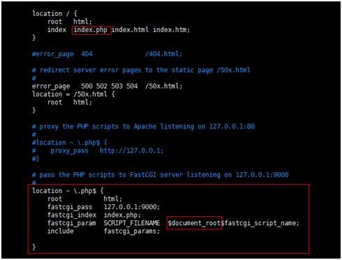

# Php
# 环境搭建
## wnmp搭建
<p align="left" style="color:#777777;">发布日期：2020-05-08</p>

!>安装根目录这里都设为F:\Ul\  替换为自己的安装目录即可

1. 分别下载nginx,mysql,php
    - [nginx 1.12.2](http://nginx.org/en/download.html)
    - [mysql 5.6.43](https://downloads.mysql.com/archives/community/)
        > mysql可以安装更高版本，性能更好，但取决于你服务器的内存
    - [php 5.6.0](https://windows.php.net/downloads/releases/archives/)
2. 配置php
    - 复制php.ini-development 改名为php.ini
    - 找到extension_dir 随便一个改为 extension_dir = './ext (设置php扩展目录)
    - 设置时区date.timezone = Asia/Shanghai
    - 开启以下扩展或配置
        ```ini
        ;always_populate_raw_post_data = -1 //开启post_data
        ;cgi.fix_pathinfo=1 //开启phpcgi 这个又漏洞
        ;extension=php_curl.dll //curl远程抓取
        ;extension=php_fileinfo.dll//文件类处理函数
        ;extension=php_gd2.dll//gd库
        ;extension=php_mbstring.dll//处理多字节字符串
        ;extension=php_mysql.dll   //php支持mysql
        ;extension=php_mysqli.dll //php支持mysqli（i代表优化过的）
        ;extension=php_openssl.dll//openssl 加密解密用的
        ;extension=php_pdo_mysql.dll //mysql pdo 连接
        ;extension=php_sockets.dll//Socket 函数库
        #差一个redis
        ```
3. 配置nginx.conf
    找到conf
    配置localhost如下
    > 以下F:/Ul/html 可以切换成你自己的服务器代码根目录
    ```nginx
    #user  nobody;
    worker_processes  1;

    events {
        worker_connections  1024;
    }

    http {
        #这里要注意域名的长度过长会报错，所以要配置这个
        server_names_hash_bucket_size 64;
        include       mime.types;
        default_type  application/octet-stream;
        sendfile        on;
        keepalive_timeout  65;

        server {
            listen       80;
            server_name  localhost;
            root   F:\UI\html;
            #以下是上传文件
            client_max_body_size 2m;

            location / {
                index  index.php index.html index.htm;
                if (!-e $request_filename) {
                    rewrite  ^(.*)$  /index.php?s=/$1  last;
                    break;
                }
            }

            error_page   500 502 503 504  /50x.html;
            location = /50x.html {
                root   html;
            }

            location ~ \.php {
                fastcgi_index   index.php;
                fastcgi_pass    127.0.0.1:9000;

                fastcgi_param   SCRIPT_FILENAME    $document_root$fastcgi_script_name;
                fastcgi_param   SCRIPT_NAME        $fastcgi_script_name;

                #以下是Pathinfo
                fastcgi_split_path_info ^(.+\.php)(.*)$;
                fastcgi_param   PATH_INFO $fastcgi_path_info;
                fastcgi_param   PATH_TRANSLATED $document_root$fastcgi_path_info;
                include         fastcgi_params;

                #以下是上传文件
                client_max_body_size 2m;
            }

            #配置图片跨域访问
            location ~ .*\.(gif|jpg|jpeg|png|bmp|swf|flv|mp4|ico)$ {
                #允许跨域请求
                add_header Access-Control-Allow-Origin '*';
                add_header Access-Control-Allow-Headers X-Requested-With;
                add_header Access-Control-Allow-Methods GET,POST,OPTIONS;

                expires 30d;
                access_log off;
            }
        }
    }
    ```
    > 检查配置是否正确nginx.exe -t -c ./conf/nginx.conf
4. 安装mysql为系统服务
    找到mysqld
    执行mysqld --install（需管理员权限的cmd）
5. 编写wnmp启动脚本bat
    - 编写server_start.bat
        ```powershell
        @echo off

        F:
        cd F:\UI\wnmp\nginx-1.12.2
        start nginx
        echo Start nginx success

        net start mysql
        echo Start mysql success

        cd F:\UI\wnmp\php-5.6.0
        php-cgi.exe -b 127.0.0.1:9000 -c php.ini
        echo Start php-cgi success
        ```
    - 编写server_stop.bat
        ```powershell
        @echo off
        taskkill /F /IM nginx.exe > nul
        echo Stop nginx success

        taskkill /F /IM php-cgi.exe > nul
        echo Stop PHP FastCGI success

        net stop mysql
        echo Stop mysql success
        pause
        ```

!>以上脚本需管理员权限启动

6. 查看进程
    ```powershell
    tasklist /fi "imagename eq nginx.exe"
    tasklist /fi "imagename eq php-cgi.exe"
    netstat -ano | findstr "3306"
    ```

7. 为php安装redis扩展
    - 用phpinfo(） 查看php extension build 是ts版还是nts版 （线程安全不安全版）
    - 下载redis [下载地址](http://pecl.php.net/package/redis/2.2.7/windows)
        - 选择对应的tsORnts
        - 解压后将php_redis.dll放入php\ext文件夹中
        - 为php.ini 加上扩展extension=php_redis.dll
    - 下载redis客户端[下载地址](https://github.com/MicrosoftArchive/redis/releases)
8. PHP7\PHP8的搭建方式一样
    > 有一些配置不同了而已
    - php7.4.13 [下载地址](https://windows.php.net/downloads/releases/php-7.4.13-nts-Win32-vc15-x64.zip)
    - php8.0.1 [下载地址](https://windows.php.net/downloads/releases/php-8.0.1-nts-Win32-vs16-x64.zip)

!>windows下项目目录命名为tp前缀会打不开

* * *
## lnmp搭建
<p align="left" style="color:#777777;">发布日期：2019-04-01 更新日期：2021-02-06</p>

### 准备
1. 下载putty工具  
2. yum -y update（升级所有软件包）  
3. df –lh（查看磁盘空间）  
4. 查看是否已安装wget  
    rpm -qa wget  
    - 否则安装  
        yum install wget  
5. 查看是否已安装编译器  
    rpm -qa gcc    
    - 否则安装  
        yum install gcc gcc-c++

### 安装nginx
1. 安装nginx依赖包  
    - nginx的Rewrite模块和HTTP核心模块会使用到PCRE正则表达式语法  
        yum -y install pcre pcre-devel
    - nginx的各种模块中需要使用gzip压缩  
        yum -y install zlib zlib-devel
    - 安全套接字层密码库  
        yum -y install openssl openssl-devel
2. 下载nginx安装包 并解压  
    - cd  /usr/local/src  
    - wget http://nginx.org/download/nginx-1.12.2.tar.gz  
    - tar –zxvf nginx-1.12.2.tar.gz
3. 编译安装  
    - cd nginx-1.12.2
    - ./configure  --prefix=/usr/local/nginx
    - ./configure  --prefix=/usr/local/nginx  --with-http_ssl_module  --with-http_gzip_static_module (要openssl模块的话)
    - make （重新编译只要执行这一个就可以了，不然会覆盖安装cp ./objs/nginx  /usr/local/nginx/sbin/nginx）
    - make install
4. 创建并设置nginx运行账号  
    - groupadd nginx
    - useradd -M -g nginx -s /sbin/nologin nginx
    - cd /usr/local/nginx/conf
    - vim nginx.conf，设置user参数如下  
        user nginx nginx
5. 设置nginx为系统服务  
    - vim /lib/systemd/system/nginx.service
    - 文件内容
        ```
        [Unit]
        Description=nginx
        After=network.target
        [Service]
        Type=forking
        ExecStart=/usr/local/nginx/sbin/nginx
        ExecReload=/usr/local/nginx/sbin/nginx -s reload
        ExecStop=/usr/local/nginx/sbin/nginx -s stop
        PrivateTmp=true
        [Install]
        WantedBy=multi-user.target
        ```
    - 解释
      - [Unit]:服务的说明
      - Description:描述服务
      - After:描述服务类别
      - [Service]服务运行参数的设置
      - Type=forking是后台运行的形式
      - ExecStart为服务的具体运行命令
      - ExecReload为重启命令
      - ExecStop为停止命令
      - PrivateTmp=True表示给服务分配独立的临时空间
      - 注意：[Service]的启动、重启、停止命令全部要求使用绝对路径
      - [Install]运行级别下服务安装的相关设置，可设置为多用户，即系统运行级别为3
    - 保存退出。
6. 设置nginx开机自启动  
    systemctl enable nginx.service
7. 开启nginx服务  
    systemctl start nginx.service
    - 查看nginx是否启动成功  
        ps aux | grep nginx
    - 访问服务器地址 welcome to nginx 至此安装完成
8. 开启防火墙  
    systemctl start firewalld
    防火墙开放80端口（nginx默认使用80端口，可在nginx.conf中配置，若无需进行远程访问则不需要开放端口）
    - 永久开放80端口  
        firewall-cmd --zone=public --add-port=80/tcp --permanent
    - 重启防火墙  
        firewall-cmd --reload
    - 查看防火墙开启状态  
        systemctl status firewalld
    - 查看80端口是否开放成功  
        firewall-cmd --zone=public --query-port=80/tcp

### 安装Mysql
1. 卸载已有mysql  
    - 查看是否已安装mysql  
        rpm -qa mysql
    - 有则卸载  
        rpm -e --nodeps 文件名称
    - 是否存在与mysql相关的文件或目录  
        whereis mysql 或 find / -name mysql
        - 是则删除  
            rm -rf /usr/lib/mysql  rm -rf /usr/share/mysql
    - 查看是否存在mariadb  
        rpm -qa | grep mariadb
        - 存在则卸载  
            rpm -e --nodeps 文件名 //文件名是上一个命令查询结果
    - 存在/etc/my.cnf，则需要先删除  
        rm /etc/my.cnf
2. 安装编译mysql需要的依赖包  
    yum install libevent* libtool* autoconf* libstd* ncurse* bison* openssl*
3. 安装cmake（mysql5.5之后需要用cmake支持编译安装）  
    - 查看是否已安装cmake
        rpm -qa cmake
        - 没有则下载编译安装  
            cd /usr/local/src  
            wget http://www.cmake.org/files/v2.8/cmake-2.8.12.1.tar.gz  
            tar -xf cmake-2.8.12.1.tar.gz  
            cd cmake-2.8.12.1  
            ./configure  
            make&&make install  
    - 检查cmake是否安装成功  
        cmake --version
4. 下载mysql包并解压（到/usr/local/src目录）  
    cd /usr/local/src  
    wget https://dev.mysql.com/get/Downloads/MySQL-5.6/mysql-5.6.43.tar.gz
    tar -zxvf mysql-5.6.43.tar.gz
5. 编译安装（到/usr/local/mysql目录）  
    cd mysql-5.6.43  
    cmake -DCMAKE_INSTALL_PREFIX=/usr/local/mysql -DMYSQL_DATADIR=/usr/local/mysql/data -DSYSCONFDIR=/etc -DWITH_MYISAM_STORAGE_ENGINE=1 -DWITH_INNOBASE_STORAGE_ENGINE=1 -DWITH_MEMORY_STORAGE_ENGINE=1 -DWITH_READLINE=1 -DMYSQL_UNIX_ADDR=/var/lib/mysql/mysql.sock -DMYSQL_TCP_PORT=3306 -DENABLED_LOCAL_INFILE=1 -DWITH_PARTITION_STORAGE_ENGINE=1 -DEXTRA_CHARSETS=all -DDEFAULT_CHARSET=utf8 -DDEFAULT_COLLATION=utf8_general_ci  
    make（此过程需花费大概20-30分钟）  
    make install  
6. 配置mysql  
    groupadd mysql  
    useradd -M -g mysql -s /sbin/nologin mysql  
    chown -R mysql:mysql /usr/local/mysql  
7. 初始化配置  
    cd /usr/local/mysql/scripts  
    ./mysql_install_db --basedir=/usr/local/mysql --datadir=/usr/local/mysql/data --user=mysql  
8. 设置mysql为系统服务  
    vim /lib/systemd/system/mysql.service  
    - 文件内容  
        ```
        [Unit]
        Description=mysql
        After=network.target
        [Service]
        Type=forking
        ExecStart=/usr/local/mysql/support-files/mysql.server start
        ExecStop=/usr/local/mysql/support-files/mysql.server stop
        ExecRestart=/usr/local/mysql/support-files/mysql.server restart
        ExecReload=/usr/local/mysql/support-files/mysql.server reload
        PrivateTmp=true
        [Install]
        WantedBy=multi-user.target
        ```
9. 设置mysql服务开机自启动  
    systemctl enable mysql.service  
10. 启动mysql  
    systemctl start mysql.service  
    - 创建不存在的目录即可  
        mkdir /var/lib/mysql  
        chown -R mysql:mysql /var/lib/mysql  
    - 再次启动  
        systemctl start mysql.service  
    - 查看  
        ps aux | grep mysql  
        
!>(启动失败使用/usr/local/mysql/support-files/mysql.server restart启动可以看到详细错误原因)

11.  登录mysql并设置root密码
    /usr/local/mysql/bin/mysql -u root  set password=password('123456');  
12.  创建远程连接用户  
    GRANT ALL PRIVILEGES ON *.* TO 'root'@'%' IDENTIFIED BY 'password' WITH GRANT OPTION;  
    flush privileges;

!>(%也可换成ip)

13.  重启mysql  
    service mysql restart
14.  查看防火墙对外开放了哪些端口（看3306有没有被开启）这里是centos7的命令
    firewall-cmd --zone=public --list-ports
15.  打开端口  
    firewall-cmd --zone=public --add-port=3306/tcp --permanent    （--permanent永久生效，没有此参数重启后失效）  
    firewall-cmd --reload  
    在查看一次端口即可  
    yum update导致mysql服务不能启动，解决办法mv /etc/my.cnf /etc/my.cnf.bak  

### 安装PHP
1. 安装php依赖包  
yum install libxml2 libxml2-devel openssl openssl-devel bzip2 bzip2-devel libcurl libcurl-devel libjpeg libjpeg-devel libpng libpng-devel freetype freetype-devel gmp gmp-devel libmcrypt libmcrypt-devel readline readline-devel libxslt libxslt-devel
2. 下载php包并解压  
    cd /usr/local/src  
    - 下载  
        wget http://cn2.php.net/distributions/php-5.6.0.tar.xz  
    - 解压  
        tar -zxvf php-5.6.0.tar.gz  
    - 进入  
        cd php-5.6.0  
    - 配置  
        ./configure --prefix=/usr/local/php --disable-fileinfo --enable-fpm --with-config-file-path=/etc --with-config-file-scan-dir=/etc/php.d --with-openssl --with-zlib --with-curl --enable-ftp --with-gd --with-xmlrpc --with-jpeg-dir --with-png-dir --with-freetype-dir --enable-gd-native-ttf --enable-mbstring --with-mcrypt=/usr/local/libmcrypt --enable-zip --enable-mysqlnd --with-mysqli=mysqlnd --with-pdo-mysql=mysqlnd --with-mysql-sock=/var/lib/mysql/mysql.sock --without-pear  --enable-bcmath  
    - 编译  
        make（此过程需花费大概20分钟）  
        make install  

!>（注意：--with-mcrypt参数指定的是libmcrypt的安装目录。Php7不再使用mysql的库来支持mysql的连接，而是启用了mysqlnd来支持，所以php7的编译已经不再使用--with-mysql参数指定mysql的安装位置了，若想支持mysql，需要设置--enable-mysqlnd、--with-mysqli和--with-pdo-mysql=mysqlnd参数，--with-mysql-sock指定的是编译mysql时-DMYSQL_UNIX_ADDR参数指定的文件）

3. 将php包解压目录中的配置文件放置到正确位置  
    cp php.ini-development /etc/php.ini  

!>configure命令中的--with-config-file-path设置的位置 这里的目录可以直接设为/usr/local/php/etc 没必要放外面的

4. 创建并设置php-fpm运行账号  
    groupadd www-data  
    useradd -M -g www-data -s /sbin/nologin www-data  
    cd /usr/local/php/etc  
    cp php-fpm.conf.default php-fpm.conf  
    vim php-fpm.conf  
    搜索user/group   (esc 输入/string搜索)  
    设置  
    user=www-data  
    group=www-data  
5. 配置nginx支持php  
    vim /usr/local/nginx/conf/nginx.conf  
      
    重启nigix  
    systemctl start nginx.service  
6. 设置php-fpm为系统服务  
    vim /etc/systemd/system/php-fpm.service  
7. 设置php-fpm服务开机自启动  
    systemctl enable php-fpm.service  
8. 启动php-fpm  
    systemctl start php-fpm.service  
    查看是否启动成功：  
    ps aux | grep php-fpm  

### 安装PHP7.4.13
__统一下载路径cd /usr/local/src__
1. 前置1安装re2c 不然编译会报错 PHP （语法分析器re2c）  
    wget https://github.com/skvadrik/re2c/releases/download/1.0.2/re2c-1.0.2.tar.gz  
    解压：tar -zxvf re2c-1.0.2.tar.gz  
    进入cd ./re2c-1.0.2  
    编译安装./configure && make && make install  
2. 前置2No package 'sqlite3' found  
    sudo yum install -y sqlite-devel.x86_64  
3. 前置3No package 'oniguruma' found  
    wget https://github.com/kkos/oniguruma/archive/v6.9.4.tar.gz -O oniguruma-6.9.4.tar.gz   
    tar -xvf oniguruma-6.9.4.tar.gz   
    cd oniguruma-6.9.4/  
    ./autogen.sh  
    ./configure --prefix=/usr --libdir=/lib64&&make && make install //64位的系统一定要标识  --libdir=/lib64 否则还是不行  
4. 前置4 No package 'libzip' found  
    #卸载老版本的libzip  
    yum remove libzip  
    #下载安装libzip-1.2.0  
    wget https://libzip.org/download/libzip-1.2.0.tar.gz  
    tar -zxvf libzip-1.2.0.tar.gz  
    cd libzip-1.2.0  
    ./configure  
    make && make install  
    安装完成后，查看是否存在/usr/local/lib/pkgconfig目录,如果存在，执行如下命令来设置PKG_CONFIG_PATH：  
    Php 编译配置前执行   
    export PKG_CONFIG_PATH="/usr/local/lib/pkgconfig/"  
5. 安装php依赖包(此处5.6上面已经安装了可以跳过)  
    yum install libxml2 libxml2-devel openssl openssl-devel bzip2 bzip2-devel libcurl libcurl-devel libjpeg libjpeg-devel libpng  
    libpng-devel freetype freetype-devel gmp gmp-devel libmcrypt libmcrypt-devel readline readline-devel libxslt libxslt-devel  
6. 下载php包并解压  
    cd /usr/local/src  
    - 下载  
        wget https://www.php.net/distributions/php-7.4.13.tar.gz   
    建议直接下载，然后再通过ftp扔到src目录，有时候网速不好,会缺少文件  
    - 解压  
        tar -zxvf php-7.4.13.tar.gz  
    - 进入  
        cd php-7.4.13  
    - 复制配置文件  
        cp php.ini-production /usr/local/php7/etc/php.ini  
    - 配置    
        先执行  
        export PKG_CONFIG_PATH="/usr/local/lib/pkgconfig/"  
        再执行  
        ./configure --prefix=/usr/local/php7 --disable-fileinfo --enable-fpm --with-config-file-path=/usr/local/php7/etc  
        --with-config-file-scan-dir=/usr/local/php7/etc/php.d --with-openssl --with-zlib --with-curl --enable-ftp --enable-gd  
        --with-xmlrpc --with-jpeg   --with-freetype  --enable-mbstring --with-zip --enable-mysqlnd --with-mysqli=mysqlnd  
        --with-pdo-mysql=mysqlnd --with-mysql-sock=/var/lib/mysql/mysql.sock --enable-bcmath --without-pear --enable-opcache  
        (删除一些没用的，启用一些必要的)  
7. 编译安装  
    make && make install  
    等待20~30分钟  
8. 配置fpm  
    cd /usr/local/php7/etc  
    - 首先复制出一份php-fpm.conf  
        #cp php-fpm.conf.default php-fpm.conf  
    - 切换到/usr/local/php7/etc/php-fpm.d复制配置文件  
        #cp www.conf.default www.conf  
    - 修改fpm监听端口  
        vim  /usr/local/php7/etc/php-fpm.d/www.conf  
        listen = 127.0.0.1:9000  
    - 将其端口修改为   
        listen = 127.0.0.1:9001  
    - :wq 保存编辑退出.   
    然后配置nginx或apache支持php7即可.  
9. 配置php7的fpm自动启动  
    - 复制5.6的自启文件  
        cp /etc/systemd/system/php-fpm.service /etc/systemd/system/php7-fpm.service  
    - 编辑改为7的目录  
        vim /etc/systemd/system/php7-fpm.service  
10. 设置php7-fpm服务开机自启动：  
    systemctl enable php7-fpm.service  
11. 启动php-fpm：  
    systemctl start php7-fpm.service  
    - 查看是否启动成功  
        ps aux | grep php-fpm  
    就能看到5.6的和7的同时启动成功了  
12.nginx支持php7  
    第四大点第5小点 nginx配置127.0.0.1:9000改为127.0.0.1:9001即可  
13.php7开启opcache  
    vim /usr/local/php7/etc/php.ini  
    - 末尾加上下面配置  
        zend_extension=opcache.so  
        [opcache]  
        ;开启opcache  
        opcache.enable=1  
        ;CLI环境下，PHP启用OPcache  
        opcache.enable_cli=1  
        ;OPcache共享内存存储大小,单位MB  
        opcache.memory_consumption=128  
        ;PHP使用了一种叫做字符串驻留（string interning）的技术来改善性能。例如，如果你在代码中使用了1000次字符串“foobar”，在PHP内部只会在第一  
        用这个字符串的时候分配一个不可变的内存区域来存储这个字符串，其他的999次使用都会直接指向这个内存区域。>这个选项则会把这个特性提升一个层次—  
        默认情况下这个不可变的内存区域只会存在于单个php-fpm的进程中，如果设置了这个选项，那么它将会在所有的php-fpm进程中共享。在比较大的应用中，  
        可以非常有效地节约内存，提高应用的性能。  
        ;这个选项的值是以兆字节（megabytes）作为单位，如果把它设置为16，则表示16MB，默认是4MB  
        opcache.interned_strings_buffer=8  
        ;这个选项用于控制内存中最多可以缓存多少个PHP文件。这个选项必须得设置得足够大，大于你的项目中的所有PHP文件的总和。  
        ;设置值取值范围最小值是 200，最大值在 PHP 5.5.6 之前是 100000，PHP 5.5.6 及之后是 1000000。也就是说在200到1000000之间。  
        ;opcache.max_accelerated_files=4000  
        ;设置缓存的过期时间（单位是秒）,为0的话每次都要检查  
        opcache.revalidate_freq=60  
        ;从字面上理解就是“允许更快速关闭”。它的作用是在单个请求结束时提供一种更快速的机制来调用代码中的析构器，从而加快PHP的响应速度和PHP进程资  
        的回收速度，这样应用程序可以更快速地响应下一个请求。把它设置为1就可以使用这个机制了。  
        opcache.fast_shutdown=1  
        ;如果启用（设置为1），OPcache会在opcache.revalidate_freq设置的秒数去检测文件的时间戳（timestamp）检查脚本是否更新。  
        ;如果这个选项被禁用（设置为0），opcache.revalidate_freq会被忽略，PHP文件永远不会被检查。这意味着如果你修改了你的代码，然后你把它更新到  
        务器上，再在浏览器上请求更新的代码对应的功能，你会看不到更新的效果  
        ;强烈建议你在生产环境中设置为0，更新代码后，再平滑重启PHP和web服务器。  
        opcache.validate_timestamps=0  
        ;开启Opcache File Cache(实验性), 通过开启这个, 我们可以让Opcache把opcode缓存缓存到外部文件中, 对于一些脚本, 会有很明显的性能提升.  
        ;这样PHP就会在/tmp目录下Cache一些Opcode的二进制导出文件, 可以跨PHP生命周期存在.  
        opcache.file_cache=/tmp  
    - 重启  
        systemctl restart php7-fpm  

### 安装PHP8.0.1
__统一下载路径cd /usr/local/src__  
1. 和php7一样的前置条件安装  
2. 下载php包并解压  
    https://www.php.net/distributions/php-8.0.1.tar.gz  
    建议直接下载，然后扔到/usr/local/src目录  
    - 解压  
        tar -zxvf php-8.0.1.tar.gz  
    - 进入  
        cd php-8.0.1  
    - 先执行  
        export PKG_CONFIG_PATH="/usr/local/lib/pkgconfig/"  
    - 再执行（编译错误每个编译项之间只能有一个空格，编译项和7略微不同，如Xml）  
        ./configure --prefix=/usr/local/php8 --disable-fileinfo --enable-fpm --with-config-file-path=/usr/local/php8/etc  
        --with-config-file-scan-dir=/usr/local/php8/etc/php.d --with-openssl --with-zlib --with-curl --enable-ftp --enable-gd  
        --enable-xml --with-jpeg --with-freetype --enable-mbstring --with-zip --enable-mysqlnd --with-mysqli=mysqlnd  
        --with-pdo-mysql=mysqlnd --with-mysql-sock=/var/lib/mysql/mysql.sock --enable-bcmath --without-pear --enable-opcache  
    - 编译安装，这里会缺很多扩展，[参考](https://www.jianshu.com/p/3c721f4e9075)
        make && make install  
        等待20~30分钟  
3. 复制配置文件  
    cp php.ini-production /usr/local/php8/etc/php.ini  
4. 配置fpm  
    cd /usr/local/php8/etc  
    - 首先复制出一份php-fpm.conf  
        #cp php-fpm.conf.default php-fpm.conf  
    - 切换到  
        /usr/local/php8/etc/php-fpm.d  
    - 复制配置文件  
        #cp www.conf.default www.conf  
    - 修改fpm监听端口  
        vim /usr/local/php8/etc/php-fpm.d/www.conf  
        listen = 127.0.0.1:9000  
        将其端口修改为   
        listen = 127.0.0.1:9002  
        :wq 保存编辑退出.   
    - 然后配置nginx或apache支持php8即可.  
5. 配置php8的fpm自动启动  
    - 复制5.6的自启文件  
        cp /etc/systemd/system/php-fpm.service /etc/systemd/system/php8-fpm.service  
    - 编辑改为8的目录  
        vim /etc/systemd/system/php8-fpm.service  
6. 设置php8-fpm服务开机自启动：  
    systemctl enable php7-fpm.service  
7. 启动php-fpm  
    systemctl start php8-fpm.service  
    - 查看是否启动成功  
        ps aux | grep php-fpm  
        就能看到5.6的和7的同时启动成功了  
  
8. nginx支持php8  
    第四大点第5小点 nginx配置127.0.0.1:9000改为127.0.0.1:9002即可  

9. 设置环境变量
    ```
    vim /etc/profile
    export PATH=$PATH:/usr/local/php8/bin
    source /etc/profile
    重启
    查看
    php -v
    ```
  
10. php8开启opcache 和jit  
    vim /usr/local/php8/etc/php.ini  
    - 末尾加上下面配置  
        ```  
        zend_extension=opcache  
        [opcache]  
        ;开启opcache  
        opcache.enable=1  
        opcache.enable_cli=1  
        opcache.memory_consumption=128  
        opcache.interned_strings_buffer=8  
        ;opcache.max_accelerated_files=4000  
        opcache.revalidate_freq=60  
        opcache.fast_shutdown=1  
        opcache.validate_timestamps=0  
        opcache.file_cache=/tmp  
        ;支持jit  
        opcache.jit=1255  
        opcache.jopcache.jit_buffer_size=32M  
        ```  
    - 重启  
        systemctl restart php8-fpm  

!>jit_buffer_size设置过大会报错

### 常用
- nginx  
    启动 systemctl start nginx.service  
    停止 systemctl stop nginx.service  
    重启 systemctl restart nginx.service  
    查看是否启动 ps aux | grep nginx  
    配置目录/usr/local/nginx/conf/nginx.conf  
- Php  
    启动 systemctl start php-fpm.service  
    停止 systemctl stop php-fpm.service  
    重启 systemctl restart php-fpm.service  
    查看是否启动 ps aux | grep php-fpm  
    Php配置目录 /etc/php.ini  
- Mysql  
    启动 systemctl start mysql.service  
    停止 systemctl stop mysql.service  
    重启 systemctl start mysql.service  
    查看是否启动 ps aux | grep mysql  
    配置目录/usr/local/mysql/my.cnf  
- php7  
    启动 systemctl start php7-fpm.service  
    停止 systemctl stop php7-fpm.service  
    重启 systemctl restart php7-fpm.service  
    查看是否启动 ps aux | grep php-fpm  
    Php配置目录  /usr/local/php7/etc/php.ini  
- Php8  
    启动 systemctl start php8-fpm.service  
    停止 systemctl stop php8-fpm.service  
    重启 systemctl restart php8-fpm.service  
    查看是否启动 ps aux | grep php-fpm  
    Php配置目录  /usr/local/php8/etc/php.ini   

!> 注意开启php opcache后 如果设置了缓存，那么请求的php脚本会被缓存，缓存时间内php脚本不会更新，如果要立即生效，需要重启fpm，这也是开启opcache后性能提升的原因，因为不需要重新编译php脚本了

# PHPSTROM

## 代码格式化

CODESTYLE->PHP->set from ->Drupal

# 扩展
## linux为php添加redis扩展
<p align="left" style="color:#777777;">发布日期：2020-07-23</p>

1. cd /usr/local/src  
2. 下载 wget http://pecl.php.net/get/redis-2.2.7.tgz  
3. 解压 tar -zxvf redis-2.2.7.tgz  
4. cd redis-2.2.7  
5. find / -name phpize   
6. /usr/local/php/bin/phpize  
7. ./configure --with-php-config=/usr/local/php/bin/php-config  
8. make && make install  
9. 编辑php.ini 加入redis.so  
    /usr/local/php/lib/php/extensions/no-debug-non-zts-20131226/redis.so  
10. systemctl restart php-fpm

# 算法
## PHP之抽奖概率算法
<p align="left" style="color:#777777;">发布日期：2019-03-27</p>

无论是任何抽奖的小游戏，例如转盘，九宫格，砸金蛋，刮刮卡，都是基于抽奖算法来抽奖，都可以基于同一种抽奖算法。无非就是前端的展现形式不一样。目前只看到过一种，附上。
```php
function getRand($proArr){
    $data = ''; 
    $proSum = array_sum($proArr); //概率数组的总概率精度  
    foreach ($proArr as $k => $v) { //概率数组循环 
        $randNum = mt_rand(1, $proSum); //重点
        if($randNum <= $v){ //重点
            $data = $k; 
            break;
        } else { 
            $proSum -= $v; 
        } 
    } 
    unset($proArr); 
    return $data; 
}
```
这个被人称之为经典概率算法，$proArr就是概率数组。例如('1','2','3','4')这个概率数组，那么他的总概率为10  
那么抽中1对应的概率就为1/10 。那怎么计算这个概率呢？  
就是用1到10的随机数，随机一个整数，那么随机到小于等于2的概率不就是2/10。这里牵涉到mt_rand这个函数，有兴趣的研究下。  
九宫格抽奖：http://www.cnblogs.com/starof/p/4933907.html  
转盘抽奖：http://www.thinkphp.cn/code/1153.html  


# thinkphp6后端框架
此步骤所有文件参考原项目即可 http://demo.o8o8o8.com/vue-admin-thinkphp6/#/

## composer
[composer安装](https://www.kancloud.cn/manual/thinkphp6_0/1037481) [windows直接下载安装](https://getcomposer.org/download/)

## 创建项目
切换到网站根目录运行
```powershell
composer create-project topthink/think demo
```

## 更新框架
切换到应用根目录
```powershell
composer update topthink/framework
```

!> 运行出现No input file specified 可能是nginx root目录配置的有问题 最好用\\双斜杠去表示\就不会出问题了

## 配置域名绑定模块
配置/config/app.php(上线需要更改的一块)
```php
<?
return [
 'domain_bind'      => [
        'www.xxx.com' => 'admin',
    ],
]
```

## 配置路由
/config/route.php
```php
<?php
return [
    // URL普通方式参数 用于自动生成
    'url_common_param'      => true,
    // 是否开启路由延迟解析
    'url_lazy_route'        => true,
    // 是否强制使用路由
    'url_route_must'        => true,
    // 合并路由规则
    'route_rule_merge'      => false,
    // 路由是否完全匹配
    'route_complete_match'  => true,
]
```

## 新建模块
/app/admin

## 配置数据库连接
/app/admin/config/database.php 和/.env配置文件(上线需要更改的一块)
!> 上线还要重启php8 不然数据库连不上出现localhsot no Password错误,很坑

## 配置路由中间件
/app/admin/config/route.php 配置路由中间件设置跨域规则。如果要鉴权的也可以在这里设置priority优先中间件，设置方法参考以前的项目
```php
<?php
//路由
return [
    //路由中间件
    'middleware' => [
        app\admin\middleware\Cors::class, //跨域中间件 这里开了整个模块都跨域
    ],
];
```

app\admin\middleware\Cors.php
```php
<?php
declare (strict_types = 1);
namespace app\admin\middleware;

//跨域中间件
class Cors {
    public function handle($request, \Closure$next) {
        //构造方法 设置允许跨域请求
        header('Access-Control-Allow-Origin:*');
        header("Access-Control-Allow-Methods: POST, GET, OPTIONS, PUT, DELETE");
        header("Access-Control-Allow-Credentials: true");
        header("Access-Control-Allow-Headers: Origin, X-Requested-With, Content-Type, Accept,  X-Token");
        header("Access-Control-Expose-Headers: Token,Code");
        header('Access-Control-Max-Age: 3600');
        if (strtoupper($_SERVER['REQUEST_METHOD']) == 'OPTIONS') {
            exit;
        }
        return $next($request);
    }
}
```

## 多应用模式
需要安装think-multi-app 不然无法访问，默认是单应用模式
```powershell
composer require topthink/think-multi-app
```

## 新建路由
新建app\admin\route\route.php 
路由文件随便起怎么起，只要在这下面都会加载

# swoole

## 安装扩展

[下载扩展源代码](https://github.com/swoole/swoole-src/releases)

建议直接下载，然后扔到/usr/local/src目录

1. 解压
    tar -zxvf swoole-src-5.0.2.tar.gz
2. 编译(PHP扩展都可以用这种方法安装)
    cd swoole-src-5.0.2
    phpize 
    ./configure 
    make && make install
3. vim /usr/local/php8/etc/php.ini  加入 extension=swoole.so 且添加swoole.use_shortname='Off' 
4. 查看扩展是否添加成功
   php -m
5. 还需要安装进程控制扩展pcntl
    cd /usr/local/src/php-8.0.1/ext/pcntl
    phpize 
    ./configure 
    make && make install
6. vim /usr/local/php8/etc/php.ini  加入 extension=pcntl.so
7. 查看扩展是否添加成功
   php -m


# Hyperf

## 创建环境

### windows

windows先安装docker，就不需要其他环境了，前置条件只需开启hyper-V(wsl/wsl2是装linux子系统的还得下系统,开启后夜神模拟器无法启动需关闭)

[下载](https://www.docker.com/)

镜像源加速设置json docker桌面版 setting->docker engine

```
 "registry-mirrors": [
    "http://hub-mirror.c.163.com",
    "https://docker.mirrors.ustc.edu.cn",
    "https://registry.docker-cn.com"
  ]
```

安装到其他盘 
1. 创建D:\docker
2. 创建软链 mklink /j "C:\Program Files\Docker" "D:\docker"
最后安装exe
3. 安装后重启电脑才能启动

4. 拉取官方镜像

    cmd输入 docker pull hyperf/hyperf

    运行容器hyperf/hyperf 就是你拉取的镜像 
    并绑定项目目录 E:/code/gitserver/本机共享目录 /data/projectlinux共享目录

    ```
    #官方php8.0 他的镜像是Alpine不友好
    docker run -d --name hyperf -v E:/code/gitserver/:/data/project -p 9501:9501 -p 22:22 -it --privileged -u root --entrypoint /bin/sh hyperf/hyperf:8.0-alpine-v3.15-swoole
    #centos手动安装php8也可以 推荐
    docker run -d --name centos7 -v E:/code/hyperf:/data/project -p 9501:9501 -p 22:22 -it --privileged -u root --entrypoint /bin/sh centos:7
    ```
5. docker
   ```
   #查看容器ID
   docker ps -a
   #退出
   exit
   #启动
   docker start 容器ID
   #进入
   docker exec -it --user root 容器ID /bin/bash
   #先停止
   docker stop 容器ID
   #再删除
   docker rm  容器ID
   ```
6. 安装mysql容器
   启动参数需要加上MYSQL_ROOT_PASSWORD 123456 否则无法启动

!> windows是无法ping通容器内的ip的，传文件的话直接利用共享目录,另外需要注意Linux内核版本，查看不同的安装命令

### yasdDebug

1. 需要手动在centos7里面安装php环境，包括swoole扩展，yasd扩展，以及他们的前置扩展,或者直接下载官方的镜像

2. 容器启动SSH ssh-keygen -A 需要在最后加上&符号 /usr/sbin/sshd -D &

3. Docker可以通过多个-p 映射多个win到docker容器的端口  数据都是通过这个端口转发,容器可以提交保存后以新的方式启动

4. PHP_IDE_CONFIG错误 export PHP_IDE_CONFIG="serverName=servername",或者发现监听不到了重新执行一下

5. 调试只需要配置PHP->DEBUG的端口,别的都不需要

6. 调试先打开小电话开启监听9000，在缓存类打上断点，接着用php -e bin/hyperf.php start 启动，最后浏览器访问

7. yasd 需要用低版本扩展0.2.5版本,配置的端口为IDE的端口，IP为主机的局域网IP

8. 如需要配置IDE PHP版本为容器php则需要容器启动ssh去配置

9. hyper只能调试缓存代理类

10. Aphine内核安装php编译工具 apk add autoconf dpkg-dev file g++ gcc libc-dev make php8-dev php8-pear re2c pcre pcre-dev,注意使用时 phpize8 [如果缺少config.m4](https://zhuanlan.zhihu.com/p/565444042)

11. Aphine boost: apk add --no-cache boost boost-dev

### linux

直接安装composer，并且已经安装好php8,mysql

```
#安装程序
php -r "copy('https://getcomposer.org/installer', 'composer-setup.php');"
php -r "if (hash_file('sha384', 'composer-setup.php') === '55ce33d7678c5a611085589f1f3ddf8b3c52d662cd01d4ba75c0ee0459970c2200a51f492d557530c71c15d8dba01eae') { echo 'Installer verified'; } else { echo 'Installer corrupt'; unlink('composer-setup.php'); } echo PHP_EOL;"
php composer-setup.php
php -r "unlink('composer-setup.php');"
#可以全局使用 有环境变量
mv composer.phar /usr/local/bin/composer
#查看版本
composer -v
#配置阿里云
composer config -g repo.packagist composer https://mirrors.aliyun.com/composer
```

composer常用命令

```
 1、composer list：获取帮助信息；
 2、composer init：以交互方式填写composer.json文件信息；
 3、composer install：从当前目录读取composer.json文件，处理依赖关系，并安装到vendor目录下；
 4、composer update：获取依赖的最新版本，升级composer.lock文件；
 5、composer require：添加新的依赖包到composer.json文件中并执行更新；
       composer remove twbs/bootstrap; 卸载依赖包
 6、composer search：在当前项目中搜索依赖包；
 7、composer show：列举所有可用的资源包；
 8、composer validate：检测composer.json文件是否有效；
 9、composer self-update：将composer工具更新到最新版本；
       composer self-update -r ：回滚到安装的上一个版本
10、composer diagnose：执行诊断命令
11、composer clear：清除缓存
12、composer create-project：基于composer创建一个新的项目；
13、composer dump-autoload：在添加新的类和目录映射是更新autoloader
```

## 起步

### 创建项目

```
#除了mysql redis 其他全部n
composer create-project hyperf/hyperf-skeleton hyperf-test
cd hyperf-test
#docker 的话是cd /data/project/hyperf-test
php bin/hyperf.php start
```

访问 http://127.0.0.1:9501/

!> 直接用服务器的composer下载依赖，vendor提交到git