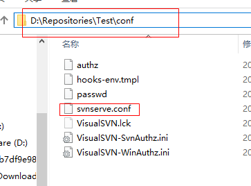
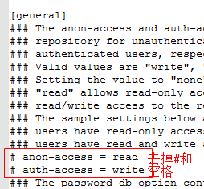
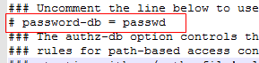
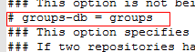
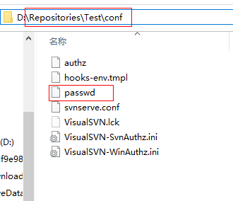
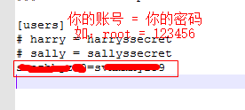
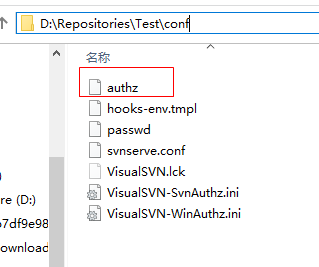
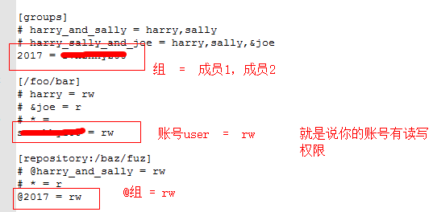

# 版本管理
# svn服务器搭建
## win10搭建TortoiseSvn
<p align="left" style="color:#777777;">发布日期：2019-04-01</p>

1. 准备、下载安装包  
    - Svn客户端：[下载地址](https://tortoisesvn.net/downloads.html)
    - Svn简体中文语言包：[下载地址](https://tortoisesvn.net/downloads.html)
    - Svn服务端：[下载地址](https://www.visualsvn.com/downloads/)
2. 安装SVN服务端
    弹出错误使用命令行安装即可
    msiexec /i VisualSVN-Server-2.7.3.msi NO_START_SERVICES=1
    - 创建一个repositories
    - 创建一个用户
    - 创建一个组 将用户加入进去
    - 修改配置文件如下  
          
           
           
           
           
    - 启动visualSVNf http服务 若启动不了，需要去系统服务里面为该服务添加启动用户
    至此服务端搭建完成
3. 安装客户端
   - 安装客户端
   - 安装汉化包

!>问题 win10没有文件夹图标解决
```
输入：win+R，输入regedit，调出注册表信息，按下Ctrl+F,在注册表里搜索“ShellIconOverlayIdentifiers”
<或者：右击文件夹------->“小乌龟”TortoiseConflict------>settings------>直接进入注册表>
将TortoiseAdded、TortoiseConflict……TortoiseUnversioned分别重命名，命名为0TortoiseAdded、1TortoiseConflict……8TortoiseUnversioned。
重启电脑更新注册表之后，最后文件夹连接服务器后有了图标
````

## centos7.2 svn服务器搭建
<p align="left" style="color:#777777;">发布日期：2020-02-25</p>

1. putty登陆服务器
2. 安装svn服务端
    ```
    yum -y install subversion
    ```
3. 查看安装位置
    ```
    rpm -ql subversion
    ```
4. 查看版本
    ```
    svnserve --version
    ```
5. *创建svn版本库目录
    ```
    mkdir -p /var/svn/sxc
    ```
6. *创建版本库
    ```
    svnadmin create /var/svn/sxc
    ```
7. *进入版本库
    ```
    cd /var/svn/sxc
    ```
8. 查看列表
    ```
    ls -l
    ```
9. 进入
    ```
    cd /var/svn/sxc/conf  
    ```
    有三个文件 
    - authz权限管理 
    - passwd账号密码管理 
    - svnserve.conf配置文件
10. 添加账号密码
    ```
    vi passwd 
    ```
    - 末尾加上用户名=密码（i编辑）
    - 退出并保存esc+:wq
   
11. 修改权限
    ```
    vi authz 
    ```
    - 末尾加上
    - [\]
    - 用户 = rw
    - 表示用户有读写权限，修改完并保存
12. 修改配置文件
    ```
    vim /var/svn/sxc/conf/svnserve.conf
    ```
    - 取消以下注释  并修改realm为你的svn版本库目录
    - anon-access = read  #匿名用户可读
    - auth-access = write #授权用户可写
    - password-db = passwd #SVN账号文件
    - authz-db = authz  #SVN权限文件
    - realm = /var/svn/sxc  #SVN版本库目录
    - 这里会出现一个配置的问题，配置项需要顶格写
13. 启动svn版本库
    ```
    svnserve -d -r /var/svn/
    ```
    - 若无法启动，说明svn服务已经被占用，
    - 执行 killall svnserve 关掉当前正在执行的SVN进程后即可。
14. 查看svn是否启动
    ```
    ps aux | grep svn
    ```
15. 防火墙开启3690端口
    - centos查询端口是不是开放的
        ```    
        firewall-cmd --permanent --query-port=3690/tcp
        ```
    - 添加对外开放端口
        ```
        firewall-cmd --permanent --add-port=3690/tcp
        ```
    - 重启防火墙
        ```
        firewall-cmd --reload
        ```
    - 查看端口监听情况
        ```
        netstat -nlp
        ```
    - 启动防火墙
        ```
        systemctl start firewalld 
        ```
16. 无法连接主机“X.X.X.X”: 由于连接方在一段时间后没有正确答复或连接的主机没有反应，连接尝试失败。
    - 需要配置安全组规则
    - 入站规则 协议 0.0.0.0/0 所有来源可访问 tcp:3690  策略:允许
17. 拓展，多个库使用一个配置文件
    - 移动conf到svn目录
        ```
        mv -f /var/svn/sxc/conf   /var/svn/conf
        ```
    - 修改配置文件
        ```
        anon-access = read  #匿名用户可读
        auth-access = write #授权用户可写
        password-db = /var/svn/conf/passwd #SVN账号文件
        authz-db = /var/svn/conf/authz  #SVN权限文件
        realm = /var/svn  #SVN版本库目录
        ```

18. *启动svn
    ```
    killall svnserve
    svnserve -d -r /var/svn --config-file=/var/svn/conf/svnserve.conf （多个库访问一套配置文件 需要制定   配置文件的位置 所以使用这个代码启动服务）
    ps aux | grep svn
    ```
19. *checkout
    ```
    svn://ip/sxc
    ```
20. 下次建版本库只要执行带*号的就可以了

21. 服务器web目录检出空目录（空版本库）
    ```
    cd /usr/local/nginx/html/sxc
    svn checkout svn://x.x.x.x/sxc(目录或文件的全路径)　./(当前web目录路径])
    svn add *
    svn add . --no-ignore --force (全部包括隐藏文件)
    svn commit -m "sxc"
    svn update
    ```

# git
## 常用操作和命令
<p align="left" style="color:#777777;">发布日期：2020-07-24</p>

?>[SSH公钥配置](https://www.jianshu.com/p/464a3373d15c)

1. 下载git客户端 官网下载即可
2. 打开命令行 配置全局用户名邮箱
    ```git
    $ git config --global user.name "Your Name"
    $ git config --global user.email "email@example.com"
    ```
3. 初始化git仓库
    ```git
    $ git init
    ```
4. 告诉git添加单个文件到仓库(可以反复添加，一次提交即可，就是添加到暂存区)
    ```git
    $ git add test.html
    ```
5. 单个文件提交到仓库（就是提交到当前分支）
    ```git
    $ git commit -m "我添加了第一个文件test.html"
    ```
6. 查看仓库状态，修改了或者新增了什么文件
    ```git
    $ git status
    ```
7. 查看修改了哪些内容
    ```git
    $ git diff
    ```
8. 提交修改的文件是重复4，5这两步
    ```git
    $ git add test.html
    $ git commit -m "我修改了test.html"
    ```
9. 查看提交日志
    ```git
    $ git log
    ```
10. 查看简略提交日志
    ```git
    $ git log --pretty=oneline
    ```
11. 版本回退到上一版本
    ```git
    $ git reset --hard HEAD^
    ```
12. 版本恢复到回退前的版本
    ```git
    $ git reset --hard 1234a (就是commit id，前几位就可以)
    ```
13. 查看命令行历史，可用于忘记commit id，去回退版本
    ```git
    $ git reflog
    ```
14. 查看工作区和版本库最新版本的区别
    ```git
    $ git diff HEAD -- test.html(查看指定文件)
    ```
15. 撤销修改 恢复到最近一次git commit或git add的状态 丢弃工作区的修改
    ```git
    $ git checkout -- test.html
    ```
16. 暂存区修改回退到工作区
    ```git
    $ git reset HEAD  test.html
    ```
17. 删除文件
    ```git
    $ git rm test.html
    $ git commit -m "delete test.html"
    ```
18. 如果没有提交删除文件，只提交到暂存区（就是只执行了git rm操作），那么回退，提交了就只能回退版本
    ```git
    $ git reset HEAD test.html
    $ git checkout --test.html
    ```
19. 本地仓库关联远程仓库
    ```git
    $ git remote add origin git@github.com:xxx/demo.git
    ```
20. 把当前master分支推送到远程仓库
    ```git
    $ git push -u origin master
    ```
21. SSH key获取方法
    ```git
    $ ssh-keygen -t rsa -C  "email@example.com"
    $ cat ~/.ssh/id_rsa.pub
    ```
22. 克隆远程仓库到本地,直接文件夹下来
    ```git
    $ git clone git@github.com:xxx/demo.git
    ```
23. 创建dev分支
    ```git
    $ git branch dev
    ```
24. 切换到dev分支
    ```git
    $ git checkout dev 或 $ git switch dev
    ```
25. 创建dev分支并切换到该分支
    ```git
    $ git checkout -b dev 或 $ git switch -c dev
    ```
26. 查看当前分支
    ```git
    $ git branch
    ```
27. 合并dev分支到master分支上，这种合并没有历史提交记录
    ```git
    $ git merge dev （合并指定分支到当前分支）
    ```
28. 删除dev分支
    ```git
    $ git branch -d dev
    ```
29. 合并分支分支历史记录分支信息,合并会创建一个新的commit
    ```git
    $ git merge --no-ff -m "merge with no-ff" dev
    ```
30. 存储当前工作区（还未提交）
    ```git
    $ git stash
    ```
31. 查看存储的工作区列表
    ```git
    $ git stash list
    ```
32. 恢复存储的工作区
    ```git
    $ git stash apply
    ```
33. 删除存储的工作区
    ```git
    $ git stash drop
    ```
34. 恢复并删除存储的工作区
    ```git
    $ git stash pop
    ```
35. 恢复指定存储的工作区
    ```git
    $ git stash pop stash@{0}
    ```
36. 修复某个分支的BUG 并把该BUG提交复制到当前分支,假如当前分支是dev，bug修复在master分支
    - 用法
        ```git
        $ git cherry-pick 100aaa
        ```
    - 流程
        ```git
        $ git stash //保存当前工作区
        $ git switch master //切换到master分支
        $ git switch -c issue-101 //创建问题101分支
        $ git add .
        $ git commit -m "fix bug 101"
        $ git switch master
        $ git merge --no-ff -m "meged bug fix 101" issue-101 //合并分支
        $ git log --pretty=oneline //找到bug提交的commit id 假如是100aaa
        $ git branch -d issue-101 //删除分支
        $ git switch dev
        $ git cherry-pick 100aaa //复制这个提交到当前分支
        $ git stash pop //恢复存储的工作区并删除
        ```
    - 总结  
        修复bug时，先保存当前工作区，创建新的bug分支进行修复，然后合并，最后删除，然后在恢复工作区
37. 强制删除没有合并过的分支
    ```git
    $ git branch -D feature
    ```
38. 新功能使用feature分支
39. 创建远程分支到本地
    ```git
    $ git checkout -b dev origin/dev
    ```
40. 指定分支拉取最新远程仓库代码
    ```git
    $ git checkout dev
    $ git pull
    ```
41. git pull拉取失败需要先指定本地dev分支与远程分支之间的连接
    ```git
    $ git branch --set-upstream-to=origin/dev dev  (远程分支名称，本地分支名称)
    ```
42. 查看分支的合并情况
    ```git
    $ git log --graph --pretty=oneline --abbrev-commit
    ```
43. 把分叉的提交历史 整理成一条直线
    ```git
    $ git rebase
    ```
44. 当前分支加标签
    ```git
    $ git tag v1.0 aaa100（默认是打在最新的commit上，要打以前的加commit id）
    ```
45. 查看标签
    ```git
    $ git tag
    ```
46. 查看标签信息
    ```git
    $ git show v1.0
    ```
47. 删除标签
    ```git
    $ git tag -d v1.0
    ```
48. 标签提交到远程仓库
    ```git
    $ git push origin v1.0
    ```
49. 所有标签提交到远程仓库
    ```git
    $ git push origin --tags
    ```
50. 删除远程标签，先删除本地的
    ```git
    $ git tag -d v1.0
    $ git push origin :refs/tags/v1.0
    ```
51. 拉去远程主分支
    ```git
    step3
    step19
    $ git pull origin master
    ```
52. 提交时不改变文件的crlf
    ```git
    $ git config --globa core.autocrlf false
    ```
53. 提交分支到远程
    ```git
    $ git push --set-upstream origin dev
    ```
54. 撤销更改
    ```git
    $ git checkout .
    ```
55. 解决冲突
    解决后add ,commit 后再合并分支
56. 提交后修改提交的注释文字-m
    ```git
    $ git commit --amend
    $ git push -f origin master
    ```
57. 忽略本地某个文件提交 注意是 /
    ```git
    $ git update-index --assume-unchanged dir/filename.ext
    $ git status
    ```
58. 恢复本地某个文件提交
    ```git
    $ git update-index --no-assume-unchanged dir/filename.ext
    $ git status
    ```
59. 提交不忽略大小写
    ```git
    $ git config core.ignorecase false
    ```

## centos7.2 git服务搭建

1. yum install git
2. git --version
3. 创建git账号 useradd git passwd git 此处我设为服务器密码
4. 初始化仓库
    ```
    cd /data/git
    mkdir project.git
    git init --bare project.git #--bare 不允许修改，必须设置,否则其他机器提交出错
    chown -R git:git project.git
    ```
5. 克隆服务端仓库
    ```
    git clone git@119.45.19.125:/data/git/project.git
    ```

### 提交不输入密码

 1. windows/linux 生成下ssh 或者查看一下已有的key
     ```
     ssh-keygen -C "邮箱" -t rsa
     # 存放地址C:\Users\用户名\.ssh
     ```
 2. 服务端开启
     cd /etc/ssh
     修改配置文件 vim sshd_config
     ```
     RSAAuthentication yes
     PubkeyAuthentication yes
     AuthorizedKeysFile /data/git/.ssh/authorized_keys
     ```
     重启 会报参数废弃 不管
     service sshd restart
 3. 创建ssh文件夹
     mkdir /data/git/.ssh
     chown -R git:git /data/git/.ssh
 4. 导入rsa.pub
     windows
     ```
     ssh git@119.45.19.125 'cat >> /data/git/.ssh/authorized_keys' < ~/.ssh/id_rsa.pub
     ```
     linux
     ```
     cat /root/.ssh/id_rsa.pub  >> /data/git/.ssh/authorized_keys
     ```
 5. 修改权限
     ```
     cd /data/git
     chmod 700 .ssh
     cd /data/git/.ssh
     chmod 600 authorized_keys   
     ```

### git自动pull

[利用githook，只能是在自己搭建的git服务器上](https://blog.csdn.net/qq_15615149/article/details/127091678)，如果是github是配置hooks通知url可访问的脚本去执行sh
```
cd /data/git/project.git/hooks
vim post-receive
```

post-receive 就是一个执行拉取的sh脚本 脚本内容如下，保存后可以测试一下./post-receive
```
#!/bin/sh
#清空git目录才行 否则无法找到项目目录
unset GIT_DIR
cd /usr/local/nginx/html/hyperf/hyperf-dev
git pull origin master
```

最后就是添加权限 添加公钥 添加主机host
```
chown git:git post-receive
#给钩子文件添加执行权限
chmod +x post-receive
#必须切换git用户 因为sh脚本执行的是git用户
su git
ssh-keygen -C "邮箱" -t rsa
cat /home/git/.ssh/id_rsa.pub
cat  /home/git/.ssh/id_rsa.pub  >> /data/git/.ssh/authorized_keys
service sshd restart
#切换到githook目录执行一下钩子 否则会报remote: Host key verification failed.
cd /data/git/project.git/hooks
./post-receive
#接着会提示
Are you sure you want to continue connecting (yes/no)? yes
Warning: Permanently added '119.45.19.125' (ECDSA) to the list of known hosts.
#最后在windows客户端进行push代码，linux自动同步代码成功
```

### Linux使用客户端连接github

 1. 生成秘钥
     ssh-keygen -C "邮箱" -t rsa
 2. 查看秘钥
     cat /root/.ssh/id_rsa.pub
 3. 添加key
     ssh-agent bash
     ssh-add ~/.ssh/id_rsa
 4. 测试
     ssh -T git@github.com
 5. 后面就是git基操
 6. 设置git账户
     git config --global user.email "邮箱"
     git config --global usr.name "用户名" 
     git config --global push.default simple
     git init
     git remote add origin git@github.com:xxx/xxx.git
     git push --set-upstream origin master
     git add .
     git commit -m "init"
     git push

